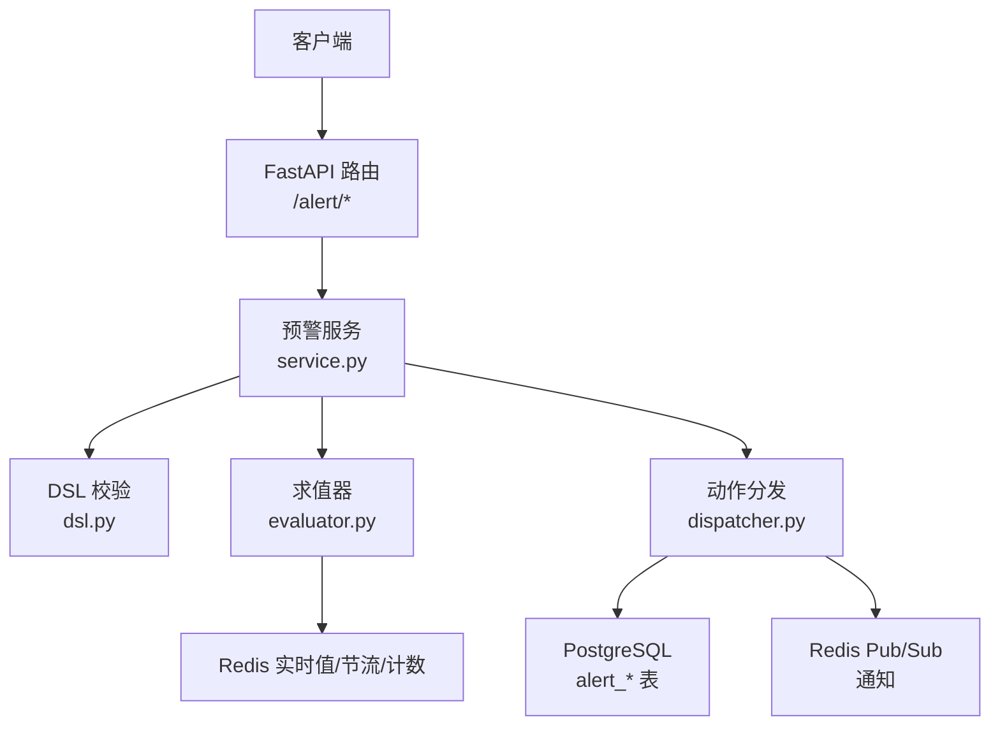
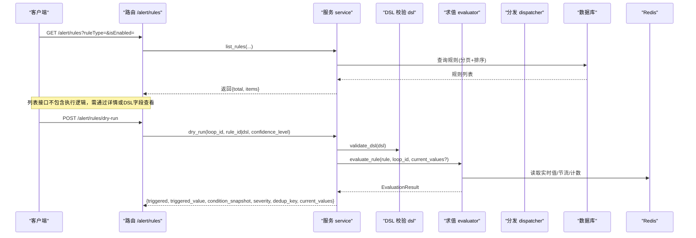
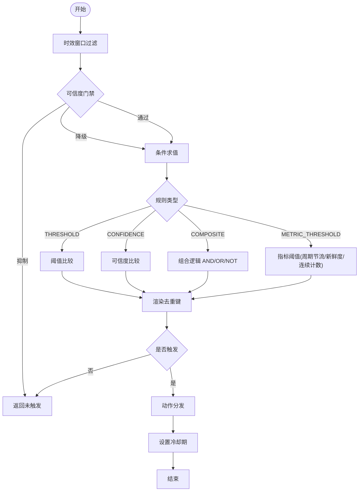
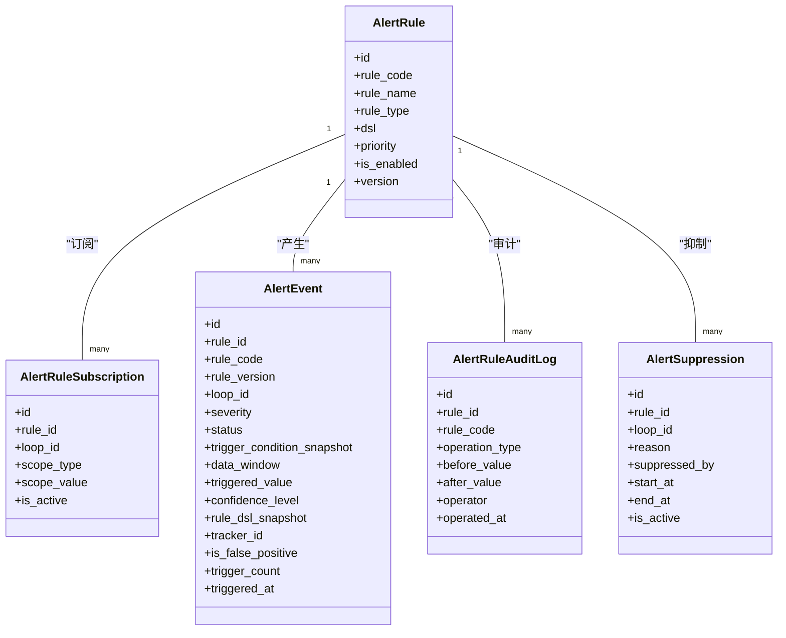

# 专家规则管理接口

<cite>
**本文引用的文件**
- [backend/app/api/v1/endpoints/alert.py](file://backend/app/api/v1/endpoints/alert.py)
- [backend/app/services/alert_rule_engine/service.py](file://backend/app/services/alert_rule_engine/service.py)
- [backend/app/services/alert_rule_engine/evaluator.py](file://backend/app/services/alert_rule_engine/evaluator.py)
- [backend/app/services/alert_rule_engine/dsl.py](file://backend/app/services/alert_rule_engine/dsl.py)
- [backend/app/services/alert_rule_engine/dispatcher.py](file://backend/app/services/alert_rule_engine/dispatcher.py)
- [backend/app/models/alert.py](file://backend/app/models/alert.py)
- [backend/app/schemas/alert.py](file://backend/app/schemas/alert.py)
</cite>

## 目录
1. [简介](#简介)
2. [项目结构](#项目结构)
3. [核心组件](#核心组件)
4. [架构总览](#架构总览)
5. [详细组件分析](#详细组件分析)
6. [依赖关系分析](#依赖关系分析)
7. [性能考量](#性能考量)
8. [故障排查指南](#故障排查指南)
9. [结论](#结论)
10. [附录：API 参考与规范](#附录api-参考与规范)

## 简介
本文件为 CLPM-MVP 专家规则引擎的完整 API 文档，覆盖以下目标：
- 获取专家规则列表接口：支持按规则类型、优先级、启用状态筛选，返回规则的完整定义和执行逻辑。
- 更新专家规则接口：条件表达式语法、动作类型配置、优先级设置、执行参数传递。
- 规则引擎执行机制：条件匹配算法、动作执行流程、异常处理策略。
- 规则模板管理、批量导入导出、规则冲突检测能力说明。
- 规则编写规范与调试工具使用指南（Dry-Run）。

## 项目结构
后端采用 FastAPI 分层架构：
- API 层：路由与入参校验，调用服务层。
- 服务层：业务编排（CRUD、DSL 校验、求值、分发、抑制、审计）。
- 模型层：数据库 ORM 映射（规则、订阅、事件、抑制、审计日志）。
- DSL 与求值器：规则 DSL 解析/校验、条件求值、数据源读取。
- 动作分发：创建事件、通知、工单、诊断任务等。

图表来源
- [backend/app/api/v1/endpoints/alert.py:1-467](file://backend/app/api/v1/endpoints/alert.py#L1-L467)
- [backend/app/services/alert_rule_engine/service.py:1-750](file://backend/app/services/alert_rule_engine/service.py#L1-L750)
- [backend/app/services/alert_rule_engine/evaluator.py:1-678](file://backend/app/services/alert_rule_engine/evaluator.py#L1-L678)
- [backend/app/services/alert_rule_engine/dsl.py:1-581](file://backend/app/services/alert_rule_engine/dsl.py#L1-L581)
- [backend/app/services/alert_rule_engine/dispatcher.py:1-362](file://backend/app/services/alert_rule_engine/dispatcher.py#L1-L362)
- [backend/app/models/alert.py:1-264](file://backend/app/models/alert.py#L1-L264)

章节来源
- [backend/app/api/v1/endpoints/alert.py:1-467](file://backend/app/api/v1/endpoints/alert.py#L1-L467)
- [backend/app/services/alert_rule_engine/service.py:1-750](file://backend/app/services/alert_rule_engine/service.py#L1-L750)

## 核心组件
- 规则 CRUD 服务：创建、更新、启停、删除、查询；包含 DSL 校验、版本控制、审计记录。
- 订阅管理：规则与回路的订阅关系，支持 ALL/LOOP/PLANT/CONTROL_TYPE 范围。
- 事件管理：事件查询、确认、处置、归档、误报标记。
- 手动抑制：对规则或回路在时间段内抑制告警。
- 全局开关：暂停/恢复整个预警引擎。
- Dry-Run 试运行：不持久化、不触发动作，仅返回求值结果与当前值快照。

章节来源
- [backend/app/services/alert_rule_engine/service.py:137-750](file://backend/app/services/alert_rule_engine/service.py#L137-L750)
- [backend/app/schemas/alert.py:31-277](file://backend/app/schemas/alert.py#L31-L277)

## 架构总览
预警引擎执行链路：
1. 周期巡检或外部触发 → 取回路订阅的规则集合。
2. 时效窗口过滤 → 可信度门禁 → 条件求值（阈值/置信度/组合）→ 去重键渲染。
3. 若触发 → 进入动作分发：创建事件、通知、工单、诊断任务。
4. 冷却期与重复触发计数 → 严重度升级。
5. 所有写操作伴随审计日志。

图表来源
- [backend/app/api/v1/endpoints/alert.py:81-179](file://backend/app/api/v1/endpoints/alert.py#L81-L179)
- [backend/app/services/alert_rule_engine/service.py:269-750](file://backend/app/services/alert_rule_engine/service.py#L269-L750)
- [backend/app/services/alert_rule_engine/evaluator.py:56-136](file://backend/app/services/alert_rule_engine/evaluator.py#L56-L136)
- [backend/app/services/alert_rule_engine/dsl.py:96-294](file://backend/app/services/alert_rule_engine/dsl.py#L96-L294)

## 详细组件分析

### 获取专家规则列表接口
- 路由：GET /alert/rules
- 查询参数：
  - ruleType：规则类型筛选（THRESHOLD/DRIFT/COMPOSITE/CONFIDENCE）
  - isEnabled：启用状态筛选
  - limit/offset：分页
- 返回：
  - total：总数
  - items：规则项列表（包含 rule_id/rule_code/rule_name/rule_type/dsl/priority/is_enabled/version 等）
- 权限：需要 alert:view 权限
- 排序：按 priority 升序、created_at 降序

章节来源
- [backend/app/api/v1/endpoints/alert.py:81-94](file://backend/app/api/v1/endpoints/alert.py#L81-L94)
- [backend/app/services/alert_rule_engine/service.py:269-291](file://backend/app/services/alert_rule_engine/service.py#L269-L291)
- [backend/app/schemas/alert.py:53-76](file://backend/app/schemas/alert.py#L53-L76)

### 更新专家规则接口
- 路由：PUT /alert/rules/{ruleId}
- 请求体：
  - rule_name、description、priority、is_enabled、dsl（可选）
- 行为：
  - 若提供 dsl，先进行 DSL 校验
  - 更新后 version + 1，记录审计日志
  - 失效对应规则缓存
- 权限：ADMIN

章节来源
- [backend/app/api/v1/endpoints/alert.py:120-132](file://backend/app/api/v1/endpoints/alert.py#L120-L132)
- [backend/app/services/alert_rule_engine/service.py:183-216](file://backend/app/services/alert_rule_engine/service.py#L183-L216)
- [backend/app/schemas/alert.py:43-51](file://backend/app/schemas/alert.py#L43-L51)

### 规则 DSL 与条件表达式
- 支持的规则类型：
  - METRIC_THRESHOLD（指标阈值预警，主推）
  - THRESHOLD（实时值阈值）
  - DRIFT（漂移，Phase 2）
  - COMPOSITE（组合条件，Phase 1 支持 AND/OR/NOT）
  - CONFIDENCE（可信度联动）
- 通用字段：durationSeconds、cooldownSeconds、severity、confidencePolicy、timeWindow、actions、priority、dedupKey
- 条件表达式：
  - THRESHOLD：metric ∈ {PV, SP, OP, MODE, PID_P, PID_I, PID_D}；operator ∈ {>, >=, <, <=, ==, !=, IN, NOT_IN, RATE_OF_CHANGE}
  - METRIC_THRESHOLD：metricSource ∈ {KPI, DIAGNOSIS}；metricCode 白名单；operator ∈ {>, >=, <, <=}；checkIntervalMinutes、durationCount
  - COMPOSITE：logic ∈ {AND, OR, NOT, SEQUENCE}；operands 嵌套
  - CONFIDENCE：maxLevel ∈ {A,B,C,D,E}
- 校验：validate_dsl 严格校验并返回字段级错误

章节来源
- [backend/app/services/alert_rule_engine/dsl.py:26-76](file://backend/app/services/alert_rule_engine/dsl.py#L26-L76)
- [backend/app/services/alert_rule_engine/dsl.py:96-294](file://backend/app/services/alert_rule_engine/dsl.py#L96-L294)
- [backend/app/services/alert_rule_engine/dsl.py:302-557](file://backend/app/services/alert_rule_engine/dsl.py#L302-L557)

### 动作类型与执行参数
- 动作类型：
  - CREATE_EVENT：创建预警事件（必须存在）
  - CREATE_TRACKER：创建异常跟踪工单（与事件可关联）
  - NOTIFY：发布站内信通知（Redis Pub/Sub）
  - TRIGGER_DIAGNOSIS：自动发起诊断任务（模块热插拔，防抖）
- 执行参数：
  - actions 数组中每个动作的 type 及可选参数
  - METRIC_THRESHOLD 仅允许 CREATE_EVENT/NOTIFY
- 执行流程：
  - 计算最终严重度（基于冷却期内重复触发次数）
  - 逐个执行动作，单个失败不影响其他动作
  - 设置冷却期与持续时间清零

章节来源
- [backend/app/services/alert_rule_engine/dispatcher.py:1-102](file://backend/app/services/alert_rule_engine/dispatcher.py#L1-L102)
- [backend/app/services/alert_rule_engine/dispatcher.py:105-201](file://backend/app/services/alert_rule_engine/dispatcher.py#L105-L201)
- [backend/app/services/alert_rule_engine/dispatcher.py:215-362](file://backend/app/services/alert_rule_engine/dispatcher.py#L215-L362)
- [backend/app/services/alert_rule_engine/dsl.py:241-266](file://backend/app/services/alert_rule_engine/dsl.py#L241-L266)

### 规则引擎执行机制
- 条件匹配算法：
  - 时效窗口过滤（cron 小时段简化实现）
  - 可信度门禁（SUPPRESS/DOWNGRADE）
  - 条件求值（阈值/置信度/组合）
  - 去重键渲染（dedupKey 模板变量）
- 持续时长检查：durationSeconds（Phase 1 由调度侧配合）
- 数据源：
  - 实时轨：Redis realtime:* 缓存（7 tag）
  - 周期轨：TDengine（通过 get_provider）
  - 指标阈值：KPI 最新值（loop_confidence_latest）或诊断结果（diagnosis_run）
- 异常处理：
  - 求值异常记录日志并跳过该规则
  - 动作异常独立 try/except，记录 outcomes
  - Redis 不可用降级（如周期节流、连续计数）

图表来源
- [backend/app/services/alert_rule_engine/evaluator.py:56-136](file://backend/app/services/alert_rule_engine/evaluator.py#L56-L136)
- [backend/app/services/alert_rule_engine/evaluator.py:144-235](file://backend/app/services/alert_rule_engine/evaluator.py#L144-L235)
- [backend/app/services/alert_rule_engine/evaluator.py:243-320](file://backend/app/services/alert_rule_engine/evaluator.py#L243-L320)
- [backend/app/services/alert_rule_engine/evaluator.py:451-556](file://backend/app/services/alert_rule_engine/evaluator.py#L451-L556)
- [backend/app/services/alert_rule_engine/dispatcher.py:40-102](file://backend/app/services/alert_rule_engine/dispatcher.py#L40-L102)

### 规则模板管理、批量导入导出、冲突检测
- 规则模板管理：
  - 当前仓库未提供专用“模板”实体；可通过保存标准 DSL 到规则库复用，或使用 Dry-Run 验证模板。
- 批量导入导出：
  - 当前仓库未提供规则批量导入/导出 API；建议通过脚本或后台任务实现（基于规则列表与 DSL 序列化）。
- 规则冲突检测：
  - 当前仓库未提供显式冲突检测 API；可通过订阅范围（ALL/PLANT/CONTROL_TYPE）与优先级（priority）进行人工审查，结合审计日志追踪变更。
- 建议实践：
  - 使用统一的命名规范与注释（description）
  - 通过 Dry-Run 验证 DSL 正确性
  - 利用优先级与时间窗口避免重叠触发

章节来源
- [backend/app/services/alert_rule_engine/service.py:142-180](file://backend/app/services/alert_rule_engine/service.py#L142-L180)
- [backend/app/services/alert_rule_engine/service.py:269-291](file://backend/app/services/alert_rule_engine/service.py#L269-L291)
- [backend/app/services/alert_rule_engine/dsl.py:96-294](file://backend/app/services/alert_rule_engine/dsl.py#L96-L294)

### 规则编写规范
- 必填字段：
  - ruleType、condition、actions（至少一个且包含 CREATE_EVENT）、priority≥1
- 推荐实践：
  - 明确 timeWindow 与 cooldownSeconds 避免风暴
  - 合理设置 severity 与 confidencePolicy
  - 使用 dedupKey 控制去重粒度
  - 对 METRIC_THRESHOLD 设置合适的 checkIntervalMinutes 与 durationCount
- 限制：
  - DSL 序列化长度上限
  - 嵌套深度限制（COMPOSITE）
  - 百分比阈值与量程引用（Phase 2）

章节来源
- [backend/app/services/alert_rule_engine/dsl.py:71-76](file://backend/app/services/alert_rule_engine/dsl.py#L71-L76)
- [backend/app/services/alert_rule_engine/dsl.py:169-294](file://backend/app/services/alert_rule_engine/dsl.py#L169-L294)
- [backend/app/services/alert_rule_engine/dsl.py:325-408](file://backend/app/services/alert_rule_engine/dsl.py#L325-L408)

### 调试工具使用指南（Dry-Run）
- 路由：POST /alert/rules/dry-run
- 模式：
  - 传入 rule_id：使用已有规则 DSL 试运行
  - 传入 dsl：自定义 DSL 试运行（先校验合法性）
- 返回：
  - triggered、triggered_value、condition_snapshot、severity、confidence_level、dedup_key、current_values
- 用途：
  - 验证条件表达式与数据源取值
  - 测试 confidencePolicy 与 timeWindow
  - 观察去重键生成与当前值快照

章节来源
- [backend/app/api/v1/endpoints/alert.py:160-179](file://backend/app/api/v1/endpoints/alert.py#L160-L179)
- [backend/app/services/alert_rule_engine/service.py:682-750](file://backend/app/services/alert_rule_engine/service.py#L682-L750)
- [backend/app/schemas/alert.py:248-277](file://backend/app/schemas/alert.py#L248-L277)

## 依赖关系分析
- API 层依赖服务层：路由仅做参数校验与调用。
- 服务层依赖：
  - DSL 校验：validate_dsl
  - 求值器：evaluate_rule、evaluate_loop_rules
  - 动作分发：dispatch
  - 抑制器：Suppressor（冷却期、徽章、触发计数）
  - 缓存：invalidate_rule_cache/invalidate_all_cache
  - 审计：write_audit
- 模型层：alert_rule、alert_rule_subscription、alert_event、alert_rule_audit_log、alert_suppression
- 外部依赖：
  - Redis：实时值、节流、计数、通知
  - PostgreSQL：规则、事件、审计、订阅、抑制
  - TDengine：周期轨数据（通过 provider）

图表来源
- [backend/app/models/alert.py:36-264](file://backend/app/models/alert.py#L36-L264)

章节来源
- [backend/app/models/alert.py:1-264](file://backend/app/models/alert.py#L1-L264)
- [backend/app/services/alert_rule_engine/service.py:17-34](file://backend/app/services/alert_rule_engine/service.py#L17-L34)

## 性能考量
- 周期节流：METRIC_THRESHOLD 使用 Redis SETNX 控制检查频率，避免频繁查询。
- 连续超限计数：Redis INCR 统计，达到阈值才触发，降低噪声。
- 批量求值：evaluate_loop_rules 共享一次实时值读取，减少 Redis 访问。
- 索引优化：规则表按 is_enabled、priority 建索引；事件表按 loop_id、severity、status 建索引。
- 降级策略：Redis 不可用时，周期节流与计数降级为直接判定，保证可用性。

章节来源
- [backend/app/services/alert_rule_engine/evaluator.py:451-556](file://backend/app/services/alert_rule_engine/evaluator.py#L451-L556)
- [backend/app/services/alert_rule_engine/evaluator.py:642-678](file://backend/app/services/alert_rule_engine/evaluator.py#L642-L678)
- [backend/app/models/alert.py:64-71](file://backend/app/models/alert.py#L64-L71)
- [backend/app/models/alert.py:170-188](file://backend/app/models/alert.py#L170-L188)

## 故障排查指南
- DSL 校验失败：
  - 检查 ruleType、condition、actions、priority 等字段是否符合白名单与范围
  - 关注 ValidationError 的 errors 列表定位具体字段
- 规则未触发：
  - 检查 timeWindow 是否生效
  - 检查 confidencePolicy 是否抑制或降级
  - 检查 METRIC_THRESHOLD 的 checkIntervalMinutes 与 durationCount
- 事件过多或重复：
  - 调整 dedupKey 模板与 cooldownSeconds
  - 检查冷却期与重复触发计数
- 通知未送达：
  - 检查 Redis Pub/Sub 通道与用户角色
  - 查看徽章计数是否递增
- 诊断任务未触发：
  - 检查诊断模块是否启用
  - 检查防抖窗口（同回路 6h 内 EVENT 诊断）

章节来源
- [backend/app/services/alert_rule_engine/dsl.py:96-294](file://backend/app/services/alert_rule_engine/dsl.py#L96-L294)
- [backend/app/services/alert_rule_engine/evaluator.py:77-136](file://backend/app/services/alert_rule_engine/evaluator.py#L77-L136)
- [backend/app/services/alert_rule_engine/dispatcher.py:215-362](file://backend/app/services/alert_rule_engine/dispatcher.py#L215-L362)

## 结论
本规则引擎提供完整的规则生命周期管理能力，涵盖 DSL 校验、条件求值、动作分发、抑制与审计。通过 Dry-Run 与完善的错误信息，便于快速调试与迭代。建议在大规模部署时结合周期节流、冷却期与优先级策略，确保系统稳定与低噪声。

## 附录：API 参考与规范

### 规则相关端点
- GET /alert/rules
  - 查询参数：ruleType、isEnabled、limit、offset
  - 返回：{total, items}
- POST /alert/rules
  - 请求体：AlertRuleCreate
  - 权限：ADMIN
- GET /alert/rules/{ruleId}
  - 返回：AlertRuleItem
- PUT /alert/rules/{ruleId}
  - 请求体：AlertRuleUpdate
  - 权限：ADMIN
- DELETE /alert/rules/{ruleId}
  - 权限：ADMIN
- PUT /alert/rules/{ruleId}/toggle
  - 查询参数：enabled
  - 权限：ADMIN

章节来源
- [backend/app/api/v1/endpoints/alert.py:81-179](file://backend/app/api/v1/endpoints/alert.py#L81-L179)
- [backend/app/schemas/alert.py:31-76](file://backend/app/schemas/alert.py#L31-L76)

### 订阅相关端点
- GET /alert/rules/{ruleId}/subscriptions
  - 返回：订阅列表
- POST /alert/rules/{ruleId}/subscriptions
  - 请求体：AlertSubscriptionCreate
  - 权限：ADMIN/IC_ENGINEER
- GET /alert/subscriptions
  - 查询参数：loopId
  - 返回：订阅列表
- DELETE /alert/subscriptions/{subscriptionId}
  - 权限：ADMIN/IC_ENGINEER

章节来源
- [backend/app/api/v1/endpoints/alert.py:187-240](file://backend/app/api/v1/endpoints/alert.py#L187-L240)
- [backend/app/schemas/alert.py:83-102](file://backend/app/schemas/alert.py#L83-L102)

### 事件相关端点
- GET /alert/events
  - 查询参数：loopId、ruleId、severity、status、startTime、endTime、limit、offset
  - 返回：{total, items}
- GET /alert/events/{eventId}
  - 返回：AlertEventItem
- POST /alert/events/{eventId}/acknowledge
  - 请求体：AlertEventAcknowledge
  - 权限：ADMIN/IC_ENGINEER
- POST /alert/events/{eventId}/resolve
  - 请求体：AlertEventResolve
  - 权限：ADMIN/IC_ENGINEER
- POST /alert/events/{eventId}/false-positive
  - 请求体：AlertEventFalsePositive
  - 权限：ADMIN/IC_ENGINEER
- POST /alert/events/{eventId}/archive
  - 权限：ADMIN

章节来源
- [backend/app/api/v1/endpoints/alert.py:248-335](file://backend/app/api/v1/endpoints/alert.py#L248-L335)
- [backend/app/schemas/alert.py:109-159](file://backend/app/schemas/alert.py#L109-L159)

### 抑制与审计
- GET /alert/suppressions
  - 查询参数：ruleId、loopId、isActive、limit、offset
  - 返回：{total, items}
- POST /alert/suppressions
  - 请求体：AlertSuppressionCreate
  - 权限：ADMIN/IC_ENGINEER
- DELETE /alert/suppressions/{suppressionId}
  - 权限：ADMIN/IC_ENGINEER
- GET /alert/audit-logs
  - 查询参数：ruleId、operator、operationType、limit、offset
  - 返回：{total, items}

章节来源
- [backend/app/api/v1/endpoints/alert.py:343-413](file://backend/app/api/v1/endpoints/alert.py#L343-L413)
- [backend/app/schemas/alert.py:166-218](file://backend/app/schemas/alert.py#L166-L218)

### 全局开关与徽章
- GET /alert/global-switch
  - 返回：{enabled}
- PUT /alert/global-switch
  - 请求体：AlertGlobalSwitch
  - 权限：ADMIN
- GET /alert/badge
  - 返回：{count}
- POST /alert/badge/reset
  - 返回：{count}

章节来源
- [backend/app/api/v1/endpoints/alert.py:421-463](file://backend/app/api/v1/endpoints/alert.py#L421-L463)
- [backend/app/schemas/alert.py:226-241](file://backend/app/schemas/alert.py#L226-L241)

### 试运行（Dry-Run）
- POST /alert/rules/dry-run
  - 请求体：AlertDryRunRequest
  - 返回：{triggered, triggered_value, condition_snapshot, severity, confidence_level, dedup_key, current_values}

章节来源
- [backend/app/api/v1/endpoints/alert.py:160-179](file://backend/app/api/v1/endpoints/alert.py#L160-L179)
- [backend/app/schemas/alert.py:248-277](file://backend/app/schemas/alert.py#L248-L277)