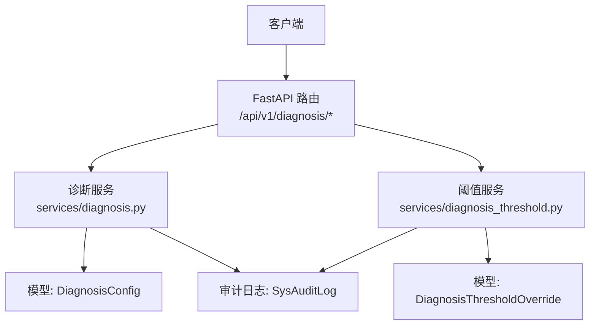
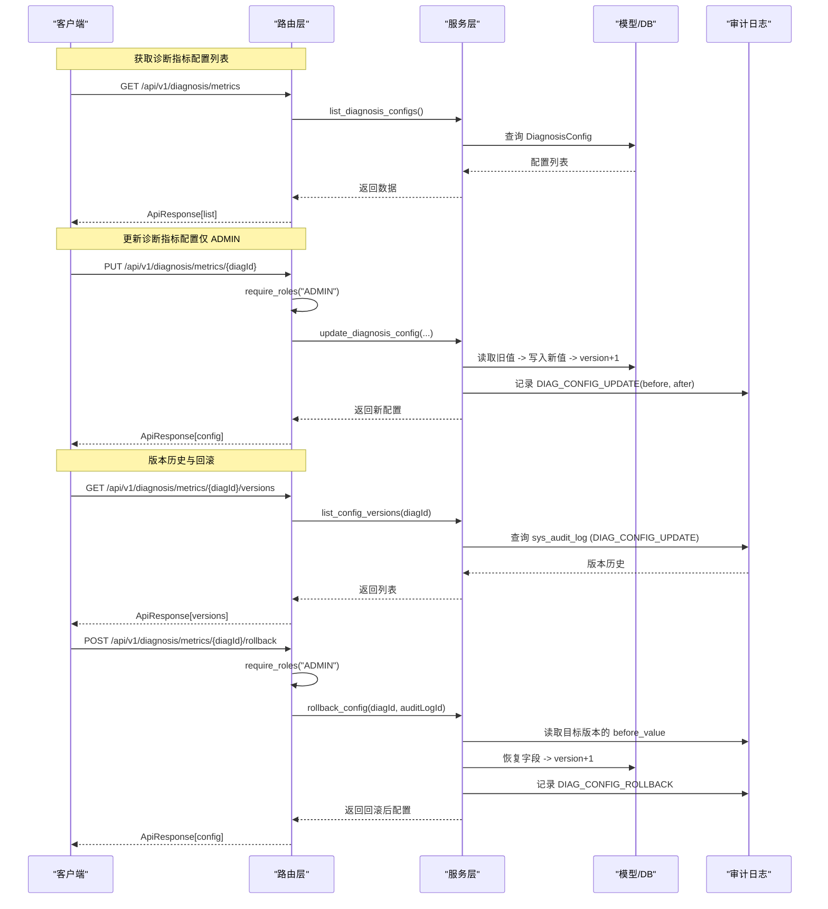
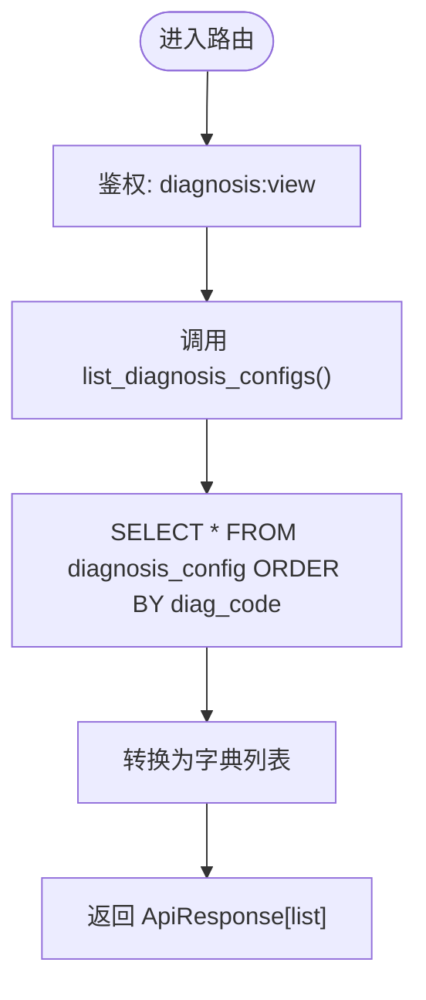
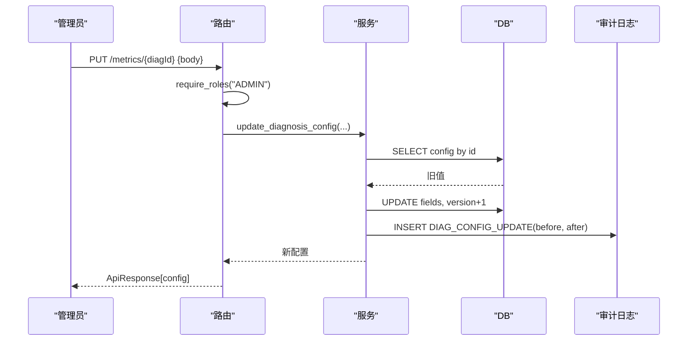
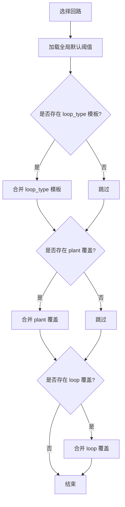
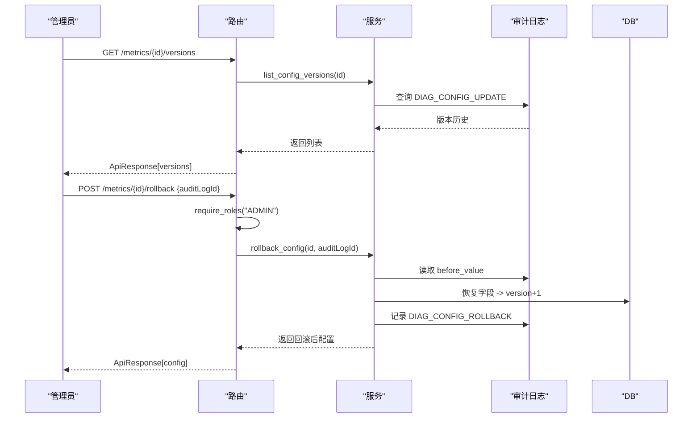
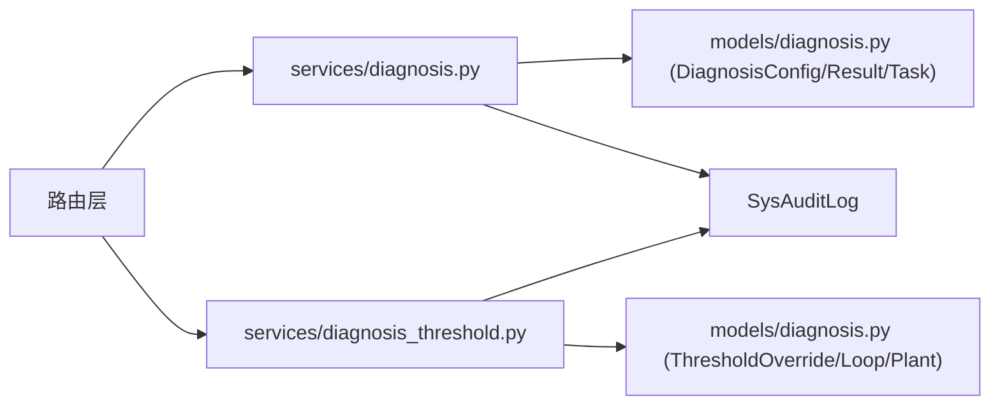

# 诊断指标配置接口

<cite>
**本文引用的文件**
- [diagnosis.py](file://backend/app/api/v1/endpoints/diagnosis.py)
- [diagnosis.py](file://backend/app/services/diagnosis.py)
- [diagnosis_threshold.py](file://backend/app/services/diagnosis_threshold.py)
- [diagnosis.py](file://backend/app/models/diagnosis.py)
- [diagnosis.py](file://backend/app/schemas/diagnosis.py)
</cite>

## 目录
1. [简介](#简介)
2. [项目结构](#项目结构)
3. [核心组件](#核心组件)
4. [架构总览](#架构总览)
5. [详细组件分析](#详细组件分析)
6. [依赖关系分析](#依赖关系分析)
7. [性能考虑](#性能考虑)
8. [故障排查指南](#故障排查指南)
9. [结论](#结论)
10. [附录：API 定义与最佳实践](#附录api-定义与最佳实践)

## 简介
本 API 文档聚焦 CLPM-MVP 诊断指标配置系统，覆盖以下能力：
- 获取诊断指标配置列表：支持按指标类型、启用状态筛选，返回完整指标元数据。
- 更新诊断指标配置：参数包括算法类型、计算方法、阈值设置、启用/禁用控制；仅 ADMIN 角色可操作。
- 版本管理与回滚：每次变更自动记录审计日志，支持版本历史查询与回滚到指定版本。
- 指标参数验证规则、默认值处理、批量更新能力说明。
- 配置最佳实践与常见错误排查指南。

## 项目结构
后端采用 FastAPI 路由 + 服务层 + 模型/Schema 的分层设计：
- 路由层：暴露 RESTful 接口，负责鉴权、参数校验、调用服务层。
- 服务层：封装业务逻辑（配置 CRUD、阈值覆盖、版本回滚等）。
- 模型层：数据库表映射（如 diagnosis_config、diagnosis_threshold_override、sys_audit_log）。
- Schema 层：请求/响应数据契约（Pydantic 模型）。

图表来源
- [diagnosis.py:1-190](file://backend/app/api/v1/endpoints/diagnosis.py#L1-L190)
- [diagnosis.py:298-365](file://backend/app/services/diagnosis.py#L298-L365)
- [diagnosis_threshold.py:59-144](file://backend/app/services/diagnosis_threshold.py#L59-L144)
- [diagnosis.py:29-49](file://backend/app/models/diagnosis.py#L29-L49)

章节来源
- [diagnosis.py:1-190](file://backend/app/api/v1/endpoints/diagnosis.py#L1-L190)
- [diagnosis.py:298-365](file://backend/app/services/diagnosis.py#L298-L365)
- [diagnosis_threshold.py:59-144](file://backend/app/services/diagnosis_threshold.py#L59-L144)
- [diagnosis.py:29-49](file://backend/app/models/diagnosis.py#L29-L49)

## 核心组件
- 诊断指标配置（DiagnosisConfig）：存储每个诊断指标的元数据与阈值、启用状态、版本等。
- 差异化阈值覆盖（DiagnosisThresholdOverride）：支持 loop_type/plant/loop 三级覆盖，形成四级生效优先级。
- 审计日志（SysAuditLog）：记录所有关键配置的变更历史，支撑版本查询与回滚。
- 路由与权限：GET /metrics 对所有登录用户开放；PUT /metrics/{id} 仅 ADMIN 可写。

章节来源
- [diagnosis.py:29-49](file://backend/app/models/diagnosis.py#L29-L49)
- [diagnosis.py:250-295](file://backend/app/models/diagnosis.py#L250-L295)
- [diagnosis.py:160-189](file://backend/app/api/v1/endpoints/diagnosis.py#L160-L189)

## 架构总览
下图展示“获取配置列表”和“更新配置并回滚”的端到端流程。

图表来源
- [diagnosis.py:160-189](file://backend/app/api/v1/endpoints/diagnosis.py#L160-L189)
- [diagnosis.py:348-378](file://backend/app/api/v1/endpoints/diagnosis.py#L348-L378)
- [diagnosis.py:298-365](file://backend/app/services/diagnosis.py#L298-L365)
- [diagnosis_threshold.py:469-591](file://backend/app/services/diagnosis_threshold.py#L469-L591)

## 详细组件分析

### 组件一：获取诊断指标配置列表
- 路由：GET /api/v1/diagnosis/metrics
- 权限：所有登录用户可查看（require_perms("diagnosis:view")）
- 功能：返回全部诊断指标配置项，包含 diagCode、diagName、algorithmType、calcMethod、params、threshold、isEnabled、version、updatedBy、updatedAt 等元数据。
- 筛选能力：当前实现为全量返回；如需按指标类型或启用状态筛选，可在路由层增加 Query 参数并在服务层构建条件查询。

图表来源
- [diagnosis.py:160-167](file://backend/app/api/v1/endpoints/diagnosis.py#L160-L167)
- [diagnosis.py:298-302](file://backend/app/services/diagnosis.py#L298-L302)

章节来源
- [diagnosis.py:160-167](file://backend/app/api/v1/endpoints/diagnosis.py#L160-L167)
- [diagnosis.py:298-302](file://backend/app/services/diagnosis.py#L298-L302)

### 组件二：更新诊断指标配置（仅 ADMIN）
- 路由：PUT /api/v1/diagnosis/metrics/{diag_id}
- 权限：require_roles("ADMIN")
- 请求体字段（可选）：
  - diagName：指标名称
  - algorithmType：算法类型
  - calcMethod：计算方法
  - params：参数对象（JSON）
  - threshold：阈值对象（JSONB）
  - isEnabled：启用/禁用开关
- 行为：
  - 若存在该配置则更新对应字段，version 自增，updated_by/updated_at 更新。
  - 写入审计日志（before/after），便于后续版本查询与回滚。
  - 返回更新后的配置项。

图表来源
- [diagnosis.py:170-189](file://backend/app/api/v1/endpoints/diagnosis.py#L170-L189)
- [diagnosis.py:305-365](file://backend/app/services/diagnosis.py#L305-L365)

章节来源
- [diagnosis.py:170-189](file://backend/app/api/v1/endpoints/diagnosis.py#L170-L189)
- [diagnosis.py:305-365](file://backend/app/services/diagnosis.py#L305-L365)

### 组件三：阈值覆盖与模板化（P3-02）
- 覆盖范围：loop_type（回路类型模板）、plant（装置级）、loop（回路级），与全局默认共同构成四级优先级。
- 推荐与套用：
  - GET /diagnosis/threshold-recommendations?loopId=...：返回该回路各 diag_code 的合并阈值视图与生效链。
  - POST /diagnosis/threshold-templates/apply：一键将模板套用到回路或装置（ic_engineer 仅限 loop scope）。
- 权限边界：IC_ENGINEER 仅能微调 loop scope；loop_type/plant 需 ADMIN。

图表来源
- [diagnosis_threshold.py:217-373](file://backend/app/services/diagnosis_threshold.py#L217-L373)

章节来源
- [diagnosis_threshold.py:59-144](file://backend/app/services/diagnosis_threshold.py#L59-L144)
- [diagnosis_threshold.py:217-373](file://backend/app/services/diagnosis_threshold.py#L217-L373)
- [diagnosis_threshold.py:376-461](file://backend/app/services/diagnosis_threshold.py#L376-L461)

### 组件四：版本管理与回滚（C4）
- 版本历史：GET /diagnosis/metrics/{diag_id}/versions
  - 从 sys_audit_log 中读取 DIAG_CONFIG_UPDATE 变更记录，按时间倒序返回。
  - 每条记录包含 auditLogId、version、beforeValue、afterValue、operatedBy、operatedAt。
- 回滚：POST /diagnosis/metrics/{diag_id}/rollback
  - 仅 ADMIN 可操作。
  - 根据 auditLogId 读取目标版本的 before_value，恢复到该状态，并记录 DIAG_CONFIG_ROLLBACK 审计日志。
  - 回滚后 version 自增，避免覆盖历史。

图表来源
- [diagnosis.py:348-378](file://backend/app/api/v1/endpoints/diagnosis.py#L348-L378)
- [diagnosis_threshold.py:469-591](file://backend/app/services/diagnosis_threshold.py#L469-L591)

章节来源
- [diagnosis.py:348-378](file://backend/app/api/v1/endpoints/diagnosis.py#L348-L378)
- [diagnosis_threshold.py:469-591](file://backend/app/services/diagnosis_threshold.py#L469-L591)

### 组件五：指标参数验证规则与默认值
- 参数校验：
  - 路由层使用 Pydantic 模型对请求体进行强类型校验（长度、必填、枚举等）。
  - 服务层对非法 scope_type、权限越界等进行 BizError 抛出。
- 默认值：
  - DiagnosisConfig.is_enabled 默认 True。
  - DiagnosisConfig.version 默认 1。
  - 阈值覆盖未命中时，回退到全局默认阈值。
- 批量更新：
  - 当前接口为单条更新；批量更新可通过循环调用同一接口或在服务层扩展批量方法（建议结合幂等键与事务）。

章节来源
- [diagnosis.py:33-58](file://backend/app/schemas/diagnosis.py#L33-L58)
- [diagnosis_threshold.py:78-93](file://backend/app/services/diagnosis_threshold.py#L78-L93)
- [diagnosis.py:29-49](file://backend/app/models/diagnosis.py#L29-L49)

## 依赖关系分析
- 路由依赖：
  - 依赖 get_db、require_perms、require_roles 完成数据库会话与权限控制。
- 服务依赖：
  - services/diagnosis.py 依赖 models/diagnosis.py 中的 DiagnosisConfig、DiagnosisResult、DiagnosisTask 等。
  - services/diagnosis_threshold.py 依赖 models/diagnosis.py 中的 DiagnosisThresholdOverride、LoopLedger、PlantNode。
- 审计日志：
  - 所有写操作均通过 SysAuditLog 记录 before/after，支撑版本查询与回滚。

图表来源
- [diagnosis.py:1-190](file://backend/app/api/v1/endpoints/diagnosis.py#L1-L190)
- [diagnosis.py:298-365](file://backend/app/services/diagnosis.py#L298-L365)
- [diagnosis_threshold.py:59-144](file://backend/app/services/diagnosis_threshold.py#L59-L144)
- [diagnosis.py:29-49](file://backend/app/models/diagnosis.py#L29-L49)

章节来源
- [diagnosis.py:1-190](file://backend/app/api/v1/endpoints/diagnosis.py#L1-L190)
- [diagnosis.py:298-365](file://backend/app/services/diagnosis.py#L298-L365)
- [diagnosis_threshold.py:59-144](file://backend/app/services/diagnosis_threshold.py#L59-L144)
- [diagnosis.py:29-49](file://backend/app/models/diagnosis.py#L29-L49)

## 性能考虑
- 列表查询：当前为全表扫描并按 diag_code 排序；当指标数量较大时可考虑分页或索引优化。
- 阈值推荐：按回路计算合并阈值涉及多次查询，建议在高频场景引入缓存（如 Redis）以减少 DB 压力。
- 审计日志：写入频率较高，建议对 sys_audit_log 建立合适索引（target_type、target_id、operated_at）。
- 并发更新：更新配置时已递增 version，避免并发覆盖；必要时可增加乐观锁或分布式锁。

## 故障排查指南
- 404 诊断指标配置不存在：
  - 检查 diag_id 是否正确，确认配置是否已初始化。
- 403 权限不足：
  - 更新配置需要 ADMIN 角色；阈值覆盖 IC_ENGINEER 仅允许 loop scope。
- 422 参数不合法：
  - 检查请求体字段是否符合 Schema 约束（长度、枚举、必填）。
- 版本回滚失败：
  - 确保传入的 auditLogId 有效且存在 before_value；首次创建无 before_value 无法回滚。
- 阈值覆盖无效：
  - 检查 scope_type 与 scope_id 是否匹配；确认模板是否存在；注意优先级顺序（loop > plant > loop_type > global）。

章节来源
- [diagnosis.py:305-365](file://backend/app/services/diagnosis.py#L305-L365)
- [diagnosis_threshold.py:78-93](file://backend/app/services/diagnosis_threshold.py#L78-L93)
- [diagnosis_threshold.py:512-591](file://backend/app/services/diagnosis_threshold.py#L512-L591)

## 结论
本系统提供了完整的诊断指标配置管理能力：
- 安全的读写分离：读接口对所有登录用户开放，写接口严格限制为 ADMIN。
- 完善的版本管理：基于审计日志的版本历史与回滚机制，保障配置变更可追溯、可恢复。
- 灵活的阈值体系：四级优先级覆盖与模板化推荐，满足多场景差异化需求。
- 清晰的验证与默认值：Schema 强校验与服务层边界检查，降低误配风险。

## 附录：API 定义与最佳实践

### API 清单
- 获取诊断指标配置列表
  - 方法：GET
  - 路径：/api/v1/diagnosis/metrics
  - 权限：diagnosis:view
  - 响应：ApiResponse[list[DiagnosisConfigItem]]
- 更新诊断指标配置
  - 方法：PUT
  - 路径：/api/v1/diagnosis/metrics/{diag_id}
  - 权限：ADMIN
  - 请求体：DiagnosisConfigUpdate（可选字段：diagName、algorithmType、calcMethod、params、threshold、isEnabled）
  - 响应：ApiResponse[DiagnosisConfigItem]
- 版本历史查询
  - 方法：GET
  - 路径：/api/v1/diagnosis/metrics/{diag_id}/versions
  - 权限：diagnosis:view
  - 响应：ApiResponse[list[DiagnosisThresholdVersionItem]]
- 回滚到指定版本
  - 方法：POST
  - 路径：/api/v1/diagnosis/metrics/{diag_id}/rollback
  - 权限：ADMIN
  - 请求体：DiagnosisThresholdRollbackRequest（auditLogId）
  - 响应：ApiResponse[DiagnosisConfigItem]

章节来源
- [diagnosis.py:160-189](file://backend/app/api/v1/endpoints/diagnosis.py#L160-L189)
- [diagnosis.py:348-378](file://backend/app/api/v1/endpoints/diagnosis.py#L348-L378)
- [diagnosis.py:33-58](file://backend/app/schemas/diagnosis.py#L33-L58)
- [diagnosis.py:204-219](file://backend/app/schemas/diagnosis.py#L204-L219)

### 配置最佳实践
- 先模板后覆盖：优先在 loop_type 模板中设定通用阈值，再在 plant/loop 层级做精细化调整。
- 小步快改：每次只修改必要字段，配合版本历史快速回滚。
- 审批与双人确认：关键阈值变更建议走审批流（C5），避免单人误操作。
- 监控与告警：对频繁变更的配置项设置告警，便于及时发现异常。

### 常见错误排查
- 权限错误：确认角色是否为 ADMIN；IC_ENGINEER 仅能操作 loop scope。
- 参数校验失败：检查字段类型与长度；确保 threshold/params 为合法 JSON。
- 版本回滚失败：确认 auditLogId 存在且有 before_value；首次创建无法回滚。
- 阈值未生效：检查覆盖优先级与 scope 匹配；确认模板存在且未被更高优先级覆盖。