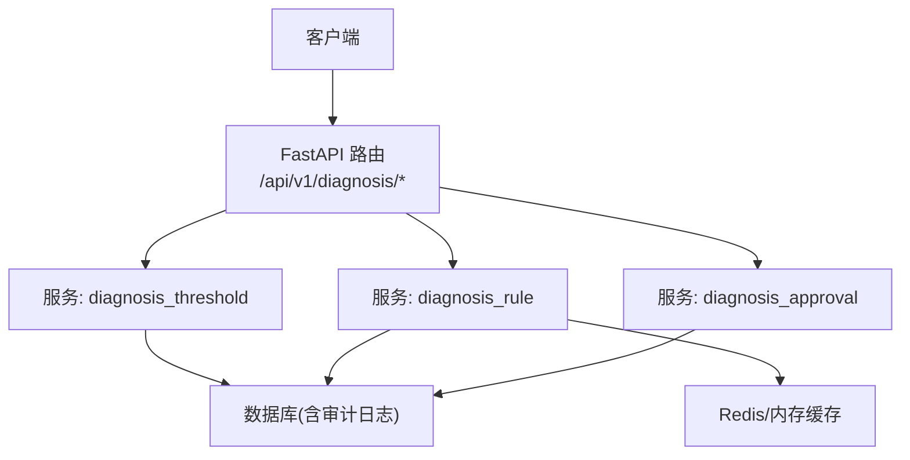
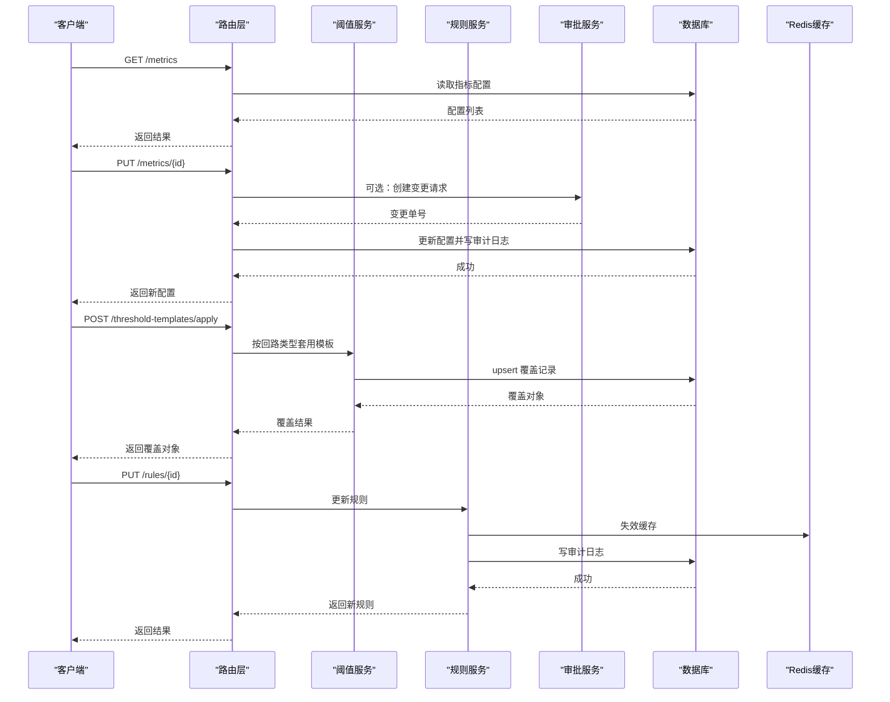
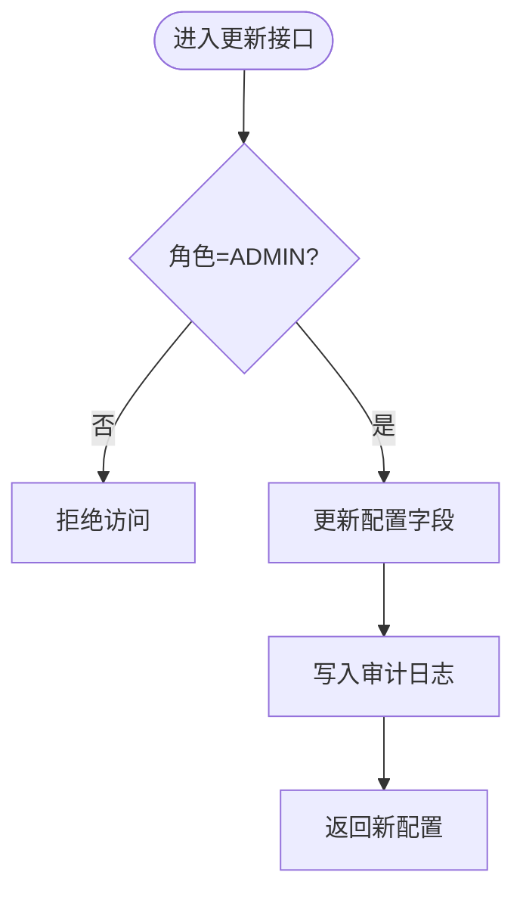
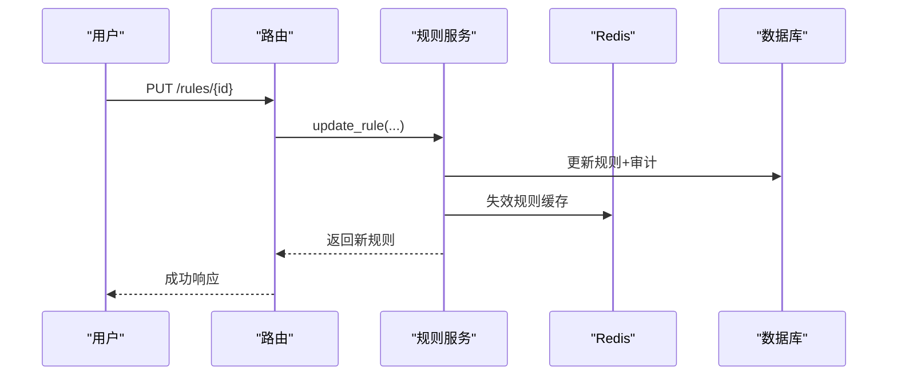
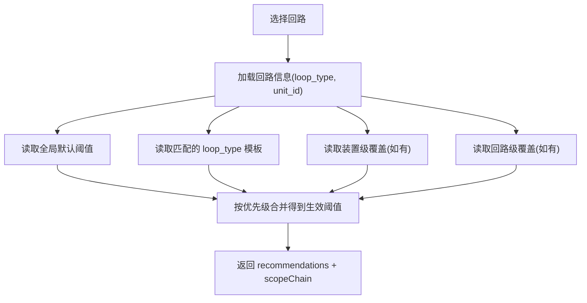
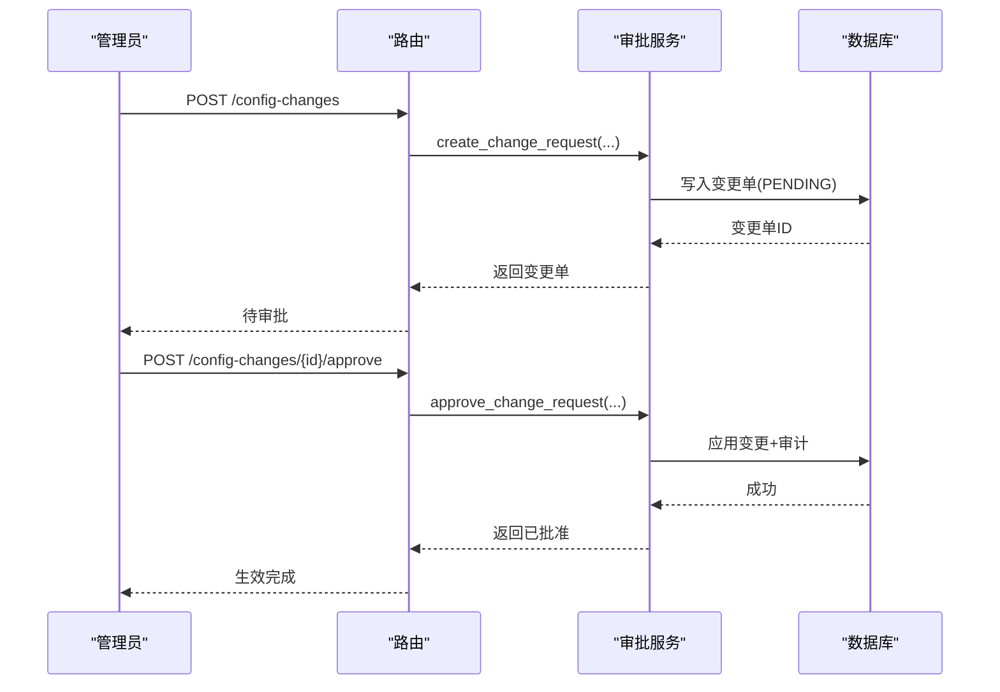
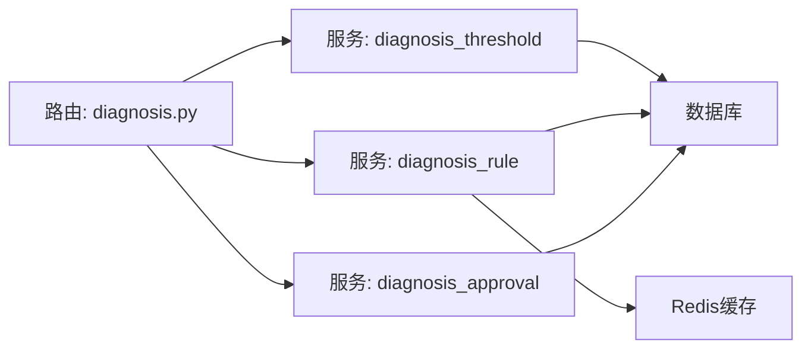

# 诊断配置接口

<cite>
**本文引用的文件**
- [diagnosis.py](file://backend/app/api/v1/endpoints/diagnosis.py)
- [diagnosis_v2.py](file://backend/app/api/v1/endpoints/diagnosis_v2.py)
- [diagnosis_threshold.py](file://backend/app/services/diagnosis_threshold.py)
- [diagnosis_rule.py](file://backend/app/services/diagnosis_rule.py)
- [diagnosis_approval.py](file://backend/app/services/diagnosis_approval.py)
</cite>

## 目录
1. [简介](#简介)
2. [项目结构](#项目结构)
3. [核心组件](#核心组件)
4. [架构总览](#架构总览)
5. [详细组件分析](#详细组件分析)
6. [依赖关系分析](#依赖关系分析)
7. [性能考虑](#性能考虑)
8. [故障排查指南](#故障排查指南)
9. [结论](#结论)
10. [附录：API 清单与最佳实践](#附录api-清单与最佳实践)

## 简介
本文件为 CLPM-MVP 诊断配置系统的 API 文档，聚焦以下能力：
- 诊断指标配置接口：指标列表查询、参数更新、启用/禁用控制。
- 专家规则管理接口：规则列表获取、条件表达式配置、优先级设置。
- 阈值覆盖管理接口：模板应用、范围覆盖、版本回滚。
- 配置审批流程接口：变更请求创建、审批通过/拒绝、审计日志查询。
并补充阈值推荐算法、模板管理机制、配置版本控制的技术实现说明，以及配置最佳实践与故障排查指南。

## 项目结构
后端采用 FastAPI 路由 + 服务层分层设计：
- API 路由层：定义 RESTful 端点、鉴权与入参校验。
- 服务层：封装业务逻辑（阈值覆盖、规则引擎、审批流等）。
- 数据模型与审计：使用 SQLAlchemy 模型与统一审计日志表记录变更。

图表来源
- [diagnosis.py:155-466](file://backend/app/api/v1/endpoints/diagnosis.py#L155-L466)
- [diagnosis_threshold.py:31-461](file://backend/app/services/diagnosis_threshold.py#L31-L461)
- [diagnosis_rule.py:43-118](file://backend/app/services/diagnosis_rule.py#L43-L118)
- [diagnosis_approval.py:33-351](file://backend/app/services/diagnosis_approval.py#L33-L351)

章节来源
- [diagnosis.py:155-466](file://backend/app/api/v1/endpoints/diagnosis.py#L155-L466)

## 核心组件
- 诊断指标配置：提供指标列表与更新接口，支持参数与启用状态变更，并写入审计日志。
- 专家规则引擎：提供规则列表与更新，运行时安全求值与动作执行，具备多级缓存。
- 阈值覆盖与模板：支持 loop_type/plant/loop 三级覆盖，模板一键套用，推荐合并生效阈值。
- 配置审批流：关键变更需双人确认审批后生效，全程审计可追溯。

章节来源
- [diagnosis.py:160-227](file://backend/app/api/v1/endpoints/diagnosis.py#L160-L227)
- [diagnosis_rule.py:323-396](file://backend/app/services/diagnosis_rule.py#L323-L396)
- [diagnosis_threshold.py:59-144](file://backend/app/services/diagnosis_threshold.py#L59-L144)
- [diagnosis_approval.py:33-185](file://backend/app/services/diagnosis_approval.py#L33-L185)

## 架构总览
下图展示从 API 到服务再到存储的调用链路与权限控制点。

图表来源
- [diagnosis.py:160-227](file://backend/app/api/v1/endpoints/diagnosis.py#L160-L227)
- [diagnosis_threshold.py:376-461](file://backend/app/services/diagnosis_threshold.py#L376-L461)
- [diagnosis_rule.py:330-396](file://backend/app/services/diagnosis_rule.py#L330-L396)
- [diagnosis_approval.py:107-185](file://backend/app/services/diagnosis_approval.py#L107-L185)

## 详细组件分析

### 诊断指标配置接口
- 指标列表查询：GET /api/v1/diagnosis/metrics
  - 权限：diagnosis:view
  - 行为：返回所有诊断指标配置项。
- 指标参数更新与启用/禁用：PUT /api/v1/diagnosis/metrics/{diag_id}
  - 权限：ADMIN
  - 行为：更新名称、算法类型、计算方法、参数、阈值、启用状态；写入审计日志。
- 版本历史与回滚：
  - 版本列表：GET /api/v1/diagnosis/metrics/{diag_id}/versions
  - 回滚：POST /api/v1/diagnosis/metrics/{diag_id}/rollback（仅 ADMIN）

图表来源
- [diagnosis.py:170-189](file://backend/app/api/v1/endpoints/diagnosis.py#L170-L189)
- [diagnosis_threshold.py:469-591](file://backend/app/services/diagnosis_threshold.py#L469-L591)

章节来源
- [diagnosis.py:160-189](file://backend/app/api/v1/endpoints/diagnosis.py#L160-L189)
- [diagnosis_threshold.py:469-591](file://backend/app/services/diagnosis_threshold.py#L469-L591)

### 专家规则管理接口
- 规则列表：GET /api/v1/diagnosis/rules
  - 权限：diagnosis:view
  - 行为：返回全部规则（含停用），按优先级排序。
- 规则更新：PUT /api/v1/diagnosis/rules/{rule_id}
  - 权限：ADMIN
  - 行为：更新规则名、条件表达式、动作类型/参数、优先级、启用状态；写入审计日志并失效缓存。
- 运行时求值：
  - 安全命名空间：has/feature/confidence/count/max_confidence
  - 动作类型：REMOVE_LABEL、ADD_LABEL、KEEP_HIGHEST、FILTER_ONLY、SORT_PRIORITY

图表来源
- [diagnosis.py:197-227](file://backend/app/api/v1/endpoints/diagnosis.py#L197-L227)
- [diagnosis_rule.py:330-396](file://backend/app/services/diagnosis_rule.py#L330-L396)

章节来源
- [diagnosis.py:197-227](file://backend/app/api/v1/endpoints/diagnosis.py#L197-L227)
- [diagnosis_rule.py:43-118](file://backend/app/services/diagnosis_rule.py#L43-L118)
- [diagnosis_rule.py:162-315](file://backend/app/services/diagnosis_rule.py#L162-L315)

### 阈值覆盖管理接口
- 覆盖列表：GET /api/v1/diagnosis/threshold-overrides?scopeType&scopeId
  - 权限：diagnosis:view
  - 行为：按范围筛选返回覆盖项。
- 模板列表：GET /api/v1/diagnosis/threshold-templates
  - 权限：diagnosis:view
  - 行为：返回 loop_type 范围的预置模板。
- 覆盖保存/删除：
  - 保存：POST /api/v1/diagnosis/threshold-overrides（ADMIN 全 scope；IC_ENGINEER 仅 loop）
  - 删除：DELETE /api/v1/diagnosis/threshold-overrides/{override_id}（同上权限边界）
- 模板套用：POST /api/v1/diagnosis/threshold-templates/apply
  - 将匹配回路类型的模板阈值复制到目标 scope（loop/plant），upsert 语义。
- 阈值推荐：GET /api/v1/diagnosis/threshold-recommendations?loopId
  - 返回全局默认→loop_type 模板→装置覆盖→回路覆盖→生效阈值的合并视图与覆盖链路。

图表来源
- [diagnosis_threshold.py:217-373](file://backend/app/services/diagnosis_threshold.py#L217-L373)

章节来源
- [diagnosis.py:234-340](file://backend/app/api/v1/endpoints/diagnosis.py#L234-L340)
- [diagnosis_threshold.py:31-144](file://backend/app/services/diagnosis_threshold.py#L31-L144)
- [diagnosis_threshold.py:376-461](file://backend/app/services/diagnosis_threshold.py#L376-L461)

### 配置审批流程接口
- 变更请求列表：GET /api/v1/diagnosis/config-changes?status&targetType
  - 权限：diagnosis:view
- 创建变更请求：POST /api/v1/diagnosis/config-changes（仅 ADMIN）
  - 支持 config/rule/trigger 三类目标，change_type 支持 update/enable/disable。
- 审批通过：POST /api/v1/diagnosis/config-changes/{change_id}/approve（ADMIN/EXPERT）
  - 双人确认：审批人不能与申请人相同；通过后自动应用到目标并记录审计。
- 拒绝：POST /api/v1/diagnosis/config-changes/{change_id}/reject（ADMIN/EXPERT）
  - 同样双人确认约束，记录审计。

图表来源
- [diagnosis.py:386-465](file://backend/app/api/v1/endpoints/diagnosis.py#L386-L465)
- [diagnosis_approval.py:33-185](file://backend/app/services/diagnosis_approval.py#L33-L185)

章节来源
- [diagnosis.py:386-465](file://backend/app/api/v1/endpoints/diagnosis.py#L386-L465)
- [diagnosis_approval.py:33-351](file://backend/app/services/diagnosis_approval.py#L33-L351)

### 阈值推荐算法与技术实现
- 推荐维度：globalDefault → loop_type 模板 → plant 覆盖 → loop 覆盖 → effectiveThreshold。
- 覆盖链路：返回各级覆盖来源（scopeChain），便于前端解释“为什么是这个阈值”。
- 模板套用：按回路类型匹配模板，复制为目标 scope 的覆盖（upsert），ic_engineer 仅允许 loop scope。

章节来源
- [diagnosis_threshold.py:217-461](file://backend/app/services/diagnosis_threshold.py#L217-L461)

### 模板管理机制
- 模板即覆盖：以 scope_type="loop_type" 的覆盖项作为模板库。
- 套用策略：读取回路 loop_type 对应模板，写入目标 scope 覆盖；若已有覆盖则更新。
- 权限控制：ic_engineer 仅能套用到 loop scope；plant scope 仅限 ADMIN。

章节来源
- [diagnosis_threshold.py:49-56](file://backend/app/services/diagnosis_threshold.py#L49-L56)
- [diagnosis_threshold.py:376-461](file://backend/app/services/diagnosis_threshold.py#L376-L461)

### 配置版本控制
- 版本来源：基于 sys_audit_log 的 DIAG_CONFIG_UPDATE 记录，按时间倒序生成版本列表。
- 回滚机制：根据指定审计日志的 before_value 恢复配置，并追加新的审计日志。
- 适用场景：指标配置回滚、规则/触发器变更经审批后落库的版本化追踪。

章节来源
- [diagnosis_threshold.py:469-591](file://backend/app/services/diagnosis_threshold.py#L469-L591)
- [diagnosis_approval.py:248-320](file://backend/app/services/diagnosis_approval.py#L248-L320)

## 依赖关系分析
- 路由层依赖服务层：diagnosis.py 调用 diagnosis_threshold、diagnosis_rule、diagnosis_approval。
- 服务层依赖数据与缓存：
  - 阈值服务：读写 DiagnosisThresholdOverride、LoopLedger、PlantNode，写审计日志。
  - 规则服务：读 DiagnosisRule，写审计日志；读/写 Redis 缓存；进程内存缓存预热。
  - 审批服务：读/写 DiagnosisConfigChange、DiagnosisConfig、DiagnosisRule，写审计日志。
- 外部系统：Celery 异步任务用于导出与诊断执行（非本模块直接依赖，但路由中可见引用）。

图表来源
- [diagnosis.py:91-138](file://backend/app/api/v1/endpoints/diagnosis.py#L91-L138)
- [diagnosis_threshold.py:23-27](file://backend/app/services/diagnosis_threshold.py#L23-L27)
- [diagnosis_rule.py:23-27](file://backend/app/services/diagnosis_rule.py#L23-L27)
- [diagnosis_approval.py:23-28](file://backend/app/services/diagnosis_approval.py#L23-L28)

章节来源
- [diagnosis.py:91-138](file://backend/app/api/v1/endpoints/diagnosis.py#L91-L138)

## 性能考虑
- 规则缓存：内存 + Redis 双层缓存，TTL 5 分钟；CRUD 后主动失效，避免频繁查库。
- 阈值推荐：一次性加载配置与覆盖，按 diag_code 分组计算生效阈值，减少重复 IO。
- 审计日志：所有关键写操作均写审计，注意批量更新时合理拆分事务。
- 并发安全：回滚与审批落库走原子事务；规则缓存失效保证一致性。

[本节为通用性能建议，不直接分析具体文件]

## 故障排查指南
- 权限错误
  - ic_engineer 越权操作非 loop scope：检查 operator_role 与 scope_type。
  - 审批人与申请人相同：双人确认原则导致拒绝。
- 数据缺失
  - 回路不存在：推荐/套用模板前需校验回路存在。
  - 无模板可用：套用失败提示先创建模板。
- 缓存不一致
  - 规则更新后未失效：确保调用 invalidate_rule_cache。
- 审计异常
  - before_value 解析失败：检查 JSON 格式与字段完整性。
  - 审计日志不存在：回滚时需确保 auditLogId 有效。

章节来源
- [diagnosis_threshold.py:78-93](file://backend/app/services/diagnosis_threshold.py#L78-L93)
- [diagnosis_threshold.py:398-404](file://backend/app/services/diagnosis_threshold.py#L398-L404)
- [diagnosis_rule.py:111-118](file://backend/app/services/diagnosis_rule.py#L111-L118)
- [diagnosis_approval.py:139-145](file://backend/app/services/diagnosis_approval.py#L139-L145)
- [diagnosis_threshold.py:521-546](file://backend/app/services/diagnosis_threshold.py#L521-L546)

## 结论
本系统围绕诊断指标、专家规则、阈值覆盖与审批流构建了一套完整、可审计、可回滚的配置管理能力。通过模板化与自适应推荐，降低运维成本；通过多级缓存与严格权限控制，保障性能与安全。建议在生产环境结合审批流与审计日志进行变更治理，并定期复核模板与覆盖策略。

[本节为总结性内容，不直接分析具体文件]

## 附录：API 清单与最佳实践

### API 清单（节选）
- 指标配置
  - GET /api/v1/diagnosis/metrics
  - PUT /api/v1/diagnosis/metrics/{diag_id}
  - GET /api/v1/diagnosis/metrics/{diag_id}/versions
  - POST /api/v1/diagnosis/metrics/{diag_id}/rollback
- 专家规则
  - GET /api/v1/diagnosis/rules
  - PUT /api/v1/diagnosis/rules/{rule_id}
- 阈值覆盖与模板
  - GET /api/v1/diagnosis/threshold-overrides
  - GET /api/v1/diagnosis/threshold-templates
  - POST /api/v1/diagnosis/threshold-overrides
  - DELETE /api/v1/diagnosis/threshold-overrides/{override_id}
  - POST /api/v1/diagnosis/threshold-templates/apply
  - GET /api/v1/diagnosis/threshold-recommendations?loopId
- 审批流
  - GET /api/v1/diagnosis/config-changes
  - POST /api/v1/diagnosis/config-changes
  - POST /api/v1/diagnosis/config-changes/{change_id}/approve
  - POST /api/v1/diagnosis/config-changes/{change_id}/reject

章节来源
- [diagnosis.py:160-465](file://backend/app/api/v1/endpoints/diagnosis.py#L160-L465)

### 最佳实践
- 模板先行：先在 loop_type 建立稳定模板，再按需套用到装置或回路。
- 最小覆盖：优先使用模板，仅在必要时做装置/回路级微调。
- 审批闭环：关键变更一律走审批流，避免单人直改。
- 审计可溯：任何回滚与审批都应有清晰审计记录。
- 缓存一致：规则变更后立即失效缓存，避免脏读。

[本节为通用实践建议，不直接分析具体文件]