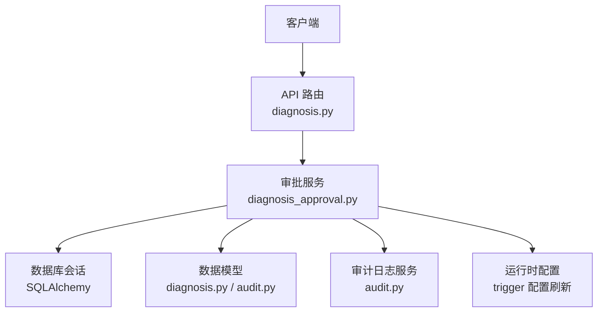
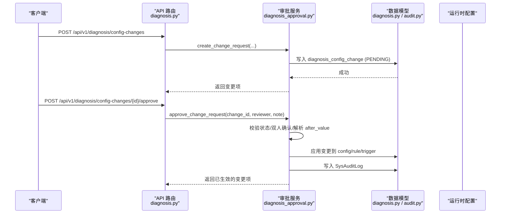
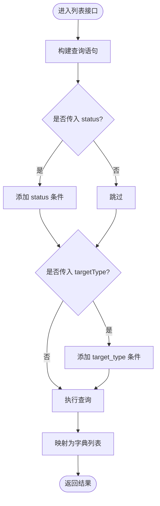
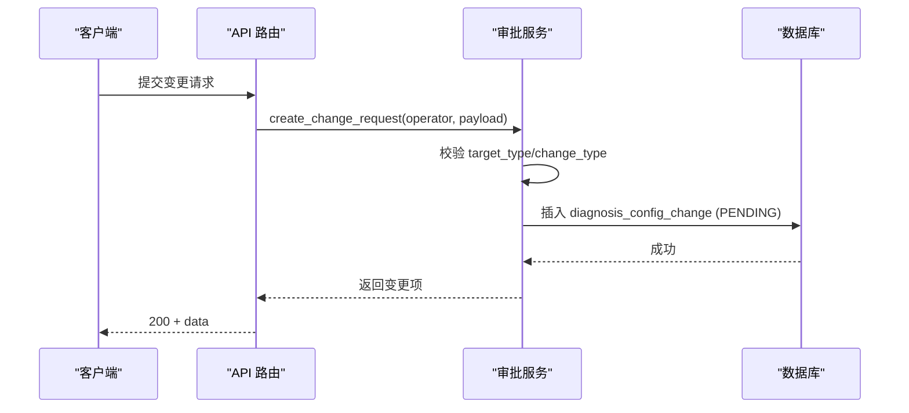
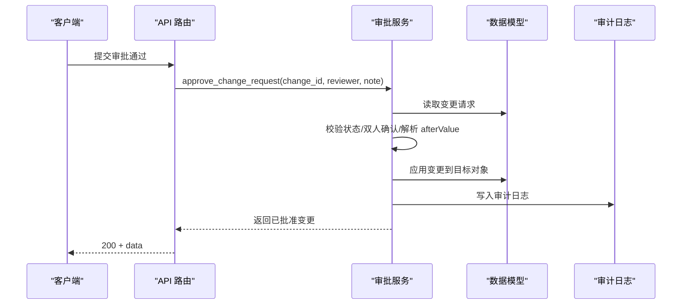
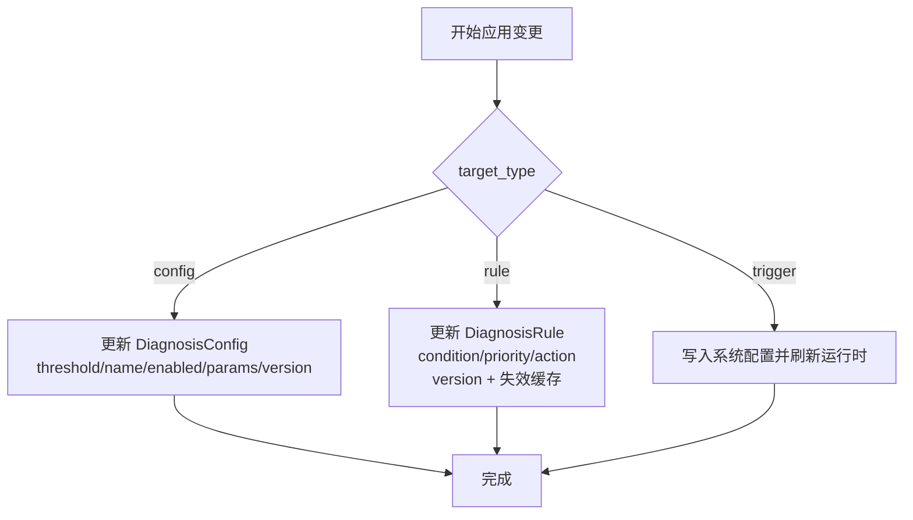
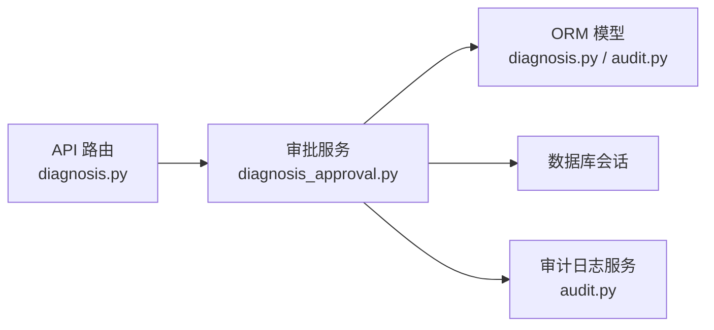

# 配置审批流程接口

<cite>
**本文引用的文件**
- [backend/app/api/v1/endpoints/diagnosis.py](file://backend/app/api/v1/endpoints/diagnosis.py)
- [backend/app/services/diagnosis_approval.py](file://backend/app/services/diagnosis_approval.py)
- [backend/app/schemas/diagnosis.py](file://backend/app/schemas/diagnosis.py)
- [backend/app/models/diagnosis.py](file://backend/app/models/diagnosis.py)
- [backend/app/models/audit.py](file://backend/app/models/audit.py)
- [backend/app/services/audit.py](file://backend/app/services/audit.py)
- [backend/alembic/versions/f6g7h8i9j0k1_create_config_change.py](file://backend/alembic/versions/f6g7h8i9j0k1_create_config_change.py)
- [db/postgresql/01_schema.sql](file://db/postgresql/01_schema.sql)
- [docs/设计文档/05-IDS/IDS.md](file://docs/设计文档/05-IDS/IDS.md)
- [backend/tests/test_diagnosis_approval.py](file://backend/tests/test_diagnosis_approval.py)
</cite>

## 目录
1. [简介](#简介)
2. [项目结构](#项目结构)
3. [核心组件](#核心组件)
4. [架构总览](#架构总览)
5. [详细组件分析](#详细组件分析)
6. [依赖关系分析](#依赖关系分析)
7. [性能考虑](#性能考虑)
8. [故障排查指南](#故障排查指南)
9. [结论](#结论)
10. [附录](#附录)

## 简介
本文件为 CLPM-MVP 配置审批系统的 API 文档，聚焦“关键配置变更审批流（C5）”。覆盖以下能力：
- 变更请求列表：支持按状态（PENDING/APPROVED/REJECTED）、目标类型筛选，返回变更详情与审批历史字段。
- 变更请求创建：包含变更前/后值对比、变更原因说明、紧急程度标记（预留扩展位）。
- 审批流程：通过/拒绝操作、审批人权限控制（双人确认原则）、审批意见记录。
- 自动应用机制：审批通过后自动执行配置变更、写入审计日志、触发运行时刷新；回滚通过版本化与审计日志查询实现。
- 工作流与多级审批：当前为单级双人确认；可扩展为多级审批。
- 审计日志查询：提供系统审计日志分页查询接口，支持按时间、操作人、操作类型等筛选。

## 项目结构
围绕配置审批的关键代码分布在如下位置：
- API 路由层：定义 REST 端点与权限校验。
- 服务层：封装业务逻辑（创建、列表、审批通过/拒绝、自动应用）。
- 数据模型层：变更请求表、诊断配置/规则模型、审计日志模型。
- Schema 层：请求/响应数据结构定义。
- 迁移与数据库脚本：建表约束、索引。
- 测试：覆盖主要业务流程与异常路径。

图表来源
- [backend/app/api/v1/endpoints/diagnosis.py:390-466](file://backend/app/api/v1/endpoints/diagnosis.py#L390-L466)
- [backend/app/services/diagnosis_approval.py:33-350](file://backend/app/services/diagnosis_approval.py#L33-L350)
- [backend/app/models/diagnosis.py:29-47](file://backend/app/models/diagnosis.py#L29-L47)
- [backend/app/models/audit.py:15-39](file://backend/app/models/audit.py#L15-L39)

章节来源
- [backend/app/api/v1/endpoints/diagnosis.py:390-466](file://backend/app/api/v1/endpoints/diagnosis.py#L390-L466)
- [backend/app/services/diagnosis_approval.py:33-350](file://backend/app/services/diagnosis_approval.py#L33-L350)
- [backend/app/schemas/diagnosis.py:225-262](file://backend/app/schemas/diagnosis.py#L225-L262)
- [backend/app/models/diagnosis.py:29-47](file://backend/app/models/diagnosis.py#L29-L47)
- [backend/app/models/audit.py:15-39](file://backend/app/models/audit.py#L15-L39)
- [backend/alembic/versions/f6g7h8i9j0k1_create_config_change.py:26-75](file://backend/alembic/versions/f6g7h8i9j0k1_create_config_change.py#L26-L75)
- [db/postgresql/01_schema.sql:1265-1286](file://db/postgresql/01_schema.sql#L1265-L1286)

## 核心组件
- 变更请求模型与存储
  - 表名：diagnosis_config_change
  - 关键字段：target_type、target_id、change_type、before_value、after_value、status、requested_by、requested_at、reviewed_by、reviewed_at、review_note、effective_from
  - 约束：target_type ∈ {config, rule, trigger}；change_type ∈ {update, enable, disable}；status ∈ {PENDING, APPROVED, REJECTED}
- 审批服务
  - create_change_request：创建 PENDING 状态的变更请求
  - list_change_requests：按 status/target_type 筛选列出
  - approve_change_request：双人确认后自动应用并写审计日志
  - reject_change_request：拒绝并写审计日志
- 自动应用
  - target_type=config：更新 DiagnosisConfig 的 threshold/name/enabled/params/version
  - target_type=rule：更新 DiagnosisRule 的条件/动作/优先级/启用状态/version，并失效缓存
  - target_type=trigger：写入系统配置并调用运行时刷新
- 审计日志
  - 统一写入 SysAuditLog，支持后续查询与归档

章节来源
- [backend/app/models/diagnosis.py:29-47](file://backend/app/models/diagnosis.py#L29-L47)
- [backend/app/services/diagnosis_approval.py:33-350](file://backend/app/services/diagnosis_approval.py#L33-L350)
- [backend/app/models/audit.py:15-39](file://backend/app/models/audit.py#L15-L39)
- [backend/alembic/versions/f6g7h8i9j0k1_create_config_change.py:26-75](file://backend/alembic/versions/f6g7h8i9j0k1_create_config_change.py#L26-L75)
- [db/postgresql/01_schema.sql:1265-1286](file://db/postgresql/01_schema.sql#L1265-L1286)

## 架构总览
下图展示从 API 到服务、再到数据与运行时的完整调用链。

图表来源
- [backend/app/api/v1/endpoints/diagnosis.py:400-443](file://backend/app/api/v1/endpoints/diagnosis.py#L400-L443)
- [backend/app/services/diagnosis_approval.py:107-185](file://backend/app/services/diagnosis_approval.py#L107-L185)
- [backend/app/models/audit.py:15-39](file://backend/app/models/audit.py#L15-L39)

## 详细组件分析

### 变更请求列表接口
- 端点：GET /api/v1/diagnosis/config-changes
- 权限：具备 diagnosis:view 即可查看
- 查询参数
  - status：可选，过滤 PENDING/APPROVED/REJECTED
  - targetType：可选，过滤 config/rule/trigger
- 返回：变更请求列表，包含 beforeValue/afterValue/status/requestedBy/requestedAt/reviewedBy/reviewedAt/reviewNote/effectiveFrom 等字段

图表来源
- [backend/app/services/diagnosis_approval.py:92-104](file://backend/app/services/diagnosis_approval.py#L92-L104)
- [backend/app/api/v1/endpoints/diagnosis.py:390-397](file://backend/app/api/v1/endpoints/diagnosis.py#L390-L397)

章节来源
- [backend/app/api/v1/endpoints/diagnosis.py:390-397](file://backend/app/api/v1/endpoints/diagnosis.py#L390-L397)
- [backend/app/services/diagnosis_approval.py:92-104](file://backend/app/services/diagnosis_approval.py#L92-L104)
- [backend/app/schemas/diagnosis.py:230-246](file://backend/app/schemas/diagnosis.py#L230-L246)

### 变更请求创建接口
- 端点：POST /api/v1/diagnosis/config-changes
- 权限：ADMIN
- 请求体字段（Schema：ConfigChangeCreateRequest）
  - targetType：config/rule/trigger
  - targetId：目标对象 ID
  - changeType：update/enable/disable
  - beforeValue：变更前快照（可选）
  - afterValue：变更后快照（可选）
- 行为
  - 校验 target_type/change_type 枚举
  - 持久化变更请求（状态 PENDING）
  - 返回变更项（含 beforeValue/afterValue）

图表来源
- [backend/app/api/v1/endpoints/diagnosis.py:400-421](file://backend/app/api/v1/endpoints/diagnosis.py#L400-L421)
- [backend/app/services/diagnosis_approval.py:33-89](file://backend/app/services/diagnosis_approval.py#L33-L89)
- [backend/app/schemas/diagnosis.py:248-256](file://backend/app/schemas/diagnosis.py#L248-L256)

章节来源
- [backend/app/api/v1/endpoints/diagnosis.py:400-421](file://backend/app/api/v1/endpoints/diagnosis.py#L400-L421)
- [backend/app/services/diagnosis_approval.py:33-89](file://backend/app/services/diagnosis_approval.py#L33-L89)
- [backend/app/schemas/diagnosis.py:248-256](file://backend/app/schemas/diagnosis.py#L248-L256)

### 审批通过接口
- 端点：POST /api/v1/diagnosis/config-changes/{change_id}/approve
- 权限：ADMIN 或 EXPERT
- 请求体字段（Schema：ConfigChangeReviewRequest）
  - reviewNote：审批意见（可选，最大长度 500）
- 行为
  - 校验变更存在且状态为 PENDING
  - 双人确认：审批人不能等于申请人
  - 解析 afterValue（JSON），失败则报错
  - 自动应用变更到目标对象（config/rule/trigger）
  - 更新变更状态为 APPROVED，记录 reviewedBy/reviewedAt/reviewNote/effectiveFrom
  - 写入审计日志（DIAG_CONFIG_APPROVE）

图表来源
- [backend/app/api/v1/endpoints/diagnosis.py:424-443](file://backend/app/api/v1/endpoints/diagnosis.py#L424-L443)
- [backend/app/services/diagnosis_approval.py:107-185](file://backend/app/services/diagnosis_approval.py#L107-L185)
- [backend/app/models/audit.py:15-39](file://backend/app/models/audit.py#L15-L39)

章节来源
- [backend/app/api/v1/endpoints/diagnosis.py:424-443](file://backend/app/api/v1/endpoints/diagnosis.py#L424-L443)
- [backend/app/services/diagnosis_approval.py:107-185](file://backend/app/services/diagnosis_approval.py#L107-L185)
- [backend/app/schemas/diagnosis.py:258-262](file://backend/app/schemas/diagnosis.py#L258-L262)

### 审批拒绝接口
- 端点：POST /api/v1/diagnosis/config-changes/{change_id}/reject
- 权限：ADMIN 或 EXPERT
- 请求体字段：同审批通过（reviewNote 可选）
- 行为
  - 校验变更存在且状态为 PENDING
  - 双人确认：审批人不能等于申请人
  - 更新状态为 REJECTED，记录 reviewedBy/reviewedAt/reviewNote
  - 写入审计日志（DIAG_CONFIG_REJECT）

章节来源
- [backend/app/api/v1/endpoints/diagnosis.py:446-465](file://backend/app/api/v1/endpoints/diagnosis.py#L446-L465)
- [backend/app/services/diagnosis_approval.py:188-245](file://backend/app/services/diagnosis_approval.py#L188-L245)

### 自动应用机制
- target_type=config
  - 更新阈值、名称、启用状态、参数，版本号自增，记录 updated_by/updated_at
- target_type=rule
  - 更新条件表达式、启用状态、优先级、动作类型/参数，版本号自增，记录 updated_by/updated_at，并失效规则缓存
- target_type=trigger
  - 将 afterValue 补充 updatedBy/updatedAt 后写入系统配置，并调用运行时刷新

图表来源
- [backend/app/services/diagnosis_approval.py:248-319](file://backend/app/services/diagnosis_approval.py#L248-L319)

章节来源
- [backend/app/services/diagnosis_approval.py:248-319](file://backend/app/services/diagnosis_approval.py#L248-L319)

### 审计日志查询
- 端点：GET /api/v1/audit-logs
- 权限：管理层（ADMIN）
- 查询参数
  - startTime：可选，ISO8601
  - endTime：可选，ISO8601
  - operator：可选，按操作人筛选
  - operationType：可选，如 CONFIG_UPDATE、LOOP_CREATE、DIAG_CONFIG_APPROVE、DIAG_CONFIG_REJECT 等
  - page/pageSize：分页
- 返回：items（审计日志条目）、total、page、pageSize

章节来源
- [docs/设计文档/05-IDS/IDS.md:2124-2160](file://docs/设计文档/05-IDS/IDS.md#L2124-L2160)
- [backend/app/services/audit.py:48-100](file://backend/app/services/audit.py#L48-L100)

### 多级审批与工作流配置
- 当前实现：单级双人确认（审批人 ≠ 申请人）
- 可扩展方向：
  - 在变更请求中引入多级审批节点（例如：初审/复审）
  - 在服务层增加状态机推进逻辑（PENDING → UNDER_REVIEW_1 → UNDER_REVIEW_2 → APPROVED/REJECTED）
  - 在 API 层增加对应审批节点的操作端点
  - 在审计日志中记录每级审批人与意见

[本节为概念性扩展建议，不直接分析具体代码文件]

### 回滚支持
- 通过版本化与审计日志实现回滚：
  - 配置对象维护 version 字段，每次变更递增
  - 审批通过/拒绝均写入审计日志，保留 beforeValue/afterValue
  - 可通过审计日志定位历史版本，必要时基于审计日志重建或回滚到指定版本

章节来源
- [backend/app/models/diagnosis.py:29-47](file://backend/app/models/diagnosis.py#L29-L47)
- [backend/app/models/audit.py:15-39](file://backend/app/models/audit.py#L15-L39)
- [backend/app/services/diagnosis_approval.py:160-185](file://backend/app/services/diagnosis_approval.py#L160-L185)

## 依赖关系分析
- API 路由依赖权限校验与数据库会话注入
- 服务层依赖 SQLAlchemy 异步会话与模型
- 服务层对诊断配置/规则/触发器进行读写
- 服务层统一写入审计日志
- 迁移与数据库脚本保证表结构与约束正确

图表来源
- [backend/app/api/v1/endpoints/diagnosis.py:390-466](file://backend/app/api/v1/endpoints/diagnosis.py#L390-L466)
- [backend/app/services/diagnosis_approval.py:33-350](file://backend/app/services/diagnosis_approval.py#L33-L350)
- [backend/app/models/diagnosis.py:29-47](file://backend/app/models/diagnosis.py#L29-L47)
- [backend/app/models/audit.py:15-39](file://backend/app/models/audit.py#L15-L39)

章节来源
- [backend/app/api/v1/endpoints/diagnosis.py:390-466](file://backend/app/api/v1/endpoints/diagnosis.py#L390-L466)
- [backend/app/services/diagnosis_approval.py:33-350](file://backend/app/services/diagnosis_approval.py#L33-L350)

## 性能考虑
- 列表查询使用 order_by 与可选 where 条件，建议在 status/target_type 上建立索引（迁移已包含相关索引）
- 自动应用时仅更新必要字段，减少不必要写入
- 规则变更时失效缓存，避免脏读
- 审计日志写入采用批量事务提交，降低 IO 开销

[本节提供通用指导，不直接分析具体代码文件]

## 故障排查指南
- 常见错误码与处理
  - ERR_INVALID_TARGET：target_type 不在允许集合内
  - ERR_INVALID_CHANGE_TYPE：change_type 不在允许集合内
  - ERR_CHANGE_NOT_FOUND：变更请求不存在
  - ERR_CHANGE_NOT_PENDING：非 PENDING 状态无法审批/拒绝
  - ERR_SELF_APPROVAL：审批人等于申请人（双人确认原则）
  - ERR_AFTER_VALUE_PARSE：after_value JSON 解析失败
  - ERR_DIAG_CONFIG_NOT_FOUND：目标诊断配置不存在
  - ERR_RULE_NOT_FOUND：目标专家规则不存在
- 排查步骤
  - 检查请求体字段是否符合 Schema 定义
  - 检查变更请求状态与权限
  - 检查 after_value 是否为合法 JSON
  - 检查目标对象是否存在
  - 查看审计日志以追踪变更轨迹

章节来源
- [backend/app/services/diagnosis_approval.py:48-61](file://backend/app/services/diagnosis_approval.py#L48-L61)
- [backend/app/services/diagnosis_approval.py:121-185](file://backend/app/services/diagnosis_approval.py#L121-L185)
- [backend/app/services/diagnosis_approval.py:200-245](file://backend/app/services/diagnosis_approval.py#L200-L245)
- [backend/app/services/diagnosis_approval.py:258-302](file://backend/app/services/diagnosis_approval.py#L258-L302)
- [backend/tests/test_diagnosis_approval.py:126-153](file://backend/tests/test_diagnosis_approval.py#L126-L153)
- [backend/tests/test_diagnosis_approval.py:301-394](file://backend/tests/test_diagnosis_approval.py#L301-L394)

## 结论
本系统实现了关键配置变更的双人确认审批流，涵盖变更请求创建、列表查询、审批通过/拒绝、自动应用与审计日志。通过版本化与审计日志，可支撑回滚与合规追溯。未来可扩展多级审批与更丰富的通知机制。

[本节为总结性内容，不直接分析具体代码文件]

## 附录

### API 清单与契约
- 变更请求列表
  - GET /api/v1/diagnosis/config-changes
  - 参数：status、targetType
  - 返回：变更项列表（含 beforeValue/afterValue/status/requestedBy/requestedAt/reviewedBy/reviewedAt/reviewNote/effectiveFrom）
- 变更请求创建
  - POST /api/v1/diagnosis/config-changes
  - 权限：ADMIN
  - 请求体：ConfigChangeCreateRequest
- 审批通过
  - POST /api/v1/diagnosis/config-changes/{change_id}/approve
  - 权限：ADMIN/EXPERT
  - 请求体：ConfigChangeReviewRequest
- 审批拒绝
  - POST /api/v1/diagnosis/config-changes/{change_id}/reject
  - 权限：ADMIN/EXPERT
  - 请求体：ConfigChangeReviewRequest
- 审计日志查询
  - GET /api/v1/audit-logs
  - 权限：ADMIN
  - 参数：startTime、endTime、operator、operationType、page、pageSize

章节来源
- [backend/app/api/v1/endpoints/diagnosis.py:390-466](file://backend/app/api/v1/endpoints/diagnosis.py#L390-L466)
- [backend/app/schemas/diagnosis.py:225-262](file://backend/app/schemas/diagnosis.py#L225-L262)
- [docs/设计文档/05-IDS/IDS.md:2124-2160](file://docs/设计文档/05-IDS/IDS.md#L2124-L2160)

### 数据模型与约束
- 变更请求表：diagnosis_config_change
  - 约束：target_type ∈ {config, rule, trigger}；change_type ∈ {update, enable, disable}；status ∈ {PENDING, APPROVED, REJECTED}
- 审计日志表：sys_audit_log
  - 字段：operator、operation_type、target_type、target_id、before_value、after_value、operated_at

章节来源
- [backend/alembic/versions/f6g7h8i9j0k1_create_config_change.py:26-75](file://backend/alembic/versions/f6g7h8i9j0k1_create_config_change.py#L26-L75)
- [db/postgresql/01_schema.sql:1265-1286](file://db/postgresql/01_schema.sql#L1265-L1286)
- [backend/app/models/audit.py:15-39](file://backend/app/models/audit.py#L15-L39)

### 测试要点
- 创建变更请求：校验 target_type/change_type
- 列表查询：支持按 status/target_type 筛选
- 审批通过：自动应用、版本递增、审计日志
- 审批拒绝：状态更新、审计日志
- 双人确认：审批人 ≠ 申请人
- 异常路径：非 PENDING、after_value 解析失败、目标不存在

章节来源
- [backend/tests/test_diagnosis_approval.py:126-153](file://backend/tests/test_diagnosis_approval.py#L126-L153)
- [backend/tests/test_diagnosis_approval.py:171-196](file://backend/tests/test_diagnosis_approval.py#L171-L196)
- [backend/tests/test_diagnosis_approval.py:204-232](file://backend/tests/test_diagnosis_approval.py#L204-L232)
- [backend/tests/test_diagnosis_approval.py:301-394](file://backend/tests/test_diagnosis_approval.py#L301-L394)