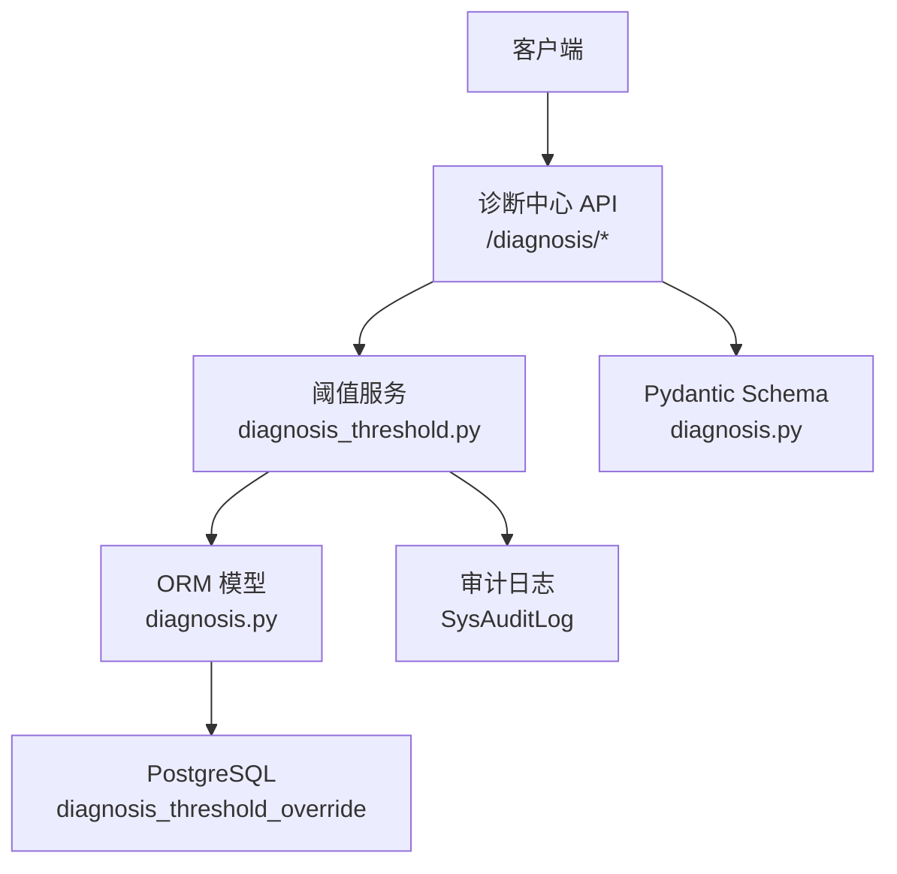
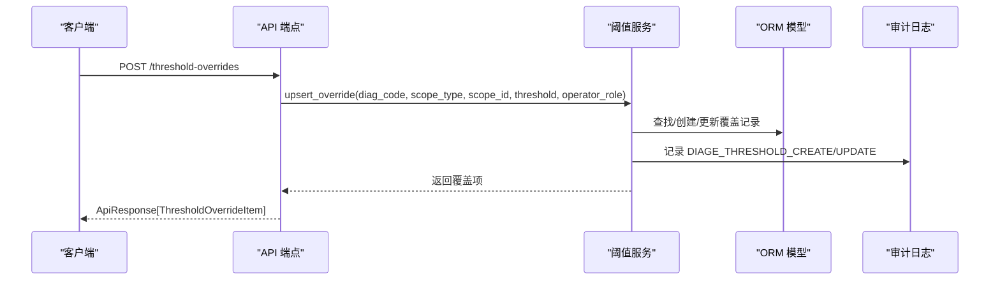
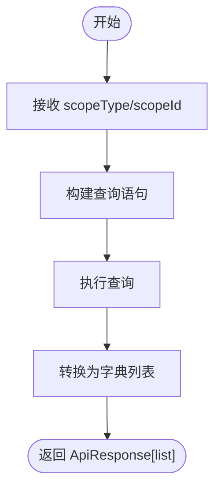
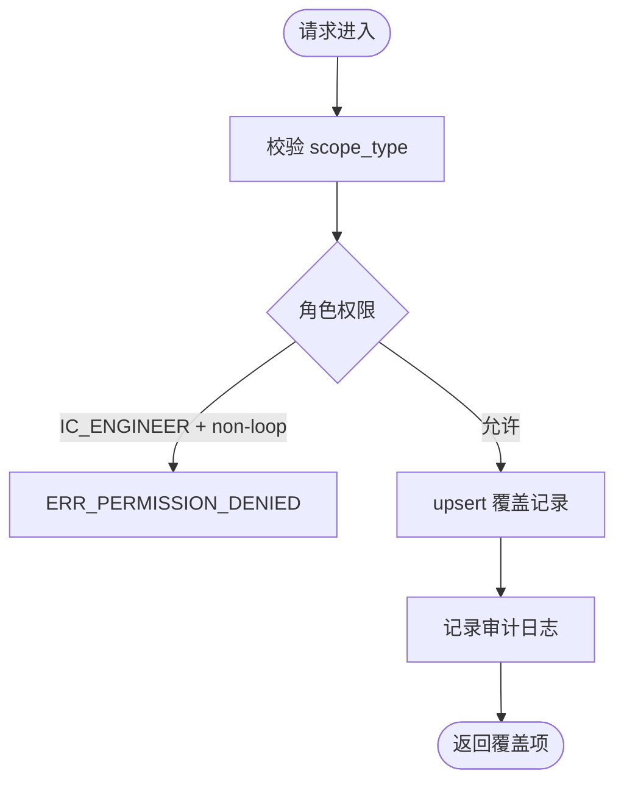
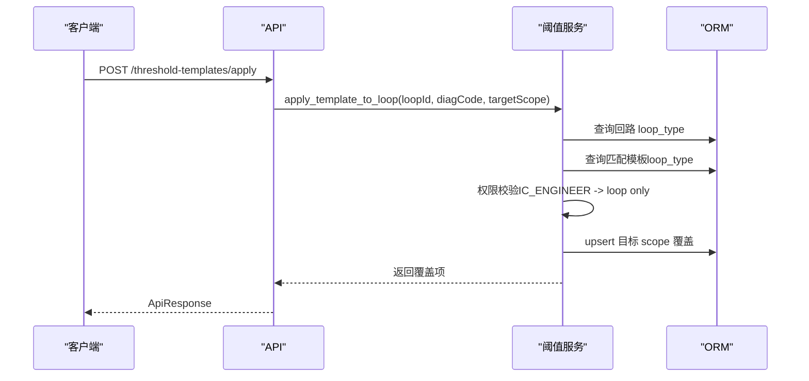
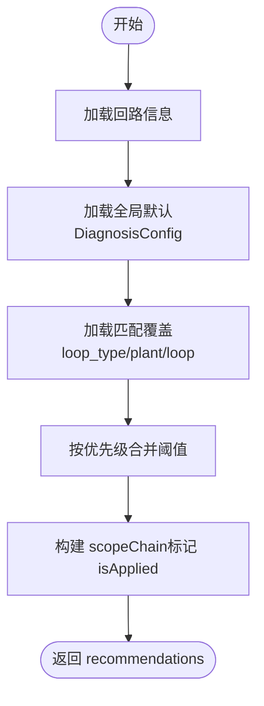
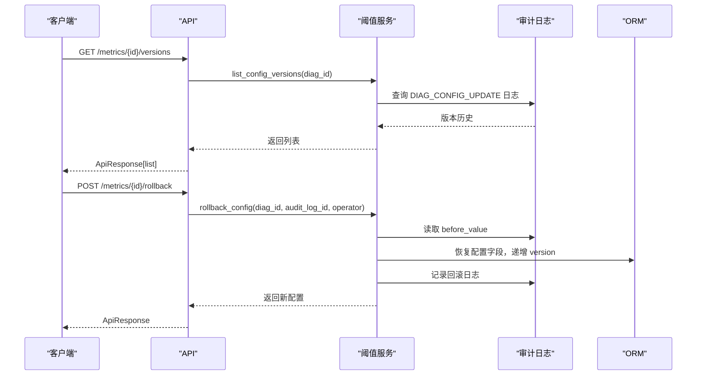
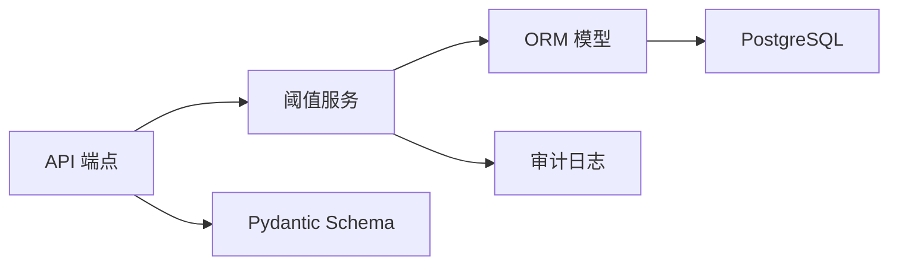

# 阈值覆盖管理接口

<cite>
**本文引用的文件**
- [backend/app/api/v1/endpoints/diagnosis.py](file://backend/app/api/v1/endpoints/diagnosis.py)
- [backend/app/services/diagnosis_threshold.py](file://backend/app/services/diagnosis_threshold.py)
- [backend/app/models/diagnosis.py](file://backend/app/models/diagnosis.py)
- [backend/app/schemas/diagnosis.py](file://backend/app/schemas/diagnosis.py)
- [backend/alembic/versions/d4e5f6g7h8i9_create_threshold_override.py](file://backend/alembic/versions/d4e5f6g7h8i9_create_threshold_override.py)
- [backend/alembic/versions/e5f6g7h8i9j0_add_threshold_version.py](file://backend/alembic/versions/e5f6g7h8i9j0_add_threshold_version.py)
- [db/postgresql/01_schema.sql](file://db/postgresql/01_schema.sql)
- [backend/tests/test_diagnosis_threshold_template.py](file://backend/tests/test_diagnosis_threshold_template.py)
</cite>

## 目录
1. [简介](#简介)
2. [项目结构](#项目结构)
3. [核心组件](#核心组件)
4. [架构总览](#架构总览)
5. [详细组件分析](#详细组件分析)
6. [依赖关系分析](#依赖关系分析)
7. [性能考虑](#性能考虑)
8. [故障排查指南](#故障排查指南)
9. [结论](#结论)
10. [附录：API 清单与数据模型](#附录api-清单与数据模型)

## 简介
本文件为 CLPM-MVP 阈值覆盖系统的 API 文档，围绕“阈值覆盖列表查询、创建/更新/删除、模板管理与应用、阈值推荐算法、版本回滚与审计追踪”等能力进行说明。系统支持按范围类型（loop_type/plant/loop）和范围标识筛选覆盖规则，返回生效阈值；提供权限控制、参数校验与作用域继承机制；内置基于回路特征的智能阈值建议与自适应合并；并具备覆盖冲突解决、版本回滚与审计追踪能力。

## 项目结构
阈值覆盖相关代码主要分布在以下位置：
- API 路由层：后端诊断中心端点，暴露阈值覆盖与模板管理接口
- 服务层：阈值覆盖 CRUD、模板套用、推荐计算、版本回滚与审计日志写入
- 模型层：阈值覆盖表映射、配置项与变更审批表
- 数据库迁移与 DDL：覆盖表结构、索引与种子数据
- Schema 定义：请求/响应数据结构
- 测试用例：覆盖行为与推荐逻辑验证

**图表来源**
- [backend/app/api/v1/endpoints/diagnosis.py:234-341](file://backend/app/api/v1/endpoints/diagnosis.py#L234-L341)
- [backend/app/services/diagnosis_threshold.py:31-144](file://backend/app/services/diagnosis_threshold.py#L31-L144)
- [backend/app/models/diagnosis.py:265-295](file://backend/app/models/diagnosis.py#L265-L295)
- [db/postgresql/01_schema.sql:1249-1263](file://db/postgresql/01_schema.sql#L1249-L1263)

**章节来源**
- [backend/app/api/v1/endpoints/diagnosis.py:234-341](file://backend/app/api/v1/endpoints/diagnosis.py#L234-L341)
- [backend/app/services/diagnosis_threshold.py:31-144](file://backend/app/services/diagnosis_threshold.py#L31-L144)
- [backend/app/models/diagnosis.py:265-295](file://backend/app/models/diagnosis.py#L265-L295)
- [db/postgresql/01_schema.sql:1249-1263](file://db/postgresql/01_schema.sql#L1249-L1263)

## 核心组件
- 阈值覆盖列表查询：支持按 scope_type 与 scope_id 筛选，返回覆盖规则与生效阈值
- 阈值覆盖创建/更新/删除：权限控制（ADMIN/IC_ENGINEER）、作用域限制、参数校验、审计记录
- 阈值模板管理：预置模板库（loop_type 覆盖），一键套用到回路或装置
- 阈值推荐算法：按回路特征（loop_type、plant）合并多级阈值，输出生效阈值与来源链
- 版本与回滚：配置版本历史、回滚到指定版本，结果记录诊断时使用的阈值版本
- 审计追踪：所有写操作记录 before/after 值与操作人时间戳

**章节来源**
- [backend/app/services/diagnosis_threshold.py:31-144](file://backend/app/services/diagnosis_threshold.py#L31-L144)
- [backend/app/services/diagnosis_threshold.py:217-373](file://backend/app/services/diagnosis_threshold.py#L217-L373)
- [backend/app/services/diagnosis_threshold.py:469-591](file://backend/app/services/diagnosis_threshold.py#L469-L591)
- [backend/alembic/versions/e5f6g7h8i9j0_add_threshold_version.py:1-34](file://backend/alembic/versions/e5f6g7h8i9j0_add_threshold_version.py#L1-L34)

## 架构总览
阈值覆盖系统采用分层架构：API 路由负责鉴权与入参绑定，服务层实现业务逻辑（权限校验、作用域合并、审计记录），模型层对接数据库，Schema 统一请求/响应结构。

**图表来源**
- [backend/app/api/v1/endpoints/diagnosis.py:256-275](file://backend/app/api/v1/endpoints/diagnosis.py#L256-L275)
- [backend/app/services/diagnosis_threshold.py:59-144](file://backend/app/services/diagnosis_threshold.py#L59-L144)

## 详细组件分析

### 阈值覆盖列表查询接口
- 路径：GET /api/v1/diagnosis/threshold-overrides
- 查询参数：
  - scopeType：覆盖范围类型，枚举 loop_type/plant/loop
  - scopeId：范围标识（如 plant_node_id 或 loop_id）
- 权限：需要 diagnosis:view 权限
- 功能：按 scope_type 与 scope_id 筛选，返回覆盖规则列表（包含 diagCode、scopeType、scopeId、threshold、version、updatedBy、updatedAt）
- 数据源：diagnosis_threshold_override 表，按 scope_type、diag_code 排序

**图表来源**
- [backend/app/api/v1/endpoints/diagnosis.py:234-243](file://backend/app/api/v1/endpoints/diagnosis.py#L234-L243)
- [backend/app/services/diagnosis_threshold.py:31-46](file://backend/app/services/diagnosis_threshold.py#L31-L46)

**章节来源**
- [backend/app/api/v1/endpoints/diagnosis.py:234-243](file://backend/app/api/v1/endpoints/diagnosis.py#L234-L243)
- [backend/app/services/diagnosis_threshold.py:31-46](file://backend/app/services/diagnosis_threshold.py#L31-L46)

### 阈值覆盖创建/更新接口
- 路径：POST /api/v1/diagnosis/threshold-overrides
- 请求体字段：
  - diagCode：诊断算法代码
  - scopeType：loop_type/plant/loop
  - scopeId：范围标识
  - threshold：阈值 JSON（与 DiagnosisConfig.threshold 同结构）
- 权限：
  - ADMIN：可操作全部 scope
  - IC_ENGINEER：仅可操作 loop scope（回路级微调）
- 功能：
  - 校验 scope_type 合法性
  - 权限边界校验（IC_ENGINEER 越权拒绝）
  - 唯一约束：(diag_code, scope_type, scope_id)
  - 新建或更新覆盖记录，递增 version，记录 updated_by/updated_at
  - 写入审计日志（DIAG_THRESHOLD_CREATE/UPDATE）
- 返回：ApiResponse[ThresholdOverrideItem]

**图表来源**
- [backend/app/services/diagnosis_threshold.py:59-144](file://backend/app/services/diagnosis_threshold.py#L59-L144)
- [backend/app/api/v1/endpoints/diagnosis.py:256-275](file://backend/app/api/v1/endpoints/diagnosis.py#L256-L275)

**章节来源**
- [backend/app/services/diagnosis_threshold.py:59-144](file://backend/app/services/diagnosis_threshold.py#L59-L144)
- [backend/app/api/v1/endpoints/diagnosis.py:256-275](file://backend/app/api/v1/endpoints/diagnosis.py#L256-L275)

### 阈值覆盖删除接口
- 路径：DELETE /api/v1/diagnosis/threshold-overrides/{override_id}
- 权限：
  - ADMIN：可删除任意 scope
  - IC_ENGINEER：仅可删除 loop scope
- 功能：
  - 校验覆盖是否存在
  - 权限边界校验（IC_ENGINEER 越权拒绝）
  - 删除覆盖记录，记录审计日志（DIAG_THRESHOLD_DELETE）
- 返回：成功消息

**章节来源**
- [backend/app/api/v1/endpoints/diagnosis.py:278-286](file://backend/app/api/v1/endpoints/diagnosis.py#L278-L286)
- [backend/app/services/diagnosis_threshold.py:147-195](file://backend/app/services/diagnosis_threshold.py#L147-L195)

### 阈值模板管理接口
- 模板列表：GET /api/v1/diagnosis/threshold-templates
  - 返回 loop_type scope 的预置阈值模板（按 scope_id 即回路类型分组）
- 模板套用：POST /api/v1/diagnosis/threshold-templates/apply
  - 请求体：
    - loopId：目标回路 ID
    - diagCode：诊断算法代码
    - targetScope：loop（回路级，IC_ENGINEER 可用）/ plant（装置级，仅 ADMIN）
  - 功能：
    - 读取该回路 loop_type 匹配的模板阈值
    - 复制为目标 scope 的覆盖（upsert 语义）
    - 权限校验（IC_ENGINEER 不可套用到 plant）
    - 若目标 scope 已有覆盖则更新
  - 返回：ApiResponse[ThresholdOverrideItem]

**图表来源**
- [backend/app/api/v1/endpoints/diagnosis.py:315-341](file://backend/app/api/v1/endpoints/diagnosis.py#L315-L341)
- [backend/app/services/diagnosis_threshold.py:376-461](file://backend/app/services/diagnosis_threshold.py#L376-L461)

**章节来源**
- [backend/app/api/v1/endpoints/diagnosis.py:246-253](file://backend/app/api/v1/endpoints/diagnosis.py#L246-L253)
- [backend/app/api/v1/endpoints/diagnosis.py:315-341](file://backend/app/api/v1/endpoints/diagnosis.py#L315-L341)
- [backend/app/services/diagnosis_threshold.py:49-56](file://backend/app/services/diagnosis_threshold.py#L49-L56)
- [backend/app/services/diagnosis_threshold.py:376-461](file://backend/app/services/diagnosis_threshold.py#L376-L461)

### 阈值推荐算法（自适应合并）
- 路径：GET /api/v1/diagnosis/threshold-recommendations?loopId=...
- 功能：
  - 根据回路特征（loop_type、plant）加载全局默认、模板覆盖、装置覆盖、回路覆盖
  - 按优先级合并生成 effectiveThreshold（全局默认 → loop_type 模板 → plant → loop）
  - 返回 scopeChain 展示各级来源与是否生效（isApplied）
- 权限：diagnosis:view
- 异常：回路不存在时报错

**图表来源**
- [backend/app/api/v1/endpoints/diagnosis.py:294-312](file://backend/app/api/v1/endpoints/diagnosis.py#L294-L312)
- [backend/app/services/diagnosis_threshold.py:217-373](file://backend/app/services/diagnosis_threshold.py#L217-L373)

**章节来源**
- [backend/app/api/v1/endpoints/diagnosis.py:294-312](file://backend/app/api/v1/endpoints/diagnosis.py#L294-L312)
- [backend/app/services/diagnosis_threshold.py:217-373](file://backend/app/services/diagnosis_threshold.py#L217-L373)
- [backend/tests/test_diagnosis_threshold_template.py:132-149](file://backend/tests/test_diagnosis_threshold_template.py#L132-L149)

### 版本回滚与审计追踪
- 版本历史：GET /api/v1/diagnosis/metrics/{diag_id}/versions
  - 从审计日志读取诊断配置的变更记录，返回版本历史（auditLogId、version、beforeValue、afterValue、operatedBy、operatedAt）
- 回滚：POST /api/v1/diagnosis/metrics/{diag_id}/rollback
  - 请求体：auditLogId
  - 权限：ADMIN
  - 功能：从审计日志读取目标版本的 before_value，恢复到该状态，递增 version，记录回滚审计日志
- 结果追溯：在 diagnosis_result 表中增加 threshold_version 列，记录诊断时使用的阈值配置版本号

**图表来源**
- [backend/app/api/v1/endpoints/diagnosis.py:348-378](file://backend/app/api/v1/endpoints/diagnosis.py#L348-L378)
- [backend/app/services/diagnosis_threshold.py:469-591](file://backend/app/services/diagnosis_threshold.py#L469-L591)
- [backend/alembic/versions/e5f6g7h8i9j0_add_threshold_version.py:1-34](file://backend/alembic/versions/e5f6g7h8i9j0_add_threshold_version.py#L1-L34)

**章节来源**
- [backend/app/api/v1/endpoints/diagnosis.py:348-378](file://backend/app/api/v1/endpoints/diagnosis.py#L348-L378)
- [backend/app/services/diagnosis_threshold.py:469-591](file://backend/app/services/diagnosis_threshold.py#L469-L591)
- [backend/alembic/versions/e5f6g7h8i9j0_add_threshold_version.py:1-34](file://backend/alembic/versions/e5f6g7h8i9j0_add_threshold_version.py#L1-L34)

## 依赖关系分析
- API 层依赖服务层函数：list_overrides、list_templates、upsert_override、delete_override、recommend_for_loop、apply_template_to_loop、list_config_versions、rollback_config
- 服务层依赖 ORM 模型：DiagnosisThresholdOverride、DiagnosisConfig、LoopLedger、PlantNode、SysAuditLog
- 数据库层：PostgreSQL 表 diagnosis_threshold_override，含唯一约束与索引
- Schema 层：Pydantic 模型用于请求/响应校验与序列化

**图表来源**
- [backend/app/api/v1/endpoints/diagnosis.py:119-128](file://backend/app/api/v1/endpoints/diagnosis.py#L119-L128)
- [backend/app/services/diagnosis_threshold.py:19-27](file://backend/app/services/diagnosis_threshold.py#L19-L27)
- [backend/app/models/diagnosis.py:265-295](file://backend/app/models/diagnosis.py#L265-L295)

**章节来源**
- [backend/app/api/v1/endpoints/diagnosis.py:119-128](file://backend/app/api/v1/endpoints/diagnosis.py#L119-L128)
- [backend/app/services/diagnosis_threshold.py:19-27](file://backend/app/services/diagnosis_threshold.py#L19-L27)
- [backend/app/models/diagnosis.py:265-295](file://backend/app/models/diagnosis.py#L265-L295)

## 性能考虑
- 查询优化：覆盖表对 (scope_type, scope_id) 建立索引，提升按范围筛选效率
- 唯一约束：(diag_code, scope_type, scope_id) 避免重复覆盖，减少冲突处理开销
- 合并策略：推荐算法按固定优先级合并，时间复杂度与覆盖数量线性相关
- 审计日志：写操作均记录审计日志，注意在高并发场景下批量写入的性能影响

[本节为通用性能指导，不直接分析具体文件]

## 故障排查指南
- 权限错误（ERR_PERMISSION_DENIED）：IC_ENGINEER 尝试操作非 loop scope，需确认角色与 scope 类型
- 覆盖不存在（ERR_OVERRIDE_NOT_FOUND）：删除前检查 override_id 是否存在
- 无模板（ERR_NO_TEMPLATE）：套用模板前确保存在对应 loop_type 的模板
- 未关联装置（ERR_NO_PLANT）：套用到 plant scope 时回路必须关联装置
- 审计日志缺失：确认写操作是否成功提交事务，审计日志是否写入
- 版本回滚失败（ERR_AUDIT_LOG_NOT_FOUND/ERR_NO_BEFORE_VALUE）：检查目标审计日志是否存在且包含 before_value

**章节来源**
- [backend/app/services/diagnosis_threshold.py:78-93](file://backend/app/services/diagnosis_threshold.py#L78-L93)
- [backend/app/services/diagnosis_threshold.py:162-179](file://backend/app/services/diagnosis_threshold.py#L162-L179)
- [backend/app/services/diagnosis_threshold.py:418-450](file://backend/app/services/diagnosis_threshold.py#L418-L450)
- [backend/app/services/diagnosis_threshold.py:521-546](file://backend/app/services/diagnosis_threshold.py#L521-L546)

## 结论
阈值覆盖系统通过三级作用域（loop_type/plant/loop）实现精细化阈值管理，结合权限控制、参数校验与审计追踪，保障配置安全与可追溯性。推荐算法基于回路特征智能合并多级阈值，提供透明化的生效来源链。版本回滚与审计日志支持问题快速定位与配置恢复。建议在生产环境中合理设置模板库与覆盖策略，定期审查审计日志，确保阈值配置稳定可靠。

[本节为总结性内容，不直接分析具体文件]

## 附录：API 清单与数据模型

### API 清单
- GET /api/v1/diagnosis/threshold-overrides：列出阈值覆盖（支持 scopeType/scopeId 筛选）
- POST /api/v1/diagnosis/threshold-overrides：创建或更新阈值覆盖
- DELETE /api/v1/diagnosis/threshold-overrides/{override_id}：删除阈值覆盖
- GET /api/v1/diagnosis/threshold-templates：获取控制类型模板列表
- POST /api/v1/diagnosis/threshold-templates/apply：一键套用模板到回路/装置
- GET /api/v1/diagnosis/threshold-recommendations：按回路推荐阈值模板
- GET /api/v1/diagnosis/metrics/{diag_id}/versions：获取诊断配置版本历史
- POST /api/v1/diagnosis/metrics/{diag_id}/rollback：回滚诊断配置到指定版本

**章节来源**
- [backend/app/api/v1/endpoints/diagnosis.py:234-378](file://backend/app/api/v1/endpoints/diagnosis.py#L234-L378)

### 数据模型
- 阈值覆盖项（ThresholdOverrideItem）：overrideId、diagCode、scopeType、scopeId、threshold、version、updatedBy、updatedAt
- 阈值覆盖请求（ThresholdOverrideUpsert）：diagCode、scopeType、scopeId、threshold
- 模板套用请求（ThresholdApplyRequest）：loopId、diagCode、targetScope
- 推荐结果（ThresholdRecommendationResult）：loopId、tagName、loopType、plantId、plantName、recommendations
- 版本历史项（DiagnosisThresholdVersionItem）：auditLogId、version、beforeValue、afterValue、operatedBy、operatedAt

**章节来源**
- [backend/app/schemas/diagnosis.py:104-173](file://backend/app/schemas/diagnosis.py#L104-L173)
- [backend/app/schemas/diagnosis.py:131-173](file://backend/app/schemas/diagnosis.py#L131-L173)

### 数据库表结构
- diagnosis_threshold_override：id、diag_code、scope_type、scope_id、threshold、version、updated_by、updated_at
- 约束：scope_type IN ('loop_type', 'plant', 'loop')
- 索引：uk_diag_threshold_override（唯一）、idx_diag_threshold_override_scope

**章节来源**
- [backend/app/models/diagnosis.py:265-295](file://backend/app/models/diagnosis.py#L265-L295)
- [db/postgresql/01_schema.sql:1249-1263](file://db/postgresql/01_schema.sql#L1249-L1263)
- [backend/alembic/versions/d4e5f6g7h8i9_create_threshold_override.py:33-66](file://backend/alembic/versions/d4e5f6g7h8i9_create_threshold_override.py#L33-L66)