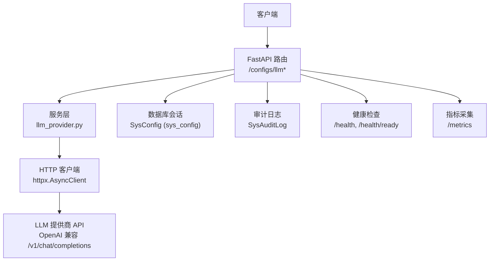
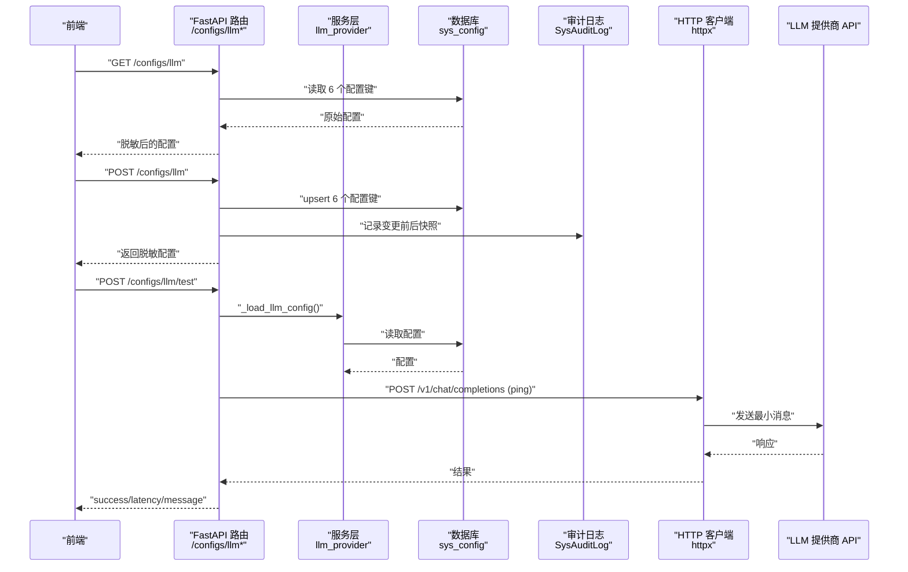
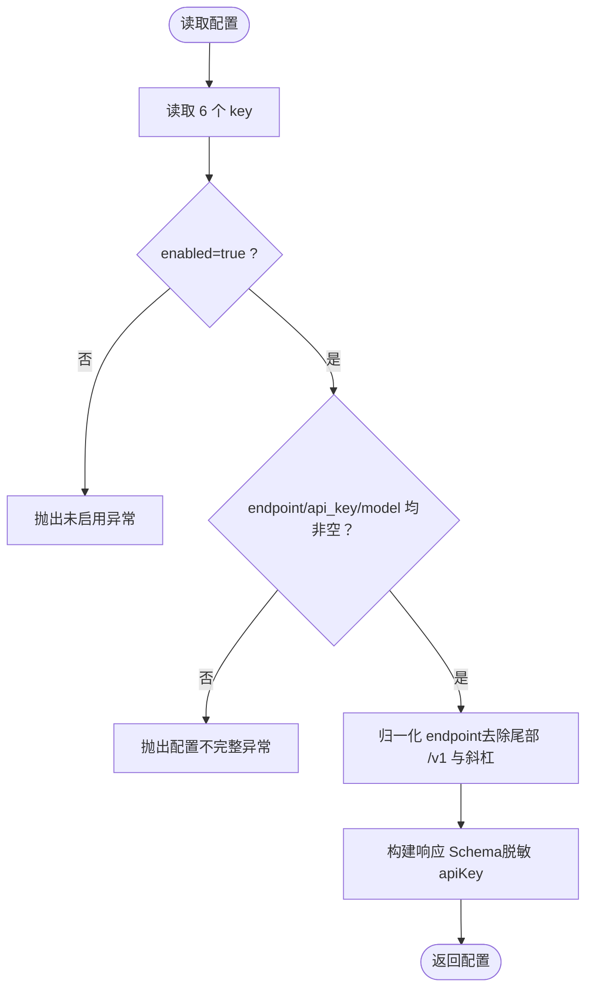
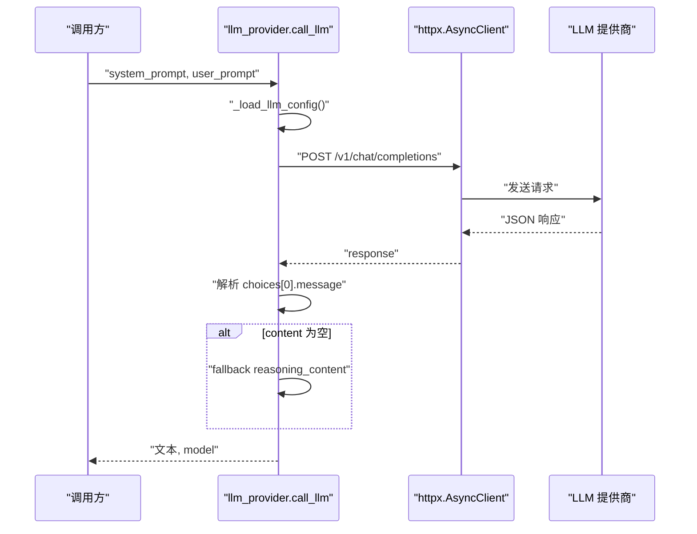
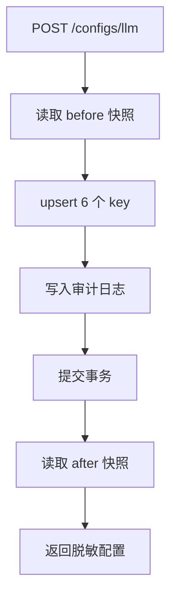
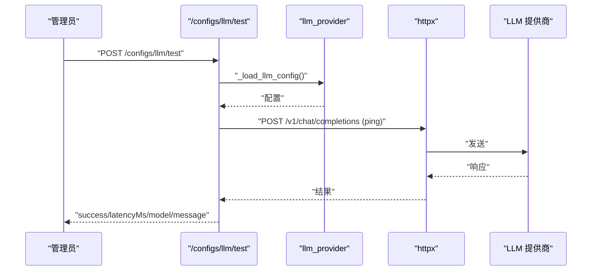
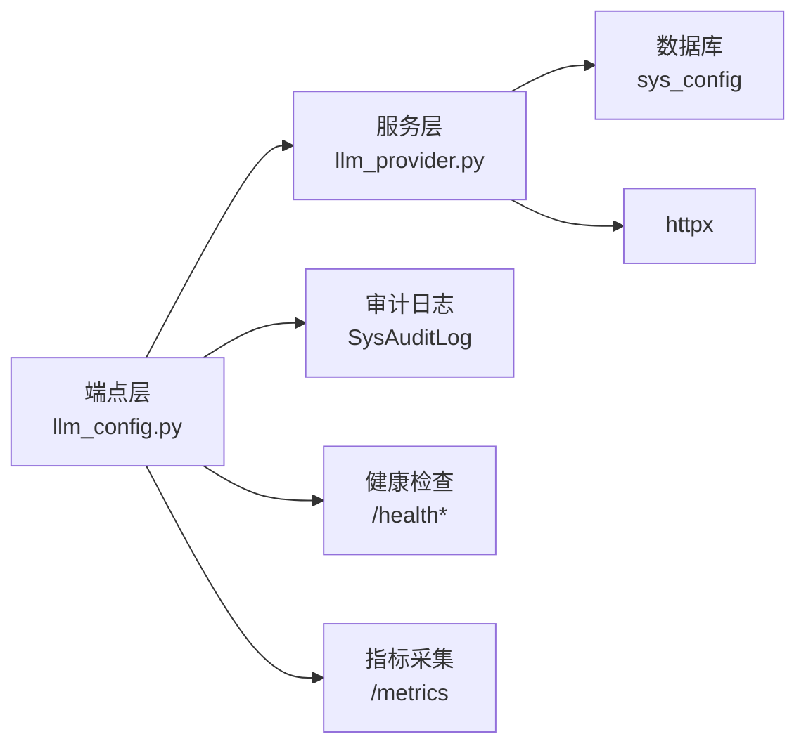

# LLM配置接口

<cite>
**本文引用的文件**
- [backend/app/services/llm_provider.py](file://backend/app/services/llm_provider.py)
- [backend/app/api/v1/endpoints/llm_config.py](file://backend/app/api/v1/endpoints/llm_config.py)
- [backend/app/schemas/config.py](file://backend/app/schemas/config.py)
- [backend/app/models/sys_config.py](file://backend/app/models/sys_config.py)
- [backend/app/api/v1/endpoints/health.py](file://backend/app/api/v1/endpoints/health.py)
- [backend/app/core/metrics.py](file://backend/app/core/metrics.py)
- [backend/app/middleware/rate_limit.py](file://backend/app/middleware/rate_limit.py)
- [backend/tests/test_llm_config.py](file://backend/tests/test_llm_config.py)
</cite>

## 目录
1. [简介](#简介)
2. [项目结构](#项目结构)
3. [核心组件](#核心组件)
4. [架构总览](#架构总览)
5. [详细组件分析](#详细组件分析)
6. [依赖关系分析](#依赖关系分析)
7. [性能与调优](#性能与调优)
8. [故障排查指南](#故障排查指南)
9. [结论](#结论)
10. [附录](#附录)

## 简介
本文件面向 CLPM-MVP 的 LLM 配置接口，系统性说明大模型服务配置、调用参数调优、多模型支持、配置安全、健康检查、性能监控与错误处理机制，并提供优化建议与常见问题解决方案。该能力通过 OpenAI 兼容协议接入任意 LLM 提供商，支持运行时配置（BaseURL、API Key、模型名、超时、最大输出 token），并提供连接测试、审计日志与脱敏返回等能力。

## 项目结构
LLM 配置相关代码主要分布在以下位置：
- 服务层适配：读取 sys_config 配置、构造请求、调用 LLM API
- API 端点：提供查询、保存、连接测试接口
- Schema：定义请求/响应结构与校验规则
- 存储模型：sys_config key-value 表用于持久化配置
- 健康检查与监控：系统就绪探针与 Prometheus 指标
- 限流中间件：对敏感接口进行频率限制（与 LLM 使用场景互补）

图表来源
- [backend/app/api/v1/endpoints/llm_config.py:1-404](file://backend/app/api/v1/endpoints/llm_config.py#L1-L404)
- [backend/app/services/llm_provider.py:1-229](file://backend/app/services/llm_provider.py#L1-L229)
- [backend/app/models/sys_config.py:1-27](file://backend/app/models/sys_config.py#L1-L27)
- [backend/app/api/v1/endpoints/health.py:1-139](file://backend/app/api/v1/endpoints/health.py#L1-L139)
- [backend/app/core/metrics.py:1-163](file://backend/app/core/metrics.py#L1-L163)

章节来源
- [backend/app/api/v1/endpoints/llm_config.py:1-404](file://backend/app/api/v1/endpoints/llm_config.py#L1-L404)
- [backend/app/services/llm_provider.py:1-229](file://backend/app/services/llm_provider.py#L1-L229)
- [backend/app/schemas/config.py:790-887](file://backend/app/schemas/config.py#L790-L887)
- [backend/app/models/sys_config.py:1-27](file://backend/app/models/sys_config.py#L1-L27)
- [backend/app/api/v1/endpoints/health.py:1-139](file://backend/app/api/v1/endpoints/health.py#L1-L139)
- [backend/app/core/metrics.py:1-163](file://backend/app/core/metrics.py#L1-L163)

## 核心组件
- LLM 配置存储与读取
  - 通过 sys_config 表维护 6 个键：enabled、endpoint、api_key、model、timeout、max_tokens
  - 读取时统一归一化 endpoint，避免重复拼接 /v1
- LLM 调用适配层
  - 基于 httpx 发起 POST /v1/chat/completions
  - 支持 reasoning_content 回退（兼容推理模型）
  - 超时与 HTTP 错误统一转换为业务异常，便于上层 fallback
- 配置管理 API
  - GET /configs/llm：获取当前配置（API Key 脱敏）
  - POST /configs/llm：更新配置（仅 ADMIN；apiKey 为空则保留原值）
  - POST /configs/llm/test：连接测试（返回成功/失败 + 延迟）
- 安全与审计
  - API Key 脱敏返回（前 3 位 + *** + 尾 4 位）
  - 配置变更写入审计日志（操作人、前后快照）
- 健康检查与监控
  - /health 进程存活探针
  - /health/ready 依赖就绪探针（DB/Redis/TDengine）
  - /metrics Prometheus 指标（HTTP 请求计数与耗时、PG 活跃连接数）

章节来源
- [backend/app/services/llm_provider.py:28-127](file://backend/app/services/llm_provider.py#L28-L127)
- [backend/app/services/llm_provider.py:130-229](file://backend/app/services/llm_provider.py#L130-L229)
- [backend/app/api/v1/endpoints/llm_config.py:177-404](file://backend/app/api/v1/endpoints/llm_config.py#L177-L404)
- [backend/app/schemas/config.py:796-836](file://backend/app/schemas/config.py#L796-L836)
- [backend/app/models/sys_config.py:13-27](file://backend/app/models/sys_config.py#L13-L27)
- [backend/app/api/v1/endpoints/health.py:26-76](file://backend/app/api/v1/endpoints/health.py#L26-L76)
- [backend/app/core/metrics.py:57-87](file://backend/app/core/metrics.py#L57-L87)

## 架构总览
下图展示从前端到 LLM 提供商的完整调用链路，以及配置加载、鉴权、审计与健康检查的交互。

图表来源
- [backend/app/api/v1/endpoints/llm_config.py:177-404](file://backend/app/api/v1/endpoints/llm_config.py#L177-L404)
- [backend/app/services/llm_provider.py:91-127](file://backend/app/services/llm_provider.py#L91-L127)
- [backend/app/services/llm_provider.py:130-229](file://backend/app/services/llm_provider.py#L130-L229)
- [backend/app/models/sys_config.py:13-27](file://backend/app/models/sys_config.py#L13-L27)

## 详细组件分析

### LLM 配置存储与读取（sys_config）
- 键集合：enabled、endpoint、api_key、model、timeout、max_tokens
- 读取函数按 key 查询 SysConfig，缺失项在调用层抛出业务异常
- 写入采用 upsert，并记录 updated_by/updated_at
- 脱敏策略：返回时仅显示前 3 位 + *** + 尾 4 位，空或短 key 全掩码

图表来源
- [backend/app/services/llm_provider.py:39-72](file://backend/app/services/llm_provider.py#L39-L72)
- [backend/app/services/llm_provider.py:91-127](file://backend/app/services/llm_provider.py#L91-L127)
- [backend/app/api/v1/endpoints/llm_config.py:149-174](file://backend/app/api/v1/endpoints/llm_config.py#L149-L174)

章节来源
- [backend/app/models/sys_config.py:13-27](file://backend/app/models/sys_config.py#L13-L27)
- [backend/app/api/v1/endpoints/llm_config.py:95-174](file://backend/app/api/v1/endpoints/llm_config.py#L95-L174)
- [backend/app/services/llm_provider.py:39-127](file://backend/app/services/llm_provider.py#L39-L127)

### LLM 调用适配层（call_llm）
- 构造 URL：自动处理 endpoint 尾部斜杠与多余 /v1，确保最终为 {base}/v1/chat/completions
- 请求体：包含 system/user 消息、temperature、max_tokens
- 响应解析：优先取 message.content；若为空且存在 reasoning_content，则回退使用该字段
- 错误处理：超时、HTTP 状态错误、连接错误统一转为业务异常，便于上层 fallback

图表来源
- [backend/app/services/llm_provider.py:65-72](file://backend/app/services/llm_provider.py#L65-L72)
- [backend/app/services/llm_provider.py:130-229](file://backend/app/services/llm_provider.py#L130-L229)

章节来源
- [backend/app/services/llm_provider.py:65-229](file://backend/app/services/llm_provider.py#L65-L229)

### 配置管理 API（GET/POST /configs/llm, /test）
- GET /configs/llm：返回脱敏配置，包含 enabled、endpoint、apiKey（脱敏）、apiKeyConfigured、model、timeout、maxTokens、updatedAt、updatedBy
- POST /configs/llm：仅 ADMIN 可写；apiKey 为空字符串时保留原值；保存后写入审计日志并提交事务
- POST /configs/llm/test：ADMIN 专用；向已配置 LLM 发送最小消息，返回 success/latencyMs/model/message

图表来源
- [backend/app/api/v1/endpoints/llm_config.py:207-304](file://backend/app/api/v1/endpoints/llm_config.py#L207-L304)

章节来源
- [backend/app/api/v1/endpoints/llm_config.py:177-404](file://backend/app/api/v1/endpoints/llm_config.py#L177-L404)
- [backend/app/schemas/config.py:796-836](file://backend/app/schemas/config.py#L796-L836)

### 连接测试流程（/configs/llm/test）
- 加载配置，构造 ping 请求（最小消息、低 temperature、小 max_tokens）
- 捕获超时、HTTP 错误与异常，返回结构化结果（success、latencyMs、model、message）

图表来源
- [backend/app/api/v1/endpoints/llm_config.py:312-400](file://backend/app/api/v1/endpoints/llm_config.py#L312-L400)
- [backend/app/services/llm_provider.py:91-127](file://backend/app/services/llm_provider.py#L91-L127)

章节来源
- [backend/app/api/v1/endpoints/llm_config.py:312-400](file://backend/app/api/v1/endpoints/llm_config.py#L312-L400)

### 多模型支持与负载均衡
- 多模型支持：通过配置 model 字段切换不同模型（如 gpt-4o、deepseek-chat、qwen-plus），调用层按 OpenAI 兼容协议发送请求
- 负载均衡：当前实现为单实例直连；如需多提供商或多实例负载，可在服务层扩展选择器（按模型名或标签选择 endpoint），并在 _load_llm_config 中注入策略（轮询/权重/健康探测）
- 建议：将 endpoint 与 model 解耦，支持“提供商 -> 模型映射”，结合健康检查动态剔除不可用节点

章节来源
- [backend/app/services/llm_provider.py:130-229](file://backend/app/services/llm_provider.py#L130-L229)
- [backend/app/api/v1/endpoints/llm_config.py:1-20](file://backend/app/api/v1/endpoints/llm_config.py#L1-L20)

### 配置安全（密钥加密、访问权限、审计）
- 密钥存储：当前以明文存储在 sys_config.value；建议在后续版本引入加密存储（如 KMS 或环境变量注入）
- 访问权限：
  - GET /configs/llm：允许 ADMIN/IC_ENGINEER/PE_ENGINEER/EXPERT 查看（仅返回脱敏信息）
  - POST /configs/llm、/test：仅 ADMIN 可用
- 审计日志：每次配置更新写入 SysAuditLog，记录操作人、目标类型、前后快照

章节来源
- [backend/app/api/v1/endpoints/llm_config.py:177-304](file://backend/app/api/v1/endpoints/llm_config.py#L177-L304)
- [backend/app/models/sys_config.py:13-27](file://backend/app/models/sys_config.py#L13-L27)

### 健康检查、性能监控与错误处理
- 健康检查
  - /health：进程存活探针
  - /health/ready：检查 PostgreSQL、Redis、TDengine 连通性，返回 ok/degraded
- 性能监控
  - /metrics：Prometheus 指标（HTTP 请求总数、耗时、PG 活跃连接数）
  - 指标采集中间件排除 /metrics 与 /health 路径，避免自引用噪声
- 错误处理
  - LLM 调用层统一捕获超时、HTTP 错误、连接错误，抛出业务异常（ERR_LLM_UNAVAILABLE），便于上层 fallback 到模板
  - 连接测试接口返回结构化错误信息（含延迟与 HTTP 状态）

章节来源
- [backend/app/api/v1/endpoints/health.py:26-76](file://backend/app/api/v1/endpoints/health.py#L26-L76)
- [backend/app/core/metrics.py:95-151](file://backend/app/core/metrics.py#L95-L151)
- [backend/app/services/llm_provider.py:206-229](file://backend/app/services/llm_provider.py#L206-L229)

## 依赖关系分析
- 模块耦合
  - 端点层依赖服务层进行配置加载与 LLM 调用
  - 服务层依赖数据库会话读取 sys_config
  - 端点层依赖审计模型记录变更
  - 健康检查与指标模块独立于 LLM 逻辑，但可用于整体系统就绪判断
- 外部依赖
  - httpx：异步 HTTP 客户端
  - FastAPI：路由与依赖注入
  - SQLAlchemy：数据库访问
  - Prometheus：指标采集

图表来源
- [backend/app/api/v1/endpoints/llm_config.py:1-404](file://backend/app/api/v1/endpoints/llm_config.py#L1-L404)
- [backend/app/services/llm_provider.py:1-229](file://backend/app/services/llm_provider.py#L1-L229)
- [backend/app/models/sys_config.py:1-27](file://backend/app/models/sys_config.py#L1-L27)
- [backend/app/api/v1/endpoints/health.py:1-139](file://backend/app/api/v1/endpoints/health.py#L1-L139)
- [backend/app/core/metrics.py:1-163](file://backend/app/core/metrics.py#L1-L163)

章节来源
- [backend/app/api/v1/endpoints/llm_config.py:1-404](file://backend/app/api/v1/endpoints/llm_config.py#L1-L404)
- [backend/app/services/llm_provider.py:1-229](file://backend/app/services/llm_provider.py#L1-L229)

## 性能与调优
- 请求超时设置
  - 通过配置 timeout（秒）控制 httpx 超时；默认 30s，范围 5-300s
  - 建议根据 LLM 提供商 SLA 调整，长文本生成可适当提高
- 重试机制
  - 当前未内置重试；可在调用层增加幂等键与指数退避重试（针对 5xx 与网络抖动）
  - 注意：LLM 非幂等，需结合业务上下文谨慎重试
- 限流控制
  - 系统级限流中间件针对认证相关接口；LLM 调用可按 IP/用户维度在网关或服务层加限流
  - 建议：对 /configs/llm/test 增加更严格限流，避免频繁消耗 token
- 连接池与并发
  - httpx.AsyncClient 在调用内创建，适合短时请求；高并发场景可复用客户端并配置连接池大小
  - 监控 PG 活跃连接数（pg_active_connections）与 /health/ready 状态，防止资源耗尽
- 多模型与负载均衡
  - 建议引入提供商选择器，按模型名或标签路由至不同 endpoint，并结合健康检查做故障转移
  - 可配置权重与熔断策略，提升可用性

章节来源
- [backend/app/services/llm_provider.py:130-229](file://backend/app/services/llm_provider.py#L130-L229)
- [backend/app/middleware/rate_limit.py:1-63](file://backend/app/middleware/rate_limit.py#L1-L63)
- [backend/app/core/metrics.py:57-87](file://backend/app/core/metrics.py#L57-L87)
- [backend/app/api/v1/endpoints/health.py:32-76](file://backend/app/api/v1/endpoints/health.py#L32-L76)

## 故障排查指南
- 常见错误与定位
  - 配置不完整：检查 enabled、endpoint、api_key、model 是否均已配置；连接测试会返回“配置不完整”提示
  - 超时：确认 timeout 设置与 LLM 提供商响应时间；观察 /health/ready 与 /metrics 中的请求耗时
  - HTTP 错误：查看测试返回的 status_code 与 body；核对 endpoint 与 api_key 是否正确
  - 空响应：当 content 与 reasoning_content 均为空时，视为无效响应；检查模型输出格式
- 诊断步骤
  - 使用 /configs/llm/test 验证连通性与延迟
  - 查看 /health/ready 确认依赖服务（DB/Redis/TDengine）状态
  - 通过 /metrics 观察 HTTP 请求计数与耗时，定位瓶颈
  - 检查审计日志，确认配置变更历史
- 参考测试用例
  - 脱敏逻辑、GET/POST 行为、连接测试成功/失败场景均有覆盖

章节来源
- [backend/tests/test_llm_config.py:70-200](file://backend/tests/test_llm_config.py#L70-L200)
- [backend/app/api/v1/endpoints/llm_config.py:312-400](file://backend/app/api/v1/endpoints/llm_config.py#L312-L400)
- [backend/app/api/v1/endpoints/health.py:32-76](file://backend/app/api/v1/endpoints/health.py#L32-L76)
- [backend/app/core/metrics.py:95-151](file://backend/app/core/metrics.py#L95-L151)

## 结论
CLPM-MVP 的 LLM 配置接口提供了开箱即用的 OpenAI 兼容接入能力，支持运行时配置、连接测试、审计日志与脱敏返回。当前实现聚焦稳定与可观测性，具备完善的错误处理与健康检查。后续可增强重试、限流、多提供商负载均衡与密钥加密存储，以提升可靠性与安全性。

## 附录
- API 清单
  - GET /configs/llm：获取当前 LLM 配置（脱敏）
  - POST /configs/llm：更新 LLM 配置（仅 ADMIN）
  - POST /configs/llm/test：连接测试（仅 ADMIN）
- 配置键说明
  - enabled：是否启用
  - endpoint：BaseURL（不含 /v1）
  - api_key：API Key（存储明文，返回脱敏）
  - model：模型名
  - timeout：超时秒数
  - max_tokens：最大输出 token 数

章节来源
- [backend/app/api/v1/endpoints/llm_config.py:1-20](file://backend/app/api/v1/endpoints/llm_config.py#L1-L20)
- [backend/app/schemas/config.py:796-836](file://backend/app/schemas/config.py#L796-L836)