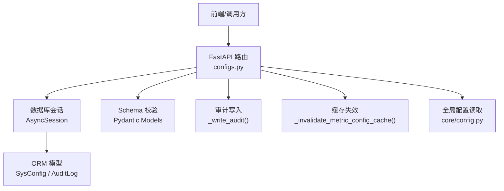
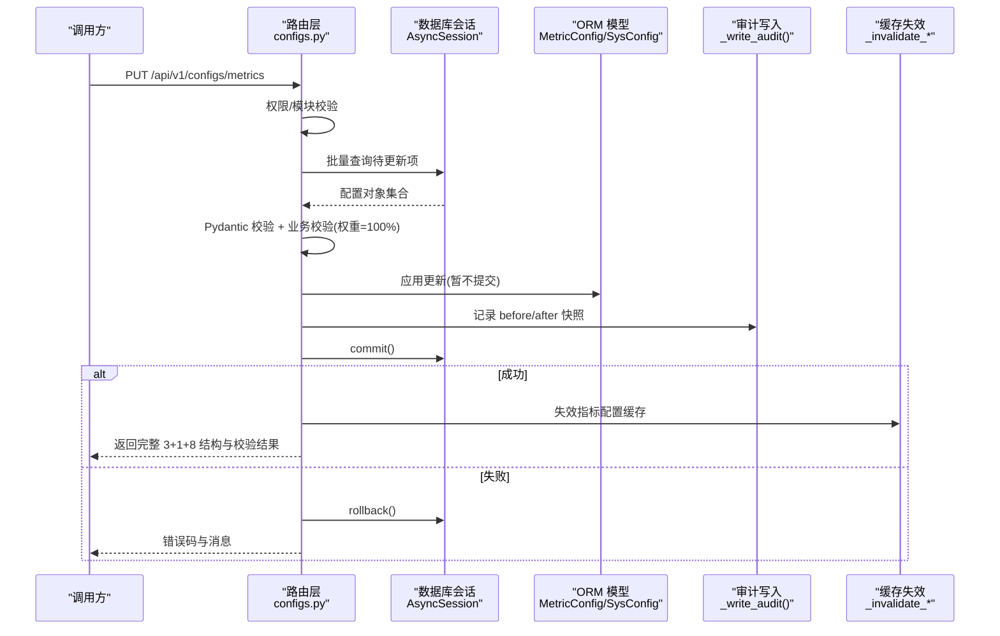
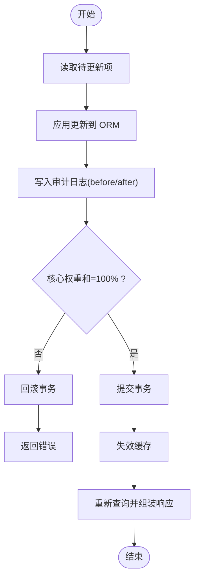
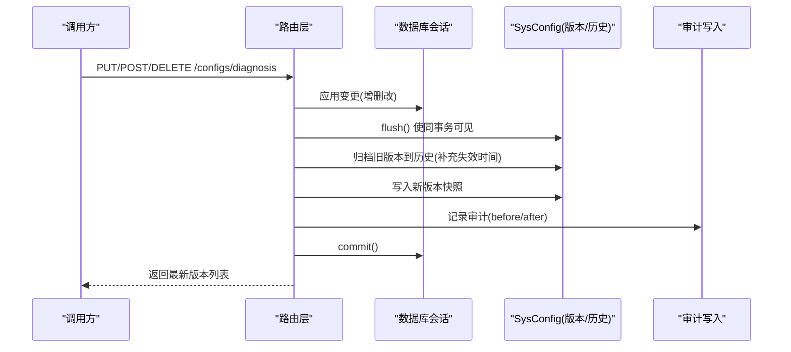
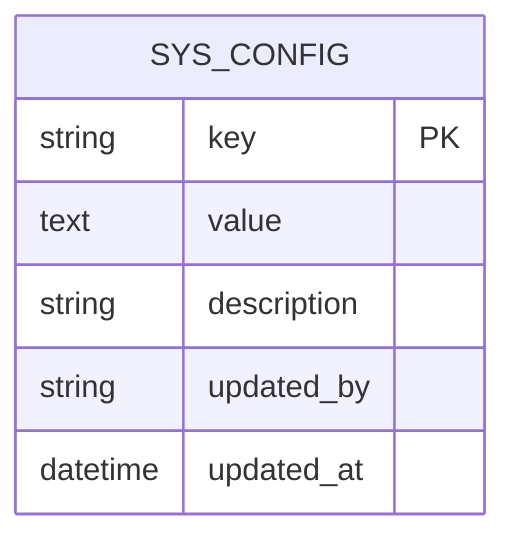
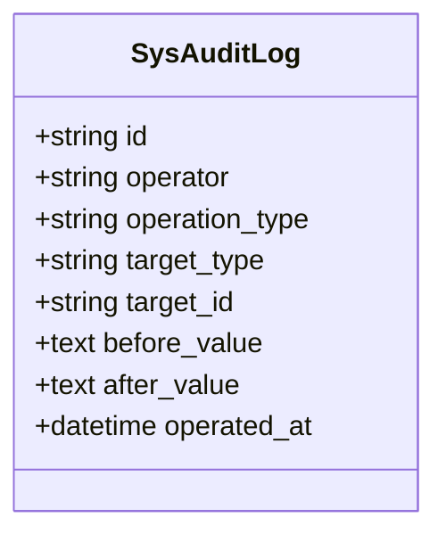
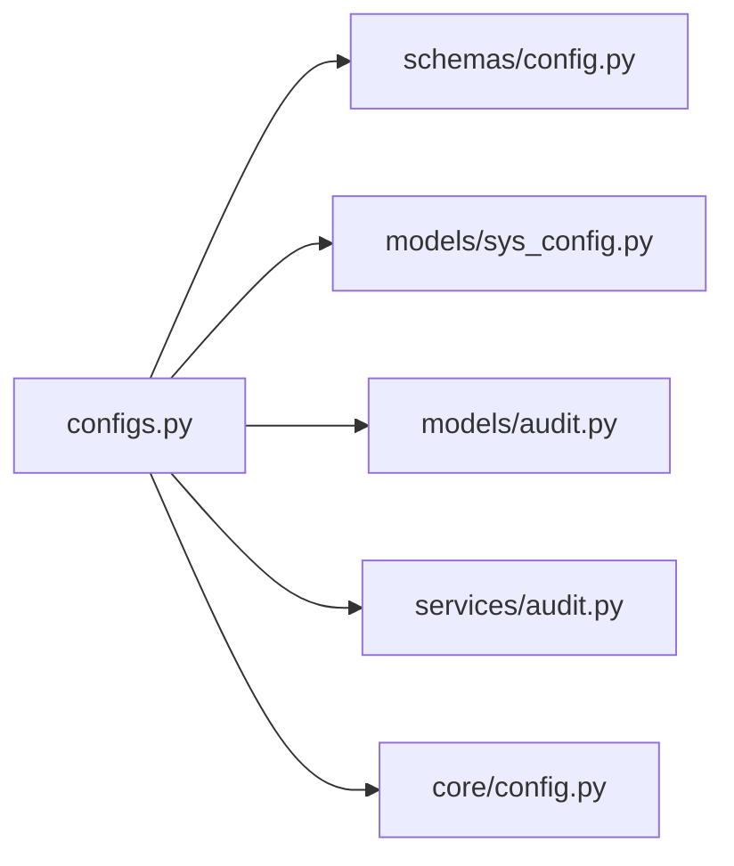

# 系统配置接口

<cite>
**本文引用的文件**
- [configs.py](file://backend/app/api/v1/endpoints/configs.py)
- [config.py](file://backend/app/schemas/config.py)
- [sys_config.py](file://backend/app/models/sys_config.py)
- [audit.py](file://backend/app/models/audit.py)
- [audit_service.py](file://backend/app/services/audit.py)
- [core_config.py](file://backend/app/core/config.py)
</cite>

## 目录
1. [简介](#简介)
2. [项目结构](#项目结构)
3. [核心组件](#核心组件)
4. [架构总览](#架构总览)
5. [详细组件分析](#详细组件分析)
6. [依赖关系分析](#依赖关系分析)
7. [性能与并发](#性能与并发)
8. [故障排查指南](#故障排查指南)
9. [结论](#结论)
10. [附录：API 清单与校验规则](#附录api-清单与校验规则)

## 简介
本文件面向 CLPM-MVP 系统的“系统配置接口”，聚焦全局配置管理能力，包括：
- 系统参数设置、模块开关控制、运行时配置更新
- 配置验证机制（参数校验、类型检查、业务逻辑校验）
- 配置版本管理（快照、历史版本、回滚能力）
- 配置审计日志（操作记录、变更追踪、安全审计）
- 配置热更新实现原理、缓存失效策略、并发安全保证
- 最佳实践与故障排查方法

## 项目结构
围绕配置能力的代码主要分布在以下位置：
- API 路由与业务编排：后端 v1 端点 configs.py
- 数据模型：sys_config（键值配置）、audit（审计日志）
- Schema 定义：config.py（请求/响应结构、枚举、阈值模板等）
- 应用级全局配置：core/config.py（环境变量、安全校验）
- 审计查询服务：services/audit.py（分页查询、过滤）

图表来源
- [configs.py:384-567](file://backend/app/api/v1/endpoints/configs.py#L384-L567)
- [sys_config.py:13-27](file://backend/app/models/sys_config.py#L13-L27)
- [audit.py:15-39](file://backend/app/models/audit.py#L15-L39)
- [config.py:55-152](file://backend/app/schemas/config.py#L55-L152)
- [core_config.py:25-225](file://backend/app/core/config.py#L25-L225)

章节来源
- [configs.py:1-800](file://backend/app/api/v1/endpoints/configs.py#L1-L800)
- [config.py:1-887](file://backend/app/schemas/config.py#L1-L887)
- [sys_config.py:1-27](file://backend/app/models/sys_config.py#L1-L27)
- [audit.py:1-39](file://backend/app/models/audit.py#L1-L39)
- [audit_service.py:1-101](file://backend/app/services/audit.py#L1-L101)
- [core_config.py:1-225](file://backend/app/core/config.py#L1-L225)

## 核心组件
- 指标配置批量接口
  - GET /api/v1/configs/metrics：返回 3+1+8 三段式指标配置，含权重总和校验结果
  - PUT /api/v1/configs/metrics：事务性批量更新，核心指标权重和必须为 100%
- 诊断配置批量接口
  - GET /api/v1/configs/diagnosis：返回全部诊断标签配置
  - PUT /api/v1/configs/diagnosis：事务性批量更新，自动生成新版本快照
  - POST /api/v1/configs/diagnosis：新增单条诊断配置（唯一性校验）
  - DELETE /api/v1/configs/diagnosis/{diag_id}：删除并写审计
- 配置存储与版本化
  - sys_config 表：key/value 键值存储，用于保存诊断配置当前版本与历史版本
  - 版本快照：每次 CRUD 在事务内归档全量快照，维护生效/失效时间
- 审计日志
  - 所有写操作均记录 before/after 快照，支持按操作人、操作类型、时间范围分页查询
- 全局配置与安全
  - 通过 pydantic-settings 加载环境变量，生产环境强制校验密钥与密码强度

章节来源
- [configs.py:384-567](file://backend/app/api/v1/endpoints/configs.py#L384-L567)
- [configs.py:575-675](file://backend/app/api/v1/endpoints/configs.py#L575-L675)
- [configs.py:683-774](file://backend/app/api/v1/endpoints/configs.py#L683-L774)
- [configs.py:782-800](file://backend/app/api/v1/endpoints/configs.py#L782-L800)
- [sys_config.py:13-27](file://backend/app/models/sys_config.py#L13-L27)
- [audit.py:15-39](file://backend/app/models/audit.py#L15-L39)
- [audit_service.py:17-70](file://backend/app/services/audit.py#L17-L70)
- [core_config.py:185-225](file://backend/app/core/config.py#L185-L225)

## 架构总览
下图展示一次“批量更新指标配置”的端到端流程，包含权限校验、参数校验、事务处理、审计记录、缓存失效与响应组装。

图表来源
- [configs.py:435-567](file://backend/app/api/v1/endpoints/configs.py#L435-L567)
- [audit.py:15-39](file://backend/app/models/audit.py#L15-L39)

## 详细组件分析

### 指标配置（3+1+8）
- 获取
  - 返回核心指标、投用指标、辅助诊断指标三类，附带核心权重总和与合法性标识
- 更新
  - 事务性批量更新；仅核心指标参与权重和校验（须等于 100%）
  - 更新后自动失效相关缓存，再重新查询以返回最新结构
- 校验
  - 字段类型、取值范围由 Pydantic 约束（如权重 0-100）
  - 业务规则：核心指标启用且赋权时，总和必须为 100%，否则回滚并报错

图表来源
- [configs.py:435-567](file://backend/app/api/v1/endpoints/configs.py#L435-L567)

章节来源
- [configs.py:384-567](file://backend/app/api/v1/endpoints/configs.py#L384-L567)
- [config.py:55-152](file://backend/app/schemas/config.py#L55-L152)

### 诊断配置（版本化与快照）
- 获取
  - 返回全部诊断标签配置列表
- 更新/新增/删除
  - 均在事务内完成，并在提交前生成新版本快照
  - 将旧版本归档至历史，标记生效/失效时间
- 版本与历史
  - 当前版本快照 key：diagnosis_config.version
  - 历史版本列表 key：diagnosis_config.history
  - 快照内容包含 version、items、updatedAt、updatedBy、remark、isCurrent、effectiveAt、expiresAt

图表来源
- [configs.py:104-189](file://backend/app/api/v1/endpoints/configs.py#L104-L189)
- [configs.py:599-675](file://backend/app/api/v1/endpoints/configs.py#L599-L675)
- [configs.py:683-774](file://backend/app/api/v1/endpoints/configs.py#L683-L774)
- [sys_config.py:13-27](file://backend/app/models/sys_config.py#L13-L27)

章节来源
- [configs.py:575-675](file://backend/app/api/v1/endpoints/configs.py#L575-L675)
- [configs.py:683-774](file://backend/app/api/v1/endpoints/configs.py#L683-L774)
- [configs.py:104-189](file://backend/app/api/v1/endpoints/configs.py#L104-L189)
- [sys_config.py:13-27](file://backend/app/models/sys_config.py#L13-L27)

### 配置存储与键空间
- SysConfig 表
  - key：主键，唯一索引
  - value：文本型配置值（JSON 字符串）
  - description：描述
  - updated_by/updated_at：更新人与更新时间
- 关键键
  - diagnosis_config.version：当前版本快照
  - diagnosis_config.history：历史版本数组

图表来源
- [sys_config.py:13-27](file://backend/app/models/sys_config.py#L13-L27)

章节来源
- [sys_config.py:13-27](file://backend/app/models/sys_config.py#L13-L27)

### 审计日志
- 写入
  - 所有写操作均调用 _write_audit，记录 operator、operation_type、target_type、target_id、before_value、after_value、operated_at
- 查询
  - 支持按 operator、operation_type、时间范围分页查询
  - 返回 before/after 解析后的 JSON 或原始字符串

图表来源
- [audit.py:15-39](file://backend/app/models/audit.py#L15-L39)

章节来源
- [audit.py:15-39](file://backend/app/models/audit.py#L15-L39)
- [audit_service.py:17-70](file://backend/app/services/audit.py#L17-L70)

### 全局配置与安全
- 环境变量加载
  - 使用 pydantic-settings 从 .env 加载，严格区分大小写
- 生产环境安全校验
  - JWT 密钥长度与存在性
  - 数据库/TDengine/Redis 密码不可为空且不得使用已知弱口令
  - AAS 安全模式不得为 None

章节来源
- [core_config.py:25-225](file://backend/app/core/config.py#L25-L225)

## 依赖关系分析
- 路由层依赖
  - 依赖 AsyncSession 进行数据库读写
  - 依赖 Pydantic Schema 做入参校验与出参序列化
  - 依赖 SysConfig 持久化版本与历史
  - 依赖审计写入函数记录变更
  - 依赖缓存失效函数确保读路径一致性
- 模型与服务
  - SysConfig：键值配置存储
  - SysAuditLog：审计日志存储
  - audit_service：审计日志分页查询

图表来源
- [configs.py:1-800](file://backend/app/api/v1/endpoints/configs.py#L1-L800)
- [config.py:1-887](file://backend/app/schemas/config.py#L1-L887)
- [sys_config.py:13-27](file://backend/app/models/sys_config.py#L13-L27)
- [audit.py:15-39](file://backend/app/models/audit.py#L15-L39)
- [audit_service.py:17-70](file://backend/app/services/audit.py#L17-L70)
- [core_config.py:25-225](file://backend/app/core/config.py#L25-L225)

章节来源
- [configs.py:1-800](file://backend/app/api/v1/endpoints/configs.py#L1-L800)
- [config.py:1-887](file://backend/app/schemas/config.py#L1-L887)
- [sys_config.py:13-27](file://backend/app/models/sys_config.py#L13-L27)
- [audit.py:15-39](file://backend/app/models/audit.py#L15-L39)
- [audit_service.py:17-70](file://backend/app/services/audit.py#L17-L70)
- [core_config.py:25-225](file://backend/app/core/config.py#L25-L225)

## 性能与并发
- 事务与一致性
  - 批量更新在同一事务中执行，任一项失败整体回滚，避免部分生效
  - 诊断配置版本快照在同事务内 flush 后读取，保证原子生效
- 缓存失效
  - 指标配置更新后主动失效相关缓存，避免脏读
  - 若失效失败仅记录告警，不影响主流程
- 并发安全
  - 基于数据库唯一索引与事务隔离级别保证 key 唯一性与一致性
  - 版本快照通过顺序递增版本号与历史归档，避免覆盖丢失
- 建议
  - 大体积配置更新尽量分批，减少单次事务负载
  - 对高频读的配置可结合进程内缓存与 Redis 二级缓存，配合失效策略

[本节为通用指导，无需特定文件引用]

## 故障排查指南
- 权重校验失败
  - 现象：PUT /configs/metrics 返回权重和不合法错误
  - 排查：确认启用的核心指标权重之和是否为 100%
  - 参考：权重校验与回滚逻辑
- 诊断配置重复
  - 现象：POST /configs/diagnosis 返回冲突
  - 排查：检查 diag_code 是否已存在
- 版本未更新
  - 现象：更新后版本未变化
  - 排查：确认是否在事务提交前调用了版本快照归档
- 审计缺失
  - 现象：无审计记录
  - 排查：检查审计写入是否被调用，以及数据库写入是否成功
- 缓存不一致
  - 现象：更新后读取仍为旧值
  - 排查：确认缓存失效是否执行成功，必要时手动清理

章节来源
- [configs.py:435-567](file://backend/app/api/v1/endpoints/configs.py#L435-L567)
- [configs.py:683-774](file://backend/app/api/v1/endpoints/configs.py#L683-L774)
- [configs.py:104-189](file://backend/app/api/v1/endpoints/configs.py#L104-L189)

## 结论
CLPM-MVP 的系统配置接口提供了完善的配置管理能力：
- 指标与诊断配置的批量读写，具备强一致的事务保障
- 诊断配置版本化与历史归档，支持回溯与回滚
- 完整的审计日志体系，满足合规与安全审计需求
- 全局配置的安全校验，确保生产环境运行安全
- 缓存失效与并发控制，保障高并发下的数据一致性

## 附录：API 清单与校验规则
- 指标配置
  - GET /api/v1/configs/metrics：返回 3+1+8 结构，含 coreTotalWeight 与 coreWeightValid
  - PUT /api/v1/configs/metrics：批量更新，核心指标权重和必须为 100%
- 诊断配置
  - GET /api/v1/configs/diagnosis：返回全部诊断配置
  - PUT /api/v1/configs/diagnosis：批量更新，生成新版本快照
  - POST /api/v1/configs/diagnosis：新增诊断配置（唯一性校验）
  - DELETE /api/v1/configs/diagnosis/{diag_id}：删除并写审计
- 校验要点
  - 字段类型与范围由 Pydantic 约束（如权重 0-100、阈值范围等）
  - 业务规则：核心指标启用且赋权时，总和必须为 100%
  - 诊断标签限定为 8 类枚举值
- 版本与历史
  - 当前版本与历史版本存储在 sys_config，键名见上文
- 审计
  - 所有写操作记录 before/after 快照，支持分页查询

章节来源
- [configs.py:384-567](file://backend/app/api/v1/endpoints/configs.py#L384-L567)
- [configs.py:575-675](file://backend/app/api/v1/endpoints/configs.py#L575-L675)
- [configs.py:683-774](file://backend/app/api/v1/endpoints/configs.py#L683-L774)
- [configs.py:782-800](file://backend/app/api/v1/endpoints/configs.py#L782-L800)
- [config.py:55-152](file://backend/app/schemas/config.py#L55-L152)
- [audit_service.py:17-70](file://backend/app/services/audit.py#L17-L70)