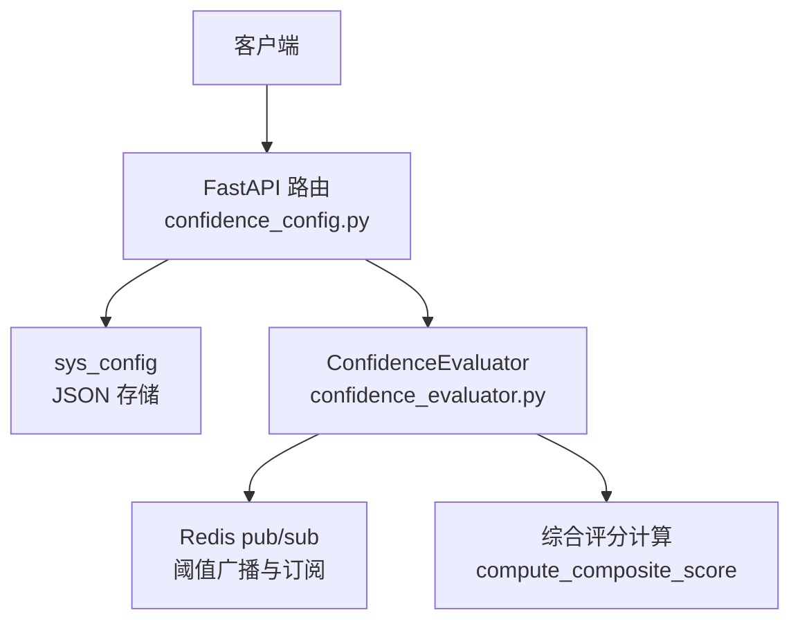
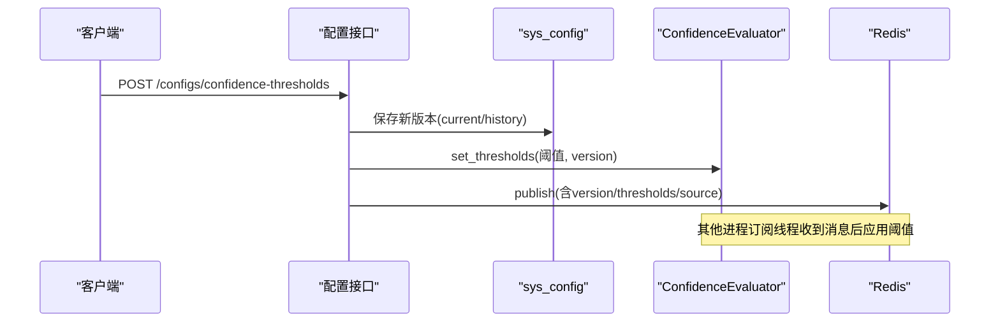
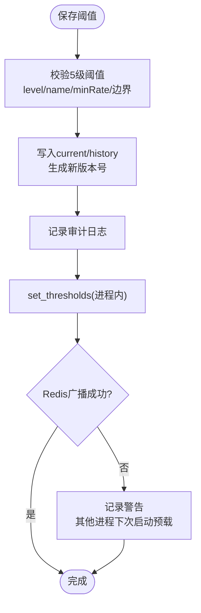
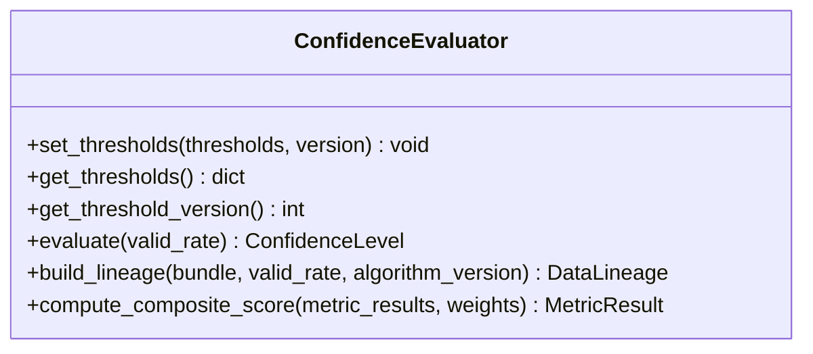
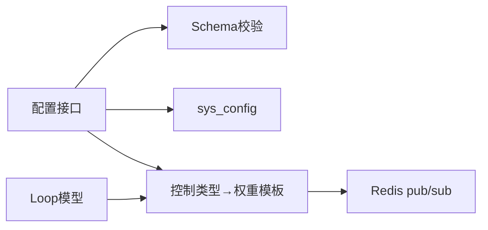
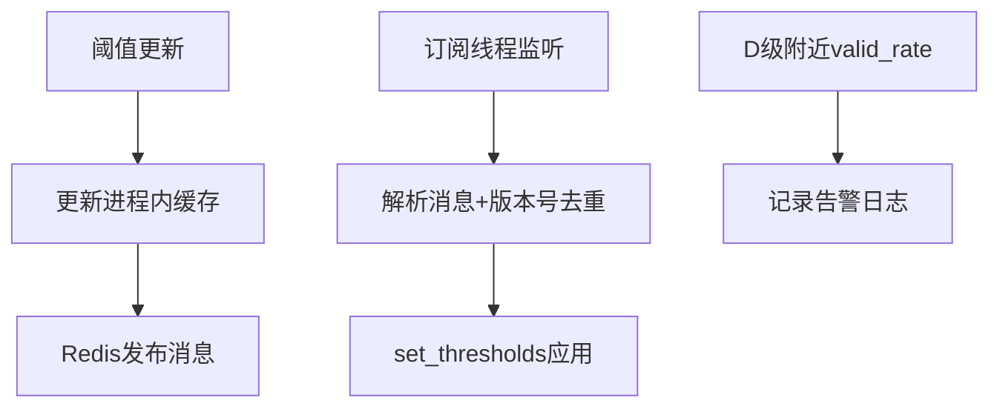

# 置信度配置接口

<cite>
**本文引用的文件**
- [backend/app/api/v1/endpoints/confidence_config.py](file://backend/app/api/v1/endpoints/confidence_config.py)
- [backend/app/services/confidence_evaluator.py](file://backend/app/services/confidence_evaluator.py)
- [backend/app/schemas/config.py](file://backend/app/schemas/config.py)
- [backend/app/models/loop.py](file://backend/app/models/loop.py)
- [backend/tests/test_confidence_threshold_sync.py](file://backend/tests/test_confidence_threshold_sync.py)
</cite>

## 目录
1. [简介](#简介)
2. [项目结构](#项目结构)
3. [核心组件](#核心组件)
4. [架构总览](#架构总览)
5. [详细组件分析](#详细组件分析)
6. [依赖关系分析](#依赖关系分析)
7. [性能与缓存](#性能与缓存)
8. [故障排查指南](#故障排查指南)
9. [结论](#结论)
10. [附录](#附录)

## 简介
本文件面向 CLPM-MVP 的“置信度配置接口”，围绕以下目标展开：
- 置信度阈值设置：评估标准、分级规则、动态调整机制
- 评估算法配置：权重分配、计算公式、参数调优
- 置信度版本管理：版本控制、生效时间、历史追溯
- 评估规则引擎：条件判断、组合逻辑、优先级处理
- 性能优化：计算性能、缓存策略、实时监控
- 最佳实践与调试方法

该接口提供对 5 级数据可信度阈值（A/B/C/D/E）的查询、更新、版本历史与回滚能力，并通过 Redis pub/sub 实现多进程实时同步，确保运行时评估器使用最新阈值。

## 项目结构
与置信度配置相关的后端代码主要分布在如下位置：
- 接口层：FastAPI 路由定义与请求校验
- 服务层：置信度评估器、阈值广播与订阅、综合评分计算
- 模型与 Schema：系统配置存储键、数据结构定义
- 测试：多进程同步、消息去重、预载兜底等用例

图表来源
- [backend/app/api/v1/endpoints/confidence_config.py:387-440](file://backend/app/api/v1/endpoints/confidence_config.py#L387-L440)
- [backend/app/services/confidence_evaluator.py:95-163](file://backend/app/services/confidence_evaluator.py#L95-L163)
- [backend/app/services/confidence_evaluator.py:529-574](file://backend/app/services/confidence_evaluator.py#L529-L574)

章节来源
- [backend/app/api/v1/endpoints/confidence_config.py:1-558](file://backend/app/api/v1/endpoints/confidence_config.py#L1-L558)
- [backend/app/services/confidence_evaluator.py:1-771](file://backend/app/services/confidence_evaluator.py#L1-L771)
- [backend/app/schemas/config.py:384-426](file://backend/app/schemas/config.py#L384-L426)

## 核心组件
- 置信度阈值配置接口
  - 获取当前阈值、保存新版本、查看历史、回滚指定版本
  - 持久化到 sys_config 表，维护 current 与 history 两个 JSON 键
- 置信度评估器
  - 基于有效数据率判定 A/B/C/D/E 等级
  - 构建数据血缘、计算综合评分
  - 支持运行时阈值动态更新与多进程同步
- 版本管理与审计
  - 每次保存生成新版本号，归档历史并记录生效/失效时间
  - 审计日志记录变更前后值

章节来源
- [backend/app/api/v1/endpoints/confidence_config.py:387-558](file://backend/app/api/v1/endpoints/confidence_config.py#L387-L558)
- [backend/app/services/confidence_evaluator.py:95-222](file://backend/app/services/confidence_evaluator.py#L95-L222)
- [backend/app/services/confidence_evaluator.py:252-475](file://backend/app/services/confidence_evaluator.py#L252-L475)

## 架构总览
置信度配置接口的整体流程包括：
- 读取与写入：通过 sys_config 键存取当前阈值与历史
- 校验与版本化：保存前进行严格校验，保存时递增版本号并归档历史
- 运行时同步：更新后调用评估器 set_thresholds，并通过 Redis 广播到其他进程
- 启动预载：新进程启动时从 DB 加载阈值作为兜底

图表来源
- [backend/app/api/v1/endpoints/confidence_config.py:405-440](file://backend/app/api/v1/endpoints/confidence_config.py#L405-L440)
- [backend/app/services/confidence_evaluator.py:529-574](file://backend/app/services/confidence_evaluator.py#L529-L574)

## 详细组件分析

### 置信度阈值配置接口
- 功能要点
  - GET 获取当前阈值：若未配置则返回算法默认
  - POST 保存新版本：严格校验 5 级阈值（level 1-5、名称 A-E、minRate 严格递减、边界约束），保存为 new_version，归档历史，写审计日志
  - GET 历史：返回当前版本与历史列表，包含 effectiveAt/expiresAt
  - POST 回滚：支持回滚到版本 0（算法默认）或历史版本，生成新版本保留追溯链
- 运行时同步
  - 保存成功后立即更新进程内阈值缓存，并通过 Redis 广播
  - 广播失败不影响响应，其他进程重启时会预载兜底

图表来源
- [backend/app/api/v1/endpoints/confidence_config.py:128-190](file://backend/app/api/v1/endpoints/confidence_config.py#L128-L190)
- [backend/app/api/v1/endpoints/confidence_config.py:290-343](file://backend/app/api/v1/endpoints/confidence_config.py#L290-L343)
- [backend/app/api/v1/endpoints/confidence_config.py:405-440](file://backend/app/api/v1/endpoints/confidence_config.py#L405-L440)

章节来源
- [backend/app/api/v1/endpoints/confidence_config.py:1-558](file://backend/app/api/v1/endpoints/confidence_config.py#L1-L558)
- [backend/app/schemas/config.py:384-426](file://backend/app/schemas/config.py#L384-L426)

### 置信度评估器与算法
- 等级判定
  - 根据有效数据率 valid_rate 与运行时阈值缓存判定 A/B/C/D/E
  - D 级附近（valid_rate ∈ [D, D+0.10)）触发告警日志，提示数据质量接近不可计算边界
- 数据血缘
  - 构建 DataLineage，包含采样频率、聚合策略、质量策略、tag_group、data_block_ids、valid_rate、预处理版本、算法版本
- 综合评分
  - 公式 P = (A·a + F·f + S·s)/(a+f+s) × R
  - 权重模板：STABLE/SLOW/FAST/LOGIC 四套默认权重
  - 缺失或 INCONCLUSIVE 的核心指标或折扣因子 R → 评分留空（INCONCLUSIVE）
  - 低可信度输入（D 级）保留评分并在 details 中标注

图表来源
- [backend/app/services/confidence_evaluator.py:95-163](file://backend/app/services/confidence_evaluator.py#L95-L163)
- [backend/app/services/confidence_evaluator.py:164-222](file://backend/app/services/confidence_evaluator.py#L164-L222)
- [backend/app/services/confidence_evaluator.py:223-251](file://backend/app/services/confidence_evaluator.py#L223-L251)
- [backend/app/services/confidence_evaluator.py:252-475](file://backend/app/services/confidence_evaluator.py#L252-L475)

章节来源
- [backend/app/services/confidence_evaluator.py:1-771](file://backend/app/services/confidence_evaluator.py#L1-L771)

### 版本管理与历史追溯
- 版本控制
  - 每次保存生成新版本号；version=0 表示算法规范默认
  - 历史条目包含 thresholds、updatedAt、updatedBy、remark、isCurrent、effectiveAt、expiresAt
- 生效时间管理
  - 当前版本的 effectiveAt 为 updatedAt；历史版本 expiresAt 为新版本生效时间
- 历史追溯
  - 通过历史列表与审计日志可回溯变更前后值与操作人

章节来源
- [backend/app/api/v1/endpoints/confidence_config.py:290-343](file://backend/app/api/v1/endpoints/confidence_config.py#L290-L343)
- [backend/app/api/v1/endpoints/confidence_config.py:448-476](file://backend/app/api/v1/endpoints/confidence_config.py#L448-L476)
- [backend/app/schemas/config.py:656-682](file://backend/app/schemas/config.py#L656-L682)

### 评估规则引擎：条件判断、组合逻辑、优先级处理
- 条件判断
  - 等级判定基于阈值区间；D 级附近告警
- 组合逻辑
  - 综合评分将准确率、快速率、稳定率按权重加权，再乘以有效自控率折扣因子 R
- 优先级处理
  - 权重模板按控制类型选择（STABLE/SLOW/FAST/LOGIC）
  - 缺失或 INCONCLUSIVE 的核心指标直接导致整体 INCONCLUSIVE，避免隐性惩罚

章节来源
- [backend/app/services/confidence_evaluator.py:252-475](file://backend/app/services/confidence_evaluator.py#L252-L475)

## 依赖关系分析
- 接口依赖
  - FastAPI 路由依赖数据库会话、用户角色校验
  - 依赖 schemas 进行请求/响应结构校验
- 服务依赖
  - 评估器依赖 Redis 进行阈值广播与订阅
  - 启动预载依赖 sys_config 读取当前阈值
- 模型依赖
  - loop 模型用于回路元数据与控制类型（影响权重模板选择）

图表来源
- [backend/app/api/v1/endpoints/confidence_config.py:387-440](file://backend/app/api/v1/endpoints/confidence_config.py#L387-L440)
- [backend/app/services/confidence_evaluator.py:516-574](file://backend/app/services/confidence_evaluator.py#L516-L574)
- [backend/app/models/loop.py:50-61](file://backend/app/models/loop.py#L50-L61)

章节来源
- [backend/app/api/v1/endpoints/confidence_config.py:1-558](file://backend/app/api/v1/endpoints/confidence_config.py#L1-L558)
- [backend/app/services/confidence_evaluator.py:1-771](file://backend/app/services/confidence_evaluator.py#L1-L771)
- [backend/app/models/loop.py:1-200](file://backend/app/models/loop.py#L1-L200)

## 性能与缓存
- 运行时阈值缓存
  - 进程内 _threshold_cache 存储阈值，set_thresholds 原子更新
  - 通过版本号去重，避免旧消息覆盖新阈值
- 多进程同步
  - Redis pub/sub 频道广播阈值更新，各进程后台守护线程订阅并应用
  - 启动预载从 DB 加载阈值，保证新进程可用
- 监控与告警
  - D 级附近 valid_rate 告警日志，便于发现数据质量风险
  - 广播失败记录警告，不影响主流程

图表来源
- [backend/app/services/confidence_evaluator.py:106-163](file://backend/app/services/confidence_evaluator.py#L106-L163)
- [backend/app/services/confidence_evaluator.py:529-574](file://backend/app/services/confidence_evaluator.py#L529-L574)
- [backend/app/services/confidence_evaluator.py:632-700](file://backend/app/services/confidence_evaluator.py#L632-L700)
- [backend/app/services/confidence_evaluator.py:164-222](file://backend/app/services/confidence_evaluator.py#L164-L222)

章节来源
- [backend/app/services/confidence_evaluator.py:1-771](file://backend/app/services/confidence_evaluator.py#L1-L771)

## 故障排查指南
- 常见问题定位
  - 阈值未生效：检查 Redis 广播是否成功，确认订阅线程是否运行
  - 版本错乱：核对版本号单调递增，避免旧消息覆盖
  - 解析失败：检查 sys_config 中 JSON 格式是否正确
- 调试建议
  - 启用相关日志级别，观察阈值更新与广播过程
  - 使用测试用例验证消息解析与去重逻辑
  - 启动预载失败时，检查 DB 配置项是否存在且格式正确

章节来源
- [backend/tests/test_confidence_threshold_sync.py:1-436](file://backend/tests/test_confidence_threshold_sync.py#L1-L436)
- [backend/app/services/confidence_evaluator.py:577-630](file://backend/app/services/confidence_evaluator.py#L577-L630)
- [backend/app/services/confidence_evaluator.py:702-754](file://backend/app/services/confidence_evaluator.py#L702-L754)

## 结论
CLPM-MVP 的置信度配置接口提供了完整的阈值管理、版本控制与多进程同步能力，结合评估器的等级判定与综合评分计算，形成闭环的可信度管理体系。通过严格的校验、审计日志与告警机制，保障配置变更的安全性与可追溯性。在生产环境中，建议配合监控与测试用例持续验证阈值生效与性能表现。

## 附录
- 接口清单
  - GET /api/v1/configs/confidence-thresholds：获取当前阈值
  - POST /api/v1/configs/confidence-thresholds：保存新版本
  - GET /api/v1/configs/confidence-thresholds/history：版本历史
  - POST /api/v1/configs/confidence-thresholds/{version}/rollback：回滚到指定版本
- 关键常量
  - sys_config 键：confidence_thresholds.current、confidence_thresholds.history
  - Redis 频道：confidence:thresholds:updated
  - 版本号计数器：confidence:thresholds:version

章节来源
- [backend/app/api/v1/endpoints/confidence_config.py:1-558](file://backend/app/api/v1/endpoints/confidence_config.py#L1-L558)
- [backend/app/services/confidence_evaluator.py:84-89](file://backend/app/services/confidence_evaluator.py#L84-L89)