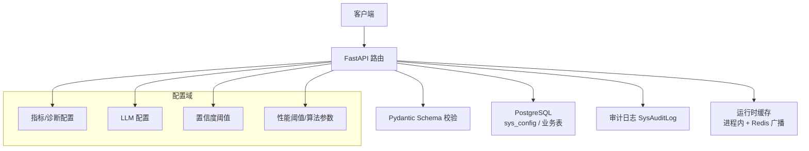
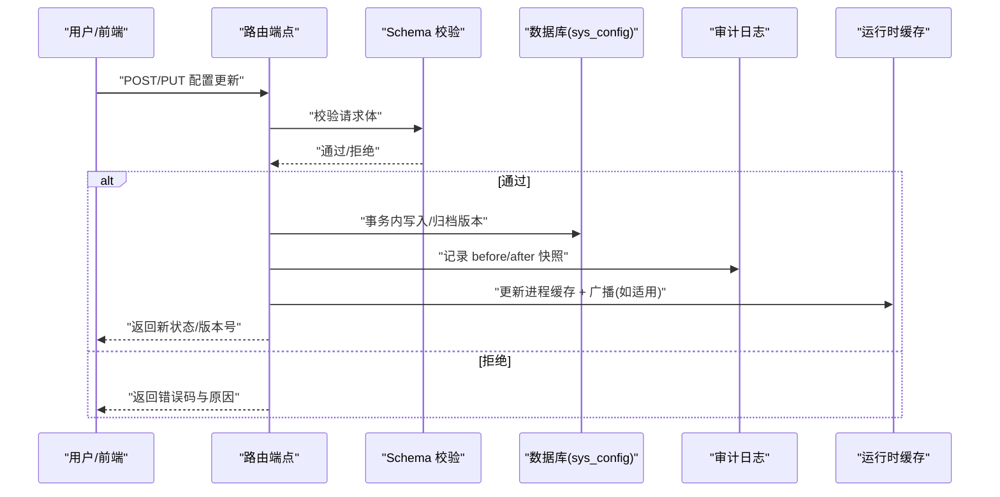
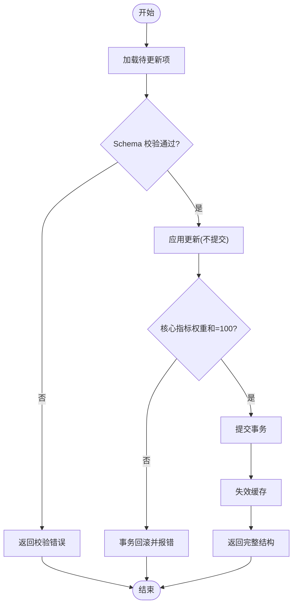
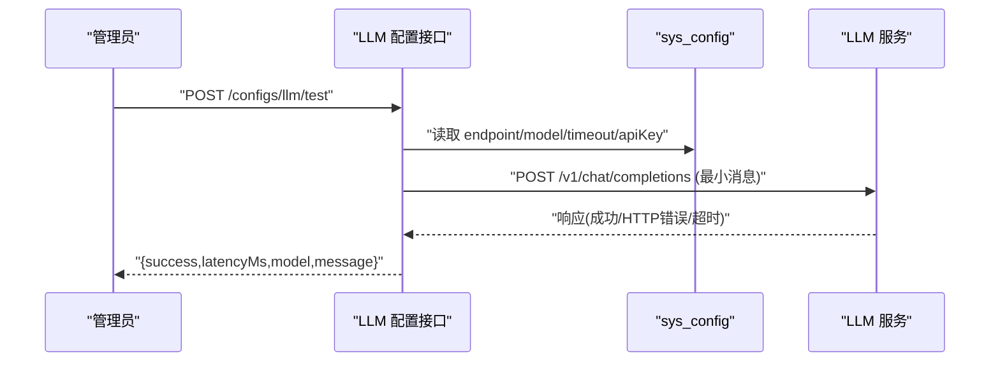
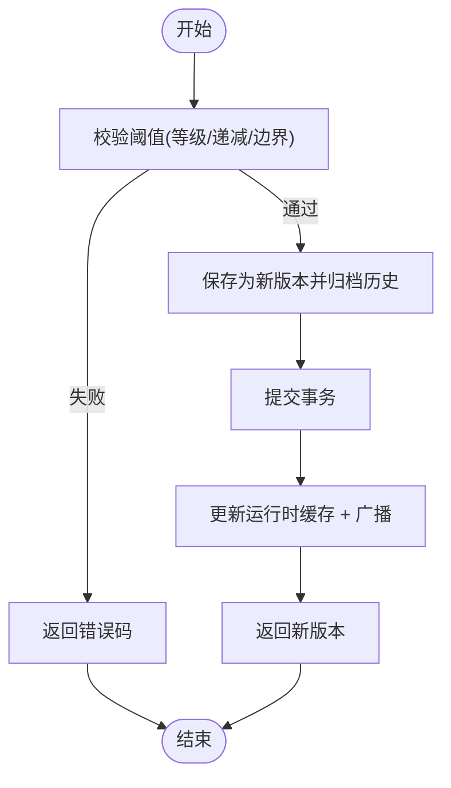
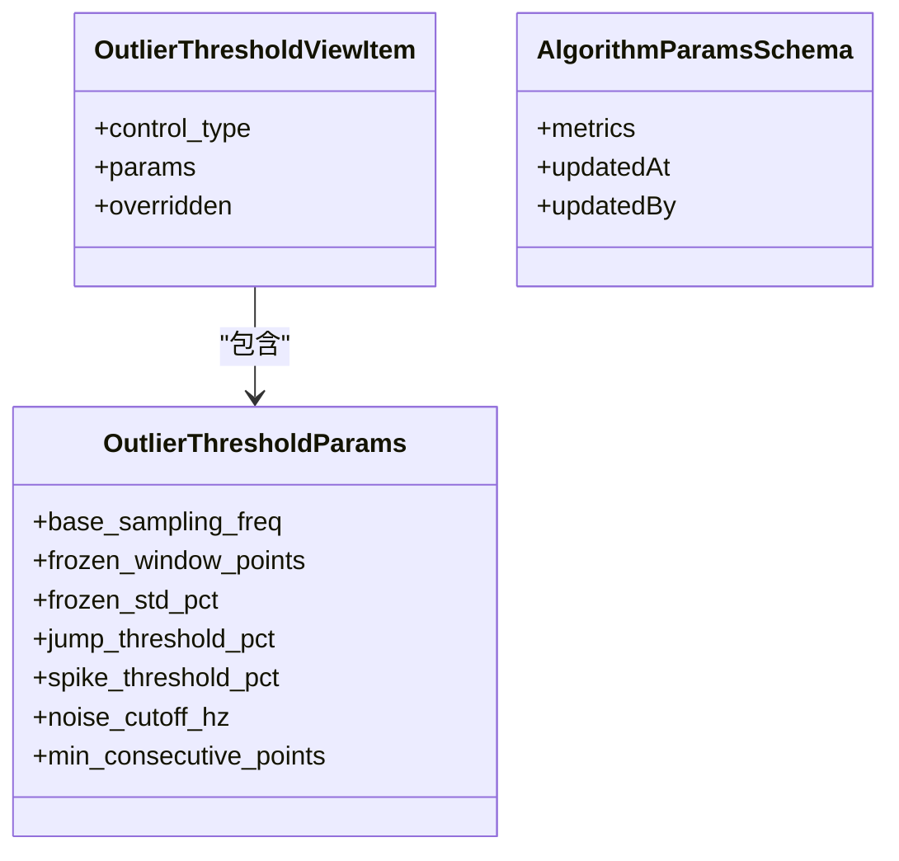
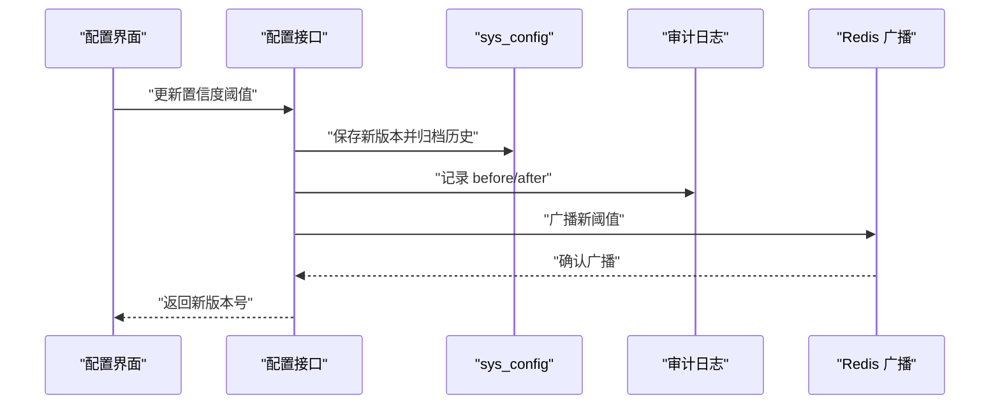
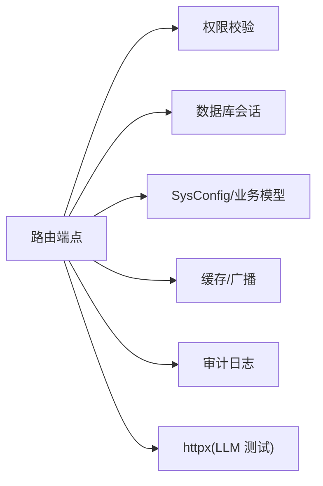

# 配置管理接口

<cite>
**本文引用的文件**
- [configs.py](file://backend/app/api/v1/endpoints/configs.py)
- [llm_config.py](file://backend/app/api/v1/endpoints/llm_config.py)
- [confidence_config.py](file://backend/app/api/v1/endpoints/confidence_config.py)
- [config.py](file://backend/app/core/config.py)
- [sys_config.py](file://backend/app/models/sys_config.py)
- [config.py（schemas）](file://backend/app/schemas/config.py)
- [audit.py（服务）](file://backend/app/services/audit.py)
</cite>

## 目录
1. [简介](#简介)
2. [项目结构](#项目结构)
3. [核心组件](#核心组件)
4. [架构总览](#架构总览)
5. [详细组件分析](#详细组件分析)
6. [依赖关系分析](#依赖关系分析)
7. [性能考虑](#性能考虑)
8. [故障排查指南](#故障排查指南)
9. [结论](#结论)
10. [附录：API 参考与最佳实践](#附录api-参考与最佳实践)

## 简介
本文件面向 CLPM-MVP 的配置管理模块，提供系统级、LLM 接入级、置信度阈值级以及性能相关阈值的 API 文档。内容覆盖：
- 全局配置管理：指标配置、诊断配置的批量读写与版本化归档
- 动态配置更新：运行时缓存刷新与多进程广播
- 配置验证：权重校验、阈值严格递减等强约束
- LLM 配置：大模型服务连接、密钥管理与调用参数调优
- 置信度配置：阈值设置、评估规则、版本管理与回滚
- 性能阈值：异常值检测参数、算法参数覆盖、开关控制
- 热更新、审计与回滚机制的技术实现
- 最佳实践与故障排查方法

## 项目结构
配置管理由“路由端点 + Schema 校验 + 持久化 sys_config + 审计日志 + 运行时缓存”构成。关键路径如下：
- 路由层：FastAPI Router 暴露 REST 接口
- 数据层：SysConfig 键值表存储运行期可配置项
- 校验层：Pydantic Schema 保证请求体结构与取值范围
- 业务层：事务性更新、版本快照、历史归档、运行时缓存更新
- 审计层：不可变审计日志记录变更前后快照
- 配置层：应用启动时加载的环境配置与安全校验

**图表来源**
- [configs.py:384-675](file://backend/app/api/v1/endpoints/configs.py#L384-L675)
- [llm_config.py:182-400](file://backend/app/api/v1/endpoints/llm_config.py#L182-L400)
- [confidence_config.py:387-554](file://backend/app/api/v1/endpoints/confidence_config.py#L387-L554)
- [sys_config.py:13-26](file://backend/app/models/sys_config.py#L13-L26)

**章节来源**
- [configs.py:1-16](file://backend/app/api/v1/endpoints/configs.py#L1-L16)
- [sys_config.py:1-27](file://backend/app/models/sys_config.py#L1-L27)

## 核心组件
- 全局配置管理（指标/诊断）
  - 批量获取/更新指标配置（3+1+8 三段式），核心指标权重总和必须为 100%
  - 批量获取/更新诊断配置（8 类标签），每次保存生成新版本并归档历史
- LLM 配置管理
  - 查询/更新 LLM 服务配置（BaseURL、API Key、模型、超时、最大 token）
  - 连接测试：向目标服务发送最小消息验证连通性与延迟
- 置信度阈值管理
  - 5 级可信度阈值（A/B/C/D/E）的查询、更新、版本历史与回滚
  - 严格递减校验、边界约束（level 1 ≤ 1.0，level 5 = 0）
- 性能阈值与算法参数
  - 异常值检测参数按控制类型覆盖，合并默认值后生效
  - 算法参数按指标×控制类型维度部分覆盖，支持重置默认
- 热更新与广播
  - 置信度阈值更新后写入进程内缓存并通过 Redis 广播至其他进程
  - 指标配置更新后失效相关缓存，确保计算链路读取最新配置
- 审计与回滚
  - 所有写操作均记录审计日志（before/after 快照）
  - 置信度阈值支持回滚到指定历史版本或算法默认版本

**章节来源**
- [configs.py:384-675](file://backend/app/api/v1/endpoints/configs.py#L384-L675)
- [llm_config.py:182-400](file://backend/app/api/v1/endpoints/llm_config.py#L182-L400)
- [confidence_config.py:387-554](file://backend/app/api/v1/endpoints/confidence_config.py#L387-L554)
- [config.py（schemas）:449-586](file://backend/app/schemas/config.py#L449-L586)
- [audit.py（服务）:17-70](file://backend/app/services/audit.py#L17-L70)

## 架构总览
配置管理采用“端点—校验—持久化—缓存—审计”的分层架构。所有写操作在事务中完成，失败即回滚；读操作优先从缓存/视图返回，必要时落库。

**图表来源**
- [configs.py:435-567](file://backend/app/api/v1/endpoints/configs.py#L435-L567)
- [confidence_config.py:405-440](file://backend/app/api/v1/endpoints/confidence_config.py#L405-L440)
- [llm_config.py:207-304](file://backend/app/api/v1/endpoints/llm_config.py#L207-L304)

## 详细组件分析

### 全局配置管理（指标/诊断）
- 批量获取指标配置
  - 返回 3+1+8 结构，含核心指标权重总和与合法性标识
- 批量更新指标配置
  - 事务性更新，任一失败全部回滚
  - 核心指标启用权重总和必须为 100%，否则返回特定错误码
  - 更新后失效相关缓存，避免脏读
- 批量获取/更新诊断配置
  - 每次保存生成新版本，归档历史（含生效/失效时间）
  - 新增/删除诊断配置同样触发版本归档与审计

**图表来源**
- [configs.py:435-567](file://backend/app/api/v1/endpoints/configs.py#L435-L567)

**章节来源**
- [configs.py:384-675](file://backend/app/api/v1/endpoints/configs.py#L384-L675)
- [config.py（schemas）:55-152](file://backend/app/schemas/config.py#L55-L152)

### LLM 配置接口
- 获取当前 LLM 配置
  - API Key 脱敏返回（保留前 3 位 + 尾 4 位），并提供是否已配置标志
- 更新 LLM 配置
  - 仅管理员可更新；apiKey 为空则保留原值
  - 保存后审计日志记录 before/after 快照
- 连接测试
  - 使用当前配置向 {endpoint}/v1/chat/completions 发送最小消息
  - 返回成功/失败、延迟毫秒、实际模型名与错误信息

**图表来源**
- [llm_config.py:312-400](file://backend/app/api/v1/endpoints/llm_config.py#L312-L400)

**章节来源**
- [llm_config.py:182-400](file://backend/app/api/v1/endpoints/llm_config.py#L182-L400)
- [config.py（schemas）:796-835](file://backend/app/schemas/config.py#L796-L835)

### 置信度配置接口
- 获取当前阈值
  - 若未配置过，返回算法默认阈值（version=0）
- 更新阈值
  - 严格校验：等级名称固定、minRate 严格递减、边界约束
  - 保存为新版本，归档历史（含生效/失效时间）
  - 立即生效：更新进程内缓存并通过 Redis 广播到其他进程
- 版本历史与回滚
  - 支持查询历史版本列表（含 isCurrent/effectiveAt/expiresAt）
  - 支持回滚到指定版本或算法默认版本（version=0）

**图表来源**
- [confidence_config.py:128-190](file://backend/app/api/v1/endpoints/confidence_config.py#L128-L190)
- [confidence_config.py:290-342](file://backend/app/api/v1/endpoints/confidence_config.py#L290-L342)
- [confidence_config.py:405-440](file://backend/app/api/v1/endpoints/confidence_config.py#L405-L440)

**章节来源**
- [confidence_config.py:387-554](file://backend/app/api/v1/endpoints/confidence_config.py#L387-L554)
- [config.py（schemas）:384-425](file://backend/app/schemas/config.py#L384-L425)

### 性能阈值配置（异常值检测与算法参数）
- 异常值检测参数
  - 按控制类型（FC/PC/TC/LC/CC）覆盖默认参数，GET 返回合并后的生效视图
  - 支持 8 类检测开关（nan/out_of_range/frozen/jump/spike/ts_anomaly/qc_bad/hf_noise）
- 算法参数配置
  - 按指标 code × 控制类型维度进行部分覆盖，支持重置为默认
  - GET 返回 defaults/params/overridden 元数据，便于前端展示差异

**图表来源**
- [config.py（schemas）:449-511](file://backend/app/schemas/config.py#L449-L511)
- [config.py（schemas）:518-586](file://backend/app/schemas/config.py#L518-L586)

**章节来源**
- [config.py（schemas）:449-586](file://backend/app/schemas/config.py#L449-L586)

### 配置热更新、审计与回滚机制
- 热更新
  - 置信度阈值：更新后立即写入进程内缓存，并通过 Redis 广播至其他进程
  - 指标配置：更新后失效相关缓存，确保后续计算读取最新配置
- 审计
  - 所有写操作记录审计日志，包含操作人、目标类型、前后快照
  - 审计日志不可变，支持分页查询与过滤（操作人、操作类型、时间范围）
- 回滚
  - 置信度阈值：支持回滚到历史版本或算法默认版本（version=0）
  - 诊断配置：每次保存生成新版本，历史版本包含生效/失效时间

**图表来源**
- [confidence_config.py:290-342](file://backend/app/api/v1/endpoints/confidence_config.py#L290-L342)
- [confidence_config.py:359-380](file://backend/app/api/v1/endpoints/confidence_config.py#L359-L380)
- [audit.py（服务）:17-70](file://backend/app/services/audit.py#L17-L70)

**章节来源**
- [configs.py:435-567](file://backend/app/api/v1/endpoints/configs.py#L435-L567)
- [confidence_config.py:405-554](file://backend/app/api/v1/endpoints/confidence_config.py#L405-L554)
- [audit.py（服务）:17-70](file://backend/app/services/audit.py#L17-L70)

## 依赖关系分析
- 路由依赖
  - 认证与权限：require_roles、require_module
  - 数据库会话：get_db
- 数据依赖
  - SysConfig 键值表用于存储运行期配置
  - 业务表（MetricConfig、DiagnosisConfig）用于指标/诊断配置实体
- 外部依赖
  - httpx 用于 LLM 连接测试
  - Redis 用于多进程阈值广播
- 安全依赖
  - 应用启动时执行安全校验（生产环境强制 JWT/密码/AAS 安全模式）

**图表来源**
- [configs.py:25-37](file://backend/app/api/v1/endpoints/configs.py#L25-L37)
- [llm_config.py:29-45](file://backend/app/api/v1/endpoints/llm_config.py#L29-L45)
- [config.py:185-224](file://backend/app/core/config.py#L185-L224)

**章节来源**
- [config.py:185-224](file://backend/app/core/config.py#L185-L224)

## 性能考虑
- 批量更新采用事务处理，减少多次往返与不一致风险
- 核心指标权重校验在事务内完成，失败快速回滚
- 运行时缓存与广播降低读路径压力，提升热更新效率
- LLM 连接测试设置超时，避免阻塞请求
- 审计日志记录前后快照，便于问题定位但不影响主流程性能

[本节为通用指导，无需具体文件引用]

## 故障排查指南
- 指标权重校验失败
  - 现象：返回权重总和不等于 100 的错误码
  - 排查：检查核心指标启用状态与权重赋值
- LLM 连接测试失败
  - 现象：HTTP 错误或超时
  - 排查：确认 endpoint、apiKey、model 配置正确；检查网络与远端服务状态
- 置信度阈值更新失败
  - 现象：等级名称不匹配或阈值非严格递减
  - 排查：检查 level 顺序与 minRate 递减关系；确认边界约束
- 缓存未生效
  - 现象：更新后计算结果未变化
  - 排查：确认缓存失效逻辑是否执行；检查 Redis 广播是否成功

**章节来源**
- [configs.py:499-524](file://backend/app/api/v1/endpoints/configs.py#L499-L524)
- [llm_config.py:350-389](file://backend/app/api/v1/endpoints/llm_config.py#L350-L389)
- [confidence_config.py:128-190](file://backend/app/api/v1/endpoints/confidence_config.py#L128-L190)

## 结论
本配置管理模块通过严格的 Schema 校验、事务性更新、版本化归档与审计日志，提供了可靠的全局配置、LLM 接入、置信度阈值与性能阈值管理能力。热更新与多进程广播确保配置变更即时生效，回滚机制保障变更可追溯与可恢复。建议在生产环境中结合权限控制与监控告警，持续优化配置质量与稳定性。

[本节为总结性内容，无需具体文件引用]

## 附录：API 参考与最佳实践

### 全局配置管理
- 批量获取指标配置
  - 路径：GET /api/v1/configs/metrics
  - 说明：返回 3+1+8 结构，含核心权重总和与合法性
- 批量更新指标配置
  - 路径：PUT /api/v1/configs/metrics
  - 说明：事务性更新，核心权重总和必须为 100
- 批量获取诊断配置
  - 路径：GET /api/v1/configs/diagnosis
  - 说明：返回 8 类诊断标签配置
- 批量更新诊断配置
  - 路径：PUT /api/v1/configs/diagnosis
  - 说明：保存为新版本并归档历史
- 新增诊断配置
  - 路径：POST /api/v1/configs/diagnosis
  - 说明：diag_code 唯一，重复返回冲突
- 删除诊断配置
  - 路径：DELETE /api/v1/configs/diagnosis/{diag_id}
  - 说明：写审计日志

**章节来源**
- [configs.py:384-800](file://backend/app/api/v1/endpoints/configs.py#L384-L800)

### LLM 配置管理
- 获取 LLM 配置
  - 路径：GET /api/v1/configs/llm
  - 说明：API Key 脱敏返回
- 更新 LLM 配置
  - 路径：POST /api/v1/configs/llm
  - 说明：仅管理员；apiKey 空=保留原值
- 连接测试
  - 路径：POST /api/v1/configs/llm/test
  - 说明：返回 success、latencyMs、model、message

**章节来源**
- [llm_config.py:182-400](file://backend/app/api/v1/endpoints/llm_config.py#L182-L400)

### 置信度阈值管理
- 获取当前阈值
  - 路径：GET /api/v1/configs/confidence-thresholds
  - 说明：未配置返回算法默认
- 更新阈值
  - 路径：POST /api/v1/configs/confidence-thresholds
  - 说明：严格校验，保存为新版本并立即生效
- 版本历史
  - 路径：GET /api/v1/configs/confidence-thresholds/history
  - 说明：返回全部版本（含当前）
- 回滚
  - 路径：POST /api/v1/configs/confidence-thresholds/{version}/rollback
  - 说明：version=0 表示算法默认

**章节来源**
- [confidence_config.py:387-554](file://backend/app/api/v1/endpoints/confidence_config.py#L387-L554)

### 性能阈值与算法参数
- 异常值检测参数
  - 路径：GET/PUT 对应端点（按控制类型覆盖）
  - 说明：返回合并后的生效参数与覆盖标记
- 算法参数配置
  - 路径：GET/PUT 对应端点（按指标×控制类型覆盖）
  - 说明：支持重置默认，返回 defaults/params/overridden

**章节来源**
- [config.py（schemas）:449-586](file://backend/app/schemas/config.py#L449-L586)

### 最佳实践
- 变更前备份：利用版本历史与审计日志进行变更回溯
- 小步快跑：分批更新配置，观察指标与诊断效果
- 权限控制：敏感配置（如 LLM apiKey）仅限管理员修改
- 监控告警：对权重校验失败、连接测试失败等关键错误建立告警
- 回滚预案：置信度阈值与诊断配置支持快速回滚，提前演练

[本节为通用指导，无需具体文件引用]