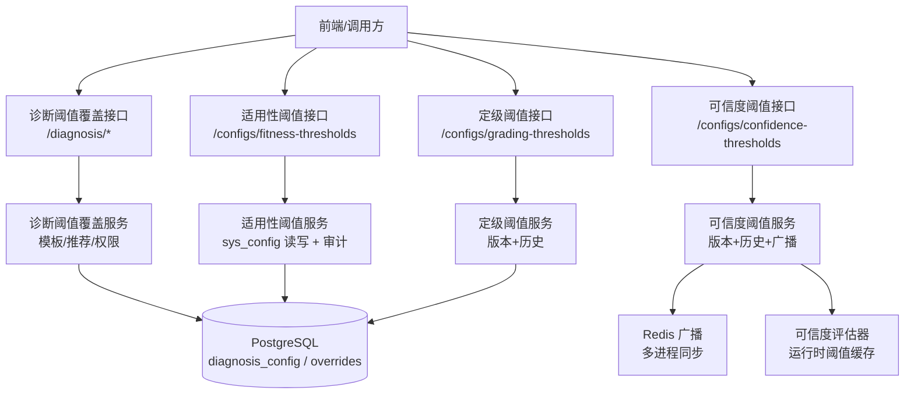
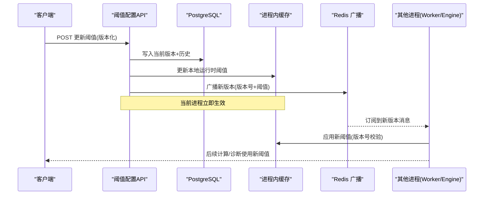
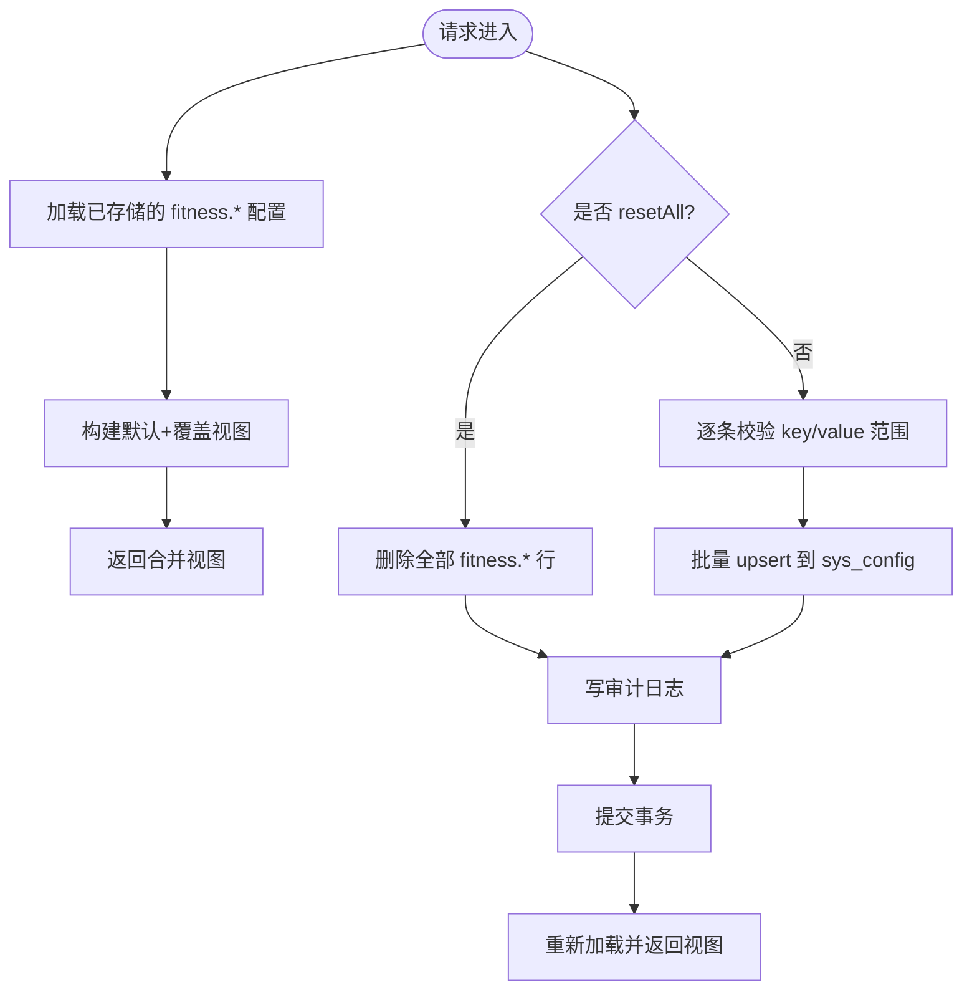
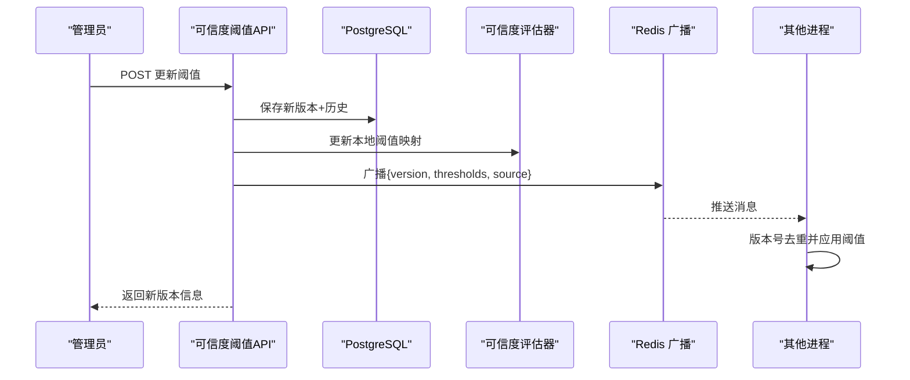
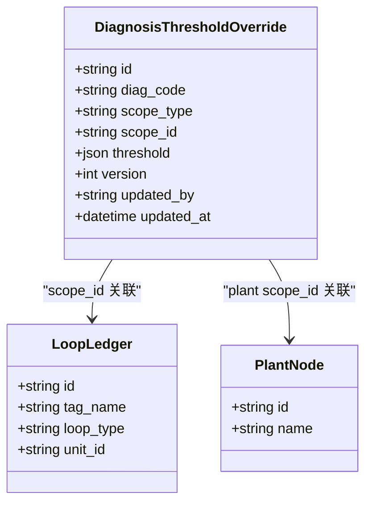
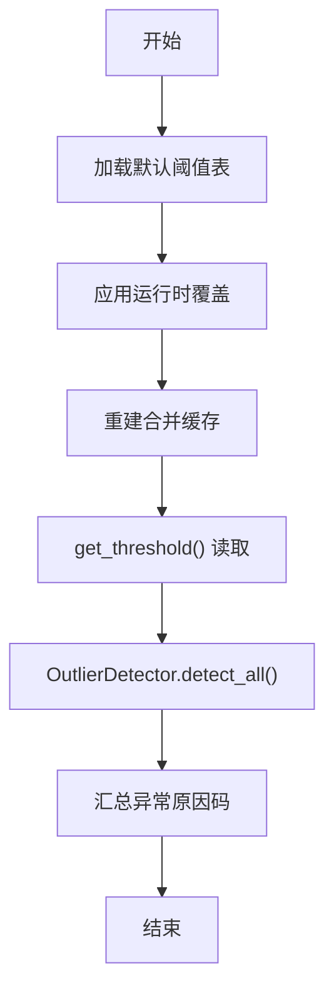
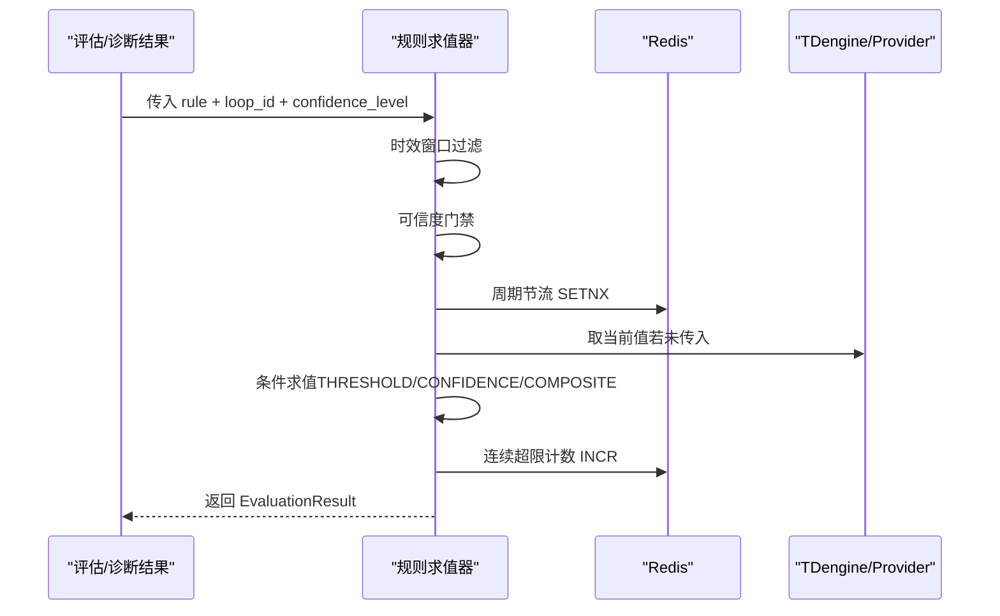
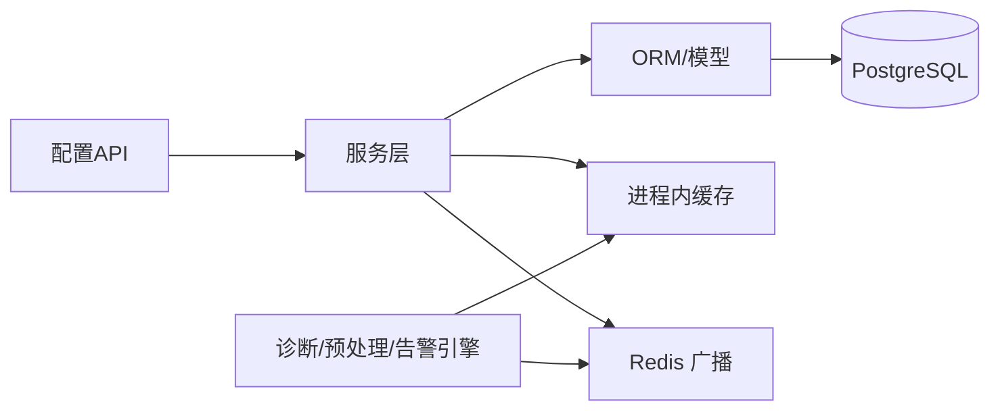

# 阈值配置接口

<cite>
**本文引用的文件**
- [backend/app/api/v1/endpoints/fitness_threshold_config.py](file://backend/app/api/v1/endpoints/fitness_threshold_config.py)
- [backend/app/api/v1/endpoints/confidence_config.py](file://backend/app/api/v1/endpoints/confidence_config.py)
- [backend/app/api/v1/endpoints/grading_config.py](file://backend/app/api/v1/endpoints/grading_config.py)
- [backend/app/services/diagnosis_threshold.py](file://backend/app/services/diagnosis_threshold.py)
- [backend/app/api/v1/endpoints/diagnosis.py](file://backend/app/api/v1/endpoints/diagnosis.py)
- [backend/app/services/preprocessing/thresholds.py](file://backend/app/services/preprocessing/thresholds.py)
- [backend/app/services/alert_rule_engine/evaluator.py](file://backend/app/services/alert_rule_engine/evaluator.py)
- [db/postgresql/01_schema.sql](file://db/postgresql/01_schema.sql)
</cite>

## 目录
1. [简介](#简介)
2. [项目结构](#项目结构)
3. [核心组件](#核心组件)
4. [架构总览](#架构总览)
5. [详细组件分析](#详细组件分析)
6. [依赖关系分析](#依赖关系分析)
7. [性能与优化建议](#性能与优化建议)
8. [故障诊断指南](#故障诊断指南)
9. [结论](#结论)
10. [附录：API 参考](#附录api-参考)

## 简介
本文件面向 CLPM-MVP 的“阈值配置接口”，围绕以下目标展开：
- 性能阈值管理：指标阈值设置、告警规则配置、自动调整机制
- 异常值检测配置：离群点识别参数、统计方法选择、阈值自适应
- 阈值版本控制：配置版本管理、灰度发布、回滚机制
- 阈值生效策略：实时生效、定时生效、条件触发
- 阈值优化建议、性能影响分析、监控告警配置
- 最佳实践与故障诊断方法

## 项目结构
后端通过 FastAPI 暴露多类阈值配置 API，并配套服务层实现版本化存储、运行时缓存、审计与广播。关键路径如下：
- 适用性阈值（L1/L2/L3）：GET/PUT /configs/fitness-thresholds
- 可信度阈值（A/B/C/D/E）：GET/POST /configs/confidence-thresholds，含历史与回滚
- 定级阈值（EXCELLENT/GOOD/FAIR/WARNING/POOR）：GET/POST /configs/grading-thresholds，含历史与回滚
- 诊断阈值覆盖：按 loop_type/plant/loop 三级范围覆盖，支持模板推荐与套用
- 异常值检测阈值：按控制类型提供默认阈值表，支持运行时覆盖与开关
- 告警规则引擎：基于 DSL 的阈值/置信度/复合规则求值与节流

图表来源
- [backend/app/api/v1/endpoints/fitness_threshold_config.py:349-432](file://backend/app/api/v1/endpoints/fitness_threshold_config.py#L349-L432)
- [backend/app/api/v1/endpoints/confidence_config.py:387-440](file://backend/app/api/v1/endpoints/confidence_config.py#L387-L440)
- [backend/app/api/v1/endpoints/grading_config.py:482-557](file://backend/app/api/v1/endpoints/grading_config.py#L482-L557)
- [backend/app/services/diagnosis_threshold.py:217-461](file://backend/app/services/diagnosis_threshold.py#L217-L461)
- [backend/app/api/v1/endpoints/diagnosis.py:234-253](file://backend/app/api/v1/endpoints/diagnosis.py#L234-L253)

章节来源
- [backend/app/api/v1/endpoints/fitness_threshold_config.py:1-432](file://backend/app/api/v1/endpoints/fitness_threshold_config.py#L1-L432)
- [backend/app/api/v1/endpoints/confidence_config.py:1-558](file://backend/app/api/v1/endpoints/confidence_config.py#L1-L558)
- [backend/app/api/v1/endpoints/grading_config.py:1-200](file://backend/app/api/v1/endpoints/grading_config.py#L1-L200)
- [backend/app/services/diagnosis_threshold.py:1-609](file://backend/app/services/diagnosis_threshold.py#L1-L609)
- [backend/app/api/v1/endpoints/diagnosis.py:234-253](file://backend/app/api/v1/endpoints/diagnosis.py#L234-L253)

## 核心组件
- 适用性阈值配置：提供 7 项 L1/L2/L3 阈值的查询与更新，保存后立即生效（下次 KPI 计算读取最新值）。
- 可信度阈值配置：5 级 A/B/C/D/E 阈值，版本化存储与历史归档，支持回滚到指定版本或算法默认；更新后通过 Redis 广播至其他进程，立即生效。
- 定级阈值配置：5 级 EXCELLENT/GOOD/FAIR/WARNING/POOR，版本化与回滚能力。
- 诊断阈值覆盖：支持 loop_type/plant/loop 三级覆盖，模板推荐与一键套用，权限边界控制（ic_engineer 仅可微调回路级）。
- 异常值检测阈值：按控制类型提供默认阈值表，支持运行时覆盖与 8 类检测开关，热路径不查库。
- 告警规则引擎：DSL 驱动的阈值/置信度/复合规则求值，支持时效窗口、持续时长、去重键、周期节流等。

章节来源
- [backend/app/api/v1/endpoints/fitness_threshold_config.py:48-168](file://backend/app/api/v1/endpoints/fitness_threshold_config.py#L48-L168)
- [backend/app/api/v1/endpoints/confidence_config.py:65-101](file://backend/app/api/v1/endpoints/confidence_config.py#L65-L101)
- [backend/app/api/v1/endpoints/grading_config.py:67-108](file://backend/app/api/v1/endpoints/grading_config.py#L67-L108)
- [backend/app/services/diagnosis_threshold.py:31-144](file://backend/app/services/diagnosis_threshold.py#L31-L144)
- [backend/app/services/preprocessing/thresholds.py:26-122](file://backend/app/services/preprocessing/thresholds.py#L26-L122)
- [backend/app/services/alert_rule_engine/evaluator.py:56-136](file://backend/app/services/alert_rule_engine/evaluator.py#L56-L136)

## 架构总览
阈值配置涉及“配置存储—运行时缓存—广播—消费”的闭环：
- 配置存储：PostgreSQL sys_config 与 diagnosis_config/overrides 表
- 运行时缓存：进程内字典（如 _merged_cache、ConfidenceEvaluator 阈值映射）
- 广播：Redis pub/sub，用于多进程阈值同步
- 消费：KPI 计算、诊断引擎、异常值检测、告警规则引擎

图表来源
- [backend/app/api/v1/endpoints/confidence_config.py:359-380](file://backend/app/api/v1/endpoints/confidence_config.py#L359-L380)
- [backend/tests/test_confidence_threshold_sync.py:94-123](file://backend/tests/test_confidence_threshold_sync.py#L94-L123)

## 详细组件分析

### 适用性阈值（L1/L2/L3）
- 功能要点
  - 提供 7 项阈值（手动主导、低自控率、OP 饱和带宽/时间占比、SP-PV 偏离幅度/时间占比、无激励 OP 变化范围、弱响应最小增益）
  - GET 返回合并视图（默认值 + 覆盖标记），PUT 支持批量更新或一键重置默认
  - 保存后即刻生效：KPI 计算任务从 sys_config 读取最新值
- 数据流
  - 读取：加载所有 fitness.* 前缀配置，构建默认+覆盖视图
  - 写入：upsert 单条或多条，记录审计日志，提交事务
- 权限与校验
  - 读取：ADMIN/IC_ENGINEER/PE_ENGINEER
  - 写入：仅 ADMIN
  - 严格范围校验（min/max/unit）

图表来源
- [backend/app/api/v1/endpoints/fitness_threshold_config.py:180-237](file://backend/app/api/v1/endpoints/fitness_threshold_config.py#L180-L237)
- [backend/app/api/v1/endpoints/fitness_threshold_config.py:291-341](file://backend/app/api/v1/endpoints/fitness_threshold_config.py#L291-L341)
- [backend/app/api/v1/endpoints/fitness_threshold_config.py:368-432](file://backend/app/api/v1/endpoints/fitness_threshold_config.py#L368-L432)

章节来源
- [backend/app/api/v1/endpoints/fitness_threshold_config.py:1-432](file://backend/app/api/v1/endpoints/fitness_threshold_config.py#L1-L432)

### 可信度阈值（A/B/C/D/E）
- 功能要点
  - 5 级阈值（A≥0.95、B≥0.80、C≥0.60、D≥0.20、E<0.20），版本化存储与历史归档
  - 支持回滚到指定版本或算法默认（version=0）
  - 更新后通过 Redis 广播，其他进程订阅后应用新版本
- 数据流
  - 保存：生成新版本，归档历史，写审计日志，提交事务
  - 运行时：更新本地阈值映射，广播新版本
  - 消费：其他进程收到消息后，按版本号去重并应用
- 权限与校验
  - 读取：ADMIN/IC_ENGINEER/PE_ENGINEER
  - 写入/回滚：仅 ADMIN
  - 严格递减校验、边界校验（level 1 ≤1.0，level 5 =0）

图表来源
- [backend/app/api/v1/endpoints/confidence_config.py:290-342](file://backend/app/api/v1/endpoints/confidence_config.py#L290-L342)
- [backend/app/api/v1/endpoints/confidence_config.py:359-380](file://backend/app/api/v1/endpoints/confidence_config.py#L359-L380)
- [backend/tests/test_confidence_threshold_sync.py:94-123](file://backend/tests/test_confidence_threshold_sync.py#L94-L123)

章节来源
- [backend/app/api/v1/endpoints/confidence_config.py:1-558](file://backend/app/api/v1/endpoints/confidence_config.py#L1-L558)

### 定级阈值（EXCELLENT/GOOD/FAIR/WARNING/POOR）
- 功能要点
  - 5 级评分区间（国标对齐），版本化存储与历史归档
  - 支持回滚到指定版本或国标默认（version=0）
- 数据流
  - 保存：校验区间连续性、边界约束，生成新版本，归档历史
  - 回滚：从历史版本恢复，生成新版本号保留追溯链
- 权限与校验
  - 读取：ADMIN/IC_ENGINEER/PE_ENGINEER
  - 写入/回滚：仅 ADMIN
  - 严格区间连续性与边界校验

章节来源
- [backend/app/api/v1/endpoints/grading_config.py:1-200](file://backend/app/api/v1/endpoints/grading_config.py#L1-L200)
- [backend/app/api/v1/endpoints/grading_config.py:482-557](file://backend/app/api/v1/endpoints/grading_config.py#L482-L557)

### 诊断阈值覆盖与模板
- 功能要点
  - 三级 scope：loop_type（模板）、plant（装置级）、loop（回路级）
  - 推荐：按回路 loop_type 匹配模板，合并全局默认→模板→装置→回路，得到生效阈值
  - 套用：一键将模板复制到目标 scope（支持权限边界）
  - 审计：每次变更记录 before/after 审计日志
- 权限
  - ic_engineer 仅可操作 loop scope（微调）
  - loop_type/plant scope 需 ADMIN
- 数据流
  - 列表/模板：查询覆盖与模板
  - 覆盖：upsert/delete 带权限校验与审计
  - 推荐：合并四级优先级，输出 scope_chain 展示来源

图表来源
- [backend/app/services/diagnosis_threshold.py:31-144](file://backend/app/services/diagnosis_threshold.py#L31-L144)
- [backend/app/services/diagnosis_threshold.py:217-461](file://backend/app/services/diagnosis_threshold.py#L217-L461)

章节来源
- [backend/app/services/diagnosis_threshold.py:1-609](file://backend/app/services/diagnosis_threshold.py#L1-L609)
- [backend/app/api/v1/endpoints/diagnosis.py:234-253](file://backend/app/api/v1/endpoints/diagnosis.py#L234-L253)

### 异常值检测阈值与自适应
- 功能要点
  - 按控制类型（流量/压力/温度/液位/成分）提供默认阈值表（采样频率、冻结窗口、跳变/尖峰阈值、噪声截止频率等）
  - 运行时覆盖：通过 sys_config outlier_params.current 注入覆盖参数，进程内缓存合并后供热路径使用
  - 检测开关：8 类检测（NaN/Inf/NULL、越界、冻结、跳变、尖峰、时间戳异常、质量码坏、高频噪声）可按需启用/禁用
  - 自适应：OutlierDetector 根据 ControlTypeThreshold 执行多类检测，支持归一化量程与采样频率自适应
- 数据流
  - 设置覆盖：set_threshold_overrides() 重建合并缓存
  - 读取阈值：get_threshold() 直接读内存缓存，不查库
  - 检测流程：OutlierDetector.detect_all() 汇总异常原因码

图表来源
- [backend/app/services/preprocessing/thresholds.py:125-181](file://backend/app/services/preprocessing/thresholds.py#L125-L181)
- [backend/app/services/preprocessing/thresholds.py:218-253](file://backend/app/services/preprocessing/thresholds.py#L218-L253)
- [backend/app/services/preprocessing/outlier_detection.py:418-477](file://backend/app/services/preprocessing/outlier_detection.py#L418-L477)

章节来源
- [backend/app/services/preprocessing/thresholds.py:1-286](file://backend/app/services/preprocessing/thresholds.py#L1-L286)
- [backend/app/services/preprocessing/outlier_detection.py:398-477](file://backend/app/services/preprocessing/outlier_detection.py#L398-L477)

### 告警规则引擎与阈值联动
- 功能要点
  - 规则类型：THRESHOLD、CONFIDENCE、COMPOSITE、METRIC_THRESHOLD（基于评估/诊断结果）
  - 求值流程：时效窗口过滤 → 可信度门禁 → 条件求值 → 持续时长检查 → dedupKey 渲染
  - 指标阈值预警：周期节流（Redis SETNX）、数据新鲜度检查、连续超限计数
- 数据流
  - evaluate_rule() 统一入口，分发到具体求值函数
  - METRIC_THRESHOLD 使用 Redis 做周期节流与计数，避免频繁告警

图表来源
- [backend/app/services/alert_rule_engine/evaluator.py:56-136](file://backend/app/services/alert_rule_engine/evaluator.py#L56-L136)
- [backend/app/services/alert_rule_engine/evaluator.py:443-469](file://backend/app/services/alert_rule_engine/evaluator.py#L443-L469)

章节来源
- [backend/app/services/alert_rule_engine/evaluator.py:1-200](file://backend/app/services/alert_rule_engine/evaluator.py#L1-L200)

## 依赖关系分析
- 数据库依赖
  - PostgreSQL：sys_config（通用配置）、diagnosis_config（诊断配置）、diagnosis_threshold_override（覆盖）、audit log（审计）
  - 表结构与注释体现阈值字段、版本字段、权重与公式等元数据
- 缓存与消息
  - Redis：阈值广播、周期节流、连续超限计数
- 模块耦合
  - 配置 API → 服务层 → 模型/ORM → 数据库
  - 服务层 → 运行时缓存（进程内字典）
  - 服务层 → Redis 广播（跨进程同步）
  - 诊断/预处理/告警引擎 → 阈值服务（读取合并后的阈值）

图表来源
- [db/postgresql/01_schema.sql:244-273](file://db/postgresql/01_schema.sql#L244-L273)
- [backend/app/api/v1/endpoints/confidence_config.py:359-380](file://backend/app/api/v1/endpoints/confidence_config.py#L359-L380)

章节来源
- [db/postgresql/01_schema.sql:244-273](file://db/postgresql/01_schema.sql#L244-L273)
- [backend/app/api/v1/endpoints/confidence_config.py:359-380](file://backend/app/api/v1/endpoints/confidence_config.py#L359-L380)

## 性能与优化建议
- 运行时缓存优先
  - 异常值检测阈值通过进程内缓存读取，避免热路径查库，提升吞吐
  - 可信度阈值更新后广播，其他进程订阅即生效，减少重启成本
- 节流与去重
  - 指标阈值预警使用 Redis 周期节流与连续超限计数，降低告警风暴
  - dedupKey 渲染避免重复告警
- 版本化与灰度
  - 可信度/定级阈值版本化，支持回滚到历史版本或默认值，便于灰度验证
  - 建议在灰度阶段先小范围启用新阈值，观察 KPI/告警变化后再全量
- 监控与观测
  - 关注阈值变更审计日志、Redis 广播失败日志、阈值解析失败回退日志
  - 对阈值变更前后关键指标（好值率、自控率、定级分布）进行对比监控

[本节为通用指导，无需特定文件引用]

## 故障诊断指南
- 常见问题定位
  - 阈值未生效：检查是否成功广播（Redis 广播失败会降级为重启预载）
  - 阈值解析失败：系统会回退到默认值并记录警告日志
  - 权限不足：ic_engineer 仅能操作 loop scope，非 loop 需 ADMIN
  - 版本不存在：回滚时校验历史版本是否存在
- 排查步骤
  - 查看审计日志：确认变更前后快照与操作人
  - 检查运行时缓存：确认合并后的阈值是否正确
  - 检查 Redis：确认广播消息与订阅状态
  - 检查规则引擎：确认时效窗口、可信度门禁、持续时长配置

章节来源
- [backend/app/api/v1/endpoints/confidence_config.py:359-380](file://backend/app/api/v1/endpoints/confidence_config.py#L359-L380)
- [backend/app/api/v1/endpoints/fitness_threshold_config.py:260-284](file://backend/app/api/v1/endpoints/fitness_threshold_config.py#L260-L284)
- [backend/app/services/diagnosis_threshold.py:78-93](file://backend/app/services/diagnosis_threshold.py#L78-L93)
- [backend/app/api/v1/endpoints/grading_config.py:482-557](file://backend/app/api/v1/endpoints/grading_config.py#L482-L557)

## 结论
CLPM-MVP 的阈值配置体系以“版本化+运行时缓存+广播”为核心，实现了：
- 灵活的多维度阈值管理（适用性、可信度、定级、诊断覆盖、异常值检测）
- 安全的权限与审计（角色边界、before/after 快照）
- 高效的生效策略（实时生效、周期节流、条件触发）
- 可靠的回滚与灰度（版本历史、回滚到默认/历史版本）
建议在生产环境中结合监控与审计，逐步灰度验证阈值变更，确保稳定性与准确性。

[本节为总结，无需特定文件引用]

## 附录：API 参考
- 适用性阈值
  - GET /api/v1/configs/fitness-thresholds：获取合并视图（默认+覆盖）
  - PUT /api/v1/configs/fitness-thresholds：批量更新或重置默认（仅 ADMIN）
- 可信度阈值
  - GET /api/v1/configs/confidence-thresholds：获取当前阈值
  - POST /api/v1/configs/confidence-thresholds：更新阈值（保存为新版本）
  - GET /api/v1/configs/confidence-thresholds/history：版本历史
  - POST /api/v1/configs/confidence-thresholds/{version}/rollback：回滚到指定版本或默认
- 定级阈值
  - GET /api/v1/configs/grading-thresholds：获取当前阈值
  - POST /api/v1/configs/grading-thresholds：更新阈值（保存为新版本）
  - GET /api/v1/configs/grading-thresholds/history：版本历史
  - POST /api/v1/configs/grading-thresholds/{version}/rollback：回滚到指定版本或默认
- 诊断阈值覆盖
  - GET /api/v1/diagnosis/threshold-overrides：列出覆盖（可按 scope 筛选）
  - GET /api/v1/diagnosis/threshold-templates：列出模板（loop_type scope）
  - 覆盖 CRUD：通过服务层 upsert/delete（权限校验与审计）

章节来源
- [backend/app/api/v1/endpoints/fitness_threshold_config.py:349-432](file://backend/app/api/v1/endpoints/fitness_threshold_config.py#L349-L432)
- [backend/app/api/v1/endpoints/confidence_config.py:387-557](file://backend/app/api/v1/endpoints/confidence_config.py#L387-L557)
- [backend/app/api/v1/endpoints/grading_config.py:482-557](file://backend/app/api/v1/endpoints/grading_config.py#L482-L557)
- [backend/app/api/v1/endpoints/diagnosis.py:234-253](file://backend/app/api/v1/endpoints/diagnosis.py#L234-L253)