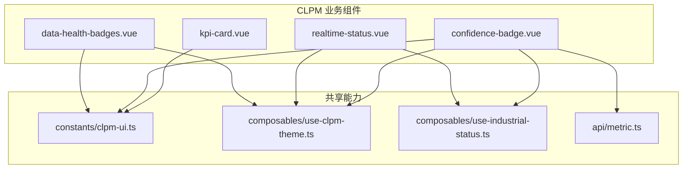
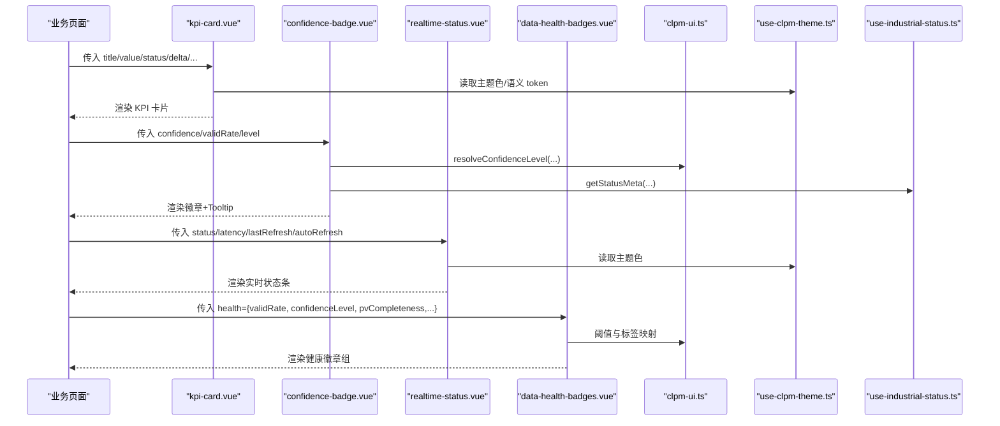
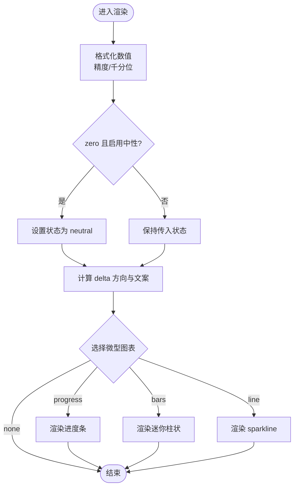
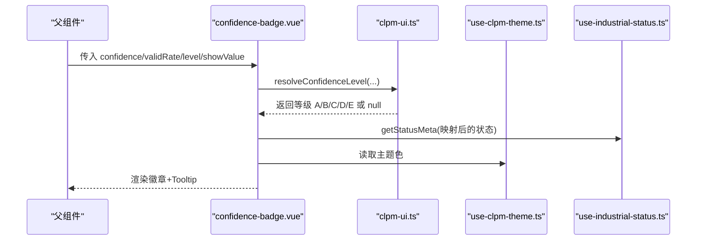
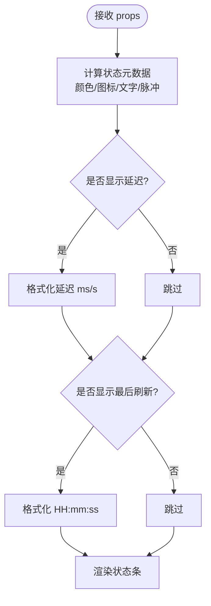
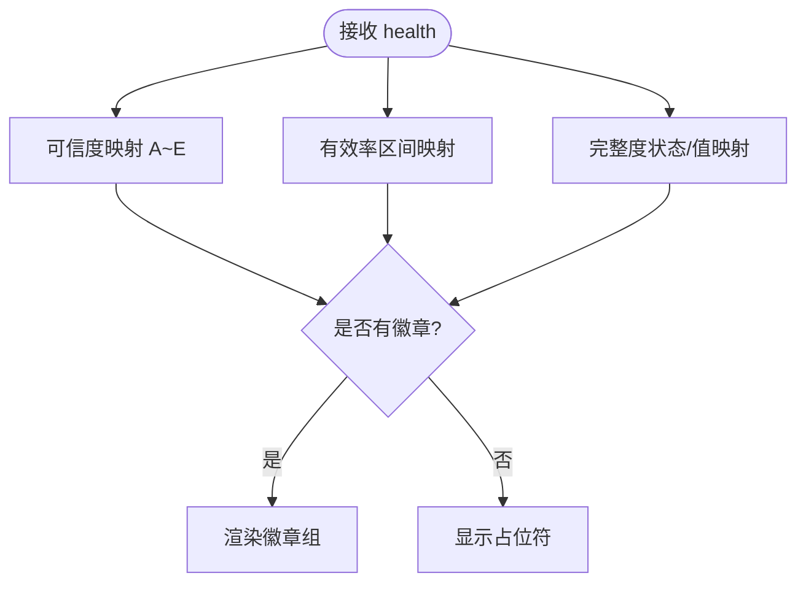
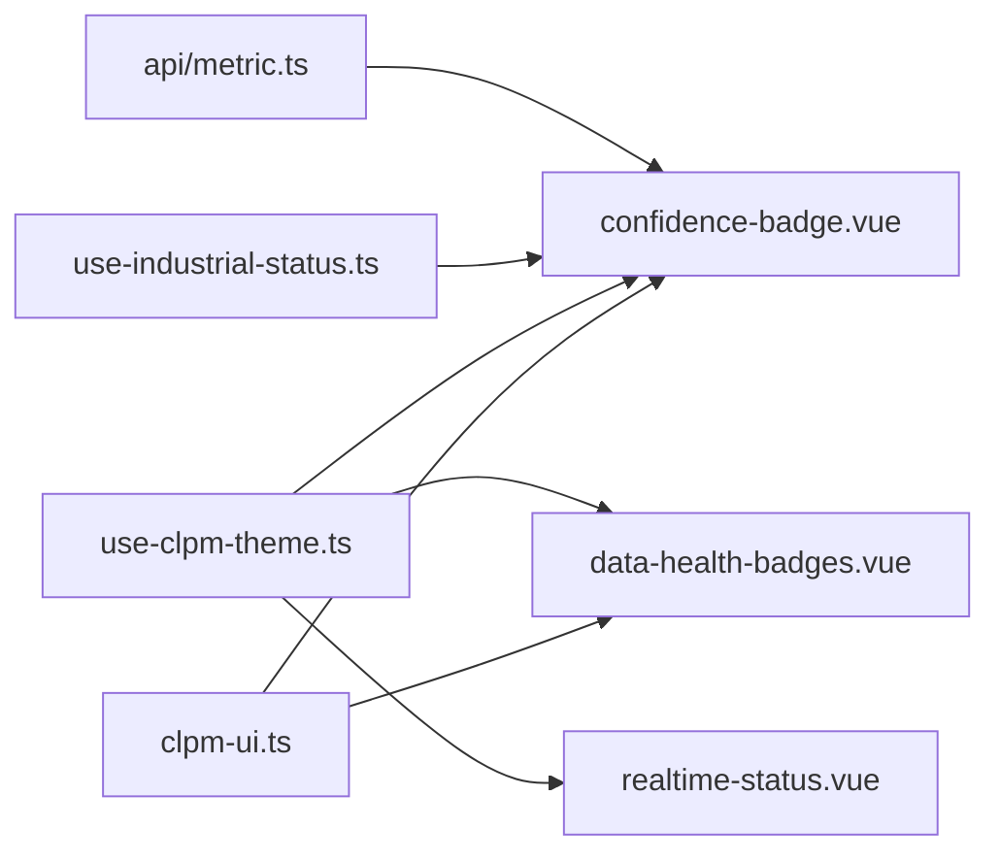

# CLPM 业务组件

<cite>
**本文引用的文件**
- [kpi-card.vue](file://frontend/apps/web-antd/src/components/clpm/kpi-card.vue)
- [confidence-badge.vue](file://frontend/apps/web-antd/src/components/clpm/confidence-badge.vue)
- [realtime-status.vue](file://frontend/apps/web-antd/src/components/clpm/realtime-status.vue)
- [data-health-badges.vue](file://frontend/apps/web-antd/src/components/clpm/data-health-badges.vue)
- [clpm-ui.ts](file://frontend/apps/web-antd/src/constants/clpm-ui.ts)
- [metric.ts](file://frontend/apps/web-antd/src/api/metric.ts)
- [use-clpm-theme.ts](file://frontend/apps/web-antd/src/composables/use-clpm-theme.ts)
- [use-industrial-status.ts](file://frontend/apps/web-antd/src/composables/use-industrial-status.ts)
</cite>

## 目录
1. [简介](#简介)
2. [项目结构](#项目结构)
3. [核心组件总览](#核心组件总览)
4. [架构总览](#架构总览)
5. [组件详细分析](#组件详细分析)
6. [依赖关系分析](#依赖关系分析)
7. [性能与可访问性](#性能与可访问性)
8. [故障排查指南](#故障排查指南)
9. [结论](#结论)
10. [附录：使用示例与最佳实践](#附录使用示例与最佳实践)

## 简介
本文件面向 CLPM（控制回路性能管理）前端业务组件，系统性说明以下四个核心组件的实现、接口与组合方式：
- kpi-card（KPI 指标卡片）
- confidence-badge（置信度徽章）
- realtime-status（实时状态指示器）
- data-health-badges（数据健康徽章）

文档覆盖 Props 接口、事件处理、插槽使用、TypeScript 类型、样式定制、响应式行为，以及组件间的数据流与组合模式，并提供在不同业务场景下的使用建议与最佳实践。

## 项目结构
这些组件位于统一的前端应用包中，遵循 Vue 3 + TypeScript 的单文件组件规范，并通过常量与组合式函数统一主题、语义色与可信度等级映射。

图表来源
- [kpi-card.vue:1-530](file://frontend/apps/web-antd/src/components/clpm/kpi-card.vue#L1-L530)
- [confidence-badge.vue:1-105](file://frontend/apps/web-antd/src/components/clpm/confidence-badge.vue#L1-L105)
- [realtime-status.vue:1-225](file://frontend/apps/web-antd/src/components/clpm/realtime-status.vue#L1-L225)
- [data-health-badges.vue:1-244](file://frontend/apps/web-antd/src/components/clpm/data-health-badges.vue#L1-L244)
- [clpm-ui.ts:1-572](file://frontend/apps/web-antd/src/constants/clpm-ui.ts#L1-L572)
- [use-clpm-theme.ts:1-191](file://frontend/apps/web-antd/src/composables/use-clpm-theme.ts#L1-L191)
- [use-industrial-status.ts:1-187](file://frontend/apps/web-antd/src/composables/use-industrial-status.ts#L1-L187)
- [metric.ts:1-800](file://frontend/apps/web-antd/src/api/metric.ts#L1-L800)

章节来源
- [kpi-card.vue:1-530](file://frontend/apps/web-antd/src/components/clpm/kpi-card.vue#L1-L530)
- [confidence-badge.vue:1-105](file://frontend/apps/web-antd/src/components/clpm/confidence-badge.vue#L1-L105)
- [realtime-status.vue:1-225](file://frontend/apps/web-antd/src/components/clpm/realtime-status.vue#L1-L225)
- [data-health-badges.vue:1-244](file://frontend/apps/web-antd/src/components/clpm/data-health-badges.vue#L1-L244)
- [clpm-ui.ts:1-572](file://frontend/apps/web-antd/src/constants/clpm-ui.ts#L1-L572)
- [use-clpm-theme.ts:1-191](file://frontend/apps/web-antd/src/composables/use-clpm-theme.ts#L1-L191)
- [use-industrial-status.ts:1-187](file://frontend/apps/web-antd/src/composables/use-industrial-status.ts#L1-L187)
- [metric.ts:1-800](file://frontend/apps/web-antd/src/api/metric.ts#L1-L800)

## 核心组件总览
- KPI 指标卡片（ClpmKpiCard）
  - 职责：展示单一关键指标的标题、数值、单位、上下文信息、变化量徽标与微型图表（进度条/迷你柱状/sparkline）。
  - 交互：可选点击与键盘可达；支持加载态。
  - 主题：基于工业语义 token 的状态色与中性色策略。
- 置信度徽章（ConfidenceBadge）
  - 职责：以徽章形式展示可信度等级（A~E），并附带 Tooltip 解释。
  - 数据源：优先使用后端返回的等级，否则按有效数据率或旧字段推断。
- 实时状态指示器（ClpmRealtimeStatus）
  - 职责：统一表达在线/延迟/失败/刷新中/离线等实时状态，附带延迟与最后刷新时间。
  - 主题：基于 --status-* 变量族，带脉冲动画提示活跃状态。
- 数据健康徽章组（ClpmDataHealthBadges）
  - 职责：紧凑展示可信度、预处理有效率、PV 完整度三项健康指标，支持紧凑模式与 Tooltip 补充信息。

章节来源
- [kpi-card.vue:1-530](file://frontend/apps/web-antd/src/components/clpm/kpi-card.vue#L1-L530)
- [confidence-badge.vue:1-105](file://frontend/apps/web-antd/src/components/clpm/confidence-badge.vue#L1-L105)
- [realtime-status.vue:1-225](file://frontend/apps/web-antd/src/components/clpm/realtime-status.vue#L1-L225)
- [data-health-badges.vue:1-244](file://frontend/apps/web-antd/src/components/clpm/data-health-badges.vue#L1-L244)

## 架构总览
组件通过统一的常量与组合式函数实现“业务状态 → 语义 token → 表现层”的三层映射，确保跨页面一致的主题与色彩。

图表来源
- [kpi-card.vue:1-530](file://frontend/apps/web-antd/src/components/clpm/kpi-card.vue#L1-L530)
- [confidence-badge.vue:1-105](file://frontend/apps/web-antd/src/components/clpm/confidence-badge.vue#L1-L105)
- [realtime-status.vue:1-225](file://frontend/apps/web-antd/src/components/clpm/realtime-status.vue#L1-L225)
- [data-health-badges.vue:1-244](file://frontend/apps/web-antd/src/components/clpm/data-health-badges.vue#L1-L244)
- [clpm-ui.ts:1-572](file://frontend/apps/web-antd/src/constants/clpm-ui.ts#L1-L572)
- [use-clpm-theme.ts:1-191](file://frontend/apps/web-antd/src/composables/use-clpm-theme.ts#L1-L191)
- [use-industrial-status.ts:1-187](file://frontend/apps/web-antd/src/composables/use-industrial-status.ts#L1-L187)

## 组件详细分析

### KPI 指标卡片（ClpmKpiCard）
- 设计要点
  - 顶部：标题 + 可选 info tooltip；装饰图标背景与颜色由异常态决定。
  - 中部：大数字（等宽字体、tabular-nums）+ 单位。
  - 底部：左侧上下文文本 + 右侧 delta 徽标（方向箭头与正负号自动处理）。
  - 微型图表：三选一（progress / microBars / sparkline），优先级明确。
  - 零值中性化：当 neutralWhenZero 为真且值为 0 时强制中性色。
- Props 接口（摘要）
  - title: string
  - value: number | string
  - unit?: string
  - status?: 'error' | 'info' | 'neutral' | 'ok' | 'warning'
  - icon?: string
  - precision?: number
  - groupSeparator?: boolean
  - contextText?: string
  - delta?: number | string
  - deltaUnit?: string
  - deltaReverse?: boolean
  - infoTip?: string
  - progress?: number
  - microBars?: number[]
  - sparkline?: number[]
  - loading?: boolean
  - clickable?: boolean
  - neutralWhenZero?: boolean
- 事件
  - click: 当 clickable 为 true 时触发，兼容鼠标与键盘（Enter/Space）。
- 计算与逻辑
  - 格式化 value（精度、千分位）、effectiveStatus（零值中性化）、isAlertStatus（仅 warning/error 着色）。
  - delta 方向判定与文案生成（数字自动加正号）。
  - 微型图表选择与 sparkline SVG path 构建。
- 样式定制
  - 通过 CSS 变量与 Tailwind 类名控制尺寸、圆角、阴影与过渡。
  - 异常态下图标与数值采用状态色；非异常态采用中性色。
- 使用建议
  - 在仪表盘顶部展示聚合 KPI；在列表行内展示单回路 KPI。
  - 提供 sparkline 时建议至少 2 个点；microBars 建议长度适中避免拥挤。

图表来源
- [kpi-card.vue:88-228](file://frontend/apps/web-antd/src/components/clpm/kpi-card.vue#L88-L228)
- [kpi-card.vue:231-353](file://frontend/apps/web-antd/src/components/clpm/kpi-card.vue#L231-L353)

章节来源
- [kpi-card.vue:1-530](file://frontend/apps/web-antd/src/components/clpm/kpi-card.vue#L1-L530)

### 置信度徽章（ConfidenceBadge）
- 设计要点
  - 显示等级 A~E，支持附加百分比（showValue=true）。
  - Tooltip 包含等级名称、有效数据率与详细说明。
- Props 接口（摘要）
  - confidence?: null | number（旧字段兼容）
  - validRate?: null | number（优先用于等级判定）
  - level?: ConfidenceLevel | null（后端直接返回等级）
  - showValue?: boolean
- 数据流
  - 使用 resolveConfidenceLevel 优先取 level，其次按 validRate 推断，最后退化到 confidence。
  - 使用 useIndustrialStatus 获取状态元数据，结合 useClpmTheme 获取主题色。
- 使用建议
  - 在 KPI 卡片或列表单元格中嵌入，配合 Tooltip 解释等级含义。
  - 当后端已返回 level 时，无需再传 validRate/confidence。

图表来源
- [confidence-badge.vue:1-105](file://frontend/apps/web-antd/src/components/clpm/confidence-badge.vue#L1-L105)
- [clpm-ui.ts:1-572](file://frontend/apps/web-antd/src/constants/clpm-ui.ts#L1-L572)
- [use-clpm-theme.ts:1-191](file://frontend/apps/web-antd/src/composables/use-clpm-theme.ts#L1-L191)
- [use-industrial-status.ts:1-187](file://frontend/apps/web-antd/src/composables/use-industrial-status.ts#L1-L187)

章节来源
- [confidence-badge.vue:1-105](file://frontend/apps/web-antd/src/components/clpm/confidence-badge.vue#L1-L105)
- [clpm-ui.ts:1-572](file://frontend/apps/web-antd/src/constants/clpm-ui.ts#L1-L572)
- [use-clpm-theme.ts:1-191](file://frontend/apps/web-antd/src/composables/use-clpm-theme.ts#L1-L191)
- [use-industrial-status.ts:1-187](file://frontend/apps/web-antd/src/composables/use-industrial-status.ts#L1-L187)

### 实时状态指示器（ClpmRealtimeStatus）
- 设计要点
  - 统一表达 delay/failed/offline/online/refreshing 五种状态。
  - 支持显示延迟（毫秒/秒）与最后刷新时间（HH:mm:ss）。
  - 自动刷新时显示间隔；在线/刷新中状态带脉冲动画。
- Props 接口（摘要）
  - status: 'delayed' | 'failed' | 'offline' | 'online' | 'refreshing'
  - latency?: number
  - lastRefresh?: number | string
  - autoRefresh?: boolean
  - refreshInterval?: number
  - showLatency?: boolean
  - showLastRefresh?: boolean
  - size?: 'default' | 'small'
- 样式与动画
  - 基于 --status-* 变量族，使用 color-mix 派生半透明背景/边框。
  - pulse 动画用于在线/刷新中状态。
- 使用建议
  - 在页面头部或数据面板右上角放置，便于快速感知数据新鲜度与健康度。
  - 在自动刷新场景中，合理设置 refreshInterval 以避免过度刷新。

图表来源
- [realtime-status.vue:64-136](file://frontend/apps/web-antd/src/components/clpm/realtime-status.vue#L64-L136)
- [realtime-status.vue:139-167](file://frontend/apps/web-antd/src/components/clpm/realtime-status.vue#L139-L167)

章节来源
- [realtime-status.vue:1-225](file://frontend/apps/web-antd/src/components/clpm/realtime-status.vue#L1-L225)

### 数据健康徽章组（ClpmDataHealthBadges）
- 设计要点
  - 紧凑堆叠三个指标：可信度（A~E）、预处理有效率（%）、PV 完整度（%）。
  - 色彩语义：绿=优、蓝=良、黄=注意、红=差（警告并入红色系）、灰=无数据。
  - 支持紧凑模式与 Tooltip 补充缺失列与巡检时间。
- Props 接口（摘要）
  - health?: { validRate?, confidenceLevel?, pvCompleteness?, integrityStatus?, missingColumns?, lastIntegrityCheck? }
  - compact?: boolean
  - showPvCompleteness?: boolean
- 逻辑与配色
  - 可信度：直接映射 A~E 到颜色与标签。
  - 有效率：按阈值区间映射颜色。
  - PV 完整度：优先依据完整性状态，否则回退到完整度值。
- 使用建议
  - 在测点配置页或回路详情页表格行中使用紧凑模式。
  - 在需要突出 PV 信息的页面，可通过 showPvCompleteness=false 避免重复。

图表来源
- [data-health-badges.vue:53-155](file://frontend/apps/web-antd/src/components/clpm/data-health-badges.vue#L53-L155)
- [data-health-badges.vue:158-207](file://frontend/apps/web-antd/src/components/clpm/data-health-badges.vue#L158-L207)

章节来源
- [data-health-badges.vue:1-244](file://frontend/apps/web-antd/src/components/clpm/data-health-badges.vue#L1-L244)

## 依赖关系分析
- 常量与映射
  - clpm-ui.ts 集中定义可信度等级阈值、标签、描述与状态 token 映射，供各组件统一消费。
  - metric.ts 定义 API 类型（如 ConfidenceLevel、KpiCard、RankingItem 等），保证前后端契约一致。
- 主题与状态
  - use-clpm-theme.ts 提供响应式色板（浅色/深色），确保图表与业务组件在暗色模式下可读。
  - use-industrial-status.ts 将业务枚举映射到工业语义 token，并输出颜色、背景、边框与默认文案。
- 组件耦合
  - confidence-badge 强依赖 clpm-ui 与 use-industrial-status。
  - realtime-status 依赖主题与状态工具，独立于业务枚举。
  - data-health-badges 依赖 clpm-ui 的阈值与标签映射。
  - kpi-card 主要依赖主题与自身内部逻辑，不直接依赖业务枚举。

图表来源
- [clpm-ui.ts:1-572](file://frontend/apps/web-antd/src/constants/clpm-ui.ts#L1-L572)
- [use-clpm-theme.ts:1-191](file://frontend/apps/web-antd/src/composables/use-clpm-theme.ts#L1-L191)
- [use-industrial-status.ts:1-187](file://frontend/apps/web-antd/src/composables/use-industrial-status.ts#L1-L187)
- [metric.ts:1-800](file://frontend/apps/web-antd/src/api/metric.ts#L1-L800)
- [confidence-badge.vue:1-105](file://frontend/apps/web-antd/src/components/clpm/confidence-badge.vue#L1-L105)
- [data-health-badges.vue:1-244](file://frontend/apps/web-antd/src/components/clpm/data-health-badges.vue#L1-L244)
- [realtime-status.vue:1-225](file://frontend/apps/web-antd/src/components/clpm/realtime-status.vue#L1-L225)

章节来源
- [clpm-ui.ts:1-572](file://frontend/apps/web-antd/src/constants/clpm-ui.ts#L1-L572)
- [use-clpm-theme.ts:1-191](file://frontend/apps/web-antd/src/composables/use-clpm-theme.ts#L1-L191)
- [use-industrial-status.ts:1-187](file://frontend/apps/web-antd/src/composables/use-industrial-status.ts#L1-L187)
- [metric.ts:1-800](file://frontend/apps/web-antd/src/api/metric.ts#L1-L800)

## 性能与可访问性
- 性能
  - 微型图表（sparkline/bars）仅在必要时渲染，避免多余 DOM。
  - 计算属性缓存频繁变换的值（如 effectiveStatus、delta 方向、tooltip 内容）。
  - 实时状态条使用轻量 CSS 动画，避免重排重绘开销。
- 可访问性
  - kpi-card 支持 clickable 时的键盘操作（Enter/Space），具备 role="button" 与 tabindex。
  - 所有徽章与状态条均提供 Tooltip，增强信息可理解性。
- 主题与对比度
  - 通过 use-clpm-theme 与 --status-* 变量族确保明暗主题下的一致对比度。
  - 异常态使用高对比色，中性态使用低对比色，符合工业看板阅读习惯。

[本节为通用指导，不直接分析具体文件]

## 故障排查指南
- 置信度徽章显示问号或空值
  - 检查传入的 level/validRate/confidence 是否为空或 NaN。
  - 确认后端是否正确返回 confidenceLevel；若未返回，需确保 validRate 有效。
  - 参考：[confidence-badge.vue:37-47](file://frontend/apps/web-antd/src/components/clpm/confidence-badge.vue#L37-L47)、[clpm-ui.ts:72-92](file://frontend/apps/web-antd/src/constants/clpm-ui.ts#L72-L92)
- 实时状态条颜色异常或不可见
  - 检查 --status-* 变量是否在主题作用域生效；避免对 hex 变量使用 hsl() 包装。
  - 确认传入的 status 值属于允许集合。
  - 参考：[realtime-status.vue:64-108](file://frontend/apps/web-antd/src/components/clpm/realtime-status.vue#L64-L108)
- KPI 卡片零值着色不符合预期
  - 如需零值不着色，请设置 neutralWhenZero=true。
  - 参考：[kpi-card.vue:99-109](file://frontend/apps/web-antd/src/components/clpm/kpi-card.vue#L99-L109)
- 数据健康徽章组未显示任何徽章
  - 检查 health 对象中的字段是否齐全；确认 showPvCompleteness 开关。
  - 参考：[data-health-badges.vue:134-140](file://frontend/apps/web-antd/src/components/clpm/data-health-badges.vue#L134-L140)

章节来源
- [confidence-badge.vue:1-105](file://frontend/apps/web-antd/src/components/clpm/confidence-badge.vue#L1-L105)
- [realtime-status.vue:1-225](file://frontend/apps/web-antd/src/components/clpm/realtime-status.vue#L1-L225)
- [kpi-card.vue:1-530](file://frontend/apps/web-antd/src/components/clpm/kpi-card.vue#L1-L530)
- [data-health-badges.vue:1-244](file://frontend/apps/web-antd/src/components/clpm/data-health-badges.vue#L1-L244)
- [clpm-ui.ts:1-572](file://frontend/apps/web-antd/src/constants/clpm-ui.ts#L1-L572)

## 结论
这四个 CLPM 业务组件通过统一的常量与组合式函数实现了高度一致的视觉语言与交互体验。它们分别聚焦于指标展示、可信度表达、实时状态与健康度概览，既可单独使用，也可组合形成丰富的数据面板。建议在业务场景中优先使用后端返回的等级字段，并结合 Tooltip 与紧凑布局提升信息密度与可读性。

[本节为总结性内容，不直接分析具体文件]

## 附录：使用示例与最佳实践
- KPI 指标卡片
  - 仪表盘聚合：传入 title、value、unit、status、contextText、delta、sparkline。
  - 列表行内：传入 progress 或 microBars，减少视觉噪音。
  - 参考路径：[kpi-card.vue:24-86](file://frontend/apps/web-antd/src/components/clpm/kpi-card.vue#L24-L86)
- 置信度徽章
  - 优先传 level；若无则传 validRate；旧系统可传 confidence。
  - showValue=true 时显示等级与百分比；Tooltip 自动填充说明。
  - 参考路径：[confidence-badge.vue:16-32](file://frontend/apps/web-antd/src/components/clpm/confidence-badge.vue#L16-L32)、[clpm-ui.ts:72-92](file://frontend/apps/web-antd/src/constants/clpm-ui.ts#L72-L92)
- 实时状态指示器
  - 自动刷新场景：设置 autoRefresh=true 与 refreshInterval；显示 lastRefresh 与 latency。
  - 小屏适配：size="small" 缩小间距与字号。
  - 参考路径：[realtime-status.vue:28-55](file://frontend/apps/web-antd/src/components/clpm/realtime-status.vue#L28-L55)
- 数据健康徽章组
  - 测点配置页：compact=true，隐藏 PV 完整度（showPvCompleteness=false）避免重复。
  - 回路详情页：显示全部三项，Tooltip 展示缺失列与巡检时间。
  - 参考路径：[data-health-badges.vue:10-51](file://frontend/apps/web-antd/src/components/clpm/data-health-badges.vue#L10-L51)

章节来源
- [kpi-card.vue:1-530](file://frontend/apps/web-antd/src/components/clpm/kpi-card.vue#L1-L530)
- [confidence-badge.vue:1-105](file://frontend/apps/web-antd/src/components/clpm/confidence-badge.vue#L1-L105)
- [realtime-status.vue:1-225](file://frontend/apps/web-antd/src/components/clpm/realtime-status.vue#L1-L225)
- [data-health-badges.vue:1-244](file://frontend/apps/web-antd/src/components/clpm/data-health-badges.vue#L1-L244)
- [clpm-ui.ts:1-572](file://frontend/apps/web-antd/src/constants/clpm-ui.ts#L1-L572)
- [metric.ts:1-800](file://frontend/apps/web-antd/src/api/metric.ts#L1-L800)