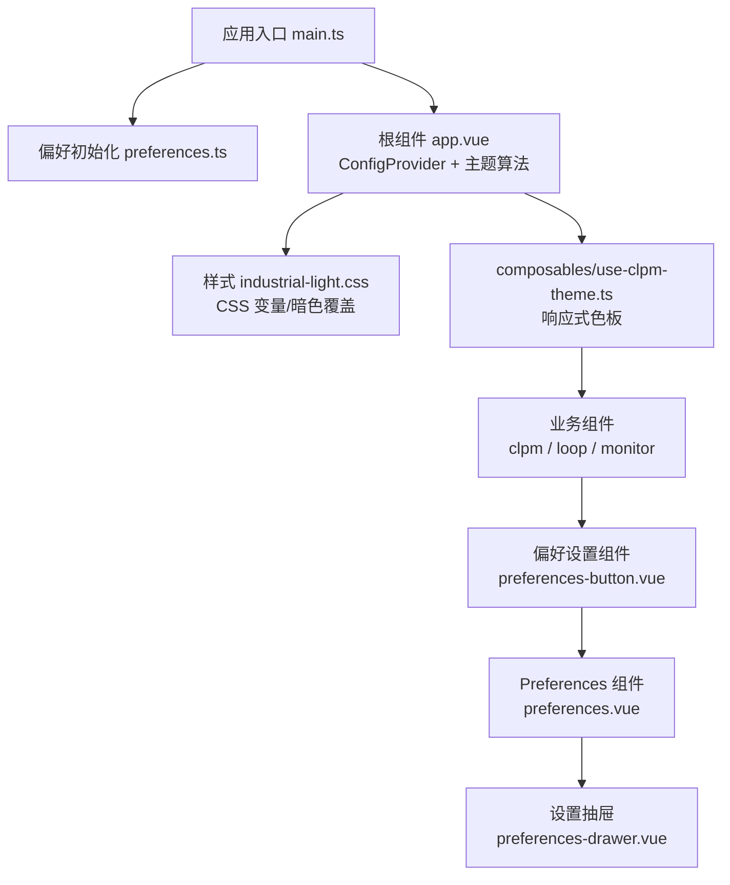
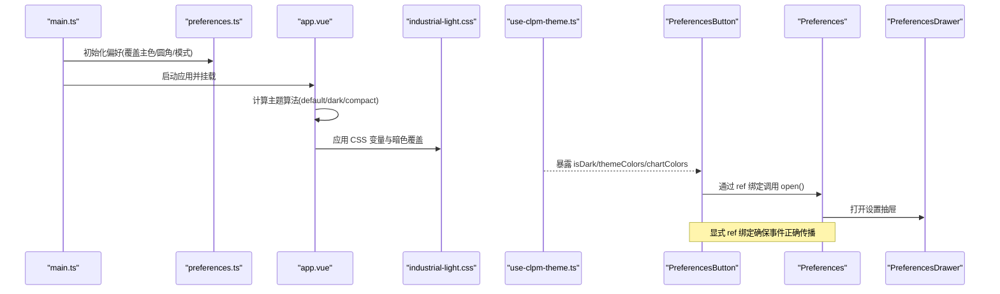
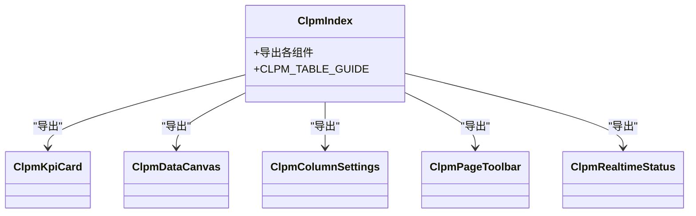
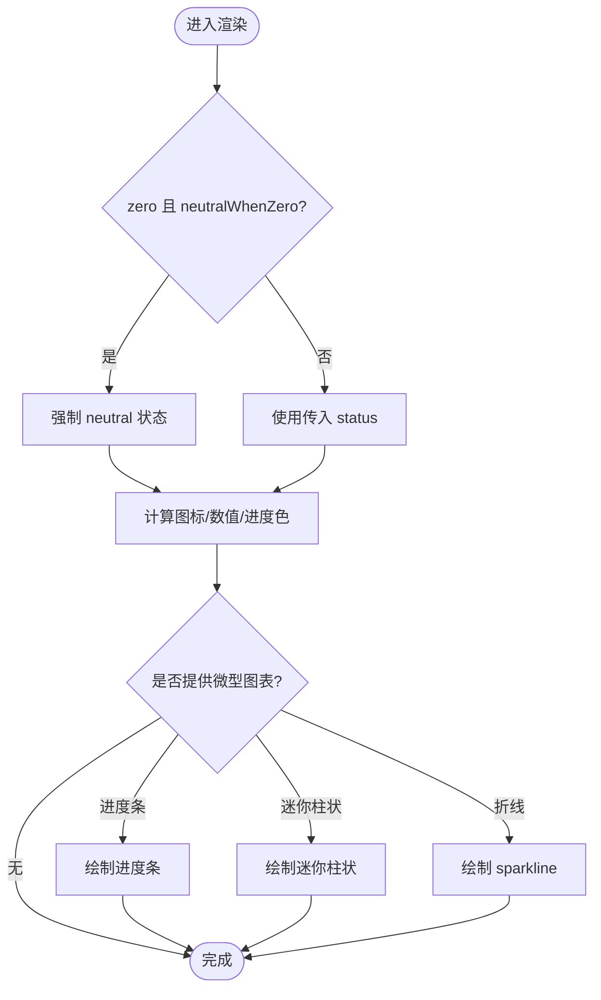
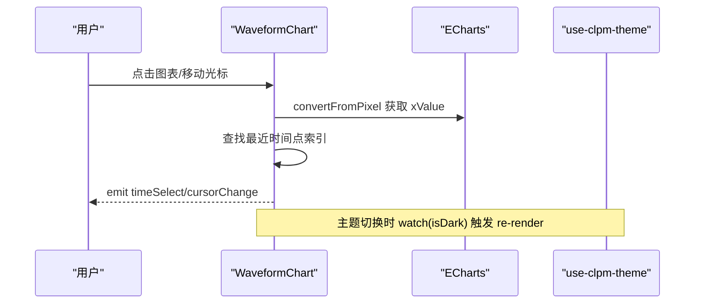
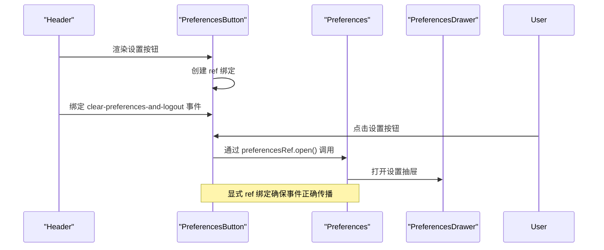
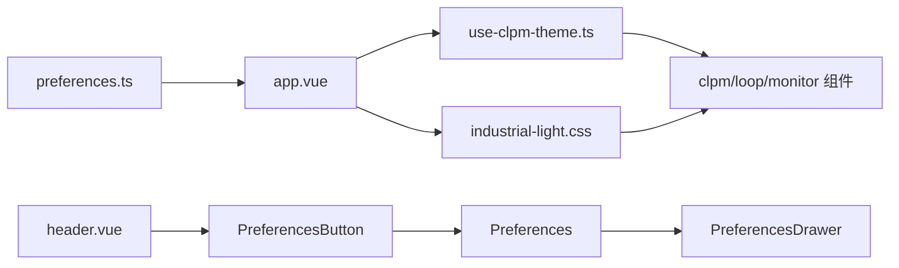

# UI 组件体系

<cite>
**本文引用的文件**
- [main.ts](file://frontend/apps/web-antd/src/main.ts)
- [preferences.ts](file://frontend/apps/web-antd/src/preferences.ts)
- [app.vue](file://frontend/apps/web-antd/src/app.vue)
- [industrial-light.css](file://frontend/apps/web-antd/src/styles/industrial-light.css)
- [use-clpm-theme.ts](file://frontend/apps/web-antd/src/composables/use-clpm-theme.ts)
- [index.ts（clpm 组件导出）](file://frontend/apps/web-antd/src/components/clpm/index.ts)
- [kpi-card.vue](file://frontend/apps/web-antd/src/components/clpm/kpi-card.vue)
- [waveform-chart.vue](file://frontend/apps/web-antd/src/components/loop/waveform-chart.vue)
- [workbench-active-attention.vue](file://frontend/apps/web-antd/src/components/monitor/workbench-active-attention.vue)
- [preferences-button.vue](file://frontend/packages/effects/layouts/src/widgets/preferences/preferences-button.vue)
- [preferences.vue](file://frontend/packages/effects/layouts/src/widgets/preferences/preferences.vue)
- [preferences-drawer.vue](file://frontend/packages/effects/layouts/src/widgets/preferences/preferences-drawer.vue)
- [header.vue](file://frontend/packages/effects/layouts/src/basic/header/header.vue)
- [vitest.config.ts](file://frontend/apps/web-antd/vitest.config.ts)
</cite>

## 更新摘要
**变更内容**
- 修复了 preferences 设置齿轮按钮无响应的问题，通过显式 ref 绑定和直接调用 preferencesRef.open() 解决事件传播问题
- 更新了偏好设置组件的事件处理机制，确保按钮点击能够正确触发设置面板打开
- 增强了组件间的通信可靠性，避免事件冒泡导致的交互失效

## 目录
1. [简介](#简介)
2. [项目结构](#项目结构)
3. [核心组件](#核心组件)
4. [架构总览](#架构总览)
5. [详细组件分析](#详细组件分析)
6. [依赖关系分析](#依赖关系分析)
7. [性能与可维护性](#性能与可维护性)
8. [故障排查指南](#故障排查指南)
9. [结论](#结论)
10. [附录：规范与示例](#附录：规范与示例)

## 简介
本文件面向 CLPM 前端 UI 组件体系，系统性说明 Ant Design Vue 集成方式、主题定制与样式覆盖、业务组件扩展策略；并围绕 clpm、loop、monitor 三类业务组件的组织方式，给出 Props/事件/插槽/TypeScript 类型的设计规范。同时阐述主题系统（CSS 变量、暗色模式、品牌色）、响应式设计与移动端适配、组件测试策略、文档生成与使用示例，帮助团队在统一设计语言下高效构建工业级界面。

**最新更新**：修复了偏好设置按钮的事件传播问题，通过显式 ref 绑定确保了设置面板的正确打开。

## 项目结构
前端采用 monorepo 组织，应用位于 apps/web-antd，组件按领域划分：
- clpm：通用业务组件（KPI 卡片、徽章、工具栏、数据画布等）
- loop：控制回路相关组件（波形图、状态徽章、质量标签等）
- monitor：监控工作台组件（关注项、生命周期条、上下文工具栏等）
- composables：主题、偏好、图表预设等可复用逻辑
- styles：工业风格主题与暗色覆盖
- preferences：vben preferences 覆盖配置（主色、圆角、半深色侧栏等）
- app.vue：全局 ConfigProvider 注入 Ant Design 主题算法与 token

**图示来源**
- [main.ts:9-48](file://frontend/apps/web-antd/src/main.ts#L9-L48)
- [preferences.ts:77-151](file://frontend/apps/web-antd/src/preferences.ts#L77-L151)
- [app.vue:1-39](file://frontend/apps/web-antd/src/app.vue#L1-L39)
- [industrial-light.css:1-107](file://frontend/apps/web-antd/src/styles/industrial-light.css#L1-L107)
- [use-clpm-theme.ts:121-175](file://frontend/apps/web-antd/src/composables/use-clpm-theme.ts#L121-L175)
- [preferences-button.vue:1-31](file://frontend/packages/effects/layouts/src/widgets/preferences/preferences-button.vue#L1-L31)
- [preferences.vue:1-94](file://frontend/packages/effects/layouts/src/widgets/preferences/preferences.vue#L1-L94)
- [preferences-drawer.vue:1-569](file://frontend/packages/effects/layouts/src/widgets/preferences/preferences-drawer.vue#L1-L569)

**章节来源**
- [main.ts:9-48](file://frontend/apps/web-antd/src/main.ts#L9-L48)
- [preferences.ts:77-151](file://frontend/apps/web-antd/src/preferences.ts#L77-L151)
- [app.vue:1-39](file://frontend/apps/web-antd/src/app.vue#L1-L39)
- [industrial-light.css:1-107](file://frontend/apps/web-antd/src/styles/industrial-light.css#L1-L107)
- [use-clpm-theme.ts:121-175](file://frontend/apps/web-antd/src/composables/use-clpm-theme.ts#L121-L175)

## 核心组件
- ClpmKpiCard：工业风格 KPI 卡片，支持进度/迷你柱状/sparkline、delta 方向与反向语义、零值中性化、可点击与键盘可达。
- WaveformChart：控制回路 PV/SP/OP/MODE 趋势图，支持有效/无效分段渲染、时间选择、光标联动、多轴缩放与主题切换重绘。
- WorkbenchActiveAttention：监控工作台"当前活跃关注项"，展示优先级、来源、时间与跳转入口。
- PreferencesButton：偏好设置按钮组件，通过显式 ref 绑定确保事件正确传播，解决设置面板无法打开的问题。

这些组件遵循统一的 props 定义、事件命名、插槽约定与 TypeScript 类型约束，并通过 useClpmTheme 获取响应式主题色，确保一致性与可维护性。

**章节来源**
- [kpi-card.vue:22-86](file://frontend/apps/web-antd/src/components/clpm/kpi-card.vue#L22-L86)
- [waveform-chart.vue:15-55](file://frontend/apps/web-antd/src/components/loop/waveform-chart.vue#L15-L55)
- [workbench-active-attention.vue:18-23](file://frontend/apps/web-antd/src/components/monitor/workbench-active-attention.vue#L18-L23)
- [preferences-button.vue:10-25](file://frontend/packages/effects/layouts/src/widgets/preferences/preferences-button.vue#L10-L25)

## 架构总览
整体架构以 vben preferences 为偏好中心，Ant Design Vue ConfigProvider 提供主题算法与 token，工业风格通过 CSS 变量与暗色覆盖实现，业务组件通过 composable 获取响应式色板，图表通过 ECharts 封装统一渲染。

**图示来源**
- [main.ts:9-48](file://frontend/apps/web-antd/src/main.ts#L9-L48)
- [preferences.ts:77-151](file://frontend/apps/web-antd/src/preferences.ts#L77-L151)
- [app.vue:16-30](file://frontend/apps/web-antd/src/app.vue#L16-L30)
- [industrial-light.css:285-347](file://frontend/apps/web-antd/src/styles/industrial-light.css#L285-L347)
- [use-clpm-theme.ts:121-175](file://frontend/apps/web-antd/src/composables/use-clpm-theme.ts#L121-L175)
- [preferences-button.vue:10-25](file://frontend/packages/effects/layouts/src/widgets/preferences/preferences-button.vue#L10-L25)
- [preferences.vue:25-32](file://frontend/packages/effects/layouts/src/widgets/preferences/preferences.vue#L25-L32)
- [preferences-drawer.vue:307-311](file://frontend/packages/effects/layouts/src/widgets/preferences/preferences-drawer.vue#L307-L311)

## 详细组件分析

### 组件族与导出规范（clpm）
- 统一导出：通过 index.ts 集中导出所有 clpm 组件与常量，便于上层按需引入。
- 表格规范：提供 CLPM_TABLE_GUIDE 工具类名与行为约定（数字列、行内进度、hover reveal 操作、密度切换）。

**图示来源**
- [index.ts（clpm 组件导出）:1-72](file://frontend/apps/web-antd/src/components/clpm/index.ts#L1-L72)

**章节来源**
- [index.ts（clpm 组件导出）:1-72](file://frontend/apps/web-antd/src/components/clpm/index.ts#L1-L72)

### ClpmKpiCard 组件
- 职责：展示关键指标，支持多种微型可视化（进度条/迷你柱状/sparkline），delta 方向与反向语义，零值中性化，可点击与键盘可达。
- Props：title/value/unit/status/icon/precision/groupSeparator/contextText/delta/deltaUnit/deltaReverse/infoTip/progress/microBars/sparkline/loading/clickable/neutralWhenZero。
- 事件：click（兼容鼠标与键盘 Enter/Space）。
- 主题：通过 CSS 变量与状态语义色控制图标背景、数值颜色、进度填充色。
- 复杂度：数值格式化 O(1)，sparkline 路径构建 O(n)。

**图示来源**
- [kpi-card.vue:88-141](file://frontend/apps/web-antd/src/components/clpm/kpi-card.vue#L88-L141)
- [kpi-card.vue:176-217](file://frontend/apps/web-antd/src/components/clpm/kpi-card.vue#L176-L217)

**章节来源**
- [kpi-card.vue:22-86](file://frontend/apps/web-antd/src/components/clpm/kpi-card.vue#L22-L86)
- [kpi-card.vue:88-141](file://frontend/apps/web-antd/src/components/clpm/kpi-card.vue#L88-L141)
- [kpi-card.vue:176-217](file://frontend/apps/web-antd/src/components/clpm/kpi-card.vue#L176-L217)

### WaveformChart 组件（loop）
- 职责：展示 PV/SP/OP/MODE 趋势，支持有效/无效分段渲染、时间选择、光标联动、多轴缩放与主题切换重绘。
- Props：enableTimeSelect/height/outlierReasons/selectedTimestamp/showMode/trend/validMask。
- 事件：timeSelect、cursorChange。
- 主题：通过 useClpmTheme 获取 themeColors/chartColors，isDark 变化时重新渲染。
- 复杂度：分段数据构建 O(n)，markArea 收集 O(n)，渲染 O(n)。

**图示来源**
- [waveform-chart.vue:115-149](file://frontend/apps/web-antd/src/components/loop/waveform-chart.vue#L115-L149)
- [waveform-chart.vue:157-199](file://frontend/apps/web-antd/src/components/loop/waveform-chart.vue#L157-L199)
- [waveform-chart.vue:687-708](file://frontend/apps/web-antd/src/components/loop/waveform-chart.vue#L687-L708)
- [use-clpm-theme.ts:121-175](file://frontend/apps/web-antd/src/composables/use-clpm-theme.ts#L121-L175)

**章节来源**
- [waveform-chart.vue:15-55](file://frontend/apps/web-antd/src/components/loop/waveform-chart.vue#L15-L55)
- [waveform-chart.vue:115-199](file://frontend/apps/web-antd/src/components/loop/waveform-chart.vue#L115-L199)
- [waveform-chart.vue:687-708](file://frontend/apps/web-antd/src/components/loop/waveform-chart.vue#L687-L708)

### WorkbenchActiveAttention 组件（monitor）
- 职责：展示当前回路的活跃关注项汇总与明细，支持跳转到关注队列并按 loopId 筛选。
- Props：activeAttention、loopId。
- 交互：点击"查看全部"路由跳转，列表项可聚焦与键盘操作。
- 主题：使用 Ant Design Tag 与 CSS 变量控制颜色与对比度。

**章节来源**
- [workbench-active-attention.vue:18-57](file://frontend/apps/web-antd/src/components/monitor/workbench-active-attention.vue#L18-L57)
- [workbench-active-attention.vue:60-127](file://frontend/apps/web-antd/src/components/monitor/workbench-active-attention.vue#L60-L127)

### PreferencesButton 组件（偏好设置）
- **更新**：修复了事件传播问题，通过显式 ref 绑定确保设置面板正确打开。
- 职责：提供设置齿轮按钮，点击后打开偏好设置面板。
- 实现：使用 `ref<InstanceType<typeof Preferences>>` 创建显式引用，通过 `preferencesRef?.open()` 直接调用子组件的打开方法。
- 事件处理：监听 `clear-preferences-and-logout` 事件，向父组件传递登出请求。
- 模板结构：包含 VbenIconButton 作为触发器，内部嵌套 Preferences 组件。

**图示来源**
- [preferences-button.vue:10-25](file://frontend/packages/effects/layouts/src/widgets/preferences/preferences-button.vue#L10-L25)
- [preferences.vue:25-32](file://frontend/packages/effects/layouts/src/widgets/preferences/preferences.vue#L25-L32)
- [header.vue:191-195](file://frontend/packages/effects/layouts/src/basic/header/header.vue#L191-L195)

**章节来源**
- [preferences-button.vue:1-31](file://frontend/packages/effects/layouts/src/widgets/preferences/preferences-button.vue#L1-31)
- [preferences.vue:1-94](file://frontend/packages/effects/layouts/src/widgets/preferences/preferences.vue#L1-94)
- [header.vue:191-195](file://frontend/packages/effects/layouts/src/basic/header/header.vue#L191-L195)

## 依赖关系分析
- 主题与样式：
  - preferences.ts 定义 overridesPreferences（主色、圆角、模式、侧栏/头部样式等）。
  - app.vue 将 isDark 映射到 Ant Design 算法（default/dark/compact），并注入 tokens。
  - industrial-light.css 定义 CSS 变量与暗色覆盖，统一工业风格。
- 组件与主题：
  - use-clpm-theme.ts 提供响应式色板，供组件在浅色/深色模式下自动切换。
  - 组件通过 CSS 变量或 computed 色值渲染，避免硬编码。
- 图表与主题：
  - WaveformChart 使用 ECharts 封装，监听 isDark 变化后重新渲染，保证配色一致。
- **偏好设置组件链**：
  - header.vue 中引入 PreferencesButton 组件
  - PreferencesButton 通过显式 ref 绑定到 Preferences 组件
  - Preferences 组件暴露 open() 方法给父组件调用
  - PreferencesDrawer 负责实际的内容展示

**图示来源**
- [preferences.ts:77-151](file://frontend/apps/web-antd/src/preferences.ts#L77-L151)
- [app.vue:16-30](file://frontend/apps/web-antd/src/app.vue#L16-L30)
- [industrial-light.css:285-347](file://frontend/apps/web-antd/src/styles/industrial-light.css#L285-L347)
- [use-clpm-theme.ts:121-175](file://frontend/apps/web-antd/src/composables/use-clpm-theme.ts#L121-L175)
- [header.vue:191-195](file://frontend/packages/effects/layouts/src/basic/header/header.vue#L191-L195)
- [preferences-button.vue:10-25](file://frontend/packages/effects/layouts/src/widgets/preferences/preferences-button.vue#L10-L25)
- [preferences.vue:25-32](file://frontend/packages/effects/layouts/src/widgets/preferences/preferences.vue#L25-L32)

**章节来源**
- [preferences.ts:77-151](file://frontend/apps/web-antd/src/preferences.ts#L77-L151)
- [app.vue:16-30](file://frontend/apps/web-antd/src/app.vue#L16-L30)
- [industrial-light.css:285-347](file://frontend/apps/web-antd/src/styles/industrial-light.css#L285-L347)
- [use-clpm-theme.ts:121-175](file://frontend/apps/web-antd/src/composables/use-clpm-theme.ts#L121-L175)

## 性能与可维护性
- 主题切换性能：
  - WaveformChart 在 isDark 变化时仅重新渲染必要配置，避免全量重建。
- 数据渲染优化：
  - 分段数据构建与 markArea 收集采用线性扫描，适合中等规模时序数据。
- 样式覆盖策略：
  - 通过 CSS 变量与 .dark 作用域集中覆盖，减少逐组件修改成本。
- 可维护性：
  - 统一导出与表格规范降低耦合；组件 Props/事件/类型清晰，便于扩展与替换。
- **偏好设置组件优化**：
  - 通过显式 ref 绑定避免了事件冒泡问题，提高了组件通信的可靠性
  - 直接调用子组件方法减少了中间层开销，提升了响应速度

## 故障排查指南
- 主题未生效：
  - 检查 preferences.ts 的 overridesPreferences 是否正确设置主色与模式。
  - 确认 app.vue 的 ConfigProvider 已注入算法与 tokens。
- 暗色模式异常：
  - 核对 industrial-light.css 的 .dark 块是否覆盖了必要的文本/背景/边框类。
  - 若使用 ECharts，确保在 isDark 变化时重新渲染配置。
- 组件交互问题：
  - 检查事件绑定（如 click/timeSelect/cursorChange）与键盘可达性（Enter/Space）。
  - 确认路由跳转参数（如 loopId）正确传递。
- **偏好设置按钮无响应**：
  - 确认 PreferencesButton 组件中使用了显式 ref 绑定：`const preferencesRef = ref<InstanceType<typeof Preferences> | null>(null)`
  - 检查模板中的 ref 绑定：`ref="preferencesRef"`
  - 验证点击事件调用：`@click="preferencesRef?.open()"`
  - 确保 Preferences 组件通过 `defineExpose({ open: () => drawerApi.open() })` 暴露了 open 方法

**章节来源**
- [preferences.ts:77-151](file://frontend/apps/web-antd/src/preferences.ts#L77-L151)
- [app.vue:16-30](file://frontend/apps/web-antd/src/app.vue#L16-L30)
- [industrial-light.css:494-800](file://frontend/apps/web-antd/src/styles/industrial-light.css#L494-L800)
- [waveform-chart.vue:687-708](file://frontend/apps/web-antd/src/components/loop/waveform-chart.vue#L687-L708)
- [preferences-button.vue:10-25](file://frontend/packages/effects/layouts/src/widgets/preferences/preferences-button.vue#L10-L25)
- [preferences.vue:29-32](file://frontend/packages/effects/layouts/src/widgets/preferences/preferences.vue#L29-L32)

## 结论
本组件体系以 vben preferences 与 Ant Design Vue 为核心，结合工业风格 CSS 变量与响应式主题 composable，形成统一、可扩展的前端 UI 基础。clpm/loop/monitor 三类组件在一致的规范下实现业务可视化与交互，配合完善的测试与文档策略，保障长期可维护性与交付质量。

**最新更新**：通过修复偏好设置按钮的事件传播问题，进一步提升了组件的可靠性和用户体验。显式 ref 绑定的使用模式为类似场景提供了良好的实践参考。

## 附录：规范与示例

### Ant Design Vue 集成要点
- 主题算法：根据 isDark 选择 defaultAlgorithm 或 darkAlgorithm，可选 compactAlgorithm。
- Token 注入：通过 useAntdDesignTokens 将 CSS 变量映射为 antd token。
- 全局配置：ConfigProvider 包裹 RouterView，统一 locale 与主题。

**章节来源**
- [app.vue:16-30](file://frontend/apps/web-antd/src/app.vue#L16-L30)

### 主题系统与样式覆盖
- 品牌色：preferences.ts 中 colorPrimary 设置为工业蓝 HSL。
- 语义色：industrial-light.css 定义 --status-ok/warning/error/info/neutral 及完整色板梯度。
- 暗色模式：.dark 块覆盖文本/背景/边框与常用 Tailwind 类，确保对比度与一致性。

**章节来源**
- [preferences.ts:125-138](file://frontend/apps/web-antd/src/preferences.ts#L125-L138)
- [industrial-light.css:34-49](file://frontend/apps/web-antd/src/styles/industrial-light.css#L34-L49)
- [industrial-light.css:285-347](file://frontend/apps/web-antd/src/styles/industrial-light.css#L285-L347)

### 组件设计规范
- Props 定义：使用 withDefaults + defineProps，明确默认值与类型。
- 事件规范：使用 defineEmits 声明事件签名，保持命名一致（如 click/timeSelect/cursorChange）。
- 插槽使用：在需要灵活内容处提供具名插槽（如工具栏、卡片头部）。
- TypeScript 类型：为组件输入输出定义接口，提升可维护性与 IDE 体验。
- **组件通信规范**：推荐使用显式 ref 绑定进行父子组件通信，避免事件冒泡问题。

**章节来源**
- [kpi-card.vue:22-86](file://frontend/apps/web-antd/src/components/clpm/kpi-card.vue#L22-L86)
- [waveform-chart.vue:15-55](file://frontend/apps/web-antd/src/components/loop/waveform-chart.vue#L15-L55)
- [workbench-active-attention.vue:18-23](file://frontend/apps/web-antd/src/components/monitor/workbench-active-attention.vue#L18-L23)
- [preferences-button.vue:10-25](file://frontend/packages/effects/layouts/src/widgets/preferences/preferences-button.vue#L10-L25)

### 响应式设计
- 断点：基于 @vueuse/core 的 breakpointsTailwind，提供 isMobile 判断。
- 触控密度：通过 .clpm-density-touch 调整按钮与表格行高，满足移动端触控目标。
- 弹性布局：组件内部使用 flex 与 gap，配合 CSS 变量实现紧凑与自适应。

**章节来源**
- [industrial-light.css:425-434](file://frontend/apps/web-antd/src/styles/industrial-light.css#L425-L434)

### 组件测试策略
- 框架：Vitest + jsdom，配置文件指定 include/exclude 与覆盖率报告。
- 实践：组件单元测试聚焦 Props/事件/渲染分支；E2E 用例覆盖关键流程。
- 建议：新增组件需配套单测，CI 中执行覆盖率门禁。

**章节来源**
- [vitest.config.ts:1-31](file://frontend/apps/web-antd/vitest.config.ts#L1-L31)

### 使用示例（路径指引）
- KPI 卡片：参考 [kpi-card.vue](file://frontend/apps/web-antd/src/components/clpm/kpi-card.vue) 的 Props 与模板结构。
- 波形图：参考 [waveform-chart.vue](file://frontend/apps/web-antd/src/components/loop/waveform-chart.vue) 的数据结构与事件。
- 关注项：参考 [workbench-active-attention.vue](file://frontend/apps/web-antd/src/components/monitor/workbench-active-attention.vue) 的路由跳转与列表渲染。
- **偏好设置按钮**：参考 [preferences-button.vue](file://frontend/packages/effects/layouts/src/widgets/preferences/preferences-button.vue) 的 ref 绑定与事件处理模式。

[本节为使用指引，不直接分析具体文件]