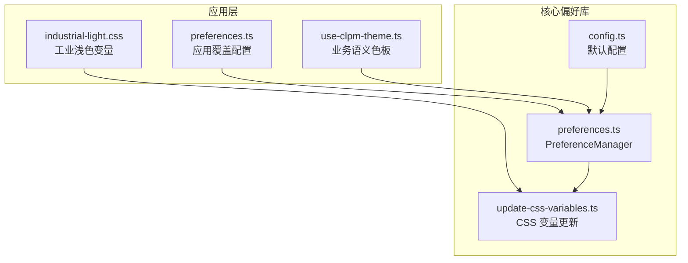
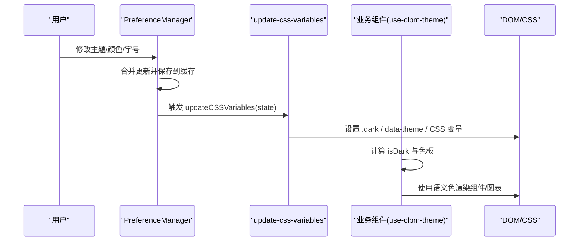
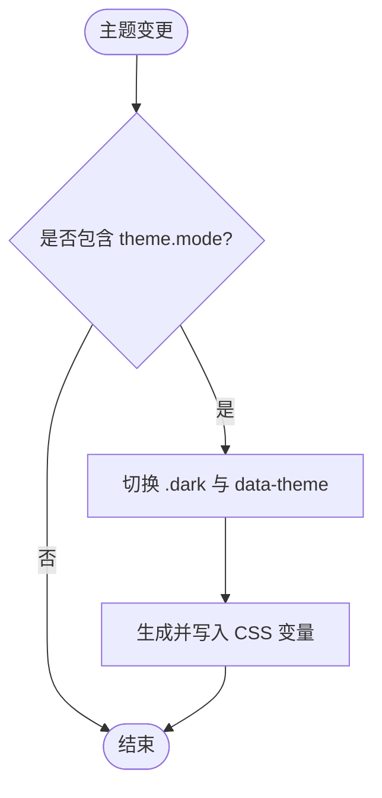
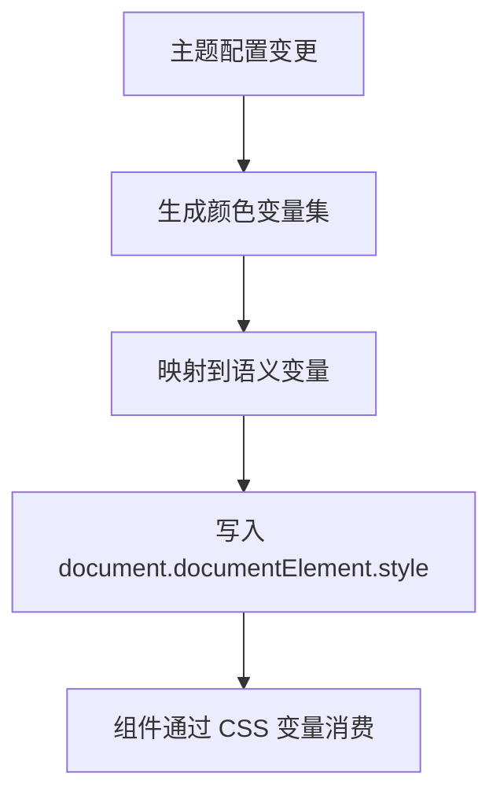
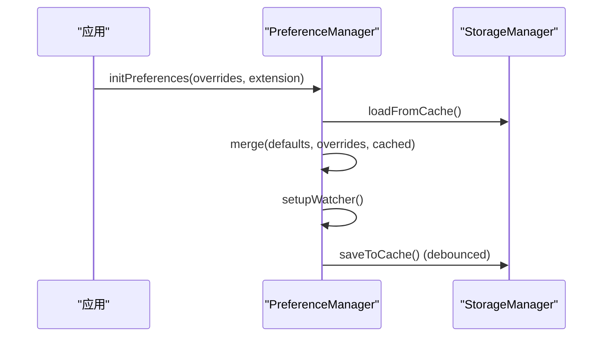
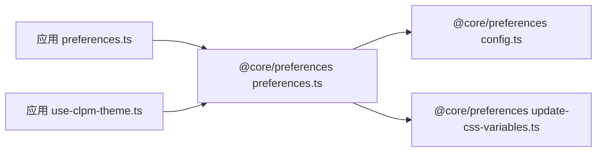

# 主题系统

<cite>
**本文引用的文件**
- [frontend/apps/web-antd/src/preferences.ts](file://frontend/apps/web-antd/src/preferences.ts)
- [frontend/packages/@core/preferences/src/preferences.ts](file://frontend/packages/@core/preferences/src/preferences.ts)
- [frontend/packages/@core/preferences/src/config.ts](file://frontend/packages/@core/preferences/src/config.ts)
- [frontend/packages/@core/preferences/src/update-css-variables.ts](file://frontend/packages/@core/preferences/src/update-css-variables.ts)
- [frontend/apps/web-antd/src/composables/use-clpm-theme.ts](file://frontend/apps/web-antd/src/composables/use-clpm-theme.ts)
- [frontend/apps/web-antd/src/styles/industrial-light.css](file://frontend/apps/web-antd/src/styles/industrial-light.css)
</cite>

## 目录
1. [简介](#简介)
2. [项目结构](#项目结构)
3. [核心组件](#核心组件)
4. [架构总览](#架构总览)
5. [详细组件分析](#详细组件分析)
6. [依赖关系分析](#依赖关系分析)
7. [性能考量](#性能考量)
8. [故障排查指南](#故障排查指南)
9. [结论](#结论)
10. [附录](#附录)

## 简介
本主题系统基于 Ant Design Vue 与 vben preferences，提供企业级工业风格的主题定制能力。通过 CSS 变量体系、颜色方案、字体与间距规范，实现可切换的明暗模式、品牌色定制、语义化颜色、响应式适配与用户偏好持久化。文档面向前端开发者与 UI/UX 维护者，覆盖从设计令牌到运行时主题切换的全链路说明。

## 项目结构
主题相关代码主要分布在应用层与核心偏好库：
- 应用层（web-antd）
  - 业务主题配置与覆盖项：定义品牌主色、圆角、默认模式等
  - 业务语义色板与图表色板：useClpmTheme composable 提供响应式色值
  - 样式资产：industrial-light.css 承载工业浅色语义变量
- 核心偏好库（@core/preferences）
  - 偏好管理：初始化、合并、监听、缓存、更新 CSS 变量
  - 默认配置：全局默认主题、布局、小部件开关等
  - CSS 变量更新：根据主题模式、内置主题、颜色与字号动态注入

**图示来源**
- [frontend/apps/web-antd/src/preferences.ts:77-151](file://frontend/apps/web-antd/src/preferences.ts#L77-L151)
- [frontend/packages/@core/preferences/src/preferences.ts:112-162](file://frontend/packages/@core/preferences/src/preferences.ts#L112-L162)
- [frontend/packages/@core/preferences/src/config.ts:116-128](file://frontend/packages/@core/preferences/src/config.ts#L116-L128)
- [frontend/packages/@core/preferences/src/update-css-variables.ts:12-82](file://frontend/packages/@core/preferences/src/update-css-variables.ts#L12-L82)
- [frontend/apps/web-antd/src/composables/use-clpm-theme.ts:121-175](file://frontend/apps/web-antd/src/composables/use-clpm-theme.ts#L121-L175)

**章节来源**
- [frontend/apps/web-antd/src/preferences.ts:77-151](file://frontend/apps/web-antd/src/preferences.ts#L77-L151)
- [frontend/packages/@core/preferences/src/preferences.ts:112-162](file://frontend/packages/@core/preferences/src/preferences.ts#L112-L162)
- [frontend/packages/@core/preferences/src/config.ts:116-128](file://frontend/packages/@core/preferences/src/config.ts#L116-L128)
- [frontend/packages/@core/preferences/src/update-css-variables.ts:12-82](file://frontend/packages/@core/preferences/src/update-css-variables.ts#L12-L82)
- [frontend/apps/web-antd/src/composables/use-clpm-theme.ts:121-175](file://frontend/apps/web-antd/src/composables/use-clpm-theme.ts#L121-L175)

## 核心组件
- 应用覆盖配置（preferences.ts）
  - 定义品牌主色、圆角、默认模式、半深色侧栏等
  - 启用锁屏、主题切换等小部件
- 偏好管理器（PreferenceManager）
  - 初始化、合并默认与覆盖配置
  - 监听断点与系统主题变化
  - 保存/读取本地缓存（preferences、preferences-theme、preferences-locale、preferences-custom）
  - 触发 CSS 变量更新与颜色模式类名切换
- 默认配置（config.ts）
  - 提供全局默认主题、布局、导航、标签页、小部件等
- CSS 变量更新器（update-css-variables.ts）
  - 根据主题模式设置 dark 类与 data-theme
  - 生成并写入主色、成功、警告、破坏色等 CSS 变量
  - 设置 --radius 与 --font-size-base、--menu-font-size
- 业务主题 Composable（use-clpm-theme.ts）
  - 提供 isDark、themeColors、confidenceColors、chartColors 等响应式色板
  - 为 ECharts 与业务组件提供明暗一致的语义色

**章节来源**
- [frontend/apps/web-antd/src/preferences.ts:77-151](file://frontend/apps/web-antd/src/preferences.ts#L77-L151)
- [frontend/packages/@core/preferences/src/preferences.ts:112-162](file://frontend/packages/@core/preferences/src/preferences.ts#L112-L162)
- [frontend/packages/@core/preferences/src/config.ts:116-128](file://frontend/packages/@core/preferences/src/config.ts#L116-L128)
- [frontend/packages/@core/preferences/src/update-css-variables.ts:12-82](file://frontend/packages/@core/preferences/src/update-css-variables.ts#L12-L82)
- [frontend/apps/web-antd/src/composables/use-clpm-theme.ts:121-175](file://frontend/apps/web-antd/src/composables/use-clpm-theme.ts#L121-L175)

## 架构总览
主题系统由“配置层 → 状态层 → 渲染层”构成：
- 配置层：应用覆盖配置 + 默认配置
- 状态层：PreferenceManager 负责合并、监听、持久化
- 渲染层：update-css-variables 注入 CSS 变量；useClpmTheme 提供业务语义色；样式文件提供基础变量

**图示来源**
- [frontend/packages/@core/preferences/src/preferences.ts:206-254](file://frontend/packages/@core/preferences/src/preferences.ts#L206-L254)
- [frontend/packages/@core/preferences/src/update-css-variables.ts:12-82](file://frontend/packages/@core/preferences/src/update-css-variables.ts#L12-L82)
- [frontend/apps/web-antd/src/composables/use-clpm-theme.ts:121-175](file://frontend/apps/web-antd/src/composables/use-clpm-theme.ts#L121-L175)

## 详细组件分析

### 主题切换机制与暗色模式
- 模式来源
  - 用户选择：通过小部件 themeToggle 切换 light/dark/auto
  - 系统跟随：auto 模式下监听 prefers-color-scheme 变化
- 状态处理
  - PreferenceManager 在 handleUpdates 中检测 theme 变更并调用 updateCSSVariables
  - setupWatcher 监听系统主题变化，自动在 auto 模式下同步
- DOM 标记
  - 根据模式切换 documentElement 的 .dark 类与 data-theme
- 颜色模式增强
  - 支持灰色模式与色弱模式（invert-mode、grayscale-mode 类名）

**图示来源**
- [frontend/packages/@core/preferences/src/preferences.ts:238-254](file://frontend/packages/@core/preferences/src/preferences.ts#L238-L254)
- [frontend/packages/@core/preferences/src/preferences.ts:412-447](file://frontend/packages/@core/preferences/src/preferences.ts#L412-L447)
- [frontend/packages/@core/preferences/src/update-css-variables.ts:21-35](file://frontend/packages/@core/preferences/src/update-css-variables.ts#L21-L35)

**章节来源**
- [frontend/packages/@core/preferences/src/preferences.ts:238-254](file://frontend/packages/@core/preferences/src/preferences.ts#L238-L254)
- [frontend/packages/@core/preferences/src/preferences.ts:412-447](file://frontend/packages/@core/preferences/src/preferences.ts#L412-L447)
- [frontend/packages/@core/preferences/src/update-css-variables.ts:21-35](file://frontend/packages/@core/preferences/src/update-css-variables.ts#L21-L35)

### CSS 变量体系与颜色方案
- 主色与语义色
  - 通过 generatorColorVariables 生成 primary、warning、success、destructive 系列变量
  - 将 --green-500、--primary-500、--yellow-500、--red-500 映射到 --success、--primary、--warning、--destructive
- 圆角与字号
  - --radius 控制全局圆角
  - --font-size-base、--menu-font-size 控制基础字号与菜单字号
- 内置主题
  - 根据 builtinType 与 mode 选择不同主色（含暗色主色回退策略）

**图示来源**
- [frontend/packages/@core/preferences/src/update-css-variables.ts:88-119](file://frontend/packages/@core/preferences/src/update-css-variables.ts#L88-L119)
- [frontend/packages/@core/preferences/src/update-css-variables.ts:65-81](file://frontend/packages/@core/preferences/src/update-css-variables.ts#L65-L81)

**章节来源**
- [frontend/packages/@core/preferences/src/update-css-variables.ts:88-119](file://frontend/packages/@core/preferences/src/update-css-variables.ts#L88-L119)
- [frontend/packages/@core/preferences/src/update-css-variables.ts:65-81](file://frontend/packages/@core/preferences/src/update-css-variables.ts#L65-L81)

### 字体配置与间距规范
- 字体
  - 通过 --font-size-base 与 --menu-font-size 统一控制基础与菜单字号
- 间距与圆角
  - 通过 --radius 控制全局圆角
  - 内容区域宽度与边距可通过 app.contentCompactWidth 与 padding 字段配置（默认配置中提供）

**章节来源**
- [frontend/packages/@core/preferences/src/update-css-variables.ts:65-81](file://frontend/packages/@core/preferences/src/update-css-variables.ts#L65-L81)
- [frontend/packages/@core/preferences/src/config.ts:10-17](file://frontend/packages/@core/preferences/src/config.ts#L10-L17)
- [frontend/packages/@core/preferences/src/config.ts:116-128](file://frontend/packages/@core/preferences/src/config.ts#L116-L128)

### 品牌色定制与企业色彩规范
- 品牌主色
  - 应用覆盖中将 colorPrimary 设置为工业蓝 HSL 值
- 语义化颜色
  - use-clpm-theme 提供 SUCCESS/WARNING/DANGER/INFO/NEUTRAL/ACCENT 语义色板
  - 浅色与深色两套色板，确保对比度与可读性
- 可信度等级色板
  - A/B/C/D/E 五级配色，对齐设计规范，暗色下亮度提升并保持色相一致

**章节来源**
- [frontend/apps/web-antd/src/preferences.ts:125-138](file://frontend/apps/web-antd/src/preferences.ts#L125-L138)
- [frontend/apps/web-antd/src/composables/use-clpm-theme.ts:39-81](file://frontend/apps/web-antd/src/composables/use-clpm-theme.ts#L39-L81)

### 可访问性考虑
- 色弱模式与灰度模式
  - 通过 invert-mode 与 grayscale-mode 类名切换
- 对比度与可读性
  - 暗色模式下语义色采用更亮色值，保证文本与背景对比度
- 系统主题跟随
  - auto 模式自动匹配系统明暗，减少用户手动操作

**章节来源**
- [frontend/packages/@core/preferences/src/preferences.ts:453-459](file://frontend/packages/@core/preferences/src/preferences.ts#L453-L459)
- [frontend/apps/web-antd/src/composables/use-clpm-theme.ts:48-81](file://frontend/apps/web-antd/src/composables/use-clpm-theme.ts#L48-L81)

### 偏好设置系统与本地存储
- 存储键
  - preferences：完整偏好对象
  - preferences-theme：当前主题模式
  - preferences-locale：语言
  - preferences-custom：扩展偏好
- 初始化流程
  - 合并默认配置与应用覆盖配置
  - 加载缓存补齐缺失字段
  - 设置监听器与平台标识
- 更新与持久化
  - 防抖保存，避免频繁 I/O
  - 更新后直接触发 UI 更新

**图示来源**
- [frontend/packages/@core/preferences/src/preferences.ts:112-162](file://frontend/packages/@core/preferences/src/preferences.ts#L112-L162)
- [frontend/packages/@core/preferences/src/preferences.ts:390-407](file://frontend/packages/@core/preferences/src/preferences.ts#L390-L407)

**章节来源**
- [frontend/packages/@core/preferences/src/preferences.ts:112-162](file://frontend/packages/@core/preferences/src/preferences.ts#L112-L162)
- [frontend/packages/@core/preferences/src/preferences.ts:390-407](file://frontend/packages/@core/preferences/src/preferences.ts#L390-L407)

### 响应式设计：移动端适配与断点处理
- 断点监听
  - 使用 useBreakpoints(breakpointsTailwind) 监听 sm/md 等断点
  - 当小于 md 时，app.isMobile 设为 true
- 布局与交互
  - 侧边栏折叠、导航拆分、头部固定等可通过配置调整
  - 小部件如 sidebarToggle、lockScreen、themeToggle 可在移动端启用

**章节来源**
- [frontend/packages/@core/preferences/src/preferences.ts:417-429](file://frontend/packages/@core/preferences/src/preferences.ts#L417-L429)
- [frontend/packages/@core/preferences/src/config.ts:72-99](file://frontend/packages/@core/preferences/src/config.ts#L72-L99)
- [frontend/apps/web-antd/src/preferences.ts:108-118](file://frontend/apps/web-antd/src/preferences.ts#L108-L118)

### 组件适配方案
- 业务组件
  - 通过 useClpmTheme 获取 isDark 与语义色板，避免硬编码颜色
  - ECharts 需在 isDark 变化时重新构造 options 并渲染
- 样式覆盖
  - industrial-light.css 提供工业浅色变量作为单源
  - 通过 CSS 变量与类名切换实现组件级适配

**章节来源**
- [frontend/apps/web-antd/src/composables/use-clpm-theme.ts:121-175](file://frontend/apps/web-antd/src/composables/use-clpm-theme.ts#L121-L175)
- [frontend/apps/web-antd/src/styles/industrial-light.css](file://frontend/apps/web-antd/src/styles/industrial-light.css)

## 依赖关系分析
- 应用层依赖核心偏好库
  - preferences.ts 通过 defineOverridesPreferences 注入应用覆盖
  - use-clpm-theme.ts 依赖 usePreferences 获取 isDark
- 核心偏好库内部依赖
  - preferences.ts 依赖 config.ts 默认配置与 update-css-variables.ts 变量更新
  - update-css-variables.ts 依赖共享工具生成颜色变量并写入 DOM

**图示来源**
- [frontend/apps/web-antd/src/preferences.ts:77-151](file://frontend/apps/web-antd/src/preferences.ts#L77-L151)
- [frontend/packages/@core/preferences/src/preferences.ts:112-162](file://frontend/packages/@core/preferences/src/preferences.ts#L112-L162)
- [frontend/packages/@core/preferences/src/config.ts:116-128](file://frontend/packages/@core/preferences/src/config.ts#L116-L128)
- [frontend/packages/@core/preferences/src/update-css-variables.ts:12-82](file://frontend/packages/@core/preferences/src/update-css-variables.ts#L12-L82)
- [frontend/apps/web-antd/src/composables/use-clpm-theme.ts:121-175](file://frontend/apps/web-antd/src/composables/use-clpm-theme.ts#L121-L175)

**章节来源**
- [frontend/apps/web-antd/src/preferences.ts:77-151](file://frontend/apps/web-antd/src/preferences.ts#L77-L151)
- [frontend/packages/@core/preferences/src/preferences.ts:112-162](file://frontend/packages/@core/preferences/src/preferences.ts#L112-L162)
- [frontend/packages/@core/preferences/src/config.ts:116-128](file://frontend/packages/@core/preferences/src/config.ts#L116-L128)
- [frontend/packages/@core/preferences/src/update-css-variables.ts:12-82](file://frontend/packages/@core/preferences/src/update-css-variables.ts#L12-L82)
- [frontend/apps/web-antd/src/composables/use-clpm-theme.ts:121-175](file://frontend/apps/web-antd/src/composables/use-clpm-theme.ts#L121-L175)

## 性能考量
- 防抖保存
  - 使用防抖函数降低频繁写缓存的开销
- 最小化重绘
  - 仅当 theme 或 app 相关字段变更时更新 CSS 变量与类名
- 缓存策略
  - 分离 preferences、preferences-theme、preferences-locale、preferences-custom，按需读写
- 图表渲染
  - ECharts 在主题切换时需重新构造 options，避免缓存导致的色值不更新

[本节为通用指导，无需具体文件引用]

## 故障排查指南
- 主题切换无效
  - 检查是否触发了 updateCSSVariables（theme 字段变更）
  - 确认 documentElement 上 .dark 与 data-theme 是否正确设置
- 颜色未生效
  - 确认 CSS 变量已写入（--primary、--success、--warning、--destructive）
  - 检查业务组件是否通过 useClpmTheme 获取色值而非硬编码
- 本地存储异常
  - 清理浏览器缓存中的 preferences、preferences-theme、preferences-locale、preferences-custom
  - 检查 StorageManager 是否正常工作
- 移动端布局异常
  - 检查 app.isMobile 是否随断点正确更新
  - 确认侧边栏与导航配置是否符合预期

**章节来源**
- [frontend/packages/@core/preferences/src/preferences.ts:238-254](file://frontend/packages/@core/preferences/src/preferences.ts#L238-L254)
- [frontend/packages/@core/preferences/src/preferences.ts:412-447](file://frontend/packages/@core/preferences/src/preferences.ts#L412-L447)
- [frontend/packages/@core/preferences/src/update-css-variables.ts:21-35](file://frontend/packages/@core/preferences/src/update-css-variables.ts#L21-L35)
- [frontend/packages/@core/preferences/src/update-css-variables.ts:88-119](file://frontend/packages/@core/preferences/src/update-css-variables.ts#L88-L119)

## 结论
本主题系统以 vben preferences 为核心，结合应用层覆盖配置与业务语义色板，实现了可维护、可扩展的企业级主题能力。通过 CSS 变量体系与响应式色板，确保了明暗模式下的视觉一致性与可访问性；通过本地存储与断点监听，提供了良好的用户体验与移动端适配。建议后续持续优化暗色对比度与图表渲染性能，并逐步替换遗留硬编码颜色。

[本节为总结，无需具体文件引用]

## 附录
- 开发指南
  - 新增语义色：在 use-clpm-theme 中补充浅色与深色色板，并确保对比度
  - 新增主题字段：在应用覆盖配置中添加字段，并在 PreferenceManager 中处理更新逻辑
  - 新增样式变量：在 industrial-light.css 中定义变量，并通过 CSS 变量消费
- 最佳实践
  - 组件内一律使用 useClpmTheme 获取色值，避免硬编码
  - 图表在 isDark 变化时重新构造 options 并渲染
  - 使用语义化颜色命名（SUCCESS/WARNING/DANGER/INFO/NEUTRAL），保持设计一致性
- 常见问题
  - 主题切换后图表颜色未更新：需重新构造 options 并调用渲染方法
  - 自定义字段未持久化：确认扩展偏好已定义并启用保存

[本节为补充信息，无需具体文件引用]