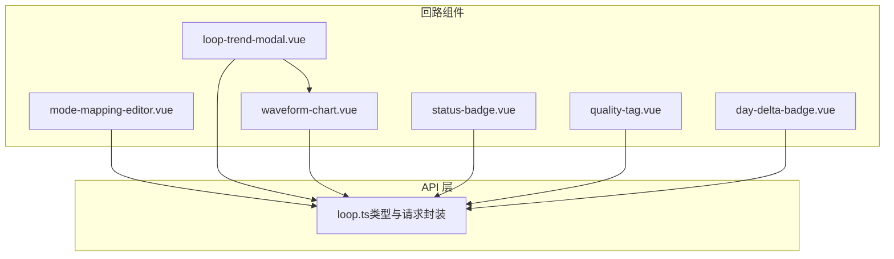
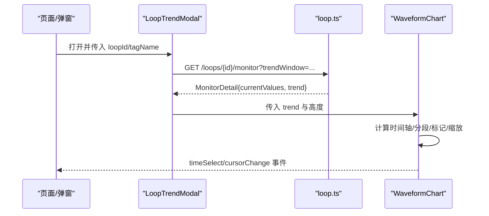
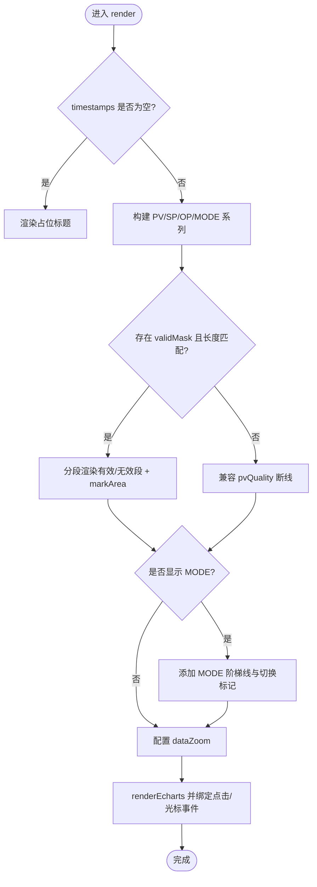
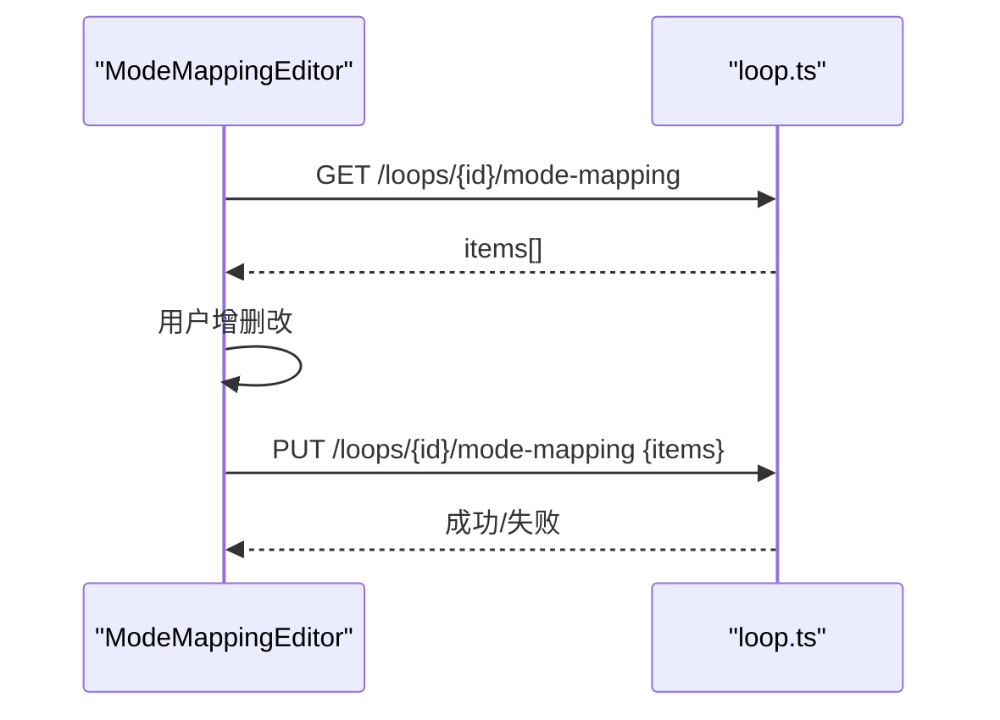
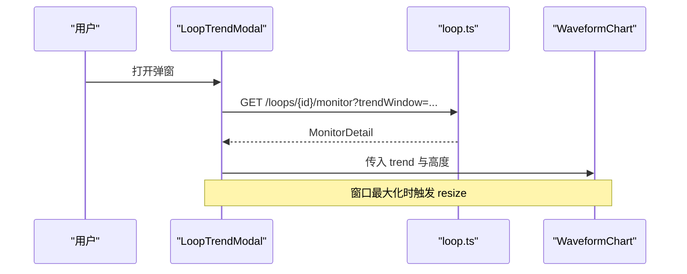
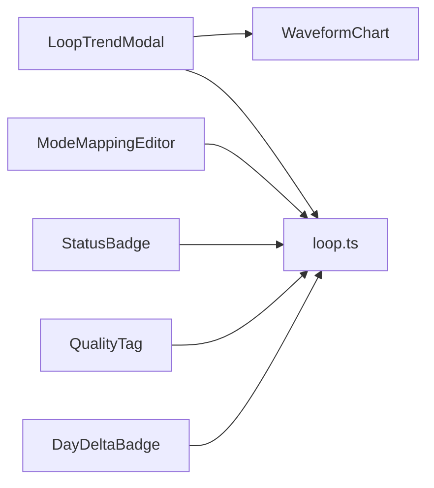

# 回路专用组件

<cite>
**本文引用的文件**
- [waveform-chart.vue](file://frontend/apps/web-antd/src/components/loop/waveform-chart.vue)
- [status-badge.vue](file://frontend/apps/web-antd/src/components/loop/status-badge.vue)
- [quality-tag.vue](file://frontend/apps/web-antd/src/components/loop/quality-tag.vue)
- [mode-mapping-editor.vue](file://frontend/apps/web-antd/src/components/loop/mode-mapping-editor.vue)
- [loop-trend-modal.vue](file://frontend/apps/web-antd/src/components/loop/loop-trend-modal.vue)
- [day-delta-badge.vue](file://frontend/apps/web-antd/src/components/loop/day-delta-badge.vue)
- [loop.ts（前端 API）](file://frontend/apps/web-antd/src/api/loop.ts)
</cite>

## 目录
1. [简介](#简介)
2. [项目结构](#项目结构)
3. [核心组件](#核心组件)
4. [架构总览](#架构总览)
5. [详细组件分析](#详细组件分析)
6. [依赖关系分析](#依赖关系分析)
7. [性能考虑](#性能考虑)
8. [故障排查指南](#故障排查指南)
9. [结论](#结论)
10. [附录：使用示例与最佳实践](#附录使用示例与最佳实践)

## 简介
本文件面向“回路专用组件”的完整文档，覆盖以下六个组件：波形图表、状态徽章、质量标签、模式映射编辑器、趋势模态框、日差徽章。重点说明：
- 各组件如何绑定回路数据（PV/SP/OP/MODE/质量码等）
- 实时数据更新机制与图表渲染优化策略
- 与后端 API 的集成方式（含 WebSocket 实时通信现状说明）
- 配置项、自定义样式与性能优化建议
- 典型使用场景与调用路径

## 项目结构
这些组件位于前端应用的回路组件目录中，统一通过 Vue 单文件组件组织，并通过统一的 API 层与后端交互。

**图示来源**
- [waveform-chart.vue:1-714](file://frontend/apps/web-antd/src/components/loop/waveform-chart.vue#L1-L714)
- [loop-trend-modal.vue:1-241](file://frontend/apps/web-antd/src/components/loop/loop-trend-modal.vue#L1-L241)
- [mode-mapping-editor.vue:1-273](file://frontend/apps/web-antd/src/components/loop/mode-mapping-editor.vue#L1-L273)
- [loop.ts:700-825](file://frontend/apps/web-antd/src/api/loop.ts#L700-L825)

**章节来源**
- [waveform-chart.vue:1-714](file://frontend/apps/web-antd/src/components/loop/waveform-chart.vue#L1-L714)
- [loop-trend-modal.vue:1-241](file://frontend/apps/web-antd/src/components/loop/loop-trend-modal.vue#L1-L241)
- [mode-mapping-editor.vue:1-273](file://frontend/apps/web-antd/src/components/loop/mode-mapping-editor.vue#L1-L273)
- [loop.ts:700-825](file://frontend/apps/web-antd/src/api/loop.ts#L700-L825)

## 核心组件
- 波形图表（WaveformChart）：基于 ECharts 的 PV/SP/OP/MODE 趋势图，支持时间选择、光标联动、分段有效性渲染、采样提示、主题适配。
- 状态徽章（StatusBadge）：展示回路状态（就绪/部分关联/未启用），带语义色点与边框徽章。
- 质量标签（QualityTag）：以 Tag 形式展示数据质量码（Good/Bad/Uncertain/空）。
- 模式映射编辑器（ModeMappingEditor）：编辑 DCS MODE 值到控制模式的映射，用于自控率统计。
- 趋势模态框（LoopTrendModal）：封装时间窗切换、当前值快照与波形图复用。
- 日差徽章（DayDeltaBadge）：展示“较昨日”评分变化（恶化/好转/新增/持平）。

**章节来源**
- [waveform-chart.vue:1-714](file://frontend/apps/web-antd/src/components/loop/waveform-chart.vue#L1-L714)
- [status-badge.vue:1-73](file://frontend/apps/web-antd/src/components/loop/status-badge.vue#L1-L73)
- [quality-tag.vue:1-62](file://frontend/apps/web-antd/src/components/loop/quality-tag.vue#L1-L62)
- [mode-mapping-editor.vue:1-273](file://frontend/apps/web-antd/src/components/loop/mode-mapping-editor.vue#L1-L273)
- [loop-trend-modal.vue:1-241](file://frontend/apps/web-antd/src/components/loop/loop-trend-modal.vue#L1-L241)
- [day-delta-badge.vue:1-95](file://frontend/apps/web-antd/src/components/loop/day-delta-badge.vue#L1-L95)

## 架构总览
组件通过 API 层获取回路监控详情与投用定义，并在 UI 中呈现。波形图是核心可视化组件，被趋势模态框复用；状态徽章与质量标签用于列表/卡片中的轻量展示；模式映射编辑器负责写回配置；日差徽章用于巡检视图的变化提示。

**图示来源**
- [loop-trend-modal.vue:75-116](file://frontend/apps/web-antd/src/components/loop/loop-trend-modal.vue#L75-L116)
- [loop.ts:727-737](file://frontend/apps/web-antd/src/api/loop.ts#L727-L737)
- [waveform-chart.vue:340-684](file://frontend/apps/web-antd/src/components/loop/waveform-chart.vue#L340-L684)

## 详细组件分析

### 波形图表（WaveformChart）
- 数据绑定
  - 输入 props.trend 包含 timestamps/pv/sp/op/mode/pvQuality/sampleInterval/downsampled 等字段，用于绘制 PV/SP/OP 曲线与 MODE 阶梯线。
  - Phase 5 支持 validMask 与 outlierReasons，优先于 pvQuality 进行有效性分段渲染。
- 实时与交互
  - 支持 enableTimeSelect 点击选点，emit timeSelect 供多图联动。
  - 鼠标移动 emit cursorChange，携带 index/timestamp/PV/SP/OP/MODE/质量码，便于外部面板同步显示。
  - 内置 dataZoom（X/Y 轴滚轮+滑块），支持时间轴缩放与量程缩放。
- 渲染优化
  - 时间戳精度自动转换（纳秒/微秒→毫秒），统一北京时间显示。
  - 分段有效性渲染：有效段蓝色实线，无效段灰色虚线，边界桥接避免断线视觉跳变；无效区间 markArea 高亮。
  - 主题自适应：通过 useClpmTheme 获取明暗主题颜色，重绘时保持配色一致。
  - 采样提示：当 sampleInterval>1 或 downsampled=true 时，右上角显示采样间隔与降采样提示。
- 配置项
  - enableTimeSelect、height、outlierReasons、selectedTimestamp、showMode、validMask、trend。
- 与后端集成
  - 由上层组件（如 LoopTrendModal）调用 getLoopMonitorDetailApi 获取 trend 数据后传入。

**图示来源**
- [waveform-chart.vue:340-684](file://frontend/apps/web-antd/src/components/loop/waveform-chart.vue#L340-L684)

**章节来源**
- [waveform-chart.vue:1-714](file://frontend/apps/web-antd/src/components/loop/waveform-chart.vue#L1-L714)

### 状态徽章（StatusBadge）
- 数据绑定
  - 接收 isActive 与 status（INACTIVE/PARTIAL/READY），根据状态映射为中文标签与语义色。
- 样式
  - 小圆点 + 边框徽章，支持深色模式下的对比度调整。
- 使用场景
  - 回路列表、详情页的状态展示。

**章节来源**
- [status-badge.vue:1-73](file://frontend/apps/web-antd/src/components/loop/status-badge.vue#L1-L73)

### 质量标签（QualityTag）
- 数据绑定
  - 接收 quality（GOOD/BAD/UNCERTAIN/null），映射为 Good/Bad/Uncertain/—。
- 样式
  - BAD 使用虚线边框，颜色随主题变化（SUCCESS/WARNING/DANGER）。
- 使用场景
  - Tag 详情、监控列表的质量码展示。

**章节来源**
- [quality-tag.vue:1-62](file://frontend/apps/web-antd/src/components/loop/quality-tag.vue#L1-L62)

### 模式映射编辑器（ModeMappingEditor）
- 功能
  - 表格编辑 MODE 值与控制模式（AUTO/CAS/REMOTE/APC/MANUAL）、是否自动、是否有效、备注。
  - 新增/删除行，保存前校验 MODE 值唯一性与非空。
- 数据流
  - 加载：getLoopModeMappingApi(loopId)
  - 保存：updateLoopModeMappingApi(loopId, { items })
- 权限
  - readonly 模式下仅展示不可编辑。

**图示来源**
- [mode-mapping-editor.vue:91-166](file://frontend/apps/web-antd/src/components/loop/mode-mapping-editor.vue#L91-L166)
- [loop.ts:748-768](file://frontend/apps/web-antd/src/api/loop.ts#L748-L768)

**章节来源**
- [mode-mapping-editor.vue:1-273](file://frontend/apps/web-antd/src/components/loop/mode-mapping-editor.vue#L1-L273)
- [loop.ts:748-768](file://frontend/apps/web-antd/src/api/loop.ts#L748-L768)

### 趋势模态框（LoopTrendModal）
- 功能
  - 时间窗切换（1h/2h/4h/8h/24h/72h），加载 MonitorDetail。
  - 展示当前值快照（PV/SP/OP/读取时间）与当前控制方式标签。
  - 复用 WaveformChart 渲染趋势图，支持最大化时重置尺寸。
- 数据流
  - 打开时调用 getLoopMonitorDetailApi(loopId, trendWindow)。
  - nextTick 后调用 WaveformChart.resize() 修正尺寸。
- 与后端集成
  - 通过 loop.ts 的 getLoopMonitorDetailApi 获取数据。

**图示来源**
- [loop-trend-modal.vue:75-116](file://frontend/apps/web-antd/src/components/loop/loop-trend-modal.vue#L75-L116)
- [loop.ts:727-737](file://frontend/apps/web-antd/src/api/loop.ts#L727-L737)

**章节来源**
- [loop-trend-modal.vue:1-241](file://frontend/apps/web-antd/src/components/loop/loop-trend-modal.vue#L1-L241)
- [loop.ts:727-737](file://frontend/apps/web-antd/src/api/loop.ts#L727-L737)

### 日差徽章（DayDeltaBadge）
- 功能
  - 根据 trend（FLAT/IMPROVED/NEW/WORSENED/null）与 delta（评分增量）渲染文本与颜色。
  - FLAT 不显示，减少视觉噪音；WORSENED 红色强调；IMPROVED 绿色；NEW 蓝色。
- 使用场景
  - 巡检视图、看板卡片中快速传达“较昨日”的变化。

**章节来源**
- [day-delta-badge.vue:1-95](file://frontend/apps/web-antd/src/components/loop/day-delta-badge.vue#L1-L95)

## 依赖关系分析
- 组件间依赖
  - LoopTrendModal 依赖 WaveformChart 进行趋势渲染。
  - 其他组件相对独立，主要依赖 API 层与主题工具。
- 与 API 层依赖
  - 趋势模态框与模式映射编辑器直接调用 loop.ts 暴露的接口。
  - 波形图表消费 MonitorDetail.trend，由上层组件负责拉取。
- 外部依赖
  - ECharts（通过 @vben/plugins/echarts）用于波形图渲染。
  - Ant Design Vue 提供 Table/Tag/Tooltip/Modal 等基础控件。

**图示来源**
- [loop-trend-modal.vue:1-241](file://frontend/apps/web-antd/src/components/loop/loop-trend-modal.vue#L1-L241)
- [mode-mapping-editor.vue:1-273](file://frontend/apps/web-antd/src/components/loop/mode-mapping-editor.vue#L1-L273)
- [loop.ts:700-825](file://frontend/apps/web-antd/src/api/loop.ts#L700-L825)

**章节来源**
- [loop-trend-modal.vue:1-241](file://frontend/apps/web-antd/src/components/loop/loop-trend-modal.vue#L1-L241)
- [mode-mapping-editor.vue:1-273](file://frontend/apps/web-antd/src/components/loop/mode-mapping-editor.vue#L1-L273)
- [loop.ts:700-825](file://frontend/apps/web-antd/src/api/loop.ts#L700-L825)

## 性能考虑
- 图表渲染
  - 使用 dataZoom 限制可视范围，降低大数据量时的渲染压力。
  - 分段有效性渲染仅在存在无效段时启用，避免多余 series。
  - 时间戳统一转换为毫秒级，减少坐标计算开销。
  - 主题切换时按需重绘，避免频繁全量刷新。
- 数据更新
  - 趋势模态框在窗口最大化后延迟 resize，确保容器尺寸稳定后再计算布局。
  - 模式映射编辑器保存前进行本地校验，减少无效请求。
- 主题与样式
  - 通过 useClpmTheme 获取主题色，保证明暗模式一致性。
  - 质量标签与状态徽章使用 Tailwind 类名，便于维护与扩展。

[本节为通用性能建议，不直接分析具体代码文件]

## 故障排查指南
- 波形图无数据
  - 检查传入的 trend.timestamps 是否为空；若为空将显示占位标题。
  - 确认上层已正确调用 getLoopMonitorDetailApi 并传入 trend。
- 时间轴异常
  - 确认时间戳单位是否正确（组件内部会尝试转换纳秒/微秒至毫秒）。
  - 检查 selectedTimestamp 是否为有效数值字符串。
- 模式映射保存失败
  - 检查是否存在重复或空的 modeValue；保存前会进行本地校验。
  - 查看网络请求返回的错误信息（错误已由拦截器处理）。
- 主题不生效
  - 确认 useClpmTheme 可用，且在 onMounted 后重新渲染。

**章节来源**
- [waveform-chart.vue:340-684](file://frontend/apps/web-antd/src/components/loop/waveform-chart.vue#L340-L684)
- [mode-mapping-editor.vue:121-157](file://frontend/apps/web-antd/src/components/loop/mode-mapping-editor.vue#L121-L157)

## 结论
本套回路专用组件围绕“趋势可视化、状态与质量表达、配置管理、变化提示”四大能力展开。波形图表作为核心，提供了丰富的交互与渲染优化；趋势模态框将其封装为可复用的趋势查看入口；状态徽章与质量标签提供轻量化的状态表达；模式映射编辑器支撑自控率统计的配置闭环；日差徽章聚焦巡检视角的快速洞察。整体通过统一的 API 层与主题系统实现解耦与一致性。

[本节为总结性内容，不直接分析具体代码文件]

## 附录：使用示例与最佳实践
- 在页面中嵌入趋势模态框
  - 用法：在模板中引入 LoopTrendModal，绑定 open、loopId、tagName。
  - 打开时自动拉取对应时间窗的趋势数据并渲染波形图。
  - 参考路径：[loop-trend-modal.vue:10-13](file://frontend/apps/web-antd/src/components/loop/loop-trend-modal.vue#L10-L13)
- 在列表中展示状态与质量
  - 使用 StatusBadge 展示回路状态，QualityTag 展示数据质量码。
  - 参考路径：
    - [status-badge.vue:18-61](file://frontend/apps/web-antd/src/components/loop/status-badge.vue#L18-L61)
    - [quality-tag.vue:22-43](file://frontend/apps/web-antd/src/components/loop/quality-tag.vue#L22-L43)
- 配置模式映射
  - 在回路编辑抽屉中引入 ModeMappingEditor，传入 loopId。
  - 保存后自动重载最新映射。
  - 参考路径：
    - [mode-mapping-editor.vue:30-39](file://frontend/apps/web-antd/src/components/loop/mode-mapping-editor.vue#L30-L39)
    - [mode-mapping-editor.vue:91-166](file://frontend/apps/web-antd/src/components/loop/mode-mapping-editor.vue#L91-L166)
- 实时数据更新机制
  - 当前组件通过 HTTP 接口获取趋势与配置数据；如需实时推送，可在上层引入 WebSocket 订阅，按新数据更新 props.trend 或配置项，触发组件响应式更新。
  - 注意：组件本身不包含 WebSocket 逻辑，需由父组件管理连接与消息分发。
- 性能优化建议
  - 对高频更新的趋势数据，建议使用节流/合并策略，避免过于频繁的 re-render。
  - 合理设置 dataZoom 初始范围，减少首屏渲染压力。
  - 在大数据集下，结合后端降采样（downsampled）与前端分段渲染，平衡细节与性能。

**章节来源**
- [loop-trend-modal.vue:10-13](file://frontend/apps/web-antd/src/components/loop/loop-trend-modal.vue#L10-L13)
- [status-badge.vue:18-61](file://frontend/apps/web-antd/src/components/loop/status-badge.vue#L18-L61)
- [quality-tag.vue:22-43](file://frontend/apps/web-antd/src/components/loop/quality-tag.vue#L22-L43)
- [mode-mapping-editor.vue:30-39](file://frontend/apps/web-antd/src/components/loop/mode-mapping-editor.vue#L30-L39)
- [mode-mapping-editor.vue:91-166](file://frontend/apps/web-antd/src/components/loop/mode-mapping-editor.vue#L91-L166)