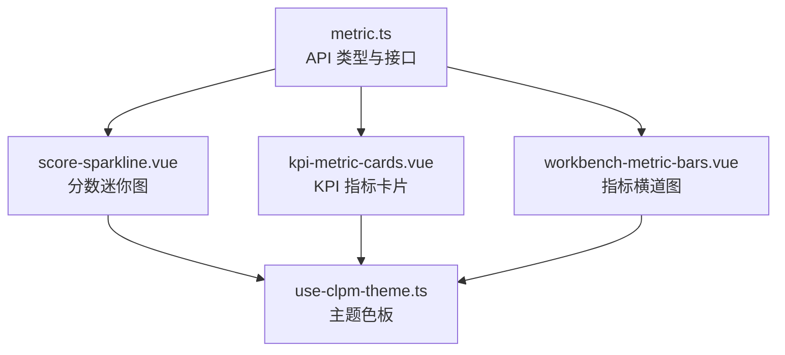
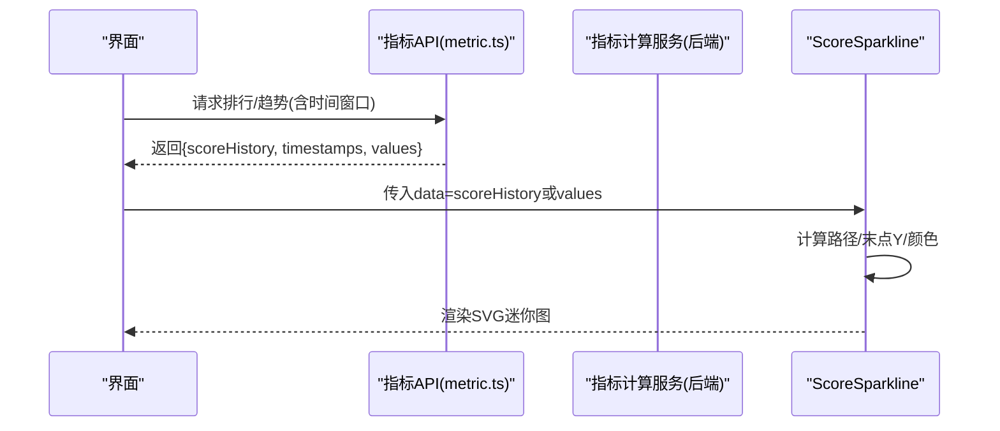
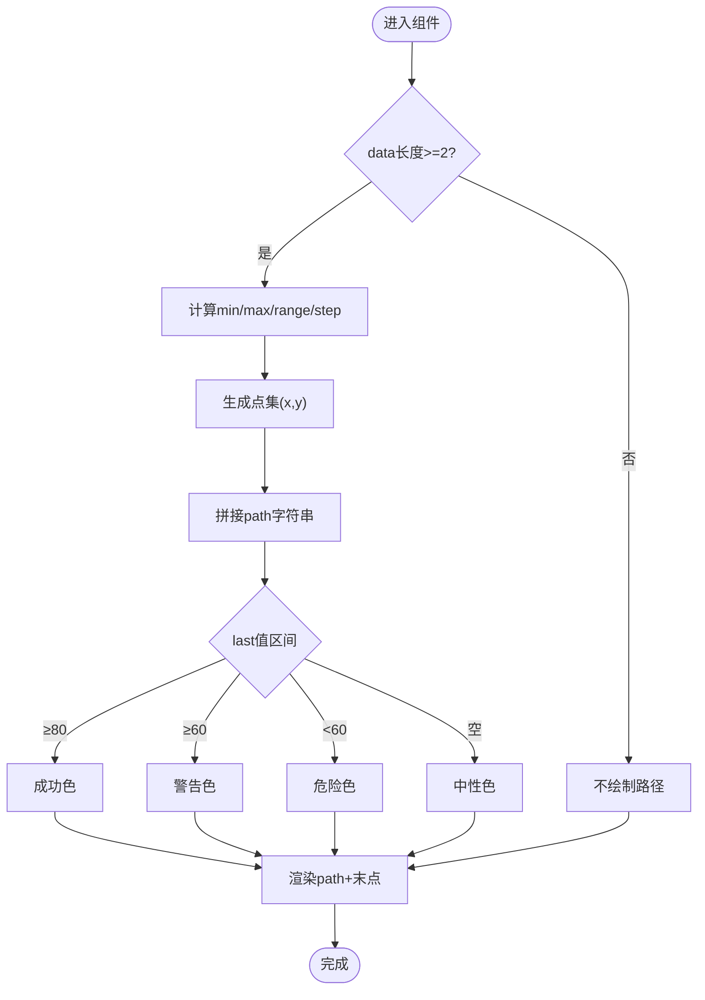
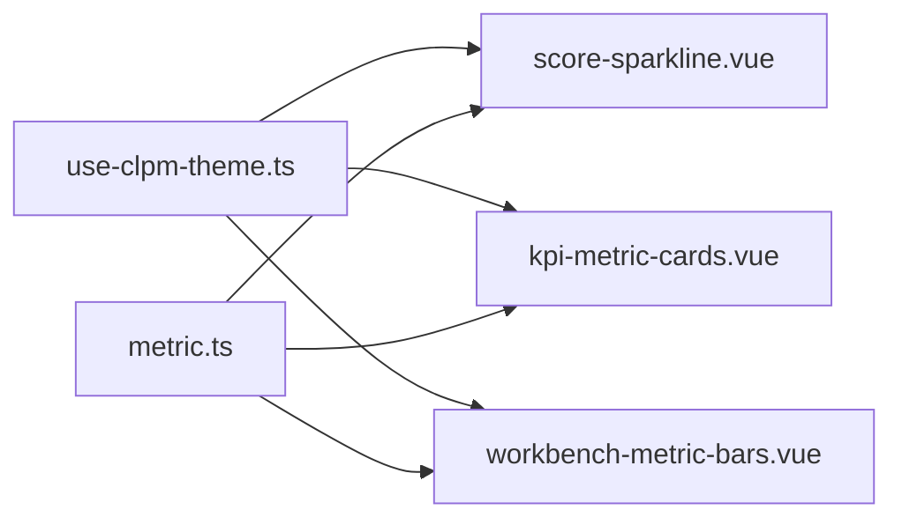

# 指标展示组件

<cite>
**本文引用的文件**
- [score-sparkline.vue](file://frontend/apps/web-antd/src/components/metric/score-sparkline.vue)
- [kpi-metric-cards.vue](file://frontend/apps/web-antd/src/views/loop/components/kpi-metric-cards.vue)
- [workbench-metric-bars.vue](file://frontend/apps/web-antd/src/views/loop/components/workbench-metric-bars.vue)
- [metric.ts](file://frontend/apps/web-antd/src/api/metric.ts)
- [use-clpm-theme.ts](file://frontend/apps/web-antd/src/composables/use-clpm-theme.ts)
</cite>

## 目录
1. [简介](#简介)
2. [项目结构](#项目结构)
3. [核心组件](#核心组件)
4. [架构总览](#架构总览)
5. [详细组件分析](#详细组件分析)
6. [依赖关系分析](#依赖关系分析)
7. [性能考虑](#性能考虑)
8. [故障排查指南](#故障排查指南)
9. [结论](#结论)
10. [附录：使用示例与集成指南](#附录使用示例与集成指南)

## 简介
本文件聚焦于指标可视化中的“分数迷你图”（Score Sparkline）及配套的指标卡片、横道图，说明其如何展示 KPI 的历史趋势、评分变化与性能对比；明确数据格式要求、动画效果、交互行为；阐述与指标计算服务的集成方式、数据缓存策略与实时更新机制；并提供样式定制、尺寸适配、无障碍访问支持以及完整的使用示例和集成指南。

## 项目结构
- 指标迷你图组件位于前端组件目录，负责以 SVG 绘制紧凑的折线趋势，用于在行内或卡片中快速感知评分走势。
- 指标卡片组件聚合 12 项 KPI，按正向/反向/信息三类指标进行阈值着色，并展示评估元信息（等级、时间、范围、可信度）。
- 指标横道图组件以纯 CSS 实现达成度条，支持正向/负向语义、阈值标线与提示文案。
- API 类型定义集中管理指标数据结构、排行项、趋势数据等，为组件提供强类型输入契约。
- 主题 composable 统一提供浅色/深色模式下的语义色板，确保一致的可读性与可访问性。

图表来源
- [score-sparkline.vue:1-82](file://frontend/apps/web-antd/src/components/metric/score-sparkline.vue#L1-L82)
- [kpi-metric-cards.vue:1-306](file://frontend/apps/web-antd/src/views/loop/components/kpi-metric-cards.vue#L1-L306)
- [workbench-metric-bars.vue:1-216](file://frontend/apps/web-antd/src/views/loop/components/workbench-metric-bars.vue#L1-L216)
- [metric.ts:1-1636](file://frontend/apps/web-antd/src/api/metric.ts#L1-L1636)
- [use-clpm-theme.ts:1-191](file://frontend/apps/web-antd/src/composables/use-clpm-theme.ts#L1-L191)

章节来源
- [score-sparkline.vue:1-82](file://frontend/apps/web-antd/src/components/metric/score-sparkline.vue#L1-L82)
- [kpi-metric-cards.vue:1-306](file://frontend/apps/web-antd/src/views/loop/components/kpi-metric-cards.vue#L1-L306)
- [workbench-metric-bars.vue:1-216](file://frontend/apps/web-antd/src/views/loop/components/workbench-metric-bars.vue#L1-L216)
- [metric.ts:1-1636](file://frontend/apps/web-antd/src/api/metric.ts#L1-L1636)
- [use-clpm-theme.ts:1-191](file://frontend/apps/web-antd/src/composables/use-clpm-theme.ts#L1-L191)

## 核心组件
- 分数迷你图（ScoreSparkline）
  - 职责：以极简 SVG 折线呈现最近若干个评分点，突出方向与波动。
  - 输入：数值数组 data，宽度 width，高度 height。
  - 输出：路径与末端圆点，颜色随最新值落入不同区间自动切换。
- KPI 指标卡片（KpiMetricCards）
  - 职责：展示 12 大 KPI（综合评分 + 核心 + 辅助），按指标性质着色，并显示评估元信息。
  - 输入：通过 provide/inject 注入的评估详情对象。
  - 输出：网格卡片 + 元信息区（等级、时间、范围、可信度）。
- 指标横道图（WorkbenchMetricBars）
  - 职责：以横向条形展示各项指标的达成度，支持正向/负向语义与阈值标线。
  - 输入：指标条目列表（名称、值、阈值、可选颜色）。
  - 输出：带进度条、数值与提示行的列表视图。

章节来源
- [score-sparkline.vue:1-82](file://frontend/apps/web-antd/src/components/metric/score-sparkline.vue#L1-L82)
- [kpi-metric-cards.vue:1-306](file://frontend/apps/web-antd/src/views/loop/components/kpi-metric-cards.vue#L1-L306)
- [workbench-metric-bars.vue:1-216](file://frontend/apps/web-antd/src/views/loop/components/workbench-metric-bars.vue#L1-L216)

## 架构总览
分数迷你图作为轻量级可视化单元，嵌入到排行榜行、指标卡片或自定义面板中，配合后端返回的评分历史序列，形成“点—线—面”的趋势表达：
- 数据源：后端指标服务提供回路级别评分历史（如排行榜项中的 scoreHistory）、节点趋势、快照等。
- 类型契约：前端 metric.ts 统一定义 TrendData、RankingItem.scoreHistory 等结构，保证前后端一致。
- 主题系统：通过 useClpmTheme 获取当前主题色板，确保明暗模式下的一致可读性。
- 渲染层：Vue 组件以响应式 computed 派生路径与颜色，最小化重绘成本。

图表来源
- [metric.ts:184-188](file://frontend/apps/web-antd/src/api/metric.ts#L184-L188)
- [metric.ts:236-237](file://frontend/apps/web-antd/src/api/metric.ts#L236-L237)
- [score-sparkline.vue:21-54](file://frontend/apps/web-antd/src/components/metric/score-sparkline.vue#L21-L54)

## 详细组件分析

### 分数迷你图（ScoreSparkline）
- 数据格式
  - 输入 data：number[]，表示最近的评分序列（例如来自排行榜项的 scoreHistory 或趋势 values）。
  - 当 data 长度小于 2 时，不绘制路径，仅占位。
- 渲染逻辑
  - 根据 min/max 归一化 y 坐标，按 x 步长均匀分布点，生成 SVG path。
  - 末端绘制圆点，便于定位最新值。
- 颜色策略
  - 基于最后一个值判断：≥80 成功色，≥60 警告色，否则危险色；无数据时使用中性色。
- 尺寸与布局
  - 通过 props width/height 控制容器大小，viewBox 自适应缩放。
- 动画与交互
  - 当前实现为静态 SVG，无内置过渡动画；可通过外层容器添加 CSS transition 实现淡入等效果。
  - 无内置交互（点击/悬停），如需扩展可在外层包裹 Tooltip 或放大视图。
- 无障碍
  - 建议为 svg 增加 role="img" 与 aria-label 描述趋势（由调用方补充）。
- 与主题集成
  - 通过 useClpmTheme 获取 SUCCESS/WARNING/DANGER/NEUTRAL 等语义色，自动适配深浅色模式。

图表来源
- [score-sparkline.vue:21-54](file://frontend/apps/web-antd/src/components/metric/score-sparkline.vue#L21-L54)

章节来源
- [score-sparkline.vue:1-82](file://frontend/apps/web-antd/src/components/metric/score-sparkline.vue#L1-L82)
- [use-clpm-theme.ts:34-56](file://frontend/apps/web-antd/src/composables/use-clpm-theme.ts#L34-L56)

### KPI 指标卡片（KpiMetricCards）
- 指标体系
  - 12 项指标：综合评分、准确率、快速率、平稳率、有效自控率、好值率、自控率、饱和率、振荡率、仪表故障率、稳定时间、粘滞指数。
  - 指标分类：正向（越大越好）、反向（越小越好）、信息（中性）。
- 数据来源
  - 通过 inject 获取父级提供的评估详情对象，包含 score、metrics、evalTime、dataTsStart/End、confidenceLevel 等。
- 颜色规则
  - 正向：≥80 绿，≥60 黄，<60 红。
  - 反向：<20 绿，<40 黄，≥40 红。
  - 信息类：中性色。
  - 空值：灰色。
- 元信息展示
  - 回路等级（基于综合评分推导）、评估时间、数据范围、可信度等级 Tag。
- 布局与响应式
  - 6×2 网格，紧凑排版，适合左半区面板。
- 无障碍
  - 数值使用 tabular-nums 提升可读性；Tag 提供语义标签。

章节来源
- [kpi-metric-cards.vue:1-306](file://frontend/apps/web-antd/src/views/loop/components/kpi-metric-cards.vue#L1-L306)

### 指标横道图（WorkbenchMetricBars）
- 功能要点
  - 每行展示指标名、达成度条、数值；支持阈值标线。
  - 正向/负向模式切换：正向“越长越好”，负向“越长越差”。
- 颜色与阈值
  - 正向：≥80 绿，60-79 琥珀，<60 红。
  - 反向：<20 绿，<40 琥珀，≥40 红。
  - 阈值标线位置受 clamp 限制在 0-100%。
- 动画
  - 条宽变化带有 0.2s ease 过渡，提升视觉平滑度。
- 空状态
  - 无数据时显示“暂无指标数据”。

章节来源
- [workbench-metric-bars.vue:1-216](file://frontend/apps/web-antd/src/views/loop/components/workbench-metric-bars.vue#L1-L216)

## 依赖关系分析
- 组件对主题的依赖
  - ScoreSparkline 与 KpiMetricCards 均通过 useClpmTheme 获取语义色，确保明暗模式一致性。
- 组件对 API 类型的依赖
  - KpiMetricCards 消费 LoopConfidenceLatestItem 结构（score、metrics、evalTime、dataTsStart/End、confidenceLevel）。
  - WorkbenchMetricBars 消费通用 MetricBarItem（name/value/threshold/color）。
  - 排行榜项包含 scoreHistory 字段，可直接作为迷你图输入。
- 数据流
  - 后端指标服务 → 前端 API 类型 → 页面/组件 → 迷你图/卡片/横道图。

图表来源
- [use-clpm-theme.ts:121-175](file://frontend/apps/web-antd/src/composables/use-clpm-theme.ts#L121-L175)
- [metric.ts:137-188](file://frontend/apps/web-antd/src/api/metric.ts#L137-L188)
- [metric.ts:236-237](file://frontend/apps/web-antd/src/api/metric.ts#L236-L237)

章节来源
- [use-clpm-theme.ts:121-175](file://frontend/apps/web-antd/src/composables/use-clpm-theme.ts#L121-L175)
- [metric.ts:137-188](file://frontend/apps/web-antd/src/api/metric.ts#L137-L188)
- [metric.ts:236-237](file://frontend/apps/web-antd/src/api/metric.ts#L236-L237)

## 性能考虑
- 迷你图计算复杂度
  - 路径构建 O(n)，n 为数据点数量；对于典型短序列（如 10-50 点）开销极低。
- 响应式优化
  - 使用 computed 缓存路径与颜色，避免重复计算。
- 渲染成本
  - SVG 元素极少（path + circle），DOM 更新成本低。
- 大数据量建议
  - 若需展示更长序列，建议在数据层做降采样（如等间隔抽样）后再传入组件。
- 动画与过渡
  - 横道图条宽过渡 0.2s，避免频繁刷新导致抖动；批量更新时可合并 state 变更。

[本节为通用性能指导，不直接分析具体文件]

## 故障排查指南
- 迷你图不显示
  - 检查 data 是否为空或长度小于 2；此时不会绘制路径。
  - 确认 width/height 是否合理（过小可能导致不可见）。
- 颜色异常
  - 确认 themeColors 是否正确注入；检查 last 值区间判断逻辑。
- 横道图条宽异常
  - 检查 value 是否被正确 clamp 到 0-100；阈值是否超出范围。
- 数据为空
  - 核对 API 返回结构是否符合 metric.ts 定义；确认父级 provide/inject 是否正确传递评估详情。
- 主题切换后颜色未更新
  - 确保组件使用响应式 themeColors.value；ECharts 场景需在 isDark 变化时重新构造 options。

章节来源
- [score-sparkline.vue:21-54](file://frontend/apps/web-antd/src/components/metric/score-sparkline.vue#L21-L54)
- [workbench-metric-bars.vue:66-82](file://frontend/apps/web-antd/src/views/loop/components/workbench-metric-bars.vue#L66-L82)
- [use-clpm-theme.ts:121-175](file://frontend/apps/web-antd/src/composables/use-clpm-theme.ts#L121-L175)

## 结论
分数迷你图以极低的渲染成本提供直观的评分趋势感知，配合 KPI 指标卡片与横道图，形成从“点（迷你图）—线（趋势）—面（多指标对比）”的完整可视化链路。通过统一的类型契约与主题系统，组件具备良好的可维护性与可扩展性。结合后端指标服务的数据供给，可实现实时/近实时的指标监控与诊断。

[本节为总结性内容，不直接分析具体文件]

## 附录：使用示例与集成指南

### 数据格式要求
- 迷你图输入
  - data: number[]（推荐来源于排行榜项的 scoreHistory 或趋势 values）。
  - width/height: 数字（默认 80/20）。
- 指标卡片输入
  - 通过 provide/inject 注入 LoopConfidenceLatestItem（包含 score、metrics、evalTime、dataTsStart/End、confidenceLevel）。
- 横道图输入
  - metrics: Array<{ name, value, threshold?, color? }>，value 取值 0-100。

章节来源
- [score-sparkline.vue:8-17](file://frontend/apps/web-antd/src/components/metric/score-sparkline.vue#L8-L17)
- [kpi-metric-cards.vue:70-93](file://frontend/apps/web-antd/src/views/loop/components/kpi-metric-cards.vue#L70-L93)
- [workbench-metric-bars.vue:21-39](file://frontend/apps/web-antd/src/views/loop/components/workbench-metric-bars.vue#L21-L39)
- [metric.ts:184-188](file://frontend/apps/web-antd/src/api/metric.ts#L184-L188)
- [metric.ts:236-237](file://frontend/apps/web-antd/src/api/metric.ts#L236-L237)
- [metric.ts:1568-1589](file://frontend/apps/web-antd/src/api/metric.ts#L1568-L1589)

### 动画效果
- 迷你图：静态 SVG，无内置动画；可在外层容器添加淡入等过渡。
- 横道图：条宽变化具备 0.2s ease 过渡。

章节来源
- [workbench-metric-bars.vue:179-183](file://frontend/apps/web-antd/src/views/loop/components/workbench-metric-bars.vue#L179-L183)

### 交互行为
- 迷你图：无内置交互；可扩展 Tooltip 或点击跳转至详情。
- 横道图：无内置交互；可结合外层交互实现高亮或筛选。
- 指标卡片：展示等级、时间、范围、可信度 Tag，便于快速理解评估上下文。

章节来源
- [score-sparkline.vue:57-74](file://frontend/apps/web-antd/src/components/metric/score-sparkline.vue#L57-L74)
- [workbench-metric-bars.vue:95-135](file://frontend/apps/web-antd/src/views/loop/components/workbench-metric-bars.vue#L95-L135)
- [kpi-metric-cards.vue:203-227](file://frontend/apps/web-antd/src/views/loop/components/kpi-metric-cards.vue#L203-L227)

### 与指标计算服务的集成
- 数据获取
  - 使用 metric.ts 暴露的 API 方法获取排行、趋势、快照等数据。
  - 排行榜项包含 scoreHistory，可直接传入迷你图。
- 类型对齐
  - 所有数据结构以 metric.ts 中的类型为准，确保前后端一致。
- 实时与缓存
  - 建议在页面层实现轮询或 WebSocket 订阅（依据业务需求），并对结果做本地缓存（如内存 Map/Store），减少重复请求。
  - 对高频更新的迷你图数据，可采用增量更新（追加新点、移除旧点）以保持性能。

章节来源
- [metric.ts:972-991](file://frontend/apps/web-antd/src/api/metric.ts#L972-L991)
- [metric.ts:1068-1150](file://frontend/apps/web-antd/src/api/metric.ts#L1068-L1150)
- [metric.ts:1511-1513](file://frontend/apps/web-antd/src/api/metric.ts#L1511-L1513)
- [metric.ts:1596-1599](file://frontend/apps/web-antd/src/api/metric.ts#L1596-L1599)

### 样式定制
- 迷你图
  - 通过 width/height 控制尺寸；stroke-width、stroke-linecap/join 已固定；可覆盖 .score-sparkline 样式。
- 指标卡片
  - 网格布局、字号、颜色均可通过 scoped 样式调整；强调项（综合评分）有额外样式。
- 横道图
  - 条高、圆角、过渡时长、阈值标线样式均可按需调整。

章节来源
- [score-sparkline.vue:77-81](file://frontend/apps/web-antd/src/components/metric/score-sparkline.vue#L77-L81)
- [kpi-metric-cards.vue:230-305](file://frontend/apps/web-antd/src/views/loop/components/kpi-metric-cards.vue#L230-L305)
- [workbench-metric-bars.vue:138-215](file://frontend/apps/web-antd/src/views/loop/components/workbench-metric-bars.vue#L138-L215)

### 尺寸适配
- 迷你图：viewBox 自适应，适合行内嵌入；建议最小宽度不低于 40px。
- 指标卡片：6×2 网格，适合窄面板；可根据容器宽度微调间距。
- 横道图：三列网格（名称/条/值），名称过长会省略显示。

章节来源
- [score-sparkline.vue:57-74](file://frontend/apps/web-antd/src/components/metric/score-sparkline.vue#L57-L74)
- [kpi-metric-cards.vue:239-246](file://frontend/apps/web-antd/src/views/loop/components/kpi-metric-cards.vue#L239-L246)
- [workbench-metric-bars.vue:156-162](file://frontend/apps/web-antd/src/views/loop/components/workbench-metric-bars.vue#L156-L162)

### 无障碍访问支持
- 迷你图
  - 建议为 svg 添加 role="img" 与 aria-label，描述趋势方向与最新值（由调用方实现）。
- 指标卡片
  - 使用 Tab 键导航，Tag 提供语义标签；数值使用等宽数字提升可读性。
- 横道图
  - 文本溢出省略，hover 可显示完整名称（title 属性）。

章节来源
- [score-sparkline.vue:57-74](file://frontend/apps/web-antd/src/components/metric/score-sparkline.vue#L57-L74)
- [kpi-metric-cards.vue:263-284](file://frontend/apps/web-antd/src/views/loop/components/kpi-metric-cards.vue#L263-L284)
- [workbench-metric-bars.vue:103-105](file://frontend/apps/web-antd/src/views/loop/components/workbench-metric-bars.vue#L103-L105)

### 完整使用示例（步骤）
- 在页面中引入 API 方法，拉取排行榜或趋势数据。
- 将排行榜项的 scoreHistory 或趋势 values 传入 ScoreSparkline。
- 将评估详情通过 provide 注入到子组件，供 KpiMetricCards 读取。
- 将指标列表（name/value/threshold）传入 WorkbenchMetricBars，设置 negative 标志以区分正向/负向指标。
- 通过 useClpmTheme 获取主题色，确保明暗模式一致。

章节来源
- [metric.ts:972-991](file://frontend/apps/web-antd/src/api/metric.ts#L972-L991)
- [metric.ts:1068-1150](file://frontend/apps/web-antd/src/api/metric.ts#L1068-L1150)
- [metric.ts:1511-1513](file://frontend/apps/web-antd/src/api/metric.ts#L1511-L1513)
- [metric.ts:1596-1599](file://frontend/apps/web-antd/src/api/metric.ts#L1596-L1599)
- [score-sparkline.vue:8-17](file://frontend/apps/web-antd/src/components/metric/score-sparkline.vue#L8-L17)
- [kpi-metric-cards.vue:70-93](file://frontend/apps/web-antd/src/views/loop/components/kpi-metric-cards.vue#L70-L93)
- [workbench-metric-bars.vue:21-39](file://frontend/apps/web-antd/src/views/loop/components/workbench-metric-bars.vue#L21-L39)
- [use-clpm-theme.ts:121-175](file://frontend/apps/web-antd/src/composables/use-clpm-theme.ts#L121-L175)