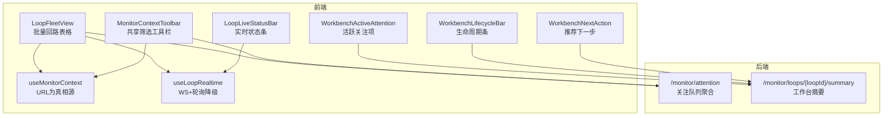
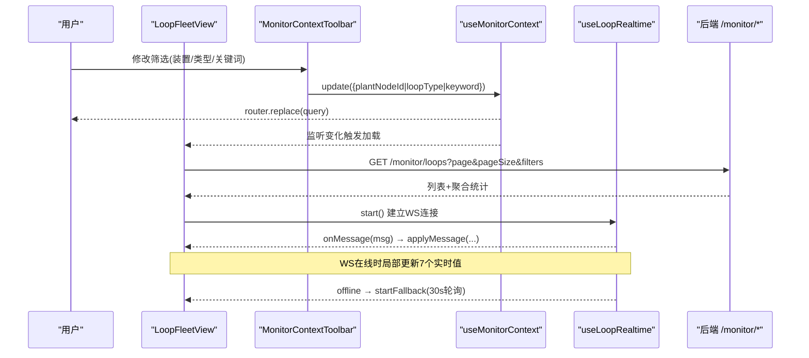
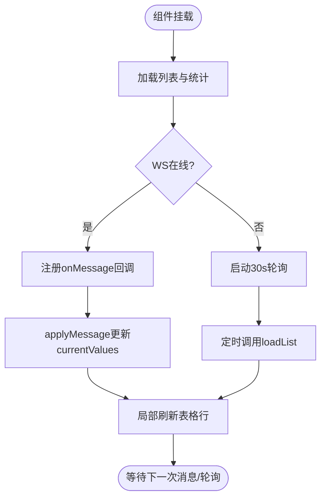
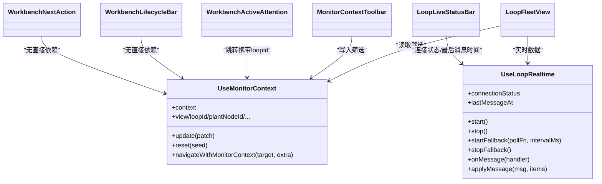

# 监控工作区组件

<cite>
**本文引用的文件**
- [loop-fleet-view.vue](file://frontend/apps/web-antd/src/components/monitor/loop-fleet-view.vue)
- [workbench-active-attention.vue](file://frontend/apps/web-antd/src/components/monitor/workbench-active-attention.vue)
- [workbench-lifecycle-bar.vue](file://frontend/apps/web-antd/src/components/monitor/workbench-lifecycle-bar.vue)
- [workbench-next-action.vue](file://frontend/apps/web-antd/src/components/monitor/workbench-next-action.vue)
- [loop-live-status-bar.vue](file://frontend/apps/web-antd/src/components/monitor/loop-live-status-bar.vue)
- [monitor-context-toolbar.vue](file://frontend/apps/web-antd/src/components/monitor/monitor-context-toolbar.vue)
- [use-monitor-context.ts](file://frontend/apps/web-antd/src/composables/use-monitor-context.ts)
- [use-loop-realtime.ts](file://frontend/apps/web-antd/src/composables/use-loop-realtime.ts)
- [attention.vue](file://frontend/apps/web-antd/src/views/monitor/attention.vue)
- [loops.vue](file://frontend/apps/web-antd/src/views/monitor/loops.vue)
- [monitor.py](file://backend/app/api/v1/endpoints/monitor.py)
- [workbench_summary.py](file://backend/app/services/workbench_summary.py)
</cite>

## 目录
1. [简介](#简介)
2. [项目结构](#项目结构)
3. [核心组件](#核心组件)
4. [架构总览](#架构总览)
5. [详细组件分析](#详细组件分析)
6. [依赖关系分析](#依赖关系分析)
7. [性能与内存优化](#性能与内存优化)
8. [故障排查指南](#故障排查指南)
9. [结论](#结论)
10. [附录：配置、主题与响应式](#附录：配置主题与响应式)

## 简介
本文件面向“监控工作区”的六大前端组件，系统性说明它们如何协同实现大规模回路监控、实时状态同步、用户交互反馈，以及与后端监控服务的数据集成。重点覆盖：
- 批量回路视图（LoopFleetView）的大列表展示、筛选、统计、导出与实时刷新
- 工作台关注队列（WorkbenchActiveAttention）的活跃项汇总与跳转
- 生命周期条（WorkbenchLifecycleBar）的两阶段可扫描状态呈现
- 下一步操作（WorkbenchNextAction）的推荐动作与门禁提示
- 实时状态栏（LoopLiveStatusBar）的连接三态、PV质量码与数据新鲜度
- 共享工具栏（MonitorContextToolbar）的装置/类型/关键词/保存视图统一筛选

## 项目结构
监控相关的前端代码集中在 `frontend/apps/web-antd/src/components/monitor`，配合 `composables` 中的上下文与实时能力，以及 `views/monitor` 页面组合使用；后端通过 `/api/v1/monitor` 暴露关注队列与工作台区摘要接口。

图表来源
- [loop-fleet-view.vue:1-120](file://frontend/apps/web-antd/src/components/monitor/loop-fleet-view.vue#L1-L120)
- [monitor-context-toolbar.vue:1-60](file://frontend/apps/web-antd/src/components/monitor/monitor-context-toolbar.vue#L1-L60)
- [loop-live-status-bar.vue:1-40](file://frontend/apps/web-antd/src/components/monitor/loop-live-status-bar.vue#L1-L40)
- [workbench-active-attention.vue:1-30](file://frontend/apps/web-antd/src/components/monitor/workbench-active-attention.vue#L1-L30)
- [workbench-lifecycle-bar.vue:1-35](file://frontend/apps/web-antd/src/components/monitor/workbench-lifecycle-bar.vue#L1-L35)
- [workbench-next-action.vue:1-30](file://frontend/apps/web-antd/src/components/monitor/workbench-next-action.vue#L1-L30)
- [use-monitor-context.ts:1-80](file://frontend/apps/web-antd/src/composables/use-monitor-context.ts#L1-L80)
- [use-loop-realtime.ts:1-80](file://frontend/apps/web-antd/src/composables/use-loop-realtime.ts#L1-L80)
- [monitor.py:1-40](file://backend/app/api/v1/endpoints/monitor.py#L1-L40)
- [workbench_summary.py:499-529](file://backend/app/services/workbench_summary.py#L499-L529)

章节来源
- [loop-fleet-view.vue:1-120](file://frontend/apps/web-antd/src/components/monitor/loop-fleet-view.vue#L1-L120)
- [monitor-context-toolbar.vue:1-60](file://frontend/apps/web-antd/src/components/monitor/monitor-context-toolbar.vue#L1-L60)
- [use-monitor-context.ts:1-80](file://frontend/apps/web-antd/src/composables/use-monitor-context.ts#L1-L80)
- [use-loop-realtime.ts:1-80](file://frontend/apps/web-antd/src/composables/use-loop-realtime.ts#L1-L80)
- [monitor.py:1-40](file://backend/app/api/v1/endpoints/monitor.py#L1-L40)

## 核心组件
- LoopFleetView：批量回路表格视图，承载分页、筛选、统计卡片、列设置、密度切换、CSV导出、自动刷新开关、行点击下钻工作台。
- MonitorContextToolbar：共享筛选工具栏，统一装置/单元、回路类型、关键词搜索、保存视图、“只看关注项”等筛选条件，写入 URL 作为唯一真相源。
- LoopLiveStatusBar：显示选中回路的 PV/SP/OP/MODE、连接状态、采样时间、PV质量码与数据延迟提示。
- WorkbenchActiveAttention：当前回路活跃关注项汇总，最多展示 3 条明细，支持跳转到关注队列并携带 loopId 筛选。
- WorkbenchLifecycleBar：两阶段（监控/评估）生命周期条，标注当前/阻塞/超期/不可用等状态，点击可滚动到对应区域。
- WorkbenchNextAction：推荐下一步，仅一个主动作 + 原因 + 前置条件，禁用时给出原因。

章节来源
- [loop-fleet-view.vue:48-120](file://frontend/apps/web-antd/src/components/monitor/loop-fleet-view.vue#L48-L120)
- [monitor-context-toolbar.vue:17-60](file://frontend/apps/web-antd/src/components/monitor/monitor-context-toolbar.vue#L17-L60)
- [loop-live-status-bar.vue:16-32](file://frontend/apps/web-antd/src/components/monitor/loop-live-status-bar.vue#L16-L32)
- [workbench-active-attention.vue:16-30](file://frontend/apps/web-antd/src/components/monitor/workbench-active-attention.vue#L16-L30)
- [workbench-lifecycle-bar.vue:13-24](file://frontend/apps/web-antd/src/components/monitor/workbench-lifecycle-bar.vue#L13-L24)
- [workbench-next-action.vue:11-20](file://frontend/apps/web-antd/src/components/monitor/workbench-next-action.vue#L11-L20)

## 架构总览
监控工作区的核心是“URL 即真相源”的共享上下文与“WebSocket 优先、轮询降级”的实时通道。前端组件通过 useMonitorContext 读写筛选与导航上下文，通过 useLoopRealtime 订阅实时消息并在断连时回退到轮询。后端提供关注队列聚合接口与工作台区摘要接口，支撑列表、统计与工作台首屏。

图表来源
- [monitor-context-toolbar.vue:82-115](file://frontend/apps/web-antd/src/components/monitor/monitor-context-toolbar.vue#L82-L115)
- [use-monitor-context.ts:159-216](file://frontend/apps/web-antd/src/composables/use-monitor-context.ts#L159-L216)
- [loop-fleet-view.vue:348-396](file://frontend/apps/web-antd/src/components/monitor/loop-fleet-view.vue#L348-L396)
- [use-loop-realtime.ts:103-177](file://frontend/apps/web-antd/src/composables/use-loop-realtime.ts#L103-L177)
- [monitor.py:1-40](file://backend/app/api/v1/endpoints/monitor.py#L1-L40)

## 详细组件分析

### LoopFleetView（批量回路表格视图）
- 功能要点
  - 分页列表：调用 getLoopMonitorListApi，按评分升序排序（最差在前），服务端已排序，前端双保险。
  - 统计卡片：类型统计、等级统计（五档）、综合性能简单平均、较昨日恶化数、实时自控率（MODE分布）。
  - 列配置：默认隐藏量程/单位，支持用户自定义列可见性与顺序。
  - 实时刷新：WS在线时仅靠推送更新7个实时值；断连时30秒轮询降级。
  - 导出CSV：将当前页数据导出为带BOM的CSV。
  - 行点击：触发 loopClick 事件，由父页面导航至工作台。
- 关键数据流
  - 筛选来自 useMonitorContext，变化时重置到第1页并重新加载列表与统计。
  - 聚合统计优先使用服务端 aggregate（gradeCounts、avgScore、worsenedCount、autoControlRate），否则降级为前端计算。
- 性能与内存
  - 使用 Table 分页减少DOM压力；虚拟列表未在此组件启用，但可通过父级或后续迭代引入。
  - 实时数据通过 applyMessage 局部更新 currentValues，避免整表重渲染。
  - 自动刷新开关控制 start/stop，卸载时 stop 与 stopFallback 释放资源。

图表来源
- [loop-fleet-view.vue:200-226](file://frontend/apps/web-antd/src/components/monitor/loop-fleet-view.vue#L200-L226)
- [loop-fleet-view.vue:470-502](file://frontend/apps/web-antd/src/components/monitor/loop-fleet-view.vue#L470-L502)
- [use-loop-realtime.ts:116-177](file://frontend/apps/web-antd/src/composables/use-loop-realtime.ts#L116-L177)

章节来源
- [loop-fleet-view.vue:48-120](file://frontend/apps/web-antd/src/components/monitor/loop-fleet-view.vue#L48-L120)
- [loop-fleet-view.vue:227-333](file://frontend/apps/web-antd/src/components/monitor/loop-fleet-view.vue#L227-L333)
- [loop-fleet-view.vue:348-440](file://frontend/apps/web-antd/src/components/monitor/loop-fleet-view.vue#L348-L440)
- [loop-fleet-view.vue:470-531](file://frontend/apps/web-antd/src/components/monitor/loop-fleet-view.vue#L470-L531)

### MonitorContextToolbar（共享筛选工具栏）
- 功能要点
  - 装置/单元下拉：异步加载 plantNode 树并扁平化。
  - 回路类型下拉：基于 LOOP_TYPE_LABEL_MAP。
  - 关键词搜索：本地绑定 + 300ms防抖，回车立即查询。
  - “只看关注项”：Phase 2 API就绪后通过 attentionOnlyHidden 控制显隐。
  - 保存视图：复用 use-saved-view，支持保存与套用预设。
- 上下文集成
  - 所有筛选变更通过 monitorCtx.update 写入 URL，组件不维护内部筛选状态。
  - 监听 URL→本地 keyword 双向同步，保证前进后退一致性。

章节来源
- [monitor-context-toolbar.vue:17-60](file://frontend/apps/web-antd/src/components/monitor/monitor-context-toolbar.vue#L17-L60)
- [monitor-context-toolbar.vue:82-147](file://frontend/apps/web-antd/src/components/monitor/monitor-context-toolbar.vue#L82-L147)
- [monitor-context-toolbar.vue:150-241](file://frontend/apps/web-antd/src/components/monitor/monitor-context-toolbar.vue#L150-L241)

### LoopLiveStatusBar（实时状态条）
- 功能要点
  - 连接三态：online/reconnecting/offline，以 Tag 颜色区分。
  - PV/SP/OP/MODE：从 loop.currentValues 读取并格式化。
  - PV质量码：映射 BAD/GOOD/Uncertain。
  - 采样时间：readAt 格式化显示。
  - 数据新鲜度：dataFreshness.status=DELAYED 时显示提示，非红色，遵循UI规范。
- 数据来源
  - 由父组件传入 connectionStatus、lastMessageAt、loop、dataFreshness，通常来自 useLoopRealtime 与 summary。

章节来源
- [loop-live-status-bar.vue:16-96](file://frontend/apps/web-antd/src/components/monitor/loop-live-status-bar.vue#L16-L96)
- [loop-live-status-bar.vue:98-156](file://frontend/apps/web-antd/src/components/monitor/loop-live-status-bar.vue#L98-L156)

### WorkbenchActiveAttention（工作台关注队列入口）
- 功能要点
  - 汇总条：显示 total 待处理与最高优先级标签。
  - 明细列表：最多展示 3 条，Tooltip 显示标题、摘要、rankReasons、发生时间。
  - 跳转：点击“查看全部”进入 /monitor/attention，并携带 loopId 筛选。
- 数据契约
  - activeAttention 来自 workbench summary 的 activeAttention 字段。

章节来源
- [workbench-active-attention.vue:16-58](file://frontend/apps/web-antd/src/components/monitor/workbench-active-attention.vue#L16-L58)
- [workbench-active-attention.vue:60-128](file://frontend/apps/web-antd/src/components/monitor/workbench-active-attention.vue#L60-L128)

### WorkbenchLifecycleBar（生命周期条）
- 功能要点
  - 两阶段：MONITOR/ASSESS，每阶段有状态（未开始/就绪/进行中/已完成/证据不足/阻塞/超期/不需要）。
  - 不可用标记：当 unavailableSections 包含对应来源（runtime/assessment）时，显示“数据不可用”。
  - 交互：点击阶段触发 stageClick 事件，用于滚动到对应区块。
- 视觉语义
  - 不只依赖颜色，同时提供图标与文字，满足无障碍要求。

章节来源
- [workbench-lifecycle-bar.vue:13-83](file://frontend/apps/web-antd/src/components/monitor/workbench-lifecycle-bar.vue#L13-L83)
- [workbench-lifecycle-bar.vue:85-136](file://frontend/apps/web-antd/src/components/monitor/workbench-lifecycle-bar.vue#L85-L136)
- [workbench-lifecycle-bar.vue:138-249](file://frontend/apps/web-antd/src/components/monitor/workbench-lifecycle-bar.vue#L138-L249)

### WorkbenchNextAction（推荐下一步）
- 功能要点
  - 单一主动作：根据 nextAction.enabled 决定按钮可用；被动作（CONTINUE_MONITORING）样式不同。
  - 原因与前置条件：label 与 reason 展示，disabledReason 在禁用时显示。
  - 事件：action 事件向上抛出，由父组件执行可信度与危险确认门禁。
- 设计约束
  - 页面只保留一个 primary 主动作，避免选择困难。

章节来源
- [workbench-next-action.vue:11-29](file://frontend/apps/web-antd/src/components/monitor/workbench-next-action.vue#L11-L29)
- [workbench-next-action.vue:31-67](file://frontend/apps/web-antd/src/components/monitor/workbench-next-action.vue#L31-L67)
- [workbench-next-action.vue:69-128](file://frontend/apps/web-antd/src/components/monitor/workbench-next-action.vue#L69-L128)

## 依赖关系分析
- 上下文依赖
  - 所有组件通过 useMonitorContext 共享筛选与导航上下文，URL 是唯一真相源，避免多源状态不一致。
- 实时依赖
  - LoopFleetView 与 LoopLiveStatusBar 依赖 useLoopRealtime 提供的 WS 连接与消息分发；断连时自动降级轮询。
- 后端依赖
  - 关注队列页面与工作台摘要分别依赖后端 /monitor/attention 与 /monitor/loops/{loopId}/summary。
  - 工作台摘要中 activeAttention 复用 monitor_attention 聚合逻辑，确保数据一致。

图表来源
- [use-monitor-context.ts:159-267](file://frontend/apps/web-antd/src/composables/use-monitor-context.ts#L159-L267)
- [use-loop-realtime.ts:103-271](file://frontend/apps/web-antd/src/composables/use-loop-realtime.ts#L103-L271)
- [loop-fleet-view.vue:69-75](file://frontend/apps/web-antd/src/components/monitor/loop-fleet-view.vue#L69-L75)
- [monitor-context-toolbar.vue:49-52](file://frontend/apps/web-antd/src/components/monitor/monitor-context-toolbar.vue#L49-L52)
- [loop-live-status-bar.vue:18-31](file://frontend/apps/web-antd/src/components/monitor/loop-live-status-bar.vue#L18-L31)

章节来源
- [use-monitor-context.ts:159-267](file://frontend/apps/web-antd/src/composables/use-monitor-context.ts#L159-L267)
- [use-loop-realtime.ts:103-271](file://frontend/apps/web-antd/src/composables/use-loop-realtime.ts#L103-L271)

## 性能与内存优化
- 列表性能
  - 分页加载：LoopFleetView 使用 ant-design-vue Table 的分页能力，减少 DOM 节点数量。
  - 排序策略：服务端排序为主，前端二次排序作为双保险，避免全量排序开销。
  - 列配置：默认隐藏低频字段（量程/单位），降低渲染成本。
- 实时性能
  - WebSocket 优先：useLoopRealtime 全局单例，避免重复连接；消息到达后局部更新 currentValues，最小化重渲染。
  - 轮询降级：WS 离线时 30 秒轮询，保证数据不会长时间停滞。
  - 模式映射：MODE 值以 REST 返回为权威，WS 只做安全默认映射，避免错误覆盖。
- 内存管理
  - 组件卸载时停止 WS 回调与轮询定时器，防止内存泄漏。
  - 工具栏与列表对筛选状态采用 URL 驱动，避免冗余本地状态。
- 网络与缓存
  - 聚合统计优先使用服务端 aggregate，减少前端计算与误差。
  - 保存视图复用 use-saved-view，提升常用筛选复用效率。

章节来源
- [loop-fleet-view.vue:200-226](file://frontend/apps/web-antd/src/components/monitor/loop-fleet-view.vue#L200-L226)
- [loop-fleet-view.vue:470-502](file://frontend/apps/web-antd/src/components/monitor/loop-fleet-view.vue#L470-L502)
- [use-loop-realtime.ts:116-177](file://frontend/apps/web-antd/src/composables/use-loop-realtime.ts#L116-L177)
- [use-loop-realtime.ts:224-254](file://frontend/apps/web-antd/src/composables/use-loop-realtime.ts#L224-L254)

## 故障排查指南
- 列表加载失败
  - 现象：errorMessage 非空，total=0。
  - 排查：检查 getLoopMonitorListApi 请求参数（plantNodeId/loopType/keyword/page/pageSize），确认后端返回格式。
- 实时数据不更新
  - 现象：PV/SP/OP/MODE 不变化，或显示离线。
  - 排查：查看 connectionStatus 是否为 online；若 offline，确认是否启动了 startFallback；检查 tagCode 解析与 tagName 匹配。
- 关注队列为空
  - 现象：activeAttention.total=0。
  - 排查：确认 summary.activeAttention 是否正确返回；检查后端 /monitor/attention 筛选条件。
- 生命周期不可用
  - 现象：阶段显示“数据不可用”。
  - 排查：检查 unavailableSections 是否包含 runtime/assessment；确认后端 summary 部分失败容错逻辑。
- 下一步不可用
  - 现象：按钮禁用且显示 disabledReason。
  - 排查：确认 nextAction.enabled 与前置条件；检查角色权限与可信度门禁。

章节来源
- [loop-fleet-view.vue:348-377](file://frontend/apps/web-antd/src/components/monitor/loop-fleet-view.vue#L348-L377)
- [use-loop-realtime.ts:116-177](file://frontend/apps/web-antd/src/composables/use-loop-realtime.ts#L116-L177)
- [workbench-lifecycle-bar.vue:51-78](file://frontend/apps/web-antd/src/components/monitor/workbench-lifecycle-bar.vue#L51-L78)
- [workbench-next-action.vue:21-29](file://frontend/apps/web-antd/src/components/monitor/workbench-next-action.vue#L21-L29)

## 结论
监控工作区通过“URL 真相源 + 实时通道 + 后端聚合”的架构，实现了大规模回路的高效监控与即时反馈。各组件职责清晰、耦合合理：
- LoopFleetView 负责批量监控与统计，结合 useLoopRealtime 保障实时性；
- MonitorContextToolbar 统一筛选，避免状态分散；
- 工作台侧的 ActiveAttention/Lifecycle/NextAction 聚焦单回路上下文，提升处置效率；
- LoopLiveStatusBar 提供直观的连接与数据质量信号。
整体方案兼顾性能、可维护性与用户体验，适合在生产环境部署与扩展。

## 附录：配置、主题与响应式
- 组件配置
  - LoopFleetView：showStats、showAutoRefresh 控制统计与自动刷新开关；emit loopClick 用于下钻。
  - MonitorContextToolbar：attentionOnlyHidden、pageKey、showPlantNode/showLoopType/showSearch/showSavedView 控制显隐。
  - LoopLiveStatusBar：传入 connectionStatus、dataFreshness、lastMessageAt、loop。
  - WorkbenchActiveAttention：传入 activeAttention、loopId。
  - WorkbenchLifecycleBar：传入 lifecycle、unavailableSections。
  - WorkbenchNextAction：传入 nextAction。
- 主题定制
  - 组件广泛使用 CSS 变量（如 hsl(var(--card)/var(--border)/var(--primary))），便于通过主题系统定制外观。
  - 等级与状态色遵循工业标准（GB/T 44693.2-2024 默认阈值），并通过 Tag 预设色形成视觉渐变。
- 响应式适配
  - 表格支持横向滚动与密度切换；统计卡片使用 flex-wrap 自适应换行。
  - 工具栏控件尺寸统一 small，适配紧凑布局。
- 实际使用案例
  - 回路清单页：父页面 loops.vue 嵌入 LoopFleetView，传递 showStats/showAutoRefresh，并处理 loopClick 跳转工作台。
  - 关注队列页：attention.vue 使用 getAttentionListApi 加载分组数据，支持优先级/来源/状态筛选与详情抽屉。
  - 工作台首屏：通过 /monitor/loops/{loopId}/summary 获取 activeAttention/lifecycle/nextAction，驱动 WorkbenchActiveAttention/WorkbenchLifecycleBar/WorkbenchNextAction。

章节来源
- [loop-fleet-view.vue:50-65](file://frontend/apps/web-antd/src/components/monitor/loop-fleet-view.vue#L50-L65)
- [monitor-context-toolbar.vue:19-42](file://frontend/apps/web-antd/src/components/monitor/monitor-context-toolbar.vue#L19-L42)
- [loop-live-status-bar.vue:18-31](file://frontend/apps/web-antd/src/components/monitor/loop-live-status-bar.vue#L18-L31)
- [workbench-active-attention.vue:18-23](file://frontend/apps/web-antd/src/components/monitor/workbench-active-attention.vue#L18-L23)
- [workbench-lifecycle-bar.vue:15-19](file://frontend/apps/web-antd/src/components/monitor/workbench-lifecycle-bar.vue#L15-L19)
- [workbench-next-action.vue:13-15](file://frontend/apps/web-antd/src/components/monitor/workbench-next-action.vue#L13-L15)
- [loops.vue:60-95](file://frontend/apps/web-antd/src/views/monitor/loops.vue#L60-L95)
- [attention.vue:278-311](file://frontend/apps/web-antd/src/views/monitor/attention.vue#L278-L311)
- [monitor.py:1-40](file://backend/app/api/v1/endpoints/monitor.py#L1-L40)
- [workbench_summary.py:499-529](file://backend/app/services/workbench_summary.py#L499-L529)