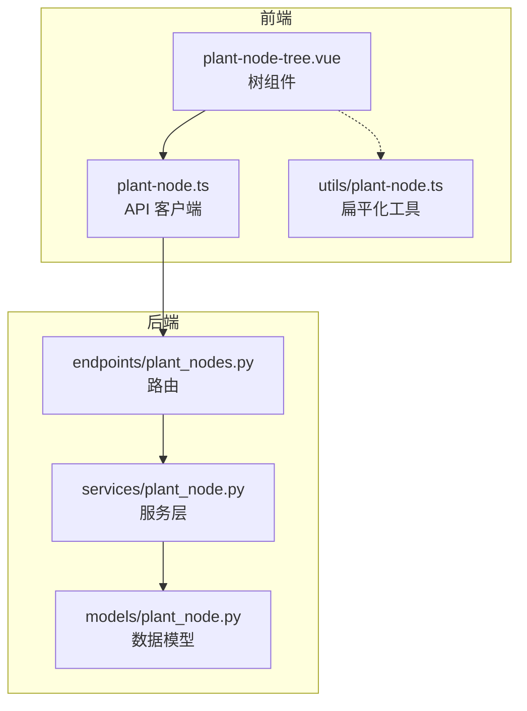
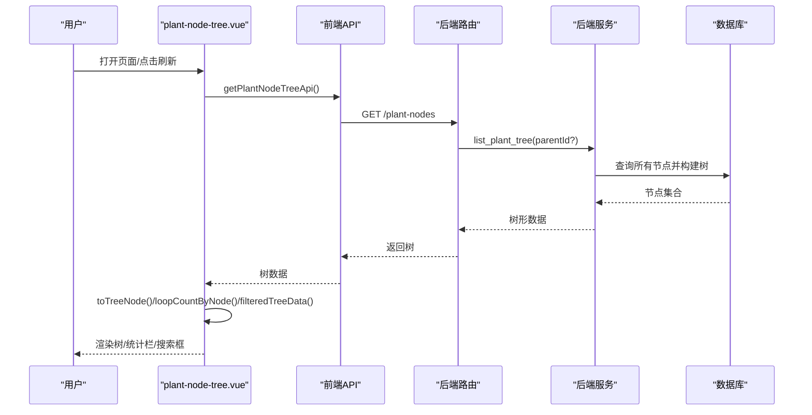

# 装置节点组件

<cite>
**本文引用的文件**
- [plant-node-tree.vue](file://frontend/apps/web-antd/src/components/plant-node/plant-node-tree.vue)
- [plant-node.ts（前端 API）](file://frontend/apps/web-antd/src/api/plant-node.ts)
- [plant-node.ts（工具函数）](file://frontend/apps/web-antd/src/utils/plant-node.ts)
- [plant_nodes.py（API 路由）](file://backend/app/api/v1/endpoints/plant_nodes.py)
- [plant_node.py（后端服务）](file://backend/app/services/plant_node.py)
- [plant_node.py（数据模型）](file://backend/app/models/plant_node.py)
</cite>

## 目录
1. [简介](#简介)
2. [项目结构](#项目结构)
3. [核心组件](#核心组件)
4. [架构总览](#架构总览)
5. [详细组件分析](#详细组件分析)
6. [依赖关系分析](#依赖关系分析)
7. [性能考量](#性能考量)
8. [故障排查指南](#故障排查指南)
9. [结论](#结论)
10. [附录：使用示例与扩展指南](#附录使用示例与扩展指南)

## 简介
本章节面向“装置节点树”组件 plant-node-tree，系统性说明其如何展示工厂装置的层级结构、实现节点展开收起与搜索过滤、与后端数据模型的映射关系、异步加载机制、节点操作权限控制、交互设计（含键盘导航）、样式定制与主题适配、以及性能优化策略。同时提供完整的使用示例与扩展指南，帮助开发者快速集成与二次开发。

## 项目结构
该功能由前后端协同实现：
- 前端组件：Vue 单文件组件，封装 Ant Design Vue Tree，负责树形渲染、搜索过滤、展开/折叠、选中事件、统计栏等。
- 前端 API：封装 HTTP 请求，提供获取树、创建/更新/删除节点、导入导出等接口调用。
- 后端路由：FastAPI 路由定义，暴露 RESTful 接口，包含权限校验。
- 后端服务：业务逻辑层，负责树构建、CRUD、导入导出、审计日志等。
- 数据模型：数据库表结构与约束，保证三层结构（FACTORY → AREA → UNIT）及唯一性、排序等规则。

图表来源
- [plant-node-tree.vue:1-604](file://frontend/apps/web-antd/src/components/plant-node/plant-node-tree.vue#L1-L604)
- [plant-node.ts（前端 API）:1-278](file://frontend/apps/web-antd/src/api/plant-node.ts#L1-L278)
- [plant_nodes.py（API 路由）:1-258](file://backend/app/api/v1/endpoints/plant_nodes.py#L1-L258)
- [plant_node.py（后端服务）:1-607](file://backend/app/services/plant_node.py#L1-L607)
- [plant_node.py（数据模型）:1-90](file://backend/app/models/plant_node.py#L1-L90)

章节来源
- [plant-node-tree.vue:1-604](file://frontend/apps/web-antd/src/components/plant-node/plant-node-tree.vue#L1-L604)
- [plant-node.ts（前端 API）:1-278](file://frontend/apps/web-antd/src/api/plant-node.ts#L1-L278)
- [plant_nodes.py（API 路由）:1-258](file://backend/app/api/v1/endpoints/plant_nodes.py#L1-L258)
- [plant_node.py（后端服务）:1-607](file://backend/app/services/plant_node.py#L1-L607)
- [plant_node.py（数据模型）:1-90](file://backend/app/models/plant_node.py#L1-L90)

## 核心组件
- 组件职责
  - 展示工厂装置单元三层树形结构（FACTORY → AREA → UNIT）。
  - 支持搜索过滤、展开/折叠、全部展开/全部折叠、刷新。
  - 计算并展示各节点回路数（通过外部传入的 loopCounts 递归累加）。
  - 可选头部统计栏（工厂/装置/单元/回路总数）。
  - 选中节点后向父组件发出 select 事件，供页面联动。
- 关键特性
  - 类型徽章与图标：按节点类型显示不同图标与语义色。
  - 搜索时自动展开匹配路径上的祖先节点。
  - 清理无效展开键与选中键，避免状态不一致。
  - 暗色模式适配与高密度排版风格。

章节来源
- [plant-node-tree.vue:1-604](file://frontend/apps/web-antd/src/components/plant-node/plant-node-tree.vue#L1-L604)

## 架构总览
从用户交互到数据落库的端到端流程如下：

图表来源
- [plant-node-tree.vue:232-311](file://frontend/apps/web-antd/src/components/plant-node/plant-node-tree.vue#L232-L311)
- [plant-node.ts（前端 API）:55-59](file://frontend/apps/web-antd/src/api/plant-node.ts#L55-L59)
- [plant_nodes.py（API 路由）:49-59](file://backend/app/api/v1/endpoints/plant_nodes.py#L49-L59)
- [plant_node.py（后端服务）:58-88](file://backend/app/services/plant_node.py#L58-L88)

章节来源
- [plant-node-tree.vue:232-311](file://frontend/apps/web-antd/src/components/plant-node/plant-node-tree.vue#L232-L311)
- [plant-node.ts（前端 API）:55-59](file://frontend/apps/web-antd/src/api/plant-node.ts#L55-L59)
- [plant_nodes.py（API 路由）:49-59](file://backend/app/api/v1/endpoints/plant_nodes.py#L49-L59)
- [plant_node.py（后端服务）:58-88](file://backend/app/services/plant_node.py#L58-L88)

## 详细组件分析

### 数据模型与映射关系
- 后端数据模型
  - 三层结构：FACTORY（工厂）→ AREA（装置/车间）→ UNIT（单元），回路挂在 UNIT 下。
  - 字段包括名称、类型、父节点、是否参评、排序、来源标记、更新时间等。
  - 约束：类型枚举、同父重名唯一、索引优化。
- 前端数据模型
  - PlantNodeApi.PlantNode：id、name、type、parentId、children。
  - 组件内部 TreeNode：key、node、title、children，用于 Ant Tree。
- 映射方式
  - 组件将后端节点转换为 Ant Tree 节点，保留 node 引用以便后续事件处理。
  - 通过 computed 计算每个节点的回路总数（基于外部传入的 loopCounts 递归累加）。

章节来源
- [plant_node.py（数据模型）:26-90](file://backend/app/models/plant_node.py#L26-L90)
- [plant-node.ts（前端 API）:8-19](file://frontend/apps/web-antd/src/api/plant-node.ts#L8-L19)
- [plant-node-tree.vue:32-37](file://frontend/apps/web-antd/src/components/plant-node/plant-node-tree.vue#L32-L37)
- [plant-node-tree.vue:132-162](file://frontend/apps/web-antd/src/components/plant-node/plant-node-tree.vue#L132-L162)

### 异步加载机制
- 组件在挂载时调用 loadTree，触发 getPlantNodeTreeApi。
- 后端根据 parentId 返回顶层或指定子树；默认返回完整树。
- 组件接收数据后：
  - 转换树结构。
  - 清理无效的 expandedKeys 与 selectedKeys。
  - 若首次加载且配置允许，默认展开第一层。
  - 发出 loadComplete 事件通知父组件。

章节来源
- [plant-node-tree.vue:232-272](file://frontend/apps/web-antd/src/components/plant-node/plant-node-tree.vue#L232-L272)
- [plant-node.ts（前端 API）:55-59](file://frontend/apps/web-antd/src/api/plant-node.ts#L55-L59)
- [plant_nodes.py（API 路由）:49-59](file://backend/app/api/v1/endpoints/plant_nodes.py#L49-L59)
- [plant_node.py（后端服务）:58-88](file://backend/app/services/plant_node.py#L58-L88)

### 搜索过滤与展开优化
- 搜索关键词变化时，computed filteredTreeData 仅保留匹配节点及其祖先路径。
- watch 监听搜索词，自动收集匹配路径上的节点 key 并设置 expandedKeys，确保可见路径展开。
- 清空搜索时恢复原始树。

章节来源
- [plant-node-tree.vue:274-311](file://frontend/apps/web-antd/src/components/plant-node/plant-node-tree.vue#L274-L311)

### 节点展开/折叠与全选
- 支持单个节点展开/折叠。
- 提供 expandAll/collapseAll/toggleExpandAll 方法，统一切换。
- isAllExpanded 基于当前可见树判断是否全部展开。

章节来源
- [plant-node-tree.vue:329-372](file://frontend/apps/web-antd/src/components/plant-node/plant-node-tree.vue#L329-L372)

### 选中与事件
- onTreeSelect 捕获选中节点，更新 selectedKeys 与 selectedNode，并向父组件 emit select(node)。
- 当树刷新导致选中节点失效时，会 emit select(null)，避免父组件状态不一致。

章节来源
- [plant-node-tree.vue:313-327](file://frontend/apps/web-antd/src/components/plant-node/plant-node-tree.vue#L313-L327)
- [plant-node-tree.vue:252-259](file://frontend/apps/web-antd/src/components/plant-node/plant-node-tree.vue#L252-L259)

### 回路数统计与头部统计栏
- loopCountByNode 递归累加子节点回路数，UNIT 直接来自 loopCounts prop，AREA/FACTORY 为子树之和。
- treeStats 统计工厂/装置/单元数量与回路总数，仅在 FACTORY 根节点累加一次以避免重复计数。
- 可选 showStats 控制统计栏显示。

章节来源
- [plant-node-tree.vue:147-230](file://frontend/apps/web-antd/src/components/plant-node/plant-node-tree.vue#L147-L230)

### 权限控制
- 读取树：无需特殊角色（路由未限制）。
- 创建/更新/删除节点：需要 ADMIN 角色。
- 导出 Excel：需要 ADMIN、IC_ENGINEER、PE_ENGINEER 角色。
- 导入 Excel：需要 ADMIN 角色。

章节来源
- [plant_nodes.py（API 路由）:162-176](file://backend/app/api/v1/endpoints/plant_nodes.py#L162-L176)
- [plant_nodes.py（API 路由）:224-240](file://backend/app/api/v1/endpoints/plant_nodes.py#L224-L240)
- [plant_nodes.py（API 路由）:243-254](file://backend/app/api/v1/endpoints/plant_nodes.py#L243-L254)
- [plant_nodes.py（API 路由）:184-216](file://backend/app/api/v1/endpoints/plant_nodes.py#L184-L216)

### 交互设计与键盘导航
- 基于 Ant Design Vue Tree，原生支持键盘导航（方向键移动焦点、Enter 选择、空格展开/折叠等）。
- 组件未覆盖默认行为，因此可继承 Ant Tree 的无障碍能力。
- 建议结合 Tooltip 与按钮提示提升可访问性。

章节来源
- [plant-node-tree.vue:494-538](file://frontend/apps/web-antd/src/components/plant-node/plant-node-tree.vue#L494-L538)

### 拖拽排序
- 当前组件未启用拖拽排序。
- 如需拖拽排序，可在 Tree 上启用 draggable，并在后端实现 sort_order 更新逻辑（参考 update_plant_node 的 sortOrder 字段）。

章节来源
- [plant-node-tree.vue:494-538](file://frontend/apps/web-antd/src/components/plant-node/plant-node-tree.vue#L494-L538)
- [plant_node.py（后端服务）:172-229](file://backend/app/services/plant_node.py#L172-L229)

### 样式定制与主题适配
- 节点图标与类型徽章：按类型区分图标与颜色，支持暗色模式。
- 选中高亮与 hover 反馈：通过 CSS 变量 hsl(var(--accent)) 与 hsl(var(--foreground)/muted) 实现主题化。
- 高密度排版：紧凑间距与小字号数字，便于信息密度高的场景。

章节来源
- [plant-node-tree.vue:63-98](file://frontend/apps/web-antd/src/components/plant-node/plant-node-tree.vue#L63-L98)
- [plant-node-tree.vue:542-603](file://frontend/apps/web-antd/src/components/plant-node/plant-node-tree.vue#L542-L603)

### 性能优化策略
- 计算属性缓存：loopCountByNode、treeStats、filteredTreeData 均使用 computed，减少重复计算。
- 搜索时仅展开匹配路径，避免全树展开带来的渲染压力。
- 清理无效展开键与选中键，防止状态膨胀。
- 后端树构建采用内存映射与递归构造，同级按 sort_order → name 排序，减少前端排序开销。
- 扁平化工具 flattenNodes 可用于下拉选项或表格行数据生成，避免重复实现。

章节来源
- [plant-node-tree.vue:147-230](file://frontend/apps/web-antd/src/components/plant-node/plant-node-tree.vue#L147-L230)
- [plant-node-tree.vue:274-311](file://frontend/apps/web-antd/src/components/plant-node/plant-node-tree.vue#L274-L311)
- [plant_node.py（后端服务）:58-88](file://backend/app/services/plant_node.py#L58-L88)
- [plant-node.ts（工具函数）:26-37](file://frontend/apps/web-antd/src/utils/plant-node.ts#L26-L37)

## 依赖关系分析
- 组件依赖
  - 依赖 Ant Design Vue Tree、Input、Button、Card、Spin、Tooltip、IconifyIcon。
  - 依赖前端 API 模块获取树数据。
- API 依赖
  - 依赖 requestClient 进行 HTTP 请求与下载。
- 后端依赖
  - 路由依赖 FastAPI、SQLAlchemy、认证与角色依赖。
  - 服务依赖数据库会话、审计日志、循环账本（用于删除校验）。
  - 模型依赖 PostgreSQL UUID、CheckConstraint、Index。

图表来源
- [plant-node-tree.vue:22-31](file://frontend/apps/web-antd/src/components/plant-node/plant-node-tree.vue#L22-L31)
- [plant-node.ts（前端 API）:6-7](file://frontend/apps/web-antd/src/api/plant-node.ts#L6-L7)
- [plant_nodes.py（API 路由）:18-44](file://backend/app/api/v1/endpoints/plant_nodes.py#L18-L44)
- [plant_node.py（后端服务）:10-17](file://backend/app/services/plant_node.py#L10-L17)
- [plant_node.py（数据模型）:8-23](file://backend/app/models/plant_node.py#L8-L23)

章节来源
- [plant-node-tree.vue:22-31](file://frontend/apps/web-antd/src/components/plant-node/plant-node-tree.vue#L22-L31)
- [plant-node.ts（前端 API）:6-7](file://frontend/apps/web-antd/src/api/plant-node.ts#L6-L7)
- [plant_nodes.py（API 路由）:18-44](file://backend/app/api/v1/endpoints/plant_nodes.py#L18-L44)
- [plant_node.py（后端服务）:10-17](file://backend/app/services/plant_node.py#L10-L17)
- [plant_node.py（数据模型）:8-23](file://backend/app/models/plant_node.py#L8-L23)

## 性能考量
- 前端
  - 使用 computed 缓存复杂计算结果。
  - 搜索时仅展开必要路径，降低渲染成本。
  - 清理无效展开/选中键，避免状态冗余。
- 后端
  - 树构建一次性加载全量节点并按父子关系组织，减少多次查询。
  - 分页列表支持 keyword、nodeType、source、nodeId 筛选，减少不必要数据传输。
  - 导入导出使用流式响应与内存优化（如 path_cache）。
- 数据库
  - 唯一约束与索引保障数据一致性与查询效率。
  - 排序字段 sort_order 提升同级节点展示稳定性。

[本节为通用指导，不直接分析具体文件]

## 故障排查指南
- 树加载失败
  - 检查网络请求与拦截器错误处理。
  - 确认后端路由是否正常返回树数据。
- 搜索无结果
  - 确认搜索关键词大小写与匹配逻辑。
  - 检查 filteredTreeData 是否正确返回空数组。
- 选中节点失效
  - 刷新树后若原选中节点不存在，组件会 emit select(null)，需父组件处理。
- 删除节点报错
  - ERR_NODE_HAS_CHILDREN：存在子节点无法删除。
  - ERR_NODE_HAS_LOOPS：存在关联回路无法删除。
- 导入导出异常
  - 文件格式或列头不正确会导致解析失败。
  - 权限不足会被拒绝。

章节来源
- [plant-node-tree.vue:267-271](file://frontend/apps/web-antd/src/components/plant-node/plant-node-tree.vue#L267-L271)
- [plant_node.py（后端服务）:232-290](file://backend/app/services/plant_node.py#L232-L290)
- [plant_nodes.py（API 路由）:184-216](file://backend/app/api/v1/endpoints/plant_nodes.py#L184-L216)

## 结论
plant-node-tree 组件以清晰的职责划分与良好的性能优化，实现了工厂装置单元的层级展示、搜索过滤、展开折叠、选中事件与统计栏等功能。配合后端严格的权限控制与数据一致性约束，提供了稳定可靠的装置节点管理能力。通过样式定制与主题适配，满足工业风格的视觉需求。建议在需要时扩展拖拽排序与更多交互能力，并结合扁平化工具提升复用性。

[本节为总结，不直接分析具体文件]

## 附录：使用示例与扩展指南

### 基本用法
- 引入组件并传入必要 props：
  - cardTitle：卡片标题
  - width：宽度
  - showSearch：是否显示搜索框
  - showCollapseButtons：是否显示展开/折叠按钮
  - defaultExpandLevel：默认展开层级
  - maxHeight：树容器最大高度
  - showStats：是否显示统计栏
  - loopCounts：各节点直接挂载的回路数映射
- 监听事件：
  - @select：节点选中回调
  - @loadComplete：树加载完成回调

章节来源
- [plant-node-tree.vue:17-21](file://frontend/apps/web-antd/src/components/plant-node/plant-node-tree.vue#L17-L21)
- [plant-node-tree.vue:47-61](file://frontend/apps/web-antd/src/components/plant-node/plant-node-tree.vue#L47-L61)

### 扩展点
- 增加拖拽排序
  - 在 Tree 上启用 draggable，并在后端 update_plant_node 中处理 sortOrder 更新。
- 增强搜索
  - 支持多关键字、模糊匹配、高亮匹配文本。
- 自定义节点内容
  - 通过 title 插槽扩展节点显示内容（如状态、指标）。
- 主题定制
  - 调整 CSS 变量与类名，适配品牌色与暗色模式。

章节来源
- [plant-node-tree.vue:494-538](file://frontend/apps/web-antd/src/components/plant-node/plant-node-tree.vue#L494-L538)
- [plant_node.py（后端服务）:172-229](file://backend/app/services/plant_node.py#L172-L229)

### 数据模型参考
- 节点类型
  - FACTORY：工厂（顶层）
  - AREA：装置/车间
  - UNIT：单元（回路挂载处）
- 字段说明
  - id、name、type、parentId、isKpiEnabled、sortOrder、sourceNodeId、updatedBy、createdAt、updatedAt

章节来源
- [plant-node.ts（前端 API）:8-19](file://frontend/apps/web-antd/src/api/plant-node.ts#L8-L19)
- [plant_node.py（数据模型）:26-90](file://backend/app/models/plant_node.py#L26-L90)

### API 参考
- 获取树：GET /plant-nodes
- 创建节点：POST /plant-nodes（ADMIN）
- 更新节点：PUT /plant-nodes/{nodeId}（ADMIN）
- 删除节点：DELETE /plant-nodes/{nodeId}（ADMIN）
- 导出 Excel：GET /plant-nodes/export（ADMIN/IC_ENGINEER/PE_ENGINEER）
- 导入 Excel：POST /plant-nodes/import（ADMIN）

章节来源
- [plant_nodes.py（API 路由）:49-59](file://backend/app/api/v1/endpoints/plant_nodes.py#L49-L59)
- [plant_nodes.py（API 路由）:162-176](file://backend/app/api/v1/endpoints/plant_nodes.py#L162-L176)
- [plant_nodes.py（API 路由）:224-240](file://backend/app/api/v1/endpoints/plant_nodes.py#L224-L240)
- [plant_nodes.py（API 路由）:243-254](file://backend/app/api/v1/endpoints/plant_nodes.py#L243-L254)
- [plant_nodes.py（API 路由）:184-216](file://backend/app/api/v1/endpoints/plant_nodes.py#L184-L216)