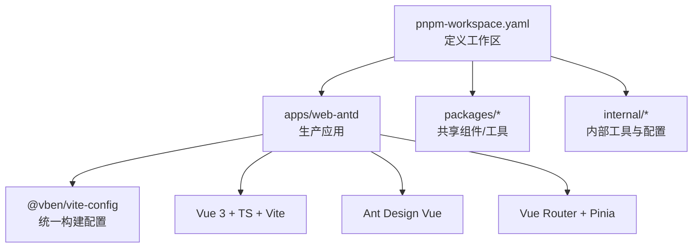
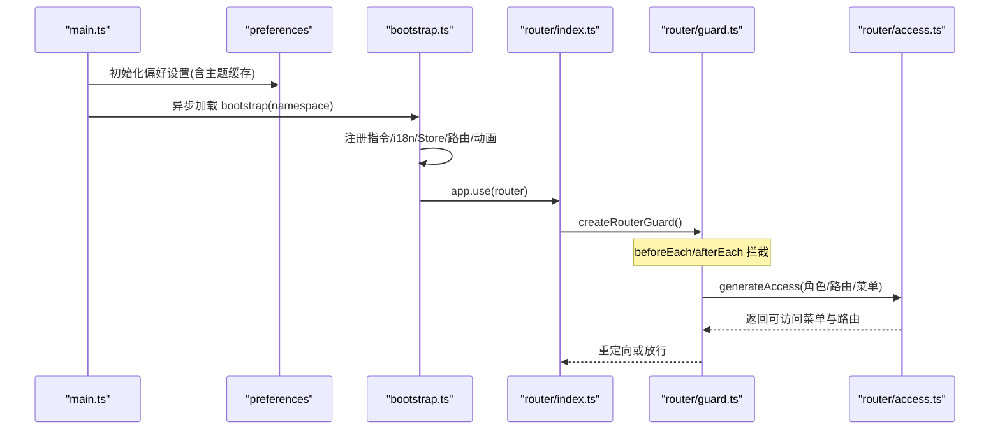
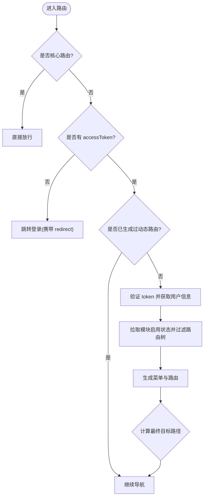
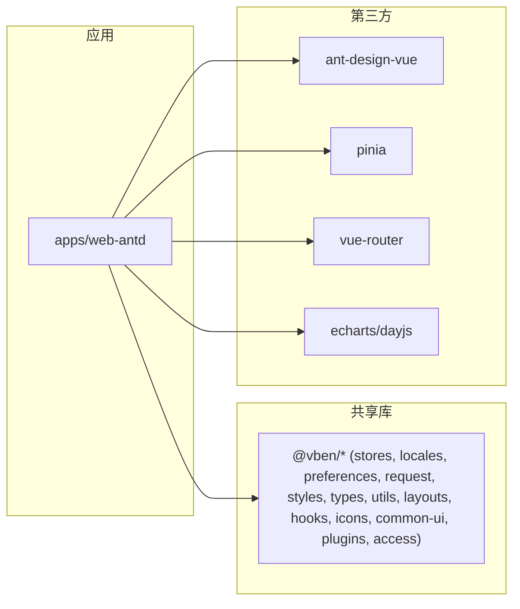

# 前端架构

<cite>
**本文引用的文件**
- [frontend/package.json](file://frontend/package.json)
- [frontend/pnpm-workspace.yaml](file://frontend/pnpm-workspace.yaml)
- [apps/web-antd/package.json](file://apps/web-antd/package.json)
- [apps/web-antd/vite.config.ts](file://apps/web-antd/vite.config.ts)
- [apps/web-antd/src/main.ts](file://apps/web-antd/src/main.ts)
- [apps/web-antd/src/app.vue](file://apps/web-antd/src/app.vue)
- [apps/web-antd/src/bootstrap.ts](file://apps/web-antd/src/bootstrap.ts)
- [apps/web-antd/src/router/index.ts](file://apps/web-antd/src/router/index.ts)
- [apps/web-antd/src/router/guard.ts](file://apps/web-antd/src/router/guard.ts)
- [apps/web-antd/src/router/access.ts](file://apps/web-antd/src/router/access.ts)
- [apps/web-antd/src/store/index.ts](file://apps/web-antd/src/store/index.ts)
- [internal/vite-config/src/config/application.ts](file://internal/vite-config/src/config/application.ts)
- [internal/vite-config/src/plugins/index.ts](file://internal/vite-config/src/plugins/index.ts)
</cite>

## 目录
1. [简介](#简介)
2. [项目结构](#项目结构)
3. [核心组件](#核心组件)
4. [架构总览](#架构总览)
5. [详细组件分析](#详细组件分析)
6. [依赖关系分析](#依赖关系分析)
7. [性能与构建优化](#性能与构建优化)
8. [开发规范、代码风格与测试策略](#开发规范代码风格与测试策略)
9. [部署流程](#部署流程)
10. [故障排查指南](#故障排查指南)
11. [结论](#结论)

## 简介
本项目采用 Vue 3 + TypeScript + Vite 技术栈，基于 monorepo 组织方式，生产应用位于 apps/web-antd，共享能力沉淀在 packages 与 internal 中。整体方案强调：模块化路由与权限守卫、Pinia 状态管理、Ant Design Vue 主题定制、Vite 插件化构建与资源优化，以及完善的开发与测试流程。

## 项目结构
- Monorepo 根使用 pnpm workspace 统一管理多包，包含 apps（应用）、packages（业务/通用库）、internal（内部工具与配置）等。
- 生产应用 @vben/web-antd 基于 Vite 构建，集成 Ant Design Vue、Vue Router、Pinia、国际化与偏好设置。
- 内部 vite-config 提供统一的 Vite 应用配置与插件集合，便于各应用复用。

**图表来源**
- [frontend/pnpm-workspace.yaml:1-15](file://frontend/pnpm-workspace.yaml#L1-L15)
- [apps/web-antd/package.json:33-56](file://apps/web-antd/package.json#L33-L56)
- [internal/vite-config/src/config/application.ts](file://internal/vite-config/src/config/application.ts)

**章节来源**
- [frontend/package.json:27-59](file://frontend/package.json#L27-L59)
- [frontend/pnpm-workspace.yaml:1-15](file://frontend/pnpm-workspace.yaml#L1-L15)
- [apps/web-antd/package.json:1-69](file://apps/web-antd/package.json#L1-L69)

## 核心组件
- 应用入口与初始化：main.ts 负责偏好设置初始化与延迟加载 bootstrap；bootstrap.ts 完成 i18n、Store、指令、路由、动画等全局装配。
- UI 壳层：app.vue 通过 ConfigProvider 注入 Ant Design Vue 主题与语言，支持明暗模式与紧凑模式。
- 路由系统：router/index.ts 创建实例并挂载守卫；guard.ts 实现进度条、登录态校验、动态菜单与路由生成；access.ts 负责菜单/路由生成与懒加载映射。
- 状态管理：store/index.ts 导出 auth store；结合 @vben/stores 提供的 useAccessStore/useUserStore 进行鉴权与用户信息同步。

**章节来源**
- [apps/web-antd/src/main.ts:9-50](file://apps/web-antd/src/main.ts#L9-L50)
- [apps/web-antd/src/bootstrap.ts:22-90](file://apps/web-antd/src/bootstrap.ts#L22-L90)
- [apps/web-antd/src/app.vue:1-40](file://apps/web-antd/src/app.vue#L1-L40)
- [apps/web-antd/src/router/index.ts:1-38](file://apps/web-antd/src/router/index.ts#L1-L38)
- [apps/web-antd/src/router/guard.ts:18-153](file://apps/web-antd/src/router/guard.ts#L18-L153)
- [apps/web-antd/src/router/access.ts:17-43](file://apps/web-antd/src/router/access.ts#L17-L43)
- [apps/web-antd/src/store/index.ts:1-2](file://apps/web-antd/src/store/index.ts#L1-L2)

## 架构总览
应用启动后，先初始化偏好设置与主题缓存，再异步加载 bootstrap 完成全局能力装配（i18n、Store、指令、路由、动画），最后挂载到 DOM。路由守卫在每次导航时执行进度条控制、登录态校验、模块启用过滤与动态路由生成，确保“按需加载”和“权限可控”。

**图表来源**
- [apps/web-antd/src/main.ts:9-50](file://apps/web-antd/src/main.ts#L9-L50)
- [apps/web-antd/src/bootstrap.ts:22-90](file://apps/web-antd/src/bootstrap.ts#L22-L90)
- [apps/web-antd/src/router/index.ts:15-35](file://apps/web-antd/src/router/index.ts#L15-L35)
- [apps/web-antd/src/router/guard.ts:48-139](file://apps/web-antd/src/router/guard.ts#L48-L139)
- [apps/web-antd/src/router/access.ts:17-43](file://apps/web-antd/src/router/access.ts#L17-L43)

## 详细组件分析

### 路由与权限体系
- 模块化路由：routes/modules 下按功能域拆分路由，配合 access.ts 的 pageMap 懒加载 views/**/*.vue。
- 权限守卫：guard.ts 在 beforeEach 中检查 accessToken、调用后端获取用户信息、拉取模块启用状态、生成菜单与路由，并在必要时重定向至登录页或默认首页。
- 懒加载机制：通过 import.meta.glob 与动态 import 实现页面级与布局级组件的按需加载。

**图表来源**
- [apps/web-antd/src/router/guard.ts:48-139](file://apps/web-antd/src/router/guard.ts#L48-L139)
- [apps/web-antd/src/router/access.ts:17-43](file://apps/web-antd/src/router/access.ts#L17-L43)

**章节来源**
- [apps/web-antd/src/router/index.ts:15-35](file://apps/web-antd/src/router/index.ts#L15-L35)
- [apps/web-antd/src/router/guard.ts:18-153](file://apps/web-antd/src/router/guard.ts#L18-L153)
- [apps/web-antd/src/router/access.ts:17-43](file://apps/web-antd/src/router/access.ts#L17-L43)

### 状态管理与组件通信
- 使用 Pinia Store（@vben/stores）集中管理用户信息与访问令牌，配合 useAccessStore/useUserStore 在路由守卫与业务组件中读取/更新。
- 组件间通信：优先通过 Store 与 Props/Events；复杂场景可使用 provide/inject 或事件总线（由框架封装）。
- 全局状态同步：偏好设置（主题、语言、紧凑模式）通过 preferences 持久化并在应用启动时恢复。

**章节来源**
- [apps/web-antd/src/bootstrap.ts:60-67](file://apps/web-antd/src/bootstrap.ts#L60-L67)
- [apps/web-antd/src/router/guard.ts:48-139](file://apps/web-antd/src/router/guard.ts#L48-L139)
- [apps/web-antd/src/app.vue:13-30](file://apps/web-antd/src/app.vue#L13-L30)

### UI 组件体系与主题定制
- Ant Design Vue 集成：通过 ConfigProvider 注入 locale 与 theme，支持 dark/light 算法与紧凑模式。
- 自定义组件：业务组件位于 src/components，遵循命名空间与目录划分；表单适配通过 adapter/form.ts 与 vben-form 集成。
- 主题定制：useAntdDesignTokens 与 preferences 联动，运行时切换主题与 token。

**章节来源**
- [apps/web-antd/src/app.vue:1-40](file://apps/web-antd/src/app.vue#L1-L40)
- [apps/web-antd/src/bootstrap.ts:22-28](file://apps/web-antd/src/bootstrap.ts#L22-L28)

### 构建与插件
- Vite 应用配置：apps/web-antd/vite.config.ts 通过 @vben/vite-config 的 defineConfig 扩展，配置开发代理指向后端服务。
- 统一构建能力：internal/vite-config 提供 application/library 配置模板与插件集合（如注入元数据、Tailwind 引用、打包体积分析等）。

**章节来源**
- [apps/web-antd/vite.config.ts:1-24](file://apps/web-antd/vite.config.ts#L1-L24)
- [internal/vite-config/src/config/application.ts](file://internal/vite-config/src/config/application.ts)
- [internal/vite-config/src/plugins/index.ts](file://internal/vite-config/src/plugins/index.ts)

## 依赖关系分析
- 应用依赖：@vben/* 系列包（stores、locales、preferences、request、styles、types、utils、layouts、hooks、icons、common-ui、plugins、access）与 ant-design-vue、pinia、vue-router、echarts、dayjs 等。
- 工作区管理：pnpm-workspace.yaml 将 apps、packages、internal、scripts、docs、playground 纳入同一工作区，统一版本与依赖解析。

**图表来源**
- [apps/web-antd/package.json:33-56](file://apps/web-antd/package.json#L33-L56)
- [frontend/pnpm-workspace.yaml:1-15](file://frontend/pnpm-workspace.yaml#L1-L15)

**章节来源**
- [apps/web-antd/package.json:33-56](file://apps/web-antd/package.json#L33-L56)
- [frontend/pnpm-workspace.yaml:1-15](file://frontend/pnpm-workspace.yaml#L1-L15)

## 性能与构建优化
- 懒加载：路由与布局组件通过 import.meta.glob 与动态 import 实现按需加载，减少首屏体积。
- 代码分割：Vite 默认按 chunk 分割，结合路由与组件懒加载进一步降低主包大小。
- 资源优化：可通过 internal/vite-config 的插件集启用压缩、PWA、体积分析等（根据实际启用情况）。
- 开发体验：dev server 代理后端 API，避免跨域问题；支持热更新与调试工具。

[本节为通用指导，不直接分析具体文件]

## 开发规范、代码风格与测试策略
- 代码规范：ESLint/Oxlint/Stylelint 规则由 internal/lint-configs 提供，统一团队风格。
- 提交规范：commitlint 与 lefthook 保障提交质量。
- 测试策略：单元测试使用 Vitest；E2E 使用 Playwright（apps/web-antd/__tests__/e2e 与 e2e 目录）。
- 类型检查：vue-tsc 进行类型校验，确保 TS 类型安全。

**章节来源**
- [frontend/package.json:36-59](file://frontend/package.json#L36-L59)
- [apps/web-antd/package.json:18-29](file://apps/web-antd/package.json#L18-L29)

## 部署流程
- 构建命令：pnpm build 触发 Turbo 并行构建；@vben/web-antd 单独构建使用 pnpm -F @vben/web-antd run build。
- 预览与发布：支持 preview 本地预览产物；Docker 镜像构建脚本位于 scripts/deploy。
- 环境变量：VITE_ROUTER_HISTORY、VITE_BASE、VITE_SENTRY_DSN、VITE_APP_VERSION、VITE_APP_NAMESPACE 等影响运行行为。

**章节来源**
- [frontend/package.json:27-59](file://frontend/package.json#L27-L59)
- [apps/web-antd/package.json:18-29](file://apps/web-antd/package.json#L18-L29)
- [apps/web-antd/src/main.ts:11-14](file://apps/web-antd/src/main.ts#L11-L14)
- [apps/web-antd/src/bootstrap.ts:40-49](file://apps/web-antd/src/bootstrap.ts#L40-L49)

## 故障排查指南
- 登录态异常：若 token 无效或过期，guard.ts 会清空本地凭证并重定向至登录页；检查后端接口与网络代理。
- 路由白屏：确认路由守卫未误拦截；检查模块启用状态与菜单生成逻辑；查看浏览器控制台错误。
- 主题不生效：确认 preferences 初始化顺序与主题缓存读取；检查 ConfigProvider 的 theme 与 algorithm 是否正确传入。
- 代理失败：apps/web-antd/vite.config.ts 中代理 target 需与后端端口一致；注意 IPv4/IPv6 解析差异。

**章节来源**
- [apps/web-antd/src/router/guard.ts:94-107](file://apps/web-antd/src/router/guard.ts#L94-L107)
- [apps/web-antd/src/router/guard.ts:48-139](file://apps/web-antd/src/router/guard.ts#L48-L139)
- [apps/web-antd/src/app.vue:16-30](file://apps/web-antd/src/app.vue#L16-L30)
- [apps/web-antd/vite.config.ts:6-21](file://apps/web-antd/vite.config.ts#L6-L21)

## 结论
本前端架构以 Vue 3 + TypeScript + Vite 为核心，借助 monorepo 将应用、共享库与内部工具解耦，形成高内聚低耦合的工程体系。通过模块化路由与权限守卫、Pinia 状态管理、Ant Design Vue 主题定制与 Vite 插件化构建，实现了良好的可维护性、可扩展性与性能表现。建议持续完善测试覆盖与监控上报，进一步提升稳定性与可观测性。