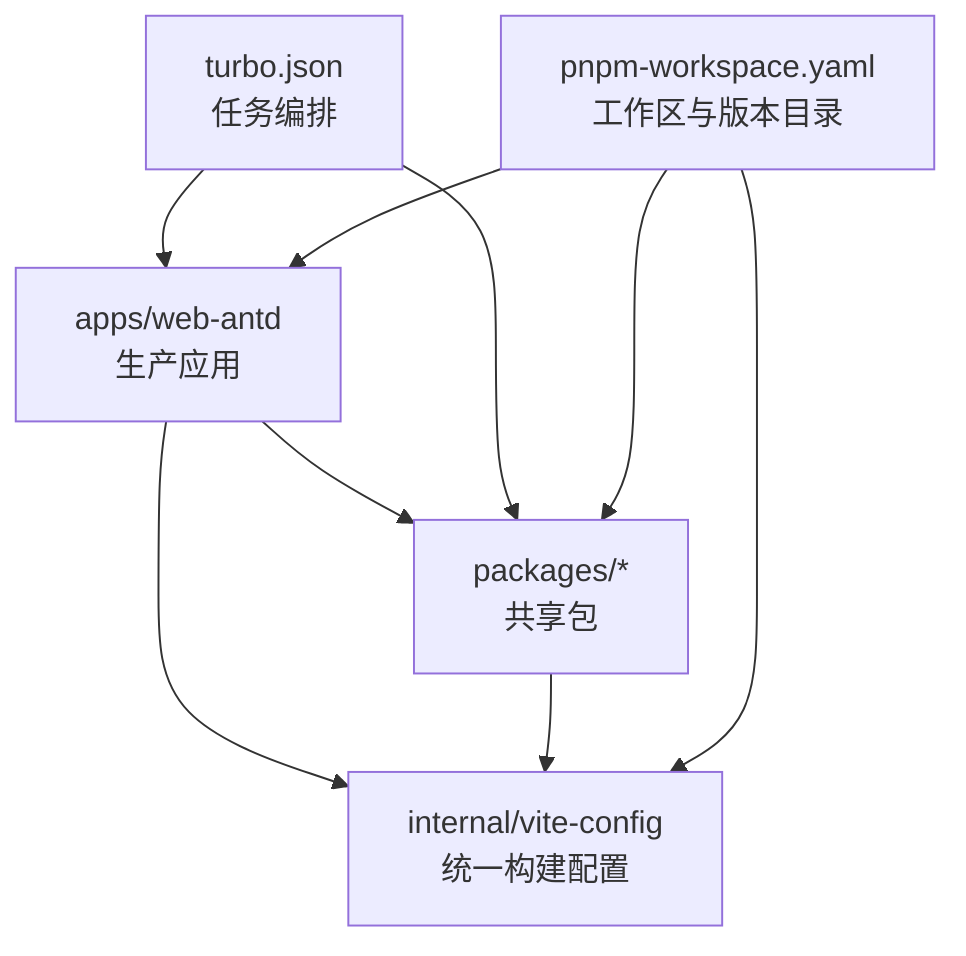
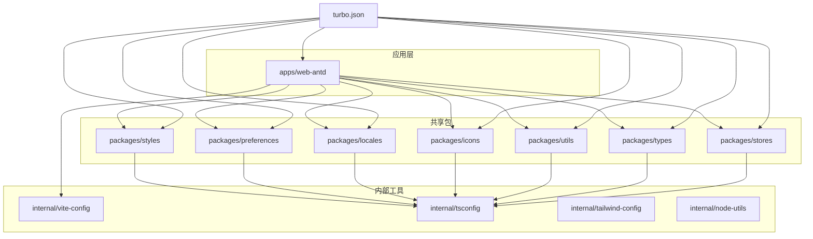
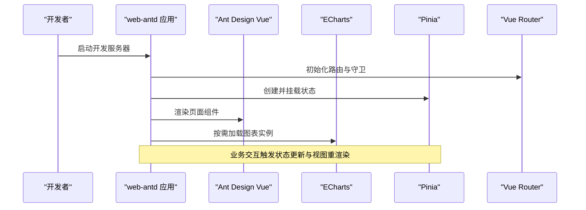
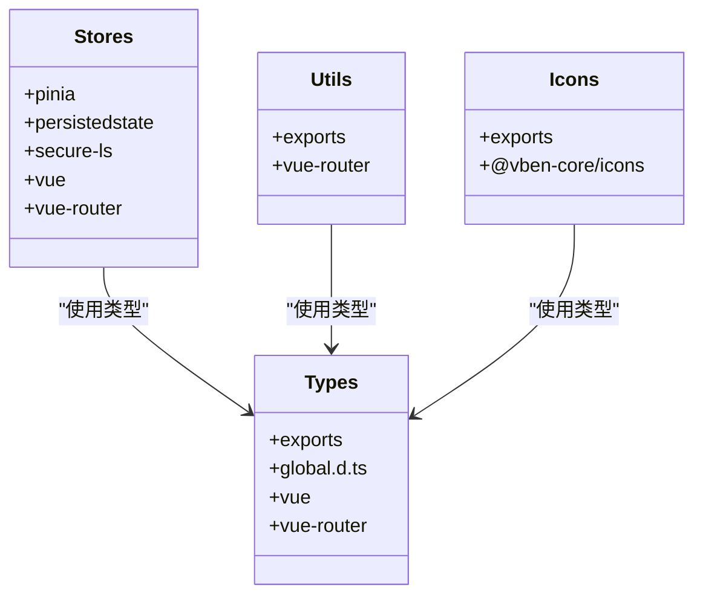
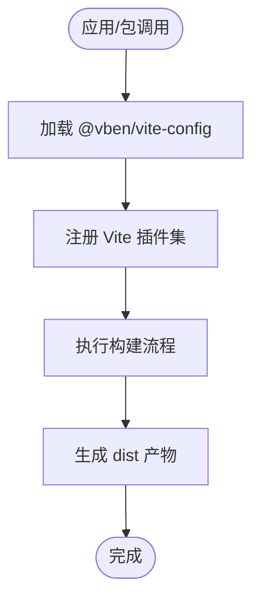
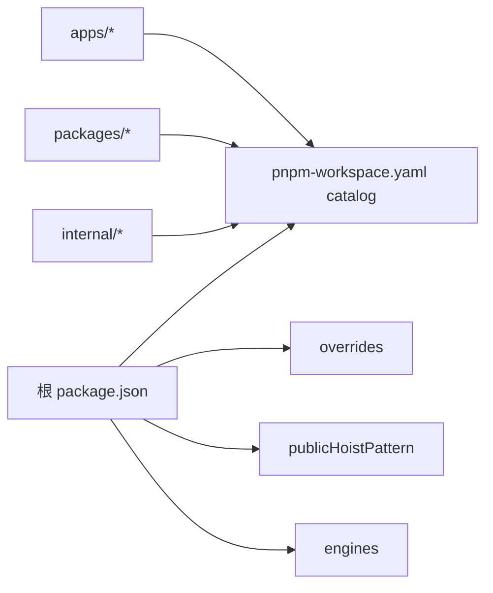
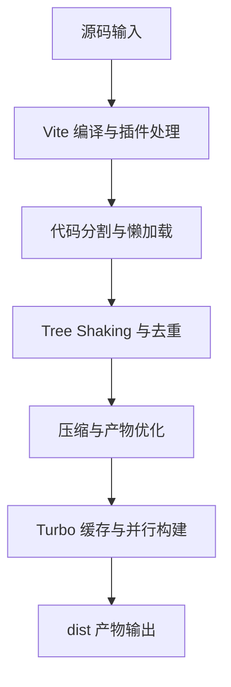
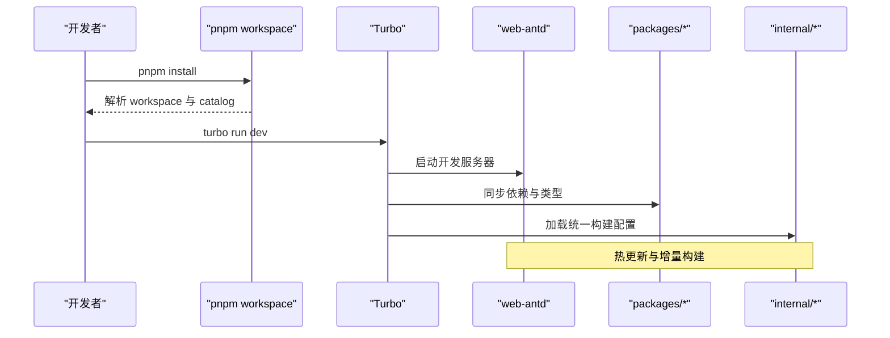

# 技术栈概览

<cite>
**本文引用的文件**
- [frontend/package.json](file://frontend/package.json)
- [frontend/pnpm-workspace.yaml](file://frontend/pnpm-workspace.yaml)
- [frontend/apps/web-antd/package.json](file://frontend/apps/web-antd/package.json)
- [frontend/turbo.json](file://frontend/turbo.json)
- [frontend/internal/vite-config/package.json](file://frontend/internal/vite-config/package.json)
- [frontend/packages/stores/package.json](file://frontend/packages/stores/package.json)
- [frontend/packages/types/package.json](file://frontend/packages/types/package.json)
- [frontend/packages/utils/package.json](file://frontend/packages/utils/package.json)
- [frontend/packages/icons/package.json](file://frontend/packages/icons/package.json)
</cite>

## 目录
1. [简介](#简介)
2. [项目结构](#项目结构)
3. [核心组件](#核心组件)
4. [架构总览](#架构总览)
5. [详细组件分析](#详细组件分析)
6. [依赖关系分析](#依赖关系分析)
7. [性能与构建优化](#性能与构建优化)
8. [环境配置与开发工作流](#环境配置与开发工作流)
9. [故障排查指南](#故障排查指南)
10. [结论](#结论)

## 简介
本概览面向前端工程，聚焦 Vue 3 + TypeScript + Vite 的技术选型、版本兼容性与 monorepo 架构策略。仓库采用 pnpm workspace + Turbo 的 monorepo 组织方式：apps/web-antd 为生产应用，packages 提供共享组件库与通用能力，internal 封装内部工具与构建配置。关键依赖包括 Ant Design Vue（UI）、ECharts（可视化）、Pinia（状态管理）、Vue Router（路由）。开发工具链包含 ESLint/Oxlint/Stylelint/Prettier（代码规范）、Vitest（单元测试）、Playwright（端到端测试）。构建优化涵盖代码分割、Tree Shaking、资源压缩等。文档同时给出环境配置与开发工作流说明，帮助团队高效协作与持续交付。

## 项目结构
- apps/web-antd：生产级 Web 应用，基于 Ant Design Vue 构建业务界面，集成 ECharts、Pinia、Vue Router 等。
- packages/*：可复用的业务与基础包，如 stores、types、utils、icons、locales、preferences、styles 等，通过 workspace:* 引用，便于跨应用复用与独立发布。
- internal/*：内部工具与统一配置，如 vite-config、tsconfig、tailwind-config、node-utils 等，集中管理构建、类型与样式配置，保证多包一致性。
- docs/playground：文档站点与示例应用，用于演示与验证。
- e2e：基于 Playwright 的端到端测试套件。
- turbo.json：Turbo 任务编排，定义 build、preview、dev、typecheck 等任务的依赖与缓存策略。
- pnpm-workspace.yaml：workspace 包声明、公共提升规则、版本目录 catalog 与覆盖策略。

图表来源
- [frontend/turbo.json:15-46](file://frontend/turbo.json#L15-L46)
- [frontend/pnpm-workspace.yaml:1-14](file://frontend/pnpm-workspace.yaml#L1-L14)
- [frontend/internal/vite-config/package.json:1-61](file://frontend/internal/vite-config/package.json#L1-L61)

章节来源
- [frontend/turbo.json:15-46](file://frontend/turbo.json#L15-L46)
- [frontend/pnpm-workspace.yaml:1-14](file://frontend/pnpm-workspace.yaml#L1-L14)

## 核心组件
- 运行时框架
  - Vue 3：响应式与组合式 API，生态成熟，与 Vite 深度集成。
  - TypeScript：强类型约束，提升大型项目可维护性。
  - Vite：极速 HMR 与现代化构建管线，支持插件生态。
- UI 与可视化
  - Ant Design Vue：企业级 UI 组件库，主题与国际化完善。
  - ECharts：丰富的数据可视化图表能力。
- 状态与路由
  - Pinia：轻量、类型友好的状态管理，配合持久化插件。
  - Vue Router：声明式路由与导航守卫，适配 SPA 场景。
- 质量与测试
  - ESLint/Oxlint/Stylelint/Prettier：代码风格与静态检查。
  - Vitest：快速单元测试，支持 DOM 模拟与覆盖率。
  - Playwright：跨浏览器 E2E 测试与视觉回归。

章节来源
- [frontend/package.json:27-59](file://frontend/package.json#L27-L59)
- [frontend/pnpm-workspace.yaml:31-225](file://frontend/pnpm-workspace.yaml#L31-L225)
- [frontend/apps/web-antd/package.json:33-67](file://frontend/apps/web-antd/package.json#L33-L67)

## 架构总览
monorepo 以“应用-包-内部工具”分层组织，Turbo 负责任务编排与增量缓存，pnpm workspace 统一管理依赖与版本目录。应用层消费共享包，内部工具提供统一的构建、类型与样式配置，确保一致性与可维护性。

图表来源
- [frontend/turbo.json:15-46](file://frontend/turbo.json#L15-L46)
- [frontend/pnpm-workspace.yaml:1-14](file://frontend/pnpm-workspace.yaml#L1-L14)
- [frontend/internal/vite-config/package.json:1-61](file://frontend/internal/vite-config/package.json#L1-L61)

## 详细组件分析

### 应用：apps/web-antd
- 职责：聚合业务页面、路由、状态、API 请求与第三方库，输出生产产物。
- 关键依赖：Ant Design Vue、ECharts、Pinia、Vue Router、Vue 3。
- 脚本：提供 dev/build/preview/test/e2e/typecheck 等命令，便于本地开发与 CI。

图表来源
- [frontend/apps/web-antd/package.json:18-28](file://frontend/apps/web-antd/package.json#L18-L28)
- [frontend/apps/web-antd/package.json:33-55](file://frontend/apps/web-antd/package.json#L33-L55)

章节来源
- [frontend/apps/web-antd/package.json:18-28](file://frontend/apps/web-antd/package.json#L18-L28)
- [frontend/apps/web-antd/package.json:33-55](file://frontend/apps/web-antd/package.json#L33-L55)

### 共享包：stores/types/utils/icons
- @vben/stores：封装 Pinia store 与持久化策略，依赖 pinia、pinia-plugin-persistedstate、vue-router。
- @vben/types：集中类型定义，导出 types 入口，供各包引用。
- @vben/utils：通用工具函数与路由辅助，依赖 vue-router。
- @vben/icons：图标聚合与导出，依赖内部图标源。

图表来源
- [frontend/packages/stores/package.json:16-31](file://frontend/packages/stores/package.json#L16-L31)
- [frontend/packages/types/package.json:13-26](file://frontend/packages/types/package.json#L13-L26)
- [frontend/packages/utils/package.json:16-26](file://frontend/packages/utils/package.json#L16-L26)
- [frontend/packages/icons/package.json:13-21](file://frontend/packages/icons/package.json#L13-L21)

章节来源
- [frontend/packages/stores/package.json:16-31](file://frontend/packages/stores/package.json#L16-L31)
- [frontend/packages/types/package.json:13-26](file://frontend/packages/types/package.json#L13-L26)
- [frontend/packages/utils/package.json:16-26](file://frontend/packages/utils/package.json#L16-L26)
- [frontend/packages/icons/package.json:13-21](file://frontend/packages/icons/package.json#L13-L21)

### 内部工具：vite-config
- 职责：统一 Vite 构建配置、插件集成与打包产物处理，对外暴露模块入口。
- 关键插件：Tailwind CSS、PWA、Vue DevTools、压缩与可视化等。
- 作用：为所有应用与包提供一致的构建体验与优化策略。

图表来源
- [frontend/internal/vite-config/package.json:17-41](file://frontend/internal/vite-config/package.json#L17-L41)
- [frontend/internal/vite-config/package.json:43-59](file://frontend/internal/vite-config/package.json#L43-L59)

章节来源
- [frontend/internal/vite-config/package.json:17-41](file://frontend/internal/vite-config/package.json#L17-L41)
- [frontend/internal/vite-config/package.json:43-59](file://frontend/internal/vite-config/package.json#L43-L59)

## 依赖关系分析
- 版本目录 catalog：在 pnpm-workspace.yaml 中集中声明依赖版本，避免版本漂移与冲突。
- 公共提升 publicHoistPattern：将 lint、postcss、commitlint 等工具提升到根节点，减少重复安装。
- 覆盖 overrides：对特定依赖进行版本覆盖，保障兼容性。
- 引擎要求 engines：限定 Node 与 pnpm 版本，确保运行环境一致。

图表来源
- [frontend/package.json:97-101](file://frontend/package.json#L97-L101)
- [frontend/pnpm-workspace.yaml:16-39](file://frontend/pnpm-workspace.yaml#L16-L39)
- [frontend/pnpm-workspace.yaml:31-225](file://frontend/pnpm-workspace.yaml#L31-L225)

章节来源
- [frontend/package.json:97-101](file://frontend/package.json#L97-L101)
- [frontend/pnpm-workspace.yaml:16-39](file://frontend/pnpm-workspace.yaml#L16-L39)
- [frontend/pnpm-workspace.yaml:31-225](file://frontend/pnpm-workspace.yaml#L31-L225)

## 性能与构建优化
- 代码分割与按需加载
  - 通过 Vite 插件与分包策略实现路由与组件级懒加载，降低首屏体积。
- Tree Shaking
  - 启用 ES Module 与 sideEffects 标记，移除未使用代码；共享包通过 exports 字段明确入口，利于摇树。
- 资源压缩
  - 使用 html-minifier-terser、vite-plugin-compression 等进行 HTML/JS/CSS 压缩与 gzip/brotli 压缩。
- 构建分析与调试
  - 使用 rollup-plugin-visualizer 分析包体积与依赖关系，定位冗余依赖。
- 增量构建与缓存
  - Turbo 根据任务输出与依赖图进行增量构建与缓存，显著提升多包构建速度。

图表来源
- [frontend/internal/vite-config/package.json:29-59](file://frontend/internal/vite-config/package.json#L29-L59)
- [frontend/turbo.json:15-46](file://frontend/turbo.json#L15-L46)

章节来源
- [frontend/internal/vite-config/package.json:29-59](file://frontend/internal/vite-config/package.json#L29-L59)
- [frontend/turbo.json:15-46](file://frontend/turbo.json#L15-L46)

## 环境配置与开发工作流
- 环境要求
  - Node.js 与 pnpm 版本由根 package.json 的 engines 指定，确保团队与环境一致。
- 工作区与依赖管理
  - pnpm workspace 声明包范围，catalog 集中管理版本，overrides 解决冲突，publicHoistPattern 提升工具包。
- 任务编排
  - Turbo 定义 build、preview、dev、typecheck、test:e2e 等任务，支持依赖顺序与缓存。
- 开发脚本
  - 根脚本提供 bootstrap、build、dev、test:unit、test:e2e、format、lint、check 等命令，统一工作流。
  - 应用脚本提供 dev/build/preview/test/e2e/typecheck，便于单包迭代。
- 代码质量
  - ESLint/Oxlint/Stylelint/Prettier 统一代码风格与静态检查，lefthook 在提交前执行钩子。
- 测试体系
  - Vitest 用于单元测试，支持 DOM 模拟与覆盖率；Playwright 用于端到端测试与视觉回归。

图表来源
- [frontend/package.json:27-59](file://frontend/package.json#L27-L59)
- [frontend/turbo.json:15-46](file://frontend/turbo.json#L15-L46)
- [frontend/pnpm-workspace.yaml:1-14](file://frontend/pnpm-workspace.yaml#L1-L14)

章节来源
- [frontend/package.json:27-59](file://frontend/package.json#L27-L59)
- [frontend/turbo.json:15-46](file://frontend/turbo.json#L15-L46)
- [frontend/pnpm-workspace.yaml:1-14](file://frontend/pnpm-workspace.yaml#L1-L14)

## 故障排查指南
- 依赖冲突或版本不一致
  - 检查 pnpm-workspace.yaml 的 catalog 与 overrides 是否覆盖到冲突项；必要时调整版本。
- 构建失败或产物异常
  - 确认 internal/vite-config 的插件与压缩配置是否正确；使用 analyze 模式查看体积与依赖。
- 类型检查错误
  - 使用 typecheck 任务定位类型问题；确保 packages/types 的导出与全局类型声明正确。
- 测试失败
  - 单元测试：检查 vitest 配置与 DOM 模拟环境；E2E：确认浏览器驱动与基线截图。
- 性能问题
  - 使用 visualizer 分析包体积；结合代码分割与懒加载优化首屏；审查 Tree Shaking 效果。

章节来源
- [frontend/internal/vite-config/package.json:29-59](file://frontend/internal/vite-config/package.json#L29-L59)
- [frontend/package.json:27-59](file://frontend/package.json#L27-L59)
- [frontend/turbo.json:15-46](file://frontend/turbo.json#L15-L46)

## 结论
本项目以 Vue 3 + TypeScript + Vite 为核心，结合 Ant Design Vue、ECharts、Pinia、Vue Router 构建了高性能、可维护的前端工程。通过 pnpm workspace 与 Turbo 的 monorepo 架构，实现了应用、共享包与内部工具的清晰分离与高效协作。借助完善的代码质量与测试体系，以及构建优化策略，保障了项目的长期演进与交付效率。建议持续跟踪依赖版本与构建配置，定期分析产物体积与性能指标，保持工程健康与稳定。