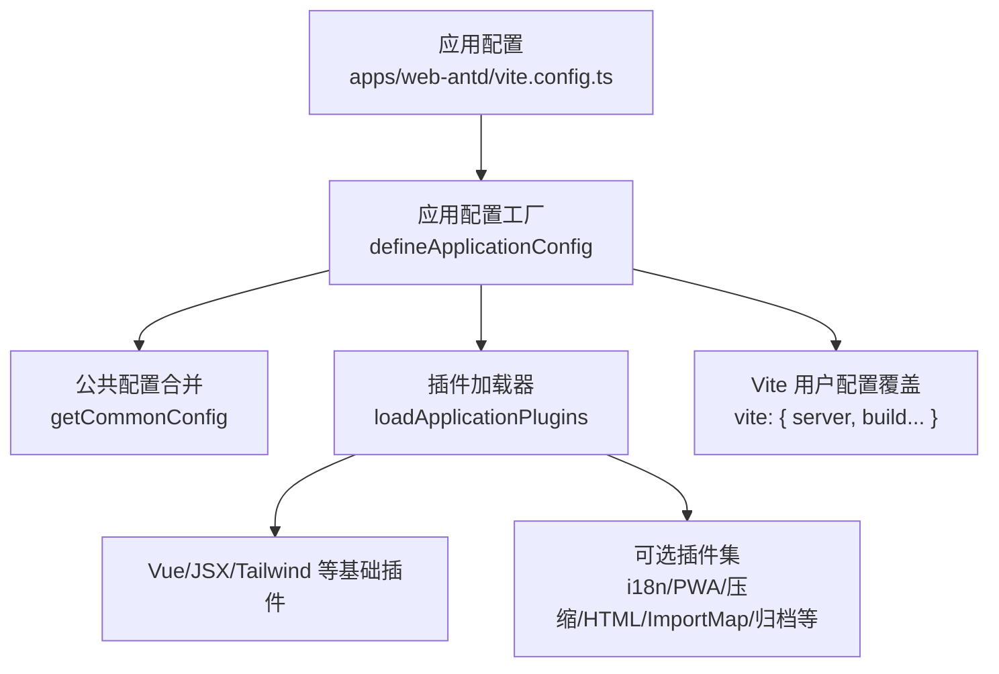
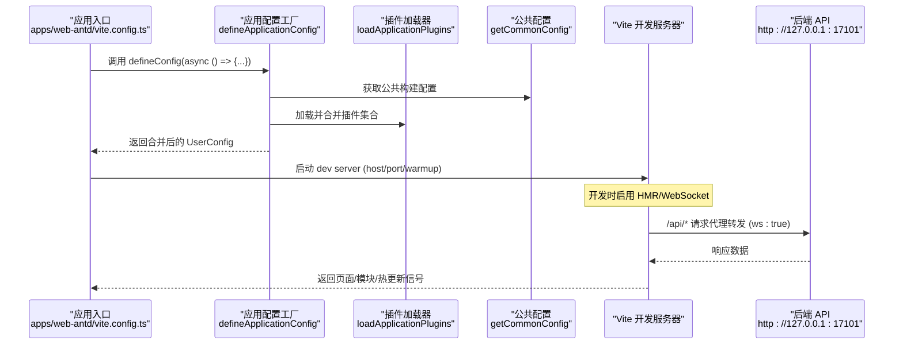
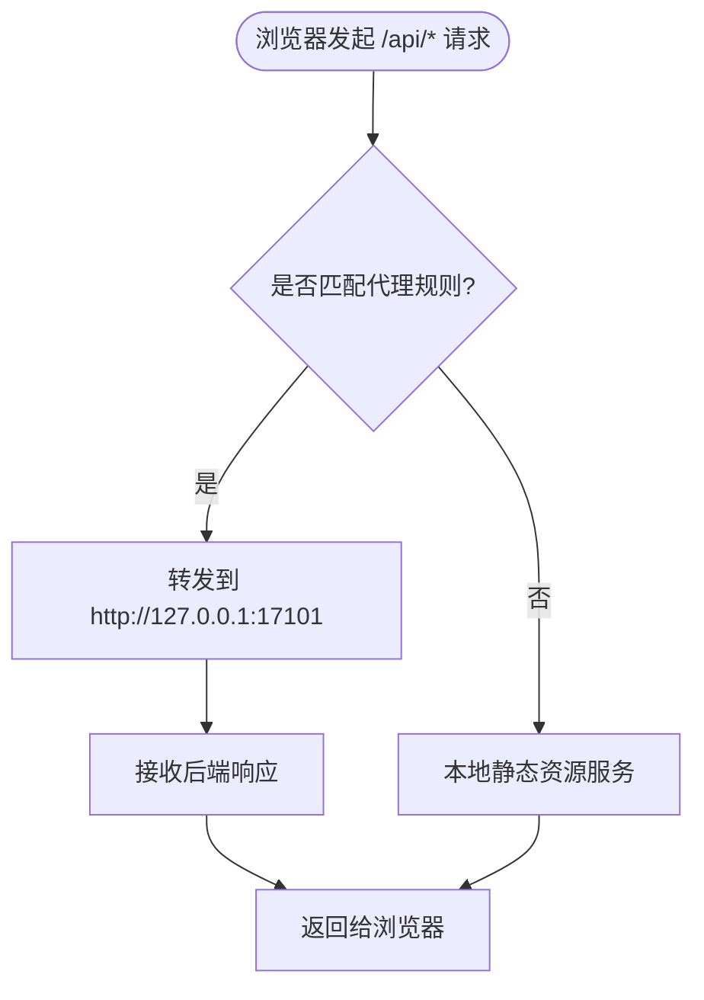
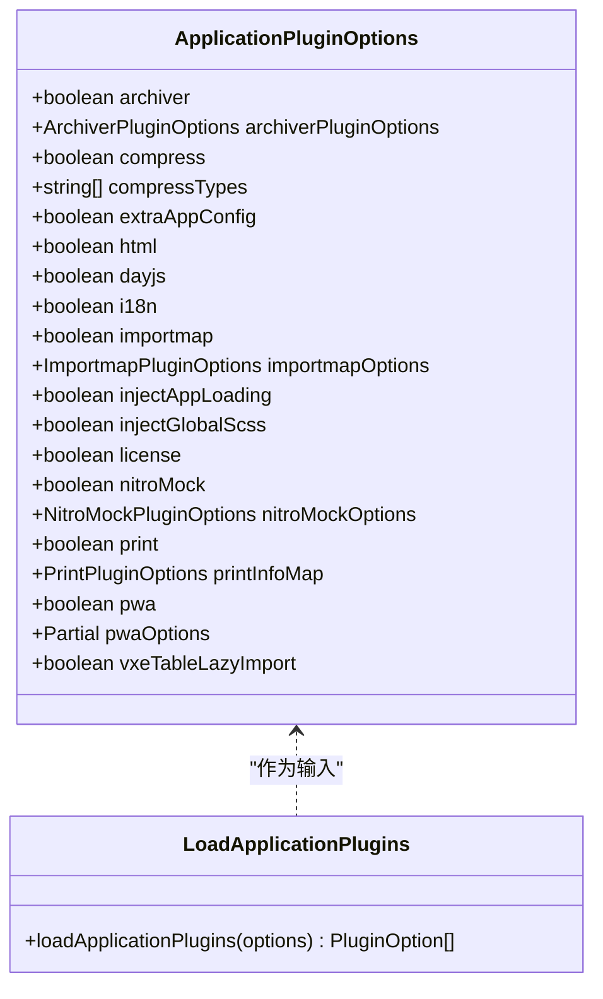
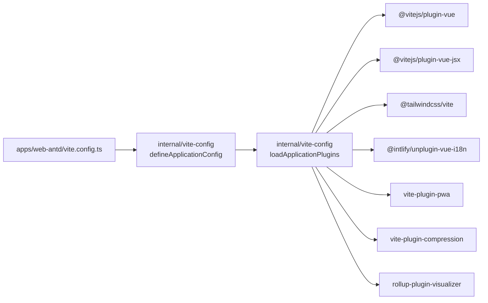

# Vite 构建配置

<cite>
**本文引用的文件**
- [frontend/apps/web-antd/vite.config.ts](file://frontend/apps/web-antd/vite.config.ts)
- [frontend/internal/vite-config/src/config/application.ts](file://frontend/internal/vite-config/src/config/application.ts)
- [frontend/internal/vite-config/src/plugins/index.ts](file://frontend/internal/vite-config/src/plugins/index.ts)
- [frontend/internal/vite-config/src/options.ts](file://frontend/internal/vite-config/src/options.ts)
- [frontend/internal/vite-config/src/typing.ts](file://frontend/internal/vite-config/src/typing.ts)
- [frontend/internal/vite-config/src/config/common.ts](file://frontend/internal/vite-config/src/config/common.ts)
</cite>

## 目录
1. [简介](#简介)
2. [项目结构](#项目结构)
3. [核心组件](#核心组件)
4. [架构总览](#架构总览)
5. [详细组件分析](#详细组件分析)
6. [依赖关系分析](#依赖关系分析)
7. [性能考量](#性能考量)
8. [故障排查指南](#故障排查指南)
9. [结论](#结论)
10. [附录](#附录)

## 简介
本技术文档聚焦于本项目基于 Vite 的构建与开发配置，围绕以下目标展开：
- 深入解释 Vite 核心配置选项：开发服务器设置、代理配置、热重载机制。
- 详细说明应用配置结构：application 配置项、vite 基础配置、插件集成方式。
- 阐述开发环境优化：端口配置、CORS 设置、WebSocket 支持、API 代理策略。
- 包含生产构建优化：代码压缩、资源优化、缓存策略、CDN 配置。
- 提供具体配置示例与最佳实践，解释每个配置项的作用和影响。

## 项目结构
本项目采用 monorepo 组织前端工程，Vite 配置由“应用层”和“内部共享配置包”共同构成：
- 应用层入口：apps/web-antd 下的 vite.config.ts 通过统一工厂函数 defineConfig 装配 application 与 vite 两段配置。
- 共享配置包：internal/vite-config 提供 defineApplicationConfig、插件加载器、默认选项与类型定义，集中管理通用能力（PWA、i18n、压缩、HTML 处理、元数据注入等）。

图表来源
- [frontend/apps/web-antd/vite.config.ts:1-24](file://frontend/apps/web-antd/vite.config.ts#L1-L24)
- [frontend/internal/vite-config/src/config/application.ts:17-98](file://frontend/internal/vite-config/src/config/application.ts#L17-L98)
- [frontend/internal/vite-config/src/plugins/index.ts:95-228](file://frontend/internal/vite-config/src/plugins/index.ts#L95-L228)
- [frontend/internal/vite-config/src/config/common.ts:3-11](file://frontend/internal/vite-config/src/config/common.ts#L3-L11)

章节来源
- [frontend/apps/web-antd/vite.config.ts:1-24](file://frontend/apps/web-antd/vite.config.ts#L1-L24)
- [frontend/internal/vite-config/src/config/application.ts:17-98](file://frontend/internal/vite-config/src/config/application.ts#L17-L98)
- [frontend/internal/vite-config/src/plugins/index.ts:95-228](file://frontend/internal/vite-config/src/plugins/index.ts#L95-L228)
- [frontend/internal/vite-config/src/config/common.ts:3-11](file://frontend/internal/vite-config/src/config/common.ts#L3-L11)

## 核心组件
- 应用配置工厂 defineApplicationConfig
  - 负责读取环境变量、合并 application 与 vite 配置、加载插件、生成默认构建与开发服务器行为。
  - 关键职责包括：base、build.target、CSS 预处理、server.host/port/warmup、plugins 组装。
- 插件加载器 loadApplicationPlugins
  - 根据条件开关按需启用 Vue、JSX、Tailwind、i18n、PWA、压缩、HTML 处理、ImportMap、归档、打印、Nitro Mock、VXE Table 懒加载等。
- 默认选项与类型
  - options.ts 提供 PWA manifest 默认值与 ImportMap CDN 默认供应商。
  - typing.ts 定义 ApplicationPluginOptions、ImportmapPluginOptions 等类型，约束可配置项。
- 公共配置 getCommonConfig
  - 统一关闭 sourcemap、限制 chunkSizeWarningLimit、关闭 reportCompressedSize 等通用构建参数。

章节来源
- [frontend/internal/vite-config/src/config/application.ts:17-98](file://frontend/internal/vite-config/src/config/application.ts#L17-L98)
- [frontend/internal/vite-config/src/plugins/index.ts:95-228](file://frontend/internal/vite-config/src/plugins/index.ts#L95-L228)
- [frontend/internal/vite-config/src/options.ts:7-45](file://frontend/internal/vite-config/src/options.ts#L7-L45)
- [frontend/internal/vite-config/src/typing.ts:193-328](file://frontend/internal/vite-config/src/typing.ts#L193-L328)
- [frontend/internal/vite-config/src/config/common.ts:3-11](file://frontend/internal/vite-config/src/config/common.ts#L3-L11)

## 架构总览
下图展示了从应用入口到最终 Vite 配置的装配流程，以及开发服务器与后端 API 的代理关系。

图表来源
- [frontend/apps/web-antd/vite.config.ts:3-22](file://frontend/apps/web-antd/vite.config.ts#L3-L22)
- [frontend/internal/vite-config/src/config/application.ts:17-98](file://frontend/internal/vite-config/src/config/application.ts#L17-L98)
- [frontend/internal/vite-config/src/plugins/index.ts:95-228](file://frontend/internal/vite-config/src/plugins/index.ts#L95-L228)

## 详细组件分析

### 开发服务器与代理配置
- 端口与主机
  - 应用层通过 application 或环境变量传入 port；工厂层默认 host: true，便于局域网访问。
  - 预热 warmup.clientFiles 指定常用入口与视图，加速首次冷启动。
- 代理策略
  - 在 apps/web-antd/vite.config.ts 中，将 /api 前缀的请求代理至 http://127.0.0.1:17101，并开启 changeOrigin 与 ws 以支持 WebSocket。
  - 使用 127.0.0.1 而非 localhost，避免 Node.js v17+ IPv6 解析导致的代理冲突。
- CORS 设置
  - 当前仓库未显式配置 Vite 的 cors 选项；若需跨域，可在应用层的 vite.server 中补充 cors 配置。
- 热重载机制
  - Vite 默认启用 HMR；结合 server.ws: true 的代理，可实现后端接口与前端页面的实时联动。

图表来源
- [frontend/apps/web-antd/vite.config.ts:6-20](file://frontend/apps/web-antd/vite.config.ts#L6-L20)
- [frontend/internal/vite-config/src/config/application.ts:79-90](file://frontend/internal/vite-config/src/config/application.ts#L79-L90)

章节来源
- [frontend/apps/web-antd/vite.config.ts:6-20](file://frontend/apps/web-antd/vite.config.ts#L6-L20)
- [frontend/internal/vite-config/src/config/application.ts:79-90](file://frontend/internal/vite-config/src/config/application.ts#L79-L90)

### 应用配置结构与插件集成
- application 配置项
  - 通过 DefineApplicationOptions 暴露丰富的开关：archiver、compress/compressTypes、extraAppConfig、html、dayjs、i18n、importmap/importmapOptions、injectAppLoading、injectGlobalScss、license、nitroMock/nitroMockOptions、print/printInfoMap、pwa/pwaOptions、vxeTableLazyImport 等。
  - 这些开关在 loadApplicationPlugins 中被逐一判断并动态注册对应插件。
- vite 基础配置
  - base、build.target、build.rolldownOptions.output（文件名哈希、产物目录）、css.preprocessorOptions（全局 SCSS 注入）等由工厂层统一设定。
  - 公共配置 getCommonConfig 统一关闭 sourcemap、限制 chunk 告警阈值、关闭体积报告。
- 插件集成方式
  - 通过条件插件模式 ConditionPlugin，按 isBuild、devtools、visualizer 等条件决定是否加载。
  - 典型插件：@vitejs/plugin-vue、@vitejs/plugin-vue-jsx、@tailwindcss/vite、rollup-plugin-visualizer、unplugin-dts、vite-plugin-compression、vite-plugin-pwa、vite-plugin-vue-devtools、自定义 archiver/html/importmap/inject-app-loading/inject-metadata/license/nitro-mock/print/tailwind-reference/vxe-table 插件。

图表来源
- [frontend/internal/vite-config/src/typing.ts:193-328](file://frontend/internal/vite-config/src/typing.ts#L193-L328)
- [frontend/internal/vite-config/src/plugins/index.ts:95-228](file://frontend/internal/vite-config/src/plugins/index.ts#L95-L228)

章节来源
- [frontend/internal/vite-config/src/typing.ts:193-328](file://frontend/internal/vite-config/src/typing.ts#L193-L328)
- [frontend/internal/vite-config/src/plugins/index.ts:95-228](file://frontend/internal/vite-config/src/plugins/index.ts#L95-L228)
- [frontend/internal/vite-config/src/config/application.ts:17-98](file://frontend/internal/vite-config/src/config/application.ts#L17-L98)
- [frontend/internal/vite-config/src/config/common.ts:3-11](file://frontend/internal/vite-config/src/config/common.ts#L3-L11)

### 生产构建优化
- 代码压缩
  - 构建模式下启用 rolldownOptions.output.minify.compress.dropDebugger，移除调试语句。
  - 可选启用 vite-plugin-compression 生成 .br/.gz 预压缩文件（通过 compress/compressTypes 控制）。
- 资源优化
  - 输出文件名带 hash，利于浏览器缓存；chunkFileNames 与 entryFileNames 分离，提升缓存命中率。
  - CSS 全局 SCSS 注入，减少重复引入成本。
- 缓存策略
  - 利用文件名 hash 实现长期缓存；关闭 reportCompressedSize 以减少构建噪音。
- CDN 配置
  - 提供 ImportMap 插件与默认供应商 esm.sh，可按需在 isBuild 时启用 importmap/importmapOptions。
  - 当前默认未启用 ImportMap，以避免第三方包兼容性与网络稳定性问题。

章节来源
- [frontend/internal/vite-config/src/config/application.ts:58-76](file://frontend/internal/vite-config/src/config/application.ts#L58-L76)
- [frontend/internal/vite-config/src/plugins/index.ts:185-210](file://frontend/internal/vite-config/src/plugins/index.ts#L185-L210)
- [frontend/internal/vite-config/src/options.ts:28-45](file://frontend/internal/vite-config/src/options.ts#L28-L45)
- [frontend/internal/vite-config/src/config/common.ts:3-11](file://frontend/internal/vite-config/src/config/common.ts#L3-L11)

## 依赖关系分析
- 应用配置依赖
  - apps/web-antd/vite.config.ts 依赖 internal/vite-config 提供的 defineConfig 工厂与插件体系。
  - 工厂层依赖 @vben/node-utils、sass-embedded、vite 生态插件及自定义插件。
- 插件耦合与内聚
  - 插件加载器集中管理条件逻辑，降低各应用配置复杂度；通过 ApplicationPluginOptions 明确边界，提高内聚性。
- 外部依赖
  - Vue/JSX/Tailwind/i18n/PWA/压缩/可视化等插件均为运行时依赖，按需启用。

图表来源
- [frontend/apps/web-antd/vite.config.ts:1-24](file://frontend/apps/web-antd/vite.config.ts#L1-L24)
- [frontend/internal/vite-config/src/plugins/index.ts:1-31](file://frontend/internal/vite-config/src/plugins/index.ts#L1-L31)

章节来源
- [frontend/apps/web-antd/vite.config.ts:1-24](file://frontend/apps/web-antd/vite.config.ts#L1-L24)
- [frontend/internal/vite-config/src/plugins/index.ts:1-31](file://frontend/internal/vite-config/src/plugins/index.ts#L1-L31)

## 性能考量
- 构建阶段
  - 关闭 sourcemap 与体积报告，减少构建开销。
  - 限制 chunkSizeWarningLimit 为 2000，避免过大分包影响加载。
  - 产物命名加 hash，配合服务端缓存策略提升长期缓存命中。
- 运行阶段
  - 开发服务器预热常用文件，缩短冷启动时间。
  - 按需启用插件（如 i18n、PWA、压缩），避免不必要的打包体积。
  - ImportMap CDN 仅在需要且稳定时启用，避免网络抖动影响首屏。

[本节为通用性能建议，不直接分析具体文件]

## 故障排查指南
- 代理 502 或无法连接后端
  - 检查代理 target 是否为 127.0.0.1 而非 localhost，避免 IPv6 解析导致端口抢占。
  - 确认后端服务监听地址与端口一致（例如 17101）。
- WebSocket 断连
  - 确保代理开启 ws: true，以便 WS 请求正确转发。
- 跨域错误
  - 当前未配置 Vite 的 cors；如需跨域，请在应用层 vite.server 中补充 cors 配置。
- 构建体积过大
  - 启用 rollup-plugin-visualizer 分析依赖；按需关闭非必要插件（如 i18n、PWA）。
- 缓存失效
  - 检查产物文件名是否包含 hash；确认服务端对静态资源设置了合适的 Cache-Control。

章节来源
- [frontend/apps/web-antd/vite.config.ts:6-20](file://frontend/apps/web-antd/vite.config.ts#L6-L20)
- [frontend/internal/vite-config/src/plugins/index.ts:185-210](file://frontend/internal/vite-config/src/plugins/index.ts#L185-L210)

## 结论
本项目通过统一的 Vite 应用配置工厂与插件加载器，实现了高度可配置、可扩展的前端构建体系。应用层仅需声明 application 与 vite 两段配置，即可复用丰富的内置能力（PWA、i18n、压缩、HTML 处理、ImportMap、归档等）。开发服务器通过精确的代理策略与预热机制，提升了联调效率；生产构建则通过哈希命名、按需压缩与可选 CDN 导入，兼顾了性能与可维护性。

[本节为总结性内容，不直接分析具体文件]

## 附录
- 配置示例与最佳实践
  - 开发服务器
    - 端口与主机：通过环境变量或 application.port 设置；host 设为 true 便于局域网访问。
    - 代理：将 /api 前缀代理至后端地址，开启 changeOrigin 与 ws。
    - 预热：配置 warmup.clientFiles 指向常用入口与视图。
  - 插件开关
    - i18n：按需启用，避免多余语言包体积。
    - PWA：在需要离线能力时启用，并配置 manifest 与缓存策略。
    - 压缩：生产构建开启 gzip/brotli，配合服务端解压。
    - ImportMap：在稳定环境下启用，选择可靠 CDN 供应商。
  - 构建优化
    - 关闭 sourcemap 与体积报告；合理设置 chunk 大小告警阈值。
    - 产物命名加 hash，配合 CDN 与服务端缓存策略。

[本节为通用指导，不直接分析具体文件]