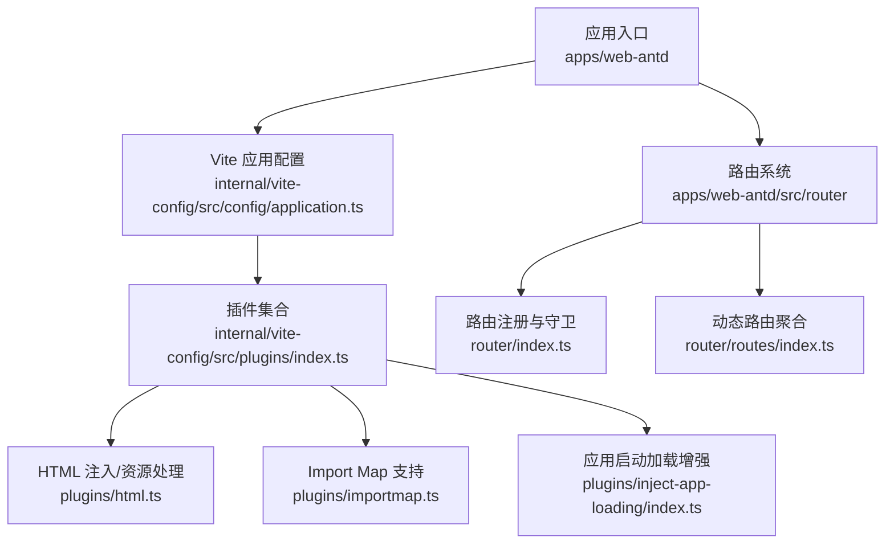
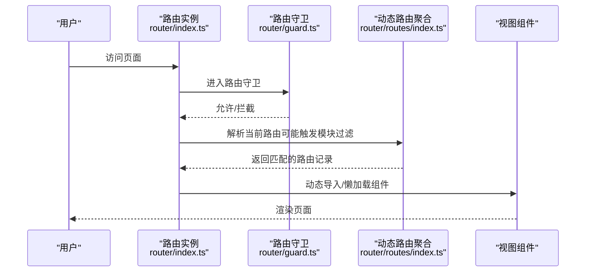
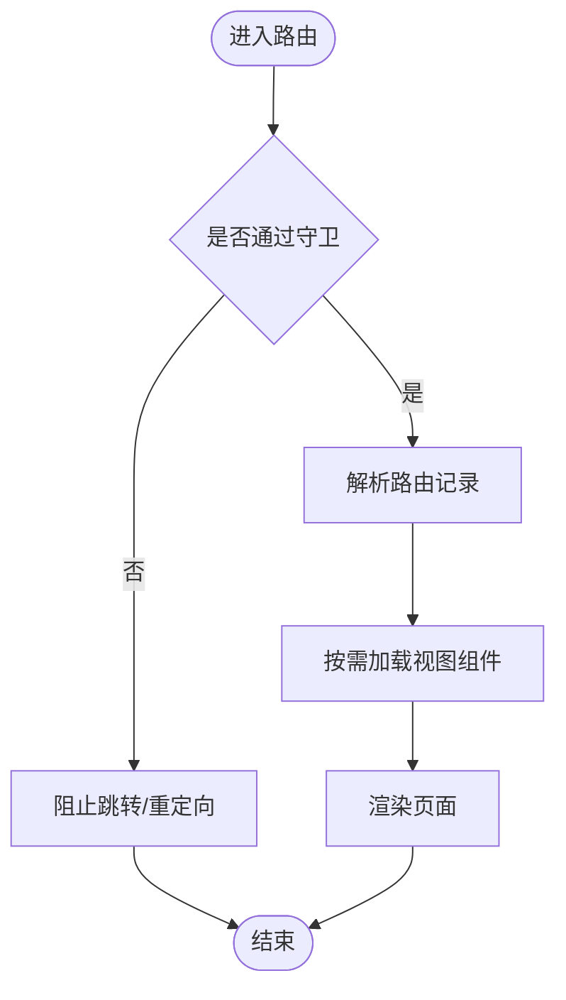
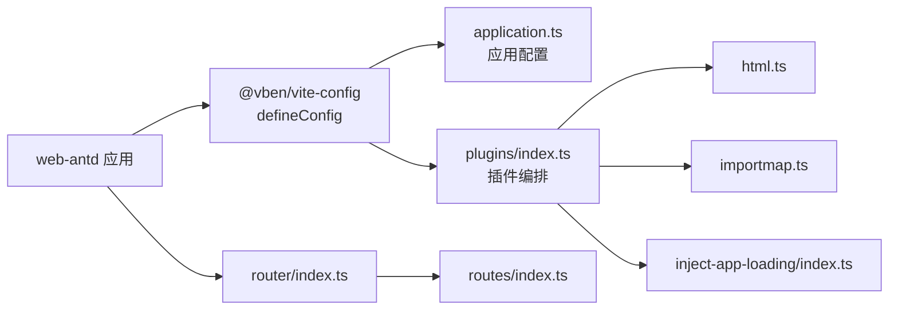

# 代码分割策略

<cite>
**本文引用的文件**
- [frontend/apps/web-antd/vite.config.ts](file://frontend/apps/web-antd/vite.config.ts)
- [frontend/internal/vite-config/package.json](file://frontend/internal/vite-config/package.json)
- [frontend/internal/vite-config/src/index.ts](file://frontend/internal/vite-config/src/index.ts)
- [frontend/internal/vite-config/src/config/application.ts](file://frontend/internal/vite-config/src/config/application.ts)
- [frontend/internal/vite-config/src/plugins/index.ts](file://frontend/internal/vite-config/src/plugins/index.ts)
- [frontend/internal/vite-config/src/plugins/inject-app-loading/index.ts](file://frontend/internal/vite-config/src/plugins/inject-app-loading/index.ts)
- [frontend/internal/vite-config/src/plugins/html.ts](file://frontend/internal/vite-config/src/plugins/html.ts)
- [frontend/internal/vite-config/src/plugins/importmap.ts](file://frontend/internal/vite-config/src/plugins/importmap.ts)
- [frontend/apps/web-antd/package.json](file://frontend/apps/web-antd/package.json)
- [frontend/apps/web-antd/src/router/index.ts](file://frontend/apps/web-antd/src/router/index.ts)
- [frontend/apps/web-antd/src/router/routes/index.ts](file://frontend/apps/web-antd/src/router/routes/index.ts)
</cite>

## 目录
1. [简介](#简介)
2. [项目结构](#项目结构)
3. [核心组件](#核心组件)
4. [架构总览](#架构总览)
5. [详细组件分析](#详细组件分析)
6. [依赖关系分析](#依赖关系分析)
7. [性能优化策略](#性能优化策略)
8. [构建产物分析](#构建产物分析)
9. [故障排查指南](#故障排查指南)
10. [结论](#结论)
11. [附录](#附录)

## 简介
本文件面向前端工程化，系统化阐述在 Vite + Vue 技术栈下的代码分割策略与落地实践。内容覆盖：
- 路由级代码分割：动态导入、懒加载实现、路由组件分离
- 组件级代码分割：大组件拆分、第三方库分离、公共模块提取
- 性能优化：首屏加载优化、预加载策略、预取机制
- 构建产物分析：包大小分析、依赖关系图、重复依赖检测
- 配置与监控：具体分割策略配置与性能监控方案，以及不同策略的适用场景与效果

## 项目结构
本项目采用 monorepo 组织方式，前端应用位于 frontend/apps/web-antd，通用 Vite 配置封装在 internal/vite-config。路由定义位于 apps/web-antd/src/router，路由模块通过 glob 动态聚合。

图表来源
- [frontend/internal/vite-config/src/config/application.ts](file://frontend/internal/vite-config/src/config/application.ts)
- [frontend/internal/vite-config/src/plugins/index.ts](file://frontend/internal/vite-config/src/plugins/index.ts)
- [frontend/internal/vite-config/src/plugins/html.ts](file://frontend/internal/vite-config/src/plugins/html.ts)
- [frontend/internal/vite-config/src/plugins/importmap.ts](file://frontend/internal/vite-config/src/plugins/importmap.ts)
- [frontend/internal/vite-config/src/plugins/inject-app-loading/index.ts](file://frontend/internal/vite-config/src/plugins/inject-app-loading/index.ts)
- [frontend/apps/web-antd/src/router/index.ts](file://frontend/apps/web-antd/src/router/index.ts)
- [frontend/apps/web-antd/src/router/routes/index.ts](file://frontend/apps/web-antd/src/router/routes/index.ts)

章节来源
- [frontend/apps/web-antd/vite.config.ts:1-24](file://frontend/apps/web-antd/vite.config.ts#L1-L24)
- [frontend/internal/vite-config/package.json:1-61](file://frontend/internal/vite-config/package.json#L1-L61)

## 核心组件
- Vite 应用配置层：通过 @vben/vite-config 暴露 defineConfig，统一打包行为、插件编排与构建选项。
- 路由系统：基于 vue-router 创建实例，集中注册静态路由与动态路由，并提供守卫与滚动行为。
- 动态路由聚合：使用 import.meta.glob 扫描并合并 modules 下的路由模块，便于按功能域拆分与按需启用。
- 构建插件：提供 HTML 注入、Import Map、PWA、压缩等能力，支撑首屏与缓存优化。

章节来源
- [frontend/apps/web-antd/src/router/index.ts:1-38](file://frontend/apps/web-antd/src/router/index.ts#L1-L38)
- [frontend/apps/web-antd/src/router/routes/index.ts:1-102](file://frontend/apps/web-antd/src/router/routes/index.ts#L1-L102)
- [frontend/internal/vite-config/package.json:1-61](file://frontend/internal/vite-config/package.json#L1-L61)

## 架构总览
下图展示从应用启动到路由渲染的关键流程，体现路由级代码分割与懒加载的执行顺序。

图表来源
- [frontend/apps/web-antd/src/router/index.ts:1-38](file://frontend/apps/web-antd/src/router/index.ts#L1-L38)
- [frontend/apps/web-antd/src/router/routes/index.ts:1-102](file://frontend/apps/web-antd/src/router/routes/index.ts#L1-L102)

## 详细组件分析

### 路由级代码分割
- 动态导入与懒加载
  - 路由实例在初始化时注册基础路由，并在导航过程中按需加载对应视图组件，避免首屏一次性加载全部业务模块。
  - 结合 vue-router 的异步组件或框架提供的路由懒加载能力，将每个页面作为独立 chunk 输出。
- 路由组件分离
  - 通过 router/routes/modules 下按功能域划分的模块文件，配合 import.meta.glob 进行聚合，天然形成“按模块切分”的代码边界。
  - 支持按启用模块过滤路由树，未启用的模块不会进入最终路由表，减少无效依赖。

图表来源
- [frontend/apps/web-antd/src/router/index.ts:1-38](file://frontend/apps/web-antd/src/router/index.ts#L1-L38)
- [frontend/apps/web-antd/src/router/routes/index.ts:1-102](file://frontend/apps/web-antd/src/router/routes/index.ts#L1-L102)

章节来源
- [frontend/apps/web-antd/src/router/index.ts:1-38](file://frontend/apps/web-antd/src/router/index.ts#L1-L38)
- [frontend/apps/web-antd/src/router/routes/index.ts:1-102](file://frontend/apps/web-antd/src/router/routes/index.ts#L1-L102)

### 组件级代码分割
- 大组件拆分
  - 将体积较大的页面或复杂交互拆分为子组件，必要时进一步拆分为可复用的原子组件，降低单 chunk 体积。
- 第三方库分离
  - 将大型第三方库（如图表、UI 库）通过 SplitChunks 或 Import Map 单独分包，利用浏览器长期缓存提升复用率。
- 公共模块提取
  - 将跨多个路由共享的工具函数、常量、样式等抽取为公共模块，避免重复打包。

说明：上述策略可通过 Vite 的打包配置与插件体系实现；在本项目中，通用打包能力由 internal/vite-config 提供，可按需扩展。

### 构建与插件能力
- HTML 注入与资源处理：用于注入应用启动脚本、资源路径与元信息，辅助首屏体验与缓存控制。
- Import Map：声明外部依赖映射，有利于将稳定第三方库以独立资源形式加载，提高缓存命中。
- 应用启动加载增强：在应用启动阶段注入加载状态与错误兜底，改善首屏感知与异常恢复。

章节来源
- [frontend/internal/vite-config/src/plugins/html.ts](file://frontend/internal/vite-config/src/plugins/html.ts)
- [frontend/internal/vite-config/src/plugins/importmap.ts](file://frontend/internal/vite-config/src/plugins/importmap.ts)
- [frontend/internal/vite-config/src/plugins/inject-app-loading/index.ts](file://frontend/internal/vite-config/src/plugins/inject-app-loading/index.ts)

## 依赖关系分析
下图展示 Vite 配置与应用之间的依赖关系，突出代码分割能力来源与路由系统的耦合点。

图表来源
- [frontend/internal/vite-config/src/config/application.ts](file://frontend/internal/vite-config/src/config/application.ts)
- [frontend/internal/vite-config/src/plugins/index.ts](file://frontend/internal/vite-config/src/plugins/index.ts)
- [frontend/internal/vite-config/src/plugins/html.ts](file://frontend/internal/vite-config/src/plugins/html.ts)
- [frontend/internal/vite-config/src/plugins/importmap.ts](file://frontend/internal/vite-config/src/plugins/importmap.ts)
- [frontend/internal/vite-config/src/plugins/inject-app-loading/index.ts](file://frontend/internal/vite-config/src/plugins/inject-app-loading/index.ts)
- [frontend/apps/web-antd/src/router/index.ts](file://frontend/apps/web-antd/src/router/index.ts)
- [frontend/apps/web-antd/src/router/routes/index.ts](file://frontend/apps/web-antd/src/router/routes/index.ts)

章节来源
- [frontend/internal/vite-config/package.json:1-61](file://frontend/internal/vite-config/package.json#L1-L61)
- [frontend/apps/web-antd/package.json:1-69](file://frontend/apps/web-antd/package.json#L1-L69)

## 性能优化策略
- 首屏加载优化
  - 路由级懒加载：确保首屏仅加载必要路由与组件，非关键页面延迟至用户导航时再加载。
  - 公共依赖外置：将稳定的第三方库通过 Import Map 或 SplitChunks 单独分包，利用浏览器缓存。
  - 资源压缩与缓存：启用构建压缩与版本化文件名，配合 CDN 与强缓存策略。
- 预加载策略
  - 对即将可能访问的高频路由使用轻量预加载（如 prefetch），在不阻塞首屏的前提下提前拉取资源。
- 预取机制
  - 在空闲时段或用户交互前，对次重要资源进行预取，缩短后续交互等待时间。
- 模块粒度控制
  - 按功能域拆分路由模块，避免单个 chunk 过大；对超大图表或重型 UI 组件按需引入。

说明：以上策略可在 internal/vite-config 中统一配置，并通过应用级 vite.config.ts 进行局部覆盖。

## 构建产物分析
- 包大小分析
  - 使用内置的分析脚本生成可视化报告，定位体积热点与冗余依赖。
  - 关注首屏关键 chunk 的大小变化，评估路由懒加载与第三方库分离的效果。
- 依赖关系图
  - 通过可视化报告查看模块间的引用关系，识别不必要的深层依赖。
- 重复依赖检测
  - 检查是否存在同一库的多版本或多处重复引入，优先统一版本并抽取为公共依赖。

章节来源
- [frontend/apps/web-antd/package.json:18-28](file://frontend/apps/web-antd/package.json#L18-L28)
- [frontend/internal/vite-config/package.json:29-59](file://frontend/internal/vite-config/package.json#L29-L59)

## 故障排查指南
- 路由 404/403 问题
  - 检查动态路由聚合是否正确加载模块，确认模块过滤逻辑是否误删了目标路由。
  - 校验路由 path 模式与 isKnownRoutePath 的正则匹配是否符合预期。
- 懒加载失败
  - 确认路由对应的视图组件路径正确且可被动态导入。
  - 检查网络请求是否被拦截或代理配置不正确导致资源无法加载。
- 首屏卡顿
  - 通过构建分析报告定位大体积依赖，考虑拆分或延迟加载。
  - 检查是否引入了不必要的重型库或未做按需引入。

章节来源
- [frontend/apps/web-antd/src/router/routes/index.ts:1-102](file://frontend/apps/web-antd/src/router/routes/index.ts#L1-L102)
- [frontend/apps/web-antd/vite.config.ts:1-24](file://frontend/apps/web-antd/vite.config.ts#L1-L24)

## 结论
通过在路由与组件层面实施代码分割，并结合 Import Map、SplitChunks、预加载与预取等策略，可以显著降低首屏体积、提升加载速度与交互响应。建议在 internal/vite-config 中统一沉淀分割策略，同时在应用层按需微调，持续通过构建分析验证优化效果。

## 附录
- 常用命令
  - 构建与分析：参考应用 package.json 中的 build 与 build:analyze 脚本。
  - 本地开发：使用 dev 脚本启动开发服务器，观察路由懒加载与资源加载情况。
- 建议的实践清单
  - 每个路由模块保持单一职责，避免跨模块耦合。
  - 对超过阈值的大组件进行二次拆分。
  - 对第三方库进行版本收敛与外置分包。
  - 定期运行构建分析，回归体积增长问题。