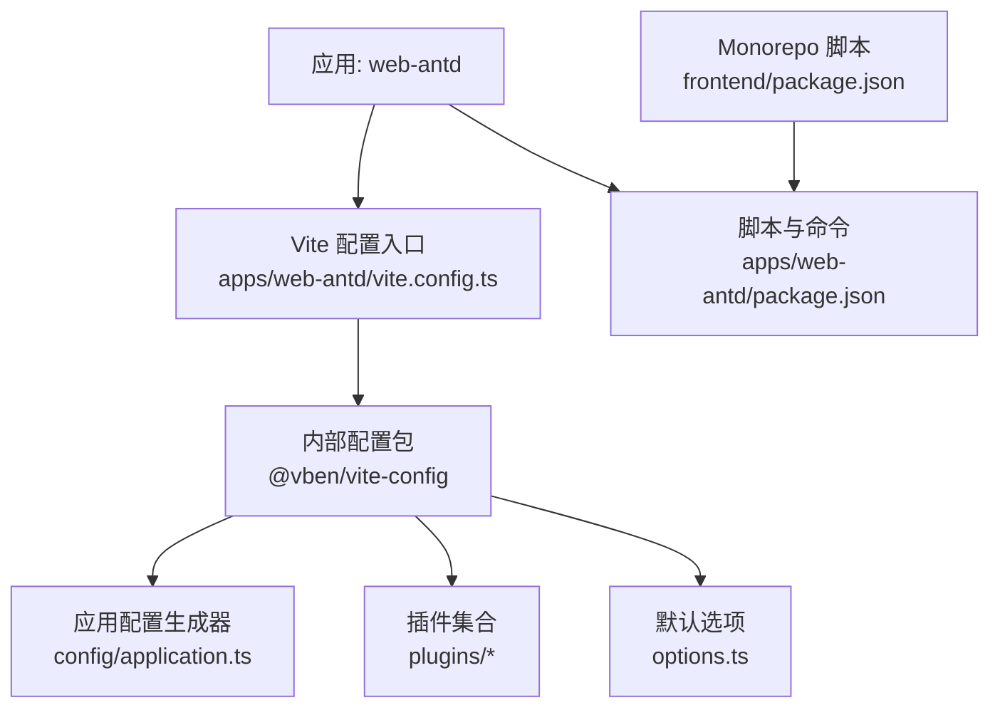
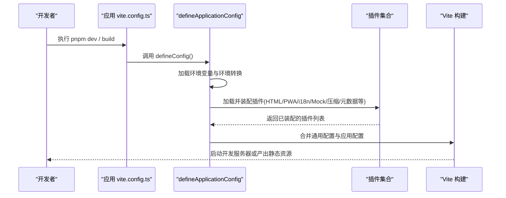
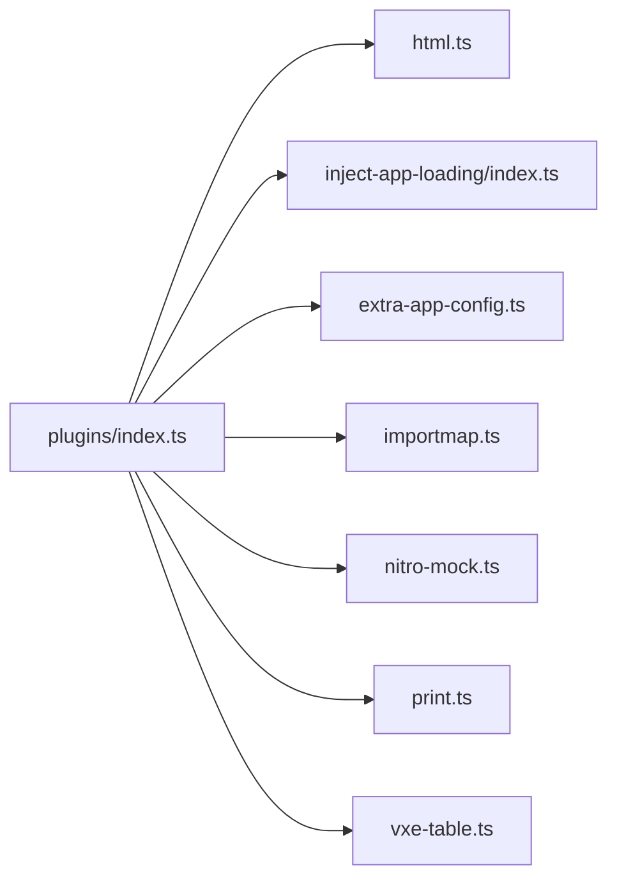
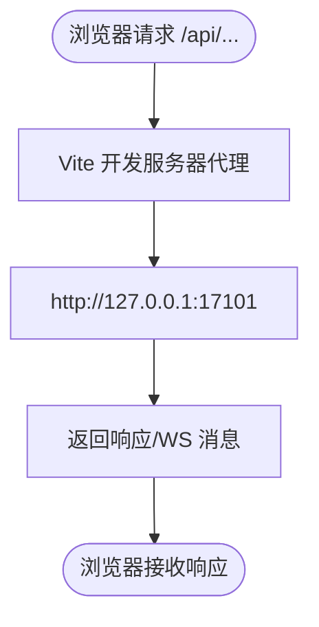
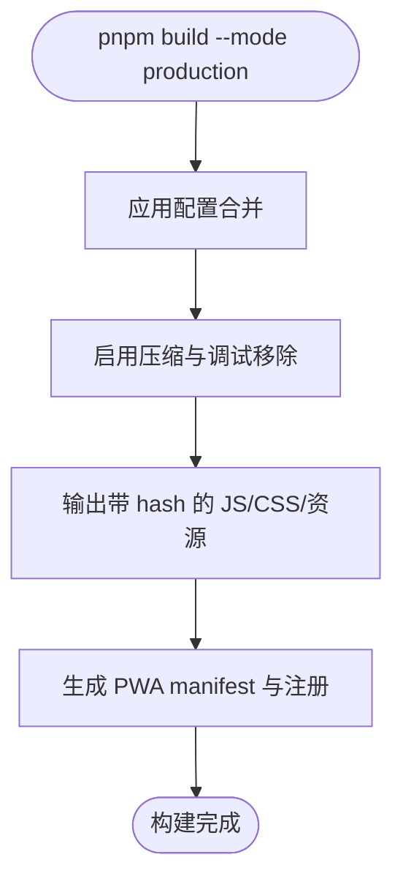
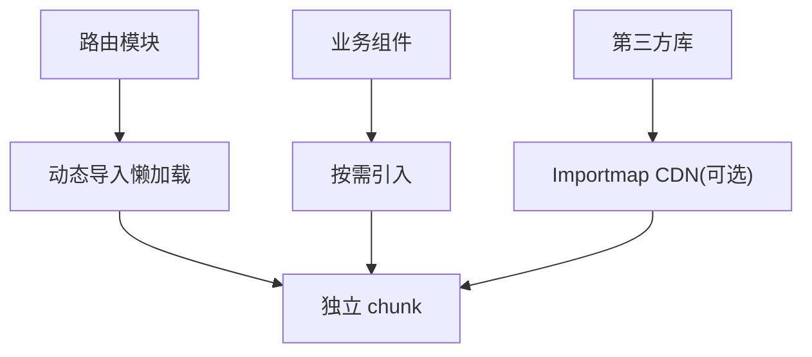
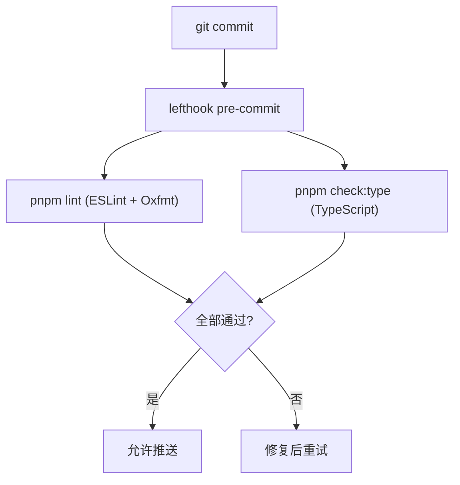
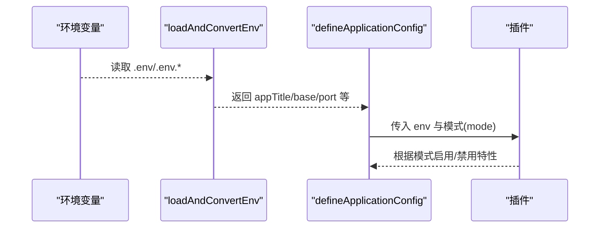
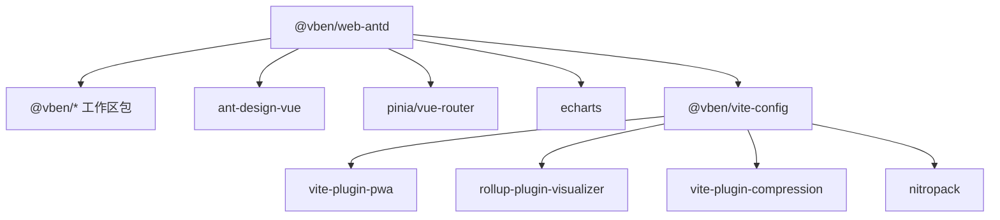

# 构建配置

<cite>
**本文引用的文件**
- [frontend/package.json](file://frontend/package.json)
- [frontend/apps/web-antd/package.json](file://frontend/apps/web-antd/package.json)
- [frontend/apps/web-antd/vite.config.ts](file://frontend/apps/web-antd/vite.config.ts)
- [frontend/internal/vite-config/src/config/application.ts](file://frontend/internal/vite-config/src/config/application.ts)
- [frontend/internal/vite-config/src/options.ts](file://frontend/internal/vite-config/src/options.ts)
- [frontend/internal/vite-config/src/plugins/index.ts](file://frontend/internal/vite-config/src/plugins/index.ts)
- [frontend/internal/vite-config/src/plugins/inject-app-loading/index.ts](file://frontend/internal/vite-config/src/plugins/inject-app-loading/index.ts)
- [frontend/internal/vite-config/src/plugins/extra-app-config.ts](file://frontend/internal/vite-config/src/plugins/extra-app-config.ts)
- [frontend/internal/vite-config/src/plugins/importmap.ts](file://frontend/internal/vite-config/src/plugins/importmap.ts)
- [frontend/internal/vite-config/src/plugins/nitro-mock.ts](file://frontend/internal/vite-config/src/plugins/nitro-mock.ts)
- [frontend/internal/vite-config/src/plugins/html.ts](file://frontend/internal/vite-config/src/plugins/html.ts)
- [frontend/internal/vite-config/src/plugins/print.ts](file://frontend/internal/vite-config/src/plugins/print.ts)
- [frontend/internal/vite-config/src/plugins/vxe-table.ts](file://frontend/internal/vite-config/src/plugins/vxe-table.ts)
- [frontend/internal/vite-config/package.json](file://frontend/internal/vite-config/package.json)
- [frontend/eslint.config.mjs](file://frontend/eslint.config.mjs)
- [frontend/stylelint.config.mjs](file://frontend/stylelint.config.mjs)
- [frontend/lefthook.yml](file://frontend/lefthook.yml)
</cite>

## 目录
1. [简介](#简介)
2. [项目结构](#项目结构)
3. [核心组件](#核心组件)
4. [架构总览](#架构总览)
5. [详细组件分析](#详细组件分析)
6. [依赖关系分析](#依赖关系分析)
7. [性能考量](#性能考量)
8. [故障排查指南](#故障排查指南)
9. [结论](#结论)
10. [附录](#附录)

## 简介
本文件面向前端工程化与构建配置，聚焦 Vite 插件生态、开发服务器、生产构建优化；系统阐述代码分割策略（路由级、组件级、第三方库分离）、资源优化（图片压缩、字体优化、CDN 配置、缓存策略）；质量保障（ESLint、Stylelint、Prettier/Oxlint、Git Hooks）；环境变量管理（开发/生产、API 地址切换、功能开关）；以及构建性能分析与部署优化方案。内容基于仓库中实际配置文件与内部 Vite 配置包进行说明。

## 项目结构
本项目采用 Monorepo 组织方式，应用位于 frontend/apps/web-antd，统一通过 internal/vite-config 提供的 defineConfig 封装 Vite 配置，并在应用层仅做最小化覆盖（如代理）。根级 package.json 提供脚本入口，Turbo 负责并行构建与任务编排。

图表来源
- [frontend/apps/web-antd/vite.config.ts:1-24](file://frontend/apps/web-antd/vite.config.ts#L1-L24)
- [frontend/internal/vite-config/src/config/application.ts:17-98](file://frontend/internal/vite-config/src/config/application.ts#L17-L98)
- [frontend/internal/vite-config/src/options.ts:1-46](file://frontend/internal/vite-config/src/options.ts#L1-L46)
- [frontend/apps/web-antd/package.json:18-29](file://frontend/apps/web-antd/package.json#L18-L29)
- [frontend/package.json:27-59](file://frontend/package.json#L27-L59)

章节来源
- [frontend/package.json:27-59](file://frontend/package.json#L27-L59)
- [frontend/apps/web-antd/package.json:18-29](file://frontend/apps/web-antd/package.json#L18-L29)
- [frontend/apps/web-antd/vite.config.ts:1-24](file://frontend/apps/web-antd/vite.config.ts#L1-L24)
- [frontend/internal/vite-config/src/config/application.ts:17-98](file://frontend/internal/vite-config/src/config/application.ts#L17-L98)

## 核心组件
- 应用构建入口：apps/web-antd/vite.config.ts 使用 @vben/vite-config 的 defineConfig，并覆盖开发服务器代理到后端 API。
- 内部配置包：internal/vite-config 提供统一的 defineApplicationConfig，自动装配插件、HTML、PWA、i18n、压缩、元数据注入等能力。
- 插件体系：包含 HTML 处理、应用加载注入、额外应用配置注入、Importmap CDN、Nitro Mock、打印信息、VXE Table 懒加载等。
- 脚本与命令：根与应用级 package.json 定义 dev/build/preview/test/typecheck/e2e 等命令，并通过 Turbo 协调多包构建。

章节来源
- [frontend/apps/web-antd/vite.config.ts:1-24](file://frontend/apps/web-antd/vite.config.ts#L1-L24)
- [frontend/internal/vite-config/src/config/application.ts:17-98](file://frontend/internal/vite-config/src/config/application.ts#L17-L98)
- [frontend/internal/vite-config/src/plugins/index.ts](file://frontend/internal/vite-config/src/plugins/index.ts)
- [frontend/internal/vite-config/package.json:29-58](file://frontend/internal/vite-config/package.json#L29-L58)
- [frontend/apps/web-antd/package.json:18-29](file://frontend/apps/web-antd/package.json#L18-L29)
- [frontend/package.json:27-59](file://frontend/package.json#L27-L59)

## 架构总览
下图展示了从应用配置到插件装配、再到构建产物的整体流程。defineApplicationConfig 在构建时加载环境变量、合并通用配置与应用配置，并启用一系列插件以完成 HTML 注入、PWA、i18n、Mock、压缩、元数据注入等。

图表来源
- [frontend/apps/web-antd/vite.config.ts:1-24](file://frontend/apps/web-antd/vite.config.ts#L1-L24)
- [frontend/internal/vite-config/src/config/application.ts:17-98](file://frontend/internal/vite-config/src/config/application.ts#L17-L98)
- [frontend/internal/vite-config/src/plugins/index.ts](file://frontend/internal/vite-config/src/plugins/index.ts)

## 详细组件分析

### Vite 插件生态
- HTML 处理：html.ts 负责 HTML 模板处理与注入。
- 应用加载注入：inject-app-loading/index.ts 提供加载态注入逻辑。
- 额外应用配置：extra-app-config.ts 将运行时配置注入到页面。
- Importmap CDN：importmap.ts 支持通过 importmap 引入部分依赖（默认关闭，因兼容性与网络稳定性考虑）。
- Nitro Mock：nitro-mock.ts 在非构建模式下启用本地 Mock 服务。
- 打印信息：print.ts 在开发模式输出构建与运行信息。
- VXE Table 懒加载：vxe-table.ts 按需加载表格相关模块以提升首屏性能。

图表来源
- [frontend/internal/vite-config/src/plugins/index.ts](file://frontend/internal/vite-config/src/plugins/index.ts)
- [frontend/internal/vite-config/src/plugins/html.ts](file://frontend/internal/vite-config/src/plugins/html.ts)
- [frontend/internal/vite-config/src/plugins/inject-app-loading/index.ts](file://frontend/internal/vite-config/src/plugins/inject-app-loading/index.ts)
- [frontend/internal/vite-config/src/plugins/extra-app-config.ts](file://frontend/internal/vite-config/src/plugins/extra-app-config.ts)
- [frontend/internal/vite-config/src/plugins/importmap.ts](file://frontend/internal/vite-config/src/plugins/importmap.ts)
- [frontend/internal/vite-config/src/plugins/nitro-mock.ts](file://frontend/internal/vite-config/src/plugins/nitro-mock.ts)
- [frontend/internal/vite-config/src/plugins/print.ts](file://frontend/internal/vite-config/src/plugins/print.ts)
- [frontend/internal/vite-config/src/plugins/vxe-table.ts](file://frontend/internal/vite-config/src/plugins/vxe-table.ts)

章节来源
- [frontend/internal/vite-config/src/plugins/index.ts](file://frontend/internal/vite-config/src/plugins/index.ts)
- [frontend/internal/vite-config/src/plugins/html.ts](file://frontend/internal/vite-config/src/plugins/html.ts)
- [frontend/internal/vite-config/src/plugins/inject-app-loading/index.ts](file://frontend/internal/vite-config/src/plugins/inject-app-loading/index.ts)
- [frontend/internal/vite-config/src/plugins/extra-app-config.ts](file://frontend/internal/vite-config/src/plugins/extra-app-config.ts)
- [frontend/internal/vite-config/src/plugins/importmap.ts](file://frontend/internal/vite-config/src/plugins/importmap.ts)
- [frontend/internal/vite-config/src/plugins/nitro-mock.ts](file://frontend/internal/vite-config/src/plugins/nitro-mock.ts)
- [frontend/internal/vite-config/src/plugins/print.ts](file://frontend/internal/vite-config/src/plugins/print.ts)
- [frontend/internal/vite-config/src/plugins/vxe-table.ts](file://frontend/internal/vite-config/src/plugins/vxe-table.ts)

### 开发服务器
- 代理配置：在 apps/web-antd/vite.config.ts 中将 /api 请求代理至 http://127.0.0.1:17101，开启 WebSocket 转发，便于联调后端接口。
- 主机与端口：由内部配置 application.ts 设置 host 为 true，port 来自环境变量转换后的值。
- 预热文件：server.warmup.clientFiles 预编译常用入口与视图，提升冷启动速度。

图表来源
- [frontend/apps/web-antd/vite.config.ts:6-21](file://frontend/apps/web-antd/vite.config.ts#L6-L21)
- [frontend/internal/vite-config/src/config/application.ts:79-90](file://frontend/internal/vite-config/src/config/application.ts#L79-L90)

章节来源
- [frontend/apps/web-antd/vite.config.ts:6-21](file://frontend/apps/web-antd/vite.config.ts#L6-L21)
- [frontend/internal/vite-config/src/config/application.ts:79-90](file://frontend/internal/vite-config/src/config/application.ts#L79-L90)

### 生产构建优化
- 产物命名与压缩：application.ts 中设置产物文件名含 hash，JS/CSS/资源按目录输出，并启用压缩（dropDebugger）。
- 目标环境：target 设置为 es2015，兼顾兼容性与体积。
- 压缩类型：默认启用 brotli 与 gzip 压缩类型（可通过 compressTypes 控制），利于 CDN 缓存与传输。
- PWA：默认启用 PWA，manifest 名称根据开发/生产区分，图标通过 CDN 引入。
- Importmap CDN：默认关闭，避免不兼容与网络不稳定问题。

图表来源
- [frontend/internal/vite-config/src/config/application.ts:60-76](file://frontend/internal/vite-config/src/config/application.ts#L60-L76)
- [frontend/internal/vite-config/src/options.ts:7-26](file://frontend/internal/vite-config/src/options.ts#L7-L26)
- [frontend/internal/vite-config/src/options.ts:28-43](file://frontend/internal/vite-config/src/options.ts#L28-L43)

章节来源
- [frontend/internal/vite-config/src/config/application.ts:60-76](file://frontend/internal/vite-config/src/config/application.ts#L60-L76)
- [frontend/internal/vite-config/src/options.ts:7-26](file://frontend/internal/vite-config/src/options.ts#L7-L26)
- [frontend/internal/vite-config/src/options.ts:28-43](file://frontend/internal/vite-config/src/options.ts#L28-L43)

### 代码分割策略
- 路由级分割：通过 Vue Router 与 Vite 的动态导入实现路由级懒加载，减少首屏体积。结合 VXE Table 懒加载插件，进一步降低表格相关依赖的初始体积。
- 组件级分割：业务组件按需引入，避免全量打包。
- 第三方库分离：通过 Importmap 可配置将 vue、pinia、vue-router、dayjs 等基础库通过 CDN 引入（当前默认关闭），从而利用浏览器缓存与并行下载。

图表来源
- [frontend/internal/vite-config/src/plugins/vxe-table.ts](file://frontend/internal/vite-config/src/plugins/vxe-table.ts)
- [frontend/internal/vite-config/src/options.ts:28-43](file://frontend/internal/vite-config/src/options.ts#L28-L43)

章节来源
- [frontend/internal/vite-config/src/plugins/vxe-table.ts](file://frontend/internal/vite-config/src/plugins/vxe-table.ts)
- [frontend/internal/vite-config/src/options.ts:28-43](file://frontend/internal/vite-config/src/options.ts#L28-L43)

### 资源优化
- 图片与字体：Vite 默认对静态资源进行优化与哈希命名；建议将大图片与字体放入 public 目录并按需引用，配合 CDN 加速。
- CDN 配置：Importmap 支持将核心库通过 CDN 引入（默认关闭），可按需启用以提升缓存命中率。
- 缓存策略：产物文件名含 hash，利于长期缓存；PWA 提供离线能力与更新机制。

章节来源
- [frontend/internal/vite-config/src/config/application.ts:60-76](file://frontend/internal/vite-config/src/config/application.ts#L60-L76)
- [frontend/internal/vite-config/src/options.ts:28-43](file://frontend/internal/vite-config/src/options.ts#L28-L43)

### 质量保障
- ESLint：根级 eslint.config.mjs 基于 @vben/eslint-config，针对 TS/TSX 与 Vue 文件分别调整规则，保持语义检查与格式解耦。
- Stylelint：stylelint.config.mjs 继承 @vben/stylelint-config，并对 Tailwind 工具类禁用 BEM 限制。
- 格式化：使用 Oxlint/Oxfmt 进行快速检查与格式化（见根级 oxlint.config.ts、oxfmt.config.ts）。
- Git Hooks：lefthook.yml 配置 pre-commit 并行执行 lint 与类型检查，post-merge 安装依赖，commit-msg 校验提交信息。

图表来源
- [frontend/lefthook.yml:44-61](file://frontend/lefthook.yml#L44-L61)
- [frontend/eslint.config.mjs:1-19](file://frontend/eslint.config.mjs#L1-L19)
- [frontend/stylelint.config.mjs:1-9](file://frontend/stylelint.config.mjs#L1-L9)

章节来源
- [frontend/eslint.config.mjs:1-19](file://frontend/eslint.config.mjs#L1-L19)
- [frontend/stylelint.config.mjs:1-9](file://frontend/stylelint.config.mjs#L1-L9)
- [frontend/lefthook.yml:44-61](file://frontend/lefthook.yml#L44-L61)

### 环境变量管理
- 环境变量加载：application.ts 通过 loadAndConvertEnv 读取并转换环境变量，包括 appTitle、base、port 等，并注入到插件与配置中。
- 开发/生产差异：NODE_ENV 与 mode 决定行为（如 PWA 名称、是否启用 Nitro Mock、是否打印信息等）。
- API 地址切换：应用层 vite.config.ts 通过 server.proxy.target 指向后端地址，便于开发联调；生产环境通常由反向代理或 Nginx 处理。

图表来源
- [frontend/internal/vite-config/src/config/application.ts:17-54](file://frontend/internal/vite-config/src/config/application.ts#L17-L54)
- [frontend/apps/web-antd/vite.config.ts:6-21](file://frontend/apps/web-antd/vite.config.ts#L6-L21)

章节来源
- [frontend/internal/vite-config/src/config/application.ts:17-54](file://frontend/internal/vite-config/src/config/application.ts#L17-L54)
- [frontend/apps/web-antd/vite.config.ts:6-21](file://frontend/apps/web-antd/vite.config.ts#L6-L21)

## 依赖关系分析
- 应用依赖：web-antd 依赖多个 @vben 工作区包（如 access、common-ui、layouts、locales、request、stores、styles、types、utils 等），以及 ant-design-vue、echarts、pinia、vue、vue-router 等。
- 构建依赖：internal/vite-config 依赖 vite-plugin-pwa、rollup-plugin-visualizer、vite-plugin-compression、nitropack 等，用于 PWA、可视化、压缩与 Mock。
- 脚本依赖：根 package.json 通过 turbo 协调多包构建，并提供 build:analyze 等扩展命令。

图表来源
- [frontend/apps/web-antd/package.json:33-67](file://frontend/apps/web-antd/package.json#L33-L67)
- [frontend/internal/vite-config/package.json:29-58](file://frontend/internal/vite-config/package.json#L29-L58)
- [frontend/package.json:27-59](file://frontend/package.json#L27-L59)

章节来源
- [frontend/apps/web-antd/package.json:33-67](file://frontend/apps/web-antd/package.json#L33-L67)
- [frontend/internal/vite-config/package.json:29-58](file://frontend/internal/vite-config/package.json#L29-L58)
- [frontend/package.json:27-59](file://frontend/package.json#L27-L59)

## 性能考量
- 首屏优化：启用路由懒加载与 VXE Table 懒加载，减少初始包体；预热关键文件提升冷启动速度。
- 构建体积：产物文件名含 hash，启用压缩与调试移除；按需启用 Importmap CDN 分离基础库。
- 缓存策略：静态资源与 JS/CSS 均带 hash，利于浏览器与 CDN 缓存；PWA 提供离线与增量更新。
- 分析工具：可通过 build:analyze 模式进行体积分析（根与应用脚本提供对应命令）。

章节来源
- [frontend/internal/vite-config/src/config/application.ts:60-90](file://frontend/internal/vite-config/src/config/application.ts#L60-L90)
- [frontend/internal/vite-config/src/options.ts:28-43](file://frontend/internal/vite-config/src/options.ts#L28-L43)
- [frontend/apps/web-antd/package.json:18-29](file://frontend/apps/web-antd/package.json#L18-L29)
- [frontend/package.json:27-59](file://frontend/package.json#L27-L59)

## 故障排查指南
- 代理失败：确认开发服务器代理 target 与后端端口一致，且防火墙/安全组放行；注意 Node v17+ 解析 localhost 优先 IPv6，建议使用 127.0.0.1。
- 构建体积过大：启用 analyze 模式查看依赖分布；按需拆分路由与组件；评估是否启用 Importmap CDN。
- PWA 异常：检查 manifest 与图标路径是否正确；确认生产环境 HTTPS 与 Service Worker 注册条件。
- 样式冲突：确保全局 SCSS 注入正确；Tailwind 工具类不受 BEM 限制；必要时调整 stylelint 规则。
- 提交被拦截：检查 lefthook 钩子日志，修复 lint 与类型错误后再提交。

章节来源
- [frontend/apps/web-antd/vite.config.ts:6-21](file://frontend/apps/web-antd/vite.config.ts#L6-L21)
- [frontend/internal/vite-config/src/config/application.ts:60-90](file://frontend/internal/vite-config/src/config/application.ts#L60-L90)
- [frontend/internal/vite-config/src/options.ts:7-26](file://frontend/internal/vite-config/src/options.ts#L7-L26)
- [frontend/stylelint.config.mjs:1-9](file://frontend/stylelint.config.mjs#L1-L9)
- [frontend/lefthook.yml:44-61](file://frontend/lefthook.yml#L44-L61)

## 结论
本项目通过内部 Vite 配置包实现了高度一致的构建体验：统一的插件生态、完善的开发服务器代理与预热、生产环境的压缩与 PWA 支持；结合路由与组件级懒加载、可选 Importmap CDN 分离基础库，有效优化首屏与缓存；质量保障方面通过 ESLint、Stylelint、Oxlint/Oxfmt 与 lefthook 形成闭环；环境变量管理清晰，便于开发与生产切换。建议在后续迭代中持续使用 analyze 模式监控体积增长，并根据业务需求逐步启用 CDN 与更细粒度的代码分割。

## 附录
- 常用命令
  - 开发：pnpm dev / pnpm dev:antd
  - 构建：pnpm build / pnpm build:antd
  - 预览：pnpm preview
  - 分析：pnpm build:analyze
  - 类型检查：pnpm check:type
  - E2E：pnpm test:e2e

章节来源
- [frontend/package.json:27-59](file://frontend/package.json#L27-L59)
- [frontend/apps/web-antd/package.json:18-29](file://frontend/apps/web-antd/package.json#L18-L29)