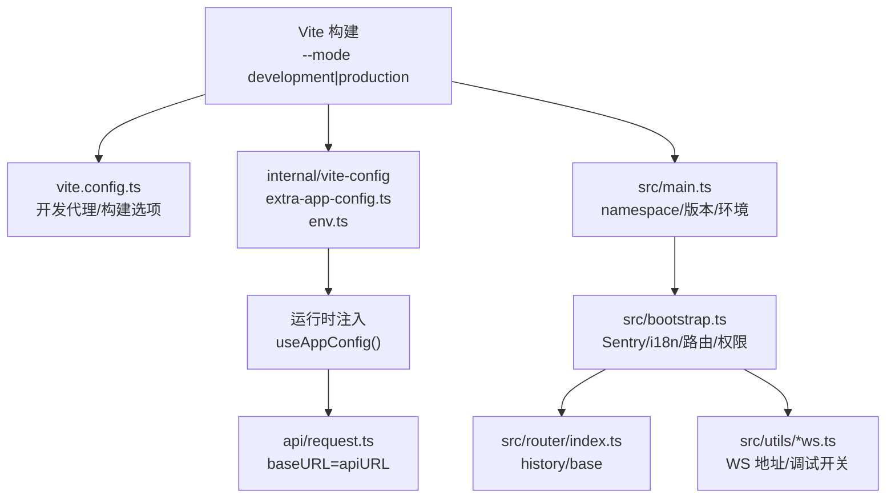
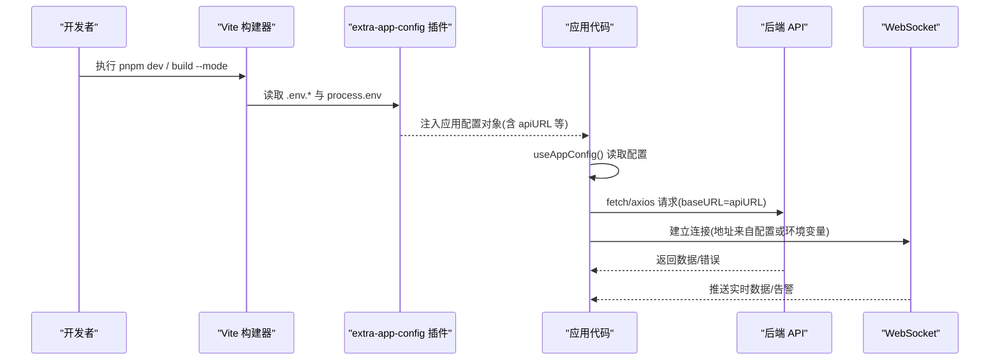
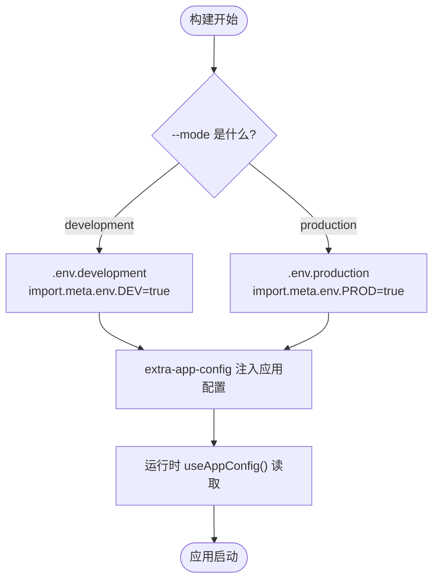
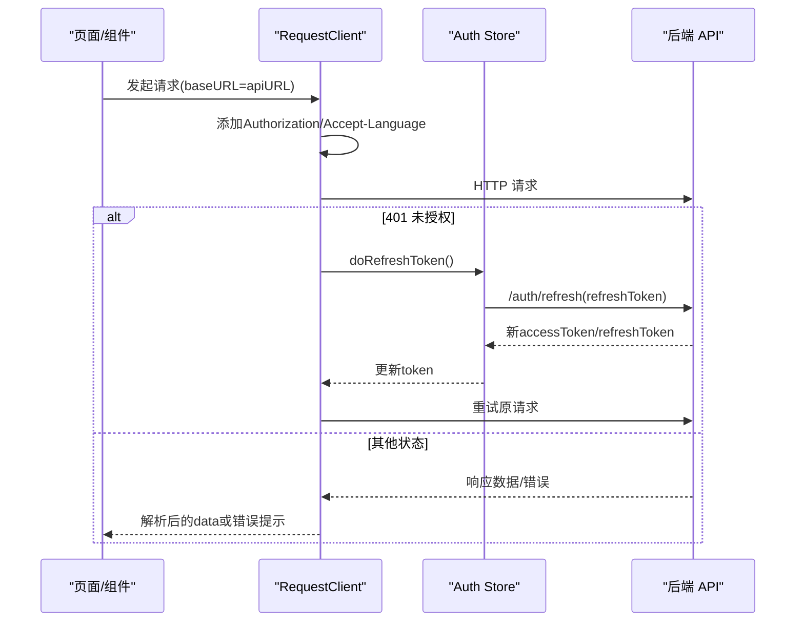
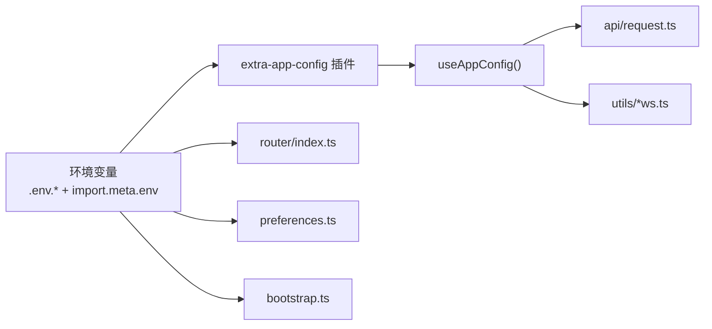

# 环境变量管理

<cite>
**本文引用的文件**
- [frontend/apps/web-antd/vite.config.ts](file://frontend/apps/web-antd/vite.config.ts)
- [frontend/apps/web-antd/package.json](file://frontend/apps/web-antd/package.json)
- [frontend/apps/web-antd/src/main.ts](file://frontend/apps/web-antd/src/main.ts)
- [frontend/apps/web-antd/src/bootstrap.ts](file://frontend/apps/web-antd/src/bootstrap.ts)
- [frontend/apps/web-antd/src/preferences.ts](file://frontend/apps/web-antd/src/preferences.ts)
- [frontend/apps/web-antd/src/api/request.ts](file://frontend/apps/web-antd/src/api/request.ts)
- [frontend/apps/web-antd/src/router/index.ts](file://frontend/apps/web-antd/src/router/index.ts)
- [frontend/apps/web-antd/src/utils/alert-ws.ts](file://frontend/apps/web-antd/src/utils/alert-ws.ts)
- [frontend/apps/web-antd/src/utils/realtime-ws.ts](file://frontend/apps/web-antd/src/utils/realtime-ws.ts)
- [frontend/internal/vite-config/src/plugins/extra-app-config.ts](file://frontend/internal/vite-config/src/plugins/extra-app-config.ts)
- [frontend/internal/vite-config/src/utils/env.ts](file://frontend/internal/vite-config/src/utils/env.ts)
</cite>

## 目录
1. [简介](#简介)
2. [项目结构](#项目结构)
3. [核心组件](#核心组件)
4. [架构总览](#架构总览)
5. [详细组件分析](#详细组件分析)
6. [依赖关系分析](#依赖关系分析)
7. [性能考量](#性能考量)
8. [故障排查指南](#故障排查指南)
9. [结论](#结论)
10. [附录：环境变量清单与最佳实践](#附录环境变量清单与最佳实践)

## 简介
本技术文档聚焦前端环境变量管理，围绕以下目标展开：
- 环境分类：开发、生产、测试环境的配置差异与切换机制。
- 变量类型：API 地址、功能开关、第三方服务配置、调试选项等。
- 切换机制：构建时替换、运行时配置、动态加载。
- 安全考虑：敏感信息保护、配置校验、默认值设置。
- 实践建议：不同环境的配置差异、部署注意事项与管理最佳实践。

本项目基于 Vite 构建的前端应用，使用 import.meta.env 暴露的环境变量进行配置注入，并通过内部 vite-config 插件将配置以“应用级配置对象”的形式在运行时注入到应用中，实现“构建期决定基础配置、运行期可覆盖”的灵活策略。

## 项目结构
前端应用位于 frontend/apps/web-antd，核心入口与配置分布如下：
- 构建与代理：vite.config.ts 定义开发服务器代理（本地联调后端）。
- 脚本与环境模式：package.json 提供 dev/build/preview 等脚本，通过 --mode 指定环境模式。
- 应用初始化：main.ts 读取版本、命名空间并启动 bootstrap。
- 引导流程：bootstrap.ts 负责初始化错误上报、国际化、路由、权限指令等。
- 偏好与主题：preferences.ts 提供应用偏好覆盖项，部分来自环境变量。
- API 客户端：api/request.ts 通过 useAppConfig 获取 apiURL，统一处理鉴权与错误。
- 路由与环境：router/index.ts 根据环境变量选择路由历史模式与 base。
- WebSocket 工具：alert-ws.ts、realtime-ws.ts 使用全局 API 地址或开发环境行为。
- 内部配置插件：internal/vite-config 提供 extra-app-config 与 env 工具，用于注入和读取环境变量。

图表来源
- [frontend/apps/web-antd/vite.config.ts:1-24](file://frontend/apps/web-antd/vite.config.ts#L1-L24)
- [frontend/internal/vite-config/src/plugins/extra-app-config.ts](file://frontend/internal/vite-config/src/plugins/extra-app-config.ts)
- [frontend/internal/vite-config/src/utils/env.ts](file://frontend/internal/vite-config/src/utils/env.ts)
- [frontend/apps/web-antd/src/main.ts:1-51](file://frontend/apps/web-antd/src/main.ts#L1-L51)
- [frontend/apps/web-antd/src/bootstrap.ts:1-94](file://frontend/apps/web-antd/src/bootstrap.ts#L1-L94)
- [frontend/apps/web-antd/src/api/request.ts:1-151](file://frontend/apps/web-antd/src/api/request.ts#L1-L151)
- [frontend/apps/web-antd/src/router/index.ts:17-19](file://frontend/apps/web-antd/src/router/index.ts#L17-L19)
- [frontend/apps/web-antd/src/utils/alert-ws.ts:42](file://frontend/apps/web-antd/src/utils/alert-ws.ts#L42)
- [frontend/apps/web-antd/src/utils/realtime-ws.ts:54](file://frontend/apps/web-antd/src/utils/realtime-ws.ts#L54)

章节来源
- [frontend/apps/web-antd/vite.config.ts:1-24](file://frontend/apps/web-antd/vite.config.ts#L1-L24)
- [frontend/apps/web-antd/package.json:18-28](file://frontend/apps/web-antd/package.json#L18-L28)
- [frontend/apps/web-antd/src/main.ts:1-51](file://frontend/apps/web-antd/src/main.ts#L1-L51)
- [frontend/apps/web-antd/src/bootstrap.ts:1-94](file://frontend/apps/web-antd/src/bootstrap.ts#L1-L94)
- [frontend/apps/web-antd/src/api/request.ts:1-151](file://frontend/apps/web-antd/src/api/request.ts#L1-L151)
- [frontend/apps/web-antd/src/router/index.ts:17-19](file://frontend/apps/web-antd/src/router/index.ts#L17-L19)
- [frontend/apps/web-antd/src/utils/alert-ws.ts:42](file://frontend/apps/web-antd/src/utils/alert-ws.ts#L42)
- [frontend/apps/web-antd/src/utils/realtime-ws.ts:54](file://frontend/apps/web-antd/src/utils/realtime-ws.ts#L54)

## 核心组件
- 构建期环境变量注入
  - Vite 通过 import.meta.env 暴露环境变量，并在构建时按 mode 替换常量。
  - internal/vite-config 的 extra-app-config 插件将环境变量转换为运行时可用的应用配置对象，供 useAppConfig 读取。
- 运行时配置读取
  - api/request.ts 通过 useAppConfig(import.meta.env, import.meta.env.PROD) 获取 apiURL，作为请求基地址。
  - router/index.ts 依据 VITE_ROUTER_HISTORY、VITE_BASE 控制路由历史模式与 base。
  - preferences.ts 中应用名称等字段来源于 VITE_APP_TITLE。
- 动态加载与条件启用
  - bootstrap.ts 在生产环境且存在 VITE_SENTRY_DSN 时动态导入 Sentry 并初始化。
  - realtime-ws.ts 在开发环境下开启额外调试日志。

章节来源
- [frontend/apps/web-antd/src/api/request.ts:22-28](file://frontend/apps/web-antd/src/api/request.ts#L22-L28)
- [frontend/apps/web-antd/src/router/index.ts:17-19](file://frontend/apps/web-antd/src/router/index.ts#L17-L19)
- [frontend/apps/web-antd/src/preferences.ts:77-87](file://frontend/apps/web-antd/src/preferences.ts#L77-L87)
- [frontend/apps/web-antd/src/bootstrap.ts:40-49](file://frontend/apps/web-antd/src/bootstrap.ts#L40-L49)
- [frontend/apps/web-antd/src/utils/realtime-ws.ts:160-195](file://frontend/apps/web-antd/src/utils/realtime-ws.ts#L160-L195)

## 架构总览
下图展示了从构建到运行的环境变量流转路径：构建期由 Vite 注入，运行时通过 useAppConfig 读取，驱动 API、路由、WebSocket、监控等模块。

图表来源
- [frontend/internal/vite-config/src/plugins/extra-app-config.ts](file://frontend/internal/vite-config/src/plugins/extra-app-config.ts)
- [frontend/internal/vite-config/src/utils/env.ts](file://frontend/internal/vite-config/src/utils/env.ts)
- [frontend/apps/web-antd/src/api/request.ts:22-28](file://frontend/apps/web-antd/src/api/request.ts#L22-L28)
- [frontend/apps/web-antd/src/utils/alert-ws.ts:42](file://frontend/apps/web-antd/src/utils/alert-ws.ts#L42)
- [frontend/apps/web-antd/src/utils/realtime-ws.ts:54](file://frontend/apps/web-antd/src/utils/realtime-ws.ts#L54)

## 详细组件分析

### 构建期与运行期环境变量注入
- 构建期
  - package.json 的 scripts 通过 --mode 指定 environment mode（development、production、analyze 等），Vite 据此加载对应 .env.* 文件并注入 import.meta.env。
  - vite.config.ts 在开发模式下配置了 /api 代理至本地后端端口，便于联调。
- 运行期
  - internal/vite-config 的 extra-app-config 插件将环境变量转换为应用配置对象，供 useAppConfig 读取。
  - 应用代码通过 useAppConfig(import.meta.env, import.meta.env.PROD) 获取 apiURL 等关键配置。

图表来源
- [frontend/apps/web-antd/package.json:18-28](file://frontend/apps/web-antd/package.json#L18-L28)
- [frontend/apps/web-antd/vite.config.ts:6-20](file://frontend/apps/web-antd/vite.config.ts#L6-L20)
- [frontend/internal/vite-config/src/plugins/extra-app-config.ts](file://frontend/internal/vite-config/src/plugins/extra-app-config.ts)
- [frontend/internal/vite-config/src/utils/env.ts](file://frontend/internal/vite-config/src/utils/env.ts)

章节来源
- [frontend/apps/web-antd/package.json:18-28](file://frontend/apps/web-antd/package.json#L18-L28)
- [frontend/apps/web-antd/vite.config.ts:6-20](file://frontend/apps/web-antd/vite.config.ts#L6-L20)

### API 地址与请求拦截
- 请求基地址
  - api/request.ts 通过 useAppConfig(import.meta.env, import.meta.env.PROD) 获取 apiURL，并创建 RequestClient。
- 鉴权与刷新
  - 请求头携带 Authorization；401 触发 Refresh Token 流程；支持关闭自动续期。
- 错误处理
  - 统一响应拦截：成功码判断、业务错误提示、5xx 服务异常提示、403 无权限提示。

图表来源
- [frontend/apps/web-antd/src/api/request.ts:22-151](file://frontend/apps/web-antd/src/api/request.ts#L22-L151)

章节来源
- [frontend/apps/web-antd/src/api/request.ts:22-151](file://frontend/apps/web-antd/src/api/request.ts#L22-L151)

### 路由与环境相关配置
- 路由历史模式与 base
  - 根据 VITE_ROUTER_HISTORY 选择 hash 或 history 模式，并使用 VITE_BASE 作为 base。
- 应用名称与标题
  - preferences.ts 中 app.name 来源于 VITE_APP_TITLE；bootstrap.ts 中根据 preferences.app.dynamicTitle 动态更新页面标题。

章节来源
- [frontend/apps/web-antd/src/router/index.ts:17-19](file://frontend/apps/web-antd/src/router/index.ts#L17-L19)
- [frontend/apps/web-antd/src/preferences.ts:77-87](file://frontend/apps/web-antd/src/preferences.ts#L77-L87)
- [frontend/apps/web-antd/src/bootstrap.ts:80-88](file://frontend/apps/web-antd/src/bootstrap.ts#L80-L88)

### 第三方服务与监控（Sentry）
- 条件初始化
  - bootstrap.ts 仅在 PROD 且存在 VITE_SENTRY_DSN 时动态导入并初始化 Sentry，包含浏览器追踪集成与采样率。
- 安全建议
  - 仅在生产环境启用；DSN 应通过环境变量注入，避免硬编码。

章节来源
- [frontend/apps/web-antd/src/bootstrap.ts:40-49](file://frontend/apps/web-antd/src/bootstrap.ts#L40-L49)

### WebSocket 与实时通信
- 地址来源
  - alert-ws.ts、realtime-ws.ts 使用 VITE_GLOB_API_URL 或配置中的 API 地址作为 WS 基础地址。
- 调试开关
  - realtime-ws.ts 在 DEV 环境下输出更多调试信息，便于联调。

章节来源
- [frontend/apps/web-antd/src/utils/alert-ws.ts:42](file://frontend/apps/web-antd/src/utils/alert-ws.ts#L42)
- [frontend/apps/web-antd/src/utils/realtime-ws.ts:54](file://frontend/apps/web-antd/src/utils/realtime-ws.ts#L54)
- [frontend/apps/web-antd/src/utils/realtime-ws.ts:160-195](file://frontend/apps/web-antd/src/utils/realtime-ws.ts#L160-L195)

### 应用初始化与命名空间隔离
- main.ts 读取 VITE_APP_VERSION、VITE_APP_NAMESPACE 与当前环境，生成 namespace，用于偏好设置与存储键前缀隔离。
- 初始化后加载 bootstrap，完成应用挂载。

章节来源
- [frontend/apps/web-antd/src/main.ts:10-48](file://frontend/apps/web-antd/src/main.ts#L10-L48)

## 依赖关系分析
- 环境变量消费点
  - API 基地址：api/request.ts → useAppConfig(import.meta.env, import.meta.env.PROD)
  - 路由模式与 base：router/index.ts → VITE_ROUTER_HISTORY、VITE_BASE
  - 应用名称：preferences.ts → VITE_APP_TITLE
  - 监控：bootstrap.ts → VITE_SENTRY_DSN（条件启用）
  - WebSocket：utils/*ws.ts → VITE_GLOB_API_URL
- 构建与插件
  - package.json scripts → --mode 指定环境
  - vite.config.ts → 开发代理与构建选项
  - internal/vite-config → extra-app-config 插件注入运行时配置

图表来源
- [frontend/internal/vite-config/src/plugins/extra-app-config.ts](file://frontend/internal/vite-config/src/plugins/extra-app-config.ts)
- [frontend/internal/vite-config/src/utils/env.ts](file://frontend/internal/vite-config/src/utils/env.ts)
- [frontend/apps/web-antd/src/api/request.ts:22-28](file://frontend/apps/web-antd/src/api/request.ts#L22-L28)
- [frontend/apps/web-antd/src/router/index.ts:17-19](file://frontend/apps/web-antd/src/router/index.ts#L17-L19)
- [frontend/apps/web-antd/src/preferences.ts:77-87](file://frontend/apps/web-antd/src/preferences.ts#L77-L87)
- [frontend/apps/web-antd/src/bootstrap.ts:40-49](file://frontend/apps/web-antd/src/bootstrap.ts#L40-L49)
- [frontend/apps/web-antd/src/utils/alert-ws.ts:42](file://frontend/apps/web-antd/src/utils/alert-ws.ts#L42)
- [frontend/apps/web-antd/src/utils/realtime-ws.ts:54](file://frontend/apps/web-antd/src/utils/realtime-ws.ts#L54)

章节来源
- [frontend/apps/web-antd/src/api/request.ts:22-28](file://frontend/apps/web-antd/src/api/request.ts#L22-L28)
- [frontend/apps/web-antd/src/router/index.ts:17-19](file://frontend/apps/web-antd/src/router/index.ts#L17-L19)
- [frontend/apps/web-antd/src/preferences.ts:77-87](file://frontend/apps/web-antd/src/preferences.ts#L77-L87)
- [frontend/apps/web-antd/src/bootstrap.ts:40-49](file://frontend/apps/web-antd/src/bootstrap.ts#L40-L49)
- [frontend/apps/web-antd/src/utils/alert-ws.ts:42](file://frontend/apps/web-antd/src/utils/alert-ws.ts#L42)
- [frontend/apps/web-antd/src/utils/realtime-ws.ts:54](file://frontend/apps/web-antd/src/utils/realtime-ws.ts#L54)

## 性能考量
- 构建产物体积
  - 仅在 PROD 且存在 DSN 时动态导入 Sentry，减少非生产环境的包体与初始化开销。
- 网络请求
  - 统一 baseURL 与拦截器减少重复逻辑；合理设置超时与重试策略可降低无效请求。
- 开发体验
  - 开发代理直连后端，避免跨域问题；按需开启 WS 调试日志，避免生产环境噪音。

[本节为通用指导，不直接分析具体文件]

## 故障排查指南
- 无法访问后端 API
  - 检查开发代理是否生效（vite.config.ts 中 /api 代理 target 与 ws 开关）。
  - 确认 useAppConfig 返回的 apiURL 是否正确（构建模式与 .env.* 配置）。
- 401 频繁触发
  - 检查 Refresh Token 流程是否启用（preferences.app.enableRefreshToken），以及后端 refresh 接口是否正常。
- 路由异常
  - 确认 VITE_ROUTER_HISTORY 与 VITE_BASE 是否与部署路径一致。
- 监控未上报
  - 确认生产环境已设置 VITE_SENTRY_DSN，且未被误删或为空。
- WebSocket 连接失败
  - 检查 VITE_GLOB_API_URL 或配置中的 WS 地址；开发环境可开启调试日志定位握手阶段问题。

章节来源
- [frontend/apps/web-antd/vite.config.ts:6-20](file://frontend/apps/web-antd/vite.config.ts#L6-L20)
- [frontend/apps/web-antd/src/api/request.ts:99-141](file://frontend/apps/web-antd/src/api/request.ts#L99-L141)
- [frontend/apps/web-antd/src/router/index.ts:17-19](file://frontend/apps/web-antd/src/router/index.ts#L17-L19)
- [frontend/apps/web-antd/src/bootstrap.ts:40-49](file://frontend/apps/web-antd/src/bootstrap.ts#L40-L49)
- [frontend/apps/web-antd/src/utils/alert-ws.ts:42](file://frontend/apps/web-antd/src/utils/alert-ws.ts#L42)
- [frontend/apps/web-antd/src/utils/realtime-ws.ts:160-195](file://frontend/apps/web-antd/src/utils/realtime-ws.ts#L160-L195)

## 结论
本项目采用“构建期注入 + 运行期读取”的环境变量管理模式：
- 通过 Vite 的 mode 与 .env.* 文件区分开发、生产、测试环境。
- 借助 internal/vite-config 的 extra-app-config 插件，将环境变量转化为运行时配置对象，集中被 API、路由、WebSocket、监控等模块消费。
- 关键敏感配置（如 DSN、密钥）通过环境变量注入，结合条件初始化与最小化引入，降低安全风险与包体体积。
- 建议在 CI/CD 中严格管控环境变量，确保不同环境配置隔离与可追溯。

[本节为总结性内容，不直接分析具体文件]

## 附录：环境变量清单与最佳实践

### 环境变量分类与用途
- 开发环境
  - 目的：本地联调、快速迭代、调试友好。
  - 典型变量：代理目标、调试开关、本地 API 地址。
  - 示例变量名：VITE_GLOB_API_URL、VITE_ROUTER_HISTORY、VITE_BASE、VITE_SENTRY_DSN（通常为空）。
- 生产环境
  - 目的：稳定运行、安全可控、性能优先。
  - 典型变量：线上 API 地址、监控 DSN、路由 base。
  - 示例变量名：VITE_GLOB_API_URL、VITE_ROUTER_HISTORY、VITE_BASE、VITE_SENTRY_DSN。
- 测试环境
  - 目的：自动化测试、回归验证。
  - 典型变量：测试用 API 地址、Mock 开关、限流/重试参数。
  - 示例变量名：VITE_GLOB_API_URL、CI（用于 Playwright 等）、其他测试专用开关。

### 变量类型与示例
- API 地址
  - 变量名：VITE_GLOB_API_URL
  - 用途：WebSocket 与部分工具模块的基础地址；API 基地址通过 useAppConfig 注入的 apiURL 使用。
  - 参考位置：
    - [frontend/apps/web-antd/src/utils/alert-ws.ts:42](file://frontend/apps/web-antd/src/utils/alert-ws.ts#L42)
    - [frontend/apps/web-antd/src/utils/realtime-ws.ts:54](file://frontend/apps/web-antd/src/utils/realtime-ws.ts#L54)
    - [frontend/apps/web-antd/src/api/request.ts:22-28](file://frontend/apps/web-antd/src/api/request.ts#L22-L28)
- 功能开关
  - 变量名：VITE_ROUTER_HISTORY、VITE_BASE
  - 用途：路由历史模式与 base 路径，影响 SPA 路由与部署路径。
  - 参考位置：
    - [frontend/apps/web-antd/src/router/index.ts:17-19](file://frontend/apps/web-antd/src/router/index.ts#L17-L19)
- 第三方服务配置
  - 变量名：VITE_SENTRY_DSN
  - 用途：生产环境错误上报与性能监控；条件初始化以减少包体。
  - 参考位置：
    - [frontend/apps/web-antd/src/bootstrap.ts:40-49](file://frontend/apps/web-antd/src/bootstrap.ts#L40-L49)
- 调试选项
  - 变量名：DEV（import.meta.env.DEV）
  - 用途：在 realtime-ws.ts 中开启更详细的调试日志。
  - 参考位置：
    - [frontend/apps/web-antd/src/utils/realtime-ws.ts:160-195](file://frontend/apps/web-antd/src/utils/realtime-ws.ts#L160-L195)
- 应用元信息
  - 变量名：VITE_APP_TITLE、VITE_APP_VERSION、VITE_APP_NAMESPACE
  - 用途：应用名称、版本号、命名空间，用于偏好设置与存储隔离。
  - 参考位置：
    - [frontend/apps/web-antd/src/preferences.ts:77-87](file://frontend/apps/web-antd/src/preferences.ts#L77-L87)
    - [frontend/apps/web-antd/src/main.ts:10-14](file://frontend/apps/web-antd/src/main.ts#L10-L14)

### 环境切换机制
- 构建时替换
  - 通过 package.json 的 scripts 使用 --mode 指定环境，Vite 将 import.meta.env 常量内联到构建产物中。
  - 参考位置：
    - [frontend/apps/web-antd/package.json:18-28](file://frontend/apps/web-antd/package.json#L18-L28)
- 运行时配置
  - internal/vite-config 的 extra-app-config 插件将环境变量转换为运行时配置对象，供 useAppConfig 读取。
  - 参考位置：
    - [frontend/internal/vite-config/src/plugins/extra-app-config.ts](file://frontend/internal/vite-config/src/plugins/extra-app-config.ts)
    - [frontend/internal/vite-config/src/utils/env.ts](file://frontend/internal/vite-config/src/utils/env.ts)
- 动态加载
  - 仅在满足条件时动态导入第三方库（如 Sentry），减少非生产环境的开销。
  - 参考位置：
    - [frontend/apps/web-antd/src/bootstrap.ts:40-49](file://frontend/apps/web-antd/src/bootstrap.ts#L40-L49)

### 安全考虑
- 敏感信息保护
  - 所有密钥与 DSN 通过环境变量注入，禁止硬编码；生产环境严格限制可见范围。
- 配置验证
  - 建议在 useAppConfig 或入口处对关键配置进行校验（如必填字段、格式校验），并提供合理的默认值。
- 默认值设置
  - 对可选配置提供默认值，避免空值导致运行时错误；例如路由 base、WS 地址等。
- 最小权限原则
  - 仅在生产环境启用监控与遥测；开发环境保持最小化能力集。

### 部署注意事项
- 构建产物
  - 确保构建模式与部署环境一致（dev/build/preview），避免遗留开发配置。
- 反向代理
  - 若部署于 Nginx 等反向代理，需正确设置 base 与静态资源路径，匹配 VITE_BASE。
- 环境变量传递
  - CI/CD 中通过环境变量注入 .env.production，确保不同环境隔离。
- 回滚策略
  - 保留多版本构建产物，配合环境变量与路由 base 实现平滑回滚。

[本节为实践指导，不直接分析具体文件]