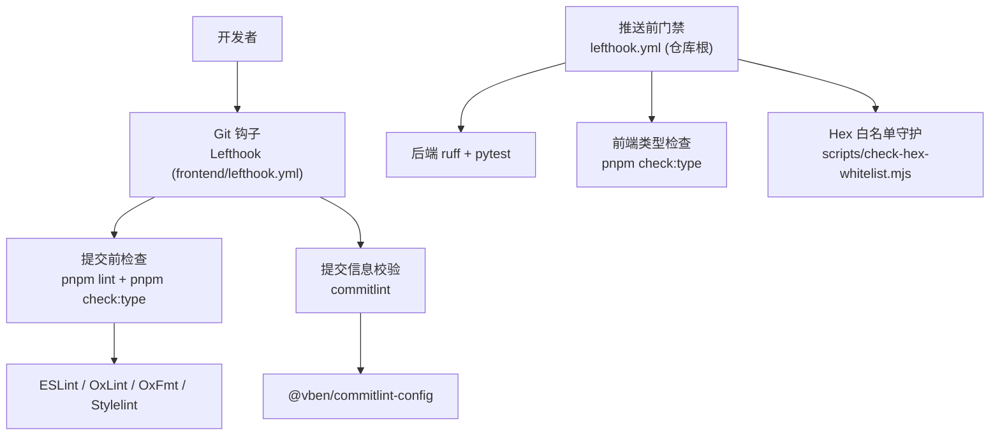
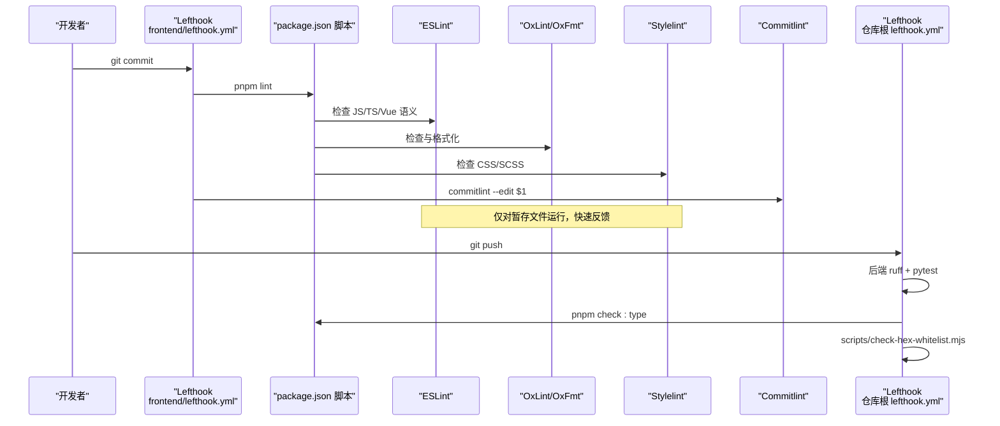
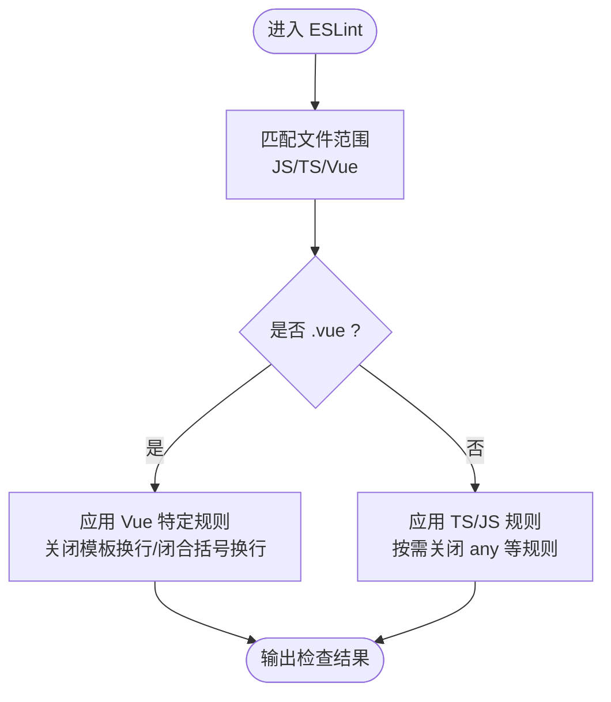
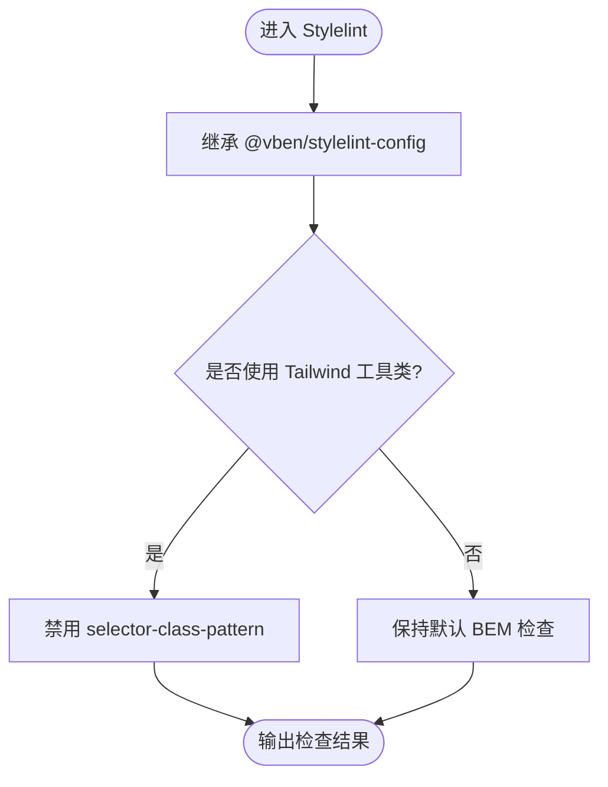
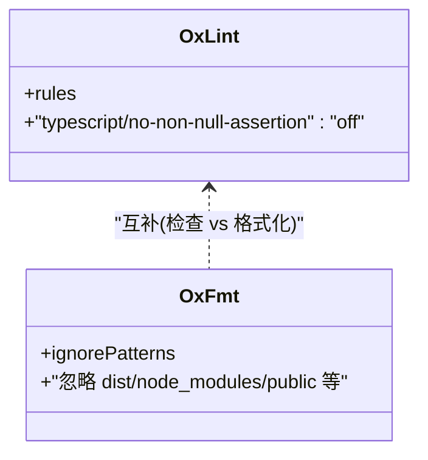
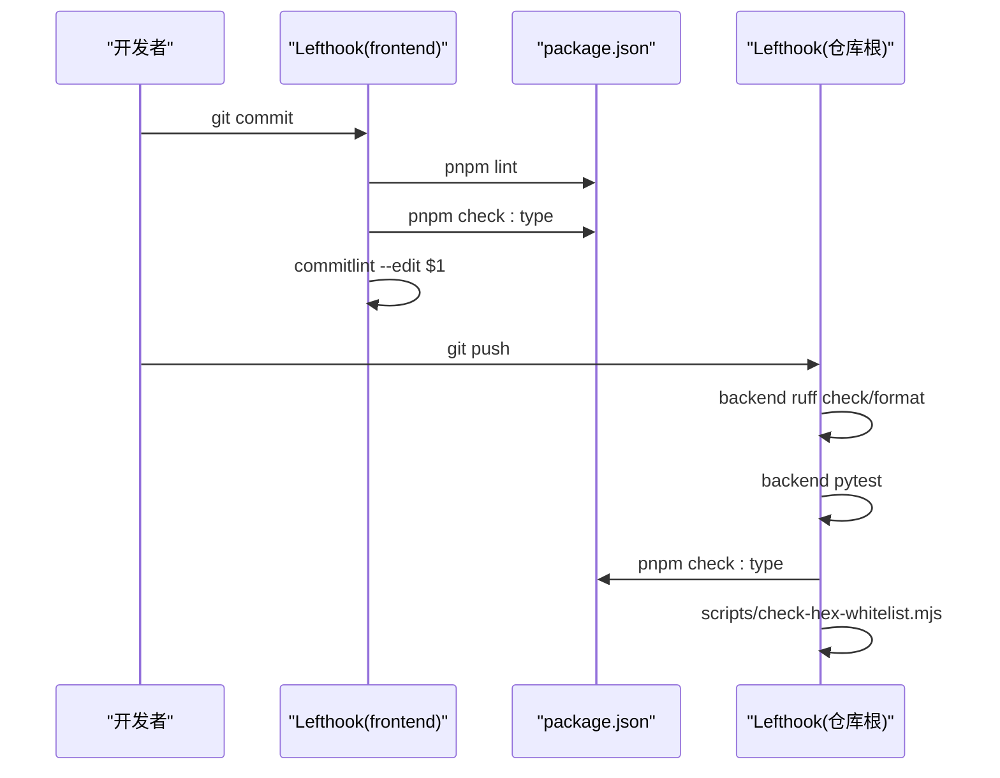
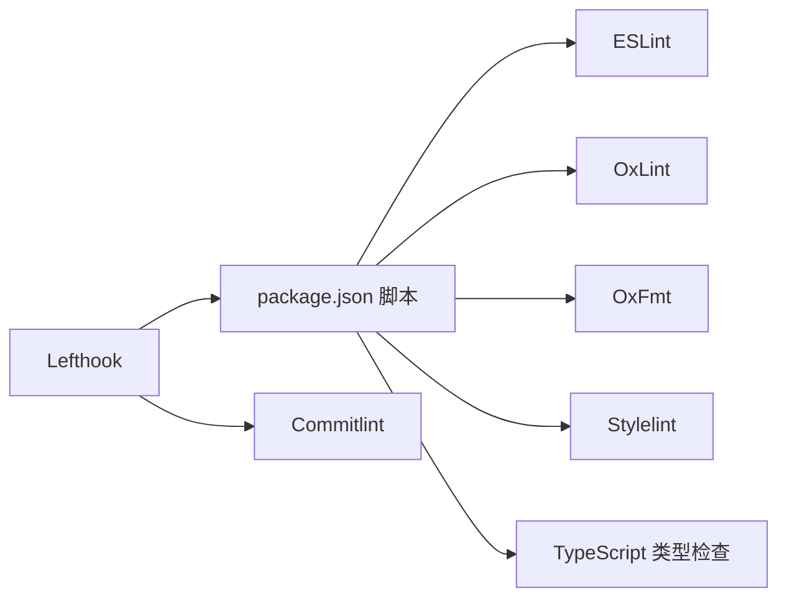

# 质量保障配置

<cite>
**本文引用的文件**
- [frontend/eslint.config.mjs](file://frontend/eslint.config.mjs)
- [frontend/stylelint.config.mjs](file://frontend/stylelint.config.mjs)
- [frontend/lefthook.yml](file://frontend/lefthook.yml)
- [lefthook.yml](file://lefthook.yml)
- [frontend/package.json](file://frontend/package.json)
- [frontend/.commitlintrc.js](file://frontend/.commitlintrc.js)
- [frontend/oxlint.config.ts](file://frontend/oxlint.config.ts)
- [frontend/oxfmt.config.ts](file://frontend/oxfmt.config.ts)
</cite>

## 目录
1. [简介](#简介)
2. [项目结构](#项目结构)
3. [核心组件](#核心组件)
4. [架构总览](#架构总览)
5. [详细组件分析](#详细组件分析)
6. [依赖关系分析](#依赖关系分析)
7. [性能与可维护性建议](#性能与可维护性建议)
8. [故障排查指南](#故障排查指南)
9. [结论](#结论)
10. [附录：工作流集成示例](#附录工作流集成示例)

## 简介
本文件面向前端工程化质量保障体系，系统性说明 ESLint、Stylelint、Git Hooks（Lefthook）、Commitlint、OxLint/OxFmt 等工具在仓库中的职责边界、规则策略与集成方式。目标是帮助开发者快速理解并正确配置本地与 CI 的检查流程，确保 JavaScript/TypeScript、Vue 模板、CSS/SCSS 的规范统一，并通过提交前检查与自动化流程降低代码缺陷率。

## 项目结构
前端质量保障相关配置集中在 frontend 根目录与仓库根目录：
- 代码风格与语法检查：ESLint、OxLint、OxFmt、Stylelint
- 提交信息规范：Commitlint
- Git 钩子：Lefthook（前端与仓库根各一份）
- 脚本入口：package.json 中提供 lint、check:type、format 等命令

图表来源
- [frontend/lefthook.yml:44-60](file://frontend/lefthook.yml#L44-L60)
- [lefthook.yml:7-23](file://lefthook.yml#L7-L23)
- [frontend/package.json:27-58](file://frontend/package.json#L27-L58)

章节来源
- [frontend/lefthook.yml:44-60](file://frontend/lefthook.yml#L44-L60)
- [lefthook.yml:7-23](file://lefthook.yml#L7-L23)
- [frontend/package.json:27-58](file://frontend/package.json#L27-L58)

## 核心组件
- ESLint：基于 @vben/eslint-config 的统一 JS/TS/Vue 语义检查；针对 Vue 模板布局交由 OxFmt 处理，ESLint 专注语义规则。
- Stylelint：基于 @vben/stylelint-config 的样式规范；为兼容 Tailwind 工具类关闭了严格的 BEM 选择器命名限制。
- OxLint/OxFmt：高性能 JS/TS 检查与格式化；对历史遗留的非空断言做宽松策略，避免阻塞开发。
- Commitlint：通过 @vben/commitlint-config 统一提交信息格式。
- Lefthook：在 pre-commit 阶段并行执行 lint 与类型检查；在 commit-msg 阶段执行 commitlint；在 pre-push 阶段执行更严格的全量门禁（含后端与前端）。

章节来源
- [frontend/eslint.config.mjs:1-18](file://frontend/eslint.config.mjs#L1-L18)
- [frontend/stylelint.config.mjs:1-9](file://frontend/stylelint.config.mjs#L1-L9)
- [frontend/oxlint.config.ts:1-10](file://frontend/oxlint.config.ts#L1-L10)
- [frontend/oxfmt.config.ts:1-27](file://frontend/oxfmt.config.ts#L1-L27)
- [frontend/.commitlintrc.js:1-2](file://frontend/.commitlintrc.js#L1-L2)
- [frontend/lefthook.yml:44-60](file://frontend/lefthook.yml#L44-L60)
- [lefthook.yml:7-23](file://lefthook.yml#L7-L23)

## 架构总览
下图展示了从开发者提交到本地与远程门禁的完整链路，以及各工具的协作关系。

图表来源
- [frontend/lefthook.yml:44-60](file://frontend/lefthook.yml#L44-L60)
- [lefthook.yml:7-23](file://lefthook.yml#L7-L23)
- [frontend/package.json:27-58](file://frontend/package.json#L27-L58)

## 详细组件分析

### ESLint 规则配置（JavaScript/TypeScript/Vue）
- 基础配置来自 @vben/eslint-config，聚焦语义规则。
- 针对 .vue 文件，关闭模板布局相关规则，将排版交给 OxFmt，减少重复检查。
- 针对 TS 文件，按需关闭严格规则（如 no-explicit-any），以适配业务现状。

图表来源
- [frontend/eslint.config.mjs:3-17](file://frontend/eslint.config.mjs#L3-L17)

章节来源
- [frontend/eslint.config.mjs:1-18](file://frontend/eslint.config.mjs#L1-L18)

### Stylelint 样式检查（CSS/SCSS）
- 继承 @vben/stylelint-config，统一样式规范。
- 为兼容 Tailwind 工具类（如带斜杠的变体写法），关闭 selector-class-pattern 的 BEM 强制要求，避免误报。

图表来源
- [frontend/stylelint.config.mjs:1-9](file://frontend/stylelint.config.mjs#L1-L9)

章节来源
- [frontend/stylelint.config.mjs:1-9](file://frontend/stylelint.config.mjs#L1-L9)

### OxLint 与 OxFmt（检查与格式化）
- OxLint：用于 JS/TS 静态检查；对历史遗留的大量非空断言暂时关闭对应规则，降低迁移成本。
- OxFmt：负责代码格式化；通过 ignorePatterns 排除构建产物、锁文件、公共静态资源等，提升扫描效率。

图表来源
- [frontend/oxlint.config.ts:1-10](file://frontend/oxlint.config.ts#L1-L10)
- [frontend/oxfmt.config.ts:1-27](file://frontend/oxfmt.config.ts#L1-L27)

章节来源
- [frontend/oxlint.config.ts:1-10](file://frontend/oxlint.config.ts#L1-L10)
- [frontend/oxfmt.config.ts:1-27](file://frontend/oxfmt.config.ts#L1-L27)

### Git Hooks 集成（Lefthook）
- 前端 lefthook.yml：
  - pre-commit：并行执行 pnpm lint 与 pnpm check:type，快速反馈问题。
  - post-merge：自动安装依赖，保证环境一致。
  - commit-msg：执行 commitlint 校验提交信息。
- 仓库根 lefthook.yml：
  - pre-push：串行执行后端 ruff 检查与格式化、pytest 测试、前端类型检查、hex 白名单守护，作为合并前的最终门禁。

图表来源
- [frontend/lefthook.yml:44-60](file://frontend/lefthook.yml#L44-L60)
- [lefthook.yml:7-23](file://lefthook.yml#L7-L23)
- [frontend/package.json:27-58](file://frontend/package.json#L27-L58)

章节来源
- [frontend/lefthook.yml:44-60](file://frontend/lefthook.yml#L44-L60)
- [lefthook.yml:7-23](file://lefthook.yml#L7-L23)
- [frontend/package.json:27-58](file://frontend/package.json#L27-L58)

### Commitlint（提交信息规范）
- 通过 .commitlintrc.js 引入 @vben/commitlint-config，统一团队提交信息格式，便于自动生成变更日志与版本管理。

章节来源
- [frontend/.commitlintrc.js:1-2](file://frontend/.commitlintrc.js#L1-L2)

## 依赖关系分析
- 脚本与工具链：
  - package.json 提供 lint、check:type、format 等命令，串联 ESLint、OxLint、OxFmt、Stylelint、TypeScript 类型检查。
  - lefthook.yml 在合适时机调用这些脚本，形成“提交前快速检查 + 推送前全量门禁”的分层策略。
- 外部配置包：
  - @vben/eslint-config、@vben/stylelint-config、@vben/commitlint-config、@vben/oxfmt-config 提供团队级统一规则。

图表来源
- [frontend/package.json:27-58](file://frontend/package.json#L27-L58)
- [frontend/lefthook.yml:44-60](file://frontend/lefthook.yml#L44-L60)

章节来源
- [frontend/package.json:27-58](file://frontend/package.json#L27-L58)
- [frontend/lefthook.yml:44-60](file://frontend/lefthook.yml#L44-L60)

## 性能与可维护性建议
- 分层检查：提交前只做增量检查（staged files），推送前再执行全量检查，兼顾速度与质量。
- 规则渐进收紧：对历史债务采用“先放开、后治理”的策略（如 no-non-null-assertion、no-explicit-any），逐步推进。
- 格式化与检查解耦：OxFmt 负责排版，ESLint/OxLint 专注语义，避免重复与冲突。
- 忽略无关文件：OxFmt 明确忽略构建产物与锁文件，减少无效扫描。

[本节为通用建议，不直接分析具体文件]

## 故障排查指南
- 提交被拦截（pre-commit）：
  - 查看 pnpm lint 与 pnpm check:type 的输出，定位 ESLint/OxLint/Stylelint/类型错误。
  - 若为 Vue 模板换行或闭合括号问题，优先使用 OxFmt 格式化后再提交。
- 提交信息被拒绝（commit-msg）：
  - 根据 commitlint 提示修正提交信息格式（如 feat/fix 前缀等）。
- 推送失败（pre-push）：
  - 按顺序检查后端 ruff、pytest、前端类型检查与 hex 白名单守护结果，逐项修复。
- 规则误报：
  - 确认是否在对应配置文件中有覆盖（如 stylelint 的 selector-class-pattern、eslint 的 Vue 模板规则、oxlint 的非空断言）。

章节来源
- [frontend/lefthook.yml:44-60](file://frontend/lefthook.yml#L44-L60)
- [lefthook.yml:7-23](file://lefthook.yml#L7-L23)
- [frontend/stylelint.config.mjs:1-9](file://frontend/stylelint.config.mjs#L1-L9)
- [frontend/eslint.config.mjs:1-18](file://frontend/eslint.config.mjs#L1-L18)
- [frontend/oxlint.config.ts:1-10](file://frontend/oxlint.config.ts#L1-L10)

## 结论
本项目通过 Lefthook 将 ESLint、Stylelint、OxLint/OxFmt、TypeScript 类型检查与 Commitlint 串联成完整的本地与远程质量门禁。遵循“提交前快速反馈、推送前全量把关”的原则，既保证了开发体验，又确保了代码质量与一致性。建议在后续迭代中持续收敛规则、完善忽略策略，并配合自动化脚本进一步缩短反馈周期。

[本节为总结性内容，不直接分析具体文件]

## 附录：工作流集成示例
- 本地开发
  - 安装依赖后会自动安装 Lefthook 钩子。
  - 提交前：pnpm lint + pnpm check:type + commitlint。
  - 推送前：触发仓库根 lefthook.yml 的后端与前端全量检查。
- 推荐实践
  - 修改代码后先运行 pnpm format 进行格式化，再提交。
  - 遇到样式命名问题，优先调整 Tailwind 用法或评估是否需要在 stylelint 中新增例外。
  - 新增规则时，先在单文件验证影响面，再全局推广。

章节来源
- [frontend/package.json:27-58](file://frontend/package.json#L27-L58)
- [frontend/lefthook.yml:44-60](file://frontend/lefthook.yml#L44-L60)
- [lefthook.yml:7-23](file://lefthook.yml#L7-L23)