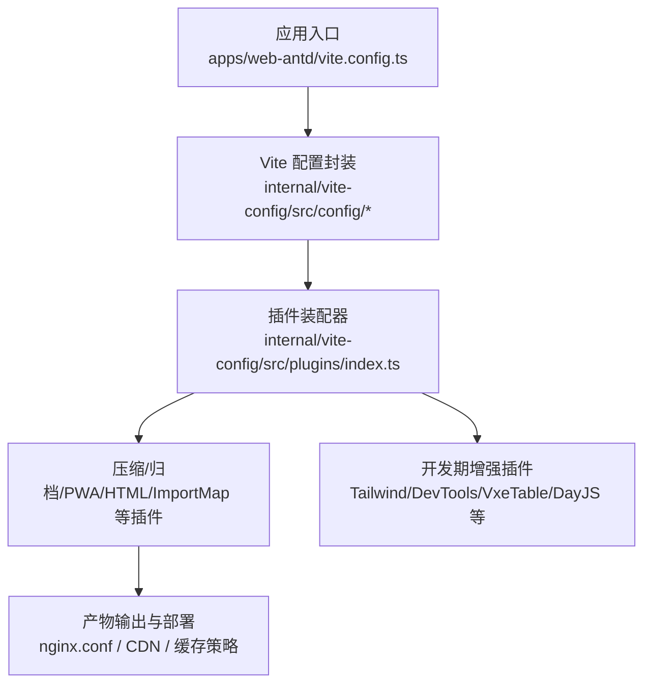
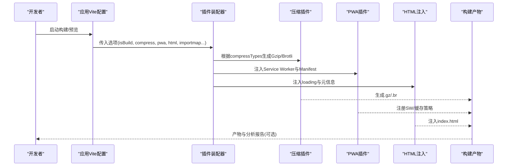
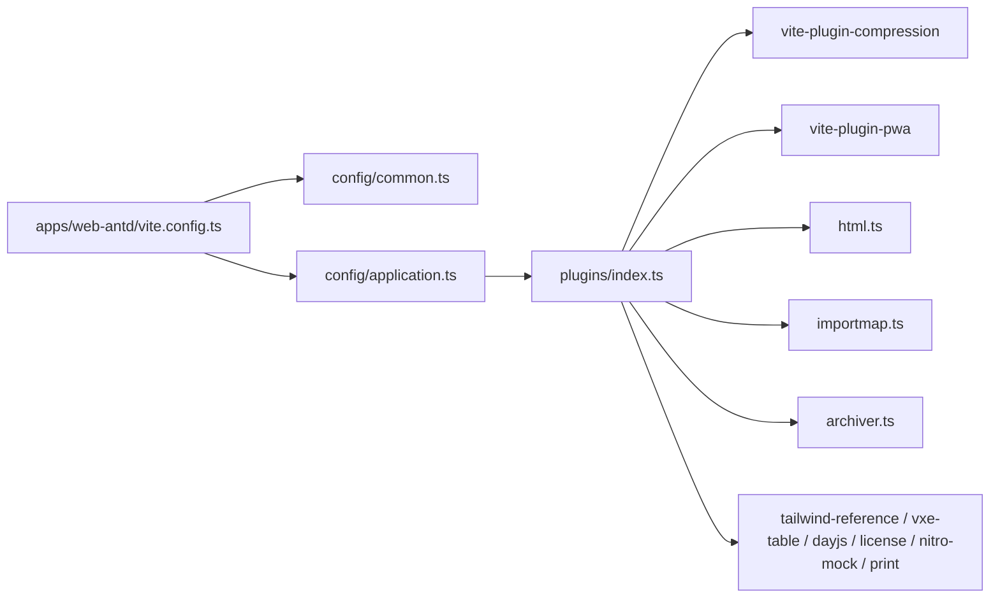

# 资源优化配置

<cite>
**本文引用的文件**
- [frontend/apps/web-antd/vite.config.ts](file://frontend/apps/web-antd/vite.config.ts)
- [frontend/internal/vite-config/src/plugins/index.ts](file://frontend/internal/vite-config/src/plugins/index.ts)
- [frontend/package.json](file://frontend/package.json)
- [frontend/apps/web-antd/package.json](file://frontend/apps/web-antd/package.json)
- [frontend/internal/vite-config/src/plugins/inject-app-loading/default-loading.html](file://frontend/internal/vite-config/src/plugins/inject-app-loading/default-loading.html)
- [frontend/internal/vite-config/src/plugins/inject-app-loading/default-loading-antd.html](file://frontend/internal/vite-config/src/plugins/inject-app-loading/default-loading-antd.html)
- [frontend/internal/vite-config/src/plugins/html.ts](file://frontend/internal/vite-config/src/plugins/html.ts)
- [frontend/internal/vite-config/src/plugins/importmap.ts](file://frontend/internal/vite-config/src/plugins/importmap.ts)
- [frontend/internal/vite-config/src/plugins/archiver.ts](file://frontend/internal/vite-config/src/plugins/archiver.ts)
- [frontend/internal/vite-config/src/plugins/extra-app-config.ts](file://frontend/internal/vite-config/src/plugins/extra-app-config.ts)
- [frontend/internal/vite-config/src/plugins/dayjs.ts](file://frontend/internal/vite-config/src/plugins/dayjs.ts)
- [frontend/internal/vite-config/src/plugins/license.ts](file://frontend/internal/vite-config/src/plugins/license.ts)
- [frontend/internal/vite-config/src/plugins/nitro-mock.ts](file://frontend/internal/vite-config/src/plugins/nitro-mock.ts)
- [frontend/internal/vite-config/src/plugins/print.ts](file://frontend/internal/vite-config/src/plugins/print.ts)
- [frontend/internal/vite-config/src/plugins/tailwind-reference.ts](file://frontend/internal/vite-config/src/plugins/tailwind-reference.ts)
- [frontend/internal/vite-config/src/plugins/vxe-table.ts](file://frontend/internal/vite-config/src/plugins/vxe-table.ts)
- [frontend/internal/vite-config/src/config/application.ts](file://frontend/internal/vite-config/src/config/application.ts)
- [frontend/internal/vite-config/src/config/common.ts](file://frontend/internal/vite-config/src/config/common.ts)
- [frontend/internal/vite-config/src/config/library.ts](file://frontend/internal/vite-config/src/config/library.ts)
- [frontend/internal/vite-config/src/options.ts](file://frontend/internal/vite-config/src/options.ts)
- [frontend/internal/vite-config/src/utils/env.ts](file://frontend/internal/vite-config/src/utils/env.ts)
- [deploy/nginx.conf](file://deploy/nginx.conf)
</cite>

## 目录
1. [简介](#简介)
2. [项目结构](#项目结构)
3. [核心组件](#核心组件)
4. [架构总览](#架构总览)
5. [详细组件分析](#详细组件分析)
6. [依赖关系分析](#依赖关系分析)
7. [性能考量](#性能考量)
8. [故障排查指南](#故障排查指南)
9. [结论](#结论)
10. [附录](#附录)

## 简介
本技术文档聚焦前端资源优化配置，围绕图片资源优化、字体文件优化、静态资源管理（CDN、版本控制、缓存策略）、构建时优化（内联、Base64、去重）等主题，结合仓库中的 Vite 插件体系与部署配置，提供可操作的优化方案与性能测试方法。目标是帮助开发者在保持可维护性的前提下，最大化首屏加载与交互性能。

## 项目结构
本项目采用 monorepo 组织方式，前端应用位于 frontend/apps/web-antd，统一通过 internal/vite-config 提供的 Vite 配置与插件进行构建与优化。应用级 vite.config.ts 仅做最小化接入，具体能力由内部包集中管理，便于跨应用复用与治理。

图表来源
- [frontend/apps/web-antd/vite.config.ts:1-24](file://frontend/apps/web-antd/vite.config.ts#L1-L24)
- [frontend/internal/vite-config/src/plugins/index.ts:1-262](file://frontend/internal/vite-config/src/plugins/index.ts#L1-L262)
- [frontend/internal/vite-config/src/config/application.ts](file://frontend/internal/vite-config/src/config/application.ts)
- [frontend/internal/vite-config/src/config/common.ts](file://frontend/internal/vite-config/src/config/common.ts)
- [frontend/internal/vite-config/src/config/library.ts](file://frontend/internal/vite-config/src/config/library.ts)

章节来源
- [frontend/apps/web-antd/vite.config.ts:1-24](file://frontend/apps/web-antd/vite.config.ts#L1-L24)
- [frontend/internal/vite-config/src/plugins/index.ts:1-262](file://frontend/internal/vite-config/src/plugins/index.ts#L1-L262)
- [frontend/package.json:27-59](file://frontend/package.json#L27-L59)
- [frontend/apps/web-antd/package.json:18-29](file://frontend/apps/web-antd/package.json#L18-L29)

## 核心组件
- 应用级 Vite 配置：负责开发代理、模式切换与最小化接入。
- 插件装配器：按条件启用压缩、PWA、HTML 注入、Import Map、归档打包等能力。
- HTML 注入与加载体验：支持注入默认 loading 页面与元信息。
- 构建产物优化：Gzip/Brotli 压缩、可视化分析、按需引入与依赖裁剪。
- 部署与缓存：通过 Nginx 配置实现静态资源缓存与 CDN 对接。

章节来源
- [frontend/apps/web-antd/vite.config.ts:1-24](file://frontend/apps/web-antd/vite.config.ts#L1-L24)
- [frontend/internal/vite-config/src/plugins/index.ts:102-228](file://frontend/internal/vite-config/src/plugins/index.ts#L102-L228)
- [frontend/internal/vite-config/src/plugins/html.ts](file://frontend/internal/vite-config/src/plugins/html.ts)
- [frontend/internal/vite-config/src/plugins/inject-app-loading/default-loading.html](file://frontend/internal/vite-config/src/plugins/inject-app-loading/default-loading.html)
- [frontend/internal/vite-config/src/plugins/inject-app-loading/default-loading-antd.html](file://frontend/internal/vite-config/src/plugins/inject-app-loading/default-loading-antd.html)

## 架构总览
下图展示了从应用配置到构建产物的关键路径，以及各优化插件的协作关系。

图表来源
- [frontend/internal/vite-config/src/plugins/index.ts:169-228](file://frontend/internal/vite-config/src/plugins/index.ts#L169-L228)
- [frontend/internal/vite-config/src/plugins/html.ts](file://frontend/internal/vite-config/src/plugins/html.ts)
- [frontend/internal/vite-config/src/plugins/inject-app-loading/default-loading.html](file://frontend/internal/vite-config/src/plugins/inject-app-loading/default-loading.html)

## 详细组件分析

### 图片资源优化
- 自动压缩与格式转换
  - 当前插件体系未直接内置图片压缩/格式转换插件。建议在生产构建中引入图片处理插件（如基于 imagemin 或 esbuild 的图片优化），将 PNG/JPG/WebP 互转并压缩，减少体积。
  - 对大图使用响应式 srcset 与懒加载，避免首屏阻塞。
- 懒加载实现
  - 在业务层使用 IntersectionObserver 或浏览器原生 loading="lazy"，配合图片占位图提升感知性能。
  - 对于动态导入的图片，确保不被过早打包进主包，优先走异步 chunk。

适用场景
- 首屏图片较多且体积较大时，优先启用懒加载与 WebP 替代。
- 长列表或滚动页面，务必懒加载非可视区图片。

注意事项
- 若启用 CDN，需确保 CDN 支持现代格式（WebP/AVIF）并按 Accept 头返回最优格式。
- 注意移动端网络差异，合理设置图片尺寸与 DPR。

[本节为通用实践说明，不直接分析具体代码文件]

### 字体文件优化
- 字体子集化
  - 针对中文字体，建议使用子集化工具仅打包所需字符，显著减小体积。
- woff2 转换
  - 将 TTF/OTF 转换为 woff2，获得更高压缩率与现代浏览器兼容性。
- 字体预加载
  - 在 HTML 中使用 link rel="preload" 预加载关键字体，避免首屏闪烁。
  - 结合 font-display 策略（swap/fallback）改善首次渲染体验。

适用场景
- 包含大量中文文本的应用，子集化收益明显。
- 首屏需要立即显示标题或品牌字体的页面，应预加载关键字体。

注意事项
- 多字体或多字重时，按需拆分 chunk，避免一次性下载全部字体。
- 若使用 CDN，开启 gzip/brotli 并设置长期缓存。

[本节为通用实践说明，不直接分析具体代码文件]

### 静态资源管理（CDN、版本控制、缓存策略）
- CDN 配置
  - 将静态资源托管至 CDN，利用边缘节点就近分发，降低延迟。
  - 在 HTML 中引用资源时使用绝对 CDN 地址，或通过环境变量注入 base URL。
- 版本控制
  - 构建产物文件名加入内容哈希，利于浏览器与 CDN 长期缓存。
  - 通过 Import Map 或运行时配置管理第三方库版本，避免重复加载。
- 缓存策略
  - 对静态资源设置强缓存（Cache-Control: max-age=31536000, immutable），并通过文件名变更触发更新。
  - 对 index.html 设置短缓存或 no-cache，保证应用更新及时生效。

部署参考
- Nginx 可通过 location 匹配静态资源路径，设置 Cache-Control 与 expires；对 HTML 单独配置缓存策略。

章节来源
- [deploy/nginx.conf](file://deploy/nginx.conf)

### 构建时优化（资源内联、Base64 编码、文件去重）
- 资源内联
  - 小图标或小样式可内联至 HTML/CSS，减少请求数。
  - 通过构建工具的内联规则控制阈值，避免过大资源被内联。
- Base64 编码
  - 谨慎使用 Base64，仅在极小资源且频繁请求的场景考虑，避免增大 JS/CSS 体积。
- 文件去重
  - 使用依赖分析与 Tree Shaking 去除未使用代码。
  - 通过 Import Map 锁定第三方库版本，避免重复打包。
  - 使用构建分析工具定位重复依赖并合并。

章节来源
- [frontend/internal/vite-config/src/plugins/importmap.ts](file://frontend/internal/vite-config/src/plugins/importmap.ts)
- [frontend/internal/vite-config/src/plugins/index.ts:80-88](file://frontend/internal/vite-config/src/plugins/index.ts#L80-L88)

### 压缩与归档
- Gzip/Brotli 压缩
  - 构建时生成 .gz/.br 文件，由服务器或 CDN 按需返回，显著降低传输体积。
- 归档打包
  - 支持将产物打包为压缩包，便于发布与回滚。

章节来源
- [frontend/internal/vite-config/src/plugins/index.ts:186-200](file://frontend/internal/vite-config/src/plugins/index.ts#L186-L200)
- [frontend/internal/vite-config/src/plugins/archiver.ts](file://frontend/internal/vite-config/src/plugins/archiver.ts)

### PWA 与离线缓存
- Service Worker 注入
  - 通过 PWA 插件注入 SW，结合 Workbox 策略对静态资源进行缓存。
- Manifest 配置
  - 定义应用名称、主题色、启动页等，提升安装体验。

章节来源
- [frontend/internal/vite-config/src/plugins/index.ts:169-184](file://frontend/internal/vite-config/src/plugins/index.ts#L169-L184)

### HTML 注入与加载体验
- 注入默认 loading 页面
  - 构建时注入轻量 loading 页面，提升首屏感知。
- 元信息与 SEO
  - 注入 title、meta 标签与 Open Graph 信息，改善分享与搜索引擎收录。

章节来源
- [frontend/internal/vite-config/src/plugins/html.ts](file://frontend/internal/vite-config/src/plugins/html.ts)
- [frontend/internal/vite-config/src/plugins/inject-app-loading/default-loading.html](file://frontend/internal/vite-config/src/plugins/inject-app-loading/default-loading.html)
- [frontend/internal/vite-config/src/plugins/inject-app-loading/default-loading-antd.html](file://frontend/internal/vite-config/src/plugins/inject-app-loading/default-loading-antd.html)

### 其他构建期增强
- Tailwind 引用与样式优化
  - 自动生成样式引用，减少冗余 CSS。
- VxeTable 按需引入
  - 按需引入表格组件，减少包体。
- DayJS 本地化裁剪
  - 仅引入必要语言包，减小体积。
- License 注入
  - 构建时注入许可证信息，便于合规审计。
- Nitro Mock
  - 开发期模拟后端接口，提升联调效率。
- 打印信息
  - 构建后打印关键统计信息，辅助性能评估。

章节来源
- [frontend/internal/vite-config/src/plugins/tailwind-reference.ts](file://frontend/internal/vite-config/src/plugins/tailwind-reference.ts)
- [frontend/internal/vite-config/src/plugins/vxe-table.ts](file://frontend/internal/vite-config/src/plugins/vxe-table.ts)
- [frontend/internal/vite-config/src/plugins/dayjs.ts](file://frontend/internal/vite-config/src/plugins/dayjs.ts)
- [frontend/internal/vite-config/src/plugins/license.ts](file://frontend/internal/vite-config/src/plugins/license.ts)
- [frontend/internal/vite-config/src/plugins/nitro-mock.ts](file://frontend/internal/vite-config/src/plugins/nitro-mock.ts)
- [frontend/internal/vite-config/src/plugins/print.ts](file://frontend/internal/vite-config/src/plugins/print.ts)

## 依赖关系分析
插件装配器集中管理所有构建期能力，应用仅需通过 options 开关启用。这种设计降低了耦合度，提升了可维护性。

图表来源
- [frontend/apps/web-antd/vite.config.ts:1-24](file://frontend/apps/web-antd/vite.config.ts#L1-L24)
- [frontend/internal/vite-config/src/plugins/index.ts:1-262](file://frontend/internal/vite-config/src/plugins/index.ts#L1-L262)
- [frontend/internal/vite-config/src/config/application.ts](file://frontend/internal/vite-config/src/config/application.ts)
- [frontend/internal/vite-config/src/config/common.ts](file://frontend/internal/vite-config/src/config/common.ts)

章节来源
- [frontend/internal/vite-config/src/plugins/index.ts:1-262](file://frontend/internal/vite-config/src/plugins/index.ts#L1-L262)
- [frontend/internal/vite-config/src/config/application.ts](file://frontend/internal/vite-config/src/config/application.ts)
- [frontend/internal/vite-config/src/config/common.ts](file://frontend/internal/vite-config/src/config/common.ts)

## 性能考量
- 首屏时间（FCP/LCP）
  - 启用 Gzip/Brotli 压缩，减少传输体积。
  - 对关键资源（字体、首屏图片）使用 preload/prefetch。
  - 使用懒加载与虚拟滚动减少首屏渲染压力。
- 缓存命中
  - 静态资源加内容哈希并设置长期缓存；HTML 短缓存或 no-cache。
  - CDN 开启 HTTP/2 与缓存预热。
- 包体大小
  - 使用构建分析工具定位大依赖，按需引入与去重。
  - 通过 Import Map 锁定第三方库版本，避免重复。
- 网络与并发
  - 合并小请求，避免过多小文件导致连接开销。
  - 合理使用预连接（preconnect）与 DNS 预解析。

[本节为通用指导，不直接分析具体代码文件]

## 故障排查指南
- 构建体积异常增大
  - 检查是否误将大资源内联或 Base64。
  - 使用可视化分析定位重复依赖与大模块。
- 缓存未生效
  - 确认 Nginx/CDN 的 Cache-Control 配置是否正确。
  - 检查 HTML 是否被缓存导致无法获取最新资源。
- 字体闪烁或加载失败
  - 检查字体子集与 woff2 转换是否正确。
  - 确认 preload 与 font-display 策略是否合理。
- PWA 不工作
  - 检查 SW 是否成功注册，Manifest 是否完整。
  - 确认 HTTPS 环境与域名正确。

章节来源
- [deploy/nginx.conf](file://deploy/nginx.conf)
- [frontend/internal/vite-config/src/plugins/index.ts:169-228](file://frontend/internal/vite-config/src/plugins/index.ts#L169-L228)

## 结论
本项目通过统一的 Vite 插件体系实现了构建期压缩、PWA、HTML 注入、Import Map 等核心优化能力。结合 CDN、版本控制与缓存策略，可显著提升前端资源的加载性能与可维护性。建议在业务层补充图片懒加载与字体子集化，进一步降低首屏时间与带宽消耗。

[本节为总结性内容，不直接分析具体代码文件]

## 附录
- 常用脚本
  - 构建与分析：见 package.json 中的 build 与 build:analyze 命令。
- 相关配置
  - 应用级 Vite 配置：apps/web-antd/vite.config.ts
  - 插件装配器：internal/vite-config/src/plugins/index.ts
  - HTML 注入模板：internal/vite-config/src/plugins/inject-app-loading/*.html
  - 部署缓存：deploy/nginx.conf

章节来源
- [frontend/package.json:27-59](file://frontend/package.json#L27-L59)
- [frontend/apps/web-antd/package.json:18-29](file://frontend/apps/web-antd/package.json#L18-L29)
- [frontend/apps/web-antd/vite.config.ts:1-24](file://frontend/apps/web-antd/vite.config.ts#L1-L24)
- [frontend/internal/vite-config/src/plugins/index.ts:1-262](file://frontend/internal/vite-config/src/plugins/index.ts#L1-L262)
- [frontend/internal/vite-config/src/plugins/inject-app-loading/default-loading.html](file://frontend/internal/vite-config/src/plugins/inject-app-loading/default-loading.html)
- [frontend/internal/vite-config/src/plugins/inject-app-loading/default-loading-antd.html](file://frontend/internal/vite-config/src/plugins/inject-app-loading/default-loading-antd.html)
- [deploy/nginx.conf](file://deploy/nginx.conf)