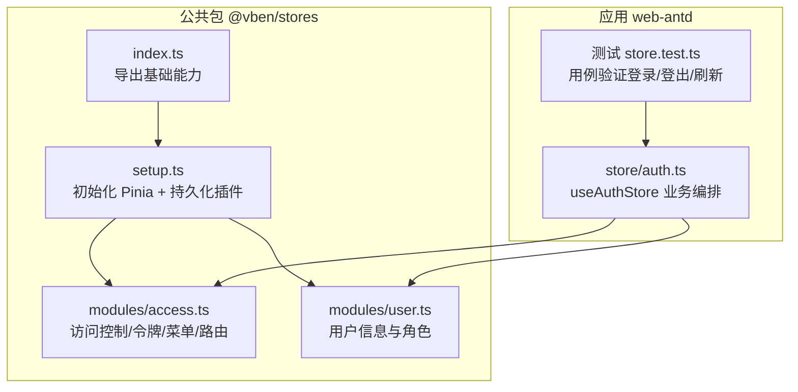
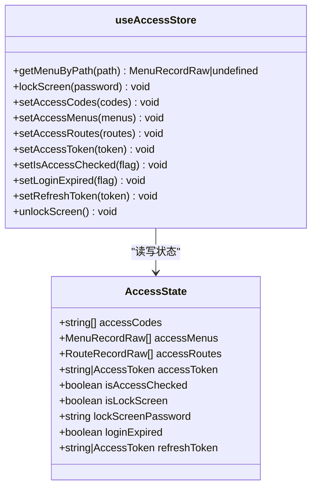
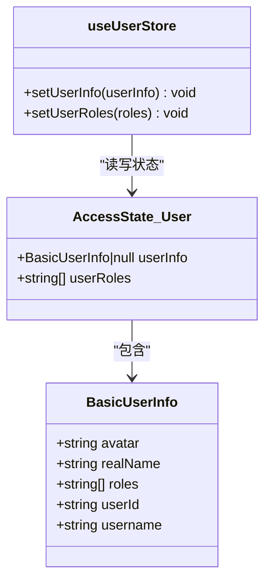
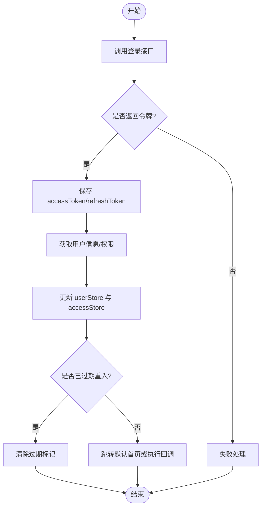
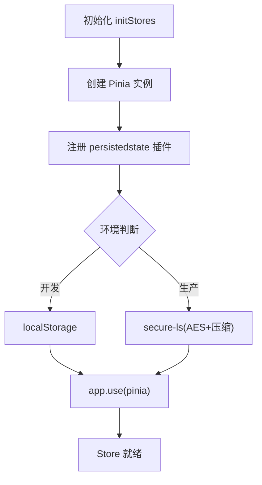
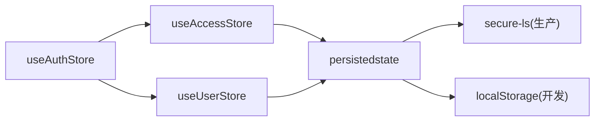

# Pinia Store 架构

<cite>
**本文引用的文件**
- [frontend/packages/stores/src/index.ts](file://frontend/packages/stores/src/index.ts)
- [frontend/packages/stores/src/setup.ts](file://frontend/packages/stores/src/setup.ts)
- [frontend/packages/stores/src/modules/access.ts](file://frontend/packages/stores/src/modules/access.ts)
- [frontend/packages/stores/src/modules/user.ts](file://frontend/packages/stores/src/modules/user.ts)
- [frontend/apps/web-antd/src/store/auth.ts](file://frontend/apps/web-antd/src/store/auth.ts)
- [frontend/apps/web-antd/src/__tests__/store.test.ts](file://frontend/apps/web-antd/src/__tests__/store.test.ts)
</cite>

## 目录
1. [简介](#简介)
2. [项目结构](#项目结构)
3. [核心组件](#核心组件)
4. [架构总览](#架构总览)
5. [详细组件分析](#详细组件分析)
6. [依赖关系分析](#依赖关系分析)
7. [性能考虑](#性能考虑)
8. [故障排查指南](#故障排查指南)
9. [结论](#结论)
10. [附录](#附录)

## 简介
本技术文档围绕前端仓库中的 Pinia Store 架构，系统性阐述全局状态管理设计、认证状态管理、Store 生命周期与持久化策略，并给出调试、监控与错误处理的最佳实践。重点覆盖：
- Store 模块化组织与类型安全配置
- 认证流程（登录态、权限信息、会话持久化）
- Store 初始化、响应式更新与销毁清理
- 持久化策略（加密的 localStorage、跨标签页同步方案建议）
- 调试工具使用、性能监控与错误处理机制

## 项目结构
本项目将 Pinia Store 能力封装在公共包中，并在业务应用中按需扩展：
- 公共包 @vben/stores
  - 导出 defineStore、storeToRefs 等基础能力
  - 提供 initStores 初始化函数，集成 pinia-plugin-persistedstate 与 secure-ls 实现安全持久化
  - 定义通用模块：access（访问控制/令牌）、user（用户信息）
- 应用层 web-antd
  - 基于公共包扩展业务 Store（如 useAuthStore），编排登录、登出、刷新用户信息等流程
  - 通过路由守卫与请求拦截器联动 Store，完成鉴权与跳转



图表来源
- [frontend/packages/stores/src/index.ts:1-4](file://frontend/packages/stores/src/index.ts#L1-L4)
- [frontend/packages/stores/src/setup.ts:42-69](file://frontend/packages/stores/src/setup.ts#L42-L69)
- [frontend/packages/stores/src/modules/access.ts:51-123](file://frontend/packages/stores/src/modules/access.ts#L51-L123)
- [frontend/packages/stores/src/modules/user.ts:41-58](file://frontend/packages/stores/src/modules/user.ts#L41-L58)
- [frontend/apps/web-antd/src/store/auth.ts:46-205](file://frontend/apps/web-antd/src/store/auth.ts#L46-L205)

章节来源
- [frontend/packages/stores/src/index.ts:1-4](file://frontend/packages/stores/src/index.ts#L1-L4)
- [frontend/packages/stores/src/setup.ts:42-69](file://frontend/packages/stores/src/setup.ts#L42-L69)
- [frontend/packages/stores/src/modules/access.ts:51-123](file://frontend/packages/stores/src/modules/access.ts#L51-L123)
- [frontend/packages/stores/src/modules/user.ts:41-58](file://frontend/packages/stores/src/modules/user.ts#L41-L58)
- [frontend/apps/web-antd/src/store/auth.ts:46-205](file://frontend/apps/web-antd/src/store/auth.ts#L46-L205)

## 核心组件
- 初始化与持久化（initStores）
  - 创建 Pinia 实例并注册 persistedstate 插件
  - 生产环境使用 secure-ls 对存储进行 AES 加密与压缩；开发环境直接使用 localStorage
  - 支持命名空间前缀以避免多应用缓存冲突
- 访问控制 Store（useAccessStore）
  - 管理 accessToken、refreshToken、权限码、可访问菜单/路由、锁屏状态等
  - 通过 persist.pick 指定持久化字段
- 用户信息 Store（useUserStore）
  - 管理 userInfo、userRoles，并提供设置方法
- 业务认证 Store（useAuthStore）
  - 编排登录、获取用户信息、登出等流程
  - 与路由和请求拦截器协作，完成鉴权与跳转

章节来源
- [frontend/packages/stores/src/setup.ts:42-69](file://frontend/packages/stores/src/setup.ts#L42-L69)
- [frontend/packages/stores/src/modules/access.ts:51-123](file://frontend/packages/stores/src/modules/access.ts#L51-L123)
- [frontend/packages/stores/src/modules/user.ts:41-58](file://frontend/packages/stores/src/modules/user.ts#L41-L58)
- [frontend/apps/web-antd/src/store/auth.ts:46-205](file://frontend/apps/web-antd/src/store/auth.ts#L46-L205)

## 架构总览
下图展示了从页面触发登录到状态落库、再到路由跳转的完整时序，以及各 Store 之间的协作关系。

```mermaid
sequenceDiagram
participant UI as "界面/表单"
participant Auth as "useAuthStore"
participant Access as "useAccessStore"
participant User as "useUserStore"
participant API as "后端接口"
participant LS as "secure-ls/localStorage"
UI->>Auth : 调用 authLogin(用户名, 密码)
Auth->>API : 登录接口 (username/password)
API-->>Auth : {accessToken, refreshToken, user}
Auth->>Access : setAccessToken / setRefreshToken
Auth->>API : 获取用户信息 /auth/me
API-->>Auth : {role, permissions, defaultHome, ...}
Auth->>User : setUserInfo(userInfo)
Auth->>Access : setAccessCodes(permissions)
Note over Access,LS : 持久化插件自动写入(生产 : secure-ls; 开发 : localStorage)
Auth->>UI : 跳转首页或执行回调
```

图表来源
- [frontend/apps/web-antd/src/store/auth.ts:58-127](file://frontend/apps/web-antd/src/store/auth.ts#L58-L127)
- [frontend/packages/stores/src/modules/access.ts:85-96](file://frontend/packages/stores/src/modules/access.ts#L85-L96)
- [frontend/packages/stores/src/modules/user.ts:43-52](file://frontend/packages/stores/src/modules/user.ts#L43-L52)
- [frontend/packages/stores/src/setup.ts:42-69](file://frontend/packages/stores/src/setup.ts#L42-L69)

## 详细组件分析

### 访问控制 Store（useAccessStore）
- 职责
  - 维护令牌、权限码、可访问菜单/路由、锁屏状态、登录过期标记
  - 提供设置方法与查询方法（如按路径查找菜单）
- 持久化
  - 通过 persist.pick 仅持久化敏感且必要的字段：accessToken、refreshToken、accessCodes、isLockScreen、lockScreenPassword
- 类型安全
  - 使用 TypeScript 接口描述状态结构，确保强类型约束



图表来源
- [frontend/packages/stores/src/modules/access.ts:9-46](file://frontend/packages/stores/src/modules/access.ts#L9-L46)
- [frontend/packages/stores/src/modules/access.ts:51-123](file://frontend/packages/stores/src/modules/access.ts#L51-L123)

章节来源
- [frontend/packages/stores/src/modules/access.ts:9-46](file://frontend/packages/stores/src/modules/access.ts#L9-L46)
- [frontend/packages/stores/src/modules/access.ts:51-123](file://frontend/packages/stores/src/modules/access.ts#L51-L123)

### 用户信息 Store（useUserStore）
- 职责
  - 管理用户基本信息与角色列表
  - 提供设置用户信息与角色的动作
- 类型安全
  - BasicUserInfo 明确头像、昵称、角色、用户ID、用户名等字段



图表来源
- [frontend/packages/stores/src/modules/user.ts:3-25](file://frontend/packages/stores/src/modules/user.ts#L3-L25)
- [frontend/packages/stores/src/modules/user.ts:41-58](file://frontend/packages/stores/src/modules/user.ts#L41-L58)

章节来源
- [frontend/packages/stores/src/modules/user.ts:3-25](file://frontend/packages/stores/src/modules/user.ts#L3-L25)
- [frontend/packages/stores/src/modules/user.ts:41-58](file://frontend/packages/stores/src/modules/user.ts#L41-L58)

### 业务认证 Store（useAuthStore）
- 职责
  - 登录：调用登录接口，保存令牌，拉取用户信息与权限，计算默认首页并跳转
  - 登出：调用后端登出（若 token 有效），重置所有 Store，跳转登录页
  - 刷新用户信息：按需拉取最新用户数据并更新 Store
- 与路由/拦截器的协作
  - 登录成功后根据角色映射决定默认首页
  - 登出后清空状态并携带 redirect 参数回到登录页



图表来源
- [frontend/apps/web-antd/src/store/auth.ts:58-127](file://frontend/apps/web-antd/src/store/auth.ts#L58-L127)

章节来源
- [frontend/apps/web-antd/src/store/auth.ts:58-127](file://frontend/apps/web-antd/src/store/auth.ts#L58-L127)
- [frontend/apps/web-antd/src/store/auth.ts:151-171](file://frontend/apps/web-antd/src/store/auth.ts#L151-L171)
- [frontend/apps/web-antd/src/store/auth.ts:177-192](file://frontend/apps/web-antd/src/store/auth.ts#L177-L192)

### 初始化与持久化（initStores）
- 关键点
  - 使用 createPersistedState 插件统一持久化
  - 生产环境使用 secure-ls 进行 AES 加密与压缩，键名带命名空间前缀
  - 提供 resetAllStores 用于登出时重置所有 Store
- 注意事项
  - 命名空间避免多应用冲突
  - 开发环境与生产环境的存储实现不同



图表来源
- [frontend/packages/stores/src/setup.ts:42-69](file://frontend/packages/stores/src/setup.ts#L42-L69)
- [frontend/packages/stores/src/setup.ts:72-81](file://frontend/packages/stores/src/setup.ts#L72-L81)

章节来源
- [frontend/packages/stores/src/setup.ts:42-69](file://frontend/packages/stores/src/setup.ts#L42-L69)
- [frontend/packages/stores/src/setup.ts:72-81](file://frontend/packages/stores/src/setup.ts#L72-L81)

## 依赖关系分析
- 模块耦合
  - useAuthStore 依赖 useAccessStore 与 useUserStore，形成“业务编排 + 领域 Store”的分层
  - 持久化逻辑集中在 setup.ts，被所有 Store 共享
- 外部依赖
  - pinia：状态管理与组合式 Store
  - pinia-plugin-persistedstate：声明式持久化
  - secure-ls：加密本地存储（生产）
- 潜在循环依赖
  - 当前结构清晰，未见循环引用；保持 Store 间单向依赖（业务 Store 依赖领域 Store）



图表来源
- [frontend/apps/web-antd/src/store/auth.ts:46-205](file://frontend/apps/web-antd/src/store/auth.ts#L46-L205)
- [frontend/packages/stores/src/modules/access.ts:51-123](file://frontend/packages/stores/src/modules/access.ts#L51-L123)
- [frontend/packages/stores/src/modules/user.ts:41-58](file://frontend/packages/stores/src/modules/user.ts#L41-L58)
- [frontend/packages/stores/src/setup.ts:42-69](file://frontend/packages/stores/src/setup.ts#L42-L69)

章节来源
- [frontend/apps/web-antd/src/store/auth.ts:46-205](file://frontend/apps/web-antd/src/store/auth.ts#L46-L205)
- [frontend/packages/stores/src/modules/access.ts:51-123](file://frontend/packages/stores/src/modules/access.ts#L51-L123)
- [frontend/packages/stores/src/modules/user.ts:41-58](file://frontend/packages/stores/src/modules/user.ts#L41-L58)
- [frontend/packages/stores/src/setup.ts:42-69](file://frontend/packages/stores/src/setup.ts#L42-L69)

## 性能考虑
- 最小化持久化字段
  - 仅持久化必要字段（如令牌、权限码、锁屏相关），减少 I/O 开销
- 批量更新
  - 登录流程中并行拉取用户信息与权限，缩短首屏等待时间
- 热更新
  - 为 Store 启用 HMR 接受，提升开发体验
- 内存与渲染
  - 避免在 Store 中持有大对象；必要时拆分 Store 或使用懒加载

[本节为通用指导，不直接分析具体文件]

## 故障排查指南
- 常见问题
  - 登录后未跳转：检查 useAuthStore 中登录成功后的跳转逻辑与默认首页解析
  - 令牌未持久化：确认 persist.pick 配置与 initStores 的环境判断是否正确
  - 登出后仍有残留状态：调用 resetAllStores 确保所有 Store 重置
- 定位手段
  - 使用浏览器开发者工具的 Application 面板查看 localStorage/加密存储项
  - 结合单元测试用例验证登录、登出、刷新用户信息的正确性

章节来源
- [frontend/apps/web-antd/src/store/auth.ts:151-171](file://frontend/apps/web-antd/src/store/auth.ts#L151-L171)
- [frontend/packages/stores/src/setup.ts:72-81](file://frontend/packages/stores/src/setup.ts#L72-L81)
- [frontend/apps/web-antd/src/__tests__/store.test.ts:183-255](file://frontend/apps/web-antd/src/__tests__/store.test.ts#L183-L255)

## 结论
该 Pinia Store 架构通过清晰的模块化分层（业务 Store 与领域 Store）、统一的初始化与持久化方案、以及严格的类型定义，实现了高内聚、低耦合的全局状态管理。认证流程与路由/拦截器紧密协作，保障用户体验与安全。建议在后续演进中继续遵循最小持久化、并行数据获取、HMR 与完善的测试覆盖等最佳实践。

## 附录
- 代码示例路径（便于快速定位实现）
  - 初始化与持久化：[initStores:42-69](file://frontend/packages/stores/src/setup.ts#L42-L69)
  - 访问控制 Store：[useAccessStore:51-123](file://frontend/packages/stores/src/modules/access.ts#L51-L123)
  - 用户信息 Store：[useUserStore:41-58](file://frontend/packages/stores/src/modules/user.ts#L41-L58)
  - 业务认证 Store：[useAuthStore:46-205](file://frontend/apps/web-antd/src/store/auth.ts#L46-L205)
  - 单元测试参考：[store.test.ts:183-368](file://frontend/apps/web-antd/src/__tests__/store.test.ts#L183-L368)