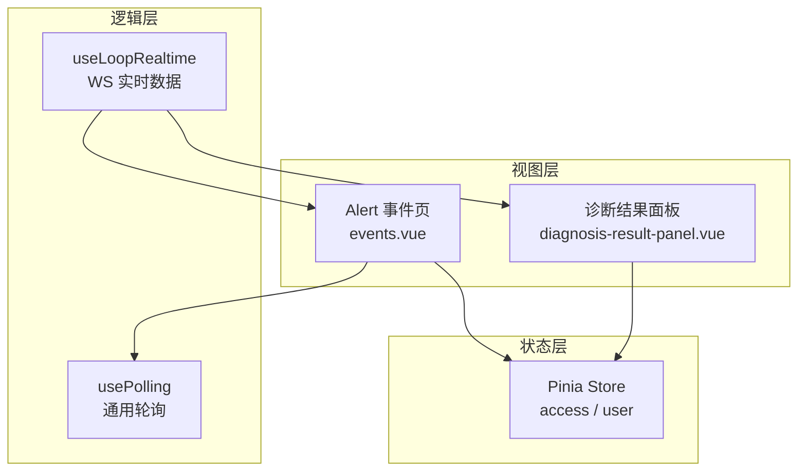
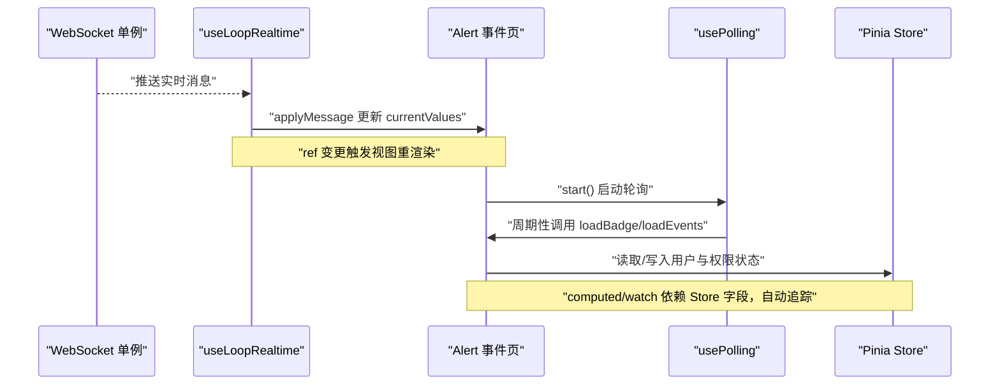
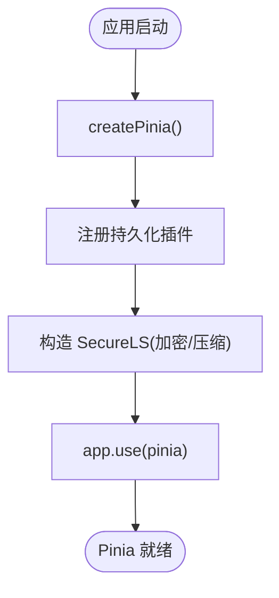
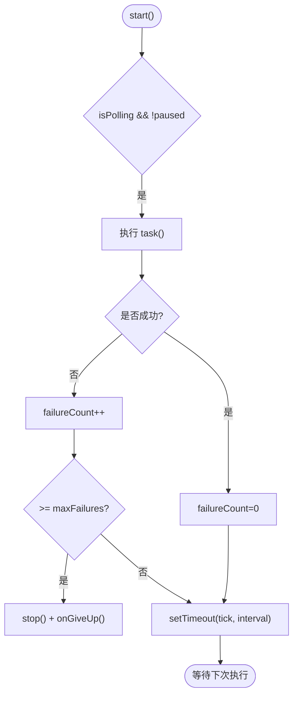
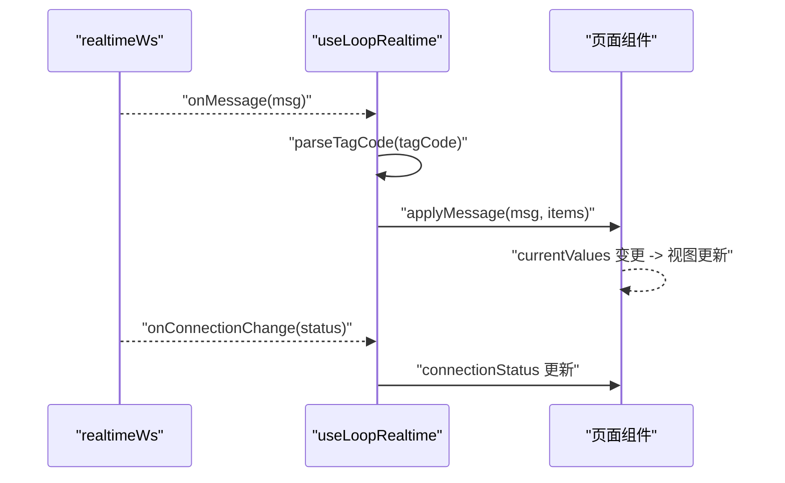
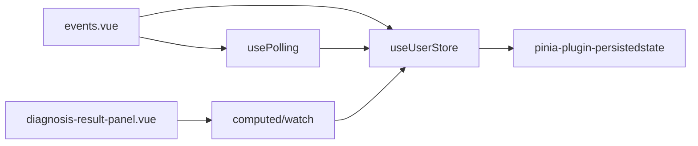

# 响应式数据流

<cite>
**本文引用的文件**
- [frontend/packages/stores/src/setup.ts](file://frontend/packages/stores/src/setup.ts)
- [frontend/packages/stores/src/index.ts](file://frontend/packages/stores/src/index.ts)
- [frontend/packages/stores/src/modules/access.ts](file://frontend/packages/stores/src/modules/access.ts)
- [frontend/packages/stores/src/modules/user.ts](file://frontend/packages/stores/src/modules/user.ts)
- [frontend/apps/web-antd/src/composables/use-loop-realtime.ts](file://frontend/apps/web-antd/src/composables/use-loop-realtime.ts)
- [frontend/apps/web-antd/src/composables/use-polling.ts](file://frontend/apps/web-antd/src/composables/use-polling.ts)
- [frontend/apps/web-antd/src/views/alert/events.vue](file://frontend/apps/web-antd/src/views/alert/events.vue)
- [frontend/apps/web-antd/src/views/diagnosis/components/diagnosis-result-panel.vue](file://frontend/apps/web-antd/src/views/diagnosis/components/diagnosis-result-panel.vue)
</cite>

## 目录
1. [简介](#简介)
2. [项目结构](#项目结构)
3. [核心组件](#核心组件)
4. [架构总览](#架构总览)
5. [详细组件分析](#详细组件分析)
6. [依赖关系分析](#依赖关系分析)
7. [性能考量](#性能考量)
8. [故障排查指南](#故障排查指南)
9. [结论](#结论)
10. [附录](#附录)

## 简介
本文件面向 Vue 3 前端工程中的“响应式数据流”实现，围绕以下目标展开：
- 解释响应式原理在工程中的落地：Proxy 拦截、依赖收集、更新触发（通过 Pinia + Vue 3 组合体现）。
- 说明计算属性：缓存机制、惰性求值、复杂逻辑封装。
- 阐述侦听器使用：watch 与 watchEffect 的区别、深度监听、性能优化。
- 总结响应式数据流模式：数据转换、派生状态、异步数据处理。
- 提供调试工具、性能监控与内存泄漏防护建议。
- 给出实际编程模式与常见陷阱避免指南。

## 项目结构
本项目采用多包/多应用的前端工程组织方式：
- 共享状态管理：Pinia store 定义位于 packages/stores，包含初始化、持久化、模块划分。
- 业务页面与可复用逻辑：apps/web-antd 下以 composables 封装通用能力（轮询、实时数据接入等），views 中组合为页面级响应式流程。
- 典型数据流：Store 作为单一事实源；Composable 负责副作用与外部系统交互；View 仅消费响应式数据并渲染。

图表来源
- [frontend/packages/stores/src/modules/access.ts:51-123](file://frontend/packages/stores/src/modules/access.ts#L51-L123)
- [frontend/packages/stores/src/modules/user.ts:41-58](file://frontend/packages/stores/src/modules/user.ts#L41-L58)
- [frontend/apps/web-antd/src/composables/use-polling.ts:53-169](file://frontend/apps/web-antd/src/composables/use-polling.ts#L53-L169)
- [frontend/apps/web-antd/src/composables/use-loop-realtime.ts:103-271](file://frontend/apps/web-antd/src/composables/use-loop-realtime.ts#L103-L271)
- [frontend/apps/web-antd/src/views/alert/events.vue:250-298](file://frontend/apps/web-antd/src/views/alert/events.vue#L250-L298)
- [frontend/apps/web-antd/src/views/diagnosis/components/diagnosis-result-panel.vue:214-319](file://frontend/apps/web-antd/src/views/diagnosis/components/diagnosis-result-panel.vue#L214-L319)

章节来源
- [frontend/packages/stores/src/setup.ts:42-82](file://frontend/packages/stores/src/setup.ts#L42-L82)
- [frontend/packages/stores/src/index.ts:1-4](file://frontend/packages/stores/src/index.ts#L1-L4)

## 核心组件
- Pinia 初始化与持久化：统一创建 Pinia 实例，挂载 persistedstate 插件，按命名空间隔离存储键，生产环境使用加密本地存储。
- 访问权限 Store：集中管理 token、菜单、路由、锁屏等状态，支持持久化白名单字段。
- 用户信息 Store：维护用户基本信息与角色列表，便于权限判断与 UI 展示。
- 通用轮询 Composable：封装防堆积、失败熔断、可见性暂停/恢复、自动清理的轮询模型。
- 回路实时数据 Composable：基于全局 WebSocket 单例，解析消息、映射质量码、三态连接状态、降级轮询。
- 页面级响应式组合：在视图中通过 computed/watch/ref 组合上述能力，形成清晰的数据流。

章节来源
- [frontend/packages/stores/src/setup.ts:42-82](file://frontend/packages/stores/src/setup.ts#L42-L82)
- [frontend/packages/stores/src/modules/access.ts:51-123](file://frontend/packages/stores/src/modules/access.ts#L51-L123)
- [frontend/packages/stores/src/modules/user.ts:41-58](file://frontend/packages/stores/src/modules/user.ts#L41-L58)
- [frontend/apps/web-antd/src/composables/use-polling.ts:53-169](file://frontend/apps/web-antd/src/composables/use-polling.ts#L53-L169)
- [frontend/apps/web-antd/src/composables/use-loop-realtime.ts:103-271](file://frontend/apps/web-antd/src/composables/use-loop-realtime.ts#L103-L271)

## 架构总览
下图展示了从 Store 到 Composable 再到 View 的响应式数据流，以及外部系统（WebSocket、REST）如何驱动状态变更。

图表来源
- [frontend/apps/web-antd/src/composables/use-loop-realtime.ts:116-177](file://frontend/apps/web-antd/src/composables/use-loop-realtime.ts#L116-L177)
- [frontend/apps/web-antd/src/composables/use-polling.ts:82-103](file://frontend/apps/web-antd/src/composables/use-polling.ts#L82-L103)
- [frontend/apps/web-antd/src/views/alert/events.vue:250-298](file://frontend/apps/web-antd/src/views/alert/events.vue#L250-L298)
- [frontend/packages/stores/src/modules/access.ts:51-123](file://frontend/packages/stores/src/modules/access.ts#L51-L123)

## 详细组件分析

### Pinia 初始化与持久化
- 职责：创建 Pinia 实例，注册持久化插件，按命名空间生成 key，生产环境使用加密存储。
- 关键点：
  - 延迟加载插件以减少首屏开销。
  - 通过命名空间避免多应用冲突。
  - 暴露 resetAllStores 用于测试或登出时重置所有 store。

图表来源
- [frontend/packages/stores/src/setup.ts:42-82](file://frontend/packages/stores/src/setup.ts#L42-L82)

章节来源
- [frontend/packages/stores/src/setup.ts:42-82](file://frontend/packages/stores/src/setup.ts#L42-L82)
- [frontend/packages/stores/src/index.ts:1-4](file://frontend/packages/stores/src/index.ts#L1-L4)

### 访问权限 Store（access）
- 职责：管理 accessToken、refreshToken、菜单、路由、锁屏等访问相关状态。
- 特性：
  - actions 提供原子状态更新方法。
  - persist.pick 指定需持久化的字段，保障登录态与界面状态跨会话保持。
  - 提供根据路径查找菜单的能力。

章节来源
- [frontend/packages/stores/src/modules/access.ts:51-123](file://frontend/packages/stores/src/modules/access.ts#L51-L123)

### 用户信息 Store（user）
- 职责：维护用户基本信息与角色列表，供权限控制与 UI 展示使用。
- 特性：
  - setUserInfo 同时设置用户信息与角色数组。
  - HMR 兼容处理，提升开发体验。

章节来源
- [frontend/packages/stores/src/modules/user.ts:41-58](file://frontend/packages/stores/src/modules/user.ts#L41-L58)

### 通用轮询 Composable（usePolling）
- 职责：统一各页面的轮询行为，包括防堆积、失败熔断、页面隐藏暂停/恢复、自动清理。
- 关键设计：
  - 递归 setTimeout 确保上一次任务完成后才排定下一次，避免请求堆积。
  - 连续失败达到阈值后停止并回调 onGiveUp，单次成功清零失败计数。
  - 监听 visibilitychange，隐藏时暂停计时，可见时可选择立即补跑一次。
  - onScopeDispose 保证组件卸载时清理定时器与监听器，防止内存泄漏。

图表来源
- [frontend/apps/web-antd/src/composables/use-polling.ts:82-103](file://frontend/apps/web-antd/src/composables/use-polling.ts#L82-L103)
- [frontend/apps/web-antd/src/composables/use-polling.ts:132-169](file://frontend/apps/web-antd/src/composables/use-polling.ts#L132-L169)

章节来源
- [frontend/apps/web-antd/src/composables/use-polling.ts:53-169](file://frontend/apps/web-antd/src/composables/use-polling.ts#L53-L169)

### 回路实时数据 Composable（useLoopRealtime）
- 职责：解析 WS 消息、局部更新匹配回路的 currentValues、维护连接状态三态、提供降级轮询。
- 关键点：
  - parseTagCode 将 tagCode 解析为 tagName 与 role，精准定位更新目标。
  - applyMessage 对 PV/SP/OP/MODE/PID_P/I/D 进行安全映射，PV 质量码统一走映射函数。
  - start 仅在未连接时建立连接，并订阅连接状态变化同步到 ref。
  - startFallback/stopFallback 提供 30 秒间隔的降级轮询策略。
  - onBeforeUnmount 自动清理页面级回调，避免内存泄漏。

图表来源
- [frontend/apps/web-antd/src/composables/use-loop-realtime.ts:86-95](file://frontend/apps/web-antd/src/composables/use-loop-realtime.ts#L86-L95)
- [frontend/apps/web-antd/src/composables/use-loop-realtime.ts:116-177](file://frontend/apps/web-antd/src/composables/use-loop-realtime.ts#L116-L177)
- [frontend/apps/web-antd/src/composables/use-loop-realtime.ts:193-222](file://frontend/apps/web-antd/src/composables/use-loop-realtime.ts#L193-L222)

章节来源
- [frontend/apps/web-antd/src/composables/use-loop-realtime.ts:103-271](file://frontend/apps/web-antd/src/composables/use-loop-realtime.ts#L103-L271)

### 视图层响应式组合示例
- 预警事件页（events.vue）：
  - 使用 usePolling 启动徽章计数轮询，结合 BADGE_REFRESH_INTERVAL 控制频率。
  - 通过 computed 派生列配置、权限判断等，减少重复计算。
  - 表格数据通过 loadEvents 拉取，lastRefresh 反馈最近刷新时间。
- 诊断结果面板（diagnosis-result-panel.vue）：
  - 使用 watch 监听 props.detail，构建症状标签、特征行等派生数据。
  - 使用 computed 构建指标汇总、置信度依据等只读视图数据。
  - 图表按需渲染，结合 nextTick 与主题切换重绘。

章节来源
- [frontend/apps/web-antd/src/views/alert/events.vue:250-298](file://frontend/apps/web-antd/src/views/alert/events.vue#L250-L298)
- [frontend/apps/web-antd/src/views/diagnosis/components/diagnosis-result-panel.vue:214-319](file://frontend/apps/web-antd/src/views/diagnosis/components/diagnosis-result-panel.vue#L214-L319)

## 依赖关系分析
- 视图依赖 Composable：events.vue 依赖 usePolling；diagnosis-result-panel.vue 依赖 computed/watch 组合。
- Composable 依赖 Store：events.vue 通过 useUserStore 获取用户角色；useLoopRealtime 通过 useAccessStore 获取 token 建立 WS。
- Store 依赖持久化：access store 通过 pinia-plugin-persistedstate 持久化关键字段。

图表来源
- [frontend/apps/web-antd/src/views/alert/events.vue:250-298](file://frontend/apps/web-antd/src/views/alert/events.vue#L250-L298)
- [frontend/apps/web-antd/src/views/diagnosis/components/diagnosis-result-panel.vue:214-319](file://frontend/apps/web-antd/src/views/diagnosis/components/diagnosis-result-panel.vue#L214-L319)
- [frontend/packages/stores/src/modules/access.ts:51-123](file://frontend/packages/stores/src/modules/access.ts#L51-L123)
- [frontend/packages/stores/src/modules/user.ts:41-58](file://frontend/packages/stores/src/modules/user.ts#L41-L58)

章节来源
- [frontend/packages/stores/src/modules/access.ts:51-123](file://frontend/packages/stores/src/modules/access.ts#L51-L123)
- [frontend/packages/stores/src/modules/user.ts:41-58](file://frontend/packages/stores/src/modules/user.ts#L41-L58)
- [frontend/apps/web-antd/src/composables/use-polling.ts:53-169](file://frontend/apps/web-antd/src/composables/use-polling.ts#L53-L169)
- [frontend/apps/web-antd/src/composables/use-loop-realtime.ts:103-271](file://frontend/apps/web-antd/src/composables/use-loop-realtime.ts#L103-L271)

## 性能考量
- 计算属性缓存：
  - 使用 computed 派生只读数据（如列配置、权限判断、指标汇总），避免每次渲染重复计算。
  - 在诊断结果面板中，computed 将后端数据转换为展示所需格式，降低模板复杂度。
- 惰性求值：
  - 图表仅在折叠区展开时渲染，结合 nextTick 确保 DOM 就绪后再绘制，减少无效计算。
- 轮询优化：
  - usePolling 的防堆积策略避免慢请求导致的回调叠加。
  - 失败熔断机制减少无效重试，降低网络与 CPU 压力。
- 内存泄漏防护：
  - usePolling 在 onScopeDispose 中清理定时器与事件监听。
  - useLoopRealtime 在 onBeforeUnmount 中取消页面级消息回调与连接状态订阅。
- 持久化体积控制：
  - access store 通过 persist.pick 仅持久化必要字段，避免 localStorage 膨胀。

[本节为通用指导，不直接分析具体文件]

## 故障排查指南
- 轮询异常：
  - 检查 isPolling 状态与 failureCount，确认是否触发熔断；必要时调用 resetFailures 手动重试。
  - 观察页面可见性状态，确认 pauseOnHidden 行为是否符合预期。
- 实时数据不更新：
  - 检查 connectionStatus 是否为 online；若 offline/reconnecting，确认 start 是否被调用且 token 有效。
  - 验证 applyMessage 是否能正确解析 tagCode 并匹配 tagName。
- 视图未响应：
  - 确认 computed/watch 依赖的 Store 字段是否通过 actions 修改；避免直接赋值绕过响应式。
  - 检查是否在正确的生命周期内注册/取消订阅，避免内存泄漏导致回调失效。

章节来源
- [frontend/apps/web-antd/src/composables/use-polling.ts:82-103](file://frontend/apps/web-antd/src/composables/use-polling.ts#L82-L103)
- [frontend/apps/web-antd/src/composables/use-loop-realtime.ts:116-177](file://frontend/apps/web-antd/src/composables/use-loop-realtime.ts#L116-L177)
- [frontend/packages/stores/src/modules/access.ts:51-123](file://frontend/packages/stores/src/modules/access.ts#L51-L123)

## 结论
本项目通过 Pinia 统一管理状态，结合 Composable 封装副作用与外部系统交互，形成了清晰的响应式数据流。计算属性与侦听器的合理使用提升了性能与可维护性；轮询与实时数据的双通道保障了数据的时效性与鲁棒性。遵循本文的模式与最佳实践，可有效避免常见陷阱，提升用户体验与系统稳定性。

[本节为总结性内容，不直接分析具体文件]

## 附录
- 响应式原理在本工程的体现：
  - Proxy 拦截：Vue 3 与 Pinia 内部通过 Proxy 实现响应式，store 的 state 与 actions 变更会触发依赖收集与更新。
  - 依赖收集：computed/watch 在首次访问时记录依赖，后续变更自动触发重新计算或回调。
  - 更新触发：store 的 actions 修改 state 后，视图层自动重渲染。
- 调试建议：
  - 使用浏览器开发者工具的 Vue Devtools 查看 store 状态与组件响应式树。
  - 在 Composable 中增加日志输出，跟踪轮询与实时消息的处理流程。
- 性能监控：
  - 关注轮询频率与失败次数，合理设置 interval 与 maxFailures。
  - 监控 WebSocket 连接状态与消息量，避免高频更新导致卡顿。
- 内存泄漏防护：
  - 始终在组件卸载时清理定时器与事件监听。
  - 避免在 Composable 中持有不必要的闭包引用。

[本节为通用指导，不直接分析具体文件]