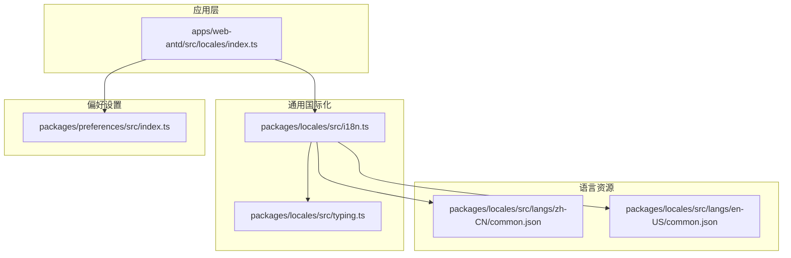
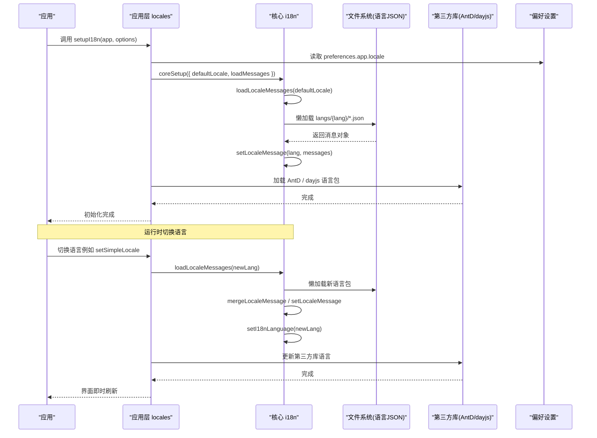
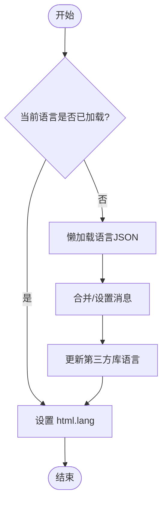
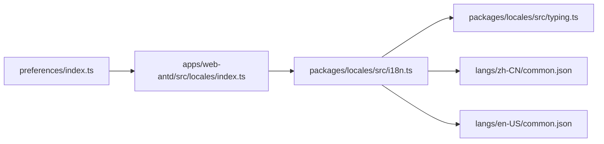

# 国际化状态

<cite>
**本文引用的文件**
- [i18n.ts](file://frontend/packages/locales/src/i18n.ts)
- [index.ts（应用层 locales）](file://frontend/apps/web-antd/src/locales/index.ts)
- [typing.ts](file://frontend/packages/locales/src/typing.ts)
- [common.json（中文）](file://frontend/packages/locales/src/langs/zh-CN/common.json)
- [common.json（英文）](file://frontend/packages/locales/src/langs/en-US/common.json)
- [preferences/index.ts](file://frontend/packages/preferences/src/index.ts)
</cite>

## 目录
1. [简介](#简介)
2. [项目结构](#项目结构)
3. [核心组件](#核心组件)
4. [架构总览](#架构总览)
5. [详细组件分析](#详细组件分析)
6. [依赖关系分析](#依赖关系分析)
7. [性能考虑](#性能考虑)
8. [故障排查指南](#故障排查指南)
9. [结论](#结论)
10. [附录](#附录)

## 简介
本文件面向“国际化状态管理”的完整实现说明，覆盖多语言切换机制、本地化存储与同步策略、偏好设置管理、最佳实践、调试工具、性能优化与错误处理，并提供可操作的配置示例与扩展指南。该方案基于 Vue + vue-i18n 构建，结合应用级语言包加载、第三方库（Ant Design Vue、dayjs）语言资源集成，以及偏好系统驱动的语言与主题等用户配置。

## 项目结构
前端采用 monorepo 组织：
- 通用国际化能力封装在 packages/locales，提供 i18n 初始化、动态加载、缺失键告警、类型定义等。
- 应用层在 apps/web-antd/src/locales，负责加载业务语言包、第三方库语言包（AntD、dayjs），并注入到全局 i18n。
- 偏好设置在 packages/preferences，暴露扩展与覆盖能力，供应用层读取默认语言等配置。

图表来源
- [index.ts（应用层 locales）:22-39](file://frontend/apps/web-antd/src/locales/index.ts#L22-L39)
- [i18n.ts:23-90](file://frontend/packages/locales/src/i18n.ts#L23-L90)
- [typing.ts:1-26](file://frontend/packages/locales/src/typing.ts#L1-L26)
- [common.json（中文）:1-25](file://frontend/packages/locales/src/langs/zh-CN/common.json#L1-L25)
- [common.json（英文）:1-25](file://frontend/packages/locales/src/langs/en-US/common.json#L1-L25)
- [preferences/index.ts:15-25](file://frontend/packages/preferences/src/index.ts#L15-L25)

章节来源
- [i18n.ts:16-21](file://frontend/packages/locales/src/i18n.ts#L16-L21)
- [index.ts（应用层 locales）:93-100](file://frontend/apps/web-antd/src/locales/index.ts#L93-L100)
- [preferences/index.ts:15-25](file://frontend/packages/preferences/src/index.ts#L15-L25)

## 核心组件
- 国际化核心（packages/locales/src/i18n.ts）
  - 创建并导出 i18n 实例，支持全局注入与非 legacy 模式。
  - 通过 import.meta.glob 扫描 langs 目录下的 JSON 语言包，按语言维度聚合为异步加载函数。
  - 提供 setupI18n、loadLocaleMessages、setI18nLanguage 等能力，支持缺失键告警。
- 应用层 locales（apps/web-antd/src/locales/index.ts）
  - 基于 preferences.app.locale 作为默认语言。
  - 合并业务语言包与第三方库语言包（AntD、dayjs）。
  - 暴露 $t、antdLocale、setupI18n 给应用使用。
- 类型定义（packages/locales/src/typing.ts）
  - 定义 SupportedLanguagesType、LoadMessageFn、LocaleSetupOptions 等类型，约束语言集合与配置项。
- 语言资源（langs/*.json）
  - 以模块为单位拆分翻译文件（如 common.json），便于按需加载与维护。
- 偏好设置（packages/preferences/src/index.ts）
  - 提供 defineOverridesPreferences、definePreferencesExtension，用于统一管理与扩展偏好。

章节来源
- [i18n.ts:16-21](file://frontend/packages/locales/src/i18n.ts#L16-L21)
- [i18n.ts:23-90](file://frontend/packages/locales/src/i18n.ts#L23-L90)
- [i18n.ts:96-139](file://frontend/packages/locales/src/i18n.ts#L96-L139)
- [index.ts（应用层 locales）:33-47](file://frontend/apps/web-antd/src/locales/index.ts#L33-L47)
- [index.ts（应用层 locales）:53-91](file://frontend/apps/web-antd/src/locales/index.ts#L53-L91)
- [index.ts（应用层 locales）:93-100](file://frontend/apps/web-antd/src/locales/index.ts#L93-L100)
- [typing.ts:1-26](file://frontend/packages/locales/src/typing.ts#L1-L26)
- [common.json（中文）:1-25](file://frontend/packages/locales/src/langs/zh-CN/common.json#L1-L25)
- [common.json（英文）:1-25](file://frontend/packages/locales/src/langs/en-US/common.json#L1-L25)
- [preferences/index.ts:15-25](file://frontend/packages/preferences/src/index.ts#L15-L25)

## 架构总览
下图展示了从应用启动到语言切换的端到端流程，包括语言包懒加载、第三方库语言资源注入、偏好驱动默认语言、以及运行时切换。

图表来源
- [index.ts（应用层 locales）:93-100](file://frontend/apps/web-antd/src/locales/index.ts#L93-L100)
- [i18n.ts:102-139](file://frontend/packages/locales/src/i18n.ts#L102-L139)
- [i18n.ts:23-90](file://frontend/packages/locales/src/i18n.ts#L23-L90)
- [index.ts（应用层 locales）:53-91](file://frontend/apps/web-antd/src/locales/index.ts#L53-L91)

## 详细组件分析

### 语言包加载与动态切换
- 懒加载策略
  - 通过 import.meta.glob 扫描 langs 目录，生成按语言维度的异步加载函数，避免一次性加载所有语言包。
  - 首次访问某语言时再加载对应 JSON，降低首屏体积。
- 动态切换
  - 切换语言时，先更新内部 locale，再合并/设置消息，最后同步 HTML lang 属性，保证语义与无障碍支持。
  - 同时触发第三方库语言包更新（AntD、dayjs），确保 UI 与日期时间显示一致。
- 缺失键处理
  - 非生产环境开启 missingWarn，控制台输出缺失键警告，便于开发期发现遗漏翻译。

图表来源
- [i18n.ts:96-139](file://frontend/packages/locales/src/i18n.ts#L96-L139)
- [index.ts（应用层 locales）:53-91](file://frontend/apps/web-antd/src/locales/index.ts#L53-L91)

章节来源
- [i18n.ts:23-90](file://frontend/packages/locales/src/i18n.ts#L23-L90)
- [i18n.ts:96-139](file://frontend/packages/locales/src/i18n.ts#L96-L139)
- [index.ts（应用层 locales）:33-47](file://frontend/apps/web-antd/src/locales/index.ts#L33-L47)
- [index.ts（应用层 locales）:53-91](file://frontend/apps/web-antd/src/locales/index.ts#L53-L91)

### 本地化存储与同步策略
- 当前实现要点
  - 应用层通过 preferences.app.locale 获取默认语言，并在初始化时传入核心 i18n。
  - 运行时切换会更新 i18n 实例与 HTML lang 属性，并联动第三方库语言包。
- 建议的持久化方案（落地指引）
  - localStorage 持久化：在切换语言后写入 localStorage；应用启动时优先从 localStorage 读取，若不存在则回退到 preferences.app.locale。
  - Cookie 同步：如需跨子域或 SSR 场景共享语言，可在写入 localStorage 的同时写入 Cookie，并在服务端读取 Cookie 设置初始语言。
  - 服务端状态同步：登录后将语言偏好随用户信息同步至后端，下次登录自动恢复；或在 API 响应中携带语言偏好以便客户端同步。
- 注意
  - 本仓库未包含持久化代码片段，上述为实施建议；可按需扩展应用层 locales 的切换入口，增加读写逻辑。

章节来源
- [index.ts（应用层 locales）:93-100](file://frontend/apps/web-antd/src/locales/index.ts#L93-L100)
- [i18n.ts:96-139](file://frontend/packages/locales/src/i18n.ts#L96-L139)

### 偏好设置管理（用户配置、主题、布局）
- 偏好系统能力
  - 提供 defineOverridesPreferences 与 definePreferencesExtension，允许应用统一覆盖默认偏好与扩展自定义字段。
  - 应用层通过 preferences.app.locale 读取默认语言，并传递给 i18n 初始化。
- 主题与布局
  - 主题与布局偏好通常与语言偏好并列存储在 preferences 中；切换主题/布局时，可与语言切换并行触发，保持用户体验一致。
- 建议
  - 将语言、主题、布局等用户偏好集中管理，统一持久化与同步策略，避免分散导致不一致。

章节来源
- [preferences/index.ts:15-25](file://frontend/packages/preferences/src/index.ts#L15-L25)
- [index.ts（应用层 locales）:93-100](file://frontend/apps/web-antd/src/locales/index.ts#L93-L100)

### 国际化最佳实践
- 字符串提取
  - 将文案拆分为多个 JSON 文件（如 common.json、page.json、authentication.json），按模块维护，便于协作与增量加载。
- 占位符处理
  - 使用 vue-i18n 的参数化能力（如 {name}）传递变量，避免拼接字符串。
- 复数形式
  - 利用 vue-i18n 的复数规则与命名空间，针对不同数量展示不同文案。
- 日期时间格式化
  - 通过 dayjs 的语言包切换，配合区域化格式器，确保日期、时间、相对时间等显示符合当前语言。
- 缺失键告警
  - 开发环境开启 missingWarn，快速定位遗漏翻译；生产环境关闭以提升性能。

章节来源
- [index.ts（应用层 locales）:53-91](file://frontend/apps/web-antd/src/locales/index.ts#L53-L91)
- [i18n.ts:102-117](file://frontend/packages/locales/src/i18n.ts#L102-L117)
- [common.json（中文）:1-25](file://frontend/packages/locales/src/langs/zh-CN/common.json#L1-L25)
- [common.json（英文）:1-25](file://frontend/packages/locales/src/langs/en-US/common.json#L1-L25)

### 国际化调试工具
- 缺失键告警
  - 非生产环境下，当 key 缺失时会输出控制台警告，帮助定位问题。
- 手动验证
  - 可通过浏览器控制台调用 t(key) 验证翻译是否存在；或使用 $te(key) 检查键是否存在。
- 第三方库语言包
  - 切换语言后，确认 AntD 组件文案与 dayjs 日期格式是否正确更新。

章节来源
- [i18n.ts:102-117](file://frontend/packages/locales/src/i18n.ts#L102-L117)
- [index.ts（应用层 locales）:53-91](file://frontend/apps/web-antd/src/locales/index.ts#L53-L91)

### 性能优化
- 懒加载语言包
  - 仅在实际使用时加载对应语言 JSON，减少首屏体积。
- 合并消息
  - 使用 mergeLocaleMessage 合并业务与第三方语言包，避免重复设置。
- 条件告警
  - 仅在非生产环境开启缺失键告警，避免影响线上性能。
- 缓存策略（建议）
  - 对已加载的语言包进行内存缓存，避免重复请求；如需跨会话持久化，可结合 localStorage。

章节来源
- [i18n.ts:23-90](file://frontend/packages/locales/src/i18n.ts#L23-L90)
- [i18n.ts:102-139](file://frontend/packages/locales/src/i18n.ts#L102-L139)
- [index.ts（应用层 locales）:33-47](file://frontend/apps/web-antd/src/locales/index.ts#L33-L47)

### 错误处理
- 缺失键处理
  - 通过 setMissingHandler 在非生产环境输出警告，便于开发期修复。
- 第三方库语言包失败
  - 当 dayjs/locale 加载失败时记录错误日志，避免静默失败。
- 降级策略
  - 若指定语言包不可用，可回退到默认语言（如 zh-CN），保障基本可用。

章节来源
- [i18n.ts:102-117](file://frontend/packages/locales/src/i18n.ts#L102-L117)
- [index.ts（应用层 locales）:53-74](file://frontend/apps/web-antd/src/locales/index.ts#L53-L74)

## 依赖关系分析
- 应用层 locales 依赖核心 i18n 与偏好设置，负责业务语言包与第三方库语言包的加载与合并。
- 核心 i18n 依赖类型定义与语言资源 JSON，提供统一的初始化与切换能力。
- 偏好设置为应用层提供默认语言等配置来源。

图表来源
- [preferences/index.ts:15-25](file://frontend/packages/preferences/src/index.ts#L15-L25)
- [index.ts（应用层 locales）:93-100](file://frontend/apps/web-antd/src/locales/index.ts#L93-L100)
- [i18n.ts:23-90](file://frontend/packages/locales/src/i18n.ts#L23-L90)
- [typing.ts:1-26](file://frontend/packages/locales/src/typing.ts#L1-L26)
- [common.json（中文）:1-25](file://frontend/packages/locales/src/langs/zh-CN/common.json#L1-L25)
- [common.json（英文）:1-25](file://frontend/packages/locales/src/langs/en-US/common.json#L1-L25)

章节来源
- [index.ts（应用层 locales）:93-100](file://frontend/apps/web-antd/src/locales/index.ts#L93-L100)
- [i18n.ts:23-90](file://frontend/packages/locales/src/i18n.ts#L23-L90)
- [preferences/index.ts:15-25](file://frontend/packages/preferences/src/index.ts#L15-L25)

## 性能考虑
- 首屏优化
  - 仅加载默认语言包，其他语言按需懒加载。
- 运行时切换
  - 切换语言时复用已加载的消息，避免重复解析。
- 告警控制
  - 生产环境关闭缺失键告警，减少控制台开销。
- 第三方库语言包
  - 按需加载 dayjs 与 AntD 语言包，避免全量引入。

[本节为通用指导，不直接分析具体文件]

## 故障排查指南
- 现象：切换语言后部分文案未生效
  - 检查是否在 loadMessages 中正确合并业务与第三方语言包。
  - 确认目标语言的 JSON 文件是否存在且键名一致。
- 现象：日期时间未按新语言显示
  - 检查 dayjs/locale 是否正确加载并设置。
- 现象：控制台出现缺失键警告
  - 根据警告提示补充对应 key 的翻译。
- 现象：默认语言不符合预期
  - 检查 preferences.app.locale 的值与应用层传入的 defaultLocale。

章节来源
- [index.ts（应用层 locales）:33-47](file://frontend/apps/web-antd/src/locales/index.ts#L33-L47)
- [index.ts（应用层 locales）:53-91](file://frontend/apps/web-antd/src/locales/index.ts#L53-L91)
- [i18n.ts:102-117](file://frontend/packages/locales/src/i18n.ts#L102-L117)

## 结论
本方案通过核心 i18n 与 application 层 locales 的解耦设计，实现了语言包的懒加载、运行时切换与第三方库语言资源集成。结合偏好系统，可统一管理语言、主题与布局等用户配置。建议在实施中补充 localStorage/Cookie/服务端同步策略，以实现更健壮的持久化与跨端一致性。

[本节为总结性内容，不直接分析具体文件]

## 附录
- 配置示例（步骤式）
  - 在应用启动时调用 setupI18n(app, { defaultLocale: preferences.app.locale, loadMessages })。
  - 在切换语言时调用 loadLocaleMessages(newLang)，并更新第三方库语言包。
  - 可选：在切换后写入 localStorage，并在应用启动时优先读取。
- 扩展指南
  - 新增语言：在 langs 目录下新增对应语言 JSON 文件，并确保键名一致。
  - 新增第三方库语言包：在 loadThirdPartyMessage 中添加对应加载逻辑。
  - 扩展偏好：使用 definePreferencesExtension 添加自定义字段，并在应用层读取与持久化。

[本节为操作指引，不直接分析具体文件]