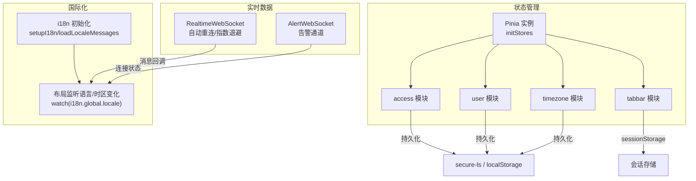
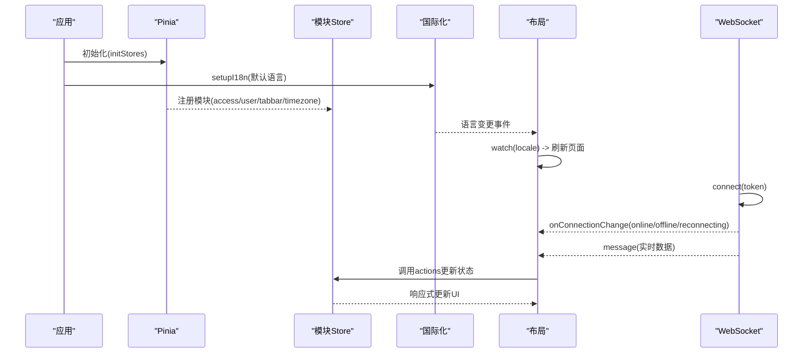
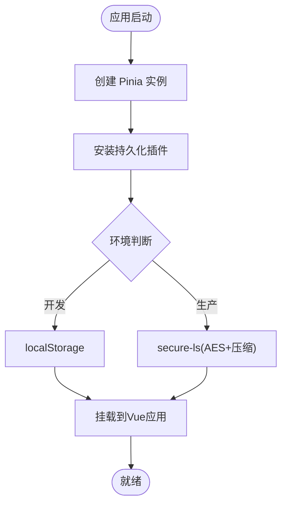
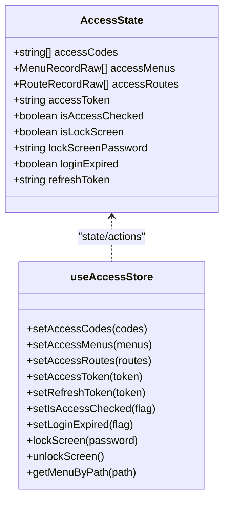
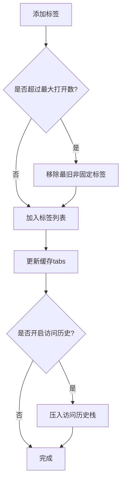
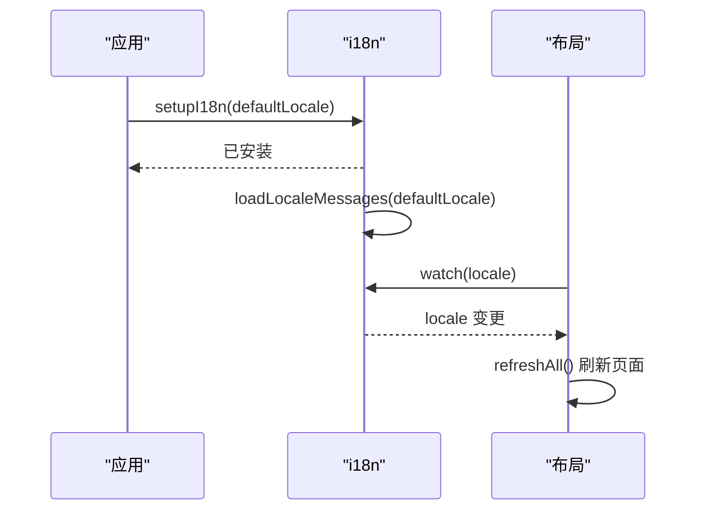
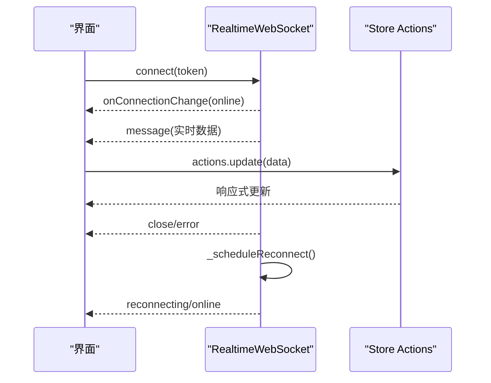
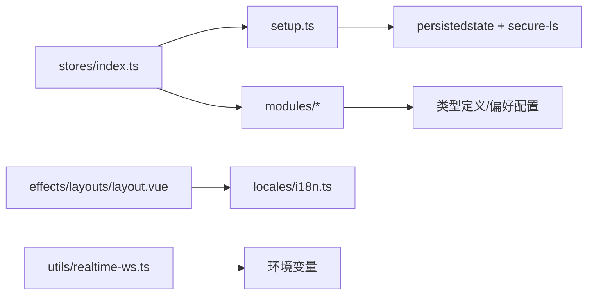

# 状态管理

<cite>
**本文引用的文件**
- [frontend/packages/stores/src/index.ts](file://frontend/packages/stores/src/index.ts)
- [frontend/packages/stores/src/setup.ts](file://frontend/packages/stores/src/setup.ts)
- [frontend/packages/stores/src/modules/access.ts](file://frontend/packages/stores/src/modules/access.ts)
- [frontend/packages/stores/src/modules/user.ts](file://frontend/packages/stores/src/modules/user.ts)
- [frontend/packages/stores/src/modules/tabbar.ts](file://frontend/packages/stores/src/modules/tabbar.ts)
- [frontend/packages/stores/src/modules/timezone.ts](file://frontend/packages/stores/src/modules/timezone.ts)
- [frontend/packages/locales/src/i18n.ts](file://frontend/packages/locales/src/i18n.ts)
- [frontend/packages/effects/layouts/src/basic/layout.vue](file://frontend/packages/effects/layouts/src/basic/layout.vue)
- [frontend/apps/web-antd/src/utils/realtime-ws.ts](file://frontend/apps/web-antd/src/utils/realtime-ws.ts)
- [frontend/apps/web-antd/src/utils/alert-ws.ts](file://frontend/apps/web-antd/src/utils/alert-ws.ts)
</cite>

## 目录
1. [简介](#简介)
2. [项目结构](#项目结构)
3. [核心组件](#核心组件)
4. [架构总览](#架构总览)
5. [详细组件分析](#详细组件分析)
6. [依赖关系分析](#依赖关系分析)
7. [性能考虑](#性能考虑)
8. [故障排查指南](#故障排查指南)
9. [结论](#结论)
10. [附录](#附录)

## 简介
本文件面向前端状态管理系统，围绕 Pinia Store 的设计与落地进行系统化说明。内容覆盖：
- 全局状态管理与模块化 store 组织
- 持久化存储方案（含安全本地存储）
- 组件间通信模式（props、事件、provide/inject、组合式函数共享状态）
- 响应式数据流（计算属性、侦听器、watchEffect 的使用场景）
- 国际化状态（多语言切换、本地化存储、动态加载）
- 状态同步机制（跨标签页通信、WebSocket 实时更新、离线状态处理）
- 状态调试工具与性能优化策略

## 项目结构
前端状态管理集中在 packages/stores 中，通过统一的初始化入口装配 Pinia 与持久化插件，并按业务域拆分为多个模块 store。国际化能力由 packages/locales 提供，布局层监听语言与时区变化以触发页面刷新。实时数据通过 WebSocket 客户端接入并驱动 UI 更新。

图表来源
- [frontend/packages/stores/src/setup.ts:42-69](file://frontend/packages/stores/src/setup.ts#L42-L69)
- [frontend/packages/stores/src/modules/access.ts:102-122](file://frontend/packages/stores/src/modules/access.ts#L102-L122)
- [frontend/packages/stores/src/modules/tabbar.ts:613-636](file://frontend/packages/stores/src/modules/tabbar.ts#L613-L636)
- [frontend/packages/stores/src/modules/timezone.ts:118-123](file://frontend/packages/stores/src/modules/timezone.ts#L118-L123)
- [frontend/packages/locales/src/i18n.ts:102-139](file://frontend/packages/locales/src/i18n.ts#L102-L139)
- [frontend/packages/effects/layouts/src/basic/layout.vue:206-218](file://frontend/packages/effects/layouts/src/basic/layout.vue#L206-L218)
- [frontend/apps/web-antd/src/utils/realtime-ws.ts:23-227](file://frontend/apps/web-antd/src/utils/realtime-ws.ts#L23-L227)
- [frontend/apps/web-antd/src/utils/alert-ws.ts:102-121](file://frontend/apps/web-antd/src/utils/alert-ws.ts#L102-L121)

章节来源
- [frontend/packages/stores/src/index.ts:1-4](file://frontend/packages/stores/src/index.ts#L1-L4)
- [frontend/packages/stores/src/setup.ts:42-82](file://frontend/packages/stores/src/setup.ts#L42-L82)

## 核心组件
- Pinia 初始化与持久化
  - 通过 initStores 创建 Pinia 实例，并注入 pinia-plugin-persistedstate；生产环境使用 secure-ls 加密存储，开发环境使用 localStorage；key 采用命名空间前缀避免冲突。
  - 提供 resetAllStores 用于统一重置所有 store。
- 模块 Store
  - access：权限码、菜单、路由、登录态、锁屏等，支持部分字段持久化。
  - user：用户信息与角色集合。
  - tabbar：标签页生命周期、缓存、访问历史、固定标签、排序等，使用 sessionStorage 持久化访问历史。
  - timezone：当前时区、选项获取与设置，默认基于系统时区并可扩展自定义处理器。
- 国际化
  - setupI18n 完成 i18n 安装与默认语言加载；loadLocaleMessages 支持按需加载与合并消息；布局层监听语言变化后刷新页面。
- 实时数据
  - RealtimeWebSocket：封装连接、消息、断线重连（指数退避）、手动重连、连接状态通知。
  - AlertWebSocket：告警通道，具备相似的重连策略。

章节来源
- [frontend/packages/stores/src/setup.ts:42-82](file://frontend/packages/stores/src/setup.ts#L42-L82)
- [frontend/packages/stores/src/modules/access.ts:51-122](file://frontend/packages/stores/src/modules/access.ts#L51-L122)
- [frontend/packages/stores/src/modules/user.ts:41-64](file://frontend/packages/stores/src/modules/user.ts#L41-L64)
- [frontend/packages/stores/src/modules/tabbar.ts:75-658](file://frontend/packages/stores/src/modules/tabbar.ts#L75-L658)
- [frontend/packages/stores/src/modules/timezone.ts:62-123](file://frontend/packages/stores/src/modules/timezone.ts#L62-L123)
- [frontend/packages/locales/src/i18n.ts:102-139](file://frontend/packages/locales/src/i18n.ts#L102-L139)
- [frontend/apps/web-antd/src/utils/realtime-ws.ts:23-227](file://frontend/apps/web-antd/src/utils/realtime-ws.ts#L23-L227)
- [frontend/apps/web-antd/src/utils/alert-ws.ts:102-121](file://frontend/apps/web-antd/src/utils/alert-ws.ts#L102-L121)

## 架构总览
下图展示了从应用启动到状态更新的关键路径：应用初始化 Pinia 与国际化，模块 store 暴露状态与动作；布局层监听语言与时区变化；实时数据通过 WebSocket 推送消息，驱动视图更新。

图表来源
- [frontend/packages/stores/src/setup.ts:42-69](file://frontend/packages/stores/src/setup.ts#L42-L69)
- [frontend/packages/locales/src/i18n.ts:102-139](file://frontend/packages/locales/src/i18n.ts#L102-L139)
- [frontend/packages/effects/layouts/src/basic/layout.vue:206-218](file://frontend/packages/effects/layouts/src/basic/layout.vue#L206-L218)
- [frontend/apps/web-antd/src/utils/realtime-ws.ts:69-199](file://frontend/apps/web-antd/src/utils/realtime-ws.ts#L69-L199)

## 详细组件分析

### Pinia 初始化与持久化
- 初始化流程
  - 创建 Pinia 实例并挂载到 Vue 应用。
  - 引入 pinia-plugin-persistedstate，配置 key 命名空间与 storage。
  - 生产环境使用 secure-ls（AES 加密、压缩、元信息键），开发环境使用 localStorage。
- 重置能力
  - 遍历所有 store 调用 $reset，便于测试或登出清理。

图表来源
- [frontend/packages/stores/src/setup.ts:42-69](file://frontend/packages/stores/src/setup.ts#L42-L69)

章节来源
- [frontend/packages/stores/src/setup.ts:42-82](file://frontend/packages/stores/src/setup.ts#L42-L82)

### 模块 Store：access（权限与登录态）
- 职责
  - 维护访问令牌、刷新令牌、权限码、可访问菜单与路由、锁屏状态、登录过期标记。
  - 提供设置方法以更新上述状态。
- 持久化
  - 仅持久化关键字段：accessToken、refreshToken、accessCodes、isLockScreen、lockScreenPassword。

图表来源
- [frontend/packages/stores/src/modules/access.ts:9-46](file://frontend/packages/stores/src/modules/access.ts#L9-L46)
- [frontend/packages/stores/src/modules/access.ts:51-122](file://frontend/packages/stores/src/modules/access.ts#L51-L122)

章节来源
- [frontend/packages/stores/src/modules/access.ts:51-122](file://frontend/packages/stores/src/modules/access.ts#L51-L122)

### 模块 Store：user（用户信息）
- 职责
  - 维护用户基本信息与角色列表，提供设置用户信息与角色的动作。
- 特点
  - 轻量、无持久化配置，适合敏感或临时状态。

章节来源
- [frontend/packages/stores/src/modules/user.ts:41-64](file://frontend/packages/stores/src/modules/user.ts#L41-L64)

### 模块 Store：tabbar（标签页）
- 职责
  - 管理标签页的增删改查、固定标签、排序、缓存、访问历史、标题更新、新窗口打开、刷新等。
  - 维护 keepAlive 所需的缓存集合与路由组件缓存。
- 持久化
  - 使用 sessionStorage 持久化 tabs 与 visitHistory，并对 Stack 实例进行序列化/反序列化兼容。
- 关键算法
  - 标签去重与合并、固定标签排序、最大打开数量控制、关闭逻辑与跳转策略。

图表来源
- [frontend/packages/stores/src/modules/tabbar.ts:132-196](file://frontend/packages/stores/src/modules/tabbar.ts#L132-L196)
- [frontend/packages/stores/src/modules/tabbar.ts:613-636](file://frontend/packages/stores/src/modules/tabbar.ts#L613-L636)

章节来源
- [frontend/packages/stores/src/modules/tabbar.ts:75-658](file://frontend/packages/stores/src/modules/tabbar.ts#L75-L658)

### 模块 Store：timezone（时区）
- 职责
  - 维护当前时区，提供初始化、设置、获取选项的能力；支持自定义时区处理器扩展。
  - 初始化时将 dayjs 默认时区设置为当前值。
- 持久化
  - 持久化当前时区。

章节来源
- [frontend/packages/stores/src/modules/timezone.ts:62-123](file://frontend/packages/stores/src/modules/timezone.ts#L62-L123)

### 国际化状态：多语言切换与动态加载
- 初始化与加载
  - setupI18n 安装 i18n，加载默认语言；loadLocaleMessages 按需加载并合并消息；支持第三方库消息扩展。
- 语言切换
  - 布局层监听 i18n.global.locale 变化，在 post flush 阶段刷新页面以确保语言完全生效。
- 缺失提示
  - 提供 missing handler 在开发环境下打印缺失键警告。

图表来源
- [frontend/packages/locales/src/i18n.ts:102-139](file://frontend/packages/locales/src/i18n.ts#L102-L139)
- [frontend/packages/effects/layouts/src/basic/layout.vue:206-218](file://frontend/packages/effects/layouts/src/basic/layout.vue#L206-L218)

章节来源
- [frontend/packages/locales/src/i18n.ts:102-139](file://frontend/packages/locales/src/i18n.ts#L102-L139)
- [frontend/packages/effects/layouts/src/basic/layout.vue:206-218](file://frontend/packages/effects/layouts/src/basic/layout.vue#L206-L218)

### 实时数据与状态同步：WebSocket
- 连接与重连
  - 支持 token 鉴权、自动重连、指数退避、手动重连、连接状态通知。
  - 忽略心跳消息，解析 JSON 数据并分发到回调。
- 与状态管理集成
  - 组件可通过 onMessage 订阅实时数据，并在 store actions 中更新状态，从而驱动视图响应式更新。
- 告警通道
  - 独立的 AlertWebSocket 具备类似重连策略，用于告警类实时消息。

图表来源
- [frontend/apps/web-antd/src/utils/realtime-ws.ts:69-227](file://frontend/apps/web-antd/src/utils/realtime-ws.ts#L69-L227)
- [frontend/apps/web-antd/src/utils/alert-ws.ts:102-121](file://frontend/apps/web-antd/src/utils/alert-ws.ts#L102-L121)

章节来源
- [frontend/apps/web-antd/src/utils/realtime-ws.ts:23-227](file://frontend/apps/web-antd/src/utils/realtime-ws.ts#L23-L227)
- [frontend/apps/web-antd/src/utils/alert-ws.ts:102-121](file://frontend/apps/web-antd/src/utils/alert-ws.ts#L102-L121)

### 组件间通信模式
- props 传递
  - 适用于父子组件间的单向数据流，配合表单渲染上下文中的 bindEventMap 实现事件绑定与值解包。
- 事件发射
  - 组件通过 emit 向上抛出事件，父组件监听并更新状态。
- provide/inject 模式
  - 在弹窗/抽屉等复杂组件树中，通过 provide 注入上下文，子组件 inject 消费，避免层层透传。
- 组合式函数共享状态
  - 使用 createSharedComposable 共享简单状态（如简单国际化），在多组件间保持单一实例。

章节来源
- [frontend/packages/@core/ui-kit/form-ui/src/form-render/form-field.vue:247-284](file://frontend/packages/@core/ui-kit/form-ui/src/form-render/form-field.vue#L247-L284)
- [frontend/packages/@core/composables/src/use-simple-locale/index.ts:9-27](file://frontend/packages/@core/composables/src/use-simple-locale/index.ts#L9-L27)

### 响应式数据流：计算属性、侦听器、watchEffect
- 计算属性
  - 用于派生状态，例如根据布局配置推导垂直布局标志、组件映射等。
- 侦听器
  - 监听 i18n 语言与时区变化，触发页面刷新或状态同步。
- watchEffect
  - 适用于副作用驱动的响应式更新，例如在组件挂载时建立 WebSocket 连接或在状态变化时执行清理。

章节来源
- [frontend/packages/@core/ui-kit/form-ui/src/form-render/context.ts:7-24](file://frontend/packages/@core/ui-kit/form-ui/src/form-render/context.ts#L7-L24)
- [frontend/packages/effects/layouts/src/basic/layout.vue:206-218](file://frontend/packages/effects/layouts/src/basic/layout.vue#L206-L218)

## 依赖关系分析
- 模块耦合
  - stores 模块通过 index 聚合导出，setup 负责装配；各模块 store 相互独立，降低耦合。
- 外部依赖
  - pinia、pinia-plugin-persistedstate、secure-ls、vue-i18n、@vueuse/core（组合式函数）。
- 运行时依赖
  - 布局层依赖 i18n 与 preferences；实时数据依赖环境变量构造 URL。

图表来源
- [frontend/packages/stores/src/index.ts:1-4](file://frontend/packages/stores/src/index.ts#L1-L4)
- [frontend/packages/stores/src/setup.ts:42-69](file://frontend/packages/stores/src/setup.ts#L42-L69)
- [frontend/packages/effects/layouts/src/basic/layout.vue:206-218](file://frontend/packages/effects/layouts/src/basic/layout.vue#L206-L218)
- [frontend/packages/locales/src/i18n.ts:102-139](file://frontend/packages/locales/src/i18n.ts#L102-L139)
- [frontend/apps/web-antd/src/utils/realtime-ws.ts:52-61](file://frontend/apps/web-antd/src/utils/realtime-ws.ts#L52-L61)

章节来源
- [frontend/packages/stores/src/index.ts:1-4](file://frontend/packages/stores/src/index.ts#L1-L4)
- [frontend/packages/stores/src/setup.ts:42-69](file://frontend/packages/stores/src/setup.ts#L42-L69)

## 性能考虑
- 持久化选择
  - 敏感数据在生产环境使用 secure-ls 加密存储，减少泄露风险；大对象注意序列化开销。
- 标签页缓存
  - 使用 Map/Set 管理缓存，避免重复渲染；keepAlive 粒度控制减少内存占用。
- 响应式更新
  - 合理使用 computed 派生状态，避免深层 watch；对高频数据使用防抖/节流。
- WebSocket 重连
  - 指数退避避免雪崩；连接状态通知让 UI 自适应降级为轮询。
- 国际化加载
  - 按需加载语言包，合并消息减少重复请求；缺失键提示仅在开发环境输出。

[本节为通用指导，不直接分析具体文件]

## 故障排查指南
- Pinia 未安装
  - resetAllStores 会检查 Pinia 是否已安装，未安装时输出错误日志。
- WebSocket 连接失败
  - 检查环境变量 VITE_GLOB_API_URL 是否正确；确认 token 有效；观察连接状态变化与重连日志。
- 语言切换未生效
  - 确认布局层监听 i18n.global.locale 并执行刷新；检查语言包是否成功加载与合并。
- 标签页异常
  - 检查 sessionStorage 中 visitHistory 的反序列化是否恢复 Stack 实例；确认 affix 标签不被误关闭。

章节来源
- [frontend/packages/stores/src/setup.ts:72-82](file://frontend/packages/stores/src/setup.ts#L72-L82)
- [frontend/apps/web-antd/src/utils/realtime-ws.ts:141-199](file://frontend/apps/web-antd/src/utils/realtime-ws.ts#L141-L199)
- [frontend/packages/locales/src/i18n.ts:102-139](file://frontend/packages/locales/src/i18n.ts#L102-L139)
- [frontend/packages/stores/src/modules/tabbar.ts:613-636](file://frontend/packages/stores/src/modules/tabbar.ts#L613-L636)

## 结论
本项目的前端状态管理以 Pinia 为核心，结合模块化 store 与安全的持久化方案，实现了清晰的状态边界与良好的可维护性。国际化与实时数据通过独立的模块与客户端封装，与布局层联动，形成稳定的响应式数据流。通过合理的缓存策略、重连机制与按需加载，系统在性能与稳定性方面达到工程级要求。后续可在跨标签页通信（BroadcastChannel/IndexedDB）与更细粒度的状态调试（Pinia DevTools）上进一步增强可观测性与协作能力。

## 附录
- 常用 API 路径参考
  - Pinia 初始化与重置：[setup.ts:42-82](file://frontend/packages/stores/src/setup.ts#L42-L82)
  - 模块 Store：access/user/tabbar/timezone
    - [access.ts:51-122](file://frontend/packages/stores/src/modules/access.ts#L51-L122)
    - [user.ts:41-64](file://frontend/packages/stores/src/modules/user.ts#L41-L64)
    - [tabbar.ts:75-658](file://frontend/packages/stores/src/modules/tabbar.ts#L75-L658)
    - [timezone.ts:62-123](file://frontend/packages/stores/src/modules/timezone.ts#L62-L123)
  - 国际化：[i18n.ts:102-139](file://frontend/packages/locales/src/i18n.ts#L102-L139)
  - 布局监听：[layout.vue:206-218](file://frontend/packages/effects/layouts/src/basic/layout.vue#L206-L218)
  - 实时数据：[realtime-ws.ts:23-227](file://frontend/apps/web-antd/src/utils/realtime-ws.ts#L23-L227)、[alert-ws.ts:102-121](file://frontend/apps/web-antd/src/utils/alert-ws.ts#L102-L121)