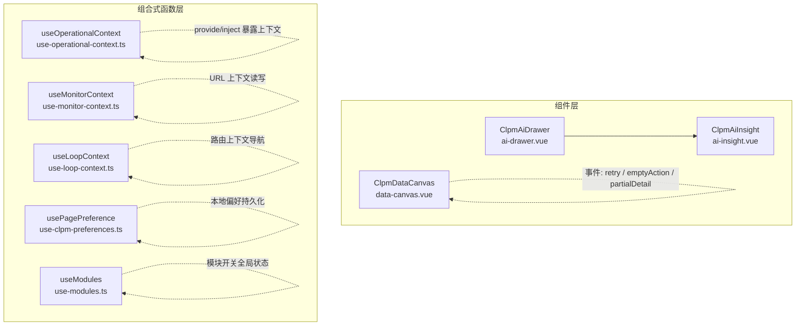
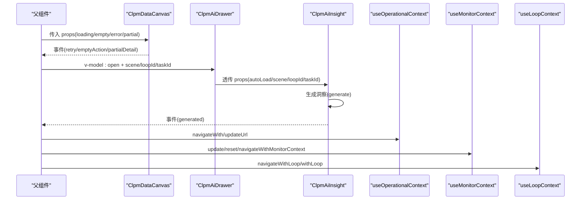
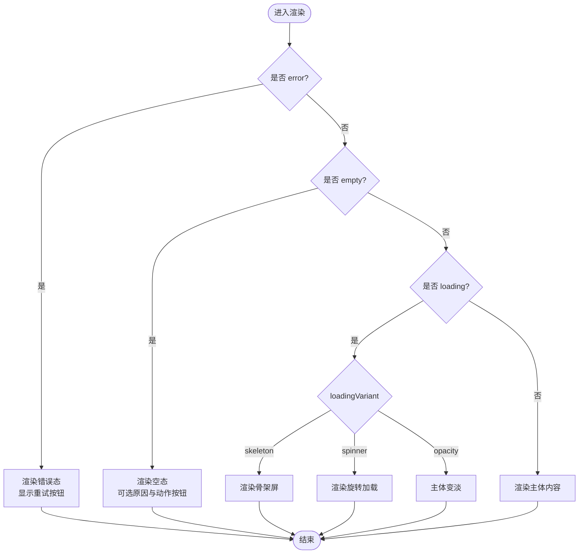
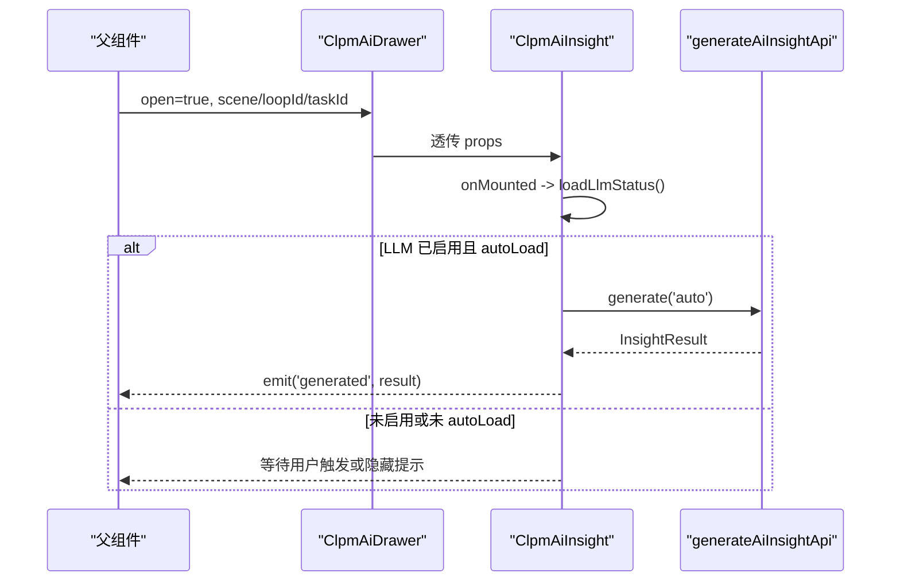
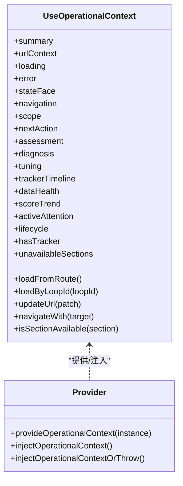
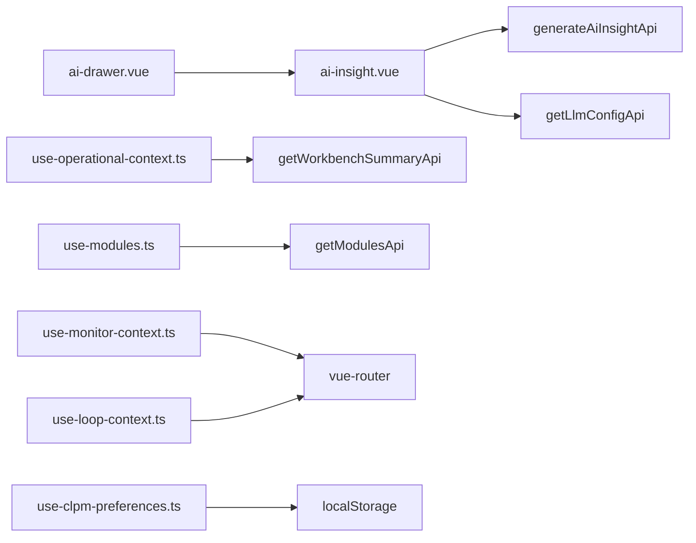

# 组件间通信

<cite>
**本文引用的文件**
- [data-canvas.vue](file://frontend/apps/web-antd/src/components/clpm/data-canvas.vue)
- [ai-drawer.vue](file://frontend/apps/web-antd/src/components/clpm/ai-drawer.vue)
- [ai-insight.vue](file://frontend/apps/web-antd/src/components/clpm/ai-insight.vue)
- [use-loop-context.ts](file://frontend/apps/web-antd/src/composables/use-loop-context.ts)
- [use-operational-context.ts](file://frontend/apps/web-antd/src/composables/use-operational-context.ts)
- [use-monitor-context.ts](file://frontend/apps/web-antd/src/composables/use-monitor-context.ts)
- [use-clpm-preferences.ts](file://frontend/apps/web-antd/src/composables/use-clpm-preferences.ts)
- [use-modules.ts](file://frontend/apps/web-antd/src/composables/use-modules.ts)
</cite>

## 目录
1. [简介](#简介)
2. [项目结构](#项目结构)
3. [核心组件与通信模式](#核心组件与通信模式)
4. [架构总览](#架构总览)
5. [详细组件分析](#详细组件分析)
6. [依赖关系分析](#依赖关系分析)
7. [性能考量](#性能考量)
8. [故障排查指南](#故障排查指南)
9. [结论](#结论)
10. [附录：最佳实践与反模式](#附录最佳实践与反模式)

## 简介
本文件聚焦前端 Vue 3 工程中的组件间通信机制，围绕以下主题展开：
- Props 传递模式：单向数据流、类型验证、默认值处理
- 事件发射机制：自定义事件、事件冒泡、事件修饰符
- Provide/Inject 模式：依赖注入、作用域隔离、动态注入
- 组合式函数共享状态：useXxx composables、响应式数据共享、副作用管理
- 通信最佳实践、性能优化与调试技巧
- 实际项目中的通信模式示例与反模式避免

## 项目结构
本项目采用“页面/功能模块 + 通用组件 + 组合式函数”的分层组织方式：
- 通用 UI 容器组件（如 data-canvas）负责状态展示与事件发射
- 业务场景组件（如 ai-drawer、ai-insight）封装具体交互与 API 调用
- 组合式函数（composables）承担跨组件/跨页面的上下文与状态共享（URL 上下文、用户偏好、模块开关等）

图表来源
- [data-canvas.vue:1-411](file://frontend/apps/web-antd/src/components/clpm/data-canvas.vue#L1-L411)
- [ai-drawer.vue:1-83](file://frontend/apps/web-antd/src/components/clpm/ai-drawer.vue#L1-L83)
- [ai-insight.vue:1-559](file://frontend/apps/web-antd/src/components/clpm/ai-insight.vue#L1-L559)
- [use-loop-context.ts:1-81](file://frontend/apps/web-antd/src/composables/use-loop-context.ts#L1-L81)
- [use-operational-context.ts:1-291](file://frontend/apps/web-antd/src/composables/use-operational-context.ts#L1-L291)
- [use-monitor-context.ts:1-289](file://frontend/apps/web-antd/src/composables/use-monitor-context.ts#L1-L289)
- [use-clpm-preferences.ts:1-156](file://frontend/apps/web-antd/src/composables/use-clpm-preferences.ts#L1-L156)
- [use-modules.ts:1-105](file://frontend/apps/web-antd/src/composables/use-modules.ts#L1-L105)

章节来源
- [data-canvas.vue:1-411](file://frontend/apps/web-antd/src/components/clpm/data-canvas.vue#L1-L411)
- [ai-drawer.vue:1-83](file://frontend/apps/web-antd/src/components/clpm/ai-drawer.vue#L1-L83)
- [ai-insight.vue:1-559](file://frontend/apps/web-antd/src/components/clpm/ai-insight.vue#L1-L559)
- [use-loop-context.ts:1-81](file://frontend/apps/web-antd/src/composables/use-loop-context.ts#L1-L81)
- [use-operational-context.ts:1-291](file://frontend/apps/web-antd/src/composables/use-operational-context.ts#L1-L291)
- [use-monitor-context.ts:1-289](file://frontend/apps/web-antd/src/composables/use-monitor-context.ts#L1-L289)
- [use-clpm-preferences.ts:1-156](file://frontend/apps/web-antd/src/composables/use-clpm-preferences.ts#L1-L156)
- [use-modules.ts:1-105](file://frontend/apps/web-antd/src/composables/use-modules.ts#L1-L105)

## 核心组件与通信模式
- Props 单向数据流
  - 通过 defineProps + withDefaults 声明 props 及默认值，保证父组件到子组件的单向数据流。例如 data-canvas 的 loading、empty、error、partial 等状态由父传入，子组件仅渲染并触发事件。
  - 类型校验与默认值集中定义，降低运行时错误风险。

- 事件发射
  - 使用 defineEmits 声明事件契约，子组件在内部动作（点击、重试、查看详情）时 emit，父组件监听并处理业务逻辑。
  - 事件修饰符用于控制原生行为（如 @click.prevent），确保事件语义清晰。

- Provide/Inject 依赖注入
  - use-operational-context 提供 provideOperationalContext/injectOperationalContext 系列方法，将统一操作上下文注入到任意后代组件，实现跨层级共享且作用域隔离。

- 组合式函数共享状态
  - URL 上下文：use-monitor-context、use-loop-context、use-operational-context 将路由 query 作为单一事实源，提供 update/reset/navigateWith 等方法，保证多组件对同一上下文的一致性。
  - 用户偏好：use-clpm-preferences 基于 localStorage 持久化页面级偏好，自动保存，支持列配置、时间窗、筛选预设等。
  - 模块开关：use-modules 维护全局模块启用状态，供路由守卫与组件条件渲染使用。

章节来源
- [data-canvas.vue:6-27](file://frontend/apps/web-antd/src/components/clpm/data-canvas.vue#L6-L27)
- [ai-drawer.vue:19-25](file://frontend/apps/web-antd/src/components/clpm/ai-drawer.vue#L19-L25)
- [ai-insight.vue:39-50](file://frontend/apps/web-antd/src/components/clpm/ai-insight.vue#L39-L50)
- [use-operational-context.ts:258-291](file://frontend/apps/web-antd/src/composables/use-operational-context.ts#L258-L291)
- [use-monitor-context.ts:159-267](file://frontend/apps/web-antd/src/composables/use-monitor-context.ts#L159-L267)
- [use-loop-context.ts:28-80](file://frontend/apps/web-antd/src/composables/use-loop-context.ts#L28-L80)
- [use-clpm-preferences.ts:90-155](file://frontend/apps/web-antd/src/composables/use-clpm-preferences.ts#L90-L155)
- [use-modules.ts:44-104](file://frontend/apps/web-antd/src/composables/use-modules.ts#L44-L104)

## 架构总览
下图展示了组件与组合式函数之间的通信关系：父组件通过 props 下发状态，子组件通过事件回传；跨层级共享通过 provide/inject；跨页面/跨模块共享通过 URL 上下文与本地存储。

图表来源
- [data-canvas.vue:23-27](file://frontend/apps/web-antd/src/components/clpm/data-canvas.vue#L23-L27)
- [ai-drawer.vue:19-49](file://frontend/apps/web-antd/src/components/clpm/ai-drawer.vue#L19-L49)
- [ai-insight.vue:39-50](file://frontend/apps/web-antd/src/components/clpm/ai-insight.vue#L39-L50)
- [use-operational-context.ts:102-153](file://frontend/apps/web-antd/src/composables/use-operational-context.ts#L102-L153)
- [use-monitor-context.ts:195-246](file://frontend/apps/web-antd/src/composables/use-monitor-context.ts#L195-L246)
- [use-loop-context.ts:49-70](file://frontend/apps/web-antd/src/composables/use-loop-context.ts#L49-L70)

## 详细组件分析

### ClpmDataCanvas：状态容器与事件发射
- Props 设计
  - 描述性字段：title、description、emptyText、errorText、partialText
  - 状态字段：loading、empty、error、partial、showPartialDetail、skeletonRows、loadingVariant
  - 默认值：通过 withDefaults 设置，保证空态/加载态/错误态的默认表现一致
- 事件契约
  - emptyAction：空态动作按钮回调
  - partialDetail：部分数据提示的“查看详情”链接回调
  - retry：错误态重试回调
- 渲染优先级
  - error > empty > loading(skeleton/spinner/opacity) > body
- 样式与可访问性
  - 骨架屏动画、旋转图标、透明度降级兼容旧版
  - 按钮与链接具备明确语义与可点击区域

图表来源
- [data-canvas.vue:80-168](file://frontend/apps/web-antd/src/components/clpm/data-canvas.vue#L80-L168)

章节来源
- [data-canvas.vue:6-27](file://frontend/apps/web-antd/src/components/clpm/data-canvas.vue#L6-L27)
- [data-canvas.vue:80-168](file://frontend/apps/web-antd/src/components/clpm/data-canvas.vue#L80-L168)

### ClpmAiDrawer：场景抽屉与子组件集成
- Props
  - open（v-model）、scene、loopId、taskId、title
- 事件
  - update:open 用于关闭抽屉
- 集成
  - 内部嵌入 ClpmAiInsight，透传 autoLoad、hideWhenDisabled、scene、loopId、taskId、variant
  - 标题按场景映射，宽度与过渡动画遵循设计规范

章节来源
- [ai-drawer.vue:19-49](file://frontend/apps/web-antd/src/components/clpm/ai-drawer.vue#L19-L49)
- [ai-drawer.vue:52-74](file://frontend/apps/web-antd/src/components/clpm/ai-drawer.vue#L52-L74)

### ClpmAiInsight：AI 洞察生成与展示
- Props
  - scene、loopId、taskId、variant、title、autoLoad、hideWhenDisabled
- 事件
  - generated：洞察结果生成后向上抛出
- 流程
  - onMounted 查询 LLM 配置，若启用且 autoLoad=true，则自动生成
  - generate(mode) 调用 API，成功后赋值 result 并 emit('generated')
  - 失败时设置 error 与 errorMsg，并提供重试入口
- 展示
  - 分段解析（【标题】）为卡片列表，支持 bullet 列表与纯文本降级
  - 元信息标签（来源、模型、时间）

图表来源
- [ai-insight.vue:39-50](file://frontend/apps/web-antd/src/components/clpm/ai-insight.vue#L39-L50)
- [ai-insight.vue:223-242](file://frontend/apps/web-antd/src/components/clpm/ai-insight.vue#L223-L242)
- [ai-insight.vue:248-272](file://frontend/apps/web-antd/src/components/clpm/ai-insight.vue#L248-L272)

章节来源
- [ai-insight.vue:39-50](file://frontend/apps/web-antd/src/components/clpm/ai-insight.vue#L39-L50)
- [ai-insight.vue:223-242](file://frontend/apps/web-antd/src/components/clpm/ai-insight.vue#L223-L242)
- [ai-insight.vue:248-272](file://frontend/apps/web-antd/src/components/clpm/ai-insight.vue#L248-L272)

### 组合式函数：URL 上下文与依赖注入

#### useOperationalContext：统一操作上下文
- 职责
  - 从 URL 解析上下文（loopId、from、section、anchor、eventId、trackerId、taskId、timeWindow、plantNodeId）
  - 加载工作台摘要，维护 loading/error/ready 六态
  - 提供 navigateWith/updateUrl 等导航与更新方法
- Provide/Inject
  - provideOperationalContext：注入上下文实例
  - injectOperationalContext：安全获取（可为 null）
  - injectOperationalContextOrThrow：严格获取（不存在抛错）

图表来源
- [use-operational-context.ts:66-252](file://frontend/apps/web-antd/src/composables/use-operational-context.ts#L66-L252)
- [use-operational-context.ts:258-291](file://frontend/apps/web-antd/src/composables/use-operational-context.ts#L258-L291)

章节来源
- [use-operational-context.ts:66-252](file://frontend/apps/web-antd/src/composables/use-operational-context.ts#L66-L252)
- [use-operational-context.ts:258-291](file://frontend/apps/web-antd/src/composables/use-operational-context.ts#L258-L291)

#### useMonitorContext：监控上下文（URL 真相源）
- 字段
  - view、loopId、plantNodeId、loopType、keyword、attentionOnly、timeWindow、eventId、section、from、fitnessLevels
- 能力
  - update：增量更新 query（router.replace）
  - reset：重置为种子值
  - navigateWithMonitorContext：携带上下文跳转
  - watchMonitorField：监听指定字段变化触发回调

章节来源
- [use-monitor-context.ts:35-48](file://frontend/apps/web-antd/src/composables/use-monitor-context.ts#L35-L48)
- [use-monitor-context.ts:159-267](file://frontend/apps/web-antd/src/composables/use-monitor-context.ts#L159-L267)
- [use-monitor-context.ts:278-289](file://frontend/apps/web-antd/src/composables/use-monitor-context.ts#L278-L289)

#### useLoopContext：跨模块回路上下文
- 职责
  - 读取 loopId/taskId，提供带上下文的跳转方法
  - 统一 ?loopId= / ?taskId= 规范，避免上下文丢失

章节来源
- [use-loop-context.ts:13-18](file://frontend/apps/web-antd/src/composables/use-loop-context.ts#L13-L18)
- [use-loop-context.ts:28-80](file://frontend/apps/web-antd/src/composables/use-loop-context.ts#L28-L80)

#### useClpmPreferences：用户偏好持久化
- 能力
  - 按 pageKey 隔离偏好（columns、defaultTimeWindow、defaultPageSize、savedFilters、tableDensity）
  - 自动保存到 localStorage，版本迁移与重置

章节来源
- [use-clpm-preferences.ts:44-55](file://frontend/apps/web-antd/src/composables/use-clpm-preferences.ts#L44-L55)
- [use-clpm-preferences.ts:90-155](file://frontend/apps/web-antd/src/composables/use-clpm-preferences.ts#L90-L155)

#### useModules：模块热插拔
- 能力
  - fetchModules：拉取后端模块启用状态并缓存
  - moduleEnabled(key)：响应式判断模块是否启用
  - getEnabledKeys：只读数组

章节来源
- [use-modules.ts:16-30](file://frontend/apps/web-antd/src/composables/use-modules.ts#L16-L30)
- [use-modules.ts:44-104](file://frontend/apps/web-antd/src/composables/use-modules.ts#L44-L104)

## 依赖关系分析
- 组件依赖
  - ai-drawer 依赖 ai-insight（透传 props）
  - data-canvas 不依赖其他业务组件，仅依赖 UI 图标库
- 组合式函数依赖
  - use-operational-context 依赖 API（getWorkbenchSummaryApi）与路由
  - use-monitor-context 依赖路由
  - use-loop-context 依赖路由
  - use-clpm-preferences 依赖 localStorage
  - use-modules 依赖系统 API（getModulesApi）

图表来源
- [ai-drawer.vue:11-15](file://frontend/apps/web-antd/src/components/clpm/ai-drawer.vue#L11-L15)
- [ai-insight.vue:24-35](file://frontend/apps/web-antd/src/components/clpm/ai-insight.vue#L24-L35)
- [use-operational-context.ts:18-25](file://frontend/apps/web-antd/src/composables/use-operational-context.ts#L18-L25)
- [use-modules.ts:12-15](file://frontend/apps/web-antd/src/composables/use-modules.ts#L12-L15)
- [use-monitor-context.ts:20-23](file://frontend/apps/web-antd/src/composables/use-monitor-context.ts#L20-L23)
- [use-loop-context.ts:10-12](file://frontend/apps/web-antd/src/composables/use-loop-context.ts#L10-L12)
- [use-clpm-preferences.ts:13-14](file://frontend/apps/web-antd/src/composables/use-clpm-preferences.ts#L13-L14)

章节来源
- [ai-drawer.vue:11-15](file://frontend/apps/web-antd/src/components/clpm/ai-drawer.vue#L11-L15)
- [ai-insight.vue:24-35](file://frontend/apps/web-antd/src/components/clpm/ai-insight.vue#L24-L35)
- [use-operational-context.ts:18-25](file://frontend/apps/web-antd/src/composables/use-operational-context.ts#L18-L25)
- [use-modules.ts:12-15](file://frontend/apps/web-antd/src/composables/use-modules.ts#L12-L15)
- [use-monitor-context.ts:20-23](file://frontend/apps/web-antd/src/composables/use-monitor-context.ts#L20-L23)
- [use-loop-context.ts:10-12](file://frontend/apps/web-antd/src/composables/use-loop-context.ts#L10-L12)
- [use-clpm-preferences.ts:13-14](file://frontend/apps/web-antd/src/composables/use-clpm-preferences.ts#L13-L14)

## 性能考量
- 减少不必要的重渲染
  - 使用 computed 派生状态（如 stateFace、sections、context）避免重复计算
  - 合理拆分组件，将高频更新的局部状态下沉到子组件
- 事件与副作用
  - 仅在必要处触发 API 调用（如 ai-insight 的 autoLoad 受 LLM 配置控制）
  - 使用 watch 监听路由变化进行按需加载（如 use-operational-context）
- 网络请求
  - 去抖/节流：对频繁搜索关键词（keyword）建议增加防抖
  - 并发控制：避免同时发起多个相同请求（use-modules 已有 pendingPromise 保护）
- 内存与资源
  - 及时清理定时器/订阅（当前未见明显泄漏点）
  - 大列表虚拟滚动（可结合 use-virtual-list 等 composable）

[本节为通用指导，不直接分析具体文件]

## 故障排查指南
- 事件未触发
  - 检查 defineEmits 是否正确声明，父组件是否绑定对应事件处理器
  - 确认模板中事件修饰符（如 .prevent）不会阻止预期行为
- Props 未生效
  - 核对 withDefaults 默认值与父组件传入值类型是否匹配
  - 检查 prop 名称与模板绑定是否一致
- 上下文不同步
  - 确认通过 update/reset/navigateWith 等方法修改 URL，而非直接操作 route.query
  - 使用 watchMonitorField 监听关键字段变化以触发数据刷新
- Provide/Inject 缺失
  - 确保祖先组件调用了 provideOperationalContext
  - 使用 injectOperationalContextOrThrow 快速定位缺失问题
- 偏好未持久化
  - 检查 localStorage 权限与浏览器隐私模式
  - 确认版本号迁移逻辑未导致重置

章节来源
- [data-canvas.vue:23-27](file://frontend/apps/web-antd/src/components/clpm/data-canvas.vue#L23-L27)
- [use-operational-context.ts:258-291](file://frontend/apps/web-antd/src/composables/use-operational-context.ts#L258-L291)
- [use-monitor-context.ts:195-246](file://frontend/apps/web-antd/src/composables/use-monitor-context.ts#L195-L246)
- [use-clpm-preferences.ts:61-83](file://frontend/apps/web-antd/src/composables/use-clpm-preferences.ts#L61-L83)

## 结论
本项目在前端侧形成了清晰的组件通信体系：
- 父子通信：props + events，单向数据流，契约明确
- 跨层级通信：provide/inject 注入统一操作上下文，作用域隔离
- 跨页面/模块通信：URL 上下文（use-monitor-context、use-loop-context、use-operational-context）作为单一事实源
- 用户偏好与模块开关：本地存储与全局状态管理，提升体验与可配置性

该体系兼顾了可维护性、可扩展性与性能，建议在新增功能时遵循现有模式，避免引入隐式耦合与状态分散。

[本节为总结，不直接分析具体文件]

## 附录：最佳实践与反模式

- 最佳实践
  - 使用 defineProps + withDefaults 集中声明 props 与默认值，保持类型安全
  - 使用 defineEmits 声明事件契约，避免字符串事件名带来的拼写错误
  - 将跨组件共享的状态抽象为 composables，并通过 provide/inject 注入，避免深层 props 透传
  - 将 URL 作为上下文真相源，所有筛选与导航通过 update/reset/navigateWith 等方法统一处理
  - 对用户偏好进行本地持久化，按页面维度隔离，支持版本迁移与重置
  - 对模块开关进行全局缓存，避免重复请求与闪烁

- 反模式避免
  - 避免在子组件中直接修改父组件传入的 props（应通过事件通知父组件）
  - 避免在多处直接操作 route.query（应通过组合式函数统一更新）
  - 避免在大型组件中堆砌过多副作用（应拆分为独立 composable 或生命周期钩子）
  - 避免忽略错误分支（应在 UI 上提供重试与降级方案）

[本节为通用指导，不直接分析具体文件]