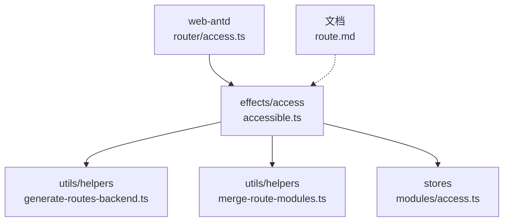
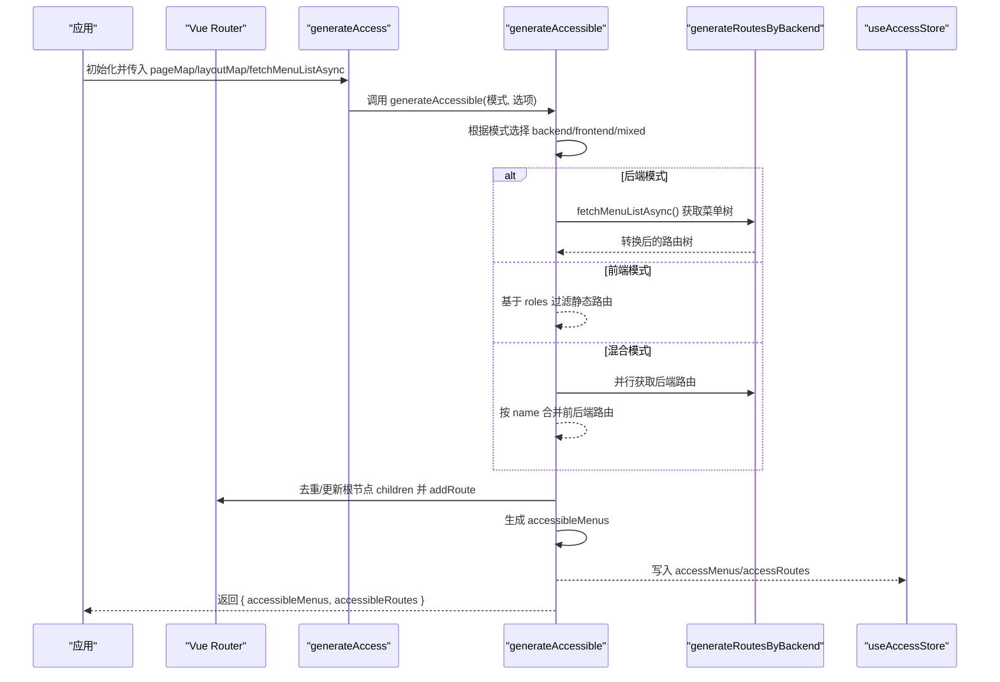
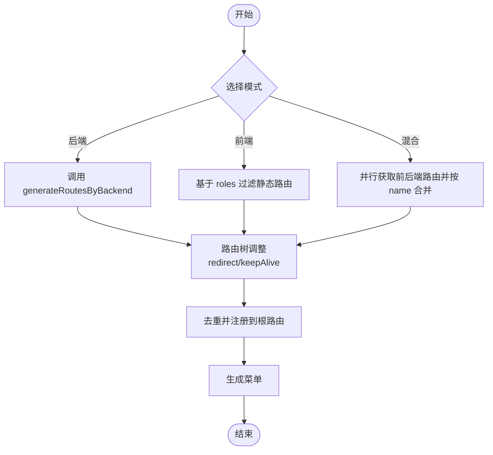
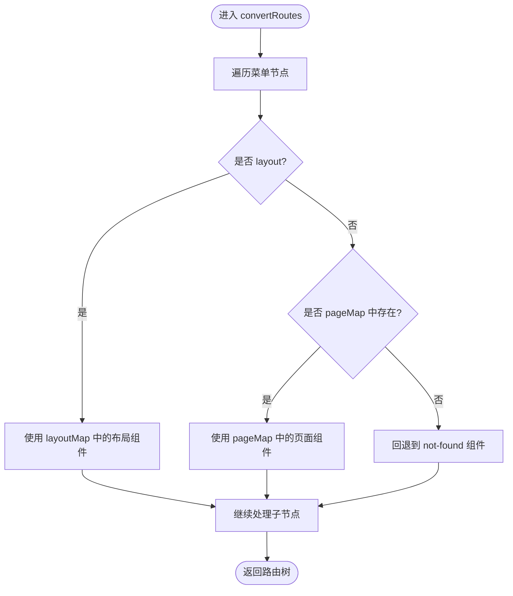
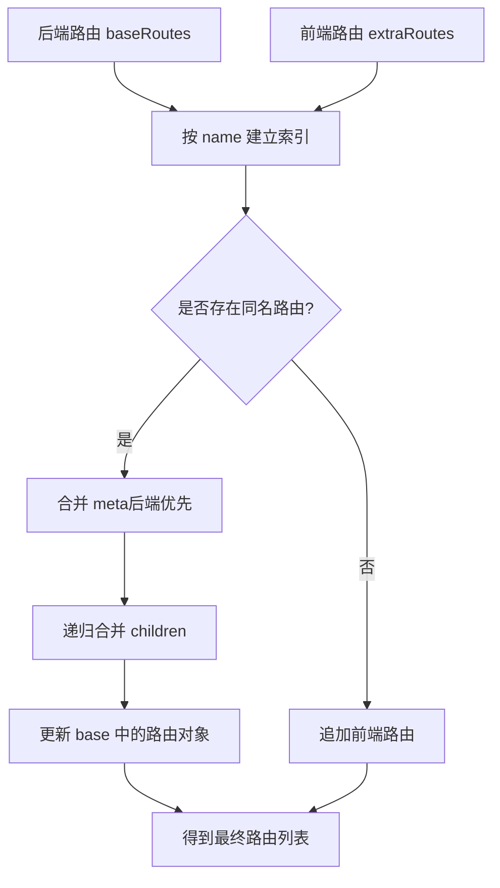
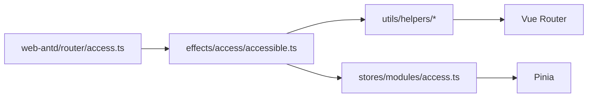

# 动态路由生成

<cite>
**本文引用的文件**
- [accessible.ts](file://frontend/packages/effects/access/src/accessible.ts)
- [access.ts](file://frontend/apps/web-antd/src/router/access.ts)
- [generate-routes-backend.ts](file://frontend/packages/utils/src/helpers/generate-routes-backend.ts)
- [merge-route-modules.ts](file://frontend/packages/utils/src/helpers/merge-route-modules.ts)
- [access.ts（stores）](file://frontend/packages/stores/src/modules/access.ts)
- [route.md](file://frontend/docs/src/en/guide/essentials/route.md)
</cite>

## 目录
1. [简介](#简介)
2. [项目结构](#项目结构)
3. [核心组件](#核心组件)
4. [架构总览](#架构总览)
5. [详细组件分析](#详细组件分析)
6. [依赖关系分析](#依赖关系分析)
7. [性能考虑](#性能考虑)
8. [故障排查指南](#故障排查指南)
9. [结论](#结论)
10. [附录](#附录)

## 简介
本文件围绕“基于用户权限的动态路由生成”进行系统化说明，覆盖后端菜单数据获取、前端路由映射、静态与动态路由合并策略、去重与冲突解决、角色到路由权限的转换逻辑、菜单树递归处理、路由参数绑定与路径解析、调试工具与性能优化建议，以及完整实现示例与扩展指南。目标是帮助读者在不深入源码的情况下也能理解并正确使用该能力。

## 项目结构
本项目采用前后端分离架构，动态路由由前端在登录后根据用户权限动态生成，并与静态路由合并后注册到 Vue Router。关键位置如下：
- 应用层接入点：位于 web-antd 应用的 router/access.ts，负责组装页面映射、布局映射、菜单加载回调等上下文，调用通用能力生成可访问路由与菜单。
- 通用能力层：packages/effects/access/src/accessible.ts 提供统一的模式切换（后端/前端/混合）、路由生成、路由树调整、菜单生成与注册。
- 后端模式实现：packages/utils/src/helpers/generate-routes-backend.ts 将后端返回的菜单树转换为路由树，完成组件懒加载映射与 403 占位替换。
- 模块合并工具：packages/utils/src/helpers/merge-route-modules.ts 用于合并多个动态路由模块的默认导出。
- 状态管理：packages/stores/src/modules/access.ts 维护可访问菜单、路由、权限码等状态。
- 文档参考：frontend/docs/src/en/guide/essentials/route.md 对核心路由、静态路由、动态路由及权限控制字段 meta.authority 进行了说明。

图表来源
- [access.ts:1-43](file://frontend/apps/web-antd/src/router/access.ts#L1-L43)
- [accessible.ts:1-219](file://frontend/packages/effects/access/src/accessible.ts#L1-L219)
- [generate-routes-backend.ts:1-109](file://frontend/packages/utils/src/helpers/generate-routes-backend.ts#L1-L109)
- [merge-route-modules.ts:1-28](file://frontend/packages/utils/src/helpers/merge-route-modules.ts#L1-L28)
- [access.ts（stores）:1-130](file://frontend/packages/stores/src/modules/access.ts#L1-L130)
- [route.md:1-37](file://frontend/docs/src/en/guide/essentials/route.md#L1-L37)

章节来源
- [access.ts:1-43](file://frontend/apps/web-antd/src/router/access.ts#L1-L43)
- [accessible.ts:1-219](file://frontend/packages/effects/access/src/accessible.ts#L1-L219)
- [generate-routes-backend.ts:1-109](file://frontend/packages/utils/src/helpers/generate-routes-backend.ts#L1-L109)
- [merge-route-modules.ts:1-28](file://frontend/packages/utils/src/helpers/merge-route-modules.ts#L1-L28)
- [access.ts（stores）:1-130](file://frontend/packages/stores/src/modules/access.ts#L1-L130)
- [route.md:1-37](file://frontend/docs/src/en/guide/essentials/route.md#L1-L37)

## 核心组件
- 统一入口 generateAccess：封装页面与布局映射、菜单异步加载、错误页组件注入，并将配置传递给通用能力层。
- 通用生成器 generateAccessible：支持三种模式（backend/frontend/mixed），统一生成可访问路由与菜单，并注册到路由器根节点，避免重复添加与层级嵌套问题。
- 后端路由生成 generateRoutesByBackend：从后端菜单树构建路由树，将字符串组件路径映射为懒加载函数；支持 menuVisibleWithForbidden 标记以展示“可见但无权限”的 403 占位。
- 模块合并 mergeRouteModules：聚合多个动态路由模块的默认导出，形成最终路由数组。
- 状态存储 useAccessStore：持久化 token、权限码、可访问菜单与路由等，并提供按路径查找菜单的能力。

章节来源
- [access.ts:1-43](file://frontend/apps/web-antd/src/router/access.ts#L1-L43)
- [accessible.ts:1-219](file://frontend/packages/effects/access/src/accessible.ts#L1-L219)
- [generate-routes-backend.ts:1-109](file://frontend/packages/utils/src/helpers/generate-routes-backend.ts#L1-L109)
- [merge-route-modules.ts:1-28](file://frontend/packages/utils/src/helpers/merge-route-modules.ts#L1-L28)
- [access.ts（stores）:1-130](file://frontend/packages/stores/src/modules/access.ts#L1-L130)

## 架构总览
下图展示了登录成功后，系统如何根据用户权限动态生成路由，并与静态路由合并，最终注册到 Vue Router 的过程。

图表来源
- [accessible.ts:21-157](file://frontend/packages/effects/access/src/accessible.ts#L21-L157)
- [generate-routes-backend.ts:22-59](file://frontend/packages/utils/src/helpers/generate-routes-backend.ts#L22-L59)
- [access.ts（stores）:51-130](file://frontend/packages/stores/src/modules/access.ts#L51-L130)

## 详细组件分析

### 统一入口：generateAccess
- 职责：收集页面与布局映射、定义菜单加载回调、注入 forbiddenComponent，并调用通用能力生成可访问路由与菜单。
- 关键点：
  - 使用 import.meta.glob 批量导入页面组件，形成 pageMap。
  - 通过 preferences.app.accessMode 决定路由生成模式。
  - 菜单加载时显示 loading 提示，提升用户体验。

章节来源
- [access.ts:1-43](file://frontend/apps/web-antd/src/router/access.ts#L1-L43)

### 通用生成器：generateAccessible
- 职责：根据模式生成路由，调整路由树（如自动设置 redirect、keepAlive 包装），去重并注册到路由器根节点，最后生成菜单。
- 关键点：
  - 模式分支：backend/frontend/mixed。
  - 路由树调整：为无 redirect 且含子路由的路由自动设置首子项 path 为 redirect；按需包装 keepAlive 组件名称。
  - 路由注册：若已存在同名路由则更新而非重复添加，避免一级目录未更新导致的 404。
  - 菜单生成：基于最终路由树生成菜单树。

图表来源
- [accessible.ts:75-157](file://frontend/packages/effects/access/src/accessible.ts#L75-L157)

章节来源
- [accessible.ts:21-157](file://frontend/packages/effects/access/src/accessible.ts#L21-L157)

### 后端模式：generateRoutesByBackend
- 职责：将后端返回的菜单树转换为路由树，完成组件懒加载映射与 403 占位替换。
- 关键点：
  - 组件映射：layoutMap 直接映射布局组件；pageMap 中按规范化路径匹配页面组件，找不到则回退到 not-found。
  - 403 占位：当 route.meta.menuVisibleWithForbidden 为 true 时，将 component 替换为 forbiddenComponent，使菜单可见但访问时展示 403。
  - 路径规范化：normalizeViewPath 去除相对前缀、确保以 / 开头、移除 /views 前缀以匹配 vben-admin 约定。

图表来源
- [generate-routes-backend.ts:62-107](file://frontend/packages/utils/src/helpers/generate-routes-backend.ts#L62-L107)

章节来源
- [generate-routes-backend.ts:1-109](file://frontend/packages/utils/src/helpers/generate-routes-backend.ts#L1-L109)

### 模块合并：mergeRouteModules
- 职责：将多个动态路由模块的默认导出合并为一个路由数组。
- 关键点：
  - 安全读取 default 导出，空模块或无默认导出时忽略。
  - 保持顺序稳定，便于后续按 name 合并与去重。

章节来源
- [merge-route-modules.ts:1-28](file://frontend/packages/utils/src/helpers/merge-route-modules.ts#L1-L28)

### 状态管理：useAccessStore
- 职责：维护可访问菜单、路由、权限码、登录态等，并提供按路径查找菜单的方法。
- 关键点：
  - 持久化 token、权限码、锁屏相关状态。
  - getMenuByPath 支持在菜单树中递归查找指定路径对应的菜单项。

章节来源
- [access.ts（stores）:1-130](file://frontend/packages/stores/src/modules/access.ts#L1-L130)

### 静态与动态路由合并策略、去重与冲突解决
- 模式选择：
  - backend：仅使用后端返回的菜单树生成路由。
  - frontend：基于本地静态路由与 roles 过滤生成。
  - mixed：并行获取前后端路由，再按 name 合并。
- 合并规则（mixed 模式）：
  - 以 baseRoutes（后端）为基础，extraRoutes（前端）作为补充。
  - 同名路由合并时，meta 字段以后端为准（覆盖前端），children 递归合并。
  - 不存在的前端路由直接追加。
- 去重机制：
  - 在注册阶段，若根路由下已存在同名路由，则更新其配置而非重复添加，避免重复注册与层级嵌套问题。

图表来源
- [accessible.ts:164-216](file://frontend/packages/effects/access/src/accessible.ts#L164-L216)

章节来源
- [accessible.ts:100-216](file://frontend/packages/effects/access/src/accessible.ts#L100-L216)

### 角色权限到路由权限的转换逻辑
- 权限控制字段：route.meta.authority 用于声明路由所需的权限标识。
- 前端模式：根据当前角色的权限集合过滤静态路由，仅保留满足 authority 要求的路由。
- 后端模式：后端菜单树通常已按角色/权限裁剪，前端直接转换即可。
- 混合模式：前后端分别处理后合并，保证权限一致性。

章节来源
- [route.md:15-37](file://frontend/docs/src/en/guide/essentials/route.md#L15-L37)
- [accessible.ts:80-111](file://frontend/packages/effects/access/src/accessible.ts#L80-L111)

### 菜单树结构的递归处理
- 后端模式：convertRoutes 使用 mapTree 递归遍历菜单树，逐节点完成组件映射与 403 占位替换。
- 通用调整：generateRoutes 再次使用 mapTree 对路由树进行调整（如自动设置 redirect、包装 keepAlive）。
- 菜单生成：基于最终路由树生成菜单树，供侧边栏渲染。

章节来源
- [generate-routes-backend.ts:62-94](file://frontend/packages/utils/src/helpers/generate-routes-backend.ts#L62-L94)
- [accessible.ts:118-154](file://frontend/packages/effects/access/src/accessible.ts#L118-L154)

### 路由参数的动态绑定与路径参数解析
- 动态绑定：后端菜单中的 component 字段会被规范化为页面组件懒加载函数，从而支持运行时按需加载。
- 路径解析：当父路由没有显式 redirect 且包含子路由时，系统会自动将第一个子路由的绝对 path 设置为父路由的 redirect，简化导航体验。
- 注意：对于非以 / 开头的子路由，为避免复杂计算，不做自动 redirect 处理，需手动配置。

章节来源
- [generate-routes-backend.ts:96-107](file://frontend/packages/utils/src/helpers/generate-routes-backend.ts#L96-L107)
- [accessible.ts:141-154](file://frontend/packages/effects/access/src/accessible.ts#L141-L154)

### 调试工具与实践建议
- 菜单加载反馈：在菜单加载期间显示 loading 提示，便于定位网络或接口问题。
- 组件缺失回退：当 pageMap 中找不到对应页面时，自动回退到 not-found 组件，避免白屏。
- 403 占位：通过 menuVisibleWithForbidden 标记，可在菜单中显示功能入口但访问时给出 403 提示，便于权限申请引导。
- 日志输出：组件映射失败时会输出错误日志，便于快速定位路径或命名问题。

章节来源
- [access.ts:25-39](file://frontend/apps/web-antd/src/router/access.ts#L25-L39)
- [generate-routes-backend.ts:75-90](file://frontend/packages/utils/src/helpers/generate-routes-backend.ts#L75-L90)

## 依赖关系分析
- 耦合关系：
  - web-antd 的 router/access.ts 依赖 preferences 与通用能力层，低耦合、高内聚。
  - accessible.ts 依赖 utils 的工具函数与 stores 的状态管理，职责清晰。
  - generate-routes-backend.ts 依赖页面与布局映射表，解耦了具体组件实现。
- 外部依赖：
  - Vue Router：用于路由注册与导航。
  - Pinia：用于状态持久化与管理。
  - Ant Design Vue：用于 UI 交互（loading、message）。

图表来源
- [access.ts:1-43](file://frontend/apps/web-antd/src/router/access.ts#L1-L43)
- [accessible.ts:1-219](file://frontend/packages/effects/access/src/accessible.ts#L1-L219)
- [access.ts（stores）:1-130](file://frontend/packages/stores/src/modules/access.ts#L1-L130)

章节来源
- [access.ts:1-43](file://frontend/apps/web-antd/src/router/access.ts#L1-L43)
- [accessible.ts:1-219](file://frontend/packages/effects/access/src/accessible.ts#L1-L219)
- [access.ts（stores）:1-130](file://frontend/packages/stores/src/modules/access.ts#L1-L130)

## 性能考虑
- 懒加载：页面组件通过 import.meta.glob 批量导入并以懒加载方式挂载，减少首屏体积。
- 并行获取：混合模式下前后端路由并行获取，缩短等待时间。
- 去重与更新：注册阶段按 name 去重并更新已有路由，避免重复 addRoute 带来的开销。
- 自动 redirect：为无 redirect 的父路由自动设置首子项 redirect，减少额外跳转。
- 缓存友好：对 keepAlive 的组件进行名称包装，利于条件缓存命中。

[本节为通用性能建议，不直接分析具体文件]

## 故障排查指南
- 菜单加载失败：检查 fetchMenuListAsync 是否正确返回菜单树；确认后端接口可用性与数据结构。
- 组件映射失败：确认 pageMap 中的路径与组件文件名一致；查看控制台错误日志，核对 normalizeViewPath 的结果。
- 403 占位异常：检查 route.meta.menuVisibleWithForbidden 是否为 true；确认 forbiddenComponent 正确注入。
- 路由重复或 404：检查路由 name 是否唯一；确认根路由 children 的去重与更新逻辑是否生效。
- 权限不生效：确认 route.meta.authority 配置与当前角色权限集合匹配；在前端模式下检查 roles 过滤逻辑。

章节来源
- [generate-routes-backend.ts:75-90](file://frontend/packages/utils/src/helpers/generate-routes-backend.ts#L75-L90)
- [accessible.ts:38-67](file://frontend/packages/effects/access/src/accessible.ts#L38-L67)

## 结论
本方案通过统一的模式切换与通用的路由生成能力，实现了灵活、可扩展的动态路由体系。后端菜单驱动与前端静态路由相结合，既保证了权限控制的严谨性，又提升了开发效率。配合完善的调试与性能优化手段，能够在复杂业务场景下稳定运行。

[本节为总结性内容，不直接分析具体文件]

## 附录
- 实现示例要点：
  - 在应用入口调用 generateAccess，传入 pageMap、layoutMap、fetchMenuListAsync 与 forbiddenComponent。
  - 在后端菜单中为需要“可见但无权限”的节点设置 meta.menuVisibleWithForbidden = true。
  - 在静态路由中使用 meta.authority 声明权限标识，以便前端模式下的权限过滤。
- 扩展指南：
  - 新增页面：在 views 目录下创建组件，并确保 import.meta.glob 能捕获到；或在后端菜单中配置 component 路径。
  - 新增布局：在 layoutMap 中注册布局组件，并在后端菜单中引用。
  - 新增权限：在 route.meta.authority 中添加新的权限标识，并在后端菜单中按角色裁剪。
  - 混合模式：启用 preferences.app.accessMode = 'mixed'，利用 name 合并策略融合前后端路由。

[本节为扩展性指导，不直接分析具体文件]