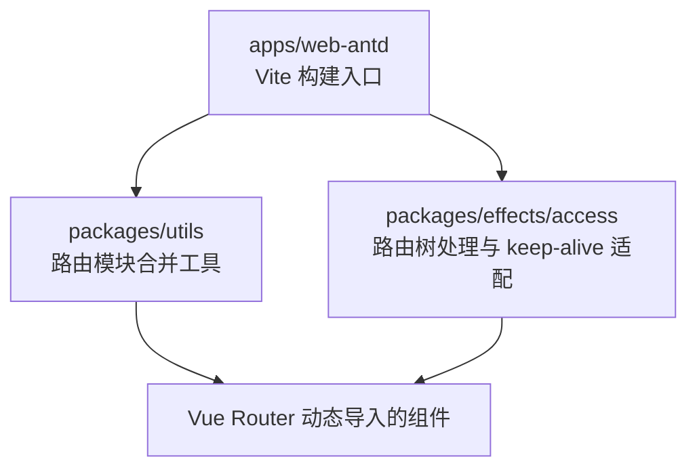
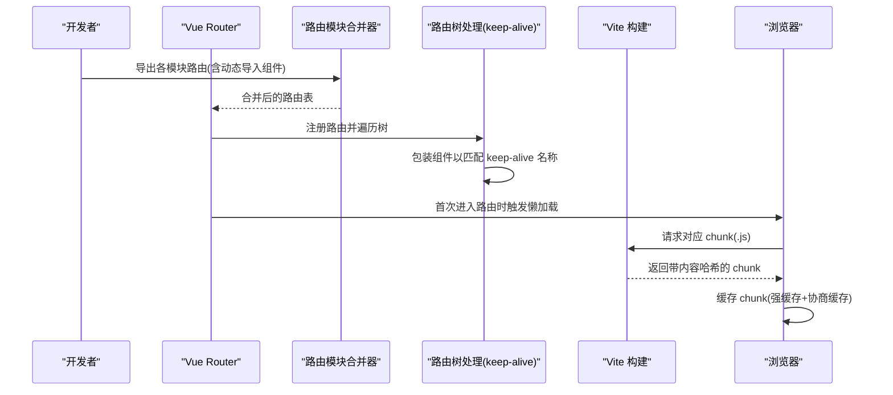
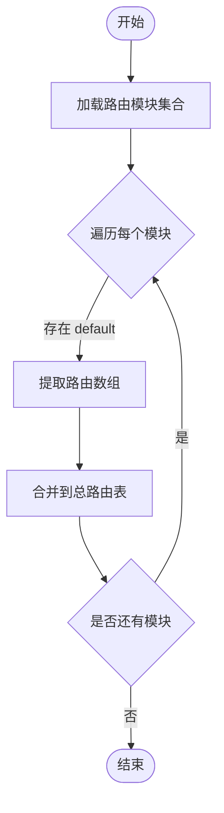
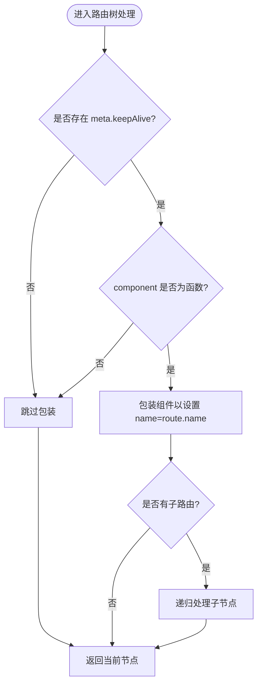
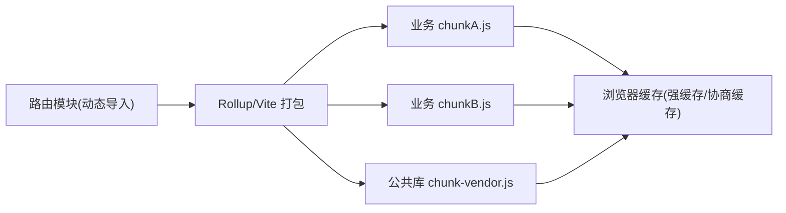
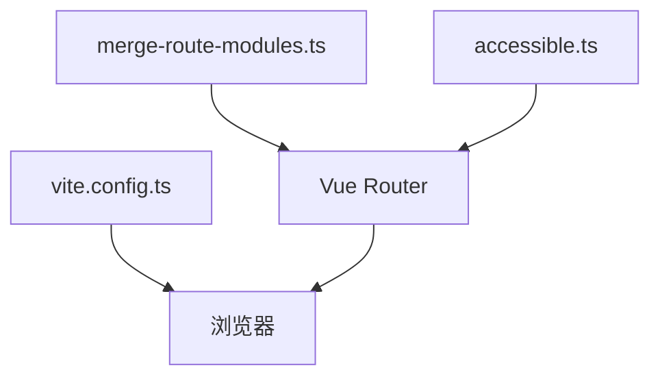

# 懒加载与代码分割

<cite>
**本文引用的文件**
- [merge-route-modules.ts](file://frontend/packages/utils/src/helpers/merge-route-modules.ts)
- [merge-route-modules.test.ts](file://frontend/packages/utils/src/helpers/__tests__/merge-route-modules.test.ts)
- [accessible.ts](file://frontend/packages/effects/access/src/accessible.ts)
- [vite.config.ts](file://frontend/apps/web-antd/vite.config.ts)
</cite>

## 目录
1. [简介](#简介)
2. [项目结构](#项目结构)
3. [核心组件](#核心组件)
4. [架构总览](#架构总览)
5. [详细组件分析](#详细组件分析)
6. [依赖关系分析](#依赖关系分析)
7. [性能考量](#性能考量)
8. [故障排查指南](#故障排查指南)
9. [结论](#结论)
10. [附录](#附录)

## 简介
本文件围绕前端路由级懒加载与代码分割展开，聚焦以下主题：
- Vue Router 的动态导入语法与组件级代码分割实现
- 路由级异步加载机制、预加载策略与性能优化
- Vite 构建工具下的路由代码分割配置与 chunk 生成规则
- 路由级别的缓存控制与按需加载策略
- 懒加载的性能监控方法与常见问题解决方案
- 具体配置示例与最佳实践

## 项目结构
本项目采用 monorepo 组织，前端应用位于 apps/web-antd，相关路由合并与访问控制逻辑位于 packages/utils 与 packages/effects/access。Vite 构建配置位于 apps/web-antd/vite.config.ts。

图表来源
- [vite.config.ts:1-200](file://frontend/apps/web-antd/vite.config.ts#L1-L200)
- [merge-route-modules.ts:1-200](file://frontend/packages/utils/src/helpers/merge-route-modules.ts#L1-L200)
- [accessible.ts:113-150](file://frontend/packages/effects/access/src/accessible.ts#L113-L150)

章节来源
- [vite.config.ts:1-200](file://frontend/apps/web-antd/vite.config.ts#L1-L200)
- [merge-route-modules.ts:1-200](file://frontend/packages/utils/src/helpers/merge-route-modules.ts#L1-L200)
- [accessible.ts:113-150](file://frontend/packages/effects/access/src/accessible.ts#L113-L150)

## 核心组件
- 路由模块合并器：将多个路由模块（每个模块导出路由数组）合并为最终路由表，支持以函数形式声明的组件，天然契合动态导入与懒加载。
- 访问控制与路由树处理：对路由树进行遍历与改造，确保启用 keep-alive 时，懒加载组件的名称与路由名称一致，从而正确命中缓存。
- Vite 构建配置：通过分包策略与 chunk 命名约定，将路由级组件拆分为独立 chunk，并配合浏览器缓存策略提升二次加载性能。

章节来源
- [merge-route-modules.ts:1-200](file://frontend/packages/utils/src/helpers/merge-route-modules.ts#L1-L200)
- [accessible.ts:113-150](file://frontend/packages/effects/access/src/accessible.ts#L113-L150)
- [vite.config.ts:1-200](file://frontend/apps/web-antd/vite.config.ts#L1-L200)

## 架构总览
下图展示了从路由定义到组件懒加载、再到 Vite 打包成 chunk 的整体流程。

图表来源
- [merge-route-modules.ts:1-200](file://frontend/packages/utils/src/helpers/merge-route-modules.ts#L1-L200)
- [accessible.ts:113-150](file://frontend/packages/effects/access/src/accessible.ts#L113-L150)
- [vite.config.ts:1-200](file://frontend/apps/web-antd/vite.config.ts#L1-L200)

## 详细组件分析

### 路由模块合并器（merge-route-modules）
- 职责：接收多份路由模块，将其默认导出的路由数组合并为单一路由表；保留组件为函数的形式，便于运行时按需加载。
- 关键点：
  - 支持组件为函数（Promise），即动态导入语法，天然实现组件级代码分割。
  - 测试用例验证了合并结果的结构与类型一致性。
- 复杂度：线性遍历模块集合，时间复杂度 O(n)，空间复杂度 O(n)。

图表来源
- [merge-route-modules.ts:1-200](file://frontend/packages/utils/src/helpers/merge-route-modules.ts#L1-L200)
- [merge-route-modules.test.ts:1-51](file://frontend/packages/utils/src/helpers/__tests__/merge-route-modules.test.ts#L1-L51)

章节来源
- [merge-route-modules.ts:1-200](file://frontend/packages/utils/src/helpers/merge-route-modules.ts#L1-L200)
- [merge-route-modules.test.ts:1-51](file://frontend/packages/utils/src/helpers/__tests__/merge-route-modules.test.ts#L1-L51)

### 访问控制与路由树处理（keep-alive 适配）
- 职责：在路由注册前对路由树进行处理，确保启用 keep-alive 时，懒加载组件的 name 与路由 name 一致，从而正确命中缓存。
- 关键点：
  - 若 route.meta.keepAlive 为真且 component 为函数，则重新包装组件，使其暴露与路由一致的 name。
  - 对无子路由或已有 redirect 的路由直接返回，减少不必要的处理。
- 性能影响：仅在路由注册阶段执行一次，开销可忽略。

图表来源
- [accessible.ts:113-150](file://frontend/packages/effects/access/src/accessible.ts#L113-L150)

章节来源
- [accessible.ts:113-150](file://frontend/packages/effects/access/src/accessible.ts#L113-L150)

### Vite 构建与代码分割配置
- 职责：配置分包策略、chunk 命名与输出，使路由级组件按模块拆分，并生成带内容哈希的文件名以提升缓存命中率。
- 关键点：
  - 使用 rollupOptions.output.manualChunks 或 splitPoint 等策略，将路由模块及其依赖拆分为独立 chunk。
  - 文件名包含内容哈希，利于长期缓存；结合 HTTP 缓存头可实现“强缓存 + 协商缓存”的组合策略。
  - 建议将第三方库与业务代码分离，避免频繁更新导致的大体积 chunk 失效。

图表来源
- [vite.config.ts:1-200](file://frontend/apps/web-antd/vite.config.ts#L1-L200)

章节来源
- [vite.config.ts:1-200](file://frontend/apps/web-antd/vite.config.ts#L1-L200)

## 依赖关系分析
- merge-route-modules 被用于聚合路由模块，其产物作为 Vue Router 的路由表。
- accessible 在路由注册前对路由树进行增强，保证 keep-alive 与懒加载协同工作。
- vite.config.ts 决定最终 chunk 划分与命名，直接影响网络传输与缓存行为。

图表来源
- [merge-route-modules.ts:1-200](file://frontend/packages/utils/src/helpers/merge-route-modules.ts#L1-L200)
- [accessible.ts:113-150](file://frontend/packages/effects/access/src/accessible.ts#L113-L150)
- [vite.config.ts:1-200](file://frontend/apps/web-antd/vite.config.ts#L1-L200)

章节来源
- [merge-route-modules.ts:1-200](file://frontend/packages/utils/src/helpers/merge-route-modules.ts#L1-L200)
- [accessible.ts:113-150](file://frontend/packages/effects/access/src/accessible.ts#L113-L150)
- [vite.config.ts:1-200](file://frontend/apps/web-antd/vite.config.ts#L1-L200)

## 性能考量
- 首屏优化
  - 仅对非首屏路由使用动态导入，减少初始包体积。
  - 将高频使用的公共依赖抽离为 vendor chunk，提高复用率。
- 缓存策略
  - 利用内容哈希文件名，配合服务端强缓存（如 Cache-Control: immutable）与协商缓存（ETag/Last-Modified）。
  - 对静态资源与 chunk 分别设置合适的缓存过期时间。
- 预加载与优先级
  - 对即将可能访问的路由使用 import() 的预加载提示（如 rel="modulepreload"），降低跳转延迟。
  - 合理设置 chunk 大小阈值，避免单个 chunk 过大影响解析与执行。
- 监控指标
  - 关注 TTFB、FCP、LCP、CLS 以及路由切换时的 JS 执行时间与网络耗时。
  - 通过 Performance API 记录懒加载耗时，结合错误上报定位问题。

[本节为通用性能指导，不直接分析具体文件]

## 故障排查指南
- 现象：keep-alive 未生效，组件重复创建
  - 原因：懒加载组件未暴露与路由一致的 name
  - 解决：确保路由树处理逻辑对动态导入组件进行包装，使其 name 与路由 name 一致
  - 参考位置：[accessible.ts:113-150](file://frontend/packages/effects/access/src/accessible.ts#L113-L150)
- 现象：路由切换卡顿或白屏
  - 原因：chunk 过大或并发请求过多
  - 解决：调整分包粒度，拆分大组件；使用预加载与优先级控制；检查网络与缓存策略
  - 参考位置：[vite.config.ts:1-200](file://frontend/apps/web-antd/vite.config.ts#L1-L200)
- 现象：合并后路由异常或缺失
  - 原因：模块导出格式不正确或合并逻辑未覆盖边界情况
  - 解决：核对模块默认导出结构，参考测试用例校验合并结果
  - 参考位置：[merge-route-modules.test.ts:1-51](file://frontend/packages/utils/src/helpers/__tests__/merge-route-modules.test.ts#L1-L51)

章节来源
- [accessible.ts:113-150](file://frontend/packages/effects/access/src/accessible.ts#L113-L150)
- [vite.config.ts:1-200](file://frontend/apps/web-antd/vite.config.ts#L1-L200)
- [merge-route-modules.test.ts:1-51](file://frontend/packages/utils/src/helpers/__tests__/merge-route-modules.test.ts#L1-L51)

## 结论
通过将路由级组件以动态导入方式声明，并结合路由模块合并与 keep-alive 适配，可在保证开发体验的同时实现细粒度的代码分割与缓存优化。Vite 的分包策略与内容哈希命名进一步提升了缓存命中率与加载性能。建议在项目中持续监控关键性能指标，并根据实际流量特征调整分包与缓存策略。

[本节为总结性内容，不直接分析具体文件]

## 附录
- 最佳实践清单
  - 将非首屏路由统一使用动态导入
  - 保持路由 name 与组件 name 一致，确保 keep-alive 命中
  - 将稳定第三方库抽离为 vendor chunk
  - 为重要路由添加 modulepreload 提示
  - 使用内容哈希文件名并配置合理的缓存策略
  - 建立懒加载性能监控与告警机制

[本节为通用实践建议，不直接分析具体文件]