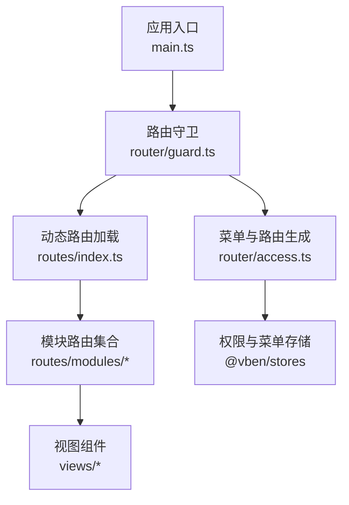
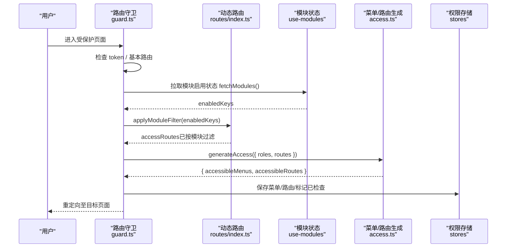
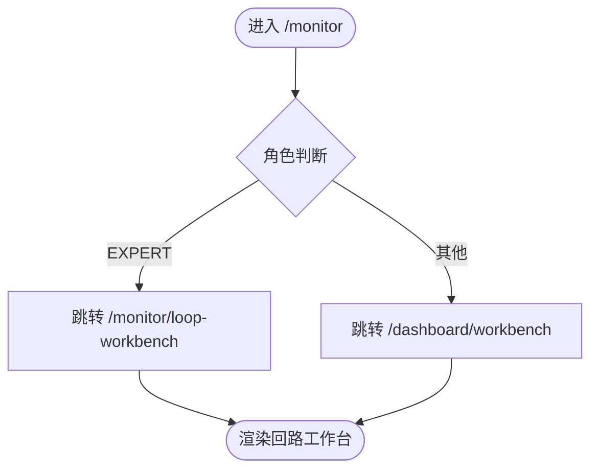
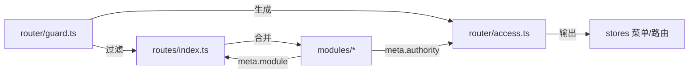

# 模块化路由配置

<cite>
**本文引用的文件**
- [index.ts](file://frontend/apps/web-antd/src/router/routes/index.ts)
- [core.ts](file://frontend/apps/web-antd/src/router/routes/core.ts)
- [guard.ts](file://frontend/apps/web-antd/src/router/guard.ts)
- [access.ts](file://frontend/apps/web-antd/src/router/access.ts)
- [monitor.ts](file://frontend/apps/web-antd/src/router/routes/modules/monitor.ts)
- [assess.ts](file://frontend/apps/web-antd/src/router/routes/modules/assess.ts)
- [diagnosis.ts](file://frontend/apps/web-antd/src/router/routes/modules/diagnosis.ts)
- [tuning.ts](file://frontend/apps/web-antd/src/router/routes/modules/tuning.ts)
- [handling.ts](file://frontend/apps/web-antd/src/router/routes/modules/handling.ts)
- [reports.ts](file://frontend/apps/web-antd/src/router/routes/modules/reports.ts)
- [system.ts](file://frontend/apps/web-antd/src/router/routes/modules/system.ts)
- [loop.ts](file://frontend/apps/web-antd/src/router/routes/modules/loop.ts)
- [config.ts](file://frontend/apps/web-antd/src/router/routes/modules/config.ts)
- [alert.ts](file://frontend/apps/web-antd/src/router/routes/modules/alert.ts)
</cite>

## 目录
1. [简介](#简介)
2. [项目结构](#项目结构)
3. [核心组件](#核心组件)
4. [架构总览](#架构总览)
5. [详细组件分析](#详细组件分析)
6. [依赖关系分析](#依赖关系分析)
7. [性能与可维护性](#性能与可维护性)
8. [故障排查指南](#故障排查指南)
9. [结论](#结论)
10. [附录：最佳实践与示例](#附录最佳实践与示例)

## 简介
本文件面向 CLPM 前端应用的“模块化路由配置”，聚焦 routes/modules 目录下的业务模块路由组织方式，覆盖监控、评估、诊断、整定、处置、报告、系统等业务域。文档重点说明：
- 路由元信息配置：页面标题、图标、面包屑控制、缓存控制、权限标识等
- 嵌套路由模式：父子路由关系与参数传递机制
- 动态路由生成：基于用户角色与启用模块的菜单/路由过滤
- 兼容与迁移：旧路径重定向策略与书签保护
- 最佳实践：新增模块、新增子页、权限与元信息的规范写法

## 项目结构
前端路由采用“基础路由 + 动态模块路由 + 静态/外部路由”的分层组织：
- 基础路由：登录、认证、根布局、404 兜底等
- 动态模块路由：按业务模块拆分到 routes/modules/*.ts，统一通过 glob 合并
- 访问控制：登录后拉取菜单与权限，结合“已启用模块”过滤生成最终可访问路由树

图表来源
- [guard.ts:48-138](file://frontend/apps/web-antd/src/router/guard.ts#L48-L138)
- [index.ts:7-16](file://frontend/apps/web-antd/src/router/routes/index.ts#L7-L16)
- [access.ts:17-39](file://frontend/apps/web-antd/src/router/access.ts#L17-L39)

章节来源
- [index.ts:1-102](file://frontend/apps/web-antd/src/router/routes/index.ts#L1-L102)
- [core.ts:1-98](file://frontend/apps/web-antd/src/router/routes/core.ts#L1-L98)
- [guard.ts:1-153](file://frontend/apps/web-antd/src/router/guard.ts#L1-L153)
- [access.ts:1-43](file://frontend/apps/web-antd/src/router/access.ts#L1-L43)

## 核心组件
- 动态路由聚合：通过 import.meta.glob 收集 modules 下所有路由定义并合并为 allDynamicRoutes；提供 applyModuleFilter 根据“已启用模块 key 集合”递归过滤路由树；提供 isKnownRoutePath 用于未启用模块 URL 返回 404（非 403）。
- 路由守卫：在 beforeEach 中完成登录态校验、token 有效性验证、模块状态获取与路由过滤、菜单与路由生成、重定向处理。
- 菜单与路由生成：generateAccessible 从后端接口获取菜单列表，结合 pageMap/layoutMap 与权限规则生成 accessibleMenus 与 accessibleRoutes。

关键职责映射
- 模块开关：fetchModules + getEnabledKeys → applyModuleFilter
- 权限过滤：roles → generateAccess → accessibleRoutes
- 兼容重定向：legacy redirect 保留书签/E2E 稳定

章节来源
- [index.ts:41-93](file://frontend/apps/web-antd/src/router/routes/index.ts#L41-L93)
- [guard.ts:48-138](file://frontend/apps/web-antd/src/router/guard.ts#L48-L138)
- [access.ts:17-39](file://frontend/apps/web-antd/src/router/access.ts#L17-L39)

## 架构总览
下图展示一次登录后到菜单/路由生成的完整流程，以及模块开关对路由树的裁剪过程。

图表来源
- [guard.ts:48-138](file://frontend/apps/web-antd/src/router/guard.ts#L48-L138)
- [index.ts:76-93](file://frontend/apps/web-antd/src/router/routes/index.ts#L76-L93)
- [access.ts:17-39](file://frontend/apps/web-antd/src/router/access.ts#L17-L39)

## 详细组件分析

### 监控模块（monitor）
- 定位：运行驾驶舱与单回路处置入口，承载装置工作台、关注队列、预警事件、回路工作台等。
- 嵌套路由：父路由 meta.module='monitor'，子路由分别对应不同功能页；部分隐藏路由用于历史兼容或高密度实时表。
- 权限：各子路由通过 authority 精确控制可见性与操作能力；EXPERT 仅特定入口可见。
- 重定向：/monitor 默认跳转到依据角色计算的目标；/dashboard 兼容重定向到 /dashboard/workbench。

图表来源
- [monitor.ts:5-10](file://frontend/apps/web-antd/src/router/routes/modules/monitor.ts#L5-L10)
- [monitor.ts:28-151](file://frontend/apps/web-antd/src/router/routes/modules/monitor.ts#L28-L151)

章节来源
- [monitor.ts:1-155](file://frontend/apps/web-antd/src/router/routes/modules/monitor.ts#L1-L155)

### 评估模块（assess）
- 子菜单：性能总览、回路性能、评估任务；KPI 报表已迁入统计报告模块。
- 权限：ADMIN/IC_ENGINEER/PE_ENGINEER/SPONSOR 可查看；评估任务仅限 ADMIN/IC_ENGINEER。
- 兼容：/metric 父路径重定向到新入口，/metric/kpi-report 重定向到 /reports/performance。

章节来源
- [assess.ts:1-88](file://frontend/apps/web-antd/src/router/routes/modules/assess.ts#L1-L88)

### 诊断模块（diagnosis）
- 两页式：诊断工作台（发起+结果）、诊断记录（历史+导出）。
- 权限：工作台发起限制为 ADMIN/IC_ENGINEER/PE_ENGINEER；查看开放给全部登录角色。
- 路由：/diagnosis/workbench、/diagnosis/records。

章节来源
- [diagnosis.ts:1-59](file://frontend/apps/web-antd/src/router/routes/modules/diagnosis.ts#L1-L59)

### 整定模块（tuning）
- 三页式：整定工作台（辨识→矩阵→仿真→确认）、整定记录、效果验证。
- 权限：工作台操作限制为 ADMIN/IC_ENGINEER/EXPERT；查看开放给全部登录角色。
- 路由：/tuning/workbench、/tuning/records、/tuning/verification。

章节来源
- [tuning.ts:1-76](file://frontend/apps/web-antd/src/router/routes/modules/tuning.ts#L1-L76)

### 处置模块（handling）
- 三页式：处置工作台、处置档案、处置统计（已迁至 /reports/handling）。
- 权限：三页查看全角色；流转操作限制为 ADMIN/IC_ENGINEER/PE_ENGINEER（后端兜底）。
- 兼容：/handling 重定向到 /handling/workbench 并透传 query。

章节来源
- [handling.ts:1-68](file://frontend/apps/web-antd/src/router/routes/modules/handling.ts#L1-L68)

### 统计报告模块（reports）
- 二级菜单：管理总览、绩效报告、诊断报告、处置报告、收益报告、订阅配置。
- 权限：父路由 authority 取子路由并集，避免菜单不可见；订阅配置仅 ADMIN。
- 迁移：自动报表从系统管理迁入此处，旧路径保留重定向。

章节来源
- [reports.ts:1-110](file://frontend/apps/web-antd/src/router/routes/modules/reports.ts#L1-L110)

### 系统管理模块（system）
- 功能：用户管理、审计日志、字典管理、权限矩阵、模块管理、订阅配置（重定向）。
- 权限：多数管理功能仅 ADMIN；权限矩阵对所有角色可见。
- 迁移：算法参数配置、PID 模板等已迁移或重定向。

章节来源
- [system.ts:1-119](file://frontend/apps/web-antd/src/router/routes/modules/system.ts#L1-L119)

### 配置模块（config）
- 集中工程/结构性配置：链路配置、测点配置、回路配置、工厂配置、数据检查、指标配置、诊断配置、预警规则等。
- 权限：父路由 authority 取子路由并集，避免 IC/PE 看不到菜单；写端点多为 ADMIN。
- 兼容：大量 legacy redirect 保护旧书签与 E2E。

章节来源
- [config.ts:1-236](file://frontend/apps/web-antd/src/router/routes/modules/config.ts#L1-L236)

### 旧路由兼容（loop、alert）
- loop：将 /loop、/loop/workbench、/loop/detail/:id 重定向到 /monitor/loop-workbench，并透传/转换参数。
- alert：将 /alert/events 重定向到 /monitor/alerts，/alert/rules 重定向到 /config/alert-rules。

章节来源
- [loop.ts:1-62](file://frontend/apps/web-antd/src/router/routes/modules/loop.ts#L1-L62)
- [alert.ts:1-58](file://frontend/apps/web-antd/src/router/routes/modules/alert.ts#L1-L58)

## 依赖关系分析
- 模块聚合：routes/index.ts 使用 mergeRouteModules 合并 modules 下所有路由；applyModuleFilter 递归过滤 children。
- 守卫驱动：router/guard.ts 在 beforeEach 中调用 fetchModules 与 applyModuleFilter，再调用 access.ts 的 generateAccess 生成菜单与路由。
- 权限模型：每个路由 meta.authority 声明允许的角色集合；菜单显示由 generateAccessible 结合后端菜单与前端权限规则决定。
- 模块开关：meta.module 字段用于模块级热插拔；未启用模块的路由将被移除，URL 访问走 404。

图表来源
- [index.ts:7-16](file://frontend/apps/web-antd/src/router/routes/index.ts#L7-L16)
- [guard.ts:113-128](file://frontend/apps/web-antd/src/router/guard.ts#L113-L128)
- [access.ts:17-39](file://frontend/apps/web-antd/src/router/access.ts#L17-L39)

章节来源
- [index.ts:1-102](file://frontend/apps/web-antd/src/router/routes/index.ts#L1-L102)
- [guard.ts:1-153](file://frontend/apps/web-antd/src/router/guard.ts#L1-L153)
- [access.ts:1-43](file://frontend/apps/web-antd/src/router/access.ts#L1-L43)

## 性能与可维护性
- 懒加载：组件使用 () => import(...) 实现按需加载，减少首屏体积。
- 模块过滤：通过 applyModuleFilter 提前裁剪路由树，降低后续权限计算与菜单渲染成本。
- 兼容重定向：集中管理 legacy redirect，避免散落的分支逻辑影响主流程。
- 可扩展性：新增模块只需在 routes/modules 下新增文件并设置 meta.module，即可参与模块开关与菜单生成。

[本节为通用指导，不直接分析具体文件]

## 故障排查指南
- 登录后仍无菜单或路由
  - 检查是否成功调用 fetchModules 与 applyModuleFilter
  - 确认 enabledKeys 包含当前模块 key
  - 核对路由 meta.authority 是否包含用户角色
- 访问未启用模块 URL 出现 403
  - 确认 isKnownRoutePath 匹配的是过滤后的路由 path 模式
  - 若期望 404 而非 403，确保该路径不在 dynamicRoutePathPatterns 中
- 旧链接失效
  - 检查 legacy redirect 是否存在且正确透传 query/params
  - 确认重定向目标具备相应权限

章节来源
- [guard.ts:48-138](file://frontend/apps/web-antd/src/router/guard.ts#L48-L138)
- [index.ts:76-93](file://frontend/apps/web-antd/src/router/routes/index.ts#L76-L93)

## 结论
本项目的模块化路由以“模块文件即路由单元”的方式组织，配合“模块开关 + 角色权限”的双重过滤，实现了灵活、可控、可扩展的前端导航体系。通过统一的元信息约定（title、icon、authority、module、hideInMenu 等），既保证了菜单与面包屑的一致性，也为未来模块热插拔与多租户场景打下基础。

[本节为总结性内容，不直接分析具体文件]

## 附录：最佳实践与示例

- 新增业务模块
  - 在 routes/modules 下新建文件，导出 RouteRecordRaw[]
  - 父路由设置 meta.title、meta.icon、meta.order、meta.module、meta.authority
  - 子路由按需设置 hideInMenu、affixTab、fullPathKey 等元信息
  - 如需兼容旧路径，添加 redirect 并保留 authority 与 hideInMenu

- 嵌套路由与参数传递
  - 父路由负责导航与权限，子路由承载具体页面
  - 使用 query 传递轻量参数（如 loopId、tab），使用 params 传递路径参数（如 :id）
  - 重定向时透传 to.query 或转换参数（例如 /loop/detail/:id → /monitor/loop-workbench?loopId=:id）

- 权限与元信息
  - authority：声明允许的角色数组，越细粒度越好
  - title：用于面包屑与标签页标题
  - icon：用于菜单图标
  - module：用于模块级开关过滤
  - hideInMenu：隐藏菜单但保留路由（常用于兼容或工具页）
  - affixTab：固定标签页（如工作台）
  - fullPathKey：控制标签页唯一性策略

- 动态路由与菜单生成
  - 登录后先 fetchModules 获取 enabledKeys，再 applyModuleFilter 裁剪路由树
  - 调用 generateAccess 传入 roles 与 routes，得到 accessibleMenus 与 accessibleRoutes
  - 将结果保存到 stores，并标记 isAccessChecked=true

- 兼容与迁移
  - 优先使用 redirect 迁移旧路径，保持 hideInMenu 避免污染菜单
  - 保留必要的 legacy 路由名，便于测试与回归

章节来源
- [monitor.ts:28-151](file://frontend/apps/web-antd/src/router/routes/modules/monitor.ts#L28-L151)
- [assess.ts:18-84](file://frontend/apps/web-antd/src/router/routes/modules/assess.ts#L18-L84)
- [diagnosis.ts:14-55](file://frontend/apps/web-antd/src/router/routes/modules/diagnosis.ts#L14-L55)
- [tuning.ts:15-72](file://frontend/apps/web-antd/src/router/routes/modules/tuning.ts#L15-L72)
- [handling.ts:19-64](file://frontend/apps/web-antd/src/router/routes/modules/handling.ts#L19-L64)
- [reports.ts:19-106](file://frontend/apps/web-antd/src/router/routes/modules/reports.ts#L19-L106)
- [system.ts:15-115](file://frontend/apps/web-antd/src/router/routes/modules/system.ts#L15-L115)
- [config.ts:18-232](file://frontend/apps/web-antd/src/router/routes/modules/config.ts#L18-L232)
- [loop.ts:19-58](file://frontend/apps/web-antd/src/router/routes/modules/loop.ts#L19-L58)
- [alert.ts:16-54](file://frontend/apps/web-antd/src/router/routes/modules/alert.ts#L16-L54)
- [guard.ts:113-138](file://frontend/apps/web-antd/src/router/guard.ts#L113-L138)
- [index.ts:76-93](file://frontend/apps/web-antd/src/router/routes/index.ts#L76-L93)
- [access.ts:17-39](file://frontend/apps/web-antd/src/router/access.ts#L17-L39)