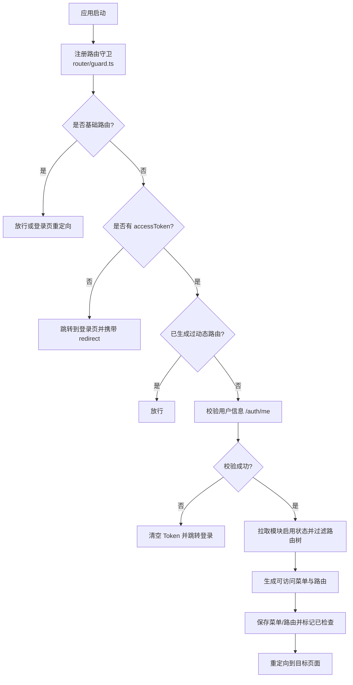
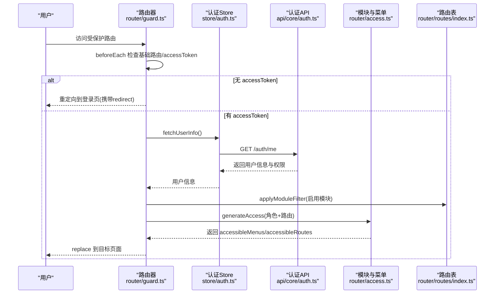
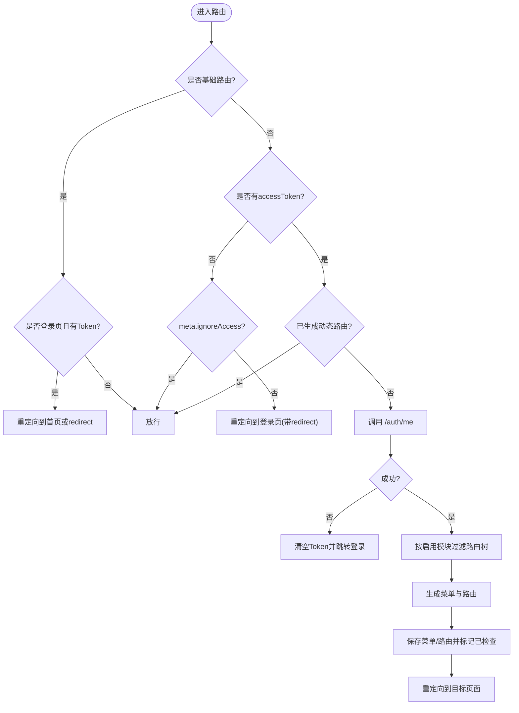
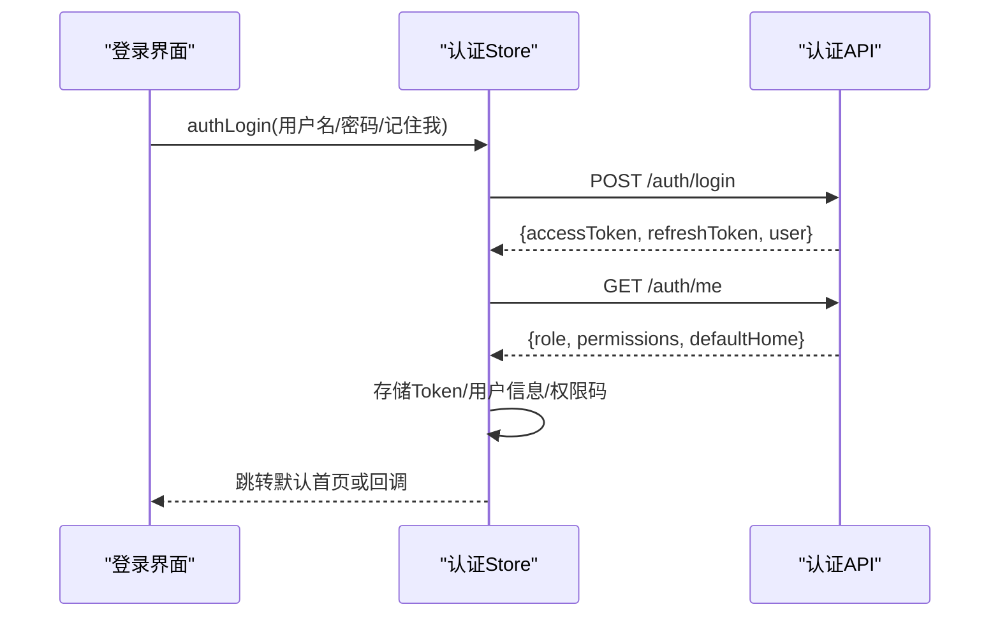
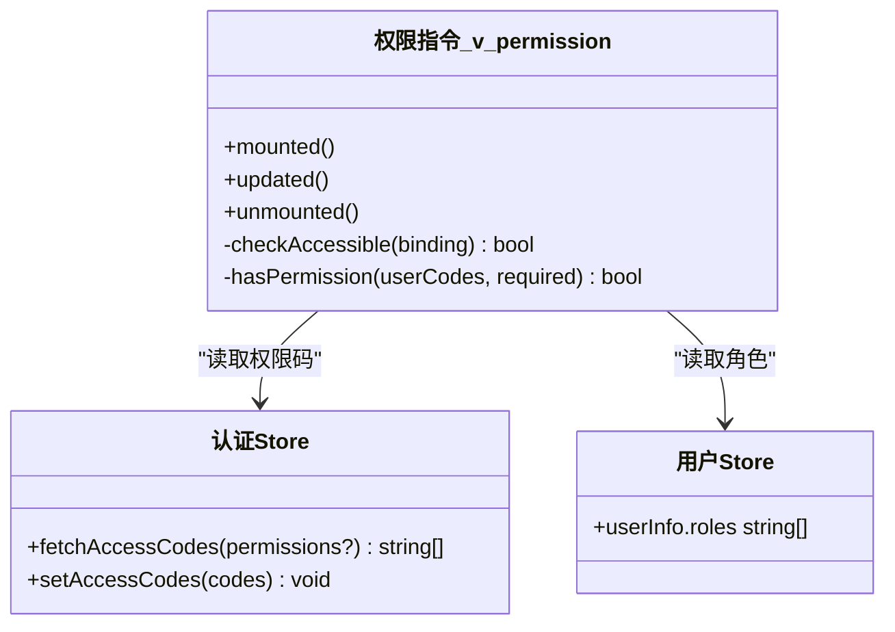
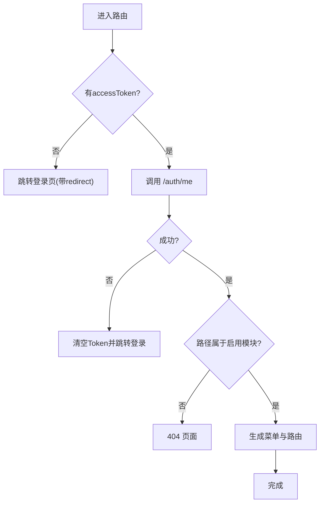
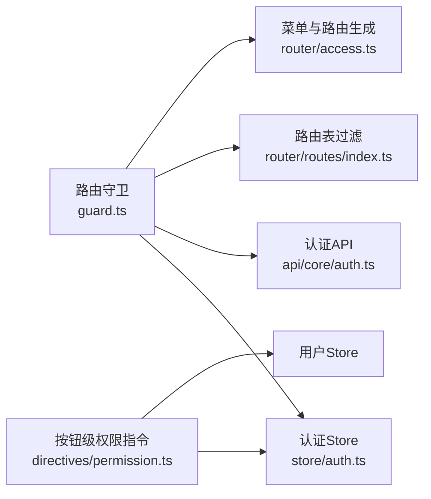

# 路由守卫机制

<cite>
**本文引用的文件**
- [guard.ts](file://frontend/apps/web-antd/src/router/guard.ts)
- [access.ts](file://frontend/apps/web-antd/src/router/access.ts)
- [routes/index.ts](file://frontend/apps/web-antd/src/router/routes/index.ts)
- [auth.ts（Store）](file://frontend/apps/web-antd/src/store/auth.ts)
- [auth.ts（API）](file://frontend/apps/web-antd/src/api/core/auth.ts)
- [permission.ts（指令）](file://frontend/apps/web-antd/src/directives/permission.ts)
- [routes-authority.test.ts](file://frontend/apps/web-antd/src/__tests__/routes-authority.test.ts)
</cite>

## 目录
1. [简介](#简介)
2. [项目结构](#项目结构)
3. [核心组件](#核心组件)
4. [架构总览](#架构总览)
5. [详细组件分析](#详细组件分析)
6. [依赖关系分析](#依赖关系分析)
7. [性能考虑](#性能考虑)
8. [故障排查指南](#故障排查指南)
9. [结论](#结论)
10. [附录](#附录)

## 简介
本文件系统性梳理前端路由守卫机制，覆盖执行流程、生命周期钩子、登录验证（Token 检查与自动刷新、登录状态管理）、权限控制（RBAC、菜单过滤、按钮级权限）、重定向处理（未授权跳转、会话过期、404），以及自定义守卫函数编写与调试技巧。内容基于仓库中实际实现进行说明，便于读者快速理解并安全扩展。

## 项目结构
围绕路由守卫的关键代码集中在以下位置：
- 路由守卫入口与拦截逻辑：router/guard.ts
- 动态菜单与路由生成：router/access.ts
- 路由表与模块过滤：router/routes/index.ts
- 认证 Store（登录、登出、用户信息、默认首页）：store/auth.ts
- 认证 API（登录、刷新、获取用户信息、权限码）：api/core/auth.ts
- 按钮级权限指令 v-permission：directives/permission.ts
- 路由权限对齐测试用例：__tests__/routes-authority.test.ts

图表来源
- [guard.ts:18-139](file://frontend/apps/web-antd/src/router/guard.ts#L18-L139)
- [routes/index.ts:34-83](file://frontend/apps/web-antd/src/router/routes/index.ts#L34-L83)
- [access.ts:17-40](file://frontend/apps/web-antd/src/router/access.ts#L17-L40)

章节来源
- [guard.ts:18-139](file://frontend/apps/web-antd/src/router/guard.ts#L18-L139)
- [routes/index.ts:34-83](file://frontend/apps/web-antd/src/router/routes/index.ts#L34-L83)
- [access.ts:17-40](file://frontend/apps/web-antd/src/router/access.ts#L17-L40)

## 核心组件
- 路由守卫（beforeEach/afterEach）：负责进度条、加载标记、登录态校验、动态路由生成与重定向。
- 认证 Store：封装登录、登出、获取用户信息、默认首页解析、权限码获取。
- 认证 API：提供登录、刷新、退出、获取当前用户、修改密码等接口。
- 菜单与路由生成：根据角色与后端菜单数据生成可访问的菜单和路由，支持 403 兜底组件。
- 模块过滤：按启用的模块键集合过滤动态路由树，未启用模块的路径返回 404。
- 按钮级权限指令：v-permission 支持权限码通配与角色名匹配，用于细粒度 UI 控制。

章节来源
- [guard.ts:18-139](file://frontend/apps/web-antd/src/router/guard.ts#L18-L139)
- [auth.ts（Store）:46-205](file://frontend/apps/web-antd/src/store/auth.ts#L46-L205)
- [auth.ts（API）:82-136](file://frontend/apps/web-antd/src/api/core/auth.ts#L82-L136)
- [access.ts:17-40](file://frontend/apps/web-antd/src/router/access.ts#L17-L40)
- [routes/index.ts:34-83](file://frontend/apps/web-antd/src/router/routes/index.ts#L34-L83)
- [permission.ts:1-147](file://frontend/apps/web-antd/src/directives/permission.ts#L1-L147)

## 架构总览
下图展示从进入路由到渲染页面的完整链路，包括登录态校验、用户信息获取、模块过滤、菜单与路由生成、最终重定向到目标页面。

图表来源
- [guard.ts:48-139](file://frontend/apps/web-antd/src/router/guard.ts#L48-L139)
- [auth.ts（Store）:177-191](file://frontend/apps/web-antd/src/store/auth.ts#L177-L191)
- [auth.ts（API）:117-119](file://frontend/apps/web-antd/src/api/core/auth.ts#L117-L119)
- [access.ts:17-40](file://frontend/apps/web-antd/src/router/access.ts#L17-L40)
- [routes/index.ts:76-83](file://frontend/apps/web-antd/src/router/routes/index.ts#L76-L83)

## 详细组件分析

### 路由守卫执行流程与生命周期钩子
- 通用守卫
  - beforeEach：记录页面是否已加载，按需开启进度条。
  - afterEach：记录已加载路径，关闭进度条。
- 权限访问守卫
  - 基础路由白名单：coreRouteNames 内的路由不进入权限拦截；若访问登录页且已有 accessToken，则重定向到 homePath 或默认首页。
  - 无 accessToken：若目标路由 meta.ignoreAccess 为真则放行，否则重定向到登录页并携带 redirect。
  - 已生成动态路由：直接放行。
  - 校验用户信息：调用 /auth/me，失败则清空 Token 并跳转登录页。
  - 模块过滤与路由生成：先按启用模块过滤路由树，再基于角色生成菜单与路由。
  - 保存结果并重定向：将菜单与路由存入 store，标记已检查，最后 replace 到目标页面。

图表来源
- [guard.ts:18-139](file://frontend/apps/web-antd/src/router/guard.ts#L18-L139)
- [routes/index.ts:76-83](file://frontend/apps/web-antd/src/router/routes/index.ts#L76-L83)

章节来源
- [guard.ts:18-139](file://frontend/apps/web-antd/src/router/guard.ts#L18-L139)

### 登录验证逻辑：Token 检查、自动刷新、登录状态管理
- Token 检查
  - 每次进入受保护路由时检查 accessToken；不存在则跳转登录页。
  - 存在时调用 /auth/me 校验有效性；失败则清空 Token 并跳转登录页。
- 自动刷新
  - 提供 refreshTokenApi 用于刷新 Access Token；在请求层遇到 401 时可触发刷新队列（由框架统一处理）。
- 登录状态管理
  - 登录成功后存储 accessToken、refreshToken，并获取用户信息与权限码，计算默认首页后跳转。
  - 登出时调用后端注销接口（仅在 Token 有效时），清空 Store 与本地缓存，并跳转登录页。
  - 支持“记住我”延长 Refresh Token 有效期。

图表来源
- [auth.ts（Store）:58-127](file://frontend/apps/web-antd/src/store/auth.ts#L58-L127)
- [auth.ts（API）:85-119](file://frontend/apps/web-antd/src/api/core/auth.ts#L85-L119)

章节来源
- [auth.ts（Store）:58-127](file://frontend/apps/web-antd/src/store/auth.ts#L58-L127)
- [auth.ts（API）:85-119](file://frontend/apps/web-antd/src/api/core/auth.ts#L85-L119)

### 权限控制实现：RBAC、菜单权限过滤、按钮级权限控制
- 基于角色的访问控制（RBAC）
  - 通过用户角色列表参与菜单与路由生成，结合后端菜单数据决定可访问范围。
  - 路由元信息中的 authority 字段用于声明允许的角色集合。
- 菜单权限过滤
  - 登录后先按启用模块过滤路由树，再基于角色生成菜单与路由。
  - 未启用模块的路径返回 404（非 403）。
- 按钮级权限控制
  - v-permission 指令支持权限码与角色名并集判断，权限码支持通配符（如 loop:*）。
  - 使用 Comment 节点占位替换元素，避免破坏 Dropdown 等内部状态。

图表来源
- [permission.ts:38-87](file://frontend/apps/web-antd/src/directives/permission.ts#L38-L87)
- [auth.ts（Store）:133-142](file://frontend/apps/web-antd/src/store/auth.ts#L133-L142)

章节来源
- [permission.ts:1-147](file://frontend/apps/web-antd/src/directives/permission.ts#L1-L147)
- [routes/index.ts:34-83](file://frontend/apps/web-antd/src/router/routes/index.ts#L34-L83)
- [routes-authority.test.ts:35-129](file://frontend/apps/web-antd/src/__tests__/routes-authority.test.ts#L35-L129)

### 重定向处理逻辑：未授权跳转、会话过期处理、404 页面路由
- 未授权跳转
  - 无 accessToken 且非 ignoreAccess 路由时，重定向到登录页并携带 redirect。
- 会话过期处理
  - 调用 /auth/me 失败时，清空 Token 并跳转登录页。
  - 登出时调用后端注销接口（仅当 Token 有效），然后清空状态并跳转登录页。
- 404 页面路由
  - 未启用模块的 URL 视为未知路径，返回 404（通过 isKnownRoutePath 判断）。
  - 无权限访问的页面可配置 403 兜底组件（forbiddenComponent）。

图表来源
- [guard.ts:66-107](file://frontend/apps/web-antd/src/router/guard.ts#L66-L107)
- [routes/index.ts:85-93](file://frontend/apps/web-antd/src/router/routes/index.ts#L85-L93)
- [access.ts:17-40](file://frontend/apps/web-antd/src/router/access.ts#L17-L40)

章节来源
- [guard.ts:66-107](file://frontend/apps/web-antd/src/router/guard.ts#L66-L107)
- [routes/index.ts:85-93](file://frontend/apps/web-antd/src/router/routes/index.ts#L85-L93)
- [access.ts:17-40](file://frontend/apps/web-antd/src/router/access.ts#L17-L40)

### 自定义守卫函数的编写方法与调试技巧
- 编写方法
  - 在 router/guard.ts 中添加新的 before/after 钩子，遵循现有命名与职责划分（通用守卫 vs 权限访问守卫）。
  - 如需新增全局前置条件（如功能开关、环境检查），可在 setupCommonGuard 中扩展。
  - 对于特定路由的额外校验，可通过 route.meta 扩展字段并在守卫中读取。
- 调试技巧
  - 利用浏览器网络面板观察 /auth/me、/auth/login、/auth/refresh 等请求。
  - 在 beforeEach/afterEach 中加入日志输出（注意生产环境关闭）。
  - 使用单元测试验证路由权限对齐（参考 routes-authority.test.ts）。
  - 对 v-permission 指令，检查 DOM 中 Comment 占位是否正确挂载/卸载。

章节来源
- [guard.ts:18-153](file://frontend/apps/web-antd/src/router/guard.ts#L18-L153)
- [routes-authority.test.ts:1-131](file://frontend/apps/web-antd/src/__tests__/routes-authority.test.ts#L1-L131)

## 依赖关系分析
- 路由守卫依赖认证 Store 与 API，用于登录态校验与用户信息获取。
- 菜单与路由生成依赖模块启用状态与后端菜单数据。
- 按钮级权限指令依赖认证 Store 与用户 Store，用于权限码与角色判断。
- 路由表模块过滤依赖启用模块集合，影响 404/403 行为。

图表来源
- [guard.ts:18-139](file://frontend/apps/web-antd/src/router/guard.ts#L18-L139)
- [auth.ts（Store）:46-205](file://frontend/apps/web-antd/src/store/auth.ts#L46-L205)
- [auth.ts（API）:82-136](file://frontend/apps/web-antd/src/api/core/auth.ts#L82-L136)
- [routes/index.ts:34-83](file://frontend/apps/web-antd/src/router/routes/index.ts#L34-L83)
- [access.ts:17-40](file://frontend/apps/web-antd/src/router/access.ts#L17-L40)
- [permission.ts:1-147](file://frontend/apps/web-antd/src/directives/permission.ts#L1-L147)

章节来源
- [guard.ts:18-139](file://frontend/apps/web-antd/src/router/guard.ts#L18-L139)
- [auth.ts（Store）:46-205](file://frontend/apps/web-antd/src/store/auth.ts#L46-L205)
- [auth.ts（API）:82-136](file://frontend/apps/web-antd/src/api/core/auth.ts#L82-L136)
- [routes/index.ts:34-83](file://frontend/apps/web-antd/src/router/routes/index.ts#L34-L83)
- [access.ts:17-40](file://frontend/apps/web-antd/src/router/access.ts#L17-L40)
- [permission.ts:1-147](file://frontend/apps/web-antd/src/directives/permission.ts#L1-L147)

## 性能考虑
- 动态路由与菜单生成仅在首次或角色变化时执行，后续直接放行，减少重复开销。
- 模块过滤在登录后一次性完成，避免频繁遍历路由树。
- v-permission 指令使用 Comment 占位替换，避免 DOM 物理移除带来的性能与状态问题。
- 进度条仅在未加载页面切换时显示，减少不必要的 UI 更新。

[本节为通用指导，无需具体文件引用]

## 故障排查指南
- 无法进入页面
  - 检查 accessToken 是否存在；若无，确认登录流程与 /auth/login 响应。
  - 检查 /auth/me 是否成功；失败则清理 Token 并重新登录。
- 404 而非 403
  - 确认路径是否属于启用模块；未启用模块会返回 404。
- 菜单不显示或按钮不可见
  - 检查角色与权限码是否正确填充到 Store。
  - 检查 v-permission 绑定值与权限码命名空间是否匹配（含通配符）。
- 登录后仍跳转登录页
  - 检查 loginExpired 标志与重定向参数是否正确传递。
  - 检查默认首页解析逻辑（角色映射与后端 defaultHome）。

章节来源
- [guard.ts:66-107](file://frontend/apps/web-antd/src/router/guard.ts#L66-L107)
- [routes/index.ts:85-93](file://frontend/apps/web-antd/src/router/routes/index.ts#L85-L93)
- [permission.ts:38-87](file://frontend/apps/web-antd/src/directives/permission.ts#L38-L87)
- [auth.ts（Store）:102-127](file://frontend/apps/web-antd/src/store/auth.ts#L102-L127)

## 结论
该路由守卫机制以清晰的职责划分实现了安全的访问控制：通过 Token 校验与用户信息获取确保会话有效性，结合模块过滤与 RBAC 生成精确的菜单与路由，辅以按钮级权限指令实现细粒度 UI 控制。整体流程健壮、可扩展性强，适合在生产环境中稳定运行。

[本节为总结性内容，无需具体文件引用]

## 附录
- 常见权限场景配置示例
  - 仅管理员可见：在路由 meta.authority 中配置 ["ADMIN"]。
  - 多角色可见：配置 ["ADMIN", "IC_ENGINEER"]。
  - 全角色可见：不设置 authority 或配置全部角色。
  - 按钮级权限：使用 v-permission="['loop:create', 'ADMIN']" 实现并集判断。
- 调试清单
  - 网络面板：/auth/login、/auth/me、/auth/refresh 请求与响应。
  - 控制台：打印路由元信息与角色/权限码。
  - 单元测试：运行 routes-authority.test.ts 验证权限对齐。

[本节为补充说明，无需具体文件引用]