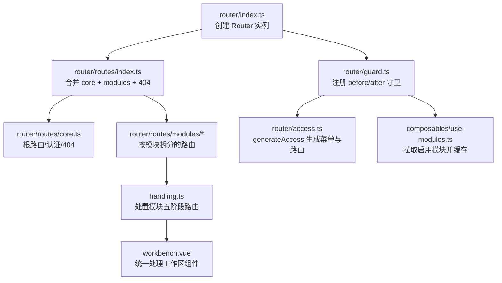
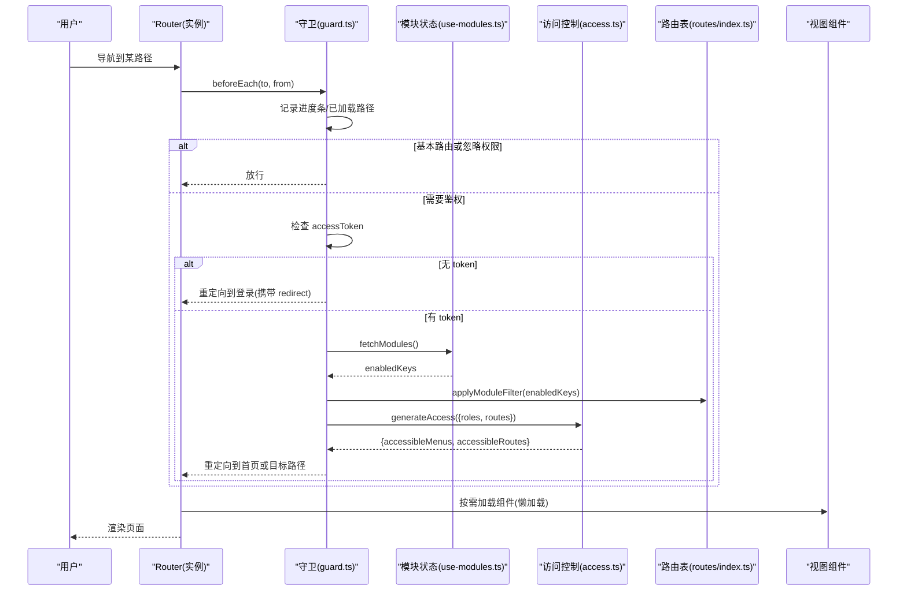
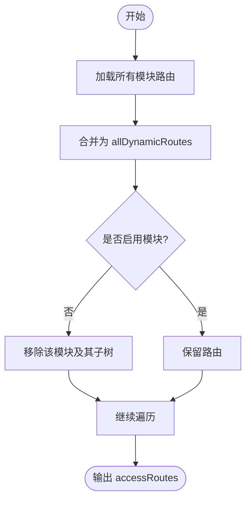
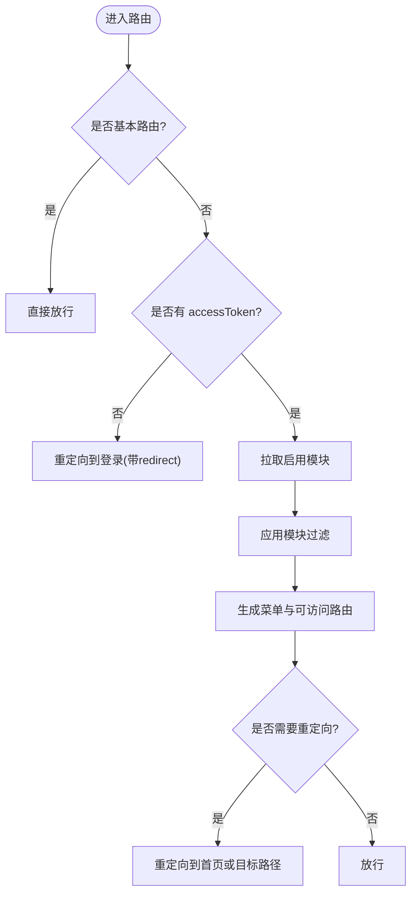
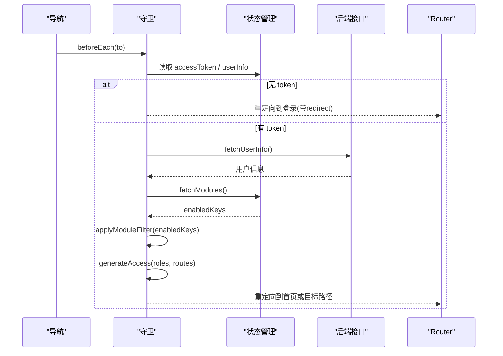
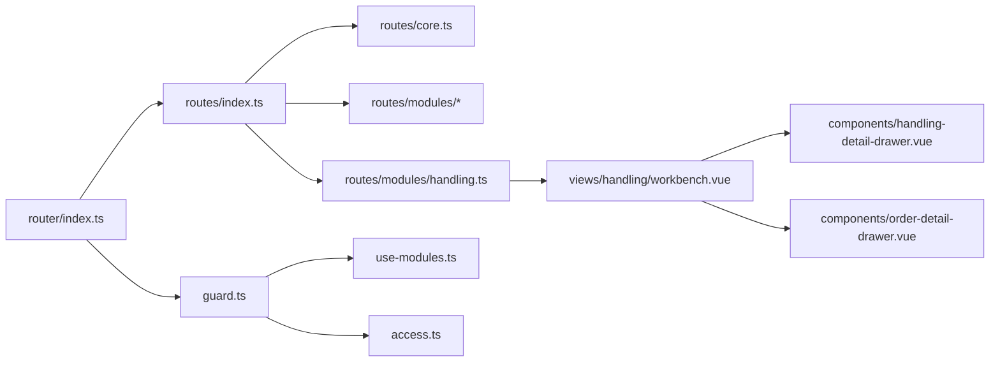

# 路由配置

<cite>
**本文引用的文件**
- [frontend/apps/web-antd/src/router/index.ts](file://frontend/apps/web-antd/src/router/index.ts)
- [frontend/apps/web-antd/src/router/guard.ts](file://frontend/apps/web-antd/src/router/guard.ts)
- [frontend/apps/web-antd/src/router/access.ts](file://frontend/apps/web-antd/src/router/access.ts)
- [frontend/apps/web-antd/src/router/routes/index.ts](file://frontend/apps/web-antd/src/router/routes/index.ts)
- [frontend/apps/web-antd/src/router/routes/core.ts](file://frontend/apps/web-antd/src/router/routes/core.ts)
- [frontend/apps/web-antd/src/router/routes/modules/diagnosis.ts](file://frontend/apps/web-antd/src/router/routes/modules/diagnosis.ts)
- [frontend/apps/web-antd/src/router/routes/modules/system.ts](file://frontend/apps/web-antd/src/router/routes/modules/system.ts)
- [frontend/apps/web-antd/src/router/routes/modules/loop.ts](file://frontend/apps/web-antd/src/router/routes/modules/loop.ts)
- [frontend/apps/web-antd/src/router/routes/modules/handling.ts](file://frontend/apps/web-antd/src/router/routes/modules/handling.ts)
- [frontend/apps/web-antd/src/views/handling/workbench.vue](file://frontend/apps/web-antd/src/views/handling/workbench.vue)
- [frontend/apps/web-antd/src/views/handling/components/handling-detail-drawer.vue](file://frontend/apps/web-antd/src/views/handling/components/handling-detail-drawer.vue)
- [frontend/apps/web-antd/src/views/handling/constants.ts](file://frontend/apps/web-antd/src/views/handling/constants.ts)
- [frontend/apps/web-antd/src/composables/use-modules.ts](file://frontend/apps/web-antd/src/composables/use-modules.ts)
</cite>

## 更新摘要
**变更内容**
- 新增处置模块五阶段路由系统的详细文档
- 更新模块化路由设计章节，包含处理工作区的复杂路由架构
- 新增智能深链接机制的说明
- 更新路由元信息章节，包含 handlingView 元数据的使用
- 新增处理工作区组件的路由状态管理说明

## 目录
1. [简介](#简介)
2. [项目结构](#项目结构)
3. [核心组件](#核心组件)
4. [架构总览](#架构总览)
5. [详细组件分析](#详细组件分析)
6. [依赖关系分析](#依赖关系分析)
7. [性能考虑](#性能考虑)
8. [故障排查指南](#故障排查指南)
9. [结论](#结论)
10. [附录](#附录)

## 简介
本文件为前端路由系统的全面配置文档，聚焦以下目标：
- 模块化路由设计：routes/modules 下的功能模块路由、动态路由生成与嵌套路由配置。
- 权限守卫机制：路由级权限控制、菜单权限过滤、基于角色的访问控制。
- 懒加载实现：组件级代码分割、路由级异步加载、预加载策略。
- 路由元信息：页面标题、图标、面包屑、缓存控制等 meta 字段的使用。
- 路由守卫流程：登录验证、权限检查、重定向处理。
- 路由调试工具与常见问题解决方案。

**最新更新**：处置模块实现了复杂的五阶段路由系统，通过单一组件承载多个业务视图，支持智能深链接和动态标签页切换。

## 项目结构
前端路由位于 apps/web-antd/src/router 下，采用"基础路由 + 动态模块路由"的组合方式：
- 基础路由：core.ts 定义根路由、认证相关路由与全局 404。
- 动态模块路由：routes/modules/*.ts 按业务域拆分（诊断、系统、回路兼容、处置等）。
- 路由装配：routes/index.ts 通过 import.meta.glob 自动收集模块路由并合并。
- 路由实例与守卫：index.ts 创建 router 实例并挂载全局守卫；guard.ts 实现通用与权限守卫；access.ts 负责菜单与可访问路由的生成。

**图表来源**
- [frontend/apps/web-antd/src/router/index.ts:15-35](file://frontend/apps/web-antd/src/router/index.ts#L15-L35)
- [frontend/apps/web-antd/src/router/guard.ts:145-150](file://frontend/apps/web-antd/src/router/guard.ts#L145-L150)
- [frontend/apps/web-antd/src/router/routes/index.ts:7-29](file://frontend/apps/web-antd/src/router/routes/index.ts#L7-L29)
- [frontend/apps/web-antd/src/router/routes/core.ts:24-95](file://frontend/apps/web-antd/src/router/routes/core.ts#L24-L95)
- [frontend/apps/web-antd/src/router/routes/modules/handling.ts:35-133](file://frontend/apps/web-antd/src/router/routes/modules/handling.ts#L35-L133)

**章节来源**
- [frontend/apps/web-antd/src/router/index.ts:15-35](file://frontend/apps/web-antd/src/router/index.ts#L15-L35)
- [frontend/apps/web-antd/src/router/routes/index.ts:7-29](file://frontend/apps/web-antd/src/router/routes/index.ts#L7-L29)
- [frontend/apps/web-antd/src/router/routes/core.ts:24-95](file://frontend/apps/web-antd/src/router/routes/core.ts#L24-L95)

## 核心组件
- 路由实例与历史模式：根据环境变量选择 hash/history，并设置滚动行为与初始路由表。
- 路由守卫：
  - 通用守卫：记录已加载路径、进度条开关。
  - 权限守卫：校验 token、拉取用户信息、获取启用模块、生成可访问菜单与路由、重定向到首页或目标页。
- 访问控制：
  - 通过 generateAccessible 结合后端菜单接口，生成菜单与可访问路由。
  - 支持无权限时跳转 403 页面。
- 动态路由装配：
  - 自动扫描 routes/modules 下的路由模块，合并为基础路由与 404 兜底。
  - 提供模块级过滤能力，未启用模块的子树将被移除。

**章节来源**
- [frontend/apps/web-antd/src/router/index.ts:15-35](file://frontend/apps/web-antd/src/router/index.ts#L15-L35)
- [frontend/apps/web-antd/src/router/guard.ts:18-139](file://frontend/apps/web-antd/src/router/guard.ts#L18-L139)
- [frontend/apps/web-antd/src/router/access.ts:17-39](file://frontend/apps/web-antd/src/router/access.ts#L17-L39)
- [frontend/apps/web-antd/src/router/routes/index.ts:7-29](file://frontend/apps/web-antd/src/router/routes/index.ts#L7-L29)

## 架构总览
下图展示了从导航触发到最终渲染的完整流程，包括模块过滤、权限校验与懒加载。

**图表来源**
- [frontend/apps/web-antd/src/router/guard.ts:48-139](file://frontend/apps/web-antd/src/router/guard.ts#L48-L139)
- [frontend/apps/web-antd/src/composables/use-modules.ts:44-71](file://frontend/apps/web-antd/src/composables/use-modules.ts#L44-L71)
- [frontend/apps/web-antd/src/router/access.ts:17-39](file://frontend/apps/web-antd/src/router/access.ts#L17-L39)
- [frontend/apps/web-antd/src/router/routes/index.ts:76-83](file://frontend/apps/web-antd/src/router/routes/index.ts#L76-L83)

## 详细组件分析

### 模块化路由设计（routes/modules）
- 模块拆分：每个业务域一个文件（如 diagnosis.ts、system.ts、loop.ts、handling.ts），便于维护与权限隔离。
- 动态装配：routes/index.ts 使用 import.meta.glob 自动收集模块路由，合并后作为 accessRoutes。
- 嵌套路由：父路由可配置 children 形成多级菜单与页面层级。
- 模块过滤：通过 meta.module 标记所属模块，applyModuleFilter 根据启用集合裁剪路由树。

**处置模块五阶段路由架构**：
处置模块采用了创新的五阶段路由设计，通过单一组件 workbench.vue 承载三个不同的业务视图：
- `/handling/suggestions`：诊断建议审核视图
- `/handling/tasks`：处置任务视图（预设 PENDING, REOPENED 状态）
- `/handling/orders`：处置工单视图（预设 EXECUTING, VERIFYING 状态）

**图表来源**
- [frontend/apps/web-antd/src/router/routes/index.ts:7-29](file://frontend/apps/web-antd/src/router/routes/index.ts#L7-L29)
- [frontend/apps/web-antd/src/router/routes/index.ts:41-83](file://frontend/apps/web-antd/src/router/routes/index.ts#L41-L83)

**章节来源**
- [frontend/apps/web-antd/src/router/routes/index.ts:7-29](file://frontend/apps/web-antd/src/router/routes/index.ts#L7-L29)
- [frontend/apps/web-antd/src/router/routes/index.ts:41-83](file://frontend/apps/web-antd/src/router/routes/index.ts#L41-L83)
- [frontend/apps/web-antd/src/router/routes/modules/diagnosis.ts:14-55](file://frontend/apps/web-antd/src/router/routes/modules/diagnosis.ts#L14-L55)
- [frontend/apps/web-antd/src/router/routes/modules/system.ts:15-115](file://frontend/apps/web-antd/src/router/routes/modules/system.ts#L15-L115)
- [frontend/apps/web-antd/src/router/routes/modules/loop.ts:19-59](file://frontend/apps/web-antd/src/router/routes/modules/loop.ts#L19-L59)
- [frontend/apps/web-antd/src/router/routes/modules/handling.ts:35-133](file://frontend/apps/web-antd/src/router/routes/modules/handling.ts#L35-L133)

### 处置模块五阶段路由系统
处置模块实现了批次 C 的五段式处理流程，通过统一的 workbench.vue 组件承载不同阶段的业务逻辑：

**路由设计特点**：
- **单一组件多视图**：三个路由共享 workbench.vue 组件，通过 `meta.handlingView` 元数据区分视图类型
- **智能状态预设**：不同路由自动应用对应的状态筛选预设
- **深链接支持**：URL 参数 `focus={id}` 可自动打开相关抽屉并设置适当标签页
- **旧路由兼容**：`/handling/workbench` 根据 query.tab 自动重定向到新路由

**五阶段处理流程**：
1. **诊断建议** (`/handling/suggestions`)：建议审核 Tab，默认显示待审核建议
2. **处置任务** (`/handling/tasks`)：工单 Tab + status 预设 PENDING,REOPENED（排程/下达）
3. **处置工单** (`/handling/orders`)：工单 Tab + status 预设 EXECUTING,VERIFYING（作业/验证）
4. **处置档案** (`/handling/archive`)：回路维度聚合 + 跨 run 处置全史
5. **处置统计**：隐藏路由，重定向到 `/reports/handling`

**智能深链接机制**：
- 关注队列 HANDLING 动作 target：`/handling/orders?focus={orderId}`
- 诊断「去处置」：`/handling/suggestions?focus={suggestionId}`
- 自动识别旧链接：orders 路由中 focus=建议id 时自动切换到 suggestions 视图

**章节来源**
- [frontend/apps/web-antd/src/router/routes/modules/handling.ts:3-26](file://frontend/apps/web-antd/src/router/routes/modules/handling.ts#L3-L26)
- [frontend/apps/web-antd/src/views/handling/workbench.vue:3-15](file://frontend/apps/web-antd/src/views/handling/workbench.vue#L3-L15)

### 权限守卫机制（路由级、菜单级、角色控制）
- 路由级权限：
  - 基本路由（coreRouteNames）跳过权限拦截，如登录页。
  - 非基本路由若无 accessToken 则重定向登录，并携带 redirect。
  - 若 ignoreAccess 为真，允许无权限访问。
- 菜单级权限：
  - 登录后调用 fetchModules 获取启用模块 key 集合，应用模块过滤。
  - 通过 generateAccess 结合后端菜单接口，生成 accessibleMenus 与 accessibleRoutes。
- 基于角色的访问控制：
  - 将当前用户 roles 传入 generateAccess，按角色过滤菜单与路由。
  - 无权限时可使用 forbiddenComponent 指向 403 页面。

**处置模块权限控制**：
- 角色白名单：`HANDLING_AUTHORITY = ['ADMIN', 'EXPERT', 'IC_ENGINEER', 'PE_ENGINEER', 'SPONSOR']`
- 操作权限：仅 ADMIN / IC_ENGINEER / PE_ENGINEER 可执行流转操作
- 查看权限：全部登录角色可查看（SPONSOR / EXPERT 只读）

**图表来源**
- [frontend/apps/web-antd/src/router/guard.ts:48-139](file://frontend/apps/web-antd/src/router/guard.ts#L48-L139)
- [frontend/apps/web-antd/src/router/access.ts:17-39](file://frontend/apps/web-antd/src/router/access.ts#L17-L39)
- [frontend/apps/web-antd/src/composables/use-modules.ts:44-71](file://frontend/apps/web-antd/src/composables/use-modules.ts#L44-L71)

**章节来源**
- [frontend/apps/web-antd/src/router/guard.ts:48-139](file://frontend/apps/web-antd/src/router/guard.ts#L48-L139)
- [frontend/apps/web-antd/src/router/access.ts:17-39](file://frontend/apps/web-antd/src/router/access.ts#L17-L39)

### 懒加载实现（组件级、路由级、预加载策略）
- 组件级代码分割：
  - 各模块路由的 component 使用箭头函数返回 import()，实现按需加载。
- 路由级异步加载：
  - 基础路由中的认证页面与 404 页面同样采用异步导入。
- 预加载策略：
  - 可通过浏览器预加载指令或框架内置优化进行资源预热（例如在空闲时预取常用页面）。
  - 当前仓库中未显式配置预加载逻辑，可按需扩展。

**处置模块懒加载优化**：
- workbench.vue 组件采用异步导入：`() => import('#/views/handling/workbench.vue')`
- 抽屉组件按需加载：handling-detail-drawer.vue、order-detail-drawer.vue
- 标签页懒加载：工单 Tab 首次切换时才加载数据

**章节来源**
- [frontend/apps/web-antd/src/router/routes/core.ts:8-12](file://frontend/apps/web-antd/src/router/routes/core.ts#L8-L12)
- [frontend/apps/web-antd/src/router/routes/modules/diagnosis.ts:27-41](file://frontend/apps/web-antd/src/router/routes/modules/diagnosis.ts#L27-L41)
- [frontend/apps/web-antd/src/router/routes/modules/system.ts:27-75](file://frontend/apps/web-antd/src/router/routes/modules/system.ts#L27-L75)
- [frontend/apps/web-antd/src/router/routes/modules/handling.ts:51-75](file://frontend/apps/web-antd/src/router/routes/modules/handling.ts#L51-L75)

### 路由元信息（页面标题、图标、面包屑、缓存控制）
- 页面标题：meta.title 用于页面标题与菜单显示。
- 图标：meta.icon 用于菜单图标展示。
- 面包屑控制：meta.hideInBreadcrumb 控制是否在面包屑中隐藏。
- 标签页控制：meta.hideInTab 控制是否在标签页中显示。
- 菜单可见性：meta.hideInMenu 控制是否在侧边菜单中显示。
- 模块归属：meta.module 用于模块级过滤。
- 权限标识：meta.authority 指定允许的角色列表。

**处置模块特殊元信息**：
- `meta.handlingView`：标识视图类型（'suggestions' | 'tasks' | 'orders'）
- `meta.order`：控制菜单排序（1-4 对应五个阶段）
- `meta.hideInMenu`：隐藏工作台入口和统计路由

**章节来源**
- [frontend/apps/web-antd/src/router/routes/core.ts:11-21](file://frontend/apps/web-antd/src/router/routes/core.ts#L11-L21)
- [frontend/apps/web-antd/src/router/routes/modules/diagnosis.ts:19-52](file://frontend/apps/web-antd/src/router/routes/modules/diagnosis.ts#L19-L52)
- [frontend/apps/web-antd/src/router/routes/modules/system.ts:17-87](file://frontend/apps/web-antd/src/router/routes/modules/system.ts#L17-L87)
- [frontend/apps/web-antd/src/router/routes/modules/loop.ts:20-56](file://frontend/apps/web-antd/src/router/routes/modules/loop.ts#L20-L56)
- [frontend/apps/web-antd/src/router/routes/modules/handling.ts:40-94](file://frontend/apps/web-antd/src/router/routes/modules/handling.ts#L40-L94)

### 路由守卫流程（登录验证、权限检查、重定向处理）
- 通用守卫：
  - beforeEach 记录 to.meta.loaded 并开启进度条。
  - afterEach 关闭进度条并记录已加载路径。
- 权限守卫：
  - 基本路由快速放行。
  - 无 token 时重定向登录，携带 redirect。
  - 有 token 时拉取用户信息，失败则清空凭证并重定向登录。
  - 拉取启用模块并应用模块过滤，生成菜单与路由后重定向到默认首页或目标路径。

**处置模块深链接处理流程**：

**图表来源**
- [frontend/apps/web-antd/src/router/guard.ts:18-139](file://frontend/apps/web-antd/src/router/guard.ts#L18-L139)
- [frontend/apps/web-antd/src/composables/use-modules.ts:44-71](file://frontend/apps/web-antd/src/composables/use-modules.ts#L44-L71)

**章节来源**
- [frontend/apps/web-antd/src/router/guard.ts:18-139](file://frontend/apps/web-antd/src/router/guard.ts#L18-L139)

### 处置工作区组件路由状态管理
处置工作区组件 workbench.vue 实现了复杂的路由状态管理机制：

**视图预设系统**：
- `VIEW_PRESETS`：定义不同 handlingView 对应的初始状态
- `suggestions`：建议审核视图，无状态预设
- `tasks`：处置任务视图，预设 PENDING, REOPENED 状态
- `orders`：处置工单视图，预设 EXECUTING, VERIFYING 状态

**深链接处理逻辑**：
- `applyUrlContext()`：处理 URL 中的 focus 参数
- 智能识别：orders 路由中 focus=建议id 时自动切换到 suggestions 视图
- 错误降级：工单不存在时尝试按建议 id 查找

**标签页状态管理**：
- `activeTab`：当前激活的标签页（'orders' | 'suggestions'）
- `ordersLoaded`：工单数据是否已加载（懒加载优化）
- `orderStatusPreset`：状态预设数组，用户修改后退出预设模式

**章节来源**
- [frontend/apps/web-antd/src/views/handling/workbench.vue:85-118](file://frontend/apps/web-antd/src/views/handling/workbench.vue#L85-L118)
- [frontend/apps/web-antd/src/views/handling/workbench.vue:752-797](file://frontend/apps/web-antd/src/views/handling/workbench.vue#L752-L797)

## 依赖关系分析
- 路由实例依赖：
  - 历史模式与环境变量。
  - 初始路由表来自 routes/index.ts。
  - 守卫来自 guard.ts。
- 动态路由装配依赖：
  - import.meta.glob 扫描 routes/modules。
  - mergeRouteModules 合并模块路由。
- 权限与菜单依赖：
  - use-modules 提供启用模块状态。
  - access.ts 调用后端菜单接口并生成可访问路由。

**处置模块依赖关系**：

**图表来源**
- [frontend/apps/web-antd/src/router/index.ts:15-35](file://frontend/apps/web-antd/src/router/index.ts#L15-L35)
- [frontend/apps/web-antd/src/router/routes/index.ts:7-29](file://frontend/apps/web-antd/src/router/routes/index.ts#L7-L29)
- [frontend/apps/web-antd/src/router/guard.ts:145-150](file://frontend/apps/web-antd/src/router/guard.ts#L145-L150)
- [frontend/apps/web-antd/src/router/access.ts:17-39](file://frontend/apps/web-antd/src/router/access.ts#L17-L39)
- [frontend/apps/web-antd/src/composables/use-modules.ts:44-71](file://frontend/apps/web-antd/src/composables/use-modules.ts#L44-L71)

**章节来源**
- [frontend/apps/web-antd/src/router/index.ts:15-35](file://frontend/apps/web-antd/src/router/index.ts#L15-L35)
- [frontend/apps/web-antd/src/router/routes/index.ts:7-29](file://frontend/apps/web-antd/src/router/routes/index.ts#L7-L29)
- [frontend/apps/web-antd/src/router/guard.ts:145-150](file://frontend/apps/web-antd/src/router/guard.ts#L145-L150)
- [frontend/apps/web-antd/src/router/access.ts:17-39](file://frontend/apps/web-antd/src/router/access.ts#L17-L39)
- [frontend/apps/web-antd/src/composables/use-modules.ts:44-71](file://frontend/apps/web-antd/src/composables/use-modules.ts#L44-L71)

## 性能考虑
- 懒加载：所有页面组件均通过异步导入，减少首屏体积。
- 模块过滤：仅在登录后拉取启用模块并裁剪路由树，避免无效路由参与后续处理。
- 进度条：仅在未加载页面切换时显示，提升用户体验。
- 建议：
  - 对高频访问页面增加预加载（如首页、工作台）。
  - 合理划分模块粒度，避免单个模块过大导致首次加载缓慢。
  - 对静态资源（图片、字体）启用缓存与压缩。

**处置模块性能优化**：
- **组件级懒加载**：workbench.vue 采用异步导入
- **标签页懒加载**：工单 Tab 首次切换时才加载数据
- **抽屉组件按需加载**：详情抽屉仅在需要时加载
- **数据分页加载**：建议详情通过分页扫描定位，避免大对象传输

## 故障排查指南
- 登录后仍跳转到登录页：
  - 检查 accessToken 是否存在且有效。
  - 确认 fetchUserInfo 成功返回用户信息。
  - 查看是否触发了模块拉取失败的回退逻辑。
- 菜单与路由不一致：
  - 确认后端菜单接口返回正确。
  - 检查 applyModuleFilter 是否正确应用了启用模块集合。
  - 核对 meta.authority 与用户 roles 是否匹配。
- 404 而非 403：
  - 未启用模块的 URL 会返回 404（isKnownRoutePath 判断）。
  - 确认模块启用状态与路由 meta.module 一致。
- 进度条不消失：
  - 检查 after 钩子是否执行。
  - 确认 preferences.transition.progress 配置。

**处置模块特定问题**：
- **深链接失效**：检查 focus 参数格式是否正确，确认后端接口可用性
- **视图状态异常**：验证 handlingView 元数据是否正确传递
- **标签页切换问题**：检查 activeTab 状态管理和 ordersLoaded 标志位
- **抽屉无法打开**：确认 focus 参数对应的实体是否存在

**章节来源**
- [frontend/apps/web-antd/src/router/guard.ts:48-139](file://frontend/apps/web-antd/src/router/guard.ts#L48-L139)
- [frontend/apps/web-antd/src/router/routes/index.ts:85-93](file://frontend/apps/web-antd/src/router/routes/index.ts#L85-L93)
- [frontend/apps/web-antd/src/composables/use-modules.ts:44-71](file://frontend/apps/web-antd/src/composables/use-modules.ts#L44-L71)

## 结论
本路由系统采用模块化与动态装配的设计，结合权限守卫与模块过滤，实现了灵活、安全且可扩展的前端导航体系。**最新的处置模块五阶段路由系统**进一步提升了用户体验，通过单一组件承载多个业务视图，支持智能深链接和动态标签页切换，显著减少了代码重复和维护成本。通过懒加载与合理的元信息配置，兼顾了性能与可维护性。建议在后续迭代中持续优化模块粒度与预加载策略，以提升用户体验与系统稳定性。

## 附录
- 关键元信息字段说明：
  - title：页面标题与菜单标题。
  - icon：菜单图标。
  - hideInBreadcrumb：隐藏面包屑。
  - hideInTab：隐藏标签页。
  - hideInMenu：隐藏菜单。
  - module：模块归属键。
  - authority：角色白名单。
  - **handlingView**：处置模块专用，标识视图类型（'suggestions' | 'tasks' | 'orders'）。
- 常见路由场景：
  - 旧路径兼容：loop.ts 提供重定向到新路径。
  - 系统管理：system.ts 包含用户、审计、字典、权限矩阵等。
  - 诊断模块：diagnosis.ts 提供工作台与记录页。
  - **处置模块**：handling.ts 实现五阶段处理流程，支持智能深链接。

**处置模块常量说明**：
- **状态常量**：STATUS_TEXT、ORDER_STATUS_TEXT、SUGGESTION_STATUS_TEXT
- **颜色映射**：STATUS_COLOR、ORDER_STATUS_COLOR、SUGGESTION_STATUS_COLOR
- **筛选选项**：STATUS_TAB_OPTIONS、ORDER_TAB_OPTIONS、SUGGESTION_TAB_OPTIONS
- **业务常量**：ACTION_TYPE_TEXT、SOURCE_TEXT、ORDER_SOURCE_TEXT

**章节来源**
- [frontend/apps/web-antd/src/router/routes/modules/loop.ts:19-59](file://frontend/apps/web-antd/src/router/routes/modules/loop.ts#L19-L59)
- [frontend/apps/web-antd/src/router/routes/modules/system.ts:15-115](file://frontend/apps/web-antd/src/router/routes/modules/system.ts#L15-L115)
- [frontend/apps/web-antd/src/router/routes/modules/diagnosis.ts:14-55](file://frontend/apps/web-antd/src/router/routes/modules/diagnosis.ts#L14-L55)
- [frontend/apps/web-antd/src/router/routes/modules/handling.ts:35-133](file://frontend/apps/web-antd/src/router/routes/modules/handling.ts#L35-L133)
- [frontend/apps/web-antd/src/views/handling/constants.ts:1-243](file://frontend/apps/web-antd/src/views/handling/constants.ts#L1-L243)