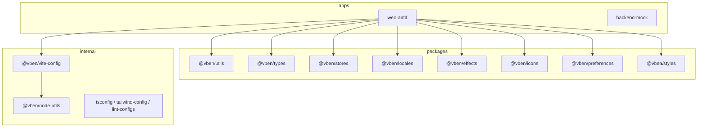
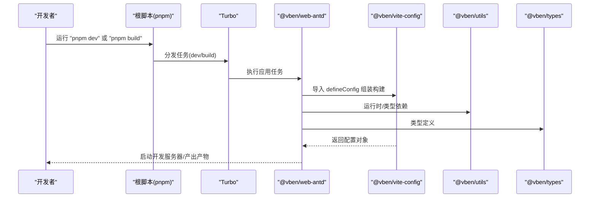
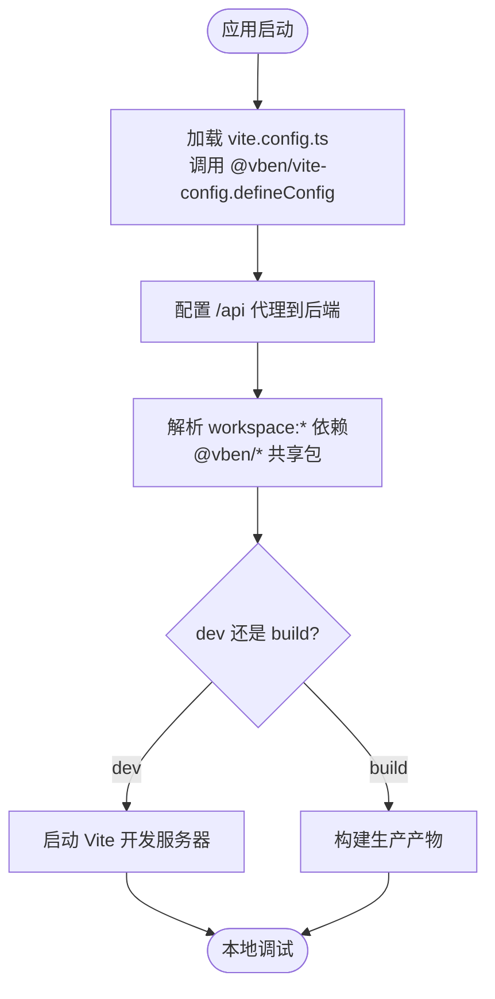
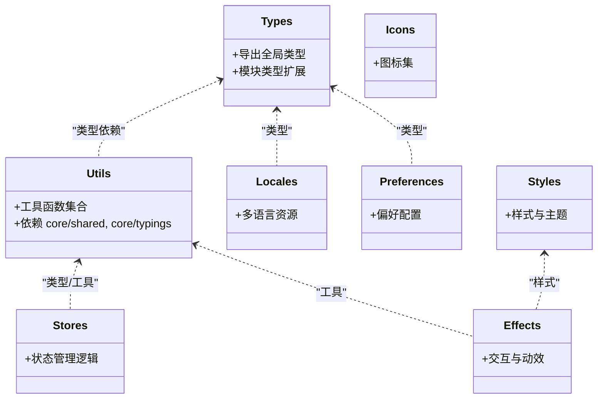
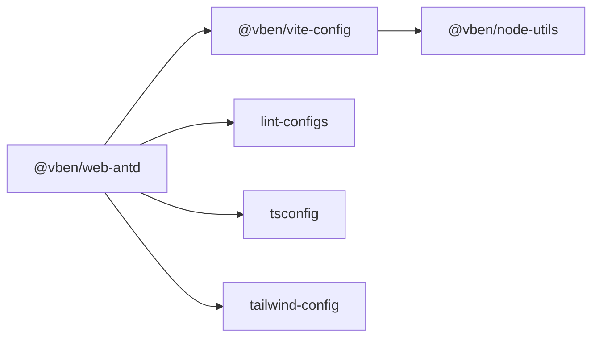
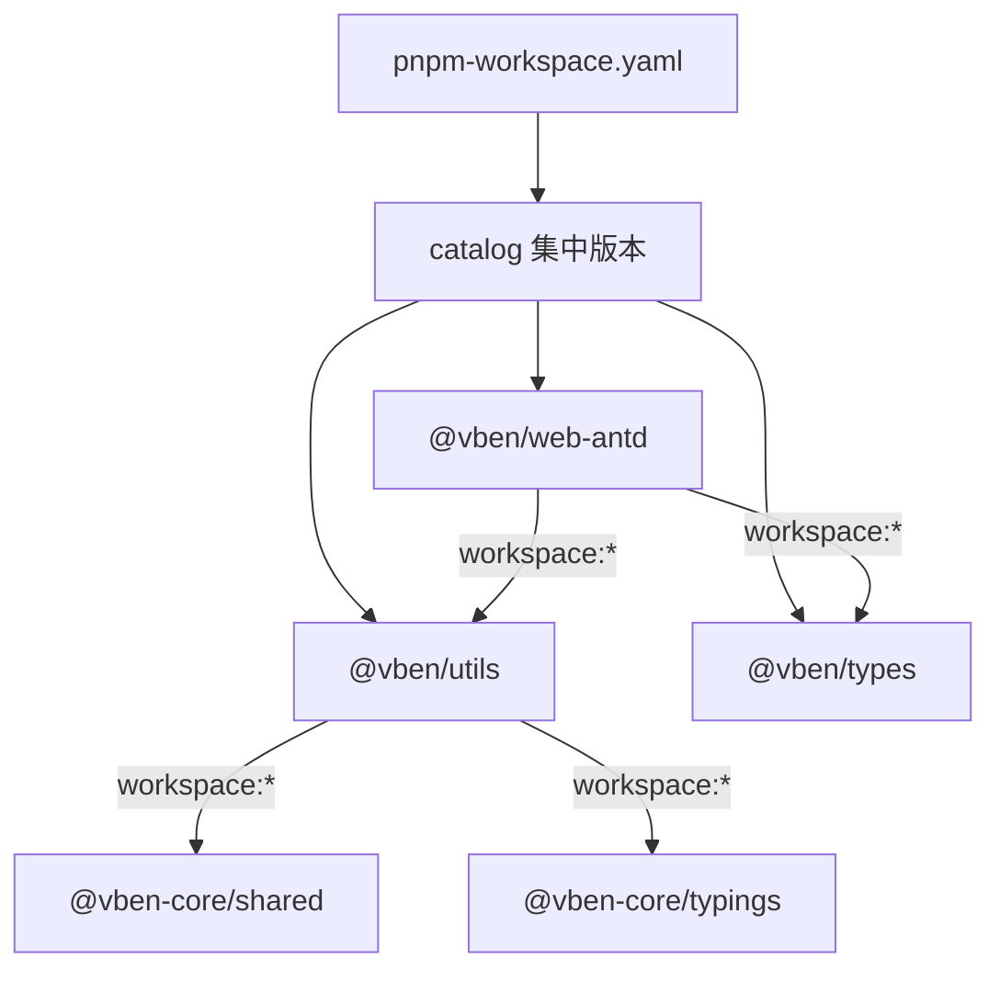
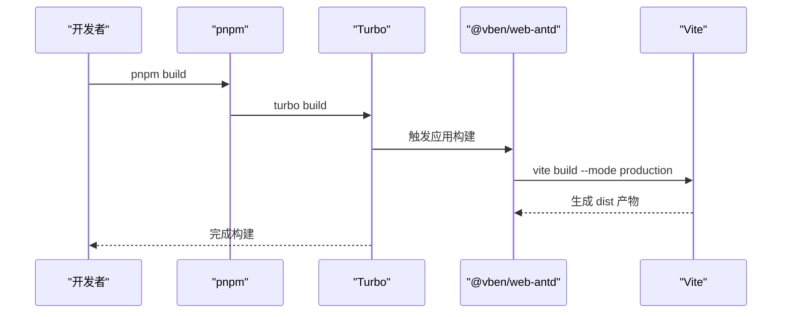

# Monorepo 结构

<cite>
**本文引用的文件**
- [frontend/pnpm-workspace.yaml](file://frontend/pnpm-workspace.yaml)
- [frontend/package.json](file://frontend/package.json)
- [frontend/turbo.json](file://frontend/turbo.json)
- [frontend/apps/web-antd/package.json](file://frontend/apps/web-antd/package.json)
- [frontend/apps/web-antd/vite.config.ts](file://frontend/apps/web-antd/vite.config.ts)
- [frontend/packages/utils/package.json](file://frontend/packages/utils/package.json)
- [frontend/packages/types/package.json](file://frontend/packages/types/package.json)
- [frontend/internal/vite-config/package.json](file://frontend/internal/vite-config/package.json)
- [frontend/internal/node-utils/package.json](file://frontend/internal/node-utils/package.json)
</cite>

## 目录
1. [简介](#简介)
2. [项目结构](#项目结构)
3. [核心组件](#核心组件)
4. [架构总览](#架构总览)
5. [详细组件分析](#详细组件分析)
6. [依赖关系与版本管理](#依赖关系与版本管理)
7. [构建流程协调](#构建流程协调)
8. [性能与优化建议](#性能与优化建议)
9. [故障排查指南](#故障排查指南)
10. [结论](#结论)

## 简介
本仓库采用 pnpm workspace + Turbo 的 Monorepo 方案，将前端应用、共享包与内部工具统一治理。通过集中式依赖目录（catalog）与严格的任务编排，实现跨包依赖一致性、可重复构建与高效增量编译。本文聚焦以下目标：
- 解释 pnpm workspace 配置与包管理策略
- 说明 apps、packages、internal 的职责划分
- 阐述包间依赖关系、版本控制与构建协调
- 提供工作流与示例，展示如何在不同包之间引用和复用代码

## 项目结构
Monorepo 根位于 frontend 目录，主要包含：
- apps：业务应用入口，当前为 web-antd（Ant Design Vue 主题的应用）
- packages：面向多应用复用的共享包（如 utils、types、stores、locales、effects、icons、preferences、styles 等）
- internal：仅在本仓库内使用的内部工具与配置（vite-config、node-utils、tsconfig、tailwind-config、lint-configs 等）
- docs/playground：文档站点与演示应用

**图表来源**
- [frontend/apps/web-antd/package.json:33-55](file://frontend/apps/web-antd/package.json#L33-L55)
- [frontend/internal/vite-config/package.json:29-41](file://frontend/internal/vite-config/package.json#L29-L41)
- [frontend/internal/node-utils/package.json:30-40](file://frontend/internal/node-utils/package.json#L30-L40)

**章节来源**
- [frontend/pnpm-workspace.yaml:1-14](file://frontend/pnpm-workspace.yaml#L1-L14)
- [frontend/package.json:27-59](file://frontend/package.json#L27-L59)

## 核心组件
- 工作区与工作流
  - pnpm workspace 声明了所有参与管理的包路径，启用 catalog 统一管理依赖版本，并开启 peer 依赖自动安装与去重
  - Turbo 定义全局依赖、环境变量与任务图，确保 build/dev/test 等任务的顺序与缓存命中
- 主应用 @vben/web-antd
  - 基于 Vite 构建，使用 @vben/vite-config 提供的 defineConfig 快速装配
  - 通过 workspace:* 引用多个 @vben/* 共享包，形成“应用层”聚合
- 共享包 @vben/*
  - 以功能域拆分，例如 types（类型）、utils（工具函数）、stores（状态）、locales（国际化）、effects（交互效果）、icons（图标）、preferences（偏好设置）、styles（样式）
  - 多数包通过 exports 暴露入口，便于 IDE 与打包器解析类型与源码
- 内部工具 internal/*
  - @vben/vite-config：封装 Vite 应用/库配置、插件组合、PWA、Tailwind、i18n 等能力
  - @vben/node-utils：Node 侧脚本工具（文件系统、Git、路径、哈希、Spinner 等）
  - tsconfig/tailwind-config/lint-configs：统一的 TS、样式与代码质量规则

**章节来源**
- [frontend/pnpm-workspace.yaml:16-29](file://frontend/pnpm-workspace.yaml#L16-L29)
- [frontend/turbo.json:1-49](file://frontend/turbo.json#L1-L49)
- [frontend/apps/web-antd/package.json:33-55](file://frontend/apps/web-antd/package.json#L33-L55)
- [frontend/internal/vite-config/package.json:14-28](file://frontend/internal/vite-config/package.json#L14-L28)
- [frontend/internal/node-utils/package.json:14-28](file://frontend/internal/node-utils/package.json#L14-L28)

## 架构总览
下图展示了从顶层命令到具体包的调用链与依赖关系：

**图表来源**
- [frontend/package.json:27-59](file://frontend/package.json#L27-L59)
- [frontend/turbo.json:15-46](file://frontend/turbo.json#L15-L46)
- [frontend/apps/web-antd/vite.config.ts:1-23](file://frontend/apps/web-antd/vite.config.ts#L1-L23)
- [frontend/apps/web-antd/package.json:33-55](file://frontend/apps/web-antd/package.json#L33-L55)
- [frontend/internal/vite-config/package.json:23-28](file://frontend/internal/vite-config/package.json#L23-L28)

## 详细组件分析

### apps/web-antd：主应用
- 职责
  - 作为 Ant Design Vue 主题的 Web 应用入口，聚合路由、页面、组件、API 客户端、状态与国际化
  - 通过 workspace:* 引入多个 @vben/* 共享包，保持与内部工具解耦
- 关键配置
  - 使用 @vben/vite-config 的 defineConfig 进行应用级配置，包含代理、插件等
  - 开发时通过 Vite server.proxy 转发 /api 到后端服务（MVP 端口 17101）
- 依赖关系
  - 依赖 @vben/access、@vben/common-ui、@vben/constants、@vben/hooks、@vben/layouts、@vben/locales、@vben/plugins、@vben/preferences、@vben/request、@vben/stores、@vben/styles、@vben/types、@vben/utils 等
  - 运行时依赖 Vue、Vue Router、Pinia、ECharts、Ant Design Vue 等

**图表来源**
- [frontend/apps/web-antd/vite.config.ts:1-23](file://frontend/apps/web-antd/vite.config.ts#L1-L23)
- [frontend/apps/web-antd/package.json:33-55](file://frontend/apps/web-antd/package.json#L33-L55)

**章节来源**
- [frontend/apps/web-antd/vite.config.ts:1-23](file://frontend/apps/web-antd/vite.config.ts#L1-L23)
- [frontend/apps/web-antd/package.json:18-29](file://frontend/apps/web-antd/package.json#L18-L29)
- [frontend/apps/web-antd/package.json:33-55](file://frontend/apps/web-antd/package.json#L33-L55)

### packages：共享包组织与复用策略
- 设计原则
  - 按领域拆分：类型(types)、工具(utils)、状态(stores)、国际化(locales)、效果(effects)、图标(icons)、偏好(preferences)、样式(styles)
  - 每个包独立维护版本与导出，通过 exports 字段暴露入口，支持类型优先与源码直连
- 典型包
  - @vben/types：集中定义全局类型与模块扩展
  - @vben/utils：通用工具函数，依赖 @vben-core/shared 与 @vben-core/typings
  - 其他包遵循相同模式，便于被多个应用复用

**图表来源**
- [frontend/packages/types/package.json:13-26](file://frontend/packages/types/package.json#L13-L26)
- [frontend/packages/utils/package.json:16-26](file://frontend/packages/utils/package.json#L16-L26)

**章节来源**
- [frontend/packages/types/package.json:1-28](file://frontend/packages/types/package.json#L1-L28)
- [frontend/packages/utils/package.json:1-28](file://frontend/packages/utils/package.json#L1-L28)

### internal：内部工具库管理方式
- @vben/vite-config
  - 提供 defineConfig 工厂方法，封装应用/库配置、插件组合、PWA、Tailwind、i18n、压缩、可视化等
  - 通过 exports 同时暴露类型与构建产物，供应用与库消费
- @vben/node-utils
  - Node 侧工具集：文件系统、Git、路径、哈希、Spinner、monorepo 信息等
  - 用于脚本与构建期辅助
- tsconfig/tailwind-config/lint-configs
  - 统一 TypeScript、Tailwind、ESLint/Oxlint/Stylelint 等规则，保证全仓一致

**图表来源**
- [frontend/internal/vite-config/package.json:23-41](file://frontend/internal/vite-config/package.json#L23-L41)
- [frontend/internal/node-utils/package.json:23-40](file://frontend/internal/node-utils/package.json#L23-L40)

**章节来源**
- [frontend/internal/vite-config/package.json:1-61](file://frontend/internal/vite-config/package.json#L1-L61)
- [frontend/internal/node-utils/package.json:1-43](file://frontend/internal/node-utils/package.json#L1-L43)

## 依赖关系与版本管理
- 工作区声明
  - pnpm-workspace.yaml 中列出了 internal/*、packages/*、apps/*、scripts/*、docs、playground 等所有包
  - publicHoistPattern 提升常用 CLI 与工具到根节点，减少重复安装
  - strictPeerDependencies=false、autoInstallPeers=true、dedupePeerDependents=true 降低 peer 依赖冲突成本
- Catalog 集中管理
  - 在 pnpm-workspace.yaml 的 catalog 段集中声明依赖版本，package.json 中以 "catalog:" 引用，避免散落的版本号
  - overrides 对特定依赖进行强制覆盖，保证兼容性
- 包间引用
  - 应用与包之间通过 workspace:* 引用，保证开发期直接链接源码，构建期由打包器处理
  - 共享包通过 exports 暴露入口，IDE 可直接跳转到源码与类型

**图表来源**
- [frontend/pnpm-workspace.yaml:1-29](file://frontend/pnpm-workspace.yaml#L1-L29)
- [frontend/pnpm-workspace.yaml:31-225](file://frontend/pnpm-workspace.yaml#L31-L225)
- [frontend/apps/web-antd/package.json:33-55](file://frontend/apps/web-antd/package.json#L33-L55)
- [frontend/packages/utils/package.json:22-26](file://frontend/packages/utils/package.json#L22-L26)

**章节来源**
- [frontend/pnpm-workspace.yaml:1-29](file://frontend/pnpm-workspace.yaml#L1-L29)
- [frontend/pnpm-workspace.yaml:31-225](file://frontend/pnpm-workspace.yaml#L31-L225)
- [frontend/package.json:61-95](file://frontend/package.json#L61-L95)

## 构建流程协调
- 根脚本
  - build：通过 turbo 并行构建所有包，NODE_OPTIONS 调整内存上限
  - dev：通过 turbo-run 启动开发任务
  - check/typecheck：类型检查与循环依赖检测
- Turbo 任务
  - build/preview/build:analyze 依赖 ^build，确保上游包先构建
  - dev 标记为 persistent 且无缓存，适合长期运行的开发服务器
  - typecheck 输出为空，仅做类型检查
- 应用构建
  - web-antd 使用 vite build 生产模式，或通过 analyze 模式分析体积
  - 开发服务器代理 /api 到后端，便于联调

**图表来源**
- [frontend/package.json:27-59](file://frontend/package.json#L27-L59)
- [frontend/turbo.json:15-46](file://frontend/turbo.json#L15-L46)
- [frontend/apps/web-antd/package.json:18-29](file://frontend/apps/web-antd/package.json#L18-L29)

**章节来源**
- [frontend/package.json:27-59](file://frontend/package.json#L27-L59)
- [frontend/turbo.json:1-49](file://frontend/turbo.json#L1-L49)
- [frontend/apps/web-antd/package.json:18-29](file://frontend/apps/web-antd/package.json#L18-L29)

## 性能与优化建议
- 依赖提升与去重
  - 利用 publicHoistPattern 提升高频 CLI 工具，减少重复安装
  - autoInstallPeers 与 dedupePeerDependents 降低 peer 依赖冲突导致的重复安装
- 构建缓存
  - 通过 Turbo 的 outputs 与 dependsOn 精确描述产物与依赖，最大化缓存命中
- 按需与分包
  - 共享包通过 exports 暴露最小入口，配合打包器 tree-shaking
  - 应用侧可使用懒加载与路由级分包，减少首屏体积
- 开发体验
  - 使用 Vite 热更新与持久化 dev 任务，缩短反馈周期
  - 通过 catalog 统一依赖版本，减少升级时的震荡

[本节为通用指导，不直接分析具体文件]

## 故障排查指南
- 依赖冲突
  - 若出现 peer 依赖冲突，检查 pnpm-workspace.yaml 的 overrides 与 catalog 是否覆盖了冲突版本
  - 使用 pnpm catalog 命令查看与更新依赖
- 构建失败
  - 确认 Turbo 任务 outputs 与实际产物一致，必要时清理 dist 后重试
  - 检查 node 与 pnpm 版本是否符合 engines 要求
- 开发代理问题
  - web-antd 的 vite.config.ts 中代理目标为 127.0.0.1:17101，确保后端服务在该端口监听 IPv4
  - 若遇到 localhost IPv6 解析问题，保持使用 127.0.0.1

**章节来源**
- [frontend/apps/web-antd/vite.config.ts:6-20](file://frontend/apps/web-antd/vite.config.ts#L6-L20)
- [frontend/package.json:97-101](file://frontend/package.json#L97-L101)
- [frontend/pnpm-workspace.yaml:31-39](file://frontend/pnpm-workspace.yaml#L31-L39)

## 结论
该 Monorepo 通过 pnpm workspace + catalog 实现了依赖集中管理与版本一致性；通过 Turbo 实现了跨包任务编排与缓存；通过清晰的 apps/packages/internal 分层，使应用、共享包与内部工具各司其职。实际开发中，建议在新增包时遵循现有命名与导出规范，并通过 workspace:* 与 catalog 管理依赖，确保可维护性与可扩展性。