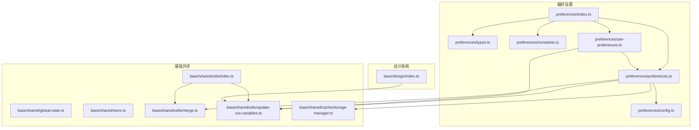
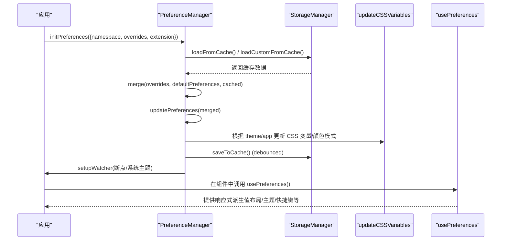
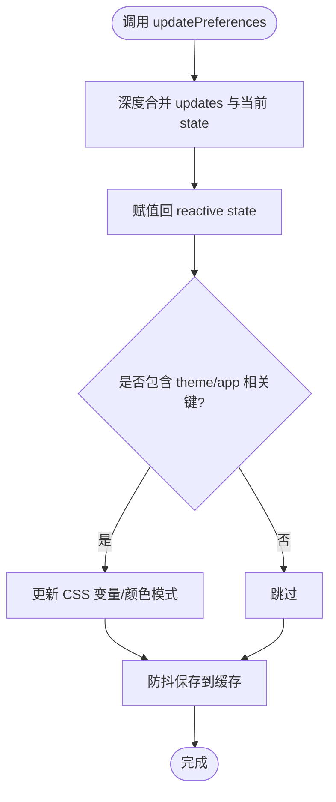
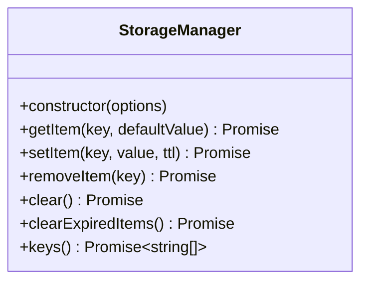
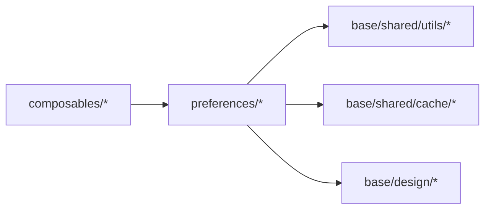

# @core 核心基础包

<cite>
**本文引用的文件**
- [preferences/index.ts](file://frontend/packages/@core/preferences/src/index.ts)
- [preferences/preferences.ts](file://frontend/packages/@core/preferences/src/preferences.ts)
- [preferences/config.ts](file://frontend/packages/@core/preferences/src/config.ts)
- [preferences/types.ts](file://frontend/packages/@core/preferences/src/types.ts)
- [preferences/constants.ts](file://frontend/packages/@core/preferences/src/constants.ts)
- [preferences/use-preferences.ts](file://frontend/packages/@core/preferences/src/use-preferences.ts)
- [base/shared/global-state.ts](file://frontend/packages/@core/base/shared/src/global-state.ts)
- [base/shared/store.ts](file://frontend/packages/@core/base/shared/src/store.ts)
- [base/shared/utils/index.ts](file://frontend/packages/@core/base/shared/src/utils/index.ts)
- [base/shared/utils/merge.ts](file://frontend/packages/@core/base/shared/src/utils/merge.ts)
- [base/shared/utils/update-css-variables.ts](file://frontend/packages/@core/base/shared/src/utils/update-css-variables.ts)
- [base/shared/cache/storage-manager.ts](file://frontend/packages/@core/base/shared/src/cache/storage-manager.ts)
- [base/design/index.ts](file://frontend/packages/@core/base/design/src/index.ts)
</cite>

## 目录
1. [简介](#简介)
2. [项目结构](#项目结构)
3. [核心组件](#核心组件)
4. [架构总览](#架构总览)
5. [详细组件分析](#详细组件分析)
6. [依赖关系分析](#依赖关系分析)
7. [性能考量](#性能考量)
8. [故障排查指南](#故障排查指南)
9. [结论](#结论)
10. [附录](#附录)

## 简介
本文件为前端 monorepo 中的 @core 核心基础包提供系统化文档。该包围绕“偏好设置管理、全局状态共享、通用工具与存储抽象、设计令牌与样式注入”等核心能力，为上层 UI 组件与应用提供稳定、可配置、可扩展的基础设施。重点包括：
- 偏好设置：默认配置、运行时更新、持久化、扩展字段、主题与布局联动
- 全局状态：跨模块共享的组件注册与消息桥接
- 存储抽象：基于策略模式的 StorageManager，统一 LocalStorage/Memory 驱动
- 工具函数：合并、CSS 变量更新、类型安全的 diff 等
- 设计系统：设计令牌与全局样式注入

## 项目结构
@core 包采用多子包组织方式，职责清晰、边界明确：
- preferences：偏好设置管理与扩展机制（含默认配置、类型定义、常量、组合式 API）
- base/shared：全局共享能力（全局状态、存储抽象、工具函数）
- base/design：设计令牌与全局样式注入
- composables：通用组合式函数（如移动端判断、命名空间、滚动锁定等）

图表来源
- [preferences/index.ts:1-24](file://frontend/packages/@core/preferences/src/index.ts#L1-L24)
- [preferences/preferences.ts:1-465](file://frontend/packages/@core/preferences/src/preferences.ts#L1-L465)
- [preferences/config.ts:1-149](file://frontend/packages/@core/preferences/src/config.ts#L1-L149)
- [preferences/types.ts:1-445](file://frontend/packages/@core/preferences/src/types.ts#L1-L445)
- [preferences/constants.ts:1-117](file://frontend/packages/@core/preferences/src/constants.ts#L1-L117)
- [preferences/use-preferences.ts:1-272](file://frontend/packages/@core/preferences/src/use-preferences.ts#L1-L272)
- [base/shared/global-state.ts:1-46](file://frontend/packages/@core/base/shared/src/global-state.ts#L1-L46)
- [base/shared/store.ts:1-2](file://frontend/packages/@core/base/shared/src/store.ts#L1-L2)
- [base/shared/utils/index.ts:1-22](file://frontend/packages/@core/base/shared/src/utils/index.ts#L1-L22)
- [base/shared/utils/merge.ts:1-11](file://frontend/packages/@core/base/shared/src/utils/merge.ts#L1-L11)
- [base/shared/utils/update-css-variables.ts:1-36](file://frontend/packages/@core/base/shared/src/utils/update-css-variables.ts#L1-L36)
- [base/shared/cache/storage-manager.ts:1-147](file://frontend/packages/@core/shared/src/cache/storage-manager.ts#L1-L147)
- [base/design/index.ts:1-7](file://frontend/packages/@core/base/design/src/index.ts#L1-L7)

章节来源
- [preferences/index.ts:1-24](file://frontend/packages/@core/preferences/src/index.ts#L1-L24)
- [preferences/preferences.ts:1-465](file://frontend/packages/@core/preferences/src/preferences.ts#L1-L465)
- [base/shared/global-state.ts:1-46](file://frontend/packages/@core/base/shared/src/global-state.ts#L1-L46)
- [base/shared/utils/index.ts:1-22](file://frontend/packages/@core/base/shared/src/utils/index.ts#L1-L22)
- [base/shared/cache/storage-manager.ts:1-147](file://frontend/packages/@core/base/shared/src/cache/storage-manager.ts#L1-L147)
- [base/design/index.ts:1-7](file://frontend/packages/@core/base/design/src/index.ts#L1-L7)

## 核心组件
- 偏好设置管理器（PreferenceManager）
  - 职责：初始化、读取、更新、重置偏好；持久化到缓存；监听系统与断点变化；应用主题与颜色模式；支持扩展字段校验与默认值
  - 关键能力：命名空间隔离、防重复初始化、深度合并、防抖保存、只读视图暴露
- 偏好设置组合式 API（usePreferences）
  - 职责：为 Vue 组件提供响应式的偏好派生值（布局、主题、快捷键、按钮位置等）
- 全局共享状态（GlobalShareState）
  - 职责：跨模块共享组件实例与消息回调（例如复制成功提示），单例模式避免请求污染
- 存储管理器（StorageManager）
  - 职责：统一 KV 存取，支持前缀命名空间、TTL 过期清理、驱动切换（LocalStorage/Memory）
- 工具函数
  - 合并（defu）、CSS 变量更新、diff 差异计算等
- 设计系统入口
  - 职责：注入设计令牌与全局样式（过渡、进度条、UI 基础样式）

章节来源
- [preferences/preferences.ts:1-465](file://frontend/packages/@core/preferences/src/preferences.ts#L1-L465)
- [preferences/use-preferences.ts:1-272](file://frontend/packages/@core/preferences/src/use-preferences.ts#L1-L272)
- [base/shared/global-state.ts:1-46](file://frontend/packages/@core/base/shared/src/global-state.ts#L1-L46)
- [base/shared/cache/storage-manager.ts:1-147](file://frontend/packages/@core/base/shared/src/cache/storage-manager.ts#L1-L147)
- [base/shared/utils/merge.ts:1-11](file://frontend/packages/@core/base/shared/src/utils/merge.ts#L1-L11)
- [base/shared/utils/update-css-variables.ts:1-36](file://frontend/packages/@core/base/shared/src/utils/update-css-variables.ts#L1-L36)
- [base/design/index.ts:1-7](file://frontend/packages/@core/base/design/src/index.ts#L1-L7)

## 架构总览
下图展示了偏好设置从初始化到渲染更新的完整链路，以及与其他核心模块的交互。

图表来源
- [preferences/preferences.ts:112-162](file://frontend/packages/@core/preferences/src/preferences.ts#L112-L162)
- [preferences/preferences.ts:206-216](file://frontend/packages/@core/preferences/src/preferences.ts#L206-L216)
- [preferences/preferences.ts:238-254](file://frontend/packages/@core/preferences/src/preferences.ts#L238-L254)
- [preferences/preferences.ts:412-447](file://frontend/packages/@core/preferences/src/preferences.ts#L412-L447)
- [preferences/use-preferences.ts:8-16](file://frontend/packages/@core/preferences/src/use-preferences.ts#L8-L16)

## 详细组件分析

### 偏好设置管理器（PreferenceManager）
- 设计要点
  - 单例：通过模块级实例确保全局唯一
  - 只读视图：对外暴露 readonly 的状态，防止外部直接篡改
  - 深度合并：使用 defu 实现安全合并，覆盖优先级明确
  - 防抖持久化：变更写入缓存使用防抖，降低 I/O 压力
  - 扩展字段：通过 PreferencesExtension 声明自定义字段及校验规则，自动推导默认值并做类型约束
  - 平台与环境：检测 Mac/Windows 平台标识；监听系统主题与断点变化
- 关键流程
  - 初始化：合并 overrides/default/cached，加载扩展默认值，设置监听器，标记已初始化
  - 更新：深度合并后触发 handleUpdates（主题/CSS 变量/颜色模式），并异步防抖保存
  - 重置：恢复初始值并持久化
  - 扩展字段校验：按 component 类型进行严格校验（number/select/switch/input）
- 复杂度与性能
  - 合并与克隆：O(n) 层级遍历，注意大对象时谨慎使用
  - 防抖保存：减少频繁写盘，提升性能
  - 监听系统主题：事件驱动，开销极低

图表来源
- [preferences/preferences.ts:206-216](file://frontend/packages/@core/preferences/src/preferences.ts#L206-L216)
- [preferences/preferences.ts:238-254](file://frontend/packages/@core/preferences/src/preferences.ts#L238-L254)
- [preferences/preferences.ts:390-407](file://frontend/packages/@core/preferences/src/preferences.ts#L390-L407)

章节来源
- [preferences/preferences.ts:32-465](file://frontend/packages/@core/preferences/src/preferences.ts#L32-L465)

### 偏好设置组合式 API（usePreferences）
- 职责：将 PreferenceManager 的状态以 computed 形式暴露给 Vue 组件，提供常用派生值（布局、主题、快捷键、按钮位置、keepAlive 等）
- 典型用法：在组件内调用 usePreferences() 获取响应式属性，用于条件渲染或样式绑定

章节来源
- [preferences/use-preferences.ts:8-272](file://frontend/packages/@core/preferences/src/use-preferences.ts#L8-L272)

### 全局共享状态（GlobalShareState）
- 职责：提供跨模块共享的组件容器与消息回调（如复制偏好设置成功提示），单例保证一致性
- 使用建议：在应用启动阶段 defineMessage 注入消息回调，各模块通过 globalShareState.getMessage() 调用

章节来源
- [base/shared/global-state.ts:19-46](file://frontend/packages/@core/base/shared/src/global-state.ts#L19-L46)

### 存储管理器（StorageManager）
- 设计要点
  - 策略模式：根据环境选择 LocalStorageDriver 或 MemoryStorageDriver
  - 命名空间：通过 prefix 隔离不同应用的键空间
  - TTL：支持可选过期时间，读取时自动清理过期项
  - 批量操作：clear/clearExpiredItems/keys 支持前缀过滤
- 适用场景：偏好设置、临时缓存、轻量级本地数据持久化

图表来源
- [base/shared/cache/storage-manager.ts:16-147](file://frontend/packages/@core/base/shared/src/cache/storage-manager.ts#L16-L147)

章节来源
- [base/shared/cache/storage-manager.ts:1-147](file://frontend/packages/@core/base/shared/src/cache/storage-manager.ts#L1-L147)

### 工具函数与设计系统
- 合并（merge/defu）：安全深度合并，数组覆盖策略可定制
- CSS 变量更新：动态生成 :root 变量并注入 <style>，实现主题实时切换
- 设计系统入口：导入设计令牌与全局样式，确保主题与过渡效果生效

章节来源
- [base/shared/utils/merge.ts:1-11](file://frontend/packages/@core/base/shared/src/utils/merge.ts#L1-L11)
- [base/shared/utils/update-css-variables.ts:1-36](file://frontend/packages/@core/base/shared/src/utils/update-css-variables.ts#L1-L36)
- [base/design/index.ts:1-7](file://frontend/packages/@core/base/design/src/index.ts#L1-L7)

## 依赖关系分析
- 模块耦合
  - preferences 依赖 base/shared 的工具与存储抽象，形成“业务层（偏好）—基础设施层（共享）”的单向依赖
  - design 仅负责样式注入，不反向依赖 preferences
- 外部依赖
  - Vue 响应式（reactive/computed/watch）
  - VueUse（断点、防抖）
  - defu（深度合并）
  - reka-ui（组合式转发）
- 潜在风险
  - 循环依赖：当前结构无循环
  - 全局副作用：CSS 变量注入与 DOM 操作需确保在浏览器环境执行

图表来源
- [preferences/index.ts:1-24](file://frontend/packages/@core/preferences/src/index.ts#L1-L24)
- [base/shared/utils/index.ts:1-22](file://frontend/packages/@core/base/shared/src/utils/index.ts#L1-L22)
- [base/shared/cache/storage-manager.ts:1-147](file://frontend/packages/@core/base/shared/src/cache/storage-manager.ts#L1-L147)
- [base/design/index.ts:1-7](file://frontend/packages/@core/base/design/src/index.ts#L1-L7)

章节来源
- [preferences/index.ts:1-24](file://frontend/packages/@core/preferences/src/index.ts#L1-L24)
- [base/shared/utils/index.ts:1-22](file://frontend/packages/@core/base/shared/src/utils/index.ts#L1-L22)

## 性能考量
- 防抖持久化：偏好设置变更通过防抖写入缓存，避免高频 I/O
- 只读视图：对外暴露 readonly，减少不必要的响应式追踪
- 深度合并：仅在必要时执行，避免对超大对象频繁 cloneDeep
- 监听优化：系统主题与断点监听使用事件驱动，开销低
- 存储驱动降级：当 localStorage 不可用时自动降级到内存存储，保障可用性

[本节为通用指导，无需特定文件引用]

## 故障排查指南
- 偏好设置未生效
  - 检查是否正确调用 initPreferences 并传入 namespace
  - 确认 overrides 与 defaultPreferences 的合并顺序是否符合预期
- 主题/颜色模式未更新
  - 确认 updateCSSVariables 被调用且 DOM 可用
  - 检查 app.colorGrayMode/colorWeakMode 是否影响类名切换
- 缓存异常
  - 使用 clearCache 清理旧数据后重试
  - 若 localStorage 受限（隐私模式），将自动降级到内存存储
- 扩展字段无效
  - 检查 PreferencesExtension.fields 的 key、component、defaultValue 与 options 是否匹配
  - 确认 updateCustomPreferences 传入的值通过 isValidCustomPreferenceValue 校验

章节来源
- [preferences/preferences.ts:53-57](file://frontend/packages/@core/preferences/src/preferences.ts#L53-L57)
- [preferences/preferences.ts:238-254](file://frontend/packages/@core/preferences/src/preferences.ts#L238-L254)
- [preferences/preferences.ts:267-317](file://frontend/packages/@core/preferences/src/preferences.ts#L267-L317)
- [base/shared/cache/storage-manager.ts:121-134](file://frontend/packages/@core/base/shared/src/cache/storage-manager.ts#L121-L134)

## 结论
@core 核心基础包通过清晰的模块划分与稳定的抽象，提供了可配置、可扩展、高性能的前端基础设施。偏好设置体系覆盖默认配置、运行时更新、持久化与扩展机制；全局状态与工具函数为上层组件提供一致的能力；存储管理器以策略模式屏蔽底层差异；设计系统入口确保主题与样式的一致性。建议在项目中遵循以下最佳实践：
- 在应用启动时调用 initPreferences，合理设置 namespace 与 overrides
- 使用 usePreferences 获取派生值，避免直接操作内部状态
- 通过 PreferencesExtension 声明扩展字段，利用内置校验保证数据正确性
- 谨慎使用全局状态，仅在确实需要跨模块共享时使用 GlobalShareState
- 关注性能：避免频繁大对象合并，合理使用防抖与只读视图

[本节为总结性内容，无需特定文件引用]

## 附录

### 常用功能调用示例（路径指引）
- 初始化偏好设置
  - 参考路径：[preferences/preferences.ts:112-162](file://frontend/packages/@core/preferences/src/preferences.ts#L112-L162)
- 更新偏好设置
  - 参考路径：[preferences/preferences.ts:206-216](file://frontend/packages/@core/preferences/src/preferences.ts#L206-L216)
- 获取响应式偏好值（布局/主题/快捷键）
  - 参考路径：[preferences/use-preferences.ts:8-272](file://frontend/packages/@core/preferences/src/use-preferences.ts#L8-L272)
- 扩展自定义偏好字段
  - 参考路径：[preferences/types.ts:91-97](file://frontend/packages/@core/preferences/src/types.ts#L91-L97), [preferences/preferences.ts:342-356](file://frontend/packages/@core/preferences/src/preferences.ts#L342-L356)
- 清空偏好缓存
  - 参考路径：[preferences/preferences.ts:53-57](file://frontend/packages/@core/preferences/src/preferences.ts#L53-L57)
- 使用存储管理器
  - 参考路径：[base/shared/cache/storage-manager.ts:62-114](file://frontend/packages/@core/base/shared/src/cache/storage-manager.ts#L62-L114)
- 注入设计样式
  - 参考路径：[base/design/index.ts:1-7](file://frontend/packages/@core/base/design/src/index.ts#L1-L7)

章节来源
- [preferences/preferences.ts:112-162](file://frontend/packages/@core/preferences/src/preferences.ts#L112-L162)
- [preferences/use-preferences.ts:8-272](file://frontend/packages/@core/preferences/src/use-preferences.ts#L8-L272)
- [preferences/types.ts:91-97](file://frontend/packages/@core/preferences/src/types.ts#L91-L97)
- [base/shared/cache/storage-manager.ts:62-114](file://frontend/packages/@core/base/shared/src/cache/storage-manager.ts#L62-L114)
- [base/design/index.ts:1-7](file://frontend/packages/@core/base/design/src/index.ts#L1-L7)