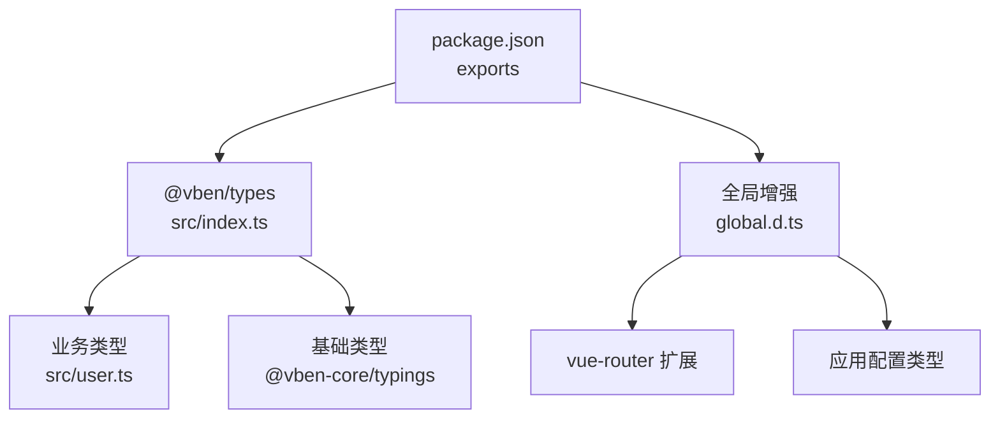
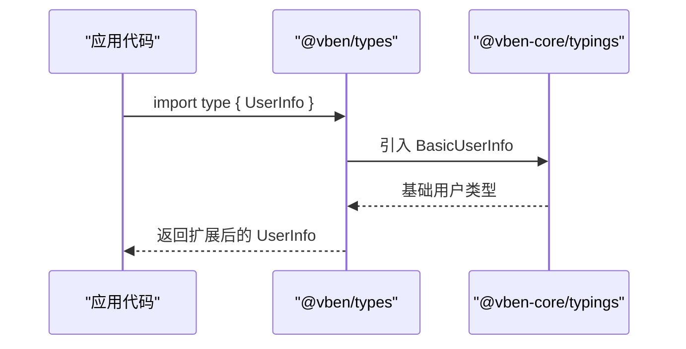
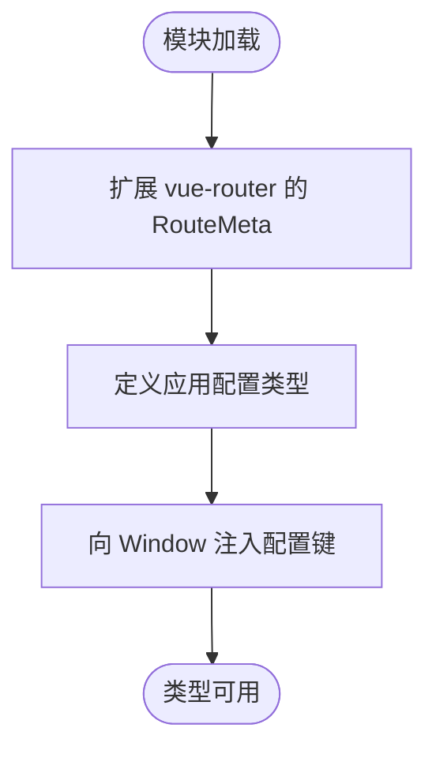
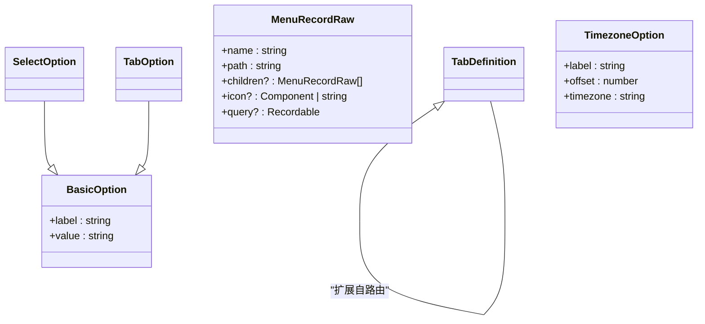
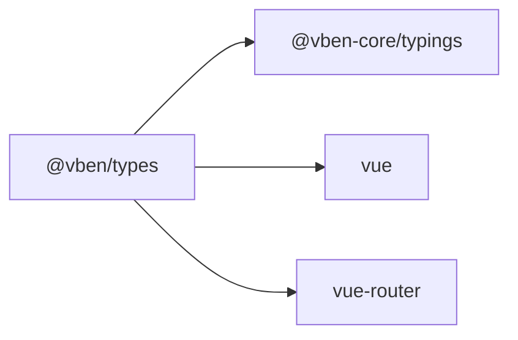

# TypeScript 类型定义 (types)

<cite>
**本文引用的文件**
- [frontend/packages/types/src/index.ts](file://frontend/packages/types/src/index.ts)
- [frontend/packages/types/src/user.ts](file://frontend/packages/types/src/user.ts)
- [frontend/packages/types/global.d.ts](file://frontend/packages/types/global.d.ts)
- [frontend/packages/types/package.json](file://frontend/packages/types/package.json)
- [frontend/packages/@core/base/typings/src/index.ts](file://frontend/packages/@core/base/typings/src/index.ts)
- [frontend/packages/@core/base/typings/src/basic.d.ts](file://frontend/packages/@core/base/typings/src/basic.d.ts)
- [frontend/packages/@core/base/typings/src/helper.d.ts](file://frontend/packages/@core/base/typings/src/helper.d.ts)
- [frontend/packages/@core/base/typings/src/app.d.ts](file://frontend/packages/@core/base/typings/src/app.d.ts)
- [frontend/packages/@core/base/typings/src/menu-record.ts](file://frontend/packages/@core/base/typings/src/menu-record.ts)
- [frontend/packages/@core/base/typings/src/tabs.ts](file://frontend/packages/@core/base/typings/src/tabs.ts)
</cite>

## 目录
1. [简介](#简介)
2. [项目结构](#项目结构)
3. [核心组件](#核心组件)
4. [架构总览](#架构总览)
5. [详细组件分析](#详细组件分析)
6. [依赖分析](#依赖分析)
7. [性能考虑](#性能考虑)
8. [故障排查指南](#故障排查指南)
9. [结论](#结论)
10. [附录](#附录)

## 简介
本包为前端多应用共享的 TypeScript 类型定义中心，负责：
- 统一业务实体与通用工具类型的组织与导出
- 继承并扩展 @vben-core/typings 的基础能力
- 提供全局类型增强（如 vue-router 路由元信息）与应用配置类型
- 通过严格的类型约束提升跨模块、跨应用的类型安全与可维护性

## 项目结构
本包采用“薄封装 + 集中导出”的组织方式：
- src/index.ts：统一导出业务类型与基础类型
- src/user.ts：业务用户类型扩展
- global.d.ts：全局类型增强（vue-router 扩展、应用配置）
- package.json：声明导出入口与依赖



图表来源
- [frontend/packages/types/src/index.ts:1-3](file://frontend/packages/types/src/index.ts#L1-L3)
- [frontend/packages/types/global.d.ts:1-33](file://frontend/packages/types/global.d.ts#L1-L33)
- [frontend/packages/types/package.json:13-20](file://frontend/packages/types/package.json#L13-L20)

章节来源
- [frontend/packages/types/src/index.ts:1-3](file://frontend/packages/types/src/index.ts#L1-L3)
- [frontend/packages/types/global.d.ts:1-33](file://frontend/packages/types/global.d.ts#L1-L33)
- [frontend/packages/types/package.json:1-28](file://frontend/packages/types/package.json#L1-L28)

## 核心组件
- 业务用户类型：在基础用户类型上扩展描述、首页路径、令牌等字段
- 全局路由元信息：将框架的路由元类型注入到 vue-router 的 RouteMeta
- 应用配置类型：定义运行时注入的环境变量与认证配置的结构
- 基础类型集合：来自 @vben-core/typings 的选择项、标签页、布局主题、权限模式等枚举与工具类型

章节来源
- [frontend/packages/types/src/user.ts:1-21](file://frontend/packages/types/src/user.ts#L1-L21)
- [frontend/packages/types/global.d.ts:1-33](file://frontend/packages/types/global.d.ts#L1-L33)
- [frontend/packages/@core/base/typings/src/index.ts:1-7](file://frontend/packages/@core/base/typings/src/index.ts#L1-L7)

## 架构总览
类型体系分层清晰：
- 基础层：@vben-core/typings 提供通用 UI、系统配置、工具类型
- 业务层：@vben/types 聚合业务相关类型（如 UserInfo）
- 全局层：global.d.ts 对第三方库进行类型增强（如 vue-router）

```mermaid
classDiagram
class BasicUserInfo {
+avatar : string
+realName : string
+roles? : string[]
+userId : string
+username : string
}
class UserInfo {
+desc : string
+homePath : string
+token : string
}
class RouteMeta
class ApplicationConfig {
+apiURL : string
+auth : AuthConfig
}
class AuthConfig {
+dingding? : { clientId : string; corpId : string }
}
UserInfo --|> BasicUserInfo : "扩展"
ApplicationConfig --> AuthConfig : "包含"
RouteMeta <.. ApplicationConfig : "被扩展"
```

图表来源
- [frontend/packages/@core/base/typings/src/basic.d.ts:10-31](file://frontend/packages/@core/base/typings/src/basic.d.ts#L10-L31)
- [frontend/packages/types/src/user.ts:1-21](file://frontend/packages/types/src/user.ts#L1-L21)
- [frontend/packages/types/global.d.ts:5-26](file://frontend/packages/types/global.d.ts#L5-L26)

## 详细组件分析

### 业务用户类型（UserInfo）
- 设计目标：在基础用户信息之上补充业务所需字段，保持向后兼容
- 关键特性：
  - 继承基础用户类型，避免重复定义
  - 新增描述、首页路径、访问令牌等业务字段
- 使用建议：
  - 通过 type 导入，避免运行时开销
  - 在状态管理、API 响应、鉴权上下文等处统一使用该类型



图表来源
- [frontend/packages/types/src/user.ts:1-21](file://frontend/packages/types/src/user.ts#L1-L21)
- [frontend/packages/@core/base/typings/src/basic.d.ts:10-31](file://frontend/packages/@core/base/typings/src/basic.d.ts#L10-L31)

章节来源
- [frontend/packages/types/src/user.ts:1-21](file://frontend/packages/types/src/user.ts#L1-L21)
- [frontend/packages/@core/base/typings/src/basic.d.ts:10-31](file://frontend/packages/@core/base/typings/src/basic.d.ts#L10-L31)

### 全局类型增强（vue-router 与 Window）
- 路由元信息扩展：将框架定义的 RouteMeta 合并到 vue-router 的 RouteMeta，使路由配置具备强类型
- 应用配置注入：在 Window 上暴露应用配置对象，便于运行时读取环境变量映射
- 使用建议：
  - 路由 meta 字段需严格遵循扩展后的类型
  - 应用配置键名应与构建时注入保持一致



图表来源
- [frontend/packages/types/global.d.ts:1-33](file://frontend/packages/types/global.d.ts#L1-L33)

章节来源
- [frontend/packages/types/global.d.ts:1-33](file://frontend/packages/types/global.d.ts#L1-L33)

### 基础类型集合（@vben-core/typings）
- 选择项与标签项：统一的 label/value 结构，用于下拉框、标签页等
- 工具类型：
  - DeepPartial / DeepReadonly：深度可选/只读
  - MaybePromise / MaybeComputedRef：异步与计算属性的联合
  - Recordable / ReadonlyRecordable：字符串键的对象映射
  - Merge / MergeAll：类型级合并
- 应用配置枚举：布局、主题、权限模式、导航风格、页面过渡等
- 菜单记录：菜单树节点、徽标、父子关系等
- 标签页定义：基于路由归一化对象的标签页模型



图表来源
- [frontend/packages/@core/base/typings/src/basic.d.ts:1-42](file://frontend/packages/@core/base/typings/src/basic.d.ts#L1-L42)
- [frontend/packages/@core/base/typings/src/menu-record.ts:1-83](file://frontend/packages/@core/base/typings/src/menu-record.ts#L1-L83)
- [frontend/packages/@core/base/typings/src/tabs.ts:1-9](file://frontend/packages/@core/base/typings/src/tabs.ts#L1-L9)
- [frontend/packages/@core/base/typings/src/app.d.ts:104-127](file://frontend/packages/@core/base/typings/src/app.d.ts#L104-L127)

章节来源
- [frontend/packages/@core/base/typings/src/basic.d.ts:1-42](file://frontend/packages/@core/base/typings/src/basic.d.ts#L1-L42)
- [frontend/packages/@core/base/typings/src/helper.d.ts:1-151](file://frontend/packages/@core/base/typings/src/helper.d.ts#L1-L151)
- [frontend/packages/@core/base/typings/src/app.d.ts:1-127](file://frontend/packages/@core/base/typings/src/app.d.ts#L1-L127)
- [frontend/packages/@core/base/typings/src/menu-record.ts:1-83](file://frontend/packages/@core/base/typings/src/menu-record.ts#L1-L83)
- [frontend/packages/@core/base/typings/src/tabs.ts:1-9](file://frontend/packages/@core/base/typings/src/tabs.ts#L1-L9)

### 高级类型实践（泛型、条件类型、映射类型）
- 泛型：
  - 工具函数与类型普遍使用 T 作为占位，保证类型推导一致性
  - 例如 MaybePromise<T>、Recordable<T>
- 条件类型：
  - 用于分支判断类型形态，如 MaybeComputedRef 区分 ComputedRef 与普通值
- 映射类型：
  - DeepPartial、DeepReadonly 通过递归映射实现深度属性修饰
  - Merge/MergeAll 通过键空间合并实现类型级对象组合

最佳实践建议：
- 优先使用 interface 表达稳定契约，type 表达派生或联合
- 复杂嵌套结构使用 DeepPartial/DeepReadonly 控制可变性与可选性
- 使用条件类型表达“可能是某种形式”的输入，提高 API 友好度
- 通过命名约定明确类型职责（如 XxxOption、XxxType、XxxDefinition）

章节来源
- [frontend/packages/@core/base/typings/src/helper.d.ts:1-151](file://frontend/packages/@core/base/typings/src/helper.d.ts#L1-L151)

## 依赖分析
- 包内依赖：
  - 业务类型依赖基础类型（BasicUserInfo）
  - 全局增强依赖 vue-router 的类型扩展点
- 外部依赖：
  - @vben-core/typings：基础类型与配置枚举
  - vue、vue-router：运行时库的类型声明



图表来源
- [frontend/packages/types/package.json:22-26](file://frontend/packages/types/package.json#L22-L26)
- [frontend/packages/types/global.d.ts:1-8](file://frontend/packages/types/global.d.ts#L1-L8)

章节来源
- [frontend/packages/types/package.json:1-28](file://frontend/packages/types/package.json#L1-L28)
- [frontend/packages/types/global.d.ts:1-8](file://frontend/packages/types/global.d.ts#L1-L8)

## 性能考虑
- 类型仅参与编译期检查，不产生运行时开销；合理使用 type 导入避免误用
- 深度类型（如 DeepPartial/DeepReadonly）在极深嵌套场景下可能增加编译时间，建议：
  - 限制最大深度参数
  - 仅在必要时使用
- 避免过度使用 any，尽量使用条件类型与映射类型表达精确约束

## 故障排查指南
常见问题与解决思路：
- 路由 meta 类型报错
  - 确认已引入 global.d.ts 或通过 tsconfig 包含该文件
  - 检查是否使用了正确的 RouteMeta 扩展
- 应用配置键名不匹配
  - 核对构建时注入的键名与 VbenAdminProAppConfigRaw 定义一致
- 类型推导异常
  - 检查泛型传入是否满足约束
  - 使用条件类型收窄类型范围
  - 避免不必要的 any 导致类型丢失

章节来源
- [frontend/packages/types/global.d.ts:1-33](file://frontend/packages/types/global.d.ts#L1-L33)

## 结论
本类型包以最小成本实现了跨应用的类型统一与扩展：
- 通过继承与扩展机制，保持基础能力的复用与演进
- 借助全局增强，确保第三方库的类型一致性
- 提供丰富的工具类型与枚举，支撑复杂业务建模
建议在团队中推广“先定义类型，再实现逻辑”的开发流程，最大化发挥类型系统的价值。

## 附录
- 使用示例（路径引用）
  - 导入业务类型：[frontend/packages/types/src/index.ts:1-3](file://frontend/packages/types/src/index.ts#L1-L3)
  - 扩展用户类型：[frontend/packages/types/src/user.ts:1-21](file://frontend/packages/types/src/user.ts#L1-L21)
  - 路由元信息扩展：[frontend/packages/types/global.d.ts:1-8](file://frontend/packages/types/global.d.ts#L1-L8)
  - 应用配置类型：[frontend/packages/types/global.d.ts:10-26](file://frontend/packages/types/global.d.ts#L10-L26)
  - 基础类型导出入口：[frontend/packages/@core/base/typings/src/index.ts:1-7](file://frontend/packages/@core/base/typings/src/index.ts#L1-L7)
  - 选择项与标签项：[frontend/packages/@core/base/typings/src/basic.d.ts:1-9](file://frontend/packages/@core/base/typings/src/basic.d.ts#L1-L9)
  - 工具类型集合：[frontend/packages/@core/base/typings/src/helper.d.ts:1-151](file://frontend/packages/@core/base/typings/src/helper.d.ts#L1-L151)
  - 应用配置枚举：[frontend/packages/@core/base/typings/src/app.d.ts:1-127](file://frontend/packages/@core/base/typings/src/app.d.ts#L1-L127)
  - 菜单记录模型：[frontend/packages/@core/base/typings/src/menu-record.ts:1-83](file://frontend/packages/@core/base/typings/src/menu-record.ts#L1-L83)
  - 标签页定义：[frontend/packages/@core/base/typings/src/tabs.ts:1-9](file://frontend/packages/@core/base/typings/src/tabs.ts#L1-L9)