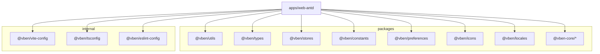
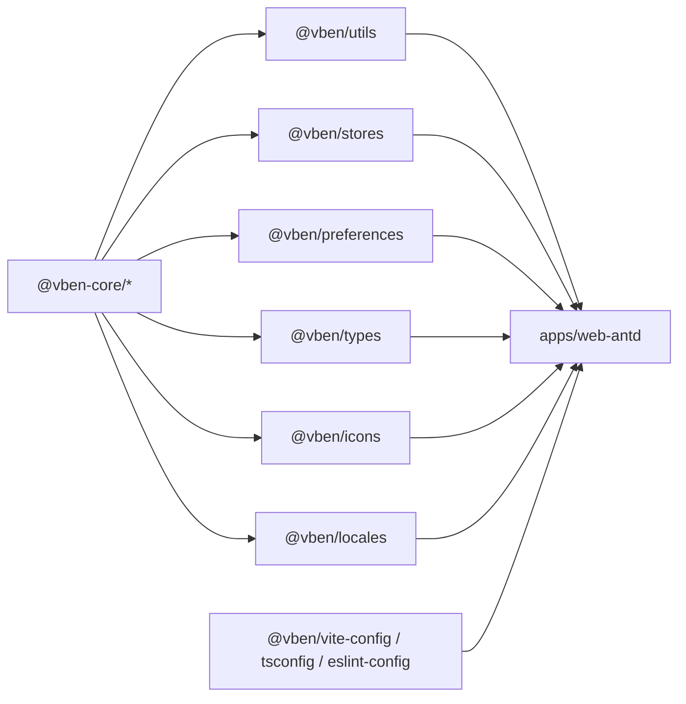
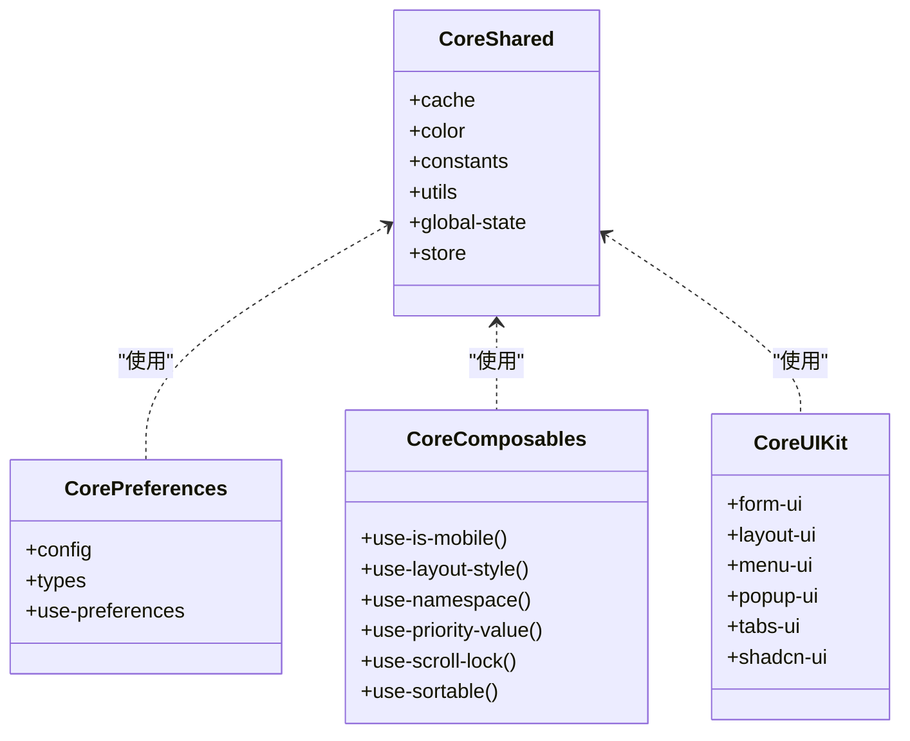
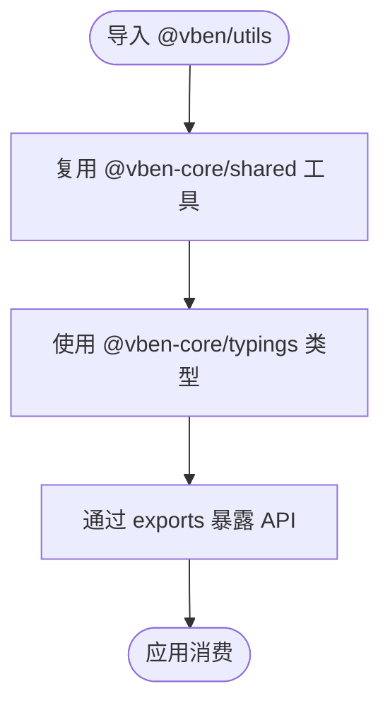
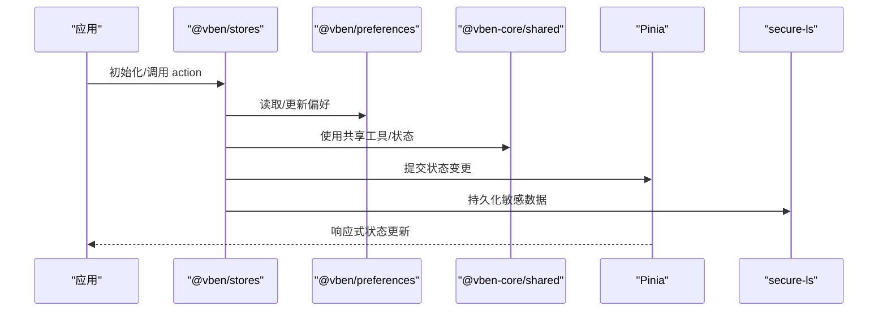
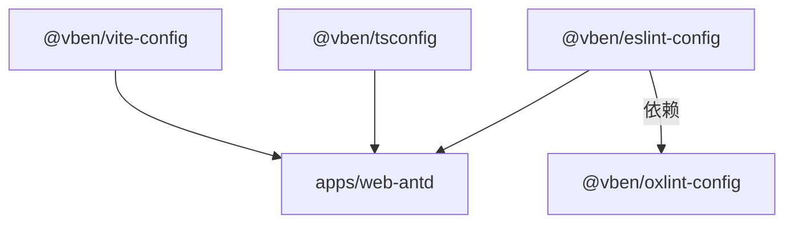
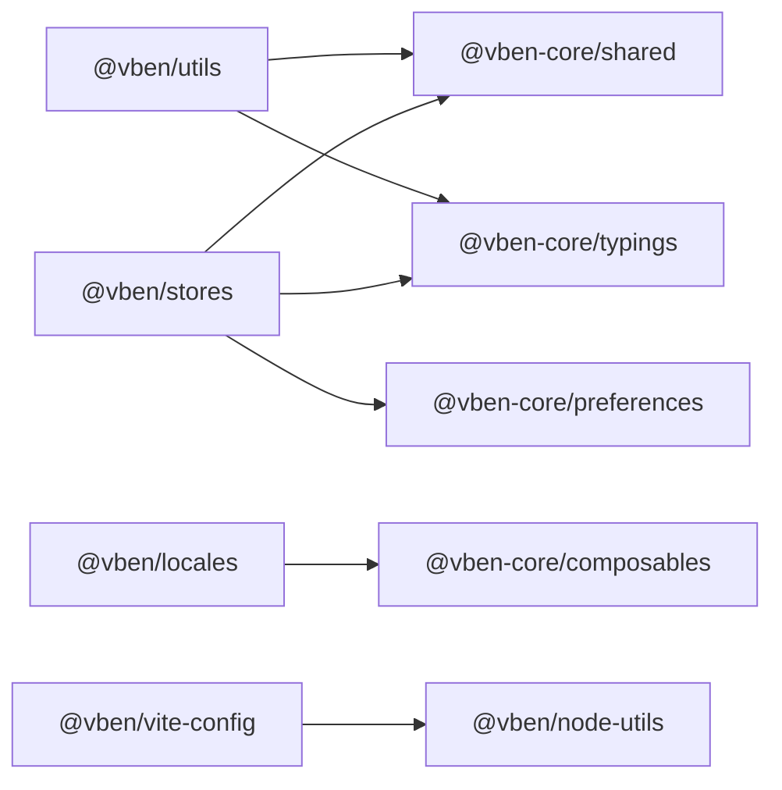
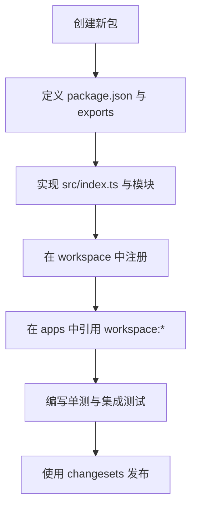

# 共享包管理

<cite>
**本文引用的文件**
- [frontend/package.json](file://frontend/package.json)
- [frontend/pnpm-workspace.yaml](file://frontend/pnpm-workspace.yaml)
- [packages/utils/package.json](file://frontend/packages/utils/package.json)
- [packages/types/package.json](file://frontend/packages/types/package.json)
- [packages/stores/package.json](file://frontend/packages/stores/package.json)
- [packages/constants/package.json](file://frontend/packages/constants/package.json)
- [packages/preferences/package.json](file://frontend/packages/preferences/package.json)
- [packages/icons/package.json](file://frontend/packages/icons/package.json)
- [packages/locales/package.json](file://frontend/packages/locales/package.json)
- [packages/@core/base/shared/src/index.ts](file://frontend/packages/@core/base/shared/src/index.ts)
- [packages/@core/base/shared/src/cache/index.ts](file://frontend/packages/@core/base/shared/src/cache/index.ts)
- [packages/@core/base/shared/src/color/index.ts](file://frontend/packages/@core/base/shared/src/color/index.ts)
- [packages/@core/base/shared/src/utils/index.ts](file://frontend/packages/@core/base/shared/src/utils/index.ts)
- [internal/vite-config/package.json](file://frontend/internal/vite-config/package.json)
- [internal/tsconfig/package.json](file://frontend/internal/tsconfig/package.json)
- [internal/lint-configs/eslint-config/package.json](file://frontend/internal/lint-configs/eslint-config/package.json)
</cite>

## 目录
1. [简介](#简介)
2. [项目结构](#项目结构)
3. [核心组件](#核心组件)
4. [架构总览](#架构总览)
5. [详细组件分析](#详细组件分析)
6. [依赖关系分析](#依赖关系分析)
7. [性能考量](#性能考量)
8. [故障排查指南](#故障排查指南)
9. [结论](#结论)
10. [附录](#附录)

## 简介
本文件面向前端 Monorepo 中的“共享包管理系统”，系统性说明 packages 与 internal 两大目录下的共享包设计理念、职责边界、依赖隔离机制、发布策略与版本管理，以及包间引用规范、API 设计原则与测试策略。同时提供创建和使用新共享包的实践示例，帮助团队在大型应用中保持代码复用、类型一致与构建高效。

## 项目结构
- 顶层 workspace 通过 pnpm workspace 统一管理所有子包与工具包，统一依赖版本（catalog）与安装行为（autoInstallPeers、dedupePeerDependents）。
- packages：对外可复用的业务与基础能力包，如 @vben/utils、@vben/types、@vben/stores、@vben/constants、@vben/preferences、@vben/icons、@vben/locales 等。
- internal：仅在本仓库内部使用的工程化配置与工具包，如 @vben/vite-config、@vben/tsconfig、@vben/eslint-config 等，通常标记为 private。
- apps：具体应用（如 web-antd），消费上述共享包。
- scripts：工作区脚本与命令封装。

**图表来源**
- [frontend/pnpm-workspace.yaml:1-14](file://frontend/pnpm-workspace.yaml#L1-L14)
- [frontend/package.json:27-59](file://frontend/package.json#L27-L59)

**章节来源**
- [frontend/pnpm-workspace.yaml:1-225](file://frontend/pnpm-workspace.yaml#L1-L225)
- [frontend/package.json:1-103](file://frontend/package.json#L1-L103)

## 核心组件
- @vben/core（以 @vben-core/* 形式存在）：核心基础包，包含 design、icons、shared、typings、composables、preferences、ui-kit 等子模块，提供样式系统、图标、通用工具、类型定义、组合式函数、偏好设置与 UI 组件基座。
- @vben/utils：轻量工具函数库，基于 @vben-core/shared 与 @vben-core/typings，向上层应用暴露常用能力。
- @vben/types：集中 TypeScript 类型定义，导出全局类型与模块类型，供其他包与应用消费。
- @vben/effects：视觉效果相关能力（动画、过渡、视觉增强等），作为独立包便于按需引入与打包优化。
- @vben/stores：状态管理包，基于 Pinia，结合 preferences 与 shared 能力，提供跨页面状态与持久化方案。
- @vben/constants：常量集中管理，避免魔法字符串散落。
- @vben/preferences：用户偏好与主题配置，驱动 CSS 变量与运行时主题切换。
- @vben/icons：图标聚合与按需加载入口。
- @vben/locales：国际化资源与 i18n 集成。

**章节来源**
- [packages/utils/package.json:1-28](file://frontend/packages/utils/package.json#L1-L28)
- [packages/types/package.json:1-28](file://frontend/packages/types/package.json#L1-L28)
- [packages/stores/package.json:1-33](file://frontend/packages/stores/package.json#L1-L33)
- [packages/constants/package.json:1-26](file://frontend/packages/constants/package.json#L1-L26)
- [packages/preferences/package.json:1-27](file://frontend/packages/preferences/package.json#L1-L27)
- [packages/icons/package.json:1-23](file://frontend/packages/icons/package.json#L1-L23)
- [packages/locales/package.json:1-29](file://frontend/packages/locales/package.json#L1-L29)

## 架构总览
Monorepo 采用分层解耦的共享包架构：
- 基础设施层：@vben-core/* 提供设计系统、共享工具、类型与 UI 基座。
- 能力层：utils、stores、preferences、constants、icons、locales 等按职责拆分，低耦合、高内聚。
- 工程化层：internal 下的 vite-config、tsconfig、eslint-config 等统一构建、类型与代码规范。
- 应用层：apps 消费共享包，通过 workspace:* 引用实现本地联调与增量构建。

**图表来源**
- [packages/utils/package.json:22-26](file://frontend/packages/utils/package.json#L22-L26)
- [packages/stores/package.json:22-31](file://frontend/packages/stores/package.json#L22-L31)
- [packages/preferences/package.json:22-25](file://frontend/packages/preferences/package.json#L22-L25)
- [packages/types/package.json:22-26](file://frontend/packages/types/package.json#L22-L26)
- [packages/icons/package.json:19-21](file://frontend/packages/icons/package.json#L19-L21)
- [packages/locales/package.json:22-27](file://frontend/packages/locales/package.json#L22-L27)
- [internal/vite-config/package.json:29-41](file://frontend/internal/vite-config/package.json#L29-L41)
- [internal/tsconfig/package.json:21-24](file://frontend/internal/tsconfig/package.json#L21-L24)
- [internal/lint-configs/eslint-config/package.json:29-45](file://frontend/internal/lint-configs/eslint-config/package.json#L29-L45)

## 详细组件分析

### @core 核心基础包（@vben-core/*）
- 设计理念：将设计系统、图标、共享工具、类型、组合式函数、偏好设置与 UI 组件基座解耦为多个子包，形成稳定的“内核”。
- 关键子模块：
  - base/design：设计令牌、CSS/SCSS 组织、BEM 命名约定。
  - base/icons：图标生成与注册。
  - base/shared：缓存、颜色、常量、通用工具、全局状态与 store 抽象。
  - base/typings：基础类型与路由扩展。
  - composables：组合式函数（移动端判断、布局样式、命名空间、滚动锁定、排序等）。
  - preferences：偏好配置与 CSS 变量更新。
  - ui-kit：表单、布局、菜单、弹窗、标签页、shadcn-ui 等 UI 能力。

**图表来源**
- [packages/@core/base/shared/src/index.ts](file://frontend/packages/@core/base/shared/src/index.ts)
- [packages/@core/base/shared/src/cache/index.ts](file://frontend/packages/@core/base/shared/src/cache/index.ts)
- [packages/@core/base/shared/src/color/index.ts](file://frontend/packages/@core/base/shared/src/color/index.ts)
- [packages/@core/base/shared/src/utils/index.ts](file://frontend/packages/@core/base/shared/src/utils/index.ts)
- [packages/preferences/package.json:22-25](file://frontend/packages/preferences/package.json#L22-L25)

**章节来源**
- [packages/@core/base/shared/src/index.ts](file://frontend/packages/@core/base/shared/src/index.ts)
- [packages/@core/base/shared/src/cache/index.ts](file://frontend/packages/@core/base/shared/src/cache/index.ts)
- [packages/@core/base/shared/src/color/index.ts](file://frontend/packages/@core/base/shared/src/color/index.ts)
- [packages/@core/base/shared/src/utils/index.ts](file://frontend/packages/@core/base/shared/src/utils/index.ts)

### utils 工具函数库（@vben/utils）
- 职责：提供无副作用或轻副作用的工具函数，聚焦数据转换、DOM、日期、树形结构、唯一性、下载、进度条等。
- 依赖：基于 @vben-core/shared 与 @vben-core/typings，确保类型与工具一致性。
- 导出策略：通过 package.json 的 exports 字段暴露入口，支持类型与默认路径分离。

**图表来源**
- [packages/utils/package.json:16-26](file://frontend/packages/utils/package.json#L16-L26)

**章节来源**
- [packages/utils/package.json:1-28](file://frontend/packages/utils/package.json#L1-L28)

### types TypeScript 类型定义（@vben/types）
- 职责：集中管理全局与模块级类型，保证跨包类型一致。
- 导出：支持根导出与 global 类型声明，便于全局类型注入。
- 依赖：依赖 @vben-core/typings 与 Vue/Router 类型。

**章节来源**
- [packages/types/package.json:1-28](file://frontend/packages/types/package.json#L1-L28)

### effects 视觉效果包（@vben/effects）
- 职责：封装动画、过渡、视觉增强等效果能力，便于按需引入与体积控制。
- 设计原则：与 UI 组件解耦，通过组合式函数或插件形式接入。

[本节为概念性说明，不直接分析具体文件]

### stores 状态管理包（@vben/stores）
- 职责：基于 Pinia 的状态管理，结合 preferences 与 shared，提供跨页面状态、持久化与路由联动。
- 依赖：Pinia、pinia-plugin-persistedstate、secure-ls、Vue、Vue Router。
- 设计要点：
  - 状态与偏好分离：偏好由 preferences 管理，业务状态由 stores 管理。
  - 持久化策略：通过 secure-ls 与 pinia-plugin-persistedstate 实现安全持久化。
  - 类型安全：依赖 @vben-core/typings 与 @vben-core/preferences。

**图表来源**
- [packages/stores/package.json:22-31](file://frontend/packages/stores/package.json#L22-L31)

**章节来源**
- [packages/stores/package.json:1-33](file://frontend/packages/stores/package.json#L1-L33)

### constants、icons、locales
- constants：集中常量，减少魔法值，便于维护与替换。
- icons：图标聚合与按需加载，依赖 @vben-core/icons。
- locales：i18n 资源与集成，依赖 @intlify/core-base、vue-i18n 与 @vben-core/composables。

**章节来源**
- [packages/constants/package.json:1-26](file://frontend/packages/constants/package.json#L1-L26)
- [packages/icons/package.json:1-23](file://frontend/packages/icons/package.json#L1-L23)
- [packages/locales/package.json:1-29](file://frontend/packages/locales/package.json#L1-L29)

### internal 内部工具包
- vite-config：统一的 Vite 构建配置，包含插件、应用/库模式、PWA、压缩、Tailwind、Mock 等能力。
- tsconfig：共享 TypeScript 配置（base/library/node/web-app/web），保证类型与编译一致性。
- lint-configs：ESLint、Oxlint、Stylelint、Commitlint 等代码规范配置，统一质量门禁。

**图表来源**
- [internal/vite-config/package.json:29-41](file://frontend/internal/vite-config/package.json#L29-L41)
- [internal/tsconfig/package.json:21-24](file://frontend/internal/tsconfig/package.json#L21-L24)
- [internal/lint-configs/eslint-config/package.json:29-45](file://frontend/internal/lint-configs/eslint-config/package.json#L29-L45)

**章节来源**
- [internal/vite-config/package.json:1-61](file://frontend/internal/vite-config/package.json#L1-L61)
- [internal/tsconfig/package.json:1-26](file://frontend/internal/tsconfig/package.json#L1-L26)
- [internal/lint-configs/eslint-config/package.json:1-48](file://frontend/internal/lint-configs/eslint-config/package.json#L1-L48)

## 依赖关系分析
- 工作区依赖：通过 pnpm-workspace.yaml 的 catalog 统一依赖版本，避免重复与冲突；publicHoistPattern 提升常用 CLI 工具的可发现性。
- 包间引用：
  - 共享包之间通过 workspace:* 引用，确保本地开发时实时联调与增量构建。
  - 应用消费共享包，遵循“自顶向下”的依赖方向，禁止反向依赖。
- 外部依赖：
  - 状态管理：Pinia + persistedstate + secure-ls。
  - 构建：Vite + Tailwind + PWA + 压缩。
  - 类型：TypeScript + vue-tsc。
  - 规范：ESLint/Oxlint/Stylelint/Commitlint。

**图表来源**
- [packages/utils/package.json:22-26](file://frontend/packages/utils/package.json#L22-L26)
- [packages/stores/package.json:22-31](file://frontend/packages/stores/package.json#L22-L31)
- [packages/locales/package.json:22-27](file://frontend/packages/locales/package.json#L22-L27)
- [internal/vite-config/package.json:29-41](file://frontend/internal/vite-config/package.json#L29-L41)

**章节来源**
- [frontend/pnpm-workspace.yaml:16-29](file://frontend/pnpm-workspace.yaml#L16-L29)
- [frontend/pnpm-workspace.yaml:31-225](file://frontend/pnpm-workspace.yaml#L31-L225)

## 性能考量
- Tree-shaking 与 sideEffects：通过 sideEffects 标注 CSS，减少无用样式打包。
- 按需引入：effects、icons、locales 等按功能拆分，避免全量引入。
- 构建优化：vite-config 提供压缩、PWA、Tailwind 参考、Mock 等插件，提升开发与生产性能。
- 依赖去重：pnpm dedupePeerDependents 与 catalog 统一版本，降低包体积与安装时间。
- 类型检查：turbo 并行 typecheck，缩短反馈周期。

[本节为通用指导，不直接分析具体文件]

## 故障排查指南
- 构建失败
  - 检查 vite-config 插件是否启用正确，确认依赖版本与 catalog 一致。
  - 若出现循环依赖，使用 vsh check-circular 定位并重构。
- 类型错误
  - 确认 @vben/types 与 @vben-core/typings 版本匹配。
  - 使用 turbo run typecheck 快速定位问题包。
- 状态异常
  - 检查 stores 中 Pinia 实例与持久化配置，确认 secure-ls 权限与存储限制。
  - 验证 preferences 与 CSS 变量更新逻辑。
- 国际化问题
  - 检查 locales 包是否正确挂载 i18n 实例，消息键是否存在。
- 图标缺失
  - 确认 @vben-core/icons 已正确注册，按需加载配置生效。

**章节来源**
- [frontend/package.json:36-40](file://frontend/package.json#L36-L40)
- [internal/vite-config/package.json:29-41](file://frontend/internal/vite-config/package.json#L29-L41)
- [packages/stores/package.json:22-31](file://frontend/packages/stores/package.json#L22-L31)
- [packages/locales/package.json:22-27](file://frontend/packages/locales/package.json#L22-L27)
- [packages/icons/package.json:19-21](file://frontend/packages/icons/package.json#L19-L21)

## 结论
该共享包体系通过清晰的职责划分、严格的依赖方向与统一的工程化配置，实现了高内聚、低耦合与可维护的前端架构。packages 提供稳定可复用的能力，internal 保障一致的构建与质量门禁，apps 专注业务实现。借助 pnpm workspace 与 catalog，团队可在大型项目中高效协作与演进。

[本节为总结性内容，不直接分析具体文件]

## 附录

### 包的发布策略与版本管理
- 版本管理：使用 changesets 进行版本管理与变更日志生成，配合 pnpm version 与 CI 流程。
- 发布范围：
  - packages 下的包可独立发布至私有或公共 registry。
  - internal 下的包通常为私有，仅在 Monorepo 内使用。
- 依赖隔离：通过 workspace:* 与 catalog 实现依赖隔离与版本统一，避免幽灵依赖与版本漂移。

**章节来源**
- [frontend/package.json:35-59](file://frontend/package.json#L35-L59)
- [frontend/pnpm-workspace.yaml:16-29](file://frontend/pnpm-workspace.yaml#L16-L29)
- [frontend/pnpm-workspace.yaml:31-225](file://frontend/pnpm-workspace.yaml#L31-L225)

### 包间引用规范
- 依赖方向：apps → packages → @vben-core/*；禁止反向依赖。
- 导出策略：每个包通过 package.json 的 exports 明确暴露入口，区分 types 与 default。
- 命名约定：@vben/* 表示共享包，@vben-core/* 表示核心基础包。

**章节来源**
- [packages/utils/package.json:16-26](file://frontend/packages/utils/package.json#L16-L26)
- [packages/types/package.json:16-20](file://frontend/packages/types/package.json#L16-L20)
- [packages/stores/package.json:16-20](file://frontend/packages/stores/package.json#L16-L20)

### API 设计原则
- 稳定性：核心 API 保持稳定，变更遵循语义化版本。
- 最小化：只暴露必要接口，隐藏实现细节。
- 类型优先：优先提供完整类型定义，便于 IDE 提示与静态检查。
- 可组合：通过组合式函数与工具函数提供灵活拼装能力。

[本节为通用指导，不直接分析具体文件]

### 测试策略
- 单元测试：对 utils、shared、preferences 等纯函数与状态逻辑编写单测，使用 Vitest。
- 快照测试：对偏好配置等输出进行快照比对，防止意外变更。
- E2E 测试：对关键用户流程进行端到端测试，确保包集成正确。
- 质量门禁：通过 lefthook 与 CI 执行 lint、typecheck、test。

**章节来源**
- [packages/preferences/__tests__/config.test.ts](file://frontend/packages/preferences/__tests__/config.test.ts)
- [packages/preferences/__tests__/preferences.test.ts](file://frontend/packages/preferences/__tests__/preferences.test.ts)
- [frontend/package.json:55-56](file://frontend/package.json#L55-L56)

### 实际示例：创建与使用新共享包
- 步骤一：在 packages 下新建包目录，添加 package.json，定义 name、version、exports、dependencies。
- 步骤二：在 src 下实现模块与入口 index.ts，通过 exports 暴露 API。
- 步骤三：在 pnpm-workspace.yaml 中纳入包路径（若未自动识别）。
- 步骤四：在 apps 或其他包中通过 workspace:* 引用新包，进行联调与测试。
- 步骤五：使用 changesets 记录变更，执行版本管理与发布。

[本节为概念性流程图，不直接映射到具体文件]