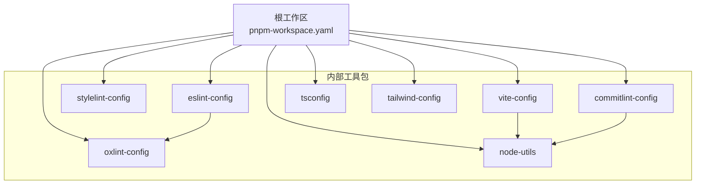
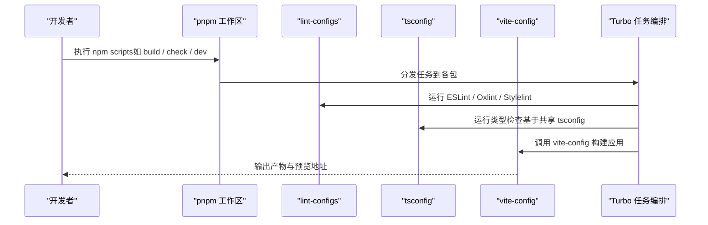
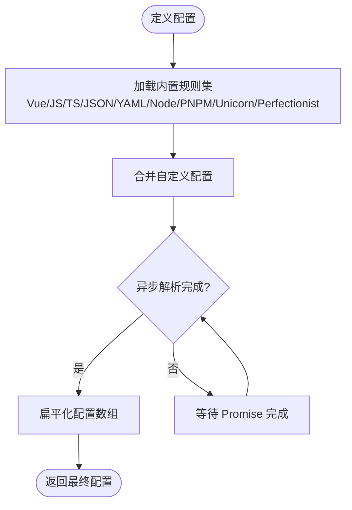
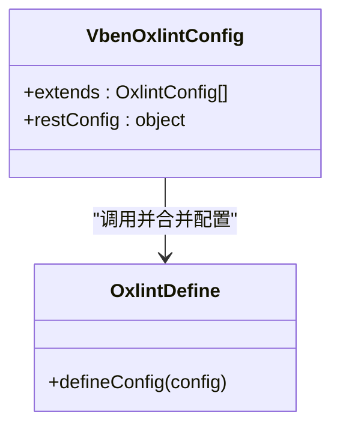
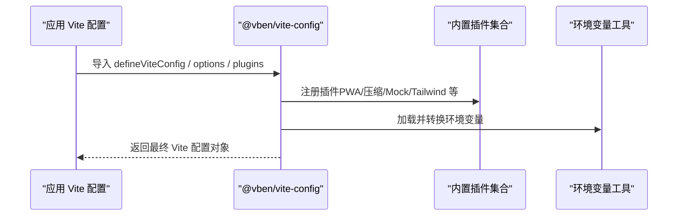
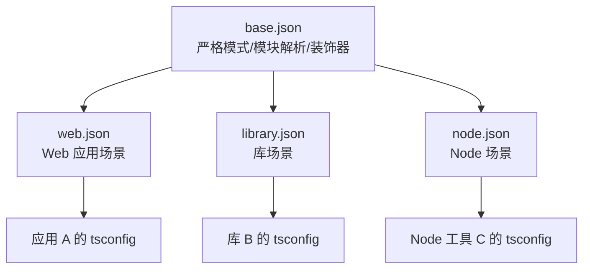
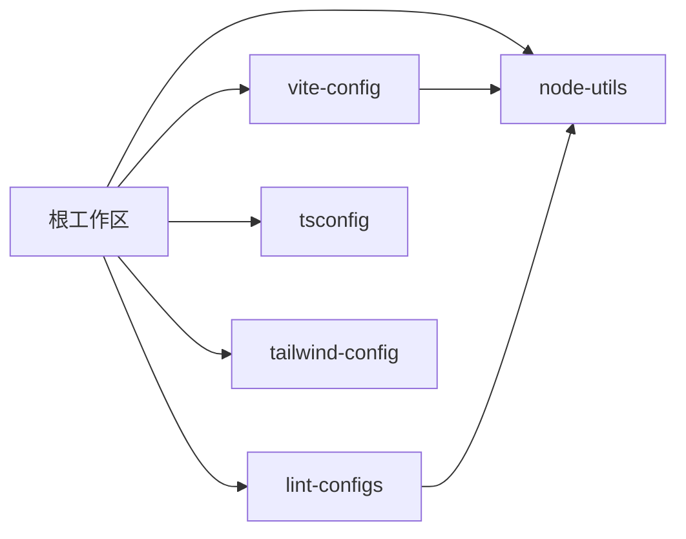

# 内部工具包 (internal)

<cite>
**本文引用的文件**
- [frontend/package.json](file://frontend/package.json)
- [frontend/pnpm-workspace.yaml](file://frontend/pnpm-workspace.yaml)
- [internal/lint-configs/eslint-config/src/index.ts](file://internal/lint-configs/eslint-config/src/index.ts)
- [internal/lint-configs/oxlint-config/src/index.ts](file://internal/lint-configs/oxlint-config/src/index.ts)
- [internal/lint-configs/stylelint-config/package.json](file://internal/lint-configs/stylelint-config/package.json)
- [internal/lint-configs/commitlint-config/package.json](file://internal/lint-configs/commitlint-config/package.json)
- [internal/vite-config/src/index.ts](file://internal/vite-config/src/index.ts)
- [internal/tsconfig/base.json](file://internal/tsconfig/base.json)
- [internal/tailwind-config/src/index.ts](file://internal/tailwind-config/src/index.ts)
- [internal/node-utils/src/index.ts](file://internal/node-utils/src/index.ts)
</cite>

## 目录
1. [简介](#简介)
2. [项目结构](#项目结构)
3. [核心组件](#核心组件)
4. [架构总览](#架构总览)
5. [详细组件分析](#详细组件分析)
6. [依赖关系分析](#依赖关系分析)
7. [性能与构建优化](#性能与构建优化)
8. [故障排查指南](#故障排查指南)
9. [结论](#结论)
10. [附录：集成示例](#附录：集成示例)

## 简介
本仓库包含一套面向前端工程化的内部工具包，位于 frontend/internal 目录下。其目标是统一代码规范、构建流程与 TypeScript 配置，降低多应用间的差异，提升开发体验与一致性。主要覆盖：
- lint-configs：统一的 ESLint、Oxlint、Stylelint、Commitlint 等规则集
- vite-config：基于 Vite 的通用构建配置与插件集合
- tsconfig：共享的 TypeScript 编译选项
- tailwind-config：Tailwind 主题与样式入口
- node-utils：Node 侧常用工具函数（文件系统、Git、Monorepo、哈希等）

这些包通过 pnpm workspace 管理，并在根级脚本中串联使用，形成“规范检查 -> 类型检查 -> 构建 -> 预览”的完整流水线。

## 项目结构
frontend/internal 下各子包职责清晰：
- lint-configs：封装各类 Lint 规则，提供 defineConfig 导出，便于在项目中直接引用
- vite-config：聚合 Vite 插件与通用配置，暴露 options 与 plugins，供应用层组合
- tsconfig：提供 base、web、library、node 等预设，统一编译行为
- tailwind-config：集中 Tailwind 主题与动画等样式资源
- node-utils：为脚本与工具链提供可复用的 Node 能力

图表来源
- [frontend/pnpm-workspace.yaml:1-14](file://frontend/pnpm-workspace.yaml#L1-L14)
- [internal/vite-config/src/index.ts:1-6](file://internal/vite-config/src/index.ts#L1-L6)
- [internal/node-utils/src/index.ts:1-20](file://internal/node-utils/src/index.ts#L1-L20)

章节来源
- [frontend/pnpm-workspace.yaml:1-14](file://frontend/pnpm-workspace.yaml#L1-L14)
- [frontend/package.json:27-59](file://frontend/package.json#L27-L59)

## 核心组件
- @vben/eslint-config：以 Flat Config 形式聚合 Vue/JS/TS/JSON/YAML/Node/PNPM/Unicorn/Perfectionist 等规则，并支持自定义扩展
- @vben/oxlint-config：对 Oxlint 进行统一封装，支持 extends 合并策略，便于快速启用高性能静态检查
- @vben/stylelint-config：统一 CSS/SCSS/Vue 样式规则，结合 order 与 SCSS 插件
- @vben/commitlint-config：统一提交信息规范，集成 czg/cz-git 交互式提交
- @vben/vite-config：聚合 Vite 插件与通用配置项，暴露 loadAndConvertEnv 等工具
- @vben/tsconfig：提供 base/web/library/node 等预设，统一严格模式与模块解析
- @vben/tailwind-config：集中 Tailwind 主题与动画样式
- @vben/node-utils：提供 fs/git/date/hash/path/spinner 等工具，以及 monorepo 读取能力

章节来源
- [internal/lint-configs/eslint-config/src/index.ts:1-47](file://internal/lint-configs/eslint-config/src/index.ts#L1-L47)
- [internal/lint-configs/oxlint-config/src/index.ts:1-22](file://internal/lint-configs/oxlint-config/src/index.ts#L1-L22)
- [internal/lint-configs/stylelint-config/package.json:1-42](file://internal/lint-configs/stylelint-config/package.json#L1-L42)
- [internal/lint-configs/commitlint-config/package.json:1-34](file://internal/lint-configs/commitlint-config/package.json#L1-L34)
- [internal/vite-config/src/index.ts:1-6](file://internal/vite-config/src/index.ts#L1-L6)
- [internal/tsconfig/base.json:1-40](file://internal/tsconfig/base.json#L1-L40)
- [internal/tailwind-config/src/index.ts:1-2](file://internal/tailwind-config/src/index.ts#L1-L2)
- [internal/node-utils/src/index.ts:1-20](file://internal/node-utils/src/index.ts#L1-L20)

## 架构总览
内部工具包通过 pnpm workspace 统一管理版本与依赖，根脚本将各工具串联起来：
- 代码质量：lint（ESLint/Oxlint/Stylelint）、check:type（TypeScript 类型检查）
- 构建：turbo 驱动的多包构建，vite-config 提供统一构建能力
- 提交：commitlint + czg 保证提交信息一致

图表来源
- [frontend/package.json:27-59](file://frontend/package.json#L27-L59)
- [internal/vite-config/src/index.ts:1-6](file://internal/vite-config/src/index.ts#L1-L6)
- [internal/tsconfig/base.json:1-40](file://internal/tsconfig/base.json#L1-L40)

## 详细组件分析

### 代码规范：@vben/eslint-config
- 设计要点
  - 采用 Flat Config 模式，统一导出 defineConfig，自动装配 Vue/JS/TS/JSON/YAML/Node/PNPM/Unicorn/Perfectionist 等规则
  - 支持 customConfig 注入，允许项目级覆盖或扩展
  - 异步加载配置，提升可扩展性与兼容性
- 使用方式
  - 在项目 eslint.config.mjs 中引入 defineConfig，并传入自定义配置数组
  - 通过忽略规则与插件组合，适配不同语言与框架
- 扩展机制
  - 通过 custom-config.ts 与 configs/* 模块化组织，新增规则只需追加模块
  - 与 oxlint-config 协同，实现双重静态检查

图表来源
- [internal/lint-configs/eslint-config/src/index.ts:1-47](file://internal/lint-configs/eslint-config/src/index.ts#L1-L47)

章节来源
- [internal/lint-configs/eslint-config/src/index.ts:1-47](file://internal/lint-configs/eslint-config/src/index.ts#L1-L47)

### 代码规范：@vben/oxlint-config
- 设计要点
  - 对 Oxlint 进行封装，提供 defineConfig，支持 extends 合并策略
  - 暴露 oxlintConfig 基础配置，便于按需覆盖
- 使用方式
  - 在项目 oxlint.config.ts 中引入 defineConfig，并传入 extends 与自定义规则
- 优势
  - 高性能静态检查，适合大规模 Monorepo

图表来源
- [internal/lint-configs/oxlint-config/src/index.ts:1-22](file://internal/lint-configs/oxlint-config/src/index.ts#L1-L22)

章节来源
- [internal/lint-configs/oxlint-config/src/index.ts:1-22](file://internal/lint-configs/oxlint-config/src/index.ts#L1-L22)

### 代码规范：@vben/stylelint-config
- 设计要点
  - 统一 SCSS/Vue/HTML 样式规则，结合 stylelint-order 与 SCSS 插件
  - 通过 package.json 声明依赖，确保团队一致的样式风格
- 使用方式
  - 在 stylelint.config.mjs 中继承该配置，并按需覆盖规则

章节来源
- [internal/lint-configs/stylelint-config/package.json:1-42](file://internal/lint-configs/stylelint-config/package.json#L1-L42)

### 代码规范：@vben/commitlint-config
- 设计要点
  - 统一提交信息规范，集成 czg/cz-git 交互式提交
  - 借助 node-utils 获取 Monorepo 信息，辅助生成变更日志
- 使用方式
  - 在 lefthook 或 Git Hooks 中启用 commitlint，配合 czg 命令

章节来源
- [internal/lint-configs/commitlint-config/package.json:1-34](file://internal/lint-configs/commitlint-config/package.json#L1-L34)

### 构建系统：@vben/vite-config
- 设计要点
  - 聚合 Vite 插件与通用配置，暴露 options 与 plugins
  - 提供 loadAndConvertEnv 工具，用于环境变量加载与转换
- 使用方式
  - 在应用的 vite.config.ts 中引入并组合所需插件与选项
- 扩展机制
  - 通过 config/application.ts、config/library.ts、config/common.ts 分层组织
  - 通过 plugins/* 模块化添加功能（如 PWA、压缩、Mock、Tailwind 引用等）

图表来源
- [internal/vite-config/src/index.ts:1-6](file://internal/vite-config/src/index.ts#L1-L6)

章节来源
- [internal/vite-config/src/index.ts:1-6](file://internal/vite-config/src/index.ts#L1-L6)

### TypeScript 配置：@vben/tsconfig
- 设计要点
  - base.json 提供严格模式、模块解析、装饰器、源码映射等基础选项
  - 提供 web、library、node 等场景化预设，便于不同包复用
- 使用方式
  - 在包的 tsconfig.json 中 extends 对应预设，再按需覆盖

图表来源
- [internal/tsconfig/base.json:1-40](file://internal/tsconfig/base.json#L1-L40)

章节来源
- [internal/tsconfig/base.json:1-40](file://internal/tsconfig/base.json#L1-L40)

### 样式主题：@vben/tailwind-config
- 设计要点
  - 集中 Tailwind 主题与动画样式，提供 theme.css 与 index.ts 入口
- 使用方式
  - 在应用样式入口引入该包，即可获得统一主题与动画

章节来源
- [internal/tailwind-config/src/index.ts:1-2](file://internal/tailwind-config/src/index.ts#L1-L2)

### 工具库：@vben/node-utils
- 设计要点
  - 提供 fs、git、date、hash、path、spinner 等工具
  - 暴露 monorepo 读取能力，便于跨包协作
- 使用方式
  - 在脚本或工具中按需引入，简化重复逻辑

章节来源
- [internal/node-utils/src/index.ts:1-20](file://internal/node-utils/src/index.ts#L1-L20)

## 依赖关系分析
- 工作区管理
  - pnpm-workspace.yaml 定义了 internal/*、apps/*、packages/* 等包范围，并设置 publicHoistPattern 提升工具类依赖的可见性
- 根脚本编排
  - package.json 中的 scripts 将 lint、check、build、dev 等任务串联，使用 turbo-run 与 vsh 工具
- 内部包耦合
  - vite-config 依赖 node-utils 与环境处理工具
  - commitlint-config 依赖 node-utils 以读取 Monorepo 信息
  - eslint-config 与 oxlint-config 并行存在，分别负责不同静态检查工具

图表来源
- [frontend/pnpm-workspace.yaml:1-14](file://frontend/pnpm-workspace.yaml#L1-L14)
- [internal/vite-config/src/index.ts:1-6](file://internal/vite-config/src/index.ts#L1-L6)
- [internal/node-utils/src/index.ts:1-20](file://internal/node-utils/src/index.ts#L1-L20)

章节来源
- [frontend/pnpm-workspace.yaml:1-14](file://frontend/pnpm-workspace.yaml#L1-L14)
- [frontend/package.json:27-59](file://frontend/package.json#L27-L59)

## 性能与构建优化
- 静态检查并行化
  - 通过 ESLint 与 Oxlint 并行运行，利用 Oxlint 的高性能特性加速大项目检查
- 构建优化
  - 使用 vite-config 聚合压缩、PWA、Lazy Import 等插件，减少体积与首屏时间
  - 通过 Turborepo 的任务图缓存与增量构建，缩短冷启动与热更新
- 类型检查
  - 基于共享 tsconfig 的严格模式，提前发现潜在问题，减少运行时错误
- 环境处理
  - 使用 loadAndConvertEnv 统一环境变量加载，避免重复解析与污染

[本节为通用指导，不直接分析具体文件]

## 故障排查指南
- 依赖冲突
  - 若出现依赖版本不一致，优先检查 pnpm-workspace.yaml 的 overrides 与 catalog 配置，必要时调整 strictPeerDependencies
- 构建失败
  - 确认 vite-config 的插件是否被正确引入；检查环境变量是否正确加载
- 类型错误
  - 检查 tsconfig 是否 extends 了正确的预设；确认模块解析与目标版本匹配
- 静态检查报错
  - 若 ESLint 与 Oxlint 规则冲突，优先以 Oxlint 为准（性能更优），或在 eslint-config 中调整忽略规则
- 提交信息校验失败
  - 确认 commitlint-config 已正确安装并启用；检查 czg/cz-git 配置是否与团队规范一致

章节来源
- [frontend/package.json:27-59](file://frontend/package.json#L27-L59)
- [internal/lint-configs/commitlint-config/package.json:1-34](file://internal/lint-configs/commitlint-config/package.json#L1-L34)
- [internal/vite-config/src/index.ts:1-6](file://internal/vite-config/src/index.ts#L1-L6)
- [internal/tsconfig/base.json:1-40](file://internal/tsconfig/base.json#L1-L40)

## 结论
本内部工具包通过统一的规范、构建与类型配置，显著降低了多应用间的差异与维护成本。建议在新项目或重构时优先采用这些工具包，以获得一致的代码风格、高效的构建流程与稳定的类型检查。同时，可根据业务需求在各自包内进行适度扩展，保持核心配置的稳定性与可演进性。

[本节为总结，不直接分析具体文件]

## 附录：集成示例
- 在应用中集成 ESLint
  - 引入 @vben/eslint-config 的 defineConfig，并传入自定义配置数组
  - 参考路径：[internal/lint-configs/eslint-config/src/index.ts:1-47](file://internal/lint-configs/eslint-config/src/index.ts#L1-L47)
- 在应用中集成 Oxlint
  - 引入 @vben/oxlint-config 的 defineConfig，并通过 extends 合并规则
  - 参考路径：[internal/lint-configs/oxlint-config/src/index.ts:1-22](file://internal/lint-configs/oxlint-config/src/index.ts#L1-L22)
- 在应用中集成 Stylelint
  - 继承 @vben/stylelint-config，并按需覆盖规则
  - 参考路径：[internal/lint-configs/stylelint-config/package.json:1-42](file://internal/lint-configs/stylelint-config/package.json#L1-L42)
- 在应用中集成 Vite
  - 引入 @vben/vite-config 的 defineViteConfig 与 plugins/options
  - 参考路径：[internal/vite-config/src/index.ts:1-6](file://internal/vite-config/src/index.ts#L1-L6)
- 在应用中集成 TypeScript
  - 在 tsconfig.json 中 extends @vben/tsconfig 的相应预设
  - 参考路径：[internal/tsconfig/base.json:1-40](file://internal/tsconfig/base.json#L1-L40)
- 在应用中集成 Tailwind
  - 引入 @vben/tailwind-config 的主题与样式入口
  - 参考路径：[internal/tailwind-config/src/index.ts:1-2](file://internal/tailwind-config/src/index.ts#L1-L2)
- 在脚本中使用 Node 工具
  - 引入 @vben/node-utils 的 fs/git/date/hash 等工具
  - 参考路径：[internal/node-utils/src/index.ts:1-20](file://internal/node-utils/src/index.ts#L1-L20)

章节来源
- [internal/lint-configs/eslint-config/src/index.ts:1-47](file://internal/lint-configs/eslint-config/src/index.ts#L1-L47)
- [internal/lint-configs/oxlint-config/src/index.ts:1-22](file://internal/lint-configs/oxlint-config/src/index.ts#L1-L22)
- [internal/lint-configs/stylelint-config/package.json:1-42](file://internal/lint-configs/stylelint-config/package.json#L1-L42)
- [internal/vite-config/src/index.ts:1-6](file://internal/vite-config/src/index.ts#L1-L6)
- [internal/tsconfig/base.json:1-40](file://internal/tsconfig/base.json#L1-L40)
- [internal/tailwind-config/src/index.ts:1-2](file://internal/tailwind-config/src/index.ts#L1-L2)
- [internal/node-utils/src/index.ts:1-20](file://internal/node-utils/src/index.ts#L1-L20)