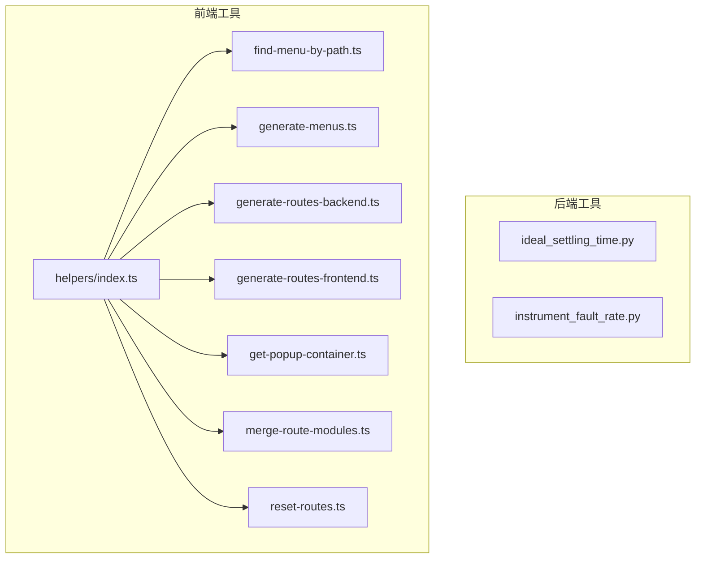
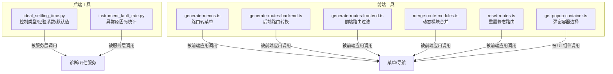
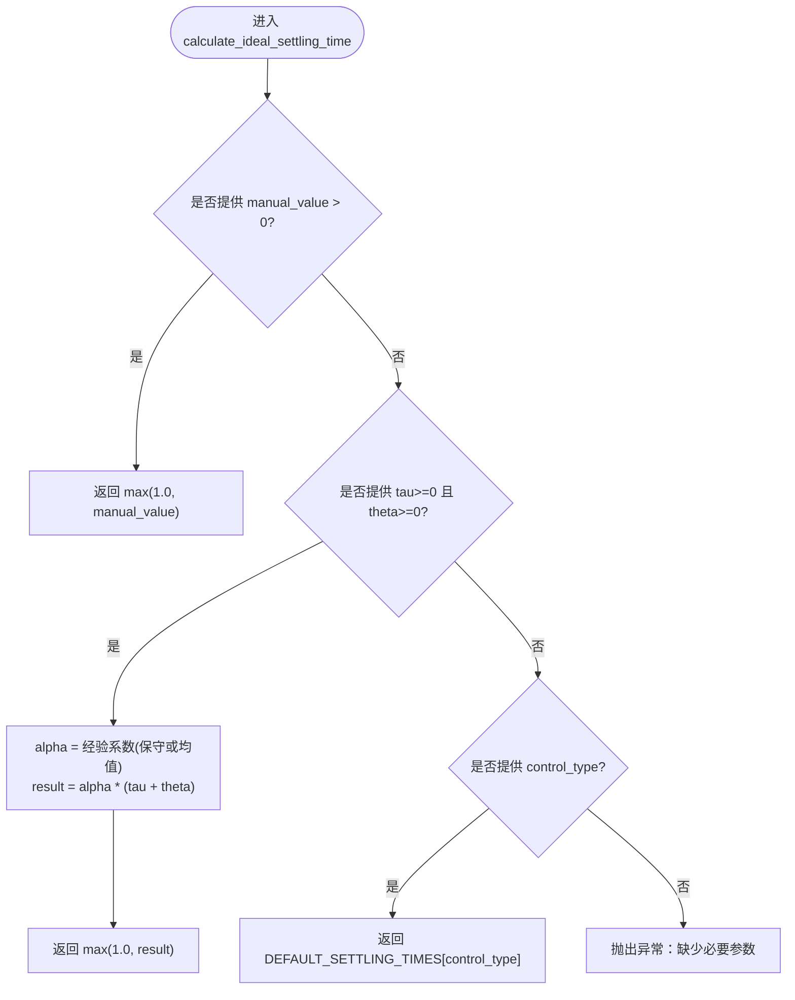
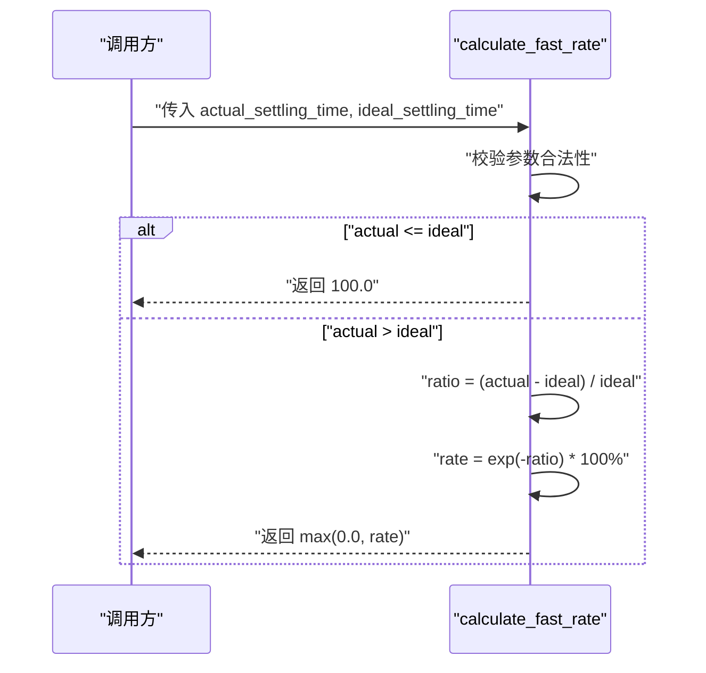
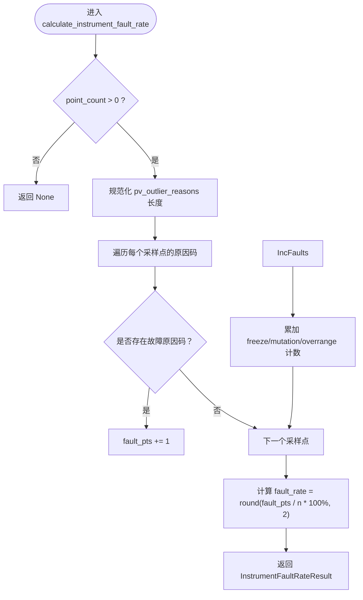
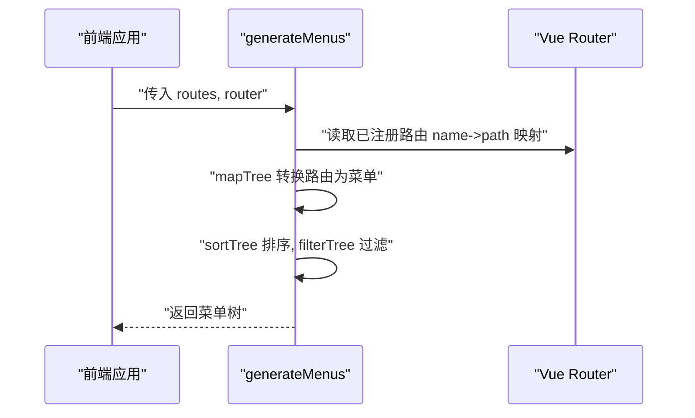
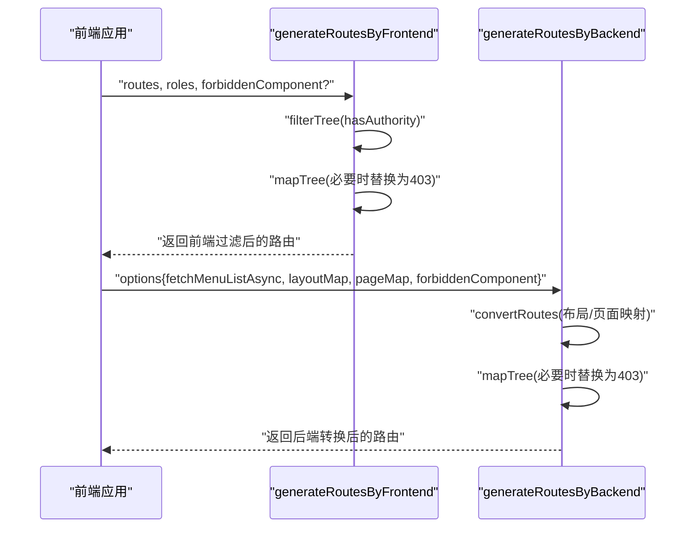
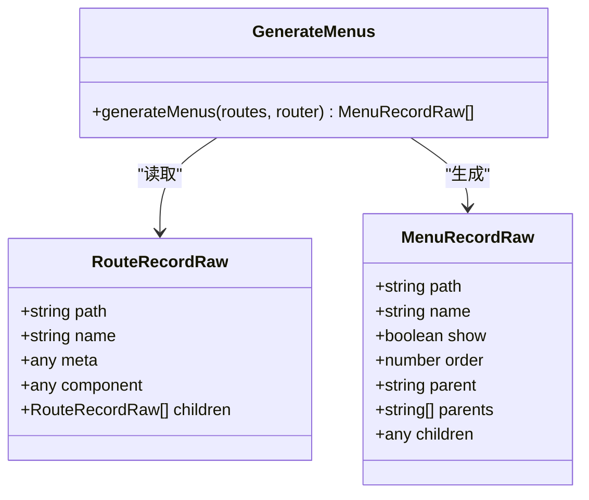
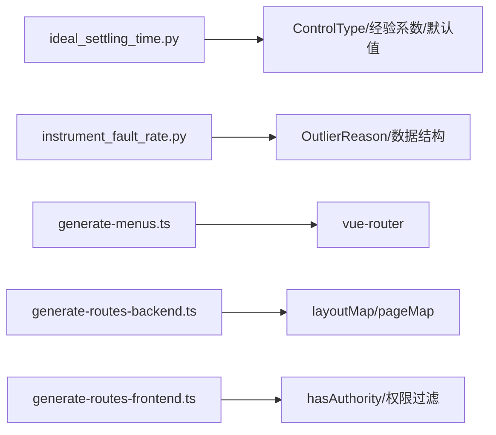

# 工具函数库 (utils)

<cite>
**本文引用的文件**
- [backend/app/utils/ideal_settling_time.py](file://backend/app/utils/ideal_settling_time.py)
- [backend/app/utils/instrument_fault_rate.py](file://backend/app/utils/instrument_fault_rate.py)
- [frontend/packages/utils/src/index.ts](file://frontend/packages/utils/src/index.ts)
- [frontend/packages/utils/package.json](file://frontend/packages/utils/package.json)
- [frontend/packages/utils/src/helpers/index.ts](file://frontend/packages/utils/src/helpers/index.ts)
- [frontend/packages/utils/src/helpers/find-menu-by-path.ts](file://frontend/packages/utils/src/helpers/find-menu-by-path.ts)
- [frontend/packages/utils/src/helpers/generate-menus.ts](file://frontend/packages/utils/src/helpers/generate-menus.ts)
- [frontend/packages/utils/src/helpers/generate-routes-backend.ts](file://frontend/packages/utils/src/helpers/generate-routes-backend.ts)
- [frontend/packages/utils/src/helpers/generate-routes-frontend.ts](file://frontend/packages/utils/src/helpers/generate-routes-frontend.ts)
- [frontend/packages/utils/src/helpers/get-popup-container.ts](file://frontend/packages/utils/src/helpers/get-popup-container.ts)
- [frontend/packages/utils/src/helpers/merge-route-modules.ts](file://frontend/packages/utils/src/helpers/merge-route-modules.ts)
- [frontend/packages/utils/src/helpers/reset-routes.ts](file://frontend/packages/utils/src/helpers/reset-routes.ts)
</cite>

## 目录
1. [简介](#简介)
2. [项目结构](#项目结构)
3. [核心组件](#核心组件)
4. [架构总览](#架构总览)
5. [详细组件分析](#详细组件分析)
6. [依赖关系分析](#依赖关系分析)
7. [性能考虑](#性能考虑)
8. [故障排查指南](#故障排查指南)
9. [结论](#结论)
10. [附录](#附录)

## 简介
本文件为 CLPM-MVP 仓库中的“工具函数库（utils）”提供系统化文档，覆盖后端 Python 工具与前端 Node.js/浏览器端工具两类：
- 后端 utils：聚焦工业控制领域的数据处理与指标计算，包括理想稳态时间计算、仪表故障率统计等。
- 前端 utils：聚焦菜单与路由生成、权限过滤、动态模块合并、弹窗容器选择等通用能力。

目标读者既包括需要快速上手的业务开发者，也包括希望深入理解实现细节的维护者。

## 项目结构
本项目在两个平台提供了独立的工具包：
- 后端 Python 工具位于 backend/app/utils，包含面向过程控制算法的工具函数。
- 前端 TypeScript 工具位于 frontend/packages/utils，通过 helpers 子模块组织菜单与路由相关能力，并通过 index.ts 统一导出。

**图表来源**
- [frontend/packages/utils/src/helpers/index.ts:1-9](file://frontend/packages/utils/src/helpers/index.ts#L1-L9)

**章节来源**
- [backend/app/utils/ideal_settling_time.py:1-293](file://backend/app/utils/ideal_settling_time.py#L1-L293)
- [backend/app/utils/instrument_fault_rate.py:1-146](file://backend/app/utils/instrument_fault_rate.py#L1-L146)
- [frontend/packages/utils/src/helpers/index.ts:1-9](file://frontend/packages/utils/src/helpers/index.ts#L1-L9)

## 核心组件
本节概述各工具函数的职责与使用场景：
- 理想稳态时间计算：根据 GB/T 44693.2-2024 规范，支持手动配置、模型参数计算与默认值三种优先级策略，并提供快速率计算。
- 仪表故障率计算：基于预处理阶段的异常原因码，统计三类仪表故障占比并输出结构化结果。
- 前端菜单与路由工具：从路由配置生成菜单、按角色过滤路由、将后端返回的路由转换为可渲染的前端路由、合并动态路由模块、重置静态路由、获取弹窗容器等。

**章节来源**
- [backend/app/utils/ideal_settling_time.py:1-293](file://backend/app/utils/ideal_settling_time.py#L1-L293)
- [backend/app/utils/instrument_fault_rate.py:1-146](file://backend/app/utils/instrument_fault_rate.py#L1-L146)
- [frontend/packages/utils/src/helpers/generate-menus.ts:1-93](file://frontend/packages/utils/src/helpers/generate-menus.ts#L1-L93)
- [frontend/packages/utils/src/helpers/generate-routes-backend.ts:1-109](file://frontend/packages/utils/src/helpers/generate-routes-backend.ts#L1-L109)
- [frontend/packages/utils/src/helpers/generate-routes-frontend.ts:1-59](file://frontend/packages/utils/src/helpers/generate-routes-frontend.ts#L1-L59)
- [frontend/packages/utils/src/helpers/merge-route-modules.ts:1-29](file://frontend/packages/utils/src/helpers/merge-route-modules.ts#L1-L29)
- [frontend/packages/utils/src/helpers/reset-routes.ts:1-32](file://frontend/packages/utils/src/helpers/reset-routes.ts#L1-L32)
- [frontend/packages/utils/src/helpers/get-popup-container.ts:1-11](file://frontend/packages/utils/src/helpers/get-popup-container.ts#L1-L11)

## 架构总览
后端工具以纯函数为主，输入数据与配置，输出指标或中间结果；前端工具围绕 Vue Router 生态，提供菜单与路由的生成、转换与权限控制能力。两者均强调低耦合与高内聚，便于在不同模块中复用。

**图表来源**
- [backend/app/utils/ideal_settling_time.py:1-293](file://backend/app/utils/ideal_settling_time.py#L1-L293)
- [backend/app/utils/instrument_fault_rate.py:1-146](file://backend/app/utils/instrument_fault_rate.py#L1-L146)
- [frontend/packages/utils/src/helpers/generate-menus.ts:1-93](file://frontend/packages/utils/src/helpers/generate-menus.ts#L1-L93)
- [frontend/packages/utils/src/helpers/generate-routes-backend.ts:1-109](file://frontend/packages/utils/src/helpers/generate-routes-backend.ts#L1-L109)
- [frontend/packages/utils/src/helpers/generate-routes-frontend.ts:1-59](file://frontend/packages/utils/src/helpers/generate-routes-frontend.ts#L1-L59)
- [frontend/packages/utils/src/helpers/merge-route-modules.ts:1-29](file://frontend/packages/utils/src/helpers/merge-route-modules.ts#L1-L29)
- [frontend/packages/utils/src/helpers/reset-routes.ts:1-32](file://frontend/packages/utils/src/helpers/reset-routes.ts#L1-L32)
- [frontend/packages/utils/src/helpers/get-popup-container.ts:1-11](file://frontend/packages/utils/src/helpers/get-popup-container.ts#L1-L11)

## 详细组件分析

### 后端：理想稳态时间与快速率计算
- 控制类型枚举与经验系数：定义流量、压力、温度、液位、成分等类型的经验系数范围，用于模型参数计算。
- 理想稳态时间计算：
  - 优先级：手动配置 > 模型参数计算（α·(τ+θ)）> 回路类型默认值。
  - 返回值最小值为 1.0 秒，避免零或负数导致后续计算异常。
  - 当无法确定时抛出异常，提示缺少必要参数。
- 快速率计算：
  - 当实际稳态时间小于等于理想稳态时间时，快速率为 100%。
  - 否则按指数衰减映射到 0~100% 区间。
  - 对非法输入进行校验并抛出异常。

**图表来源**
- [backend/app/utils/ideal_settling_time.py:67-136](file://backend/app/utils/ideal_settling_time.py#L67-L136)

**图表来源**
- [backend/app/utils/ideal_settling_time.py:241-293](file://backend/app/utils/ideal_settling_time.py#L241-L293)

**章节来源**
- [backend/app/utils/ideal_settling_time.py:18-50](file://backend/app/utils/ideal_settling_time.py#L18-L50)
- [backend/app/utils/ideal_settling_time.py:52-65](file://backend/app/utils/ideal_settling_time.py#L52-L65)
- [backend/app/utils/ideal_settling_time.py:67-136](file://backend/app/utils/ideal_settling_time.py#L67-L136)
- [backend/app/utils/ideal_settling_time.py:139-174](file://backend/app/utils/ideal_settling_time.py#L139-L174)
- [backend/app/utils/ideal_settling_time.py:176-219](file://backend/app/utils/ideal_settling_time.py#L176-L219)
- [backend/app/utils/ideal_settling_time.py:222-239](file://backend/app/utils/ideal_settling_time.py#L222-L239)
- [backend/app/utils/ideal_settling_time.py:241-293](file://backend/app/utils/ideal_settling_time.py#L241-L293)

### 后端：仪表故障率计算
- 故障原因码集合：仅统计超量程、信号冻结、信号突变三类。
- 计算逻辑：
  - 输入 PV 每个采样点的异常原因码列表与总采样点数。
  - 补齐或截断列表至 point_count。
  - 统计含故障原因码的采样点数量及各类故障计数。
  - 故障率 = 故障点数 / 总采样点数 × 100%，并四舍五入保留两位小数。
  - 当总采样点数不大于 0 时返回空结果，调用方可标记为不确定。

**图表来源**
- [backend/app/utils/instrument_fault_rate.py:61-138](file://backend/app/utils/instrument_fault_rate.py#L61-L138)

**章节来源**
- [backend/app/utils/instrument_fault_rate.py:1-20](file://backend/app/utils/instrument_fault_rate.py#L1-L20)
- [backend/app/utils/instrument_fault_rate.py:28-35](file://backend/app/utils/instrument_fault_rate.py#L28-L35)
- [backend/app/utils/instrument_fault_rate.py:38-59](file://backend/app/utils/instrument_fault_rate.py#L38-L59)
- [backend/app/utils/instrument_fault_rate.py:61-138](file://backend/app/utils/instrument_fault_rate.py#L61-L138)
- [backend/app/utils/instrument_fault_rate.py:141-145](file://backend/app/utils/instrument_fault_rate.py#L141-L145)

### 前端：菜单与路由工具
- 菜单生成：
  - 将路由树映射为菜单树，设置父子关系、显示状态、路径与查询参数。
  - 支持隐藏子菜单、排序与过滤隐藏项。
- 路由生成（前端方式）：
  - 根据用户角色过滤路由，支持“可见但禁止访问”的页面替换为 403 组件。
- 路由生成（后端方式）：
  - 将后端返回的路由结构转换为前端可渲染的路由，自动解析布局与页面组件映射。
  - 同样支持“可见但禁止访问”的页面替换。
- 动态路由模块合并：
  - 合并多个动态导入模块的默认路由数组。
- 重置静态路由：
  - 删除非白名单的动态路由，保留静态路由。
- 弹窗容器选择：
  - 优先返回表单元素，其次父节点，最后 body。

**图表来源**
- [frontend/packages/utils/src/helpers/generate-menus.ts:17-90](file://frontend/packages/utils/src/helpers/generate-menus.ts#L17-L90)

**图表来源**
- [frontend/packages/utils/src/helpers/generate-routes-frontend.ts:8-59](file://frontend/packages/utils/src/helpers/generate-routes-frontend.ts#L8-L59)
- [frontend/packages/utils/src/helpers/generate-routes-backend.ts:22-109](file://frontend/packages/utils/src/helpers/generate-routes-backend.ts#L22-L109)

**图表来源**
- [frontend/packages/utils/src/helpers/generate-menus.ts:17-90](file://frontend/packages/utils/src/helpers/generate-menus.ts#L17-L90)

**章节来源**
- [frontend/packages/utils/src/helpers/find-menu-by-path.ts:1-38](file://frontend/packages/utils/src/helpers/find-menu-by-path.ts#L1-L38)
- [frontend/packages/utils/src/helpers/generate-menus.ts:1-93](file://frontend/packages/utils/src/helpers/generate-menus.ts#L1-L93)
- [frontend/packages/utils/src/helpers/generate-routes-backend.ts:1-109](file://frontend/packages/utils/src/helpers/generate-routes-backend.ts#L1-L109)
- [frontend/packages/utils/src/helpers/generate-routes-frontend.ts:1-59](file://frontend/packages/utils/src/helpers/generate-routes-frontend.ts#L1-L59)
- [frontend/packages/utils/src/helpers/get-popup-container.ts:1-11](file://frontend/packages/utils/src/helpers/get-popup-container.ts#L1-L11)
- [frontend/packages/utils/src/helpers/merge-route-modules.ts:1-29](file://frontend/packages/utils/src/helpers/merge-route-modules.ts#L1-L29)
- [frontend/packages/utils/src/helpers/reset-routes.ts:1-32](file://frontend/packages/utils/src/helpers/reset-routes.ts#L1-L32)

## 依赖关系分析
- 后端依赖：
  - 理想稳态时间计算依赖控制类型枚举与经验系数表，以及默认稳态时间映射。
  - 仪表故障率计算依赖异常原因码枚举与数据结构。
- 前端依赖：
  - 菜单与路由工具依赖 Vue Router 类型与共享工具函数（如 mapTree、filterTree、sortTree）。
  - 后端路由转换依赖组件映射与视图路径规范化。

**图表来源**
- [backend/app/utils/ideal_settling_time.py:18-50](file://backend/app/utils/ideal_settling_time.py#L18-L50)
- [backend/app/utils/instrument_fault_rate.py:28-35](file://backend/app/utils/instrument_fault_rate.py#L28-L35)
- [frontend/packages/utils/src/helpers/generate-menus.ts:1-93](file://frontend/packages/utils/src/helpers/generate-menus.ts#L1-L93)
- [frontend/packages/utils/src/helpers/generate-routes-backend.ts:1-109](file://frontend/packages/utils/src/helpers/generate-routes-backend.ts#L1-L109)
- [frontend/packages/utils/src/helpers/generate-routes-frontend.ts:1-59](file://frontend/packages/utils/src/helpers/generate-routes-frontend.ts#L1-L59)

**章节来源**
- [frontend/packages/utils/package.json:1-28](file://frontend/packages/utils/package.json#L1-L28)
- [frontend/packages/utils/src/index.ts:1-5](file://frontend/packages/utils/src/index.ts#L1-L5)

## 性能考虑
- 理想稳态时间计算：
  - 计算复杂度 O(1)，主要开销在于参数校验与数学运算。
  - 建议缓存控制类型对应的经验系数与默认值，避免重复查找。
- 仪表故障率计算：
  - 时间复杂度 O(n)，n 为采样点数；空间复杂度 O(n) 用于规范化原因码列表。
  - 对于大数据集，建议在预处理阶段完成原因码归一化，减少重复处理。
- 前端菜单与路由生成：
  - 菜单生成涉及树形结构的映射、排序与过滤，复杂度近似 O(m)（m 为路由节点数）。
  - 建议按需加载与懒加载路由，减少初始渲染开销。
  - 动态路由模块合并应在构建期或初始化阶段执行，避免运行时频繁合并。

[本节为通用性能指导，不直接分析具体代码文件]

## 故障排查指南
- 理想稳态时间计算异常：
  - 现象：抛出异常提示缺少必要参数。
  - 排查：确认是否至少提供 manual_value、或同时提供 tau、theta 与 control_type、或仅提供 control_type。
  - 参考位置：[backend/app/utils/ideal_settling_time.py:132-136](file://backend/app/utils/ideal_settling_time.py#L132-L136)
- 快速率计算异常：
  - 现象：参数为负数或理想稳态时间为 0。
  - 排查：确保 actual_settling_time >= 0 且 ideal_settling_time > 0。
  - 参考位置：[backend/app/utils/ideal_settling_time.py:281-285](file://backend/app/utils/ideal_settling_time.py#L281-L285)
- 仪表故障率计算为空结果：
  - 现象：返回 None。
  - 排查：检查 point_count 是否大于 0；若为 0 或负数，调用方应标记结果为不确定。
  - 参考位置：[backend/app/utils/instrument_fault_rate.py:102-105](file://backend/app/utils/instrument_fault_rate.py#L102-L105)
- 前端路由生成问题：
  - 现象：路由未正确显示或被替换为 403。
  - 排查：检查 meta.authority 与 menuVisibleWithForbidden 配置；确认组件映射是否正确。
  - 参考位置：
    - [frontend/packages/utils/src/helpers/generate-routes-frontend.ts:36-55](file://frontend/packages/utils/src/helpers/generate-routes-frontend.ts#L36-L55)
    - [frontend/packages/utils/src/helpers/generate-routes-backend.ts:75-90](file://frontend/packages/utils/src/helpers/generate-routes-backend.ts#L75-L90)

**章节来源**
- [backend/app/utils/ideal_settling_time.py:132-136](file://backend/app/utils/ideal_settling_time.py#L132-L136)
- [backend/app/utils/ideal_settling_time.py:281-285](file://backend/app/utils/ideal_settling_time.py#L281-L285)
- [backend/app/utils/instrument_fault_rate.py:102-105](file://backend/app/utils/instrument_fault_rate.py#L102-L105)
- [frontend/packages/utils/src/helpers/generate-routes-frontend.ts:36-55](file://frontend/packages/utils/src/helpers/generate-routes-frontend.ts#L36-L55)
- [frontend/packages/utils/src/helpers/generate-routes-backend.ts:75-90](file://frontend/packages/utils/src/helpers/generate-routes-backend.ts#L75-L90)

## 结论
本工具函数库在后端与前端分别提供了稳定、可复用的能力：
- 后端工具聚焦工业控制领域的关键指标计算，具备明确的优先级策略与严格的参数校验。
- 前端工具围绕菜单与路由管理，提供灵活的生成、转换与权限控制机制。
在实际使用中，建议结合业务场景选择合适的工具函数，并注意参数合法性与性能优化。

[本节为总结性内容，不直接分析具体代码文件]

## 附录
- 使用示例（路径引用）：
  - 理想稳态时间计算示例：[backend/app/utils/ideal_settling_time.py:94-112](file://backend/app/utils/ideal_settling_time.py#L94-L112)
  - 快速率计算示例：[backend/app/utils/ideal_settling_time.py:260-279](file://backend/app/utils/ideal_settling_time.py#L260-L279)
  - 仪表故障率计算示例：[backend/app/utils/instrument_fault_rate.py:82-101](file://backend/app/utils/instrument_fault_rate.py#L82-L101)
  - 前端菜单生成与路由过滤：见上述“详细组件分析”中的序列图与流程图。

[本节为补充信息，不直接分析具体代码文件]