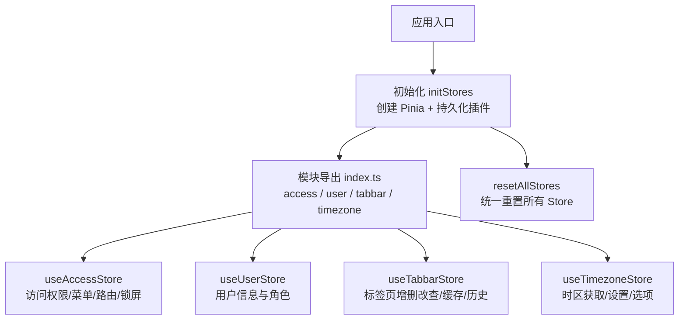
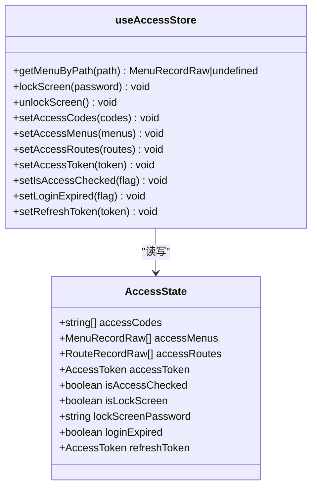
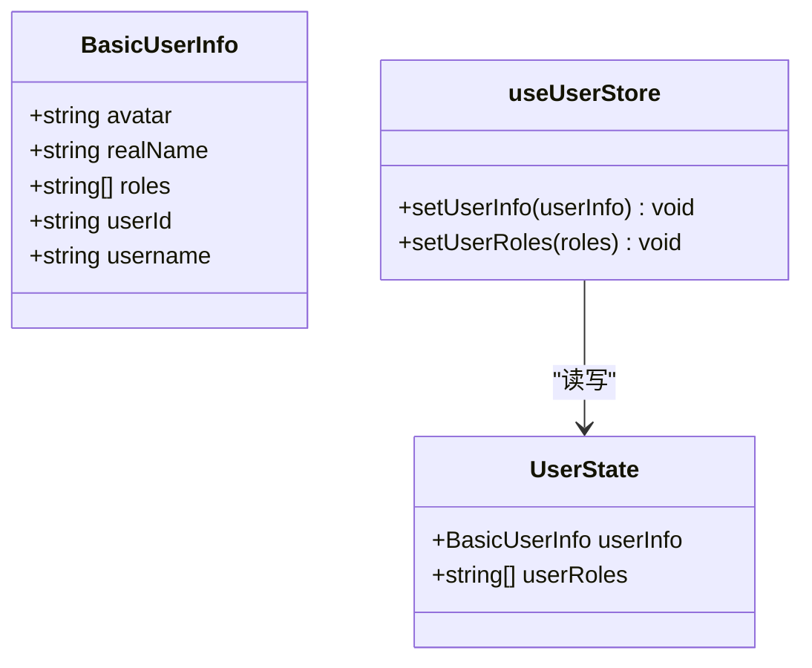
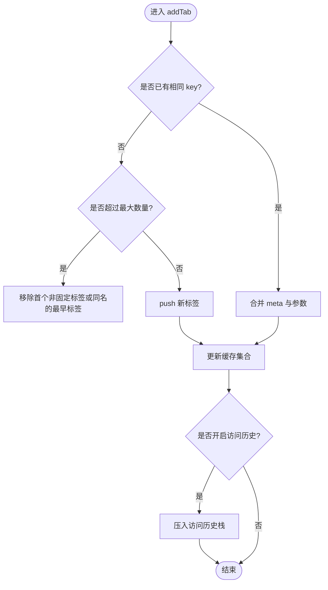
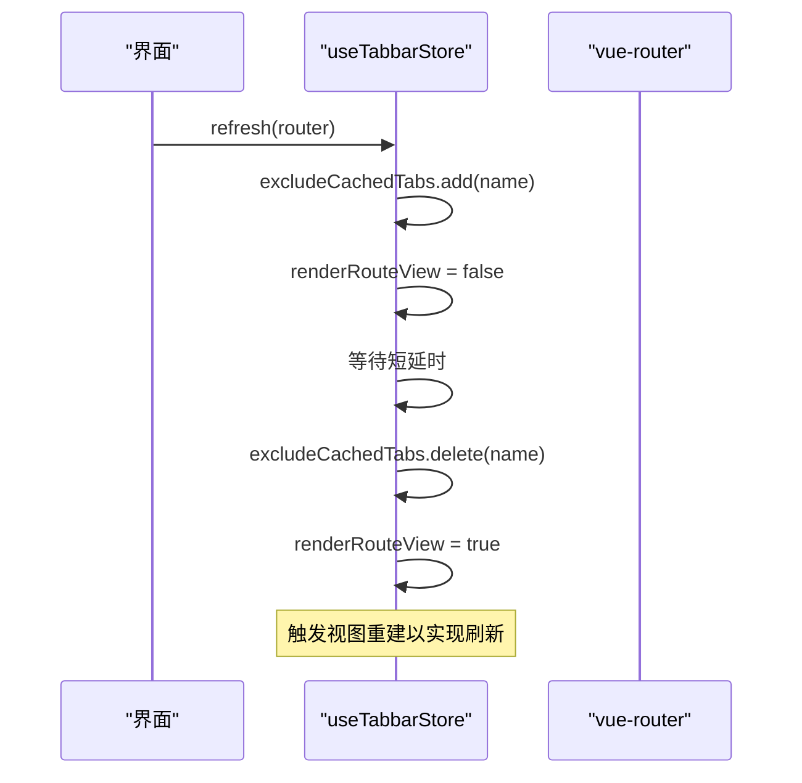
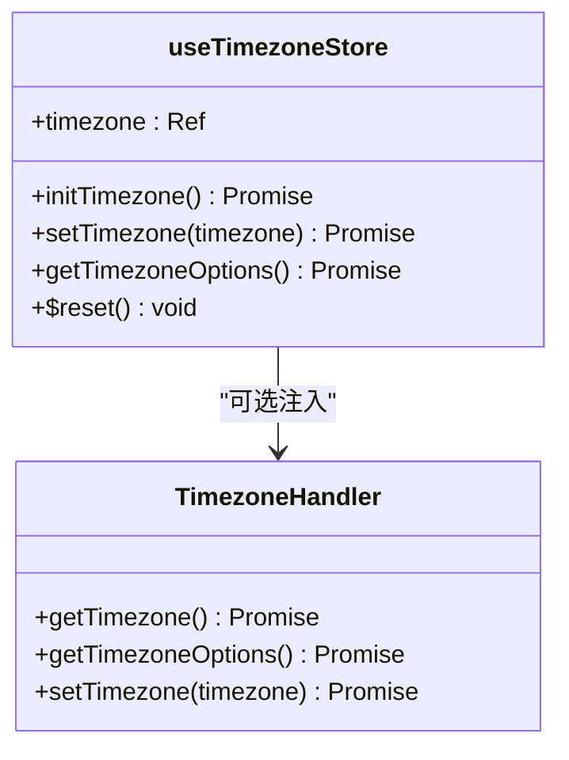
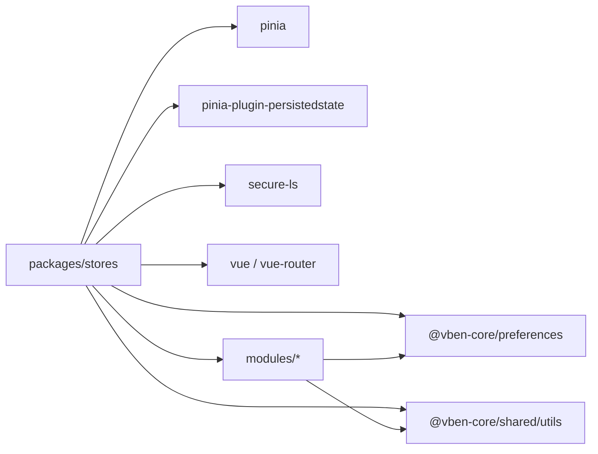

# 状态管理包 (stores)

<cite>
**本文引用的文件**
- [package.json](file://frontend/packages/stores/package.json)
- [src/index.ts](file://frontend/packages/stores/src/index.ts)
- [src/setup.ts](file://frontend/packages/stores/src/setup.ts)
- [src/modules/index.ts](file://frontend/packages/stores/src/modules/index.ts)
- [src/modules/access.ts](file://frontend/packages/stores/src/modules/access.ts)
- [src/modules/user.ts](file://frontend/packages/stores/src/modules/user.ts)
- [src/modules/tabbar.ts](file://frontend/packages/stores/src/modules/tabbar.ts)
- [src/modules/timezone.ts](file://frontend/packages/stores/src/modules/timezone.ts)
- [src/modules/access.test.ts](file://frontend/packages/stores/src/modules/access.test.ts)
- [src/modules/user.test.ts](file://frontend/packages/stores/src/modules/user.test.ts)
- [src/modules/tabbar.test.ts](file://frontend/packages/stores/src/modules/tabbar.test.ts)
</cite>

## 目录
1. [简介](#简介)
2. [项目结构](#项目结构)
3. [核心组件](#核心组件)
4. [架构总览](#架构总览)
5. [详细组件分析](#详细组件分析)
6. [依赖关系分析](#依赖关系分析)
7. [性能考量](#性能考量)
8. [故障排查指南](#故障排查指南)
9. [结论](#结论)
10. [附录](#附录)

## 简介
本仓库的 stores 包基于 Pinia 提供前端全局状态管理能力，采用模块化设计组织业务域状态（访问权限、用户信息、标签页、时区），并通过 pinia-plugin-persistedstate 与 secure-ls 实现安全的持久化策略。包内同时提供初始化入口与重置能力，便于在应用启动时装配并在需要时统一复位状态。测试覆盖主要 Store 的核心行为，确保状态变更的可验证性与稳定性。

## 项目结构
stores 包以“模块即 Store”的方式组织代码：
- 根导出：统一暴露 defineStore、storeToRefs 以及模块与初始化方法
- 初始化：创建 Pinia 实例并挂载持久化插件，支持多应用命名空间隔离
- 模块：按业务域拆分 Store，每个 Store 包含 state、actions、getters 与可选的 persist 配置
- 测试：针对各 Store 的行为进行单元测试



图表来源
- [src/setup.ts:42-69](file://frontend/packages/stores/src/setup.ts#L42-L69)
- [src/modules/index.ts:1-4](file://frontend/packages/stores/src/modules/index.ts#L1-L4)

章节来源
- [package.json:1-33](file://frontend/packages/stores/package.json#L1-L33)
- [src/index.ts:1-4](file://frontend/packages/stores/src/index.ts#L1-L4)
- [src/setup.ts:1-82](file://frontend/packages/stores/src/setup.ts#L1-L82)
- [src/modules/index.ts:1-5](file://frontend/packages/stores/src/modules/index.ts#L1-L5)

## 核心组件
- 初始化与持久化
  - 通过 createPinia 创建实例并使用 createPersistedState 插件
  - 开发环境使用 localStorage；生产环境使用 secure-ls（AES 加密、压缩）
  - 支持 namespace 前缀避免多应用冲突
  - 提供 resetAllStores 统一重置所有已注册 Store
- 模块 Store
  - access：管理访问令牌、刷新令牌、权限码、可访问菜单/路由、锁屏状态等
  - user：管理用户基本信息与角色列表
  - tabbar：管理标签页生命周期、固定标签、缓存、访问历史、排序与批量操作
  - timezone：管理当前时区、时区选项与默认时区设置，支持自定义处理器注入

章节来源
- [src/setup.ts:32-82](file://frontend/packages/stores/src/setup.ts#L32-L82)
- [src/modules/access.ts:9-123](file://frontend/packages/stores/src/modules/access.ts#L9-L123)
- [src/modules/user.ts:3-58](file://frontend/packages/stores/src/modules/user.ts#L3-L58)
- [src/modules/tabbar.ts:25-658](file://frontend/packages/stores/src/modules/tabbar.ts#L25-L658)
- [src/modules/timezone.ts:11-124](file://frontend/packages/stores/src/modules/timezone.ts#L11-L124)

## 架构总览
整体采用“单例 Pinia + 多 Store 模块”的架构：
- 应用启动时调用 initStores(app, options) 完成 Pinia 安装与持久化配置
- 业务模块按需引入对应 useXxxStore，通过 actions 更新 state
- 持久化策略按 Store 粒度控制，敏感字段使用安全存储
- 标签页 Store 与 vue-router 协作，维护页面导航与缓存一致性
- 时区 Store 通过可插拔处理器适配不同运行时环境

```mermaid
sequenceDiagram
participant App as "应用"
participant Setup as "initStores"
participant Pinia as "Pinia"
participant LS as "secure-ls/localStorage"
participant Stores as "各模块 Store"
App->>Setup : 传入 app 与 namespace
Setup->>Pinia : createPinia()
Setup->>LS : 构造安全存储(开发 : localStorage; 生产 : secure-ls)
Setup->>Pinia : use(createPersistedState({...}))
Setup-->>App : 返回 Pinia 实例
App->>Stores : 按需引入 useXxxStore
Stores->>LS : 读取/写入持久化数据(受 pick/storage 控制)
```

图表来源
- [src/setup.ts:42-69](file://frontend/packages/stores/src/setup.ts#L42-L69)
- [src/modules/access.ts:102-111](file://frontend/packages/stores/src/modules/access.ts#L102-L111)
- [src/modules/tabbar.ts:613-636](file://frontend/packages/stores/src/modules/tabbar.ts#L613-L636)
- [src/modules/timezone.ts:118-123](file://frontend/packages/stores/src/modules/timezone.ts#L118-L123)

## 详细组件分析

### 访问权限 Store（access）
职责
- 管理登录态（accessToken/refreshToken）、权限码、可访问菜单与路由、锁屏状态与过期标记
- 提供设置与查询方法，便于鉴权流程与界面渲染

关键设计
- 仅对必要字段启用持久化（令牌、权限码、锁屏相关）
- 提供根据路径查找菜单的方法，简化权限到菜单映射
- 支持锁屏/解锁流程的状态切换



图表来源
- [src/modules/access.ts:9-46](file://frontend/packages/stores/src/modules/access.ts#L9-L46)
- [src/modules/access.ts:51-123](file://frontend/packages/stores/src/modules/access.ts#L51-L123)

章节来源
- [src/modules/access.ts:9-123](file://frontend/packages/stores/src/modules/access.ts#L9-L123)
- [src/modules/access.test.ts:1-47](file://frontend/packages/stores/src/modules/access.test.ts#L1-L47)

### 用户信息 Store（user）
职责
- 管理用户基本信息与角色列表
- 提供设置用户信息与角色的动作

关键设计
- setUserInfo 会同步更新用户角色，保持数据一致性
- 轻量且无持久化，适合会话级用户上下文



图表来源
- [src/modules/user.ts:3-36](file://frontend/packages/stores/src/modules/user.ts#L3-L36)
- [src/modules/user.ts:41-58](file://frontend/packages/stores/src/modules/user.ts#L41-L58)

章节来源
- [src/modules/user.ts:3-65](file://frontend/packages/stores/src/modules/user.ts#L3-L65)
- [src/modules/user.test.ts:1-38](file://frontend/packages/stores/src/modules/user.test.ts#L1-L38)

### 标签页 Store（tabbar）
职责
- 管理标签页的添加、关闭、固定、排序、批量操作
- 维护标签页缓存集合与路由视图渲染开关
- 维护访问历史栈，支持前进后退跳转
- 将标签页与 vue-router 联动，保证导航与状态一致

关键设计
- 支持最大打开数限制与动态路由打开数限制
- 固定标签与普通标签分离展示与排序
- 通过 sessionStorage 持久化 tabs 与 visitHistory，并对 Stack 实例进行序列化/反序列化恢复
- 提供刷新机制，通过排除缓存与短暂禁用视图触发重新渲染



图表来源
- [src/modules/tabbar.ts:132-197](file://frontend/packages/stores/src/modules/tabbar.ts#L132-L197)
- [src/modules/tabbar.ts:546-565](file://frontend/packages/stores/src/modules/tabbar.ts#L546-L565)
- [src/modules/tabbar.ts:613-636](file://frontend/packages/stores/src/modules/tabbar.ts#L613-L636)



图表来源
- [src/modules/tabbar.ts:404-423](file://frontend/packages/stores/src/modules/tabbar.ts#L404-L423)

章节来源
- [src/modules/tabbar.ts:25-658](file://frontend/packages/stores/src/modules/tabbar.ts#L25-L658)
- [src/modules/tabbar.test.ts:1-301](file://frontend/packages/stores/src/modules/tabbar.test.ts#L1-L301)

### 时区 Store（timezone）
职责
- 管理当前时区与可用时区选项
- 支持自定义时区处理器注入，便于在不同环境中扩展
- 初始化时自动设置系统默认时区

关键设计
- 通过 ref 维护响应式时区值
- 提供 $reset 恢复默认时区
- 持久化当前时区，跨会话保持一致



图表来源
- [src/modules/timezone.ts:11-57](file://frontend/packages/stores/src/modules/timezone.ts#L11-L57)
- [src/modules/timezone.ts:62-124](file://frontend/packages/stores/src/modules/timezone.ts#L62-L124)

章节来源
- [src/modules/timezone.ts:1-133](file://frontend/packages/stores/src/modules/timezone.ts#L1-L133)

## 依赖关系分析
- 运行时依赖
  - pinia：状态管理核心
  - pinia-plugin-persistedstate：持久化插件
  - secure-ls：生产环境安全本地存储
  - vue / vue-router：框架与路由集成
  - @vben-core/preferences / shared：偏好与工具函数
- 内部依赖
  - modules/index.ts 聚合导出各 Store
  - setup.ts 负责 Pinia 初始化与插件装配
  - 各 Store 通过 preferences 与共享工具进行交互



图表来源
- [package.json:22-31](file://frontend/packages/stores/package.json#L22-L31)
- [src/setup.ts:42-69](file://frontend/packages/stores/src/setup.ts#L42-L69)
- [src/modules/tabbar.ts:14-21](file://frontend/packages/stores/src/modules/tabbar.ts#L14-L21)
- [src/modules/timezone.ts:3-7](file://frontend/packages/stores/src/modules/timezone.ts#L3-L7)

章节来源
- [package.json:1-33](file://frontend/packages/stores/package.json#L1-L33)
- [src/setup.ts:1-82](file://frontend/packages/stores/src/setup.ts#L1-L82)

## 性能考量
- 持久化范围最小化
  - 仅在必要时使用 persist.pick，避免不必要的数据落盘
  - 大对象（如标签页缓存 Map/Set）不直接持久化，仅持久化必要键集合
- 标签页缓存优化
  - 使用 Set/Map 管理缓存集合，减少重复计算
  - 通过 excludeCachedTabs 与 renderRouteView 控制视图重建时机，降低重渲染开销
- 访问历史栈限制
  - 使用带最大容量的栈结构，防止无限增长导致内存压力
- 热更新支持
  - 各 Store 均启用 acceptHMRUpdate，提升开发体验与迭代效率

[本节为通用性能建议，不直接分析具体文件]

## 故障排查指南
- 未安装 Pinia
  - 现象：调用 resetAllStores 时报错提示未安装
  - 处理：确保在应用启动阶段调用 initStores 并完成 app.use(pinia)
- 持久化失败
  - 现象：刷新后状态丢失或异常
  - 处理：检查环境变量 VITE_APP_STORE_SECURE_KEY 是否配置；确认生产环境 storage 代理是否正确指向 secure-ls
- 标签页无法关闭或跳转异常
  - 现象：关闭最后一个标签页报错或跳转不到预期
  - 处理：确保至少保留一个标签页；检查 closeTab 逻辑中的历史栈与默认标签跳转分支
- 时区初始化失败
  - 现象：控制台输出初始化错误
  - 处理：检查自定义时区处理器是否提供 getTimezone/getTimezoneOptions；确认 setCurrentTimezone 调用成功

章节来源
- [src/setup.ts:72-82](file://frontend/packages/stores/src/setup.ts#L72-L82)
- [src/modules/tabbar.ts:283-339](file://frontend/packages/stores/src/modules/tabbar.ts#L283-L339)
- [src/modules/timezone.ts:103-105](file://frontend/packages/stores/src/modules/timezone.ts#L103-L105)

## 结论
该 stores 包以 Pinia 为核心，结合持久化插件与安全存储，提供了稳定、可扩展的前端状态管理方案。通过模块化组织，清晰划分了访问权限、用户信息、标签页与时区等职责域；配合完善的测试覆盖，保障了状态变更的正确性。在生产环境中，通过命名空间隔离与安全存储策略，兼顾了多应用兼容性与数据安全。对于复杂场景，可通过注入自定义处理器与扩展 Store 动作来持续演进。

## 附录
- 最佳实践
  - 状态更新：优先使用 actions 修改 state，避免直接赋值
  - 异步处理：在 actions 中发起请求并更新状态，必要时结合 loading/error 标志位
  - 调试：利用浏览器开发者工具查看 Pinia 状态树；必要时临时打印关键状态快照
  - 测试：使用 vitest + createPinia 搭建测试环境，断言 actions 前后状态变化
- 实际使用示例（路径引用）
  - 初始化与安装：[src/setup.ts:42-69](file://frontend/packages/stores/src/setup.ts#L42-L69)
  - 访问权限设置：[src/modules/access.ts:76-96](file://frontend/packages/stores/src/modules/access.ts#L76-L96)
  - 用户信息设置：[src/modules/user.ts:43-52](file://frontend/packages/stores/src/modules/user.ts#L43-L52)
  - 标签页添加与关闭：[src/modules/tabbar.ts:132-197](file://frontend/packages/stores/src/modules/tabbar.ts#L132-L197), [src/modules/tabbar.ts:283-339](file://frontend/packages/stores/src/modules/tabbar.ts#L283-L339)
  - 时区设置与选项：[src/modules/timezone.ts:86-101](file://frontend/packages/stores/src/modules/timezone.ts#L86-L101)
- 测试参考（路径引用）
  - 访问权限 Store 测试：[src/modules/access.test.ts:1-47](file://frontend/packages/stores/src/modules/access.test.ts#L1-L47)
  - 用户 Store 测试：[src/modules/user.test.ts:1-38](file://frontend/packages/stores/src/modules/user.test.ts#L1-L38)
  - 标签页 Store 测试：[src/modules/tabbar.test.ts:1-301](file://frontend/packages/stores/src/modules/tabbar.test.ts#L1-L301)