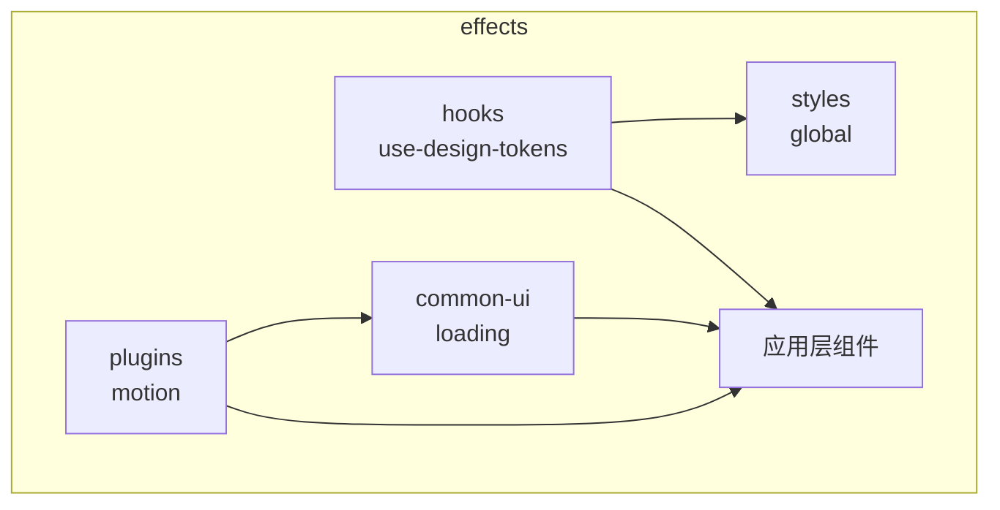
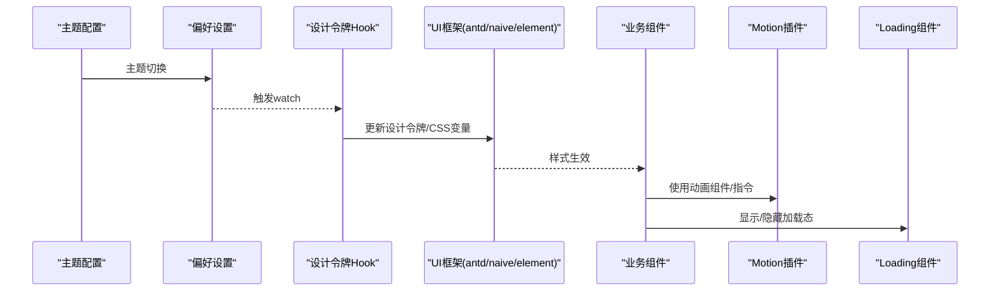
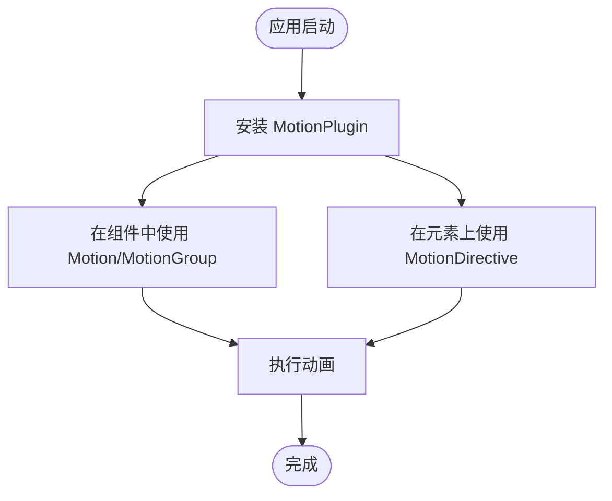
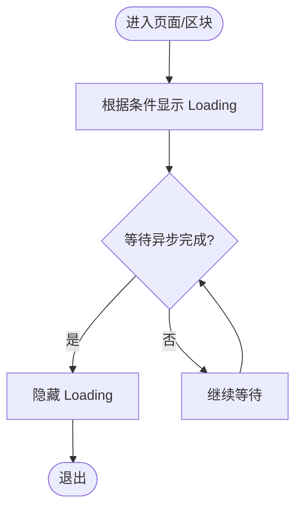
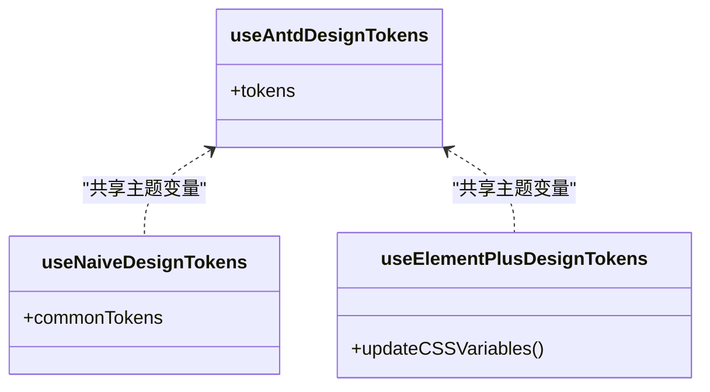
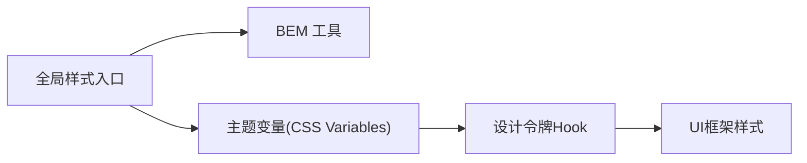
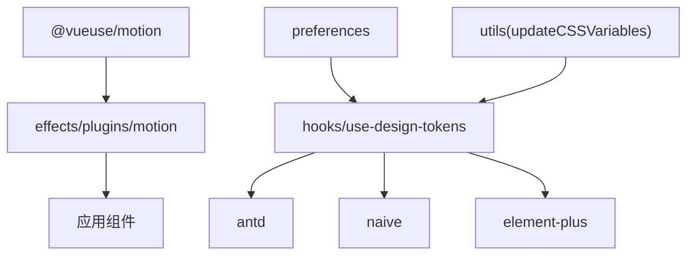

# 视觉效果包 (effects)

<cite>
**本文引用的文件**
- [frontend/packages/effects/README.md](file://frontend/packages/effects/README.md)
- [frontend/packages/effects/plugins/src/motion/README.md](file://frontend/packages/effects/plugins/src/motion/README.md)
- [frontend/packages/effects/plugins/src/motion/index.ts](file://frontend/packages/effects/plugins/src/motion/index.ts)
- [frontend/packages/effects/common-ui/src/components/loading/loading.vue](file://frontend/packages/effects/common-ui/src/components/loading/loading.vue)
- [frontend/packages/effects/hooks/src/use-design-tokens.ts](file://frontend/packages/effects/hooks/src/use-design-tokens.ts)
- [frontend/packages/styles/src/global/index.scss](file://frontend/packages/styles/src/global/index.scss)
</cite>

## 目录
1. [简介](#简介)
2. [项目结构](#项目结构)
3. [核心组件](#核心组件)
4. [架构总览](#架构总览)
5. [详细组件分析](#详细组件分析)
6. [依赖关系分析](#依赖关系分析)
7. [性能考虑](#性能考虑)
8. [故障排查指南](#故障排查指南)
9. [结论](#结论)
10. [附录：使用与定制示例](#附录使用与定制示例)

## 简介
本文件为“视觉效果包（effects）”的完整技术文档，聚焦于动画效果、过渡动画、视觉反馈等前端特效能力的实现与使用方法。内容涵盖：
- 动画插件 Motion 的导出与集成方式
- 通用加载反馈组件 Loading 的使用与扩展点
- 主题系统与多 UI 框架设计令牌（Design Tokens）同步机制
- CSS 样式包的组织与全局样式入口
- 自定义与扩展视觉效果的最佳实践
- 性能优化策略与常见问题排查

## 项目结构
effects 包采用按能力划分的子包组织方式，便于复用与维护：
- plugins：提供可插拔的插件能力，如基于 @vueuse/motion 的动画插件
- common-ui：通用 UI 组件，如 Loading、Captcha、Page 等
- hooks：跨组件复用的组合式函数，如设计令牌同步 Hook
- layouts：布局相关能力（非本次重点）
- access/request 等：其他副作用或请求能力（非本次重点）

图表来源
- [frontend/packages/effects/plugins/src/motion/index.ts:1-9](file://frontend/packages/effects/plugins/src/motion/index.ts#L1-L9)
- [frontend/packages/effects/common-ui/src/components/loading/loading.vue:1-40](file://frontend/packages/effects/common-ui/src/components/loading/loading.vue#L1-L40)
- [frontend/packages/effects/hooks/src/use-design-tokens.ts:1-322](file://frontend/packages/effects/hooks/src/use-design-tokens.ts#L1-L322)
- [frontend/packages/styles/src/global/index.scss:1-2](file://frontend/packages/styles/src/global/index.scss#L1-L2)

章节来源
- [frontend/packages/effects/README.md:1-11](file://frontend/packages/effects/README.md#L1-L11)

## 核心组件
- 动画插件 Motion
  - 导出 Motion、MotionGroup、MotionDirective、MotionPlugin
  - 基于 @vueuse/motion，提供声明式动画与指令式动画能力
  - 通过 Vue 插件形式统一注册，便于在任意组件中使用
- 加载反馈 Loading
  - 封装 VbenLoading，支持最小加载时间、旋转状态、文案、图标插槽
  - 用于页面/区块级加载态展示，保证交互一致性
- 设计令牌同步 Hooks
  - useAntdDesignTokens / useNaiveDesignTokens / useElementPlusDesignTokens
  - 监听主题变化，将全局 CSS 变量映射到各 UI 框架的设计令牌，确保主题一致性与响应式更新

章节来源
- [frontend/packages/effects/plugins/src/motion/README.md:1-27](file://frontend/packages/effects/plugins/src/motion/README.md#L1-L27)
- [frontend/packages/effects/plugins/src/motion/index.ts:1-9](file://frontend/packages/effects/plugins/src/motion/index.ts#L1-L9)
- [frontend/packages/effects/common-ui/src/components/loading/loading.vue:1-40](file://frontend/packages/effects/common-ui/src/components/loading/loading.vue#L1-L40)
- [frontend/packages/effects/hooks/src/use-design-tokens.ts:1-322](file://frontend/packages/effects/hooks/src/use-design-tokens.ts#L1-L322)

## 架构总览
整体数据流与职责划分如下：
- 主题系统：preferences 驱动主题变更，触发设计令牌同步
- 设计令牌：将 CSS 变量转换为各 UI 框架所需的 token，并写入 CSS 变量或框架配置
- 动画与反馈：组件通过 Motion 与 Loading 提供一致的动效与反馈体验
- 样式入口：全局样式引入基础样式与 BEM 工具，保障命名空间与一致性

图表来源
- [frontend/packages/effects/hooks/src/use-design-tokens.ts:1-322](file://frontend/packages/effects/hooks/src/use-design-tokens.ts#L1-L322)
- [frontend/packages/effects/plugins/src/motion/index.ts:1-9](file://frontend/packages/effects/plugins/src/motion/index.ts#L1-L9)
- [frontend/packages/effects/common-ui/src/components/loading/loading.vue:1-40](file://frontend/packages/effects/common-ui/src/components/loading/loading.vue#L1-L40)

## 详细组件分析

### 动画插件 Motion
- 能力概览
  - 组件：Motion、MotionGroup
  - 指令：MotionDirective
  - 插件：MotionPlugin（统一安装）
- 使用要点
  - 在应用初始化时安装插件
  - 在模板中直接使用组件或指令进行入场/出场动画
  - 通过类型定义约束动画参数，提升可维护性

图表来源
- [frontend/packages/effects/plugins/src/motion/README.md:1-27](file://frontend/packages/effects/plugins/src/motion/README.md#L1-L27)
- [frontend/packages/effects/plugins/src/motion/index.ts:1-9](file://frontend/packages/effects/plugins/src/motion/index.ts#L1-L9)

章节来源
- [frontend/packages/effects/plugins/src/motion/README.md:1-27](file://frontend/packages/effects/plugins/src/motion/README.md#L1-L27)
- [frontend/packages/effects/plugins/src/motion/index.ts:1-9](file://frontend/packages/effects/plugins/src/motion/index.ts#L1-L9)

### 加载反馈 Loading
- 能力概览
  - 支持最小加载时间，避免闪烁
  - 支持 spinning 控制显隐
  - 支持 text 文案与 icon 插槽，满足多样化反馈场景
- 使用要点
  - 包裹需要展示加载态的内容区域
  - 结合异步操作，合理设置 minLoadingTime 提升体验
  - 通过插槽注入自定义图标或文案

图表来源
- [frontend/packages/effects/common-ui/src/components/loading/loading.vue:1-40](file://frontend/packages/effects/common-ui/src/components/loading/loading.vue#L1-L40)

章节来源
- [frontend/packages/effects/common-ui/src/components/loading/loading.vue:1-40](file://frontend/packages/effects/common-ui/src/components/loading/loading.vue#L1-L40)

### 设计令牌同步 Hooks
- 能力概览
  - 监听主题变化，读取根节点 CSS 变量
  - 将主题色、圆角、层级等映射到 antd、naive、element-plus 的设计令牌
  - 对 Element Plus 额外通过 updateCSSVariables 动态写入 CSS 变量
- 使用要点
  - 在应用或布局初始化时调用对应 Hook
  - 保持主题变量命名规范，确保映射正确
  - 注意暗黑模式下的颜色深浅适配

图表来源
- [frontend/packages/effects/hooks/src/use-design-tokens.ts:1-322](file://frontend/packages/effects/hooks/src/use-design-tokens.ts#L1-L322)

章节来源
- [frontend/packages/effects/hooks/src/use-design-tokens.ts:1-322](file://frontend/packages/effects/hooks/src/use-design-tokens.ts#L1-L322)

### 样式包结构与主题系统
- 全局样式入口
  - 引入 BEM 工具，统一命名空间与样式组织方式
- 主题系统
  - 通过 CSS 变量集中管理色彩、圆角、层级等
  - 由设计令牌 Hook 将主题变量映射到具体 UI 框架
- 响应式设计
  - 借助 CSS 变量与媒体查询，在不同断点下调整样式
  - 结合主题切换，实现明暗主题与品牌色的无缝切换

图表来源
- [frontend/packages/styles/src/global/index.scss:1-2](file://frontend/packages/styles/src/global/index.scss#L1-L2)
- [frontend/packages/effects/hooks/src/use-design-tokens.ts:1-322](file://frontend/packages/effects/hooks/src/use-design-tokens.ts#L1-L322)

章节来源
- [frontend/packages/styles/src/global/index.scss:1-2](file://frontend/packages/styles/src/global/index.scss#L1-L2)
- [frontend/packages/effects/hooks/src/use-design-tokens.ts:1-322](file://frontend/packages/effects/hooks/src/use-design-tokens.ts#L1-L322)

## 依赖关系分析
- 外部依赖
  - @vueuse/motion：提供动画能力
  - 各 UI 框架（antd、naive、element-plus）：通过设计令牌 Hook 同步主题
- 内部依赖
  - preferences：主题与用户偏好
  - utils：CSS 变量转换与更新工具
- 耦合与内聚
  - motion 插件与业务组件低耦合，仅暴露组件/指令/插件
  - Loading 组件封装底层加载器，提高复用性
  - 设计令牌 Hook 与主题系统高内聚，集中处理映射逻辑

图表来源
- [frontend/packages/effects/plugins/src/motion/index.ts:1-9](file://frontend/packages/effects/plugins/src/motion/index.ts#L1-L9)
- [frontend/packages/effects/hooks/src/use-design-tokens.ts:1-322](file://frontend/packages/effects/hooks/src/use-design-tokens.ts#L1-L322)

章节来源
- [frontend/packages/effects/plugins/src/motion/index.ts:1-9](file://frontend/packages/effects/plugins/src/motion/index.ts#L1-L9)
- [frontend/packages/effects/hooks/src/use-design-tokens.ts:1-322](file://frontend/packages/effects/hooks/src/use-design-tokens.ts#L1-L322)

## 性能考虑
- 动画性能
  - 优先使用 transform 与 opacity 等合成属性，减少重排重绘
  - 合理使用 MotionGroup 批量管理动画，降低重复计算
  - 避免在高频滚动或大数据渲染路径中执行复杂动画
- 加载反馈
  - 设置合理的 minLoadingTime，避免频繁闪烁导致用户体验下降
  - 仅在必要时显示 Loading，减少 DOM 更新频率
- 主题与样式
  - 通过 CSS 变量集中管理主题，减少运行时样式计算
  - 按需引入样式，避免全量导入带来的体积膨胀
- 资源与缓存
  - 对静态资源启用强缓存，减少网络开销
  - 对第三方库进行 Tree Shaking 与按需引入

[本节为通用指导，不直接分析具体文件]

## 故障排查指南
- 动画不生效
  - 检查是否已安装 MotionPlugin
  - 确认组件/指令是否正确引入并使用
  - 查看浏览器控制台是否有类型或运行时错误
- 主题未生效
  - 确认 preferences 是否正确初始化
  - 检查 CSS 变量是否被正确写入根节点
  - 验证设计令牌 Hook 是否被调用且监听到主题变化
- 加载态异常
  - 检查 spinning 状态是否与异步流程匹配
  - 确认 minLoadingTime 是否过短导致闪烁
  - 核对插槽与文案是否符合预期

章节来源
- [frontend/packages/effects/plugins/src/motion/README.md:1-27](file://frontend/packages/effects/plugins/src/motion/README.md#L1-L27)
- [frontend/packages/effects/common-ui/src/components/loading/loading.vue:1-40](file://frontend/packages/effects/common-ui/src/components/loading/loading.vue#L1-L40)
- [frontend/packages/effects/hooks/src/use-design-tokens.ts:1-322](file://frontend/packages/effects/hooks/src/use-design-tokens.ts#L1-L322)

## 结论
effects 包以插件化与 Hook 化的方式，将动画、加载反馈与主题系统解耦并标准化。通过统一的导出与接口，业务组件可以便捷地获得一致的视觉体验；通过设计令牌 Hook，主题在多 UI 框架间保持一致；通过全局样式入口与 BEM 工具，样式组织更加清晰。建议在实际项目中遵循本文档的用法与最佳实践，以获得稳定、可维护且高性能的视觉效果。

[本节为总结性内容，不直接分析具体文件]

## 附录：使用与定制示例
- 安装与使用动画插件
  - 在应用初始化时安装 MotionPlugin
  - 在组件中使用 Motion/MotionGroup 或 MotionDirective
  - 参考导出说明与类型定义，确保参数正确
- 使用加载反馈
  - 包裹需要展示加载态的区域
  - 设置 spinning、minLoadingTime、text 与 icon 插槽
- 定制主题与样式
  - 通过 CSS 变量定义主题色、圆角、层级等
  - 在设计令牌 Hook 中映射到目标 UI 框架
  - 在全局样式入口引入 BEM 工具，统一命名空间
- 扩展视觉效果
  - 新增动画变体：在 Motion 的参数中定义新的变体
  - 扩展 Loading：通过插槽与 props 扩展文案与图标
  - 扩展主题：在 CSS 变量中新增语义化颜色，并在 Hook 中映射

章节来源
- [frontend/packages/effects/plugins/src/motion/README.md:1-27](file://frontend/packages/effects/plugins/src/motion/README.md#L1-L27)
- [frontend/packages/effects/plugins/src/motion/index.ts:1-9](file://frontend/packages/effects/plugins/src/motion/index.ts#L1-L9)
- [frontend/packages/effects/common-ui/src/components/loading/loading.vue:1-40](file://frontend/packages/effects/common-ui/src/components/loading/loading.vue#L1-L40)
- [frontend/packages/effects/hooks/src/use-design-tokens.ts:1-322](file://frontend/packages/effects/hooks/src/use-design-tokens.ts#L1-L322)
- [frontend/packages/styles/src/global/index.scss:1-2](file://frontend/packages/styles/src/global/index.scss#L1-L2)