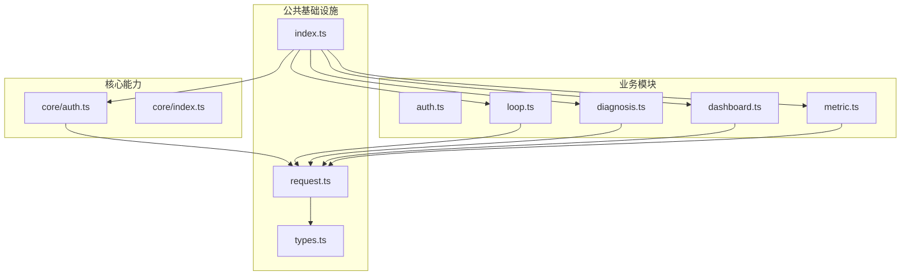
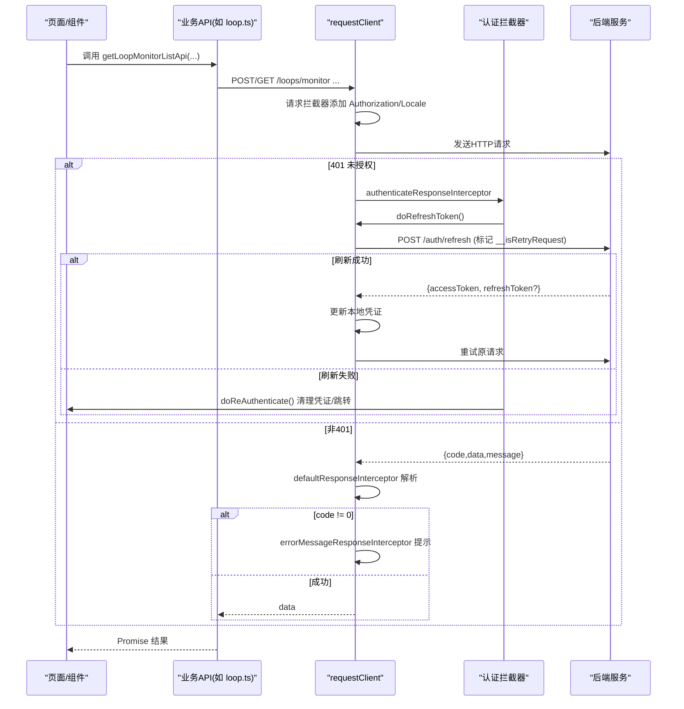
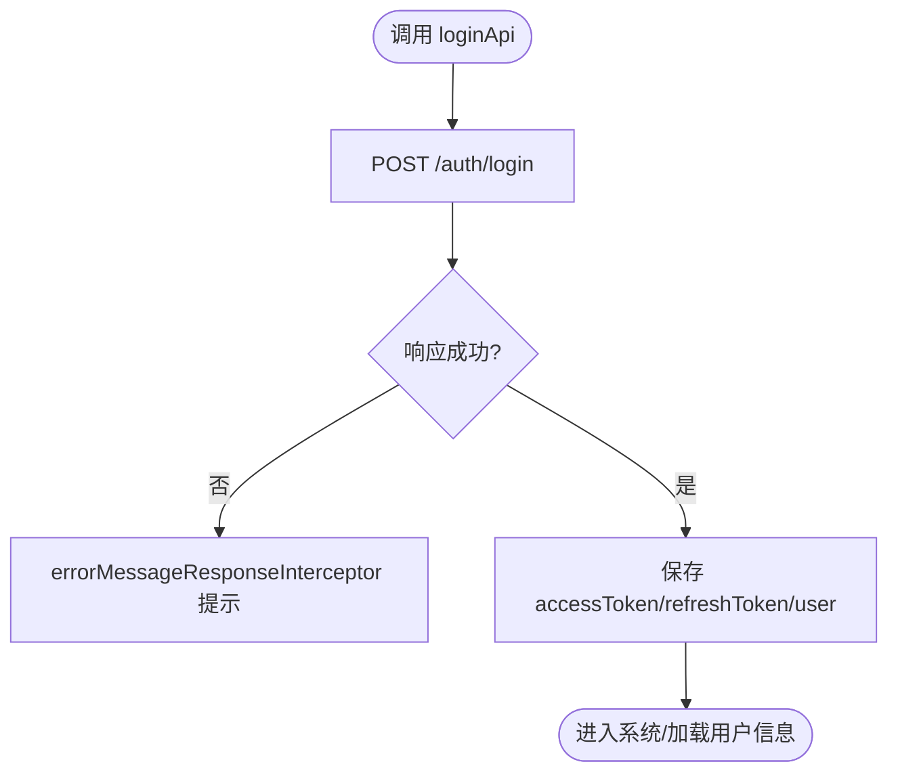
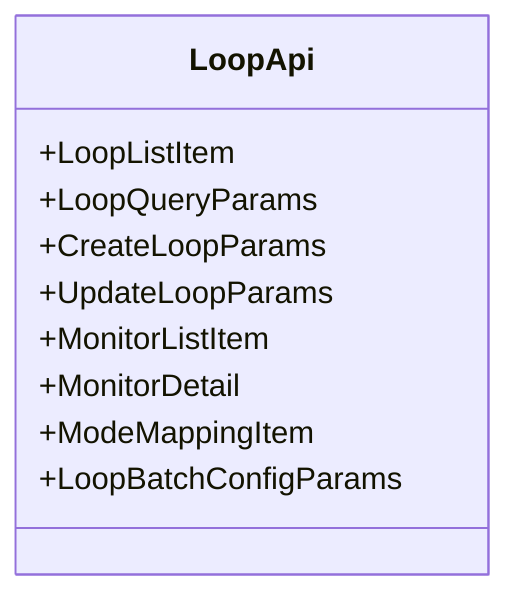
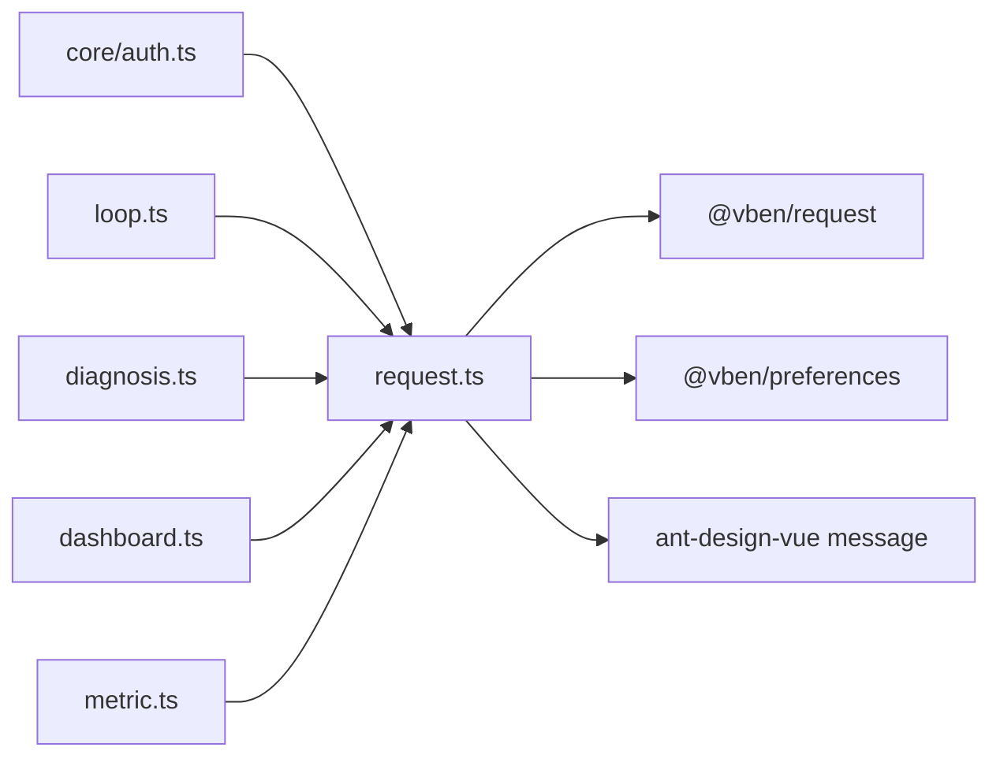

# API接口结构

<cite>
**本文引用的文件**
- [frontend/apps/web-antd/src/api/request.ts](file://frontend/apps/web-antd/src/api/request.ts)
- [frontend/apps/web-antd/src/api/types.ts](file://frontend/apps/web-antd/src/api/types.ts)
- [frontend/apps/web-antd/src/api/index.ts](file://frontend/apps/web-antd/src/api/index.ts)
- [frontend/apps/web-antd/src/api/core/auth.ts](file://frontend/apps/web-antd/src/api/core/auth.ts)
- [frontend/apps/web-antd/src/api/core/index.ts](file://frontend/apps/web-antd/src/api/core/index.ts)
- [frontend/apps/web-antd/src/api/auth.ts](file://frontend/apps/web-antd/src/api/auth.ts)
- [frontend/apps/web-antd/src/api/loop.ts](file://frontend/apps/web-antd/src/api/loop.ts)
- [frontend/apps/web-antd/src/api/diagnosis.ts](file://frontend/apps/web-antd/src/api/diagnosis.ts)
- [frontend/apps/web-antd/src/api/dashboard.ts](file://frontend/apps/web-antd/src/api/dashboard.ts)
- [frontend/apps/web-antd/src/api/metric.ts](file://frontend/apps/web-antd/src/api/metric.ts)
</cite>

## 目录
1. [简介](#简介)
2. [项目结构](#项目结构)
3. [核心组件](#核心组件)
4. [架构总览](#架构总览)
5. [详细组件分析](#详细组件分析)
6. [依赖关系分析](#依赖关系分析)
7. [性能与可靠性](#性能与可靠性)
8. [故障排查指南](#故障排查指南)
9. [结论](#结论)
10. [附录：最佳实践示例](#附录最佳实践示例)

## 简介
本文件面向前端开发者，系统化说明 CLPM 前端 API 模块的组织原则、封装模式与调用规范。重点覆盖以下方面：
- 业务模块划分：core（核心能力）、auth（认证扩展）、loop（回路管理）、diagnosis（诊断）、dashboard（工作台聚合）、metric（指标评估）等。
- 请求封装：统一的 RequestClient 实例、拦截器链、统一响应格式、错误处理策略。
- 类型管理：全局通用类型与模块内命名空间类型，保证前后端契约一致。
- 认证与刷新：Access Token/Refresh Token 流程、过期重试与防死锁设计。
- 异步调用最佳实践：Promise/async-await 使用、错误边界、幂等与重试策略建议。

## 项目结构
前端 API 位于 frontend/apps/web-antd/src/api 下，采用“按业务域拆分 + 公共基础设施集中”的组织方式：
- 公共基础设施
  - request.ts：创建并配置 HTTP 客户端、拦截器链、统一响应解析、错误提示、Token 刷新与重认证。
  - types.ts：全局通用类型（ApiResponse、PaginatedResponse、PageQuery 等）。
  - index.ts：统一导出各业务模块（排除 auth.ts 以避免与 core/auth 同名冲突）。
- 核心能力
  - core/index.ts：聚合 core 子模块导出。
  - core/auth.ts：登录、刷新、登出、当前用户、权限码、密码修改等核心认证接口及类型。
- 业务模块
  - auth.ts：业务侧对认证类型的再导出与角色常量映射（不重复暴露同名函数）。
  - loop.ts：回路台账、Tag 关联、监控详情与列表、投用定义、批量配置等。
  - diagnosis.ts：诊断运行记录、算子结果、证据图表、置信度定义等。
  - dashboard.ts：工作台聚合数据（KPI 卡片、低效回路、趋势摘要、待处理异常）。
  - metric.ts：指标配置、引擎规则、看板、排行、报表等。

图示来源
- [frontend/apps/web-antd/src/api/index.ts:1-14](file://frontend/apps/web-antd/src/api/index.ts#L1-L14)
- [frontend/apps/web-antd/src/api/request.ts:1-151](file://frontend/apps/web-antd/src/api/request.ts#L1-L151)
- [frontend/apps/web-antd/src/api/core/index.ts:1-4](file://frontend/apps/web-antd/src/api/core/index.ts#L1-L4)

章节来源
- [frontend/apps/web-antd/src/api/index.ts:1-14](file://frontend/apps/web-antd/src/api/index.ts#L1-L14)
- [frontend/apps/web-antd/src/api/request.ts:1-151](file://frontend/apps/web-antd/src/api/request.ts#L1-L151)
- [frontend/apps/web-antd/src/api/types.ts:1-51](file://frontend/apps/web-antd/src/api/types.ts#L1-L51)

## 核心组件
- 统一请求客户端（request.ts）
  - 基于 @vben/request 的 RequestClient，注入 baseURL、请求头（Authorization、Accept-Language）。
  - 响应拦截器链：
    - 默认响应解析：code === 0/"0" 视为成功，返回 data；否则抛出包含 code/message 的业务错误。
    - 认证拦截：401 时触发 Refresh Token 流程；若不可刷新则执行重新认证（清空本地凭证、跳转或弹窗）。
    - 错误提示：5xx 服务异常记录日志并提示；403 无权限提示；其他优先展示后端 message。
  - 提供两个客户端：
    - requestClient：带完整拦截器的业务客户端（responseReturn: 'data'）。
    - baseRequestClient：基础客户端（用于特殊场景）。
- 全局类型（types.ts）
  - ApiResponse<T>：统一响应 {code, message, data}。
  - PaginatedResponse<T>：分页响应 {items, total, page, pageSize}。
  - PageQuery：通用分页查询参数。
  - BizError：业务错误结构。
- 模块导出（index.ts）
  - 统一导出 core、dashboard、loop、metric、system、task、types。
  - 明确避免导出 ./auth 以避免与 core/auth 同名函数冲突。

章节来源
- [frontend/apps/web-antd/src/api/request.ts:24-151](file://frontend/apps/web-antd/src/api/request.ts#L24-L151)
- [frontend/apps/web-antd/src/api/types.ts:1-51](file://frontend/apps/web-antd/src/api/types.ts#L1-L51)
- [frontend/apps/web-antd/src/api/index.ts:1-14](file://frontend/apps/web-antd/src/api/index.ts#L1-L14)

## 架构总览
下图展示了从页面到后端的典型调用链路，包括认证、刷新、错误处理的拦截器协作。

图示来源
- [frontend/apps/web-antd/src/api/request.ts:78-141](file://frontend/apps/web-antd/src/api/request.ts#L78-L141)
- [frontend/apps/web-antd/src/api/core/auth.ts:85-136](file://frontend/apps/web-antd/src/api/core/auth.ts#L85-L136)

## 详细组件分析

### 认证模块（core/auth.ts 与 auth.ts）
- 职责
  - core/auth.ts：实现登录、刷新、登出、获取当前用户、修改密码等核心认证接口，并提供类型定义与用户信息映射工具。
  - auth.ts：业务侧类型再导出与角色常量映射（CLPM_ROLES、ROLE_DEFAULT_HOME、ROLE_LABELS），避免与 core/auth 同名函数冲突。
- 关键流程
  - 登录：POST /auth/login，返回 accessToken、refreshToken、user 等。
  - 刷新：POST /auth/refresh，支持传入 config（如 __isRetryRequest）防止刷新接口自身 401 导致队列死锁。
  - 登出：POST /auth/logout。
  - 当前用户：GET /auth/me，供路由守卫与菜单渲染使用。
  - 权限码：getAccessCodesApi 返回空数组，权限来源于 /auth/me 的 permissions。
- 类型与映射
  - LoginParams/LoginResult/CurrentUser/ChangePasswordParams 等严格对齐 IDS v3.2 字段。
  - mapCurrentUserToUserInfo 将当前用户映射为框架 UserInfo。

图示来源
- [frontend/apps/web-antd/src/api/core/auth.ts:85-136](file://frontend/apps/web-antd/src/api/core/auth.ts#L85-L136)
- [frontend/apps/web-antd/src/api/request.ts:100-141](file://frontend/apps/web-antd/src/api/request.ts#L100-L141)

章节来源
- [frontend/apps/web-antd/src/api/core/auth.ts:1-156](file://frontend/apps/web-antd/src/api/core/auth.ts#L1-L156)
- [frontend/apps/web-antd/src/api/auth.ts:1-51](file://frontend/apps/web-antd/src/api/auth.ts#L1-L51)

### 回路模块（loop.ts）
- 职责
  - 提供回路台账 CRUD、Tag 关联管理、监控详情与列表、投用定义（MODE→控制模式映射）、批量配置、统计等接口。
  - 所有类型集中在 LoopApi 命名空间，便于强类型约束与文档化。
- 关键接口
  - 列表：getLoopListApi（分页）、getLoopMonitorListApi（监控视图）。
  - 详情：getLoopDetailApi、getLoopMonitorDetailApi（含趋势窗口 last_1_hour ~ last_72_hours）。
  - Tag 管理：getLoopTagsApi、updateLoopTagMappingApi。
  - 投用定义：getLoopModeMappingApi、updateLoopModeMappingApi。
  - 批量：batchConfigLoopsApi（更新/删除两种模式互斥）。
  - 统计：getLoopTypeStatsApi。
- 数据模型要点
  - 状态枚举：LoopStatus、ControlMode、Quality、TrendWindow、KpiStatus 等。
  - 复杂回路：complexLoopGroupId、complexRole（MAIN/SUB）。
  - 健康度：LoopDataHealth（validRate、confidenceLevel、完整性等）。
  - 监控项：MonitorListItem 包含 currentValues、score、dayTrend、fitnessLevel/tags 等。

图示来源
- [frontend/apps/web-antd/src/api/loop.ts:10-668](file://frontend/apps/web-antd/src/api/loop.ts#L10-L668)

章节来源
- [frontend/apps/web-antd/src/api/loop.ts:1-825](file://frontend/apps/web-antd/src/api/loop.ts#L1-L825)

### 诊断模块（diagnosis.ts）
- 职责
  - 封装诊断运行记录、算子结果、融合结果、证据图表、置信度定义、指标汇总等。
  - 类型覆盖分类、严重级别、触发类型、GateInfo、OperatorResult、RunListItem/RunDetail 等。
- 关键概念
  - 数据门禁 GateInfo：passed、pointCount、expectedPoints、validRate、confidenceLevel、gapRatio。
  - 算子结果 OperatorResult：executed、detected、confidence、features、evidence。
  - 指标汇总 MetricSummary：正负向指标、来源（kpi/operator/none）。
- 使用建议
  - 列表页使用 RunListItem 快速展示；详情页使用 RunDetail 获取完整证据与解释。
  - 结合 confidenceDefinitions 理解置信度计算口径。

章节来源
- [frontend/apps/web-antd/src/api/diagnosis.ts:1-200](file://frontend/apps/web-antd/src/api/diagnosis.ts#L1-L200)

### 工作台聚合（dashboard.ts）
- 职责
  - 提供工作台首页聚合数据：KPI 卡片、低效回路、趋势摘要、待处理异常；以及装置级 KPI 看板与实时自控率。
- 关键类型
  - KpiCards、InefficientLoop、TrendSummary、PendingAlerts、BoardItem、AutoRateRt、BoardAggregateResult、BoardTrendResult。
- 使用建议
  - 通过 OverviewQueryParams 指定 plantId/granularity 获取概览。
  - 装置级看板使用 BoardAggregateResult 获取聚合与时间窗口回显。

章节来源
- [frontend/apps/web-antd/src/api/dashboard.ts:1-200](file://frontend/apps/web-antd/src/api/dashboard.ts#L1-L200)

### 指标评估（metric.ts）
- 职责
  - 指标配置、引擎规则、看板、排行、报表等；统一前缀 /performance。
- 关键类型
  - MetricItem/MetricUpdateParams、RuleItem/RuleUpdateParams、KpiSummary、TrendData、PartialWarning、BoardResult 等。
- 使用建议
  - 看板与排行接口注意 TimeWindow 与 Granularity 的组合。
  - 引擎规则变更可能影响后台 Beat 进程，需关注 warning 提示。

章节来源
- [frontend/apps/web-antd/src/api/metric.ts:1-200](file://frontend/apps/web-antd/src/api/metric.ts#L1-L200)

## 依赖关系分析
- 模块耦合
  - 所有业务模块均依赖 request.ts 提供的 requestClient/baseRequestClient。
  - core/auth.ts 被 request.ts 在刷新流程中直接调用，形成闭环。
  - index.ts 作为统一出口，屏蔽内部细节，避免命名冲突（特别是 auth 与 core/auth）。
- 外部依赖
  - @vben/request：提供 RequestClient 与内置拦截器（authenticateResponseInterceptor、defaultResponseInterceptor、errorMessageResponseInterceptor）。
  - @vben/stores/preferences：读取 locale、enableRefreshToken、loginExpiredMode 等偏好。
  - ant-design-vue message：统一错误提示。

图示来源
- [frontend/apps/web-antd/src/api/request.ts:1-151](file://frontend/apps/web-antd/src/api/request.ts#L1-L151)
- [frontend/apps/web-antd/src/api/core/auth.ts:1-156](file://frontend/apps/web-antd/src/api/core/auth.ts#L1-L156)

章节来源
- [frontend/apps/web-antd/src/api/request.ts:1-151](file://frontend/apps/web-antd/src/api/request.ts#L1-L151)
- [frontend/apps/web-antd/src/api/core/auth.ts:1-156](file://frontend/apps/web-antd/src/api/core/auth.ts#L1-L156)

## 性能与可靠性
- 响应解析与错误提示
  - 统一 code/data/message 解析，减少业务层重复判断。
  - 5xx/403/业务错误分层处理，提升用户体验与可观测性。
- 认证与刷新
  - 401 自动触发刷新；刷新接口标记 __isRetryRequest 避免死锁。
  - 刷新成功后同时更新 accessToken 与 refreshToken（rotation 机制）。
- 请求优化建议
  - 列表页合理使用分页与筛选参数（PageQuery）。
  - 监控详情趋势窗口选择合适的时间范围（last_1_hour ~ last_72_hours）。
  - 批量操作优先使用 batchConfigLoopsApi 减少网络往返。
- 缓存与重试
  - 当前未启用全局缓存；可在业务层按需引入轻量缓存（如最近一次查询结果）。
  - 对于幂等读请求，可考虑短时缓存；写请求不建议盲目重试。

[本节为通用指导，不直接分析具体文件]

## 故障排查指南
- 常见问题定位
  - 401 未授权：检查本地 accessToken/refreshToken 是否有效；确认 enableRefreshToken 配置；查看刷新接口是否返回新 token。
  - 403 无权限：检查用户权限集合 permissions 与路由/菜单权限配置。
  - 5xx 服务异常：查看控制台日志中的 status/url/message；确认后端服务状态。
  - 业务错误：优先展示后端 message；必要时增加前端埋点与上下文信息。
- 调试技巧
  - 在浏览器 Network 面板查看请求/响应体，核对 code/data/message。
  - 利用 console.error 输出（服务端异常已记录）辅助定位。
  - 针对刷新流程，关注 __isRetryRequest 标记的请求是否被正确识别。

章节来源
- [frontend/apps/web-antd/src/api/request.ts:100-141](file://frontend/apps/web-antd/src/api/request.ts#L100-L141)

## 结论
本项目的前端 API 层以 request.ts 为核心，配合 types.ts 的全局类型与业务模块的命名空间类型，形成了清晰、可维护、可扩展的接口体系。认证与刷新流程健壮，错误处理统一且友好。建议在后续迭代中继续遵循：
- 严格使用命名空间类型，保持前后端契约一致。
- 复用 requestClient 的统一拦截器，避免重复造轮子。
- 合理组织业务模块，保持高内聚、低耦合。
- 在需要时引入缓存与重试策略，但需谨慎评估幂等性与副作用。

[本节为总结性内容，不直接分析具体文件]

## 附录：最佳实践示例
以下为正确使用 API 接口与处理异步请求的实践要点（以路径引用代替代码片段）：
- 登录与存储凭证
  - 调用登录接口并保存 accessToken/refreshToken/user 信息。
  - 参考路径：[登录接口定义:85-87](file://frontend/apps/web-antd/src/api/core/auth.ts#L85-L87)
- 刷新 Token 与防死锁
  - 刷新接口支持传入 config（如 __isRetryRequest）避免死锁。
  - 参考路径：[刷新接口定义:95-104](file://frontend/apps/web-antd/src/api/core/auth.ts#L95-L104)、[刷新流程:56-72](file://frontend/apps/web-antd/src/api/request.ts#L56-L72)
- 统一错误处理
  - 依赖 errorMessageResponseInterceptor 统一提示，业务层无需重复处理。
  - 参考路径：[错误提示拦截器:115-141](file://frontend/apps/web-antd/src/api/request.ts#L115-L141)
- 列表与分页
  - 使用 PageQuery 与 PaginatedResponse 进行分页查询。
  - 参考路径：[分页类型:15-25](file://frontend/apps/web-antd/src/api/types.ts#L15-L25)、[回路列表接口:673-677](file://frontend/apps/web-antd/src/api/loop.ts#L673-L677)
- 监控详情与趋势
  - 根据需求选择 TrendWindow，避免过大时间窗导致性能问题。
  - 参考路径：[监控详情接口:730-737](file://frontend/apps/web-antd/src/api/loop.ts#L730-L737)
- 批量操作
  - 使用 batchConfigLoopsApi 进行批量更新或删除，减少网络往返。
  - 参考路径：[批量配置接口:790-800](file://frontend/apps/web-antd/src/api/loop.ts#L790-L800)

章节来源
- [frontend/apps/web-antd/src/api/core/auth.ts:85-104](file://frontend/apps/web-antd/src/api/core/auth.ts#L85-L104)
- [frontend/apps/web-antd/src/api/request.ts:56-72](file://frontend/apps/web-antd/src/api/request.ts#L56-L72)
- [frontend/apps/web-antd/src/api/request.ts:115-141](file://frontend/apps/web-antd/src/api/request.ts#L115-L141)
- [frontend/apps/web-antd/src/api/types.ts:15-25](file://frontend/apps/web-antd/src/api/types.ts#L15-L25)
- [frontend/apps/web-antd/src/api/loop.ts:673-677](file://frontend/apps/web-antd/src/api/loop.ts#L673-L677)
- [frontend/apps/web-antd/src/api/loop.ts:730-737](file://frontend/apps/web-antd/src/api/loop.ts#L730-L737)
- [frontend/apps/web-antd/src/api/loop.ts:790-800](file://frontend/apps/web-antd/src/api/loop.ts#L790-L800)