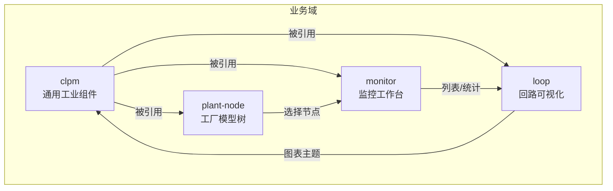
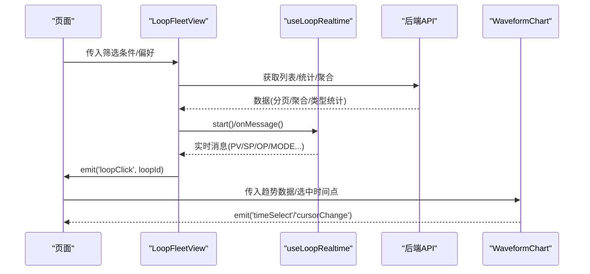
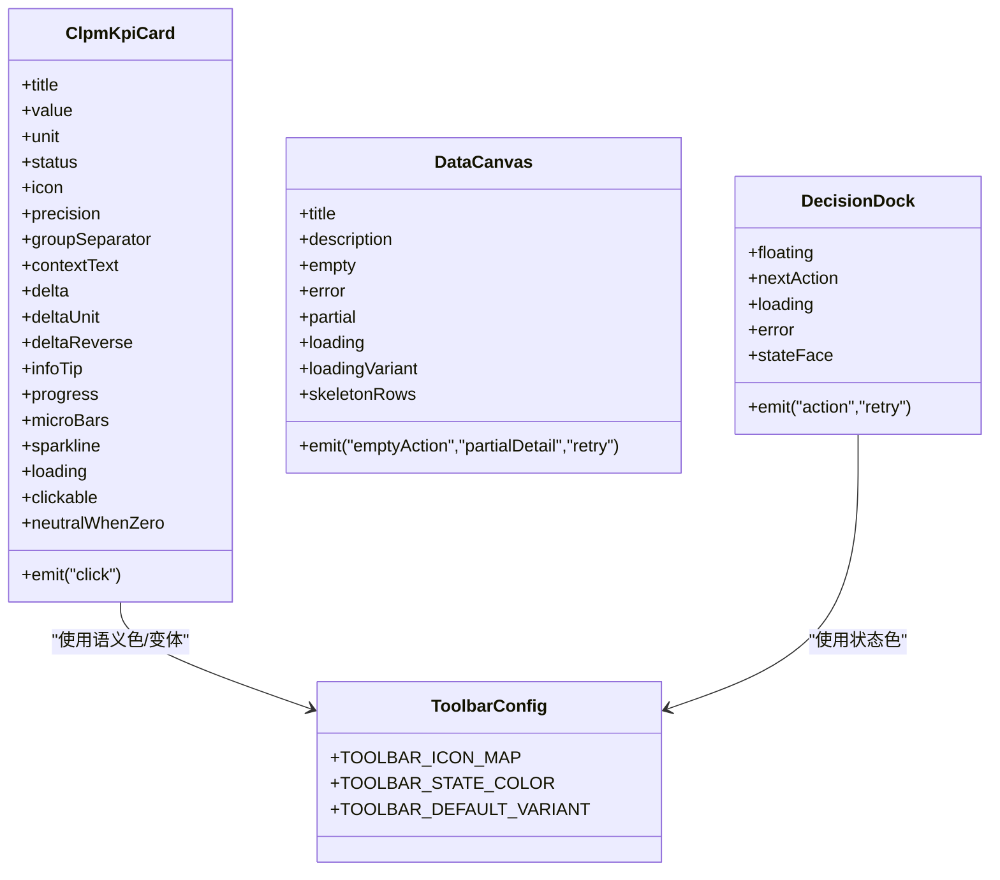
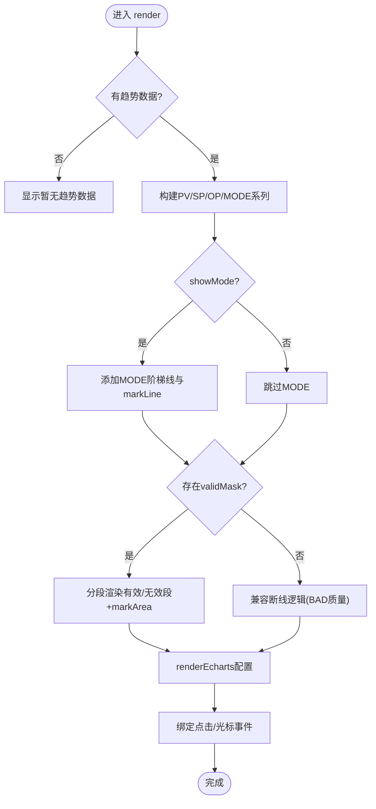
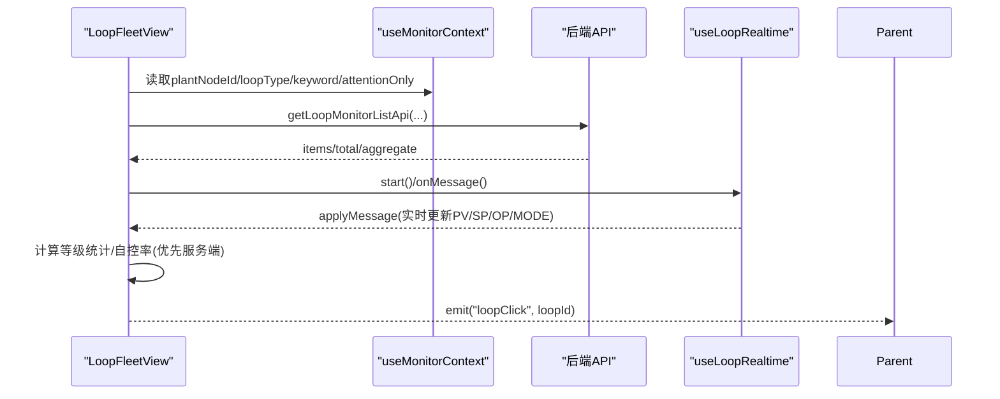
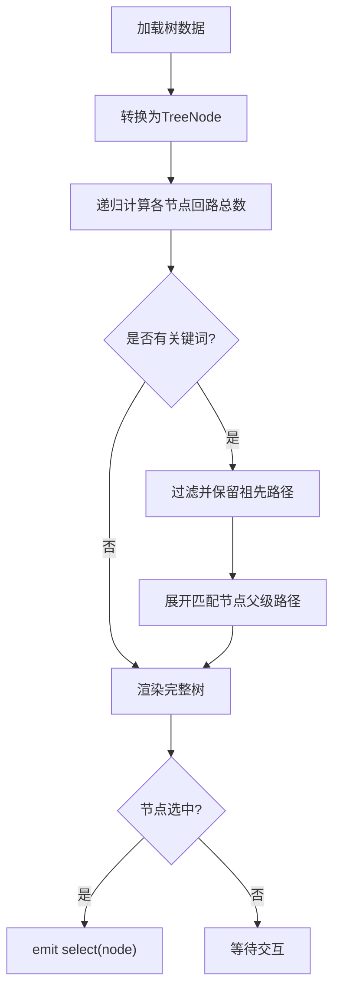
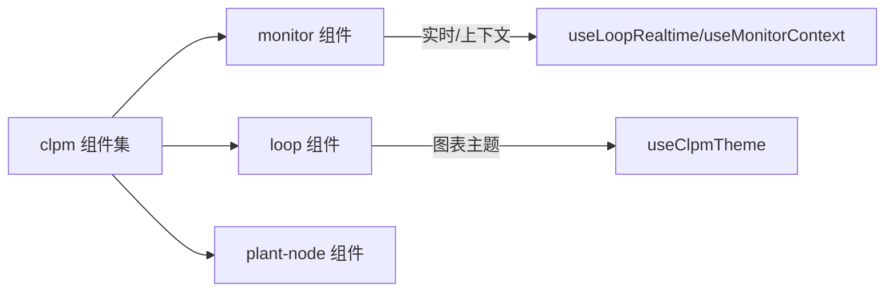

# 业务组件结构

<cite>
**本文引用的文件**
- [index.ts](file://frontend/apps/web-antd/src/components/clpm/index.ts)
- [kpi-card.vue](file://frontend/apps/web-antd/src/components/clpm/kpi-card.vue)
- [decision-dock.vue](file://frontend/apps/web-antd/src/components/clpm/decision-dock.vue)
- [data-canvas.vue](file://frontend/apps/web-antd/src/components/clpm/data-canvas.vue)
- [toolbar-config.ts](file://frontend/apps/web-antd/src/components/clpm/toolbar-config.ts)
- [waveform-chart.vue](file://frontend/apps/web-antd/src/components/loop/waveform-chart.vue)
- [loop-fleet-view.vue](file://frontend/apps/web-antd/src/components/monitor/loop-fleet-view.vue)
- [workbench-active-attention.vue](file://frontend/apps/web-antd/src/components/monitor/workbench-active-attention.vue)
- [plant-node-tree.vue](file://frontend/apps/web-antd/src/components/plant-node/plant-node-tree.vue)
</cite>

## 目录
1. [简介](#简介)
2. [项目结构](#项目结构)
3. [核心组件](#核心组件)
4. [架构总览](#架构总览)
5. [详细组件分析](#详细组件分析)
6. [依赖关系分析](#依赖关系分析)
7. [性能考虑](#性能考虑)
8. [故障排查指南](#故障排查指南)
9. [结论](#结论)
10. [附录](#附录)

## 简介
本文件面向 CLPM 前端业务组件体系，聚焦 components 目录下按业务域划分的组件组织与实现：clpm（CLPM 通用工业风格组件）、loop（回路相关可视化与编辑）、monitor（监控工作台与列表）、plant-node（工厂模型树）。文档从职责划分、接口设计、事件处理机制、复用策略、样式隔离、主题适配等方面展开，并结合实际代码路径说明如何开发可复用的业务组件与组件间通信模式。

## 项目结构
- 组件按业务域分目录组织：
  - clpm：通用工业风格 UI 组件与工具栏规范，提供 KPI 卡片、数据画布、决策坞、表格规范等。
  - loop：回路趋势图、状态徽章、质量标签等。
  - monitor：监控页的回路舰队视图、活跃关注项、生命周期条等。
  - plant-node：工厂节点树，承载工厂/装置/单元层级导航。
- 组件通过 Vue 单文件组件（SFC）+ TypeScript Props/Emits 定义契约；样式采用 scoped CSS + 工业语义色 token；图表基于 ECharts 封装。

**章节来源**
- [index.ts:1-72](file://frontend/apps/web-antd/src/components/clpm/index.ts#L1-L72)

## 核心组件
- ClpmKpiCard：统一 KPI 卡片，支持数值格式化、状态语义色、微型图表（进度条/迷你柱状/sparkline）、点击与键盘可达性。
- WaveformChart：ECharts 波形图，支持 PV/SP/OP/MODE 多系列、时间选择、光标联动、无效区间高亮、主题自适应。
- LoopFleetView：批量回路表格视图，聚合统计、列配置、密度切换、实时推送与轮询降级、CSV 导出。
- PlantNodeTree：工厂模型树，搜索过滤、递归统计、选中事件、展开折叠控制。
- DecisionDock：右下角决策坞，Provider/Props 双模式，状态机驱动主操作与重试。
- DataCanvas：数据容器，统一空态/错误/部分可用/加载骨架屏/旋转/透明度变体。
- ToolbarConfig：工具栏按钮图标、语义色、默认变体映射，统一页面工具栏视觉与交互。

**章节来源**
- [kpi-card.vue:1-530](file://frontend/apps/web-antd/src/components/clpm/kpi-card.vue#L1-L530)
- [waveform-chart.vue:1-714](file://frontend/apps/web-antd/src/components/loop/waveform-chart.vue#L1-L714)
- [loop-fleet-view.vue:1-800](file://frontend/apps/web-antd/src/components/monitor/loop-fleet-view.vue#L1-L800)
- [plant-node-tree.vue:1-604](file://frontend/apps/web-antd/src/components/plant-node/plant-node-tree.vue#L1-L604)
- [decision-dock.vue:1-265](file://frontend/apps/web-antd/src/components/clpm/decision-dock.vue#L1-L265)
- [data-canvas.vue:1-411](file://frontend/apps/web-antd/src/components/clpm/data-canvas.vue#L1-L411)
- [toolbar-config.ts:1-170](file://frontend/apps/web-antd/src/components/clpm/toolbar-config.ts#L1-L170)

## 架构总览
组件之间以“组合式函数 + 事件”解耦，遵循单向数据流：
- 父组件通过 Props 下发数据与开关，子组件通过 Emits 上报用户行为或状态变化。
- 复杂状态由组合式函数管理（如 useLoopRealtime、useMonitorContext），组件仅消费其响应式值。
- 图表组件暴露 resize 等方法供父级调用，主题通过 useClpmTheme 同步。

**图示来源**
- [loop-fleet-view.vue:1-800](file://frontend/apps/web-antd/src/components/monitor/loop-fleet-view.vue#L1-L800)
- [waveform-chart.vue:1-714](file://frontend/apps/web-antd/src/components/loop/waveform-chart.vue#L1-L714)

**章节来源**
- [loop-fleet-view.vue:1-800](file://frontend/apps/web-antd/src/components/monitor/loop-fleet-view.vue#L1-L800)
- [waveform-chart.vue:1-714](file://frontend/apps/web-antd/src/components/loop/waveform-chart.vue#L1-L714)

## 详细组件分析

### clpm 域：通用工业组件
- 职责
  - 提供统一的 KPI 展示、数据画布、决策坞、工具栏规范，确保跨页面一致的视觉与交互。
- 接口设计
  - ClpmKpiCard：props 包含 title/value/unit/status/icon/precision/groupSeparator/contextText/delta/deltaUnit/deltaReverse/infoTip/progress/microBars/sparkline/loading/clickable/neutralWhenZero；emit click。
  - DataCanvas：props 描述标题/描述/空态/错误/部分可用/加载变体/骨架行数；emit emptyAction/partialDetail/retry。
  - DecisionDock：支持 Provider 注入或 Props 模式；emit action/retry。
  - ToolbarConfig：导出 TOOLBAR_ICON_MAP/TOOLBAR_STATE_COLOR/TOOLBAR_DEFAULT_VARIANT 及类型。
- 事件处理
  - 点击与键盘可达性（Enter/Space）在可点击卡片中统一触发。
  - 决策坞根据状态机渲染提示与主操作，error 时提供重试。
- 复用策略
  - 通过 index.ts 集中导出，便于按需引入；表格规范通过常量类名约束。
- 样式隔离与主题
  - 使用 scoped CSS 与工业语义 token（--status-*、--foreground、--border 等）。
  - 颜色与状态严格对齐 ZL 工业语义。

**图示来源**
- [kpi-card.vue:1-530](file://frontend/apps/web-antd/src/components/clpm/kpi-card.vue#L1-L530)
- [data-canvas.vue:1-411](file://frontend/apps/web-antd/src/components/clpm/data-canvas.vue#L1-L411)
- [decision-dock.vue:1-265](file://frontend/apps/web-antd/src/components/clpm/decision-dock.vue#L1-L265)
- [toolbar-config.ts:1-170](file://frontend/apps/web-antd/src/components/clpm/toolbar-config.ts#L1-L170)

**章节来源**
- [index.ts:1-72](file://frontend/apps/web-antd/src/components/clpm/index.ts#L1-L72)
- [kpi-card.vue:1-530](file://frontend/apps/web-antd/src/components/clpm/kpi-card.vue#L1-L530)
- [data-canvas.vue:1-411](file://frontend/apps/web-antd/src/components/clpm/data-canvas.vue#L1-L411)
- [decision-dock.vue:1-265](file://frontend/apps/web-antd/src/components/clpm/decision-dock.vue#L1-L265)
- [toolbar-config.ts:1-170](file://frontend/apps/web-antd/src/components/clpm/toolbar-config.ts#L1-L170)

### loop 域：回路可视化
- 职责
  - 提供回路 PV/SP/OP/MODE 趋势图，支持时间选择、光标联动、无效区间标记、主题适配。
- 接口设计
  - props：enableTimeSelect/height/outlierReasons/selectedTimestamp/showMode/trend/validMask。
  - emits：timeSelect(index, timestamp)、cursorChange(payload|null)。
- 事件处理
  - 点击图表最近时间点 → timeSelect；鼠标移动 → cursorChange；离开画布 → 恢复 null。
- 算法与复杂度
  - 最近点查找为 O(n)，n 为采样点数；分段数据构建与无效区间 markArea 计算均为 O(n)。
- 主题适配
  - 通过 useClpmTheme 获取图表文本/分割线/无效色等，监听 isDark 重绘。

**图示来源**
- [waveform-chart.vue:1-714](file://frontend/apps/web-antd/src/components/loop/waveform-chart.vue#L1-L714)

**章节来源**
- [waveform-chart.vue:1-714](file://frontend/apps/web-antd/src/components/loop/waveform-chart.vue#L1-L714)

### monitor 域：监控工作台
- 职责
  - 回路舰队视图：列表、统计、列设置、密度、导出；实时推送与轮询降级；共享上下文筛选。
  - 活跃关注项：当前回路待处理事项汇总与跳转。
- 接口设计
  - LoopFleetView：props showAutoRefresh/showStats；emits loopClick(loopId)；expose refresh/export 等。
  - WorkbenchActiveAttention：props activeAttention/loopId；路由跳转到关注队列。
- 事件处理
  - 行点击 → 向上层 emit loopClick；自动刷新开关 → 启动/停止 WS；WS 在线/离线 → 切换推送/轮询。
- 数据流
  - 优先服务端聚合（gradeCounts/avgScore/autoControlRate），无则前端降级计算。

**图示来源**
- [loop-fleet-view.vue:1-800](file://frontend/apps/web-antd/src/components/monitor/loop-fleet-view.vue#L1-L800)

**章节来源**
- [loop-fleet-view.vue:1-800](file://frontend/apps/web-antd/src/components/monitor/loop-fleet-view.vue#L1-L800)
- [workbench-active-attention.vue:1-215](file://frontend/apps/web-antd/src/components/monitor/workbench-active-attention.vue#L1-L215)

### plant-node 域：工厂模型树
- 职责
  - 工厂/装置/单元三层树形导航，搜索过滤、统计栏、选中事件、展开折叠。
- 接口设计
  - props：cardTitle/width/showSearch/showCollapseButtons/defaultExpandLevel/maxHeight/showStats/loopCounts。
  - emits：select(node|null)、loadComplete(treeData)。
- 算法与复杂度
  - 递归累加回路数 O(N)；搜索过滤保留匹配节点及其祖先 O(N)。
- 交互
  - 搜索时仅展开匹配路径；一键全部展开/折叠；选中即发事件。

**图示来源**
- [plant-node-tree.vue:1-604](file://frontend/apps/web-antd/src/components/plant-node/plant-node-tree.vue#L1-L604)

**章节来源**
- [plant-node-tree.vue:1-604](file://frontend/apps/web-antd/src/components/plant-node/plant-node-tree.vue#L1-L604)

## 依赖关系分析
- 组件耦合
  - clpm 组件被 loop/monitor/plant-node 广泛复用，形成“基础能力层”。
  - monitor 依赖 clpm 的数值/徽章/画布等，提升一致性。
  - loop 图表依赖主题 composable，保证深/浅色一致。
- 外部依赖
  - Ant Design Vue：Table/Tag/Button/Card/Input/Tree 等。
  - ECharts：通过 @vben/plugins/echarts 封装。
  - 组合式函数：useLoopRealtime、useMonitorContext、useClpmTheme、usePagePreference 等。
- 潜在循环依赖
  - 组件间通过事件与组合式函数解耦，未见直接循环 import。

**图示来源**
- [loop-fleet-view.vue:1-800](file://frontend/apps/web-antd/src/components/monitor/loop-fleet-view.vue#L1-L800)
- [waveform-chart.vue:1-714](file://frontend/apps/web-antd/src/components/loop/waveform-chart.vue#L1-L714)
- [plant-node-tree.vue:1-604](file://frontend/apps/web-antd/src/components/plant-node/plant-node-tree.vue#L1-L604)

**章节来源**
- [loop-fleet-view.vue:1-800](file://frontend/apps/web-antd/src/components/monitor/loop-fleet-view.vue#L1-L800)
- [waveform-chart.vue:1-714](file://frontend/apps/web-antd/src/components/loop/waveform-chart.vue#L1-L714)
- [plant-node-tree.vue:1-604](file://frontend/apps/web-antd/src/components/plant-node/plant-node-tree.vue#L1-L604)

## 性能考虑
- 图表渲染
  - 大数据量下避免频繁重建 series；watch 深度监听 trend/validMask 等，必要时合并更新。
  - 使用 connectNulls:false 配合桥接点减少不必要的连线开销。
- 列表与统计
  - 优先使用服务端聚合（gradeCounts/avgScore/autoControlRate），降低前端计算成本。
  - 分页与虚拟滚动（Ant Table 内置）结合，控制渲染规模。
- 实时数据
  - WS 在线时仅增量更新必要字段；断连回退到轮询，避免长时间停滞。
- 主题切换
  - 监听 isDark 后 nextTick 重绘图表，避免闪烁与错配。

[本节为通用指导，不直接分析具体文件]

## 故障排查指南
- 图表异常
  - 检查 trend 数据结构（timestamps/pv/sp/op/mode）是否齐全；validMask 长度需与 timestamps 一致。
  - 确认 selectedTimestamp 为有效数字时间戳，否则 markLine 不生效。
- 列表不更新
  - 确认 useLoopRealtime 已 start 且 onMessage 已注册；WS 断连时检查轮询是否启用。
  - 筛选条件来自 useMonitorContext，变更会重置页码并重新加载。
- 树节点选中失效
  - 加载新树后清理 expandedKeys/selectedKeys，避免残留 key 导致状态不一致。
- 决策坞状态不对
  - 检查 Provider 注入的 loading/error/summary 是否正确；Props 模式下优先级高于注入。

**章节来源**
- [waveform-chart.vue:1-714](file://frontend/apps/web-antd/src/components/loop/waveform-chart.vue#L1-L714)
- [loop-fleet-view.vue:1-800](file://frontend/apps/web-antd/src/components/monitor/loop-fleet-view.vue#L1-L800)
- [plant-node-tree.vue:1-604](file://frontend/apps/web-antd/src/components/plant-node/plant-node-tree.vue#L1-L604)
- [decision-dock.vue:1-265](file://frontend/apps/web-antd/src/components/clpm/decision-dock.vue#L1-L265)

## 结论
- 组件按业务域清晰分层，clpm 作为基础能力层被其他域复用，保障视觉与交互一致性。
- 接口设计以 Props/Emits 为主，复杂状态通过组合式函数管理，组件职责单一、可测试性强。
- 样式采用 scoped CSS 与工业语义 token，主题适配完善；图表组件暴露方法便于父级控制。
- 建议继续推进：
  - 将更多重复逻辑抽取为组合式函数（如列配置、密度切换）。
  - 统一错误与空态文案至 DataCanvas，减少分散处理。
  - 对高频图表增加数据降采样与懒加载策略。

[本节为总结，不直接分析具体文件]

## 附录
- 开发可复用业务组件要点
  - 明确 Props 边界与默认值，Emits 命名清晰，类型约束完备。
  - 使用 scoped CSS 与语义化类名，遵循 clpm 表格与工具栏规范。
  - 对外暴露必要方法（如 resize/refresh），并通过 provide/inject 或组合式函数共享上下文。
- 组件间通信模式
  - 父子：Props + Emits。
  - 兄弟/跨层：组合式函数（useMonitorContext/useLoopRealtime）或事件总线（谨慎使用）。
  - 图表与页面：事件回调（timeSelect/cursorChange）与方法暴露（resize）。

[本节为通用指导，不直接分析具体文件]