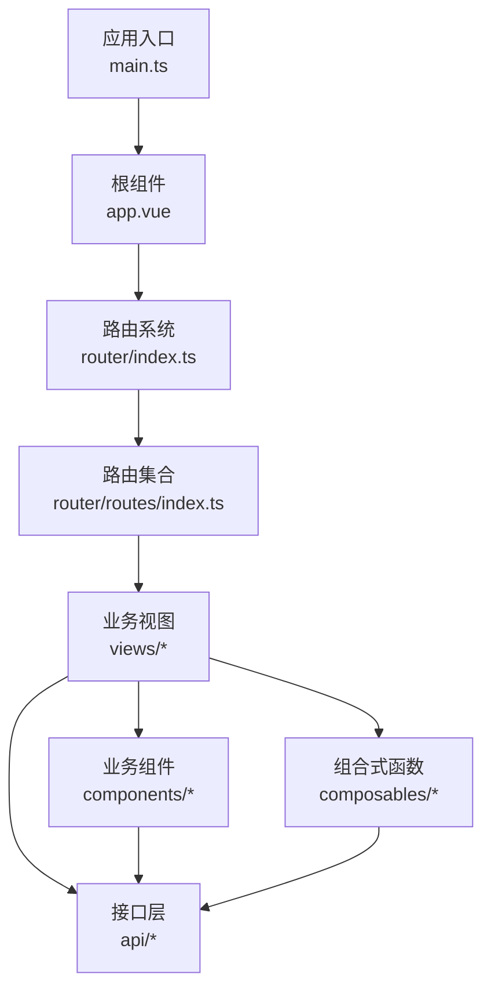
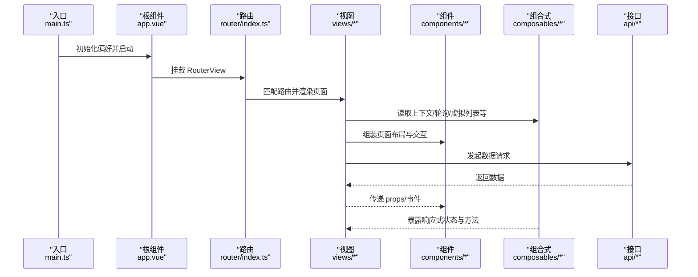
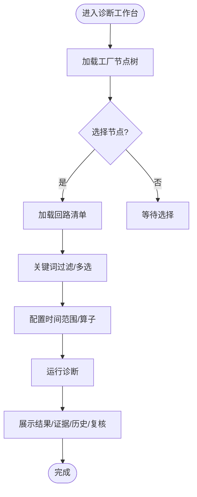
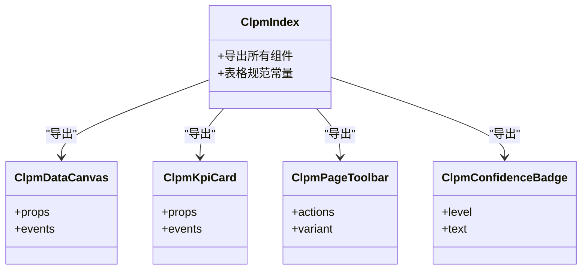
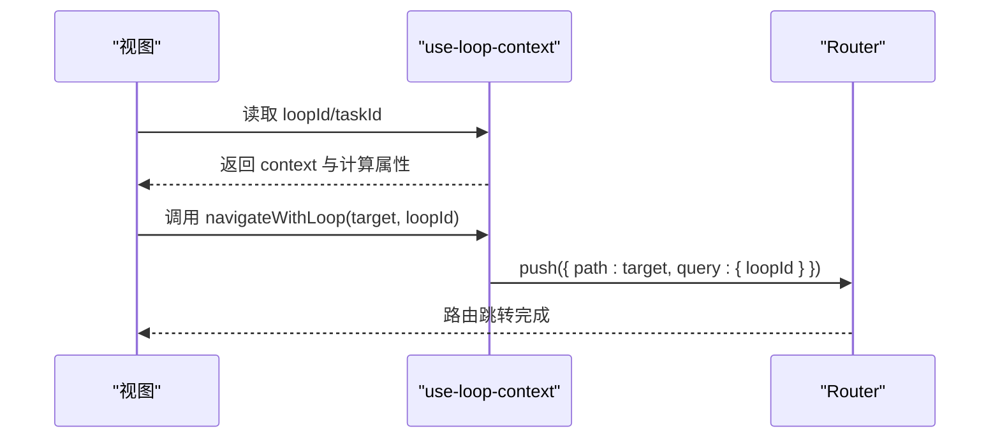
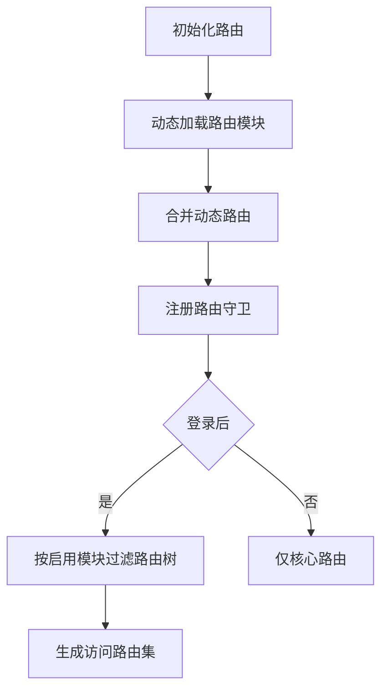
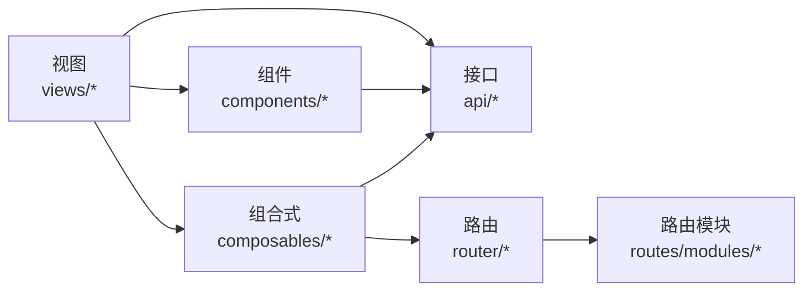

# 应用内部结构

<cite>
**本文引用的文件**
- [main.ts](file://frontend/apps/web-antd/src/main.ts)
- [app.vue](file://frontend/apps/web-antd/src/app.vue)
- [router/index.ts](file://frontend/apps/web-antd/src/router/index.ts)
- [router/routes/index.ts](file://frontend/apps/web-antd/src/router/routes/index.ts)
- [views/diagnosis/workbench.vue](file://frontend/apps/web-antd/src/views/diagnosis/workbench.vue)
- [components/clpm/index.ts](file://frontend/apps/web-antd/src/components/clpm/index.ts)
- [composables/use-loop-context.ts](file://frontend/apps/web-antd/src/composables/use-loop-context.ts)
</cite>

## 目录
1. [简介](#简介)
2. [项目结构](#项目结构)
3. [核心组件](#核心组件)
4. [架构总览](#架构总览)
5. [详细组件分析](#详细组件分析)
6. [依赖关系分析](#依赖关系分析)
7. [性能考量](#性能考量)
8. [故障排查指南](#故障排查指南)
9. [结论](#结论)
10. [附录](#附录)

## 简介
本文件面向前端工程 src 目录的内部组织，聚焦以下目标：
- 解释 views、components、composables、api 等子目录的职责与划分原则
- 说明页面按业务模块（monitor、diagnosis、tuning、handling 等）的组织方式
- 阐述组件复用策略、状态管理模式、路由组织结构
- 给出新增功能与组件的落地范式与示例路径

该工程基于 Vue 3 + Vite + TypeScript，采用模块化路由与组合式函数（composables）进行业务逻辑封装，API 层按功能域拆分，便于维护与扩展。

## 项目结构
src 目录采用“按职责分层 + 按业务分域”的混合组织方式：
- views：页面级组件，按业务模块划分（如 diagnosis、tuning、handling、loop、monitor、metric、reports、system 等），每个模块可包含自己的 components、composables 与常量配置
- components：跨页面复用的业务组件，按功能域分组（clpm、loop、monitor、plant-node、metric 等），并通过 index.ts 统一导出
- composables：组合式函数，封装跨模块共享的业务逻辑（如回路上下文、轮询、虚拟列表、主题/角色偏好等）
- api：接口层，按功能模块分类（diagnosis、loop、tuning、handling、monitor、metric、system 等），并提供统一的请求封装与类型定义
- router：路由入口与守卫，动态加载 modules 下的路由模块，支持按启用模块过滤
- store：全局状态（如认证相关）
- locales、styles、utils、constants、directives、adapter：国际化、样式、工具、常量、指令与第三方组件适配

图示来源
- [main.ts:1-51](file://frontend/apps/web-antd/src/main.ts#L1-L51)
- [app.vue:1-40](file://frontend/apps/web-antd/src/app.vue#L1-L40)
- [router/index.ts:1-38](file://frontend/apps/web-antd/src/router/index.ts#L1-L38)
- [router/routes/index.ts:1-102](file://frontend/apps/web-antd/src/router/routes/index.ts#L1-L102)

章节来源
- [main.ts:1-51](file://frontend/apps/web-antd/src/main.ts#L1-L51)
- [app.vue:1-40](file://frontend/apps/web-antd/src/app.vue#L1-L40)
- [router/index.ts:1-38](file://frontend/apps/web-antd/src/router/index.ts#L1-L38)
- [router/routes/index.ts:1-102](file://frontend/apps/web-antd/src/router/routes/index.ts#L1-L102)

## 核心组件
- 业务视图（views）
  - 诊断工作台：以装置树+回路多选为左脊柱，右侧承载配置与结果面板，体现“选择范围→运行诊断→查看证据/历史/复核”的工作流
  - 整定/处理/监控/指标/报表/系统等模块均遵循“页面+局部组件+本地 composable”的结构
- 通用业务组件（components）
  - clpm：工业风格 UI 组件库（数据画布、KPI 卡片、状态徽章、决策面板、页头工具栏等），通过 index.ts 集中导出并附带表格规范
  - loop/monitor/plant-node/metric：领域内专用组件（波形图、实时状态、工厂节点树、评分迷你图等）
- 组合式函数（composables）
  - use-loop-context：统一跨模块的回路上下文（?loopId= / ?taskId=）与跳转方法，避免各页面自行拼接 query 导致上下文丢失
  - 其他：轮询、虚拟列表、主题/角色偏好、ECharts 预设、工业状态映射等

章节来源
- [views/diagnosis/workbench.vue:1-200](file://frontend/apps/web-antd/src/views/diagnosis/workbench.vue#L1-L200)
- [components/clpm/index.ts:1-72](file://frontend/apps/web-antd/src/components/clpm/index.ts#L1-L72)
- [composables/use-loop-context.ts:1-81](file://frontend/apps/web-antd/src/composables/use-loop-context.ts#L1-L81)

## 架构总览
前端采用“入口 → 根组件 → 路由 → 视图 → 组件/Composables/API”的分层架构：
- main.ts 负责初始化偏好设置与应用启动
- app.vue 提供全局主题与国际化配置，渲染 RouterView
- router 负责路由实例化、守卫与动态路由合并
- 视图层按业务模块组织，调用组件与 composables，并通过 api 层获取数据
- 组件层按功能域组织，提供可复用 UI 能力
- composables 封装跨模块逻辑，降低视图复杂度
- api 层按模块拆分，统一请求封装与类型定义

图示来源
- [main.ts:1-51](file://frontend/apps/web-antd/src/main.ts#L1-L51)
- [app.vue:1-40](file://frontend/apps/web-antd/src/app.vue#L1-L40)
- [router/index.ts:1-38](file://frontend/apps/web-antd/src/router/index.ts#L1-L38)

## 详细组件分析

### 诊断工作台（views/diagnosis/workbench.vue）
- 职责：提供“装置树导航 + 回路多选 + 时间范围/算子配置 + 诊断结果/证据/历史/复核”的一体化工作区
- 关键流程：
  - 加载工厂节点树，构建 ant Tree 数据结构
  - 根据选中节点加载回路清单，支持关键词过滤与多选
  - 调用诊断相关 API 获取算子、执行诊断、展示结果与证据
- 设计要点：
  - 使用 Page、Table、Tree、RangePicker 等 Ant Design Vue 组件
  - 通过 composables/use-diagnosis-runner（模块内）管理诊断任务
  - 通过 api/diagnosis、api/loop、api/plant-node 获取数据

图示来源
- [views/diagnosis/workbench.vue:1-200](file://frontend/apps/web-antd/src/views/diagnosis/workbench.vue#L1-L200)

章节来源
- [views/diagnosis/workbench.vue:1-200](file://frontend/apps/web-antd/src/views/diagnosis/workbench.vue#L1-L200)

### 通用组件库（components/clpm）
- 职责：提供工业风格的可复用 UI 组件与表格规范
- 组织方式：每个组件独立 .vue 文件，index.ts 统一导出，并附带表格样式与类名约定（如数值列、行内进度条、密度切换等）
- 典型组件：数据画布、KPI 卡片、状态徽章、决策面板、页头工具栏、版本历史弹窗等

图示来源
- [components/clpm/index.ts:1-72](file://frontend/apps/web-antd/src/components/clpm/index.ts#L1-L72)

章节来源
- [components/clpm/index.ts:1-72](file://frontend/apps/web-antd/src/components/clpm/index.ts#L1-L72)

### 组合式函数：use-loop-context
- 职责：统一跨模块的回路上下文（?loopId= / ?taskId=）与跳转方法，确保上下文在模块间一致传递
- 关键点：
  - 从路由 query 中解析 loopId/taskId
  - 提供 navigateWithLoop/navigateWithTask/withLoop 等方法
  - 避免各页面自行拼接 query 导致的上下文不一致

图示来源
- [composables/use-loop-context.ts:1-81](file://frontend/apps/web-antd/src/composables/use-loop-context.ts#L1-L81)

章节来源
- [composables/use-loop-context.ts:1-81](file://frontend/apps/web-antd/src/composables/use-loop-context.ts#L1-L81)

### 路由组织与模块过滤
- 路由入口创建 router 实例并注册守卫
- 动态加载 routes/modules 下的路由模块，合并为全部动态路由
- 登录后根据已启用模块 key 集合过滤路由树，未启用模块的路由将被移除
- 提供 isKnownRoutePath 用于判断路径是否属于已知路由模式

图示来源
- [router/index.ts:1-38](file://frontend/apps/web-antd/src/router/index.ts#L1-L38)
- [router/routes/index.ts:1-102](file://frontend/apps/web-antd/src/router/routes/index.ts#L1-L102)

章节来源
- [router/index.ts:1-38](file://frontend/apps/web-antd/src/router/index.ts#L1-L38)
- [router/routes/index.ts:1-102](file://frontend/apps/web-antd/src/router/routes/index.ts#L1-L102)

## 依赖关系分析
- 视图对组件与 composables 的依赖：
  - 视图通过 import 引入组件与 composables，组合页面布局与交互
  - 视图通过 api 层获取数据，解耦后端接口变化
- 组件对 composables 的依赖：
  - 组件可通过 composables 复用逻辑（如轮询、虚拟列表、主题等）
- composables 对路由与 api 的依赖：
  - 部分 composables 会读取路由参数或调用 api（如 use-loop-context 依赖路由）
- 路由对模块的动态导入：
  - 通过 import.meta.glob 动态加载路由模块，实现按需与可插拔

图示来源
- [router/routes/index.ts:1-102](file://frontend/apps/web-antd/src/router/routes/index.ts#L1-L102)

章节来源
- [router/routes/index.ts:1-102](file://frontend/apps/web-antd/src/router/routes/index.ts#L1-L102)

## 性能考量
- 列表与大数据：
  - 使用虚拟列表 composable 优化长列表渲染
  - 表格行内进度条与 hover reveal 操作减少重绘
- 网络请求：
  - 通过 api 层统一封装，结合最新请求去抖/取消机制（如 use-latest-request）
- 图表渲染：
  - 使用 ECharts 预设 composable 统一配置，减少重复初始化
- 路由与模块：
  - 动态路由与模块过滤减少初始路由表体积
- 主题与国际化：
  - 在根组件集中配置主题与语言，避免重复计算

[本节为通用指导，不直接分析具体文件]

## 故障排查指南
- 路由 404/403：
  - 检查是否启用了对应模块；未启用模块的路由会被过滤
  - 使用 isKnownRoutePath 判断路径是否在已知路由模式中
- 上下文丢失：
  - 跨模块跳转统一使用 use-loop-context 提供的 navigateWithLoop/withLoop，避免手动拼接 query
- 组件显示异常：
  - 确认组件是否正确从 components/clpm/index.ts 导出与引入
  - 检查表格样式类是否符合 CLPM_TABLE_GUIDE 规范
- 数据加载失败：
  - 检查 api 层错误处理与重试策略
  - 查看控制台日志与网络请求参数

章节来源
- [router/routes/index.ts:63-102](file://frontend/apps/web-antd/src/router/routes/index.ts#L63-L102)
- [composables/use-loop-context.ts:20-81](file://frontend/apps/web-antd/src/composables/use-loop-context.ts#L20-L81)
- [components/clpm/index.ts:49-72](file://frontend/apps/web-antd/src/components/clpm/index.ts#L49-L72)

## 结论
本工程 src 目录采用清晰的层次化与模块化组织：
- 视图按业务模块划分，组件按功能域组织，composables 封装跨模块逻辑，api 按模块拆分
- 路由支持动态加载与模块过滤，便于功能开关与权限控制
- 通过统一上下文与组件导出规范，提升可维护性与可扩展性
建议新增功能时遵循：
- 在 views 下新建业务模块目录，包含页面与局部组件/composables
- 将跨页面复用的 UI 放入 components，并在 index.ts 导出
- 将跨模块逻辑抽离到 composables，保持视图简洁
- 在 api 下新增模块文件，统一封装接口与类型

[本节为总结，不直接分析具体文件]

## 附录
- 新增功能的推荐步骤
  - 在 views/{module} 下创建页面与局部组件
  - 在 components/{domain} 下创建可复用组件，并在 index.ts 导出
  - 在 composables 下新增组合式函数，封装跨模块逻辑
  - 在 api/{module}.ts 中新增接口方法与类型
  - 在 router/routes/modules 下新增路由模块，并在 meta.module 中标注模块键
  - 在视图中通过 composables 与 api 层协作，使用组件组织页面

- 命名规范建议
  - 视图：小写短横线命名（如 workbench.vue、records.vue）
  - 组件：PascalCase 命名（如 DataCanvas.vue、KpiCard.vue）
  - 组合式：use- 前缀（如 use-loop-context.ts）
  - API：按模块命名（如 diagnosis.ts、loop.ts）

- 参考示例路径
  - 诊断工作台：[views/diagnosis/workbench.vue](file://frontend/apps/web-antd/src/views/diagnosis/workbench.vue)
  - 通用组件导出：[components/clpm/index.ts](file://frontend/apps/web-antd/src/components/clpm/index.ts)
  - 回路上下文：[composables/use-loop-context.ts](file://frontend/apps/web-antd/src/composables/use-loop-context.ts)
  - 路由入口与动态加载：[router/index.ts](file://frontend/apps/web-antd/src/router/index.ts)、[router/routes/index.ts](file://frontend/apps/web-antd/src/router/routes/index.ts)

[本节为补充信息，不直接分析具体文件]