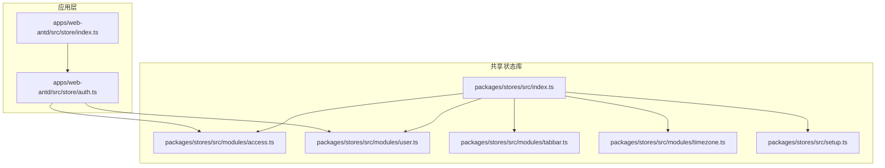
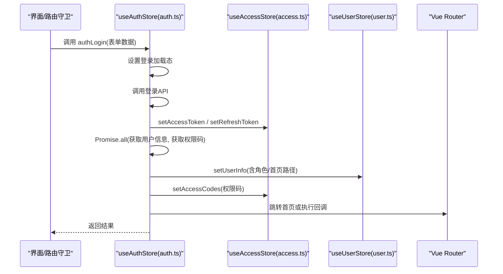
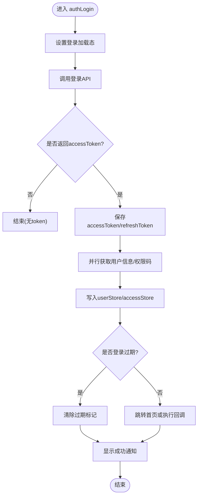
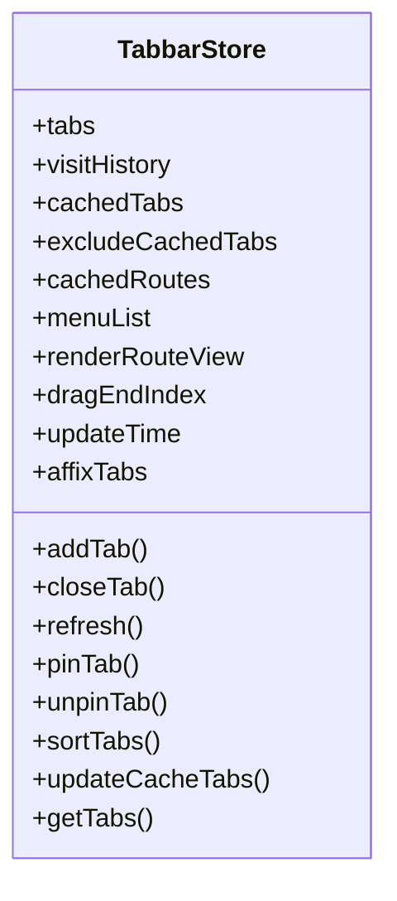
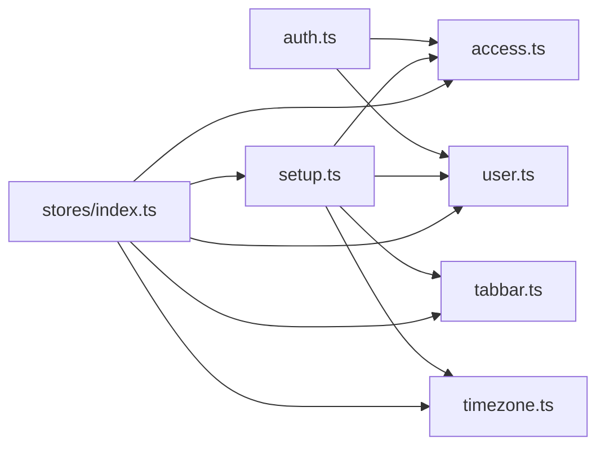

# 状态管理结构

<cite>
**本文引用的文件**
- [auth.ts](file://frontend/apps/web-antd/src/store/auth.ts)
- [index.ts](file://frontend/apps/web-antd/src/store/index.ts)
- [access.ts](file://frontend/packages/stores/src/modules/access.ts)
- [user.ts](file://frontend/packages/stores/src/modules/user.ts)
- [tabbar.ts](file://frontend/packages/stores/src/modules/tabbar.ts)
- [timezone.ts](file://frontend/packages/stores/src/modules/timezone.ts)
- [setup.ts](file://frontend/packages/stores/src/setup.ts)
- [index.ts](file://frontend/packages/stores/src/index.ts)
</cite>

## 目录
1. [简介](#简介)
2. [项目结构](#项目结构)
3. [核心组件](#核心组件)
4. [架构总览](#架构总览)
5. [详细组件分析](#详细组件分析)
6. [依赖关系分析](#依赖关系分析)
7. [性能考虑](#性能考虑)
8. [故障排查指南](#故障排查指南)
9. [结论](#结论)
10. [附录](#附录)

## 简介
本文件聚焦前端状态管理结构，围绕 store 目录下的认证状态（auth）、状态聚合（index）以及共享状态模块（access、user、tabbar、timezone），系统阐述设计原则、状态定义、getter 计算属性、action 方法封装、持久化策略、状态同步机制与性能优化方案。同时提供跨组件状态共享的最佳实践与常见问题排查指引。

## 项目结构
- 应用级状态：位于 apps/web-antd/src/store，当前主要暴露 auth 模块，并通过 index 统一导出。
- 共享状态库：位于 packages/stores/src，包含通用 Pinia Store 模块与初始化/重置能力。
- 关键职责划分：
  - auth：负责登录、登出、获取用户信息、权限码等认证流程。
  - access：访问控制相关状态（token、权限码、菜单、路由、锁屏等），并配置持久化。
  - user：用户基本信息与角色集合。
  - tabbar：标签页管理（打开/关闭/刷新/固定/缓存等）。
  - timezone：时区设置与持久化。
  - setup：Pinia 实例创建、插件注册（持久化）、全局重置。

图表来源
- [auth.ts:46-205](file://frontend/apps/web-antd/src/store/auth.ts#L46-L205)
- [index.ts](file://frontend/apps/web-antd/src/store/index.ts)
- [access.ts:51-123](file://frontend/packages/stores/src/modules/access.ts#L51-L123)
- [user.ts:41-58](file://frontend/packages/stores/src/modules/user.ts#L41-L58)
- [tabbar.ts:75-658](file://frontend/packages/stores/src/modules/tabbar.ts#L75-L658)
- [timezone.ts:62-124](file://frontend/packages/stores/src/modules/timezone.ts#L62-L124)
- [setup.ts:42-82](file://frontend/packages/stores/src/setup.ts#L42-L82)
- [index.ts](file://frontend/packages/stores/src/index.ts)

章节来源
- [auth.ts:46-205](file://frontend/apps/web-antd/src/store/auth.ts#L46-L205)
- [index.ts](file://frontend/apps/web-antd/src/store/index.ts)
- [access.ts:51-123](file://frontend/packages/stores/src/modules/access.ts#L51-L123)
- [user.ts:41-58](file://frontend/packages/stores/src/modules/user.ts#L41-L58)
- [tabbar.ts:75-658](file://frontend/packages/stores/src/modules/tabbar.ts#L75-L658)
- [timezone.ts:62-124](file://frontend/packages/stores/src/modules/timezone.ts#L62-L124)
- [setup.ts:42-82](file://frontend/packages/stores/src/setup.ts#L42-L82)
- [index.ts](file://frontend/packages/stores/src/index.ts)

## 核心组件
- 认证状态（auth）
  - 职责：登录、登出、拉取用户信息与权限码、根据角色映射默认首页、处理登录过期回退。
  - 状态：登录加载态、暴露 $reset 用于重置。
  - Action：authLogin、fetchAccessCodes、logout、fetchUserInfo。
  - 依赖：accessStore（token/权限码/过期标记）、userStore（用户信息）、router（导航）。
- 访问控制（access）
  - 职责：维护 accessToken、refreshToken、权限码、可访问菜单/路由、锁屏状态、是否已检查权限、登录过期标记。
  - 持久化：通过 pinia-plugin-persistedstate 将 token、权限码、锁屏相关字段持久化到安全存储。
- 用户信息（user）
  - 职责：维护 userInfo 与 userRoles；setUserInfo 会联动更新 roles。
- 标签栏（tabbar）
  - 职责：标签页增删改查、固定/取消固定、刷新、缓存、排序、历史栈、最大数量限制等。
  - 持久化：tabs 与 visitHistory 使用 sessionStorage 持久化，并对复杂类型进行序列化/反序列化。
- 时区（timezone）
  - 职责：初始化/切换时区，设置全局时间库默认时区，支持自定义处理器。
  - 持久化：持久化当前时区。
- 初始化与重置（setup）
  - 职责：创建 Pinia，注册持久化插件（生产环境使用加密本地存储），提供 resetAllStores 全局重置。

章节来源
- [auth.ts:46-205](file://frontend/apps/web-antd/src/store/auth.ts#L46-L205)
- [access.ts:51-123](file://frontend/packages/stores/src/modules/access.ts#L51-L123)
- [user.ts:41-58](file://frontend/packages/stores/src/modules/user.ts#L41-L58)
- [tabbar.ts:75-658](file://frontend/packages/stores/src/modules/tabbar.ts#L75-L658)
- [timezone.ts:62-124](file://frontend/packages/stores/src/modules/timezone.ts#L62-L124)
- [setup.ts:42-82](file://frontend/packages/stores/src/setup.ts#L42-L82)

## 架构总览
整体采用 Pinia 模块化 Store，应用层 auth 组合多个共享 Store 完成认证流程；共享 Store 通过 setup 统一初始化并启用持久化；各 Store 之间低耦合、高内聚，便于扩展与维护。

图表来源
- [auth.ts:58-127](file://frontend/apps/web-antd/src/store/auth.ts#L58-L127)
- [access.ts:85-96](file://frontend/packages/stores/src/modules/access.ts#L85-L96)
- [user.ts:43-52](file://frontend/packages/stores/src/modules/user.ts#L43-L52)

## 详细组件分析

### 认证状态（auth）
- 设计原则
  - 单一职责：仅处理认证相关流程，不直接操作业务数据。
  - 组合模式：通过 useAccessStore 与 useUserStore 组合完成状态落盘与展示。
  - 角色优先：默认首页按角色映射，再回退后端 defaultHome，最终兜底。
- 状态定义
  - loginLoading：登录中标志。
  - 暴露 $reset 用于重置加载态。
- Getter/计算属性
  - 未直接使用 getter，但通过 resolveHomePath 函数实现角色到首页的映射逻辑。
- Action 方法
  - authLogin：登录 -> 保存 token -> 并行获取用户信息与权限码 -> 写入 userStore/accessStore -> 导航。
  - fetchAccessCodes：优先使用登录返回的 permissions，否则请求权限接口。
  - logout：仅在 token 有效时调用后端登出 -> 重置所有 Store -> 清理过期标记 -> 重定向登录页。
  - fetchUserInfo：按需刷新用户信息与权限码。
- 错误处理
  - 登出时后端接口失败静默忽略，保证流程继续。
  - 权限码获取失败回退为空数组。
- 性能优化
  - 并行请求用户信息与权限码，减少等待时间。
  - 登录成功后及时清除“登录过期”标记，避免重复触发拦截。

图表来源
- [auth.ts:58-127](file://frontend/apps/web-antd/src/store/auth.ts#L58-L127)
- [auth.ts:133-142](file://frontend/apps/web-antd/src/store/auth.ts#L133-L142)
- [auth.ts:151-171](file://frontend/apps/web-antd/src/store/auth.ts#L151-L171)

章节来源
- [auth.ts:46-205](file://frontend/apps/web-antd/src/store/auth.ts#L46-L205)

### 访问控制（access）
- 状态定义
  - accessToken、refreshToken、accessCodes、accessMenus、accessRoutes、isAccessChecked、isLockScreen、lockScreenPassword、loginExpired。
- Action
  - 提供 setter 方法设置上述状态；提供 lockScreen/unlockScreen 锁屏；getMenuByPath 查找菜单。
- 持久化
  - 使用 persist.pick 仅持久化 token、权限码、锁屏相关字段，避免敏感信息泄露。
- 热更新
  - 支持 HMR 更新，开发体验更好。

章节来源
- [access.ts:9-46](file://frontend/packages/stores/src/modules/access.ts#L9-L46)
- [access.ts:51-123](file://frontend/packages/stores/src/modules/access.ts#L51-L123)

### 用户信息（user）
- 状态定义
  - userInfo、userRoles。
- Action
  - setUserInfo：设置用户信息并同步更新 userRoles。
  - setUserRoles：单独设置角色列表。
- 热更新
  - 支持 HMR。

章节来源
- [user.ts:3-36](file://frontend/packages/stores/src/modules/user.ts#L3-L36)
- [user.ts:41-58](file://frontend/packages/stores/src/modules/user.ts#L41-L58)

### 标签栏（tabbar）
- 状态定义
  - tabs、visitHistory、cachedTabs、excludeCachedTabs、cachedRoutes、menuList、renderRouteView、dragEndIndex、updateTime。
- Action
  - addTab/closeTab/closeLeftTabs/closeRightTabs/closeOtherTabs/closeAllTabs
  - refresh/refreshByName/resetTabTitle/setTabTitle
  - pinTab/unpinTab/toggleTabPin/sortTabs
  - updateCacheTabs/addCachedRoute/removeCachedRoute
- Getter
  - affixTabs、getTabs、getCachedTabs、getExcludeCachedTabs、getMenuList、getCachedRoutes。
- 持久化
  - tabs 与 visitHistory 使用 sessionStorage 持久化；对 Stack 类进行序列化/反序列化以恢复行为。
- 性能优化
  - 使用 Map/Set 提升查找与去重效率；延迟渲染刷新（短暂禁用视图后恢复）；限制动态路由打开数量。

图表来源
- [tabbar.ts:31-65](file://frontend/packages/stores/src/modules/tabbar.ts#L31-L65)
- [tabbar.ts:75-658](file://frontend/packages/stores/src/modules/tabbar.ts#L75-L658)

章节来源
- [tabbar.ts:75-658](file://frontend/packages/stores/src/modules/tabbar.ts#L75-L658)

### 时区（timezone）
- 状态定义
  - timezone（ref）。
- Action
  - initTimezone：从处理器获取时区并设置全局时间库默认时区。
  - setTimezone：设置时区并持久化。
  - getTimezoneOptions：获取时区选项。
- 持久化
  - 仅持久化当前时区。
- 可扩展性
  - 支持注入自定义时区处理器，便于多端适配。

章节来源
- [timezone.ts:62-124](file://frontend/packages/stores/src/modules/timezone.ts#L62-L124)

### 初始化与重置（setup）
- 职责
  - 创建 Pinia 实例并注册持久化插件。
  - 生产环境使用加密本地存储（AES），键名前缀隔离多应用。
  - 提供 resetAllStores：遍历所有 Store 调用 $reset。
- 关键点
  - 开发环境使用 localStorage，生产环境使用 secure-ls。
  - 通过 namespace 区分不同应用的持久化键名，避免冲突。

章节来源
- [setup.ts:42-82](file://frontend/packages/stores/src/setup.ts#L42-L82)

## 依赖关系分析
- 应用层 auth 依赖共享层的 access 与 user，形成“认证流程编排器”。
- 共享层各 Store 相互独立，通过 Pinia 实例统一管理生命周期与持久化。
- 入口 index 统一导出，降低耦合。

图表来源
- [auth.ts:46-205](file://frontend/apps/web-antd/src/store/auth.ts#L46-L205)
- [access.ts:51-123](file://frontend/packages/stores/src/modules/access.ts#L51-L123)
- [user.ts:41-58](file://frontend/packages/stores/src/modules/user.ts#L41-L58)
- [tabbar.ts:75-658](file://frontend/packages/stores/src/modules/tabbar.ts#L75-L658)
- [timezone.ts:62-124](file://frontend/packages/stores/src/modules/timezone.ts#L62-L124)
- [setup.ts:42-82](file://frontend/packages/stores/src/setup.ts#L42-L82)
- [index.ts](file://frontend/packages/stores/src/index.ts)

章节来源
- [auth.ts:46-205](file://frontend/apps/web-antd/src/store/auth.ts#L46-L205)
- [access.ts:51-123](file://frontend/packages/stores/src/modules/access.ts#L51-L123)
- [user.ts:41-58](file://frontend/packages/stores/src/modules/user.ts#L41-L58)
- [tabbar.ts:75-658](file://frontend/packages/stores/src/modules/tabbar.ts#L75-L658)
- [timezone.ts:62-124](file://frontend/packages/stores/src/modules/timezone.ts#L62-L124)
- [setup.ts:42-82](file://frontend/packages/stores/src/setup.ts#L42-L82)
- [index.ts](file://frontend/packages/stores/src/index.ts)

## 性能考虑
- 并行请求：登录成功后并行获取用户信息与权限码，减少首屏等待。
- 选择性持久化：仅持久化必要字段，降低存储体积与读写开销。
- 数据结构优化：标签栏使用 Map/Set 提升查找与去重效率。
- 渲染优化：刷新标签页时短暂禁用视图，避免中间态闪烁。
- 动态路由打开数限制：防止过多标签导致内存占用过高。
- 热更新：各 Store 支持 HMR，提升开发调试效率。

[本节为通用性能建议，无需特定文件引用]

## 故障排查指南
- 登录后无法跳转
  - 检查 accessStore.accessToken 是否设置成功。
  - 确认 resolveHomePath 返回值是否符合预期。
  - 参考：[auth.ts:75-110](file://frontend/apps/web-antd/src/store/auth.ts#L75-L110)
- 权限码为空
  - 若登录返回 permissions 为空，将请求权限接口；若仍失败则回退为空数组。
  - 参考：[auth.ts:133-142](file://frontend/apps/web-antd/src/store/auth.ts#L133-L142)
- 登出后仍保留敏感信息
  - 确认 resetAllStores 是否被调用，确保所有 Store 的 $reset 生效。
  - 参考：[auth.ts:151-171](file://frontend/apps/web-antd/src/store/auth.ts#L151-L171)、[setup.ts:72-82](file://frontend/packages/stores/src/setup.ts#L72-L82)
- 标签页异常
  - 检查 tabs 与 visitHistory 的持久化序列化/反序列化是否正确。
  - 参考：[tabbar.ts:613-636](file://frontend/packages/stores/src/modules/tabbar.ts#L613-L636)
- 时区未生效
  - 确认 initTimezone 是否执行成功，且 setCurrentTimezone 被调用。
  - 参考：[timezone.ts:71-79](file://frontend/packages/stores/src/modules/timezone.ts#L71-L79)

章节来源
- [auth.ts:75-110](file://frontend/apps/web-antd/src/store/auth.ts#L75-L110)
- [auth.ts:133-142](file://frontend/apps/web-antd/src/store/auth.ts#L133-L142)
- [auth.ts:151-171](file://frontend/apps/web-antd/src/store/auth.ts#L151-L171)
- [setup.ts:72-82](file://frontend/packages/stores/src/setup.ts#L72-L82)
- [tabbar.ts:613-636](file://frontend/packages/stores/src/modules/tabbar.ts#L613-L636)
- [timezone.ts:71-79](file://frontend/packages/stores/src/modules/timezone.ts#L71-L79)

## 结论
本项目采用 Pinia 模块化 Store，将认证流程与通用状态解耦，通过统一的初始化与持久化机制保障一致性与安全性。auth 作为编排层组合 access 与 user，配合 tabbar 与 timezone 完善用户体验。通过并行请求、选择性持久化、数据结构优化等手段提升性能。建议在后续扩展中继续保持单一职责与低耦合原则，并在新增状态时明确持久化范围与同步策略。

[本节为总结性内容，无需特定文件引用]

## 附录
- 跨组件状态共享最佳实践
  - 在组件中使用 useAccessStore/useUserStore 读取/更新共享状态，避免重复请求。
  - 在路由守卫或页面初始化时调用 fetchUserInfo 按需刷新用户信息。
  - 使用 tabbar 的 addTab/closeTab 等方法管理标签页，保持 UI 与状态一致。
  - 使用 timezone 的 setTimezone 统一切换时区，确保全局时间显示一致。
- 代码片段路径（示例）
  - 登录流程：[auth.ts:58-127](file://frontend/apps/web-antd/src/store/auth.ts#L58-L127)
  - 权限码获取：[auth.ts:133-142](file://frontend/apps/web-antd/src/store/auth.ts#L133-L142)
  - 登出流程：[auth.ts:151-171](file://frontend/apps/web-antd/src/store/auth.ts#L151-L171)
  - 用户信息刷新：[auth.ts:177-192](file://frontend/apps/web-antd/src/store/auth.ts#L177-L192)
  - 访问控制持久化：[access.ts:102-111](file://frontend/packages/stores/src/modules/access.ts#L102-L111)
  - 标签页刷新：[tabbar.ts:404-423](file://frontend/packages/stores/src/modules/tabbar.ts#L404-L423)
  - 时区初始化：[timezone.ts:71-79](file://frontend/packages/stores/src/modules/timezone.ts#L71-L79)
  - 全局重置：[setup.ts:72-82](file://frontend/packages/stores/src/setup.ts#L72-L82)

[本节为补充说明，无需特定文件引用]