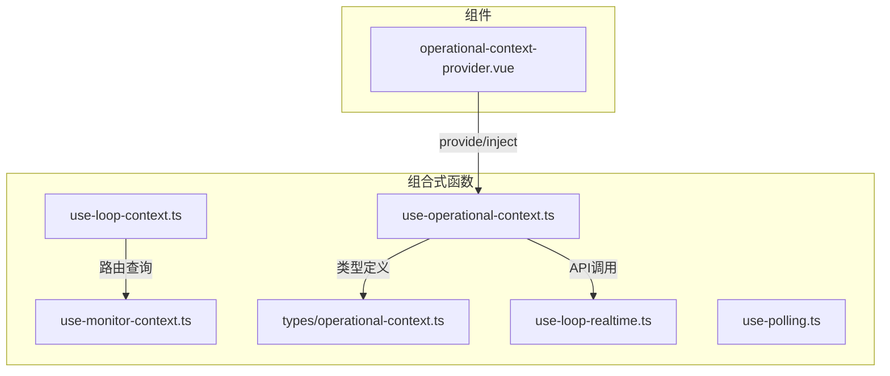
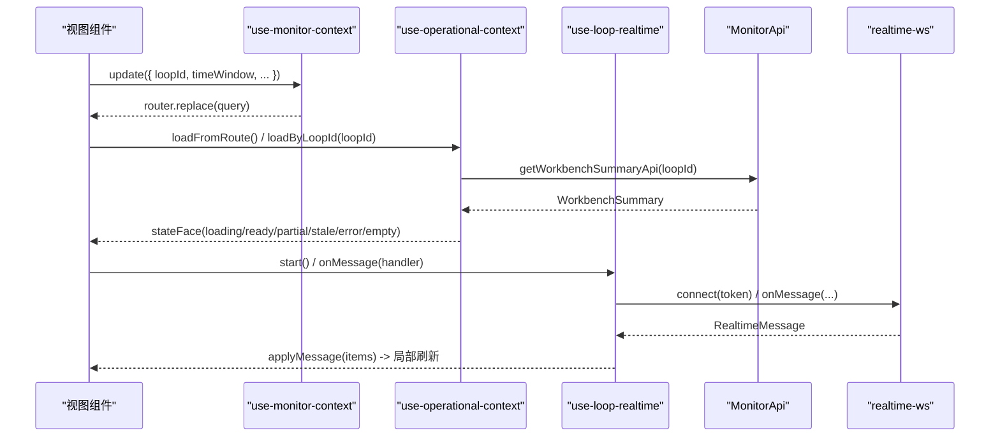
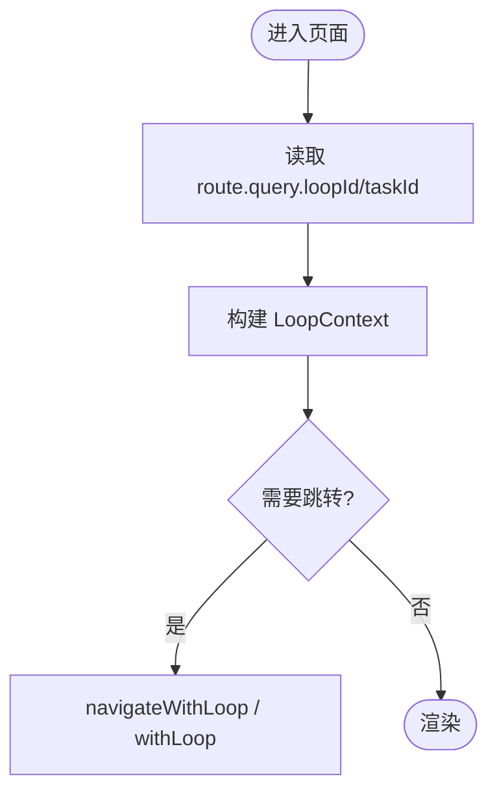
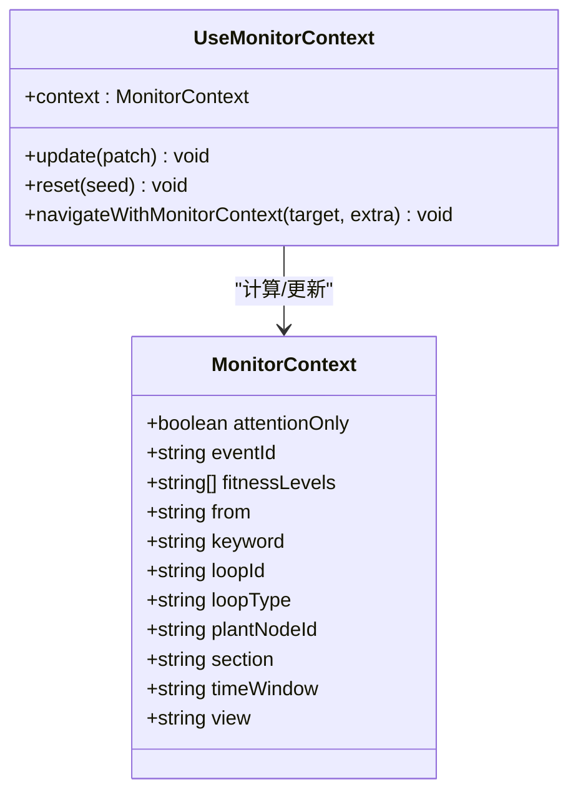
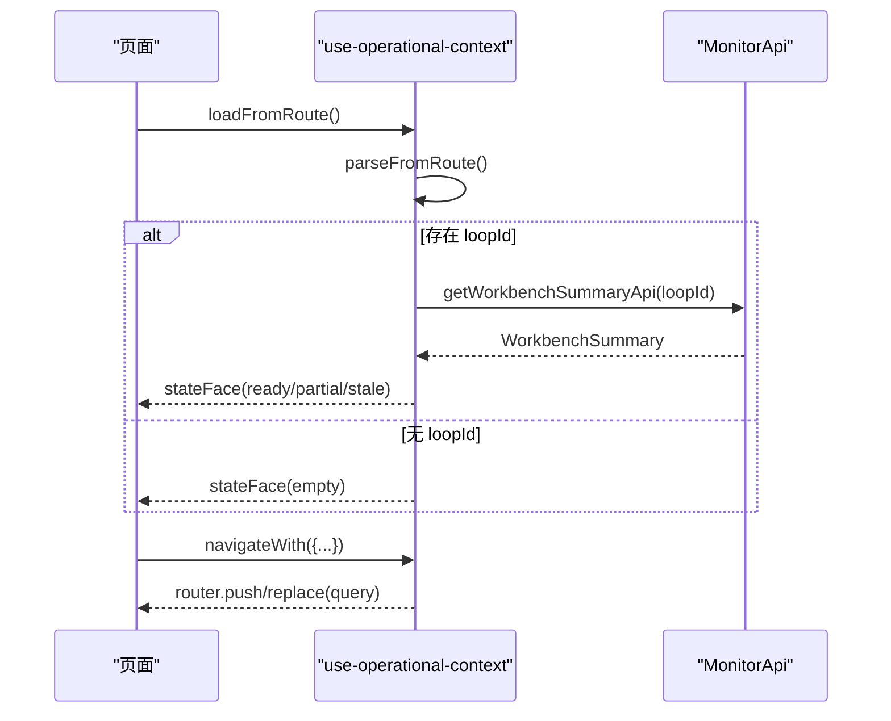
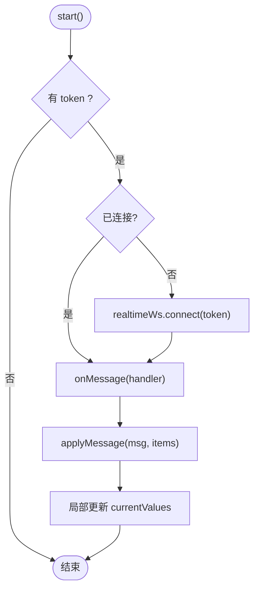
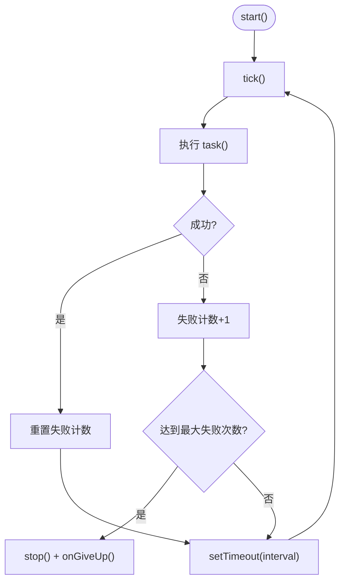
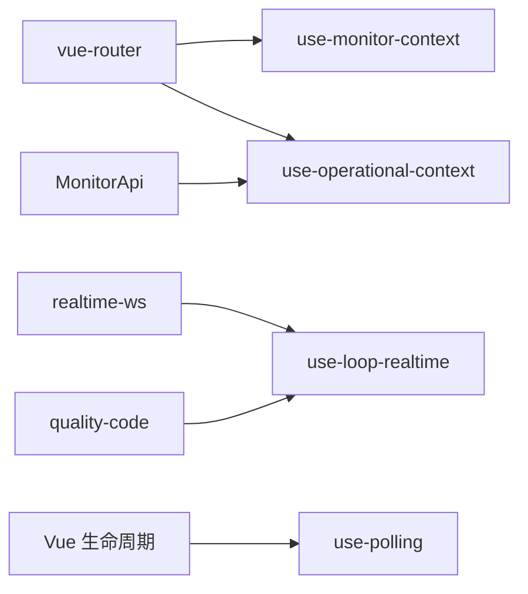

# 组合式函数结构

<cite>
**本文引用的文件**
- [use-loop-context.ts](file://frontend/apps/web-antd/src/composables/use-loop-context.ts)
- [use-monitor-context.ts](file://frontend/apps/web-antd/src/composables/use-monitor-context.ts)
- [use-operational-context.ts](file://frontend/apps/web-antd/src/composables/use-operational-context.ts)
- [operational-context.ts](file://frontend/apps/web-antd/src/composables/types/operational-context.ts)
- [use-loop-realtime.ts](file://frontend/apps/web-antd/src/composables/use-loop-realtime.ts)
- [use-polling.ts](file://frontend/apps/web-antd/src/composables/use-polling.ts)
- [operational-context-provider.vue](file://frontend/apps/web-antd/src/components/clpm/operational-context-provider.vue)
</cite>

## 目录
1. [简介](#简介)
2. [项目结构](#项目结构)
3. [核心组件](#核心组件)
4. [架构总览](#架构总览)
5. [详细组件分析](#详细组件分析)
6. [依赖关系分析](#依赖关系分析)
7. [性能与可维护性](#性能与可维护性)
8. [故障排查指南](#故障排查指南)
9. [结论](#结论)
10. [附录：最佳实践与示例](#附录最佳实践与示例)

## 简介
本文件聚焦前端组合式函数（composables）在“回路上下文、监控上下文、操作上下文”三大职责域中的设计模式与实现细节，系统性阐述命名规范、参数与返回值约定、状态共享机制、生命周期处理，以及跨模块导航与数据加载的统一策略。通过可视化图表与代码级引用，帮助读者快速掌握高质量、可复用的组合式函数编写方法。

## 项目结构
- 组合式函数位于 frontend/apps/web-antd/src/composables 目录，按职责划分：
  - 回路上下文：use-loop-context.ts
  - 监控上下文：use-monitor-context.ts
  - 操作上下文：use-operational-context.ts + types/operational-context.ts
  - 实时数据：use-loop-realtime.ts
  - 通用轮询：use-polling.ts
- 提供跨组件注入的容器组件：components/clpm/operational-context-provider.vue

图示来源
- [use-loop-context.ts:1-81](file://frontend/apps/web-antd/src/composables/use-loop-context.ts#L1-L81)
- [use-monitor-context.ts:1-289](file://frontend/apps/web-antd/src/composables/use-monitor-context.ts#L1-L289)
- [use-operational-context.ts:1-291](file://frontend/apps/web-antd/src/composables/use-operational-context.ts#L1-L291)
- [operational-context.ts:1-117](file://frontend/apps/web-antd/src/composables/types/operational-context.ts#L1-L117)
- [use-loop-realtime.ts:1-271](file://frontend/apps/web-antd/src/composables/use-loop-realtime.ts#L1-L271)
- [use-polling.ts:1-169](file://frontend/apps/web-antd/src/composables/use-polling.ts#L1-L169)
- [operational-context-provider.vue:1-19](file://frontend/apps/web-antd/src/components/clpm/operational-context-provider.vue#L1-L19)

章节来源
- [use-loop-context.ts:1-81](file://frontend/apps/web-antd/src/composables/use-loop-context.ts#L1-L81)
- [use-monitor-context.ts:1-289](file://frontend/apps/web-antd/src/composables/use-monitor-context.ts#L1-L289)
- [use-operational-context.ts:1-291](file://frontend/apps/web-antd/src/composables/use-operational-context.ts#L1-L291)
- [operational-context.ts:1-117](file://frontend/apps/web-antd/src/composables/types/operational-context.ts#L1-L117)
- [use-loop-realtime.ts:1-271](file://frontend/apps/web-antd/src/composables/use-loop-realtime.ts#L1-L271)
- [use-polling.ts:1-169](file://frontend/apps/web-antd/src/composables/use-polling.ts#L1-L169)
- [operational-context-provider.vue:1-19](file://frontend/apps/web-antd/src/components/clpm/operational-context-provider.vue#L1-L19)

## 核心组件
- use-loop-context：统一跨模块跳转的回路上下文（loopId/taskId），封装带上下文的导航方法，避免各页面自行拼接 query 导致上下文丢失。
- use-monitor-context：以 URL 为单一事实源，集中管理监控页筛选、视图模式、时间窗、事件深链等上下文，并提供增量更新、重置、携带上下文跳转能力。
- use-operational-context：全模块统一操作上下文，解析 URL 导航上下文并加载工作台摘要，提供六态计算、派生导航、便捷访问器，支持 provide/inject 跨层级共享。
- use-loop-realtime：复用全局 WebSocket 单例，解析实时消息并局部更新回路值，提供连接状态、降级轮询等能力。
- use-polling：通用轮询 composable，具备防堆积、可见性暂停恢复、失败熔断、自动清理等特性。

章节来源
- [use-loop-context.ts:1-81](file://frontend/apps/web-antd/src/composables/use-loop-context.ts#L1-L81)
- [use-monitor-context.ts:1-289](file://frontend/apps/web-antd/src/composables/use-monitor-context.ts#L1-L289)
- [use-operational-context.ts:1-291](file://frontend/apps/web-antd/src/composables/use-operational-context.ts#L1-L291)
- [use-loop-realtime.ts:1-271](file://frontend/apps/web-antd/src/composables/use-loop-realtime.ts#L1-L271)
- [use-polling.ts:1-169](file://frontend/apps/web-antd/src/composables/use-polling.ts#L1-L169)

## 架构总览
组合式函数围绕“URL 即真相源”的原则组织：所有筛选、选择、时间窗、深链接均从路由 query 读取并通过 router.replace 更新；业务展示字段由后端 API 返回的单一事实源驱动；跨组件共享通过 provide/inject 完成。

图示来源
- [use-monitor-context.ts:159-267](file://frontend/apps/web-antd/src/composables/use-monitor-context.ts#L159-L267)
- [use-operational-context.ts:75-162](file://frontend/apps/web-antd/src/composables/use-operational-context.ts#L75-L162)
- [use-loop-realtime.ts:103-270](file://frontend/apps/web-antd/src/composables/use-loop-realtime.ts#L103-L270)

## 详细组件分析

### 使用模式与命名规范
- 命名：统一以 use- 前缀命名组合式函数，语义清晰（如 use-loop-context、use-monitor-context）。
- 参数：优先使用对象参数进行扩展（便于向后兼容），布尔型开关默认 false。
- 返回值：返回包含状态与方法的对象，状态使用 computed/ref 暴露响应式，方法负责副作用（路由更新、API 调用）。
- 错误处理：内部捕获异常并暴露 error 状态或抛出明确错误信息，供上层 UI 呈现。
- 生命周期：在组合式函数内监听路由变化、注册/注销事件、定时器，并在销毁时清理资源。

章节来源
- [use-monitor-context.ts:159-267](file://frontend/apps/web-antd/src/composables/use-monitor-context.ts#L159-L267)
- [use-operational-context.ts:66-252](file://frontend/apps/web-antd/src/composables/use-operational-context.ts#L66-L252)
- [use-loop-realtime.ts:103-270](file://frontend/apps/web-antd/src/composables/use-loop-realtime.ts#L103-L270)
- [use-polling.ts:53-168](file://frontend/apps/web-antd/src/composables/use-polling.ts#L53-L168)

### 回路上下文 use-loop-context
- 职责：统一 ?loopId=/ ?taskId= 的跨模块跳转规范，提供 navigateWithLoop/navigateWithTask/withLoop 等方法。
- 数据流：从当前路由 query 计算 loopId/taskId，构造 context 对象，导出便捷导航方法。
- 优势：避免各页面自行拼接 query，减少上下文丢失风险。

图示来源
- [use-loop-context.ts:28-79](file://frontend/apps/web-antd/src/composables/use-loop-context.ts#L28-L79)

章节来源
- [use-loop-context.ts:1-81](file://frontend/apps/web-antd/src/composables/use-loop-context.ts#L1-L81)

### 监控上下文 use-monitor-context
- 职责：将 view、loopId、plantNodeId、loopType、keyword、attentionOnly、timeWindow、eventId、section、from、fitnessLevels 等全部映射到 URL query，作为唯一事实源。
- 能力：
  - update(patch)：增量合并到现有 query，未传字段保留原值，传 null 表示清除。
  - reset(seed)：仅保留 seed 中指定字段，其余清空。
  - navigateWithMonitorContext(target, extra)：携带已知上下文跳转。
  - watchMonitorField(fields, cb)：监听指定字段变化触发重载。
- 解析规则：对时间窗、视图模式、区锚点、适用性等级等进行白名单校验与回退默认值。

图示来源
- [use-monitor-context.ts:34-48](file://frontend/apps/web-antd/src/composables/use-monitor-context.ts#L34-L48)
- [use-monitor-context.ts:159-267](file://frontend/apps/web-antd/src/composables/use-monitor-context.ts#L159-L267)

章节来源
- [use-monitor-context.ts:1-289](file://frontend/apps/web-antd/src/composables/use-monitor-context.ts#L1-L289)

### 操作上下文 use-operational-context
- 职责：
  - 解析 URL 导航上下文（loopId、from、section、anchor、eventId、trackerId、taskId、timeWindow、plantNodeId）。
  - 调用 getWorkbenchSummaryApi 加载工作台摘要，统一管理 loading/error/summary。
  - 提供 navigateWith/updateUrl 等跨模块导航 API。
  - 计算六态：empty/error/loading/partial/ready/stale。
  - 提供便捷访问器（assessment、diagnosis、tuning、trackerTimeline、dataHealth、scoreTrend、activeAttention、lifecycle 等）。
- 生命周期：监听 route.fullPath 自动重载；watch 触发 loadFromRoute/loadByLoopId。
- 跨组件共享：通过 provideOperationalContext/injectOperationalContext 实现。

图示来源
- [use-operational-context.ts:75-162](file://frontend/apps/web-antd/src/composables/use-operational-context.ts#L75-L162)
- [use-operational-context.ts:164-252](file://frontend/apps/web-antd/src/composables/use-operational-context.ts#L164-L252)

章节来源
- [use-operational-context.ts:1-291](file://frontend/apps/web-antd/src/composables/use-operational-context.ts#L1-L291)
- [operational-context.ts:1-117](file://frontend/apps/web-antd/src/composables/types/operational-context.ts#L1-L117)

### 实时数据 use-loop-realtime
- 职责：复用全局 realtimeWs 单例，解析 tagCode 并局部更新匹配回路的 currentValues；提供连接状态三态、降级轮询、页面级消息回调注册与取消。
- 关键点：
  - MODE 自定义映射以 REST 返回为权威，WS 只做安全默认映射。
  - PV 质量码统一走 mapQualityToLabel。
  - 启动/停止轮询降级，避免重复创建定时器。
  - 组件卸载时自动清理订阅与定时器。

图示来源
- [use-loop-realtime.ts:103-270](file://frontend/apps/web-antd/src/composables/use-loop-realtime.ts#L103-L270)

章节来源
- [use-loop-realtime.ts:1-271](file://frontend/apps/web-antd/src/composables/use-loop-realtime.ts#L1-L271)

### 通用轮询 use-polling
- 职责：统一轮询行为，防堆积、页面隐藏暂停恢复、失败熔断、自动清理。
- 关键特性：
  - 递归 setTimeout 保证上一次任务完成后才排定下一次。
  - 连续失败达到阈值后停止并回调 onGiveUp。
  - 页面恢复可见时可立即补跑一次。
  - onScopeDispose 自动清理。

图示来源
- [use-polling.ts:53-168](file://frontend/apps/web-antd/src/composables/use-polling.ts#L53-L168)

章节来源
- [use-polling.ts:1-169](file://frontend/apps/web-antd/src/composables/use-polling.ts#L1-L169)

### 跨组件共享 operational-context-provider
- 作用：在组件树顶部 provide 一个 OperationalContext 实例，子组件可通过 inject 获取，避免逐层透传。
- 用法：在父组件包裹 <OperationalContextProvider>，子组件内部调用 injectOperationalContext() 或 orThrow 版本。

章节来源
- [operational-context-provider.vue:1-19](file://frontend/apps/web-antd/src/components/clpm/operational-context-provider.vue#L1-L19)
- [use-operational-context.ts:258-291](file://frontend/apps/web-antd/src/composables/use-operational-context.ts#L258-L291)

## 依赖关系分析
- use-monitor-context 依赖 vue-router 的 useRoute/useRouter，用于读写 query 与替换路由。
- use-operational-context 依赖 MonitorApi.WorkbenchSummary 类型与 API 调用，同时依赖 vue-router 与 Vue 的 provide/inject。
- use-loop-realtime 依赖全局 realtimeWs 单例与质量码映射工具。
- use-polling 依赖 Vue 的 onScopeDispose 与 document.visibilitychange。

图示来源
- [use-monitor-context.ts:20-24](file://frontend/apps/web-antd/src/composables/use-monitor-context.ts#L20-L24)
- [use-operational-context.ts:12-25](file://frontend/apps/web-antd/src/composables/use-operational-context.ts#L12-L25)
- [use-loop-realtime.ts:15-23](file://frontend/apps/web-antd/src/composables/use-loop-realtime.ts#L15-L23)
- [use-polling.ts:23-26](file://frontend/apps/web-antd/src/composables/use-polling.ts#L23-L26)

章节来源
- [use-monitor-context.ts:1-289](file://frontend/apps/web-antd/src/composables/use-monitor-context.ts#L1-L289)
- [use-operational-context.ts:1-291](file://frontend/apps/web-antd/src/composables/use-operational-context.ts#L1-L291)
- [use-loop-realtime.ts:1-271](file://frontend/apps/web-antd/src/composables/use-loop-realtime.ts#L1-L271)
- [use-polling.ts:1-169](file://frontend/apps/web-antd/src/composables/use-polling.ts#L1-L169)

## 性能与可维护性
- URL 单一事实源：所有筛选与上下文变更通过 router.replace 同步，避免多源不一致导致的额外重算。
- 白名单校验：对时间窗、视图模式、区锚点、适用性等级等做严格校验与回退，降低无效请求与渲染抖动。
- 实时数据局部更新：基于 tagName 匹配只更新对应项 currentValues，减少整表重绘。
- 轮询防堆积与熔断：避免慢请求叠加造成卡顿，连续失败自动停止并提示重试。
- 资源清理：组合式函数在销毁时移除事件监听、定时器与订阅，防止内存泄漏。

[本节为通用指导，不直接分析具体文件]

## 故障排查指南
- 监控上下文未生效
  - 检查是否通过 update/reset 正确写入 query，且字段在白名单内。
  - 确认页面是否正确监听相关字段变化并触发数据重载。
- 操作上下文状态异常
  - 检查 stateFace 是否为 loading/error/empty/partial/stale/ready，定位问题阶段。
  - 若 partial，查看 unavailableSections 确定失败来源。
- 实时数据不更新
  - 确认已调用 start() 且有 token；检查 onMessage 是否注册；验证 applyMessage 是否能匹配 tagName。
  - 若 WS 断连，确认已启用 startFallback 轮询降级。
- 轮询不停止
  - 检查是否在组件卸载时调用 stop；确认 pauseOnHidden 配置与文档可见性事件。

章节来源
- [use-monitor-context.ts:159-267](file://frontend/apps/web-antd/src/composables/use-monitor-context.ts#L159-L267)
- [use-operational-context.ts:75-172](file://frontend/apps/web-antd/src/composables/use-operational-context.ts#L75-L172)
- [use-loop-realtime.ts:103-270](file://frontend/apps/web-antd/src/composables/use-loop-realtime.ts#L103-L270)
- [use-polling.ts:53-168](file://frontend/apps/web-antd/src/composables/use-polling.ts#L53-L168)

## 结论
本项目的前端组合式函数围绕“URL 即真相源”和“单一事实源”的设计原则，构建了清晰的上下文管理与状态共享机制。通过统一的命名与接口约定、严格的输入校验与回退策略、完善的生命周期与资源清理，实现了高内聚、低耦合、易测试的可复用能力。结合实时数据与轮询降级，保障了用户体验与系统稳定性。

[本节为总结性内容，不直接分析具体文件]

## 附录：最佳实践与示例
- 命名与接口
  - 使用 use- 前缀；参数采用对象形式；返回值包含状态与方法。
  - 示例路径：[use-monitor-context.ts:159-267](file://frontend/apps/web-antd/src/composables/use-monitor-context.ts#L159-L267)
- 上下文管理
  - 所有筛选与选择通过 update/reset 写入 URL；跨模块跳转使用 navigateWith* 方法。
  - 示例路径：[use-monitor-context.ts:195-246](file://frontend/apps/web-antd/src/composables/use-monitor-context.ts#L195-L246)
- 状态共享
  - 使用 provideOperationalContext/injectOperationalContext 在组件树中共享上下文。
  - 示例路径：[use-operational-context.ts:258-291](file://frontend/apps/web-antd/src/composables/use-operational-context.ts#L258-L291)
- 实时数据
  - 复用全局 WS 单例，局部更新 currentValues；必要时启用轮询降级。
  - 示例路径：[use-loop-realtime.ts:103-270](file://frontend/apps/web-antd/src/composables/use-loop-realtime.ts#L103-L270)
- 轮询
  - 使用 use-polling 统一轮询行为，避免重复逻辑与资源泄漏。
  - 示例路径：[use-polling.ts:53-168](file://frontend/apps/web-antd/src/composables/use-polling.ts#L53-L168)

[本节为通用指导，不直接分析具体文件]