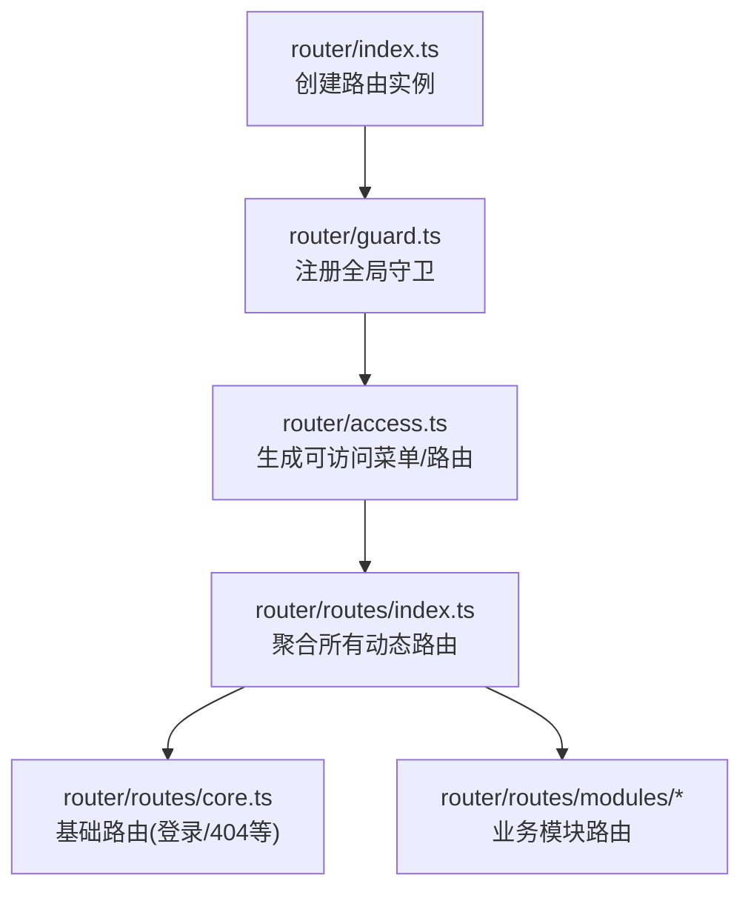
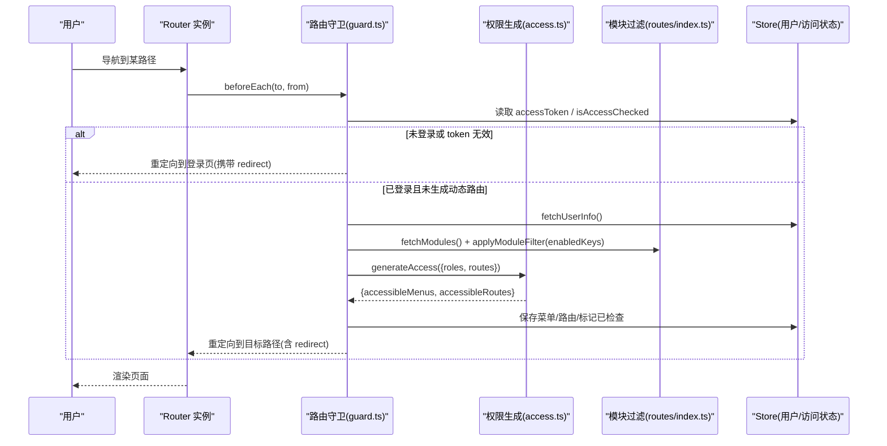
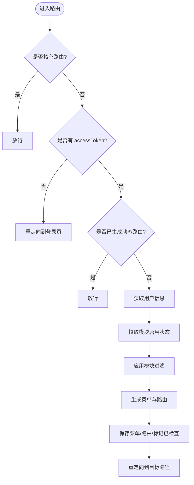
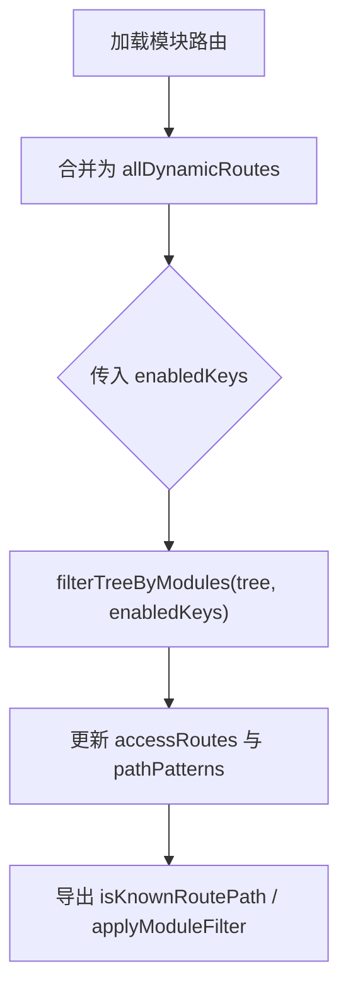
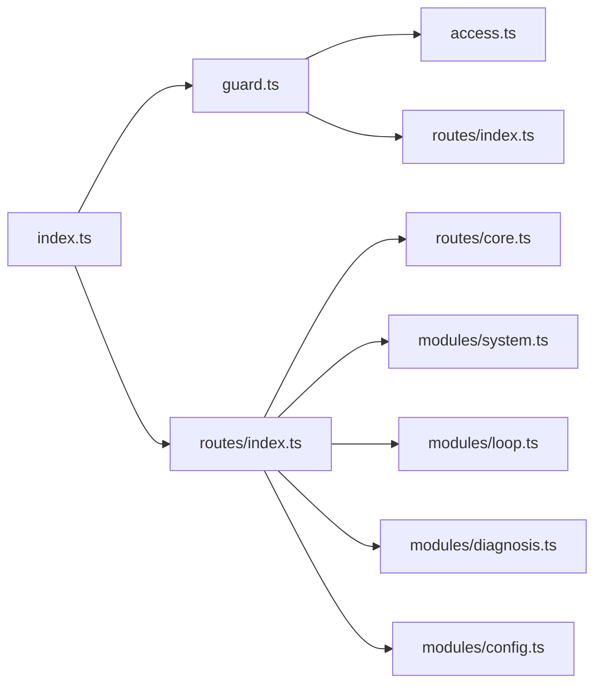

# 路由组织结构

<cite>
**本文引用的文件**
- [frontend/apps/web-antd/src/router/index.ts](file://frontend/apps/web-antd/src/router/index.ts)
- [frontend/apps/web-antd/src/router/guard.ts](file://frontend/apps/web-antd/src/router/guard.ts)
- [frontend/apps/web-antd/src/router/access.ts](file://frontend/apps/web-antd/src/router/access.ts)
- [frontend/apps/web-antd/src/router/routes/index.ts](file://frontend/apps/web-antd/src/router/routes/index.ts)
- [frontend/apps/web-antd/src/router/routes/core.ts](file://frontend/apps/web-antd/src/router/routes/core.ts)
- [frontend/apps/web-antd/src/router/routes/modules/system.ts](file://frontend/apps/web-antd/src/router/routes/modules/system.ts)
- [frontend/apps/web-antd/src/router/routes/modules/loop.ts](file://frontend/apps/web-antd/src/router/routes/modules/loop.ts)
- [frontend/apps/web-antd/src/router/routes/modules/diagnosis.ts](file://frontend/apps/web-antd/src/router/routes/modules/diagnosis.ts)
- [frontend/apps/web-antd/src/router/routes/modules/config.ts](file://frontend/apps/web-antd/src/router/routes/modules/config.ts)
</cite>

## 目录
1. [简介](#简介)
2. [项目结构](#项目结构)
3. [核心组件](#核心组件)
4. [架构总览](#架构总览)
5. [详细组件分析](#详细组件分析)
6. [依赖关系分析](#依赖关系分析)
7. [性能考量](#性能考量)
8. [故障排查指南](#故障排查指南)
9. [结论](#结论)
10. [附录：新增路由与角色权限配置示例](#附录新增路由与角色权限配置示例)

## 简介
本文件聚焦前端路由组织结构的系统化说明，覆盖 router 目录下 routes（路由定义）、access（权限控制）、guard（路由守卫）三大模块的职责划分与协作方式。重点阐述：
- 路由模块化配置与动态路由生成机制
- 基于角色的访问控制（RBAC）与菜单/路由过滤
- 路由元数据设计、嵌套路由处理与懒加载策略
- 如何新增路由并实现基于角色的访问控制

## 项目结构
前端路由采用“集中式入口 + 模块化子路由 + 统一守卫”的组织方式：
- 路由实例创建与全局行为在 index.ts
- 路由守卫集中在 guard.ts，负责进度条、登录态校验、动态路由生成与重定向
- 权限与菜单/路由生成在 access.ts，结合后端菜单数据与页面映射表进行动态构建
- 路由定义分为 core（基础路由）与 modules（业务模块路由），由 routes/index.ts 聚合并通过模块开关过滤

图表来源
- [frontend/apps/web-antd/src/router/index.ts:15-37](file://frontend/apps/web-antd/src/router/index.ts#L15-L37)
- [frontend/apps/web-antd/src/router/guard.ts:145-150](file://frontend/apps/web-antd/src/router/guard.ts#L145-L150)
- [frontend/apps/web-antd/src/router/access.ts:17-40](file://frontend/apps/web-antd/src/router/access.ts#L17-L40)
- [frontend/apps/web-antd/src/router/routes/index.ts:1-29](file://frontend/apps/web-antd/src/router/routes/index.ts#L1-L29)

章节来源
- [frontend/apps/web-antd/src/router/index.ts:1-38](file://frontend/apps/web-antd/src/router/index.ts#L1-L38)
- [frontend/apps/web-antd/src/router/routes/index.ts:1-102](file://frontend/apps/web-antd/src/router/routes/index.ts#L1-L102)

## 核心组件
- 路由实例与滚动行为：在 index.ts 中创建 Vue Router 实例，设置 history 模式与滚动行为，并导出重置静态路由方法。
- 路由守卫：guard.ts 提供通用守卫（进度条、已加载路径记录）和权限守卫（登录态检查、动态路由生成、模块过滤、重定向）。
- 权限与动态路由：access.ts 通过 generateAccessible 将后端菜单与本地页面映射表合并，生成最终菜单与路由；支持无权限跳转 403 页面。
- 路由聚合与模块过滤：routes/index.ts 动态导入 modules 下的路由文件，合并为 allDynamicRoutes，并提供 applyModuleFilter 按启用模块过滤路由树，以及 isKnownRoutePath 判断路径是否属于已知路由。
- 基础路由：routes/core.ts 定义根路由、认证布局及登录相关子路由，以及全局 404 兜底路由。

章节来源
- [frontend/apps/web-antd/src/router/index.ts:15-37](file://frontend/apps/web-antd/src/router/index.ts#L15-L37)
- [frontend/apps/web-antd/src/router/guard.ts:18-139](file://frontend/apps/web-antd/src/router/guard.ts#L18-L139)
- [frontend/apps/web-antd/src/router/access.ts:17-40](file://frontend/apps/web-antd/src/router/access.ts#L17-L40)
- [frontend/apps/web-antd/src/router/routes/index.ts:15-102](file://frontend/apps/web-antd/src/router/routes/index.ts#L15-L102)
- [frontend/apps/web-antd/src/router/routes/core.ts:24-95](file://frontend/apps/web-antd/src/router/routes/core.ts#L24-L95)

## 架构总览
下图展示了从导航到渲染的完整流程：用户触发导航 → 路由守卫拦截 → 校验登录态与模块状态 → 拉取用户信息 → 生成菜单与路由 → 注入路由并继续导航。

图表来源
- [frontend/apps/web-antd/src/router/guard.ts:48-139](file://frontend/apps/web-antd/src/router/guard.ts#L48-L139)
- [frontend/apps/web-antd/src/router/access.ts:17-40](file://frontend/apps/web-antd/src/router/access.ts#L17-L40)
- [frontend/apps/web-antd/src/router/routes/index.ts:76-93](file://frontend/apps/web-antd/src/router/routes/index.ts#L76-L93)

## 详细组件分析

### 路由实例与初始化（index.ts）
- 创建 Vue Router 实例，根据环境变量选择 hash/history 模式。
- 配置滚动行为：优先恢复到上次位置，否则平滑滚动到锚点或顶部。
- 注册路由守卫，并暴露重置静态路由的方法以便热更新场景使用。

章节来源
- [frontend/apps/web-antd/src/router/index.ts:15-37](file://frontend/apps/web-antd/src/router/index.ts#L15-L37)

### 路由守卫（guard.ts）
- 通用守卫：记录已加载路径，控制进度条显示/隐藏。
- 权限守卫：
  - 跳过核心路由（如登录页）的权限检查。
  - 未登录时重定向到登录页并携带 redirect。
  - 已登录但未生成动态路由时：验证 token、获取用户信息、拉取模块启用状态、应用模块过滤、生成菜单与路由、保存状态并重定向到目标路径。
- 关键交互：与 store（用户/访问状态）、composables（模块启用状态）、routes（模块过滤）协同工作。

图表来源
- [frontend/apps/web-antd/src/router/guard.ts:18-139](file://frontend/apps/web-antd/src/router/guard.ts#L18-L139)

章节来源
- [frontend/apps/web-antd/src/router/guard.ts:18-139](file://frontend/apps/web-antd/src/router/guard.ts#L18-L139)

### 权限与动态路由生成（access.ts）
- 通过 import.meta.glob 收集 views 下所有 .vue 文件作为页面映射表。
- 将 BasicLayout、IFrameView 等布局组件加入布局映射表。
- 调用 generateAccessible 根据当前访问模式与后端菜单数据，生成可访问菜单与路由；支持无权限跳转 403 页面。

章节来源
- [frontend/apps/web-antd/src/router/access.ts:17-40](file://frontend/apps/web-antd/src/router/access.ts#L17-L40)

### 路由聚合与模块过滤（routes/index.ts）
- 动态导入 modules 下的路由模块，合并为 allDynamicRoutes。
- 提供 filterTreeByModules 递归过滤：父级 meta.module 不在启用集合则整棵子树移除；无 module 的路由保留以兼容旧路由。
- applyModuleFilter 在登录后根据 enabledKeys 更新 accessRoutes 与动态路径模式集合，供 isKnownRoutePath 判断未知路径。
- 导出 coreRouteNames、isKnownRoutePath 等工具供守卫与其他模块使用。

图表来源
- [frontend/apps/web-antd/src/router/routes/index.ts:7-29](file://frontend/apps/web-antd/src/router/routes/index.ts#L7-L29)
- [frontend/apps/web-antd/src/router/routes/index.ts:41-93](file://frontend/apps/web-antd/src/router/routes/index.ts#L41-L93)

章节来源
- [frontend/apps/web-antd/src/router/routes/index.ts:1-102](file://frontend/apps/web-antd/src/router/routes/index.ts#L1-L102)

### 基础路由（routes/core.ts）
- 根路由与认证布局：包含登录、验证码登录、二维码登录、忘记密码、注册等子路由。
- 全局 404 兜底路由：隐藏于面包屑、菜单、标签页，用于未匹配路径。

章节来源
- [frontend/apps/web-antd/src/router/routes/core.ts:24-95](file://frontend/apps/web-antd/src/router/routes/core.ts#L24-L95)

### 业务模块路由示例
- 系统管理（system.ts）：展示系统菜单分组与子路由，标注 authority、icon、order、title、module 等元数据；部分子路由仅 ADMIN 可见。
- 回路兼容（loop.ts）：旧路径重定向到新工作台，保持书签/E2E 兼容。
- 诊断（diagnosis.ts）：两页式设计（工作台/记录），不同角色对发起与查看有不同权限。
- 配置（config.ts）：结构性配置集中管理，包含链路、测点、回路、工厂、指标、诊断、预警规则等；大量 legacy redirect 保护旧路径。

章节来源
- [frontend/apps/web-antd/src/router/routes/modules/system.ts:15-119](file://frontend/apps/web-antd/src/router/routes/modules/system.ts#L15-L119)
- [frontend/apps/web-antd/src/router/routes/modules/loop.ts:19-62](file://frontend/apps/web-antd/src/router/routes/modules/loop.ts#L19-L62)
- [frontend/apps/web-antd/src/router/routes/modules/diagnosis.ts:14-59](file://frontend/apps/web-antd/src/router/routes/modules/diagnosis.ts#L14-L59)
- [frontend/apps/web-antd/src/router/routes/modules/config.ts:18-236](file://frontend/apps/web-antd/src/router/routes/modules/config.ts#L18-L236)

## 依赖关系分析
- 入口依赖：index.ts 依赖 guard.ts 与 routes/index.ts。
- 守卫依赖：guard.ts 依赖 stores（用户/访问状态）、preferences、utils（进度条）、composables（模块启用）、routes（模块过滤）、access.ts（动态路由生成）。
- 权限生成依赖：access.ts 依赖 @vben/access、@vben/preferences、API（获取菜单）、layouts、locales。
- 路由聚合依赖：routes/index.ts 依赖 @vben/utils（合并与遍历）、core.ts（基础路由）。

图表来源
- [frontend/apps/web-antd/src/router/index.ts:9-11](file://frontend/apps/web-antd/src/router/index.ts#L9-L11)
- [frontend/apps/web-antd/src/router/guard.ts:8-12](file://frontend/apps/web-antd/src/router/guard.ts#L8-L12)
- [frontend/apps/web-antd/src/router/access.ts:6-13](file://frontend/apps/web-antd/src/router/access.ts#L6-L13)
- [frontend/apps/web-antd/src/router/routes/index.ts:3-6](file://frontend/apps/web-antd/src/router/routes/index.ts#L3-L6)

章节来源
- [frontend/apps/web-antd/src/router/index.ts:9-11](file://frontend/apps/web-antd/src/router/index.ts#L9-L11)
- [frontend/apps/web-antd/src/router/guard.ts:8-12](file://frontend/apps/web-antd/src/router/guard.ts#L8-L12)
- [frontend/apps/web-antd/src/router/access.ts:6-13](file://frontend/apps/web-antd/src/router/access.ts#L6-L13)
- [frontend/apps/web-antd/src/router/routes/index.ts:3-6](file://frontend/apps/web-antd/src/router/routes/index.ts#L3-L6)

## 性能考量
- 懒加载：所有视图与布局均使用动态 import，减少首屏体积。
- 模块过滤：仅在登录后按需过滤路由树，避免重复计算；路径匹配使用预编译的正则集合提升 isKnownRoutePath 性能。
- 进度条：仅在未加载过的页面切换时启动，降低 UI 开销。
- 建议：
  - 新增路由尽量放在 modules 下，便于自动聚合与过滤。
  - 合理设置 meta.order 与 icon，优化菜单排序与渲染。
  - 对高频访问页面可考虑预加载策略（如 prefetch）。

## 故障排查指南
- 登录后仍跳转到登录页：
  - 检查 accessToken 是否存在与有效；若无效会被清空并跳转登录。
  - 确认 fetchUserInfo 成功返回用户信息。
- 动态路由未生效：
  - 确认 isAccessChecked 已被设置为 true。
  - 检查 applyModuleFilter 是否正确执行，enabledKeys 是否包含对应模块。
- 404 而非 403：
  - 若路径不在 dynamicRoutePathPatterns 中，将被视为未知路径返回 404；请确认模块启用与路由定义正确。
- 菜单不显示：
  - 检查后端菜单接口返回数据与 generateAccessible 的 pageMap/layoutMap 映射是否正确。
  - 确认 route.meta.authority 与用户 roles 匹配。

章节来源
- [frontend/apps/web-antd/src/router/guard.ts:66-139](file://frontend/apps/web-antd/src/router/guard.ts#L66-L139)
- [frontend/apps/web-antd/src/router/routes/index.ts:76-93](file://frontend/apps/web-antd/src/router/routes/index.ts#L76-L93)
- [frontend/apps/web-antd/src/router/access.ts:17-40](file://frontend/apps/web-antd/src/router/access.ts#L17-L40)

## 结论
该路由体系通过“模块化路由 + 动态生成 + 统一守卫”的方式，实现了灵活的权限控制与良好的可维护性。核心要点包括：
- 路由按模块拆分，便于扩展与维护。
- 基于角色与模块启用的双重过滤，确保菜单与路由的安全性与一致性。
- 懒加载与路径模式匹配优化了性能。
- 通过元数据（authority、module、order、icon、title）统一管理路由行为与展示。

## 附录：新增路由与角色权限配置示例
以下示例以“新增一个诊断子页面”为例，展示如何在现有结构中配置新路由并实现基于角色的访问控制。

- 步骤一：在 modules 下新增路由文件（例如 diagnosis-new.vue 对应的路由模块）
  - 参考现有模块结构，新建文件并在其中定义路由数组，包含 name、path、component、meta（authority、icon、title、module 等）。
  - 参考路径：[diagnosis.ts:14-59](file://frontend/apps/web-antd/src/router/routes/modules/diagnosis.ts#L14-L59)

- 步骤二：确保模块启用
  - 在登录后，路由守卫会调用 fetchModules 与 applyModuleFilter，若新路由所属模块 key 未被启用，将被过滤掉。
  - 参考路径：[guard.ts:113-116](file://frontend/apps/web-antd/src/router/guard.ts#L113-L116)、[routes/index.ts:76-83](file://frontend/apps/web-antd/src/router/routes/index.ts#L76-L83)

- 步骤三：配置角色权限
  - 在 route.meta.authority 中声明允许的角色列表（如 ADMIN、IC_ENGINEER、PE_ENGINEER 等）。
  - 参考路径：[system.ts:15-119](file://frontend/apps/web-antd/src/router/routes/modules/system.ts#L15-L119)、[diagnosis.ts:14-59](file://frontend/apps/web-antd/src/router/routes/modules/diagnosis.ts#L14-L59)

- 步骤四：测试与验证
  - 使用不同角色登录，验证菜单是否显示、路由是否可访问、无权限时是否跳转 403。
  - 若路径未命中，检查是否被模块过滤或是否为未知路径（404）。
  - 参考路径：[guard.ts:48-139](file://frontend/apps/web-antd/src/router/guard.ts#L48-L139)、[routes/index.ts:86-93](file://frontend/apps/web-antd/src/router/routes/index.ts#L86-L93)

章节来源
- [frontend/apps/web-antd/src/router/routes/modules/diagnosis.ts:14-59](file://frontend/apps/web-antd/src/router/routes/modules/diagnosis.ts#L14-L59)
- [frontend/apps/web-antd/src/router/routes/modules/system.ts:15-119](file://frontend/apps/web-antd/src/router/routes/modules/system.ts#L15-L119)
- [frontend/apps/web-antd/src/router/guard.ts:113-139](file://frontend/apps/web-antd/src/router/guard.ts#L113-L139)
- [frontend/apps/web-antd/src/router/routes/index.ts:76-93](file://frontend/apps/web-antd/src/router/routes/index.ts#L76-L93)