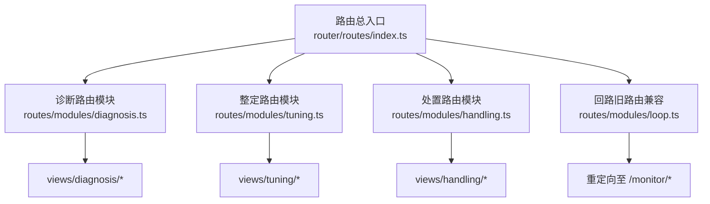
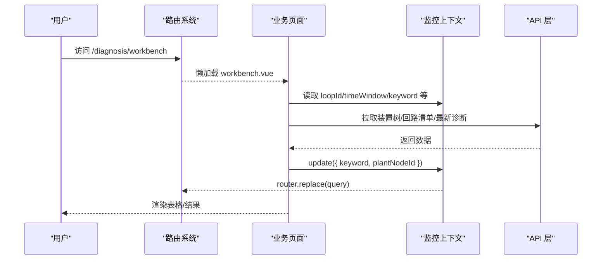
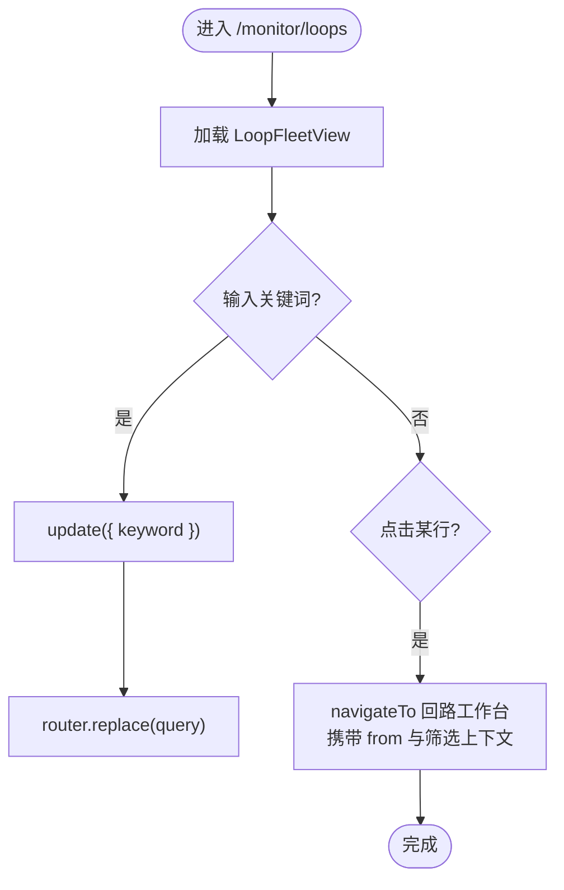
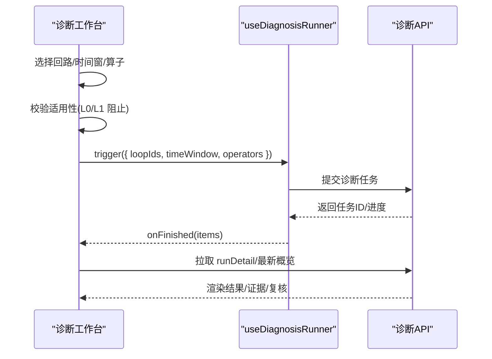
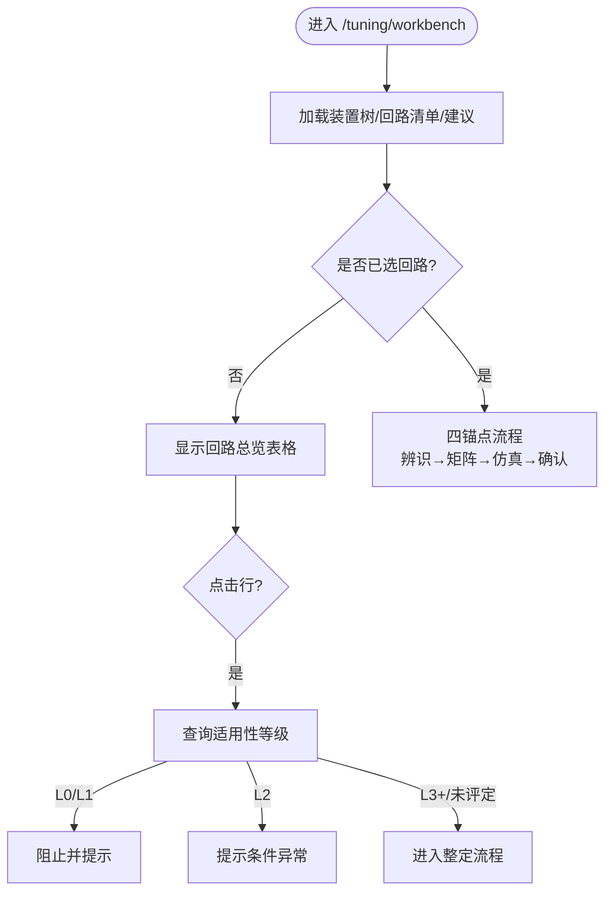
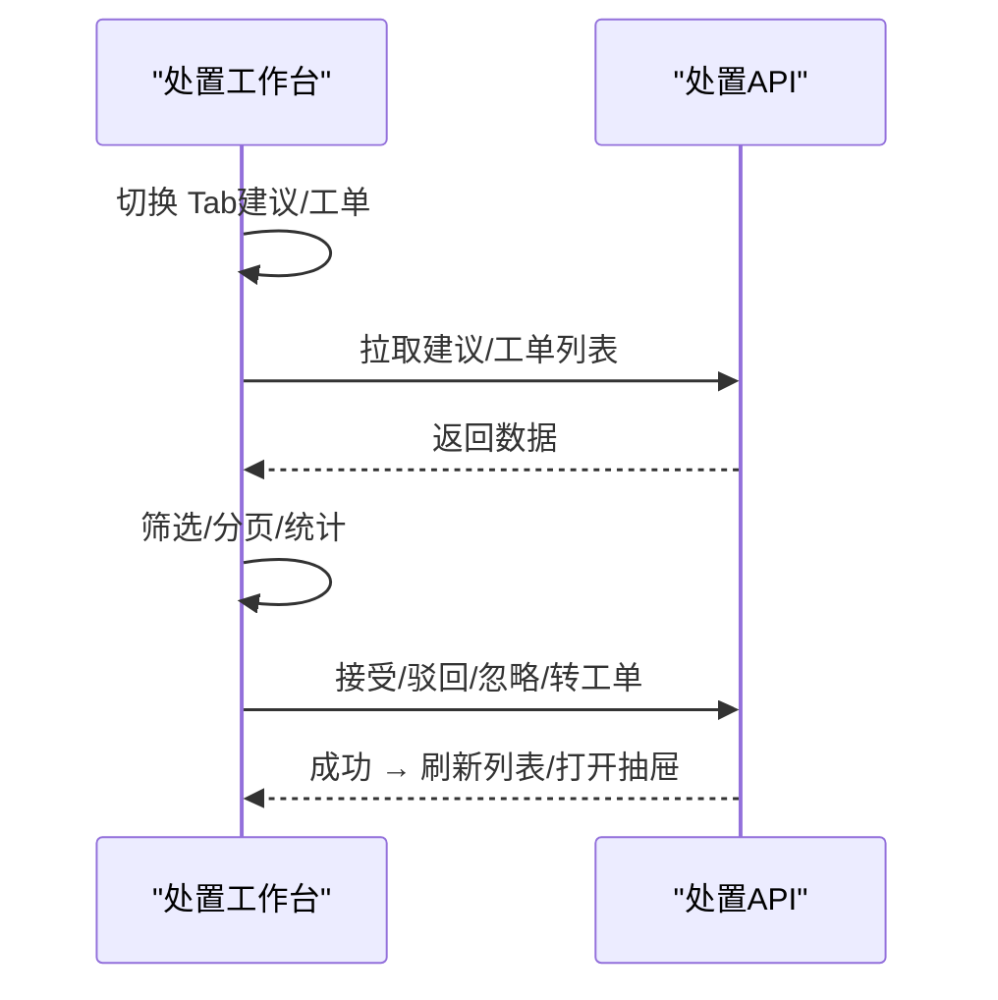
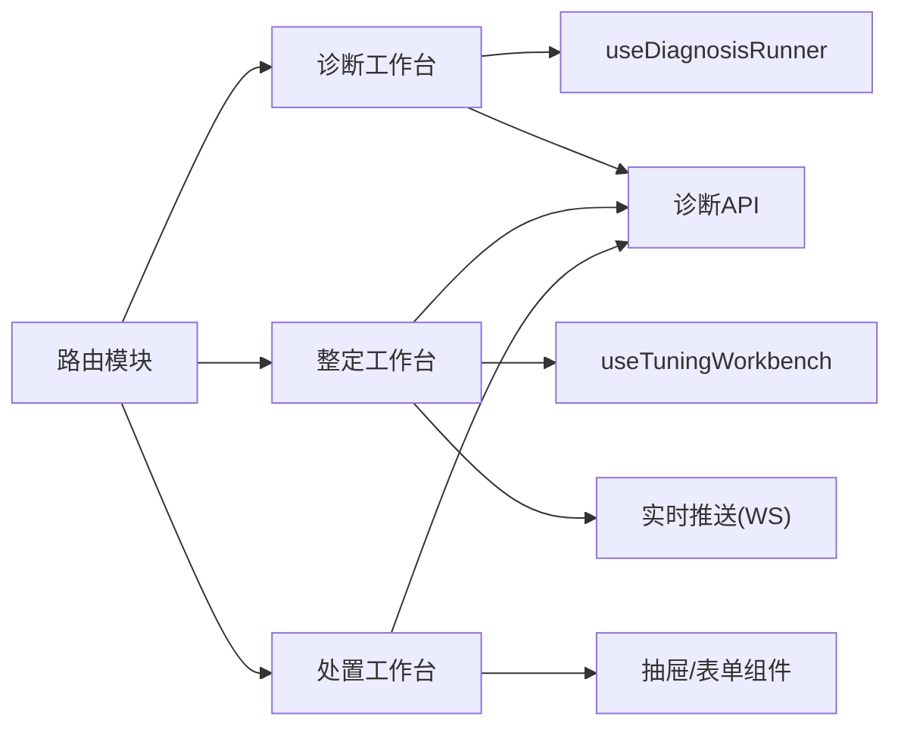

# 页面组件结构

<cite>
**本文引用的文件**
- [路由总入口](file://frontend/apps/web-antd/src/router/routes/index.ts)
- [诊断路由模块](file://frontend/apps/web-antd/src/router/routes/modules/diagnosis.ts)
- [整定路由模块](file://frontend/apps/web-antd/src/router/routes/modules/tuning.ts)
- [处置路由模块](file://frontend/apps/web-antd/src/router/routes/modules/handling.ts)
- [回路旧路由兼容](file://frontend/apps/web-antd/src/router/routes/modules/loop.ts)
- [监控上下文 Composable](file://frontend/apps/web-antd/src/composables/use-monitor-context.ts)
- [监控-回路列表页](file://frontend/apps/web-antd/src/views/monitor/loops.vue)
- [诊断工作台](file://frontend/apps/web-antd/src/views/diagnosis/workbench.vue)
- [整定工作台](file://frontend/apps/web-antd/src/views/tuning/workbench.vue)
- [处置工作台](file://frontend/apps/web-antd/src/views/handling/workbench.vue)
</cite>

## 目录
1. [简介](#简介)
2. [项目结构](#项目结构)
3. [核心组件](#核心组件)
4. [架构总览](#架构总览)
5. [详细组件分析](#详细组件分析)
6. [依赖关系分析](#依赖关系分析)
7. [性能考虑](#性能考虑)
8. [故障排查指南](#故障排查指南)
9. [结论](#结论)
10. [附录：新增页面与页面通信示例](#附录新增页面与页面通信示例)

## 简介
本文件面向前端工程，聚焦 views 目录下四大业务模块（monitor、diagnosis、tuning、handling）的页面组织原则、页面文件结构与子目录组织、组件复用策略、页面间导航关系、状态传递机制与路由配置模式。文档通过代码级图示与路径引用，帮助读者快速理解并正确扩展新页面与跨页面通信。

## 项目结构
- 路由采用“动态模块合并”的模式：所有业务路由以 modules/*.ts 形式声明，由路由总入口统一加载并按启用模块过滤。
- 每个业务模块在 views 下拥有独立目录，遵循“页面 + components + composables + constants”的常见分层；复杂流程使用单页多锚点或抽屉/弹窗承载细节。
- 监控上下文通过 composable 将筛选、时间窗、目标回路等状态映射到 URL query，实现“URL 即真相源”，便于深链接与跨页面共享上下文。

图表来源
- [路由总入口:1-102](file://frontend/apps/web-antd/src/router/routes/index.ts#L1-L102)
- [诊断路由模块:1-59](file://frontend/apps/web-antd/src/router/routes/modules/diagnosis.ts#L1-L59)
- [整定路由模块:1-76](file://frontend/apps/web-antd/src/router/routes/modules/tuning.ts#L1-L76)
- [处置路由模块:1-68](file://frontend/apps/web-antd/src/router/routes/modules/handling.ts#L1-L68)
- [回路旧路由兼容:1-62](file://frontend/apps/web-antd/src/router/routes/modules/loop.ts#L1-L62)

章节来源
- [路由总入口:1-102](file://frontend/apps/web-antd/src/router/routes/index.ts#L1-L102)

## 核心组件
- 监控上下文 Composable：集中管理 view、loopId、plantNodeId、keyword、timeWindow、section、from 等字段，提供 update/reset/navigateWithMonitorContext/watchMonitorField 等方法，保证所有监控相关页面的筛选与跳转都基于 URL。
- 页面工具栏与数据画布：ClpmPageToolbar、ClpmDataCanvas 等通用组件在各页面中复用，统一页头、操作区与内容区布局。
- 各业务工作台：诊断/整定/处置工作台均采用“左脊柱（装置树+清单）+ 右主区（配置/结果/流程）”的布局范式，提升一致性。

章节来源
- [监控上下文 Composable:1-289](file://frontend/apps/web-antd/src/composables/use-monitor-context.ts#L1-L289)
- [监控-回路列表页:1-102](file://frontend/apps/web-antd/src/views/monitor/loops.vue#L1-L102)

## 架构总览
下图展示从路由到页面再到上下文与 API 的整体交互：路由按模块懒加载页面，页面通过 Composable 读取/更新 URL 上下文，调用 API 获取数据，并通过事件或回调驱动 UI。

图表来源
- [路由总入口:1-102](file://frontend/apps/web-antd/src/router/routes/index.ts#L1-L102)
- [诊断路由模块:1-59](file://frontend/apps/web-antd/src/router/routes/modules/diagnosis.ts#L1-L59)
- [监控上下文 Composable:159-267](file://frontend/apps/web-antd/src/composables/use-monitor-context.ts#L159-L267)
- [诊断工作台:1-800](file://frontend/apps/web-antd/src/views/diagnosis/workbench.vue#L1-L800)

## 详细组件分析

### 监控模块（monitor）
- 页面组织
  - loops.vue：回路列表页，复用 LoopFleetView 组件承载统计卡、筛选、表格与实时推送；关键词搜索写入 URL keyword，支持浏览器前进后退同步。
  - attention.vue：关注项页面（与监控上下文联动）。
- 页面导航与状态传递
  - 行点击跳转到回路工作台，携带 from=/monitor/loops 及筛选上下文，使用 navigateWithMonitorContext 保持上下文连贯。
- 组件复用策略
  - 通过 ClpmPageToolbar 统一页头；LoopFleetView 封装统计与表格逻辑，减少重复代码。

图表来源
- [监控-回路列表页:1-102](file://frontend/apps/web-antd/src/views/monitor/loops.vue#L1-L102)
- [监控上下文 Composable:159-267](file://frontend/apps/web-antd/src/composables/use-monitor-context.ts#L159-L267)

章节来源
- [监控-回路列表页:1-102](file://frontend/apps/web-antd/src/views/monitor/loops.vue#L1-L102)
- [监控上下文 Composable:1-289](file://frontend/apps/web-antd/src/composables/use-monitor-context.ts#L1-L289)

### 诊断模块（diagnosis）
- 页面组织
  - workbench.vue：诊断工作台，左侧为装置树与回路多选，右侧为配置（时间窗/算子）与结果；包含详情弹窗、证据抽屉、历史抽屉、复核抽屉等子组件。
  - records.vue：诊断记录（历史与导出）。
  - components/：诊断详情、结果面板、证据/历史/复核抽屉等可复用子组件。
  - composables/use-diagnosis-runner.ts：封装诊断任务执行、进度与完成后刷新。
- 页面导航与状态传递
  - 支持从回路工作台跳入（?from=workbench），并在顶部提供返回按钮；概览行点击打开详情弹窗。
  - 批量诊断前进行适用性检查（L0/L1 阻止，L2 警告），再触发 runner。
- 组件复用策略
  - 通过抽屉/弹窗承载细节，避免页面膨胀；runner 抽象任务生命周期，工作区只关注配置与展示。

图表来源
- [诊断工作台:1-800](file://frontend/apps/web-antd/src/views/diagnosis/workbench.vue#L1-L800)
- [诊断路由模块:1-59](file://frontend/apps/web-antd/src/router/routes/modules/diagnosis.ts#L1-L59)

章节来源
- [诊断工作台:1-800](file://frontend/apps/web-antd/src/views/diagnosis/workbench.vue#L1-L800)
- [诊断路由模块:1-59](file://frontend/apps/web-antd/src/router/routes/modules/diagnosis.ts#L1-L59)

### 整定模块（tuning）
- 页面组织
  - workbench.vue：整定工作台，左脊柱为装置树+回路清单+整定建议；右主区在未选回路时显示总览表格，选中后进入单页四锚点流程（过程辨识→整定矩阵→仿真对比→方案确认）。
  - components/：四个流程段对应的 Section 组件，职责单一，便于维护。
  - composables/use-tuning-workbench.ts：封装选中回路、流程状态等。
- 页面导航与状态传递
  - 支持从诊断模块“去整定”跳转（?loopId&from=diagnosis），预填回路并提示可直接发起辨识。
  - 总览表格“调参优化”入口先查适用性等级（L0/L1 阻止，L2 提示），再进入流程。
- 组件复用策略
  - 四段流程拆分为独立 Section，通过 ctx 注入上下文；总览表格复用诊断结论与实时参数展示。

图表来源
- [整定工作台:1-800](file://frontend/apps/web-antd/src/views/tuning/workbench.vue#L1-L800)
- [整定路由模块:1-76](file://frontend/apps/web-antd/src/router/routes/modules/tuning.ts#L1-L76)

章节来源
- [整定工作台:1-800](file://frontend/apps/web-antd/src/views/tuning/workbench.vue#L1-L800)
- [整定路由模块:1-76](file://frontend/apps/web-antd/src/router/routes/modules/tuning.ts#L1-L76)

### 处置模块（handling）
- 页面组织
  - workbench.vue：双 Tab（建议审核默认、工单执行），Tab1 提供统计卡+筛选+建议表格（接受/驳回/忽略），支持多选转工单；Tab2 提供工单表格与详情抽屉。
  - archive.vue：处置档案（回路维度聚合与全史）。
  - components/：订单/建议详情抽屉等。
- 页面导航与状态传递
  - 深链接支持 ?tab=orders 与 ?focus={orderId} 切 Tab 并尝试开抽屉；旧 v1.x focus=建议 id 降级为空态。
  - 权限控制：流转操作需特定角色，查看对所有登录角色开放。
- 组件复用策略
  - 抽屉承载详情，避免页面切换；统计卡与筛选复用通用模式。

图表来源
- [处置路由模块:1-68](file://frontend/apps/web-antd/src/router/routes/modules/handling.ts#L1-L68)
- [处置工作台:1-200](file://frontend/apps/web-antd/src/views/handling/workbench.vue#L1-L200)

章节来源
- [处置路由模块:1-68](file://frontend/apps/web-antd/src/router/routes/modules/handling.ts#L1-L68)
- [处置工作台:1-200](file://frontend/apps/web-antd/src/views/handling/workbench.vue#L1-L200)

## 依赖关系分析
- 路由层：路由总入口动态合并 modules/*.ts，并按启用模块过滤；各模块路由负责懒加载对应页面组件。
- 页面层：页面依赖各自 composables（如 useMonitorContext、useDiagnosisRunner、useTuningWorkbench）与通用组件（ClpmPageToolbar、ClpmDataCanvas 等）。
- 数据层：页面通过 api/* 模块调用后端接口；实时监控通过 WebSocket 推送更新（如 P/I/D 参数）。

图表来源
- [路由总入口:1-102](file://frontend/apps/web-antd/src/router/routes/index.ts#L1-L102)
- [诊断路由模块:1-59](file://frontend/apps/web-antd/src/router/routes/modules/diagnosis.ts#L1-L59)
- [整定路由模块:1-76](file://frontend/apps/web-antd/src/router/routes/modules/tuning.ts#L1-L76)
- [处置路由模块:1-68](file://frontend/apps/web-antd/src/router/routes/modules/handling.ts#L1-L68)
- [整定工作台:1-800](file://frontend/apps/web-antd/src/views/tuning/workbench.vue#L1-L800)

章节来源
- [路由总入口:1-102](file://frontend/apps/web-antd/src/router/routes/index.ts#L1-L102)

## 性能考虑
- 懒加载路由：页面组件按需 import，减少首屏体积。
- 列表与表格：合理使用分页、虚拟滚动与缓存（如回路名称缓存），避免重复请求。
- 批量操作：对批量诊断/拉取使用 Promise.allSettled，单个失败不阻断整体流程。
- 实时更新：仅对必要字段订阅 WS，降低渲染压力。

## 故障排查指南
- 路由 404/403：检查路由 meta.module 是否启用；未知路径会返回 404 而非 403。
- 页面白屏：检查 API 请求是否失败并有降级处理（空态/错误提示）；确保抽屉/弹窗关闭逻辑正确。
- 上下文丢失：确认是否通过 update/reset/navigateWithMonitorContext 更新 URL；避免直接修改本地变量而不写回 query。
- 权限问题：核对路由 meta.authority 与后端权限校验，必要时调整角色或隐藏按钮。

章节来源
- [路由总入口:41-93](file://frontend/apps/web-antd/src/router/routes/index.ts#L41-L93)
- [处置工作台:1-200](file://frontend/apps/web-antd/src/views/handling/workbench.vue#L1-L200)

## 结论
本项目的前端页面结构以“路由模块化 + 页面组件化 + 上下文 URL 化”为核心原则，四大业务模块在视图组织、导航与状态传递上保持一致性与可维护性。通过统一的监控上下文与通用组件，新增页面可快速接入现有体系，并保证跨页面通信的一致体验。

## 附录：新增页面与页面通信示例
- 新增页面步骤
  1) 在 views/<module>/ 下创建页面文件（例如 new-page.vue）。
  2) 在 router/routes/modules/<module>.ts 中添加路由条目，设置 name/path/component/meta（含 authority/module）。
  3) 若涉及筛选/上下文，使用 useMonitorContext.update 或 navigateWithMonitorContext 更新 URL。
  4) 在页面中通过 watchMonitorField 监听关键字段变化，触发数据重新加载。
- 页面间通信示例（路径引用）
  - 从监控列表跳转到回路工作台并携带上下文：[监控-回路列表页:51-57](file://frontend/apps/web-antd/src/views/monitor/loops.vue#L51-L57)
  - 诊断工作台返回回路工作台：[诊断工作台:613-622](file://frontend/apps/web-antd/src/views/diagnosis/workbench.vue#L613-L622)
  - 整定工作台从诊断进入并预填回路：[整定工作台:447-455](file://frontend/apps/web-antd/src/views/tuning/workbench.vue#L447-L455)
  - 统一上下文读写与导航：[监控上下文 Composable:159-267](file://frontend/apps/web-antd/src/composables/use-monitor-context.ts#L159-L267)